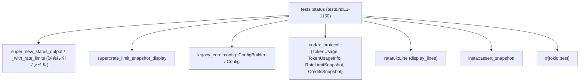
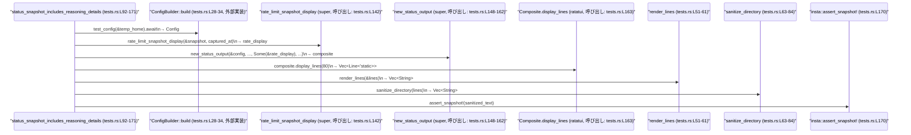

# tui/src/status/tests.rs

## 0. ざっくり一言

`tui/src/status/tests.rs` は、TUI ステータスカードを生成する関数群（`new_status_output` など）の表示内容を、スナップショットテストと補助ユーティリティで検証するモジュールです（tests.rs:L1-1150）。

---

## 1. このモジュールの役割

### 1.1 概要

- このモジュールは、TUI 上の「ステータス表示カード」が **期待どおりのテキストを描画しているか** を検証するためのテスト群を提供します（tests.rs:L92-1150）。
- レートリミット・クレジット残高・コンテキストウィンドウ使用量・パーミッション設定・スレッドの fork 元などが、出力に正しく反映されることを確認します。
- スナップショットテストに依存しつつ、環境依存（ディレクトリパス、Windows のパス区切り）の差分を吸収する補助関数を持ちます（tests.rs:L51-84）。

### 1.2 アーキテクチャ内での位置づけ

このモジュールは「tui::status」モジュールの **テスト専用サブモジュール** であり、実装は `super` からインポートされた関数に依存しています。

- 依存元（このファイル）:
  - `new_status_output` / `new_status_output_with_rate_limits`（ステータスカード生成; super から import, tests.rs:L1-3）
  - `rate_limit_snapshot_display`（RateLimitSnapshot を描画用に整形; tests.rs:L3）
- 主要な外部依存:
  - `Config` / `ConfigBuilder`（設定ロード; tests.rs:L5-6）
  - `TokenUsage` / `TokenUsageInfo`（トークン使用状況; tests.rs:L20-21）
  - `RateLimitSnapshot` / `RateLimitWindow` / `CreditsSnapshot`（レート制限とクレジット情報; tests.rs:L16-18）
  - `ratatui::prelude::*` の `Line` など（TUI 行表現; tests.rs:L24）
  - `insta::assert_snapshot!`（スナップショット検証; tests.rs:L22）
  - `tokio::test`（非同期テストランナー; tests.rs:L92, L173 など）

依存関係を簡略図で示します。



### 1.3 設計上のポイント

- **共通セットアップの関数化**  
  - `test_config` で `Config` の共通初期化を行い（tests.rs:L28-34）、ほとんどのテストから再利用しています。
  - `token_info_for` で `TokenUsageInfo` の構築を共通化し、モデルのコンテキストウィンドウもテストに織り込んでいます（tests.rs:L40-48）。

- **スナップショットテストの安定性確保**  
  - `render_lines` で `ratatui::Line<'static>` をプレーン文字列に変換（tests.rs:L51-61）。
  - `sanitize_directory` でディレクトリパスを `[[workspace]]` に置き換え、環境依存の差分を排除しています（tests.rs:L63-84）。
  - Windows のパス区切りを `/` に統一するため、`cfg!(windows)` 分岐を各テストで使用しています（例: tests.rs:L164-168）。

- **時間依存の安定化**  
  - `reset_at_from` で `captured_at` から相対秒数を加えた UTC タイムスタンプを生成し（tests.rs:L86-90）、レートリミット窓の reset 時刻を決定します。

- **エラーハンドリング方針**  
  - `ConfigBuilder::build().await.expect("load config")` など、テストでは `expect` による即座の panic を許容しています（tests.rs:L28-34）。
  - スナップショット検証も `assert_snapshot!` / `assert_eq!` / `assert!` により、条件不一致時にテストが失敗する設計です。

- **非同期・並行性**  
  - すべてのテストは `#[tokio::test]` で非同期に書かれていますが、各テスト内で並列タスクを明示的に起動している箇所はなく、処理は直列に進みます（例: tests.rs:L92, L173）。
  - 共有ミュータブル状態は扱っておらず、スレッド安全性に関する考慮は主に外部モジュールの責務です。

---

## 2. 主要な機能・コンポーネント一覧

### 2.1 コンポーネントインベントリー（関数一覧）

このファイル内の関数（補助関数 + テスト関数）を一覧化します。

| 名前 | 種別 | 役割 / 概要 | 行範囲 |
|------|------|------------|--------|
| `test_config` | 補助 | `TempDir` を基に `ConfigBuilder` で `Config` を非同期構築 | tests.rs:L28-34 |
| `test_status_account_display` | 補助 | アカウント情報を持たないことを表す `None` を返す | tests.rs:L36-38 |
| `token_info_for` | 補助 | モデル情報と `TokenUsage` から `TokenUsageInfo` を構築 | tests.rs:L40-48 |
| `render_lines` | 補助 | `Vec<Line<'static>>` を `Vec<String>` に変換（span 結合） | tests.rs:L51-61 |
| `sanitize_directory` | 補助 | 行中の `Directory: ... │` を `[[workspace]]` に置換 | tests.rs:L63-84 |
| `reset_at_from` | 補助 | ローカル時刻 + 秒 → UTC タイムスタンプ（i64）に変換 | tests.rs:L86-90 |
| `status_snapshot_includes_reasoning_details` | テスト | 推論詳細・レートリミット・ワークスペースパスなどを含む出力のスナップショット検証 | tests.rs:L92-171 |
| `status_permissions_non_default_workspace_write_is_custom` | テスト | 非デフォルトの workspace-write + approval 設定が "Custom ..." と表示されることの検証 | tests.rs:L173-236 |
| `status_snapshot_includes_forked_from` | テスト | セッション ID と `forked_from` がステータス出力に含まれることのスナップショット検証 | tests.rs:L238-290 |
| `status_snapshot_includes_monthly_limit` | テスト | 月次レートリミット窓（約 30 日）の表示内容のスナップショット検証 | tests.rs:L292-351 |
| `status_snapshot_shows_unlimited_credits` | テスト | `unlimited` なクレジットが "Credits: Unlimited" と表示されることを検証 | tests.rs:L354-401 |
| `status_snapshot_shows_positive_credits` | テスト | 正のクレジット残高が四捨五入されて表示されること（"13 credits"）を検証 | tests.rs:L403-449 |
| `status_snapshot_hides_zero_credits` | テスト | 残高 0 のクレジットは非表示になることを検証 | tests.rs:L452-497 |
| `status_snapshot_hides_when_has_no_credits_flag` | テスト | `has_credits=false` の場合は "Credits:" 行が表示されないことを検証 | tests.rs:L499-544 |
| `status_card_token_usage_excludes_cached_tokens` | テスト | ステータスカードで cached tokens が表示されないことを検証 | tests.rs:L546-590 |
| `status_snapshot_truncates_in_narrow_terminal` | テスト | 幅の狭いターミナル（width=70）での出力が適切に切り詰められるかをスナップショットで検証 | tests.rs:L592-655 |
| `status_snapshot_shows_missing_limits_message` | テスト | レートリミット情報が取得できない場合のメッセージ表示をスナップショットで検証 | tests.rs:L657-703 |
| `status_snapshot_shows_refreshing_limits_notice` | テスト | `refreshing_rate_limits=true` かつ限度情報ありの通知メッセージをスナップショットで検証 | tests.rs:L705-767 |
| `status_snapshot_includes_credits_and_limits` | テスト | レートリミットとクレジットの両方を同時に表示する場合のスナップショット検証 | tests.rs:L769-836 |
| `status_snapshot_shows_unavailable_limits_message` | テスト | レートリミット情報がまったくない場合の "unavailable" メッセージ表示のスナップショット検証 | tests.rs:L838-893 |
| `status_snapshot_treats_refreshing_empty_limits_as_unavailable` | テスト | `refreshing_rate_limits=true` でも空の限度情報は unavailable と同じ扱いになることのスナップショット検証 | tests.rs:L895-950 |
| `status_snapshot_shows_stale_limits_message` | テスト | `captured_at` から一定時間経過した「古い」限度情報に対する警告表示をスナップショットで検証 | tests.rs:L952-1015 |
| `status_snapshot_cached_limits_hide_credits_without_flag` | テスト | `has_credits=false` のキャッシュ済み限度情報ではクレジットを表示しないことのスナップショット検証 | tests.rs:L1018-1085 |
| `status_context_window_uses_last_usage` | テスト | コンテキストウィンドウ使用量表示が総計ではなく「最後のリクエスト」の利用トークン数を使うことの検証 | tests.rs:L1088-1150 |

### 2.2 主要な機能（観点別）

- レートリミット表示検証
  - 単一窓・二重窓・月次窓・欠損・取得中（refreshing）・古い（stale）など多様なパターン（tests.rs:L92-171, L292-351, L657-767, L838-1015）。
- クレジット表示検証
  - unlimited, 正の残高（丸め処理）, 0 残高, `has_credits=false` の場合など（tests.rs:L354-544, L769-836, L1018-1085）。
- 利用トークン数とコンテキストウィンドウ
  - cached トークンが非表示になること（tests.rs:L546-590）。
  - コンテキストウィンドウが `last_token_usage` を基準に表示されること（tests.rs:L1088-1150）。
- パーミッション・セッション情報
  - workspace-write + network access + approval policy の組み合わせから "Permissions: Custom ..." を生成する部分の検証（tests.rs:L173-236）。
  - Forked セッション ID の表示（tests.rs:L238-290）。
- レイアウト・環境依存対策
  - ターミナル幅による切り詰め（tests.rs:L592-655）。
  - ディレクトリパスのサニタイズと Windows パス区切りの正規化（tests.rs:L63-84, L164-168 など）。

---

## 3. 公開 API と詳細解説

### 3.1 このファイルで定義される型

このファイル内で **新たに定義される構造体・列挙体などはありません**。

テスト内で使用している主な外部型（参考情報）:

| 型名 | 所属モジュール | 用途 | 根拠 |
|------|----------------|------|------|
| `Config`, `ConfigBuilder` | `crate::legacy_core::config` | ステータス出力に利用する設定の保持と構築 | tests.rs:L5-6, L28-34 |
| `StatusAccountDisplay` | `crate::status` | アカウント情報表示用のデータ構造（テストでは常に `None`） | tests.rs:L7, L113-120 |
| `TokenUsage`, `TokenUsageInfo` | `codex_protocol::protocol` | モデルのトークン使用量・コンテキストウィンドウ情報 | tests.rs:L20-21, L40-48 |
| `RateLimitSnapshot`, `RateLimitWindow`, `CreditsSnapshot` | `codex_protocol::protocol` | レートリミットとクレジット残高のスナップショット | tests.rs:L16-18, L126-141, L364-375 など |
| `ReasoningSummary`, `ReasoningEffort` | `codex_protocol::{config_types, openai_models}` | 推論モードの要約種別・推論強度設定 | tests.rs:L13-14, L98, L147 |
| `SandboxPolicy`, `AskForApproval` | `codex_protocol::protocol` | サンドボックス / 承認ポリシー設定 | tests.rs:L15, L19, L99-109, L180-193 |
| `ThreadId` | `codex_protocol` | セッションおよび fork 元スレッド ID | tests.rs:L12, L262-265 |
| `Line<'static>` | `ratatui::prelude` | TUI における 1 行分の表示要素 | tests.rs:L24, L51-61 |

### 3.2 関数詳細（主要 7 件）

#### `test_config(temp_home: &TempDir) -> Config`

**概要**

- 一時ディレクトリを指す `TempDir` を受け取り、`ConfigBuilder` から `Config` を非同期に生成する補助関数です（tests.rs:L28-34）。
- すべてのテストで共通となる基本設定を提供します。

**引数**

| 引数名 | 型 | 説明 |
|--------|----|------|
| `temp_home` | `&TempDir` | 設定ファイル群を配置するルートディレクトリ。`TempDir` はテストごとに作成される一時ディレクトリです。 |

**戻り値**

- `Config`  
  テストで使用される設定オブジェクト。`codex_home` が `temp_home` 下に設定されています。

**内部処理の流れ**

1. `ConfigBuilder::default()` でビルダを生成（tests.rs:L29）。
2. `.codex_home(temp_home.path().to_path_buf())` でホームディレクトリを設定（tests.rs:L30）。
3. `.build().await` で非同期に設定をロード・構築（tests.rs:L31-32）。
4. `.expect("load config")` でエラー時に panic（tests.rs:L33）。

**Examples（使用例）**

```rust
// TempDir を作成してから Config を構築する                     // 一時ディレクトリを用意
let temp_home = TempDir::new().expect("temp home");            // OS の一時ディレクトリに新しいディレクトリを作る
let config = test_config(&temp_home).await;                    // 非同期に Config を構築
// 以降、config を new_status_output などに渡して使う          // ステータス出力のテストで利用
```

**Errors / Panics**

- `ConfigBuilder::build` が `Err` を返した場合、`expect("load config")` によりテストは panic します（tests.rs:L33）。
- テストコードなので、設定ロード失敗を即座に検出する目的で panic を許容しています。

**Edge cases（エッジケース）**

- `temp_home` が指すディレクトリが存在しない / アクセス不可の場合、内部でエラーとなり panic します。コード上では特別なハンドリングはありません。
- `ConfigBuilder` 内でどのような既定値が設定されるかはこのチャンクには出てこないため不明です。

**使用上の注意点**

- プロダクションコードからこの関数を使うべきではなく、**テスト専用の簡易セットアップ**として位置づけられています。
- 常に `await` が必要なため、`#[tokio::test]` のような非同期テストコンテキストで呼び出す前提です。

---

#### `token_info_for(model_slug: &str, config: &Config, usage: &TokenUsage) -> TokenUsageInfo`

**概要**

- オフラインモデル情報からコンテキストウィンドウサイズを取得し、引数で渡された `TokenUsage` を基に `TokenUsageInfo` を構築する補助関数です（tests.rs:L40-48）。
- `total_token_usage` と `last_token_usage` に同じ `usage` を設定しているため、「最後のリクエスト = 累積利用」の前提でテストを行う際に利用されます。

**引数**

| 引数名 | 型 | 説明 |
|--------|----|------|
| `model_slug` | `&str` | モデルを識別するスラッグ。`get_model_offline` から取得された値を想定（tests.rs:L144, L145）。 |
| `config` | `&Config` | モデル情報取得の際に利用される設定。 |
| `usage` | `&TokenUsage` | トークン使用量（入力/出力/推論/キャッシュなど）のスナップショット。 |

**戻り値**

- `TokenUsageInfo`  
  - `total_token_usage`: `usage.clone()`（tests.rs:L45）  
  - `last_token_usage`: `usage.clone()`（tests.rs:L46）  
  - `model_context_window`: `construct_model_info_offline(...).context_window`（tests.rs:L41-43）

**内部処理の流れ**

1. `construct_model_info_offline(model_slug, config)` を呼び出し、オフラインのモデル情報を取得（tests.rs:L41-42）。
2. 結果から `context_window` フィールドのみを取り出す（tests.rs:L42-43）。
3. `TokenUsageInfo` を構築し、`total_token_usage` と `last_token_usage` の両方に `usage.clone()` をセット（tests.rs:L45-47）。

**Examples（使用例）**

```rust
let model_slug = crate::legacy_core::test_support::get_model_offline(config.model.as_deref()); // モデルスラッグ取得
let usage = TokenUsage::default();                                                             // デフォルト使用量
let token_info = token_info_for(&model_slug, &config, &usage);                                 // TokenUsageInfo 生成
// token_info を new_status_output に渡して、コンテキストウィンドウ表示をテストする
```

**Errors / Panics**

- `construct_model_info_offline` の定義はこのチャンクにはありませんが、内部でエラーが発生した場合の扱いは不明です。
- この関数内で `expect` や `unwrap` は使用していないため、直接的な panic 要因はありません（tests.rs:L40-48）。

**Edge cases（エッジケース）**

- `usage` の各フィールドが 0 の場合も、そのまま 0 が `TokenUsageInfo` に入ります。
- `config` にモデル情報が存在しない場合、`construct_model_info_offline` がどう振る舞うかはこのチャンクには現れないため不明です。

**使用上の注意点**

- テストでは「最後のリクエスト使用量 = 累積使用量」という単純な前提を置くため、`last_token_usage` と `total_token_usage` を同一にしています。  
  - `status_context_window_uses_last_usage` では、この前提を崩すために `TokenUsageInfo` を手動で構築しており、この関数は使っていません（tests.rs:L1115-1120）。

---

#### `render_lines(lines: &[Line<'static>]) -> Vec<String>`

**概要**

- `ratatui::Line<'static>` の配列を、行ごとのテキスト `Vec<String>` に変換する関数です（tests.rs:L51-61）。
- スナップショット比較のために、TUI コンポーネントをプレーン文字列に落とし込む役割を持ちます。

**引数**

| 引数名 | 型 | 説明 |
|--------|----|------|
| `lines` | `&[Line<'static>]` | `display_lines(width)` の戻り値として得られる TUI 行のスライス。 |

**戻り値**

- `Vec<String>`  
  各 `Line` 内の `spans` の `content` を結合した行テキストの配列。

**内部処理の流れ**

1. `lines.iter()` で各行を順に処理（tests.rs:L52-53）。
2. 各 `line` について `line.spans.iter()` で span を巡回し、`span.content.as_ref()` を収集（tests.rs:L55-58）。
3. 各 span の内容を `collect::<String>()` で連結し、1 行の `String` にする（tests.rs:L58）。
4. すべての行に対してこの処理を行い、`Vec<String>` として返却（tests.rs:L60）。

**Examples（使用例）**

```rust
// composite.display_lines から文字列ベクタに変換する                  // ステータスカードの行を取得
let lines: Vec<Line<'static>> = composite.display_lines(80);         // 幅 80 で表示行を生成
let rendered: Vec<String> = render_lines(&lines);                    // 各行のテキストのみ抽出
```

**Errors / Panics**

- `Line` や `Span` の構造に依存する処理ですが、`Option` や `Result` は用いておらず、通常のイテレーションのみのため、この関数自体が panic する要素はありません。

**Edge cases（エッジケース）**

- `lines` が空スライスの場合、空の `Vec<String>` を返します。
- 各行の `spans` が空の `Line` であっても、`collect::<String>()` により空文字列 `""` の行が生成されます。

**使用上の注意点**

- 色やスタイルなどのメタ情報はすべて破棄され、純粋なテキストのみが残ります。  
  スナップショットテストではこの挙動が前提です。
- `Line<'static>` であることから、`display_lines` 側で `'static` ライフタイムを満たす設計になっている必要があります。

---

#### `sanitize_directory(lines: Vec<String>) -> Vec<String>`

**概要**

- スナップショットの安定性のために、行中のディレクトリパス部分を固定文字列 `[[workspace]]` に置き換える関数です（tests.rs:L63-84）。
- `"Directory: "` 以降、行末に近い `│`（罫線）の直前までを対象に置き換えます。

**引数**

| 引数名 | 型 | 説明 |
|--------|----|------|
| `lines` | `Vec<String>` | レンダリング後の各行テキスト。所有権を受け取り、変換後のベクタを返します。 |

**戻り値**

- `Vec<String>`  
  ディレクトリ部分が `[[workspace]]` に置き換えられたテキスト行の配列。

**内部処理の流れ**

1. `lines.into_iter()` で各行の `String` の所有権を受け取る（tests.rs:L64-65）。
2. 各 `line` について、`line.find("Directory: ")` と `line.rfind('│')` を実行（tests.rs:L67）。
3. 両方 `Some` の場合のみ、以下の置換を実行:
   - `dir_pos + "Directory: ".len()` を起点とする prefix を保持（tests.rs:L68）。
   - `pipe_idx` から末尾までを suffix として保持（tests.rs:L69）。
   - content 幅を `pipe_idx - (dir_pos + len)` として計算し、その幅に合わせて `[[workspace]]` とスペースを構成（tests.rs:L70-76）。
   - prefix + replacement + suffix を結合して新しい行を生成（tests.rs:L72-77）。
4. 条件を満たさない行はそのまま返す（tests.rs:L79-81）。

**Examples（使用例）**

```rust
let rendered_lines = render_lines(&composite.display_lines(80));    // TUI 行からテキストへ
let sanitized_lines = sanitize_directory(rendered_lines);           // Directory パスを [[workspace]] に差し替え
let snapshot_text = sanitized_lines.join("\n");                     // スナップショット用の 1 つの文字列に結合
```

**Errors / Panics**

- インデックス計算には `saturating_sub` を利用しており、負値が発生しないよう配慮されています（tests.rs:L70）。
- `find` / `rfind` による `Option` は `if let` で安全に扱われており、`unwrap` などによる panic の可能性はありません。

**Edge cases（エッジケース）**

- 行に `"Directory: "` が含まれない場合、変換は行われず元の行が返されます。
- 行に `│` が含まれない場合も変換は行われません（tests.rs:L67-81）。
- `"Directory: "` より後に `│` が存在しない場合、`rfind` の結果が `Some` でも `content_width` が 0 になる可能性がありますが、その場合も `replacement` がそのまま入り、レイアウトは崩れないようになっています。

**使用上の注意点**

- 出力フォーマットに依存した実装です。`Directory:` のラベルや罫線文字が変更されると、サニタイズが効かなくなり、スナップショットが環境依存になる可能性があります。
- Windows 上でのパス区切り (`\`) は各テストごとの `cfg!(windows)` ブロックで `/` に置換されてから `sanitize_directory` が呼ばれます（tests.rs:L164-168 など）。

---

#### `reset_at_from(captured_at: &chrono::DateTime<chrono::Local>, seconds: i64) -> i64`

**概要**

- ローカルタイムゾーンの `captured_at` に `seconds` 秒を加算し、その結果を UTC に変換した POSIX タイムスタンプ（秒）を返す関数です（tests.rs:L86-90）。
- レートリミット窓の `resets_at` を構築するために使用されています。

**引数**

| 引数名 | 型 | 説明 |
|--------|----|------|
| `captured_at` | `&DateTime<Local>` | レートリミット情報が取得されたローカル日時。 |
| `seconds` | `i64` | `captured_at` からの相対秒数。 |

**戻り値**

- `i64`  
  `(captured_at + seconds)` を UTC に変換したときの `.timestamp()`（秒単位）。

**内部処理の流れ**

1. `*captured_at + ChronoDuration::seconds(seconds)` でローカル時刻に秒数を加算（tests.rs:L87）。
2. `.with_timezone(&Utc)` で UTC 時刻に変換（tests.rs:L88）。
3. `.timestamp()` で POSIX タイムスタンプ（秒）を取得し返却（tests.rs:L88-89）。

**Examples（使用例）**

```rust
let captured_at = chrono::Local
    .with_ymd_and_hms(2024, 1, 2, 3, 4, 5)
    .single()
    .expect("timestamp");                                         // 2024-01-02T03:04:05 Local

let resets_at = reset_at_from(&captured_at, 600);                 // 600 秒後の UTC タイムスタンプ
let primary_window = RateLimitWindow {
    used_percent: 72.5,
    window_minutes: Some(300),
    resets_at: Some(resets_at),
};
```

**Errors / Panics**

- `chrono` の `+` 演算子や `with_timezone`、`timestamp` は通常の範囲内の日時であれば panic しません。
- `captured_at` の生成時に `.single().expect("timestamp")` を使っているため、日時が不正な場合はそこで panic しますが、`reset_at_from` 自体は安全です（tests.rs:L122-125 など）。

**Edge cases（エッジケース）**

- `seconds` が負の値でも、`ChronoDuration::seconds` は負の時間として計算され、過去のタイムスタンプが返されます。
- 非常に大きな正負の値を与えると、内部で overflow が発生しうるかどうかは `chrono` の実装に依存しますが、このテストでは数千秒程度にとどまっています（例: 600, 1200, 86400 など; tests.rs:L132, L137, L319）。

**使用上の注意点**

- この関数はローカル時刻を入力とし、UTC に正規化した値を返すため、タイムゾーン依存の差異を吸収できます。
- `RateLimitWindow` の `resets_at` は `Option<i64>` であり、この関数の戻り値をラップして利用しています（tests.rs:L132-133, L137-138 など）。

---

#### `status_snapshot_includes_reasoning_details()`

**概要**

- 推論詳細（`ReasoningSummary::Detailed`）、`ReasoningEffort::High`、レートリミット窓、ワークスペースディレクトリなどが、ステータスカード出力に含まれていることをスナップショットで検証するテストです（tests.rs:L92-171）。

**引数**

- なし（`#[tokio::test]` で実行される非同期テスト関数）。

**戻り値**

- `()`（テストの成否のみが重要）。

**内部処理の流れ**

1. `TempDir` を生成し、`test_config` で `Config` を作成（tests.rs:L94-95）。
2. `config.model`, `config.model_provider_id`, `config.model_reasoning_summary` を設定（tests.rs:L96-98）。
3. `SandboxPolicy::WorkspaceWrite { ... }` を設定し、サンドボックスポリシーを更新（tests.rs:L99-109）。
4. `config.cwd` に `/workspace/tests` の絶対パスを設定（`PathBufExt::abs` 使用; tests.rs:L111）。
5. `TokenUsage` を明示値で構築（推論トークンを含む; tests.rs:L114-120）。
6. `captured_at` を固定日時で生成（tests.rs:L122-125）。
7. `RateLimitSnapshot` を primary/secondary 両方含む形で構築し、`rate_limit_snapshot_display` に渡す（tests.rs:L126-142）。
8. `model_slug` と `token_info` を取得（tests.rs:L144-145）。
9. `reasoning_effort_override = Some(Some(ReasoningEffort::High))` を設定（tests.rs:L147）。
10. `new_status_output` を呼び出し、`composite` を取得（tests.rs:L148-162）。
11. `display_lines(80)` → `render_lines` でテキスト行に変換（tests.rs:L163-163）。
12. Windows の場合はパス区切りを `/` に置換（tests.rs:L164-168）。
13. `sanitize_directory` でディレクトリを `[[workspace]]` に置換し、行を `\n` で結合（tests.rs:L169）。
14. `assert_snapshot!(sanitized)` でスナップショットと比較（tests.rs:L170）。

**Examples（使用例）**

テスト関数自体が使用例になっていますが、新しいシナリオを追加する場合はこれをテンプレートとして利用できます。

```rust
#[tokio::test]
async fn status_snapshot_includes_new_field() {
    let temp_home = TempDir::new().expect("temp home");            // 一時ディレクトリ
    let mut config = test_config(&temp_home).await;                // 共通 Config セットアップ
    // ... config に新しいフィールドを設定 ...
    let usage = TokenUsage::default();                             // 使用量
    let captured_at = chrono::Local::now();                        // 固定したい場合は with_ymd_and_hms を使う

    let snapshot = /* 新しい RateLimitSnapshot を構築 */;

    let rate_display = rate_limit_snapshot_display(&snapshot, captured_at);
    let model_slug = crate::legacy_core::test_support::get_model_offline(config.model.as_deref());
    let token_info = token_info_for(&model_slug, &config, &usage);

    let composite = new_status_output(
        &config,
        None,
        Some(&token_info),
        &usage,
        &None,
        None,
        None,
        Some(&rate_display),
        None,
        captured_at,
        &model_slug,
        None,
        None,
    );

    let mut rendered_lines = render_lines(&composite.display_lines(80));
    if cfg!(windows) {
        for line in &mut rendered_lines {
            *line = line.replace('\\', "/");
        }
    }
    let sanitized = sanitize_directory(rendered_lines).join("\n");
    assert_snapshot!(sanitized);                                   // 新しいスナップショットを作成・検証
}
```

**Errors / Panics**

- `test_config(&temp_home).await` 内の `expect("load config")` により、設定ロード失敗時に panic します。
- `with_ymd_and_hms(...).single().expect("timestamp")` で不正な日時の場合に panic します（tests.rs:L122-125）。
- `SandboxPolicy::set(...)` が `Err` を返した場合、`expect("set sandbox policy")` で panic します（tests.rs:L109）。
- `assert_snapshot!` の比較失敗時にはテストが失敗します。

**Edge cases（エッジケース）**

- `account_display` が `None`（`test_status_account_display` の戻り値）であるため、アカウント情報表示がないケースの検証です（tests.rs:L113）。
- `sandbox_policy` の `network_access: false` や `writable_roots: Vec::new()` など、かなり制限されたポリシーで status 出力を検証しています（tests.rs:L102-107）。

**使用上の注意点**

- スナップショットには多くの要素が含まれるため、実装変更で **1 行でも変わるとテストが落ちる** ことに注意が必要です。
- 新しい情報を出力に追加した場合は、このテストのスナップショットを更新する必要があります。

---

#### `status_context_window_uses_last_usage()`

**概要**

- ステータスカードの「Context window」表示が、トータルのトークン使用量ではなく **最後のリクエストの使用量** (`last_token_usage.total_tokens`) を基準にしていることを検証するテストです（tests.rs:L1088-1150）。

**引数**

- なし（非同期テスト）。

**戻り値**

- `()`（テストの成否）。

**内部処理の流れ**

1. `TempDir` と `Config` を初期化し、`config.model_context_window = Some(272_000)` を設定（tests.rs:L1090-1092）。
2. `total_usage` と `last_usage` を異なる `total_tokens` 値で構築（102,000 vs 13,679; tests.rs:L1095-1108）。
3. `now` を固定日時で生成（tests.rs:L1110-1113）。
4. `model_slug` を取得（tests.rs:L1115）。
5. `TokenUsageInfo` を手動で構築し、`total_token_usage` に `total_usage.clone()`, `last_token_usage` に `last_usage` を設定（tests.rs:L1116-1120）。
6. `new_status_output` に `&total_usage`（合計使用量）と `token_info` を渡して composite を生成（tests.rs:L1121-1135）。
7. `display_lines(80)` と `render_lines` でテキストに変換（tests.rs:L1136）。
8. `"Context window"` を含む行を探す（tests.rs:L1137-1140）。
9. 行が `"13.7K used / 272K"` を含むこと、かつ `"102K"` を含まないことを `assert!` で検証（tests.rs:L1142-1149）。

**Errors / Panics**

- `test_config`, `with_ymd_and_hms(...).expect("timestamp")` による panic 可能性は前述と同様です。
- `"Context window"` を含む行が見つからない場合、`.expect("context line")` で panic します（tests.rs:L1139-1140）。
- `assert!` 条件不一致時にテストは失敗します（tests.rs:L1142-1148）。

**Edge cases（エッジケース）**

- `total_token_usage` と `last_token_usage` が異なるという前提の下、表示がどちらの値に基づくかを明示的に検証しています。
- 表示形式は `"13.7K used / 272K"` のように四捨五入＆K 単位の表記です。このフォーマットが変わるとテストも更新が必要になります。

**使用上の注意点**

- `TokenUsageInfo` を手動で構築することで `token_info_for` の既定挙動（両方同じ usage）から意図的に逸脱している点が、このテストのポイントです。
- コンテキストウィンドウ表示ロジックを変更する際には、まずこのテストを確認し、必要に応じて期待値や表記を更新する必要があります。

---

### 3.3 その他の関数（テストケース要約）

上記で詳細説明しなかったテスト関数の役割をまとめます。

| 関数名 | 役割（1 行） | 行範囲 |
|--------|--------------|--------|
| `status_permissions_non_default_workspace_write_is_custom` | 非デフォルトの sandbox/approval 設定が "Custom (workspace-write with network access, on-request)" と表示されるか検証 | tests.rs:L173-236 |
| `status_snapshot_includes_forked_from` | `ThreadId` と `forked_from` がステータスのどこかに反映されることをスナップショットで検証 | tests.rs:L238-290 |
| `status_snapshot_includes_monthly_limit` | 約 30 日の `window_minutes` を持つレートリミットの表示内容をスナップショットで検証 | tests.rs:L292-351 |
| `status_snapshot_shows_unlimited_credits` | `credits.unlimited=true` かつ `has_credits=true` のとき "Credits: Unlimited" と表示されることを検証 | tests.rs:L354-401 |
| `status_snapshot_shows_positive_credits` | `balance="12.5"` が丸められて "13 credits" と表示されることを検証 | tests.rs:L403-449 |
| `status_snapshot_hides_zero_credits` | `balance="0"` の場合に "Credits:" 行が一切出力されないことを確認 | tests.rs:L452-497 |
| `status_snapshot_hides_when_has_no_credits_flag` | `has_credits=false` の場合に "Credits:" 行が出力されないことを確認 | tests.rs:L499-544 |
| `status_card_token_usage_excludes_cached_tokens` | ステータスカードのどの行にも "cached" という文字列が現れないことを確認 | tests.rs:L546-590 |
| `status_snapshot_truncates_in_narrow_terminal` | 幅 70 のターミナルでの出力が適切に切り詰められるかをスナップショットで検証 | tests.rs:L592-655 |
| `status_snapshot_shows_missing_limits_message` | レートリミット情報がまったく渡されない場合のメッセージ表示をスナップショットで検証 | tests.rs:L657-703 |
| `status_snapshot_shows_refreshing_limits_notice` | 限度情報がありつつ `refreshing_rate_limits=true` のときの「リフレッシュ中」メッセージを検証 | tests.rs:L705-767 |
| `status_snapshot_includes_credits_and_limits` | レートリミットとクレジットの両方が同時に表示されるケースのスナップショット検証 | tests.rs:L769-836 |
| `status_snapshot_shows_unavailable_limits_message` | `RateLimitSnapshot` が完全に空（primary/secondary/credits すべて None）のときの "unavailable" メッセージを検証 | tests.rs:L838-893 |
| `status_snapshot_treats_refreshing_empty_limits_as_unavailable` | `refreshing_rate_limits=true` でも空の限度情報は unavailable と同様に扱われることを検証 | tests.rs:L895-950 |
| `status_snapshot_shows_stale_limits_message` | レートリミット `captured_at` から 20 分経過した状態で「古い情報」警告メッセージが出るかを検証 | tests.rs:L952-1015 |
| `status_snapshot_cached_limits_hide_credits_without_flag` | キャッシュされた limits で `has_credits=false` の場合はクレジット情報を隠す挙動を検証 | tests.rs:L1018-1085 |

---

## 4. データフロー

ここでは典型的なフローとして `status_snapshot_includes_reasoning_details` の処理を取り上げます（tests.rs:L92-171）。

### 4.1 処理の要点

- テストは以下のステップでデータを流します:
  1. 一時ディレクトリから `Config` を構築。
  2. `Config` とトークン使用量・レートリミット・推論関連設定を組み合わせて `new_status_output` を呼び出す。
  3. 生成された TUI コンポーネントから `display_lines(width)` で行を取得。
  4. `render_lines` と `sanitize_directory` を通してプレーンテキストへ変換。
  5. `insta::assert_snapshot!` でスナップショットと比較。

### 4.2 シーケンス図



このフローは他のスナップショットテストでもほぼ共通であり、違いは `Config`・`TokenUsage`・`RateLimitSnapshot`・フラグ類の初期値にあります。

---

## 5. 使い方（How to Use）

このファイルはテスト専用ですが、「新しいステータス表示の仕様を追加したいときのテストの書き方」という観点で整理します。

### 5.1 基本的な使用方法（新しいテストケースの追加）

`new_status_output` に新しい情報を追加した場合のテストのひな形です。

```rust
#[tokio::test]                                                // tokio ランタイム上で動く非同期テスト
async fn status_snapshot_includes_new_feature() {
    let temp_home = TempDir::new().expect("temp home");       // 一時ホームディレクトリ
    let mut config = test_config(&temp_home).await;           // 基本 Config を準備（tests.rs:L28-34）

    // 必要に応じて config のフィールドを変更する                     // 新機能のための設定
    config.model = Some("gpt-5.1-codex-max".to_string());

    let account_display = test_status_account_display();      // 現状は None を返す（tests.rs:L36-38）
    let usage = TokenUsage::default();                       // トークン使用量（テスト用）

    let captured_at = chrono::Local::now();                   // スナップショット安定のため固定日時にすることが多い

    // 必要な RateLimitSnapshot や CreditsSnapshot を構築          // レートリミット情報を生成
    let snapshot = RateLimitSnapshot {
        limit_id: None,
        limit_name: None,
        primary: None,
        secondary: None,
        credits: None,
        plan_type: None,
    };
    let rate_display = rate_limit_snapshot_display(&snapshot, captured_at); // 描画用へ変換

    let model_slug =
        crate::legacy_core::test_support::get_model_offline(config.model.as_deref()); // モデルスラッグ取得
    let token_info = token_info_for(&model_slug, &config, &usage);                     // TokenUsageInfo 構築

    let composite = new_status_output(                            // ステータスカード生成
        &config,
        account_display.as_ref(),
        Some(&token_info),
        &usage,
        &None,
        None,
        None,
        Some(&rate_display),
        None,
        captured_at,
        &model_slug,
        None,
        None,
    );

    let mut rendered_lines = render_lines(&composite.display_lines(80)); // TUI 行を文字列に変換
    if cfg!(windows) {                                          // Windows ではパス区切りを統一
        for line in &mut rendered_lines {
            *line = line.replace('\\', "/");
        }
    }
    let sanitized = sanitize_directory(rendered_lines).join("\n"); // ディレクトリパスをマスク

    assert_snapshot!(sanitized);                                // 新機能を含むスナップショットを検証
}
```

### 5.2 よくある使用パターン

- **レートリミットなし / 取得中 / 古い情報のパターン**  
  - `new_status_output` + `rate_limit_snapshot_display` を用いて、限度情報の有無や新鮮さに応じたメッセージが出るかを検証する（tests.rs:L657-703, L705-767, L952-1015, L895-950）。

- **クレジット残高のバリエーション**  
  - `CreditsSnapshot` の `has_credits`, `unlimited`, `balance` を組み合わせて挙動を確認（tests.rs:L354-544, L769-836, L1018-1085）。

- **トークン使用量とコンテキストウィンドウ**  
  - `TokenUsageInfo` を調整し、context window の表示が想定どおりか検証（tests.rs:L1088-1150）。

### 5.3 よくある間違い

```rust
// 間違い例: ディレクトリサニタイズを忘れている
let rendered_lines = render_lines(&composite.display_lines(80));
let snapshot = rendered_lines.join("\n");
assert_snapshot!(snapshot);  // 環境ごとに CWD が異なりスナップショットが不安定

// 正しい例: sanitize_directory を通す
let mut rendered_lines = render_lines(&composite.display_lines(80));
if cfg!(windows) {
    for line in &mut rendered_lines {
        *line = line.replace('\\', "/");
    }
}
let sanitized = sanitize_directory(rendered_lines).join("\n");
assert_snapshot!(sanitized);
```

- **Windows 対応を忘れる**  
  - Windows 環境ではパス区切りが `\` になるため、`replace('\\', "/")` を挟まないとスナップショットが OS 依存になります（tests.rs:L164-168, L283-287 など）。

### 5.4 使用上の注意点（まとめ）

- **前提条件**
  - すべてのテストは `#[tokio::test]` により async 文脈で動作するため、`test_config` など async 関数が使えます。
  - `ConfigBuilder::build().await` に成功することが前提です。

- **禁止事項 / 注意事項**
  - スナップショットテストを OS やディレクトリに依存する形で書くと、CI や異なる環境での実行時に不安定になります。必ず `sanitize_directory` と Windows 用のパス置換を組み合わせる必要があります。
  - 出力フォーマット（ラベル文字列やスペース、罫線など）を **軽微に変更しても** スナップショットがすべて差分になるため、仕様変更時は意図的にスナップショットを更新する運用が必要です。

- **安全性・エラー**
  - `.expect()` / `assert!` / `assert_eq!` / `assert_snapshot!` により、条件不一致やエラーはすべてテスト失敗として扱われます。
  - 非同期処理のキャンセルやタイムアウトなどの高度なエラーケースは、このテスト群では扱っていません。

---

## 6. 変更の仕方（How to Modify）

### 6.1 新しい機能を追加する場合（ステータス出力に項目を追加）

1. **出力ロジックの追加**
   - 実際のステータス表示ロジック（`new_status_output` / `new_status_output_with_rate_limits` の定義）はこのチャンクにはありませんが、そこに新しいフィールドや行を追加します。

2. **テストケースの追加**
   - 本ファイルに新しい `#[tokio::test]` 関数を追加し、5.1 のパターンに従って設定・入力を準備します。
   - 既存テストを参考に、必要に応じて `RateLimitSnapshot` や `CreditsSnapshot`, `TokenUsageInfo` を構築します。

3. **スナップショットの更新**
   - 初回実行時には `insta` のワークフローに従って新しいスナップショットファイルを生成・確認します。

4. **関数インベントリーの更新**
   - ドキュメントを整備している場合、本レポートの 2.1 テーブルに新しいテストを追加するのが自然です。

### 6.2 既存の機能を変更する場合（仕様変更・リネームなど）

- **影響範囲の確認**
  - 出力フォーマットを変更した場合、本ファイルのスナップショットテスト（`assert_snapshot!` を使っているすべてのテスト）が影響を受けます（tests.rs:L92-171, L238-351, L592-767, L769-1015, L1018-1085）。
  - レートリミット / クレジット / コンテキストウィンドウ表示に関するロジック変更は、対応する個別テスト（3.3 の表）もすべて確認する必要があります。

- **契約（前提条件・返り値の意味）**
  - `status_context_window_uses_last_usage` など、特定の仕様（「コンテキストウィンドウは last usage ベース」など）を明示的にテストしている箇所は、仕様変更時にテストの期待値も合わせて更新する必要があります（tests.rs:L1088-1150）。
  - クレジット表示の条件（unlimited, balance=0, has_credits=false など）は、テストが **仕様の一部** を文書化していると解釈できます（tests.rs:L354-544, L769-836, L1018-1085）。

- **テスト更新の手順**
  - 仕様変更が意図したものであれば、`insta` のガイドに従ってスナップショットを再生成・承認します。
  - 一方、想定外の差分であれば、どの入力パターン（どのテストケース）で差分が起きているかを解析し、出力ロジックもしくはテスト入力を修正する必要があります。

---

## 7. 関連ファイル・モジュール

このテストモジュールと密接に関係するコンポーネントをまとめます。

| パス / モジュール | 役割 / 関係 |
|-------------------|------------|
| `super::new_status_output` | ステータスカード全体を構築する関数。テストの主対象ですが、定義ファイルはこのチャンクには現れません（tests.rs:L1, L148, L205 など）。 |
| `super::new_status_output_with_rate_limits` | 複数のレートリミット表示を扱うバリアント。`refreshing_rate_limits` フラグ付きのテストで利用（tests.rs:L2, L743-757, L926-940）。 |
| `super::rate_limit_snapshot_display` | `RateLimitSnapshot` を表示用の中間表現に変換する関数。ほぼすべてのレートリミット関連テストで利用（tests.rs:L3, L142, L325, L376 など）。 |
| `crate::legacy_core::config` | `Config` と `ConfigBuilder` を提供するモジュール。各テストで設定初期化に使用（tests.rs:L5-6, L28-34）。 |
| `crate::legacy_core::test_support` | `construct_model_info_offline` や `get_model_offline` などのオフラインテスト支援関数を提供（tests.rs:L41-43, L144, L203, L260 など）。 |
| `crate::status::StatusAccountDisplay` | アカウント情報の表示形式を定義する型。テストでは `None` のみ使用しているため、表示無しの挙動を検証（tests.rs:L7, L113, L197）。 |
| `crate::test_support::PathBufExt` | `PathBuf` を絶対パスに変換する拡張トレイト。CWD 表示を安定させるために使用（tests.rs:L8, L111, L195 など）。 |
| `codex_protocol::{TokenUsage, TokenUsageInfo, RateLimitSnapshot, CreditsSnapshot, SandboxPolicy, AskForApproval, ThreadId}` | ステータス表示に必要なドメインデータを提供するプロトコルモジュール群（tests.rs:L12-21）。 |
| `ratatui::prelude::Line` | ステータスカードの行表示を表現する UI コンポーネント。`display_lines` の戻り値として利用（tests.rs:L24, L51-61）。 |

---

## Bugs / Security / その他の観点

- **潜在的なバグ候補**
  - `use crate::history_cell::HistoryCell;` がこのチャンク内では使用されていません（tests.rs:L4）。将来的な利用のためか、不要な import の可能性があります。
  - `sanitize_directory` は `"Directory: "` と罫線 `│` の両方がある行にしか作用しないため、出力フォーマットが変わるとディレクトリパスがマスクされず、スナップショットが不安定になる可能性があります（tests.rs:L63-84）。

- **セキュリティ**
  - このファイルはテスト専用であり、外部から直接呼び出される API を定義していません。
  - `TempDir` による一時ディレクトリ利用のため、テスト実行後に残留データが残りにくい設計です。
  - サンドボックスやネットワークアクセスの設定はあくまで表示テストのためのシミュレーションであり、実際のセキュリティ実装は別モジュールにあります。

- **パフォーマンス / スケーラビリティ**
  - 各テストはコンフィグロード + ステータスカード生成 + スナップショット比較を行いますが、規模は小さく、単体テストレベルのオーバーヘッドに収まります。
  - `insta` ベースのスナップショットテストが多数あるため、出力フォーマットを頻繁に変えるとテストメンテナンスコストが増加する点には注意が必要です。

以上が、`tui/src/status/tests.rs` の構造と役割、そして実務でこのコードを理解・変更する際に役立つ情報の整理です。
