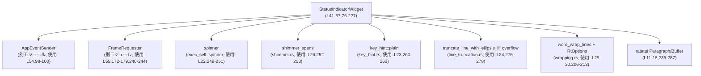

# tui/src/status_indicator_widget.rs

## 0. ざっくり一言

下部ペインの上に表示される「作業中ステータス行」と、その下に最大数行の詳細メッセージを描画するためのウィジェット実装です（`StatusIndicatorWidget`）。内部でスピナーと経過時間、割り込みヒント、任意の追加メッセージを管理します（`status_indicator_widget.rs:L41-57,235-287`）。

---

## 1. このモジュールの役割

### 1.1 概要

- このモジュールは、エージェントが処理中の間に表示される **1行のステータス表示と、その下の折り返し可能な詳細表示** を実装します（`L41-57`）。
- スピナーのアニメーション、経過時間の測定・フォーマット、割り込みヒント（`Esc`）、任意のインラインメッセージや詳細テキストを一体として管理します（`L51-56,98-100,108-135,197-227,235-287`）。
- 時間計測状態（停止・再開）とフレーム再描画のスケジューリングも内部で行い、アニメーション更新を制御します（`L51-53,L156-179,L240-244`）。

### 1.2 アーキテクチャ内での位置づけ

`StatusIndicatorWidget` を中心とした依存関係はおおよそ次の通りです。



- **外部連携**
  - 割り込み：`AppEventSender::interrupt` を呼び出してアプリケーションに割り込みイベントを送信します（`L54,98-100`）。
  - フレーム更新：`FrameRequester` を通じて即時または一定時間後の再描画を要求します（`L55,172-179,240-244`）。
- **描画補助**
  - スピナー：`spinner(Some(self.last_resume_at), self.animations_enabled)` でアニメーション用スパンを取得します（`L22,249-251`）。
  - ヘッダのシマー：`shimmer_spans(&self.header)` でヘッダ文字列に動きのある装飾を付けます（`L26,252-253`）。
  - キーヒント：`key_hint::plain(KeyCode::Esc)` を使い、割り込みキーのラベルを得ます（`L23,260-262`）。
  - 詳細ラップ：`RtOptions` と `word_wrap_lines` で詳細テキストを折り返します（`L29-30,206-213`）。
  - 行幅超過：`truncate_line_with_ellipsis_if_overflow` で1行ヘッダ行の末尾に省略記号を付けつつトリムします（`L24,275-278`）。
  - 実際の描画は ratatui の `Paragraph`・`Buffer`・`Rect` などを利用します（`L11-18,235-287`）。

### 1.3 設計上のポイント

- **状態管理**
  - 経過時間は `elapsed_running`（停止までに累積した時間）と `last_resume_at`（最後に再開した時刻）、`is_paused` フラグで管理されています（`L51-53`）。
  - 時間計測の更新は `pause_timer_at` / `resume_timer_at` / `elapsed_duration_at` を通じて一貫して行われ、`saturating_duration_since` により時間の逆行時も安全です（`L164-169,L172-187`）。
- **UI レイアウト**
  - 上部1行のヘッダ行＋下部複数行の詳細行という構造を前提に、高さは `desired_height` で自動計算されます（`L231-233`）。
  - 詳細行には prefix `"  └ "` を付け、Unicode 幅で正しく計算したうえで折り返し・省略処理を行います（`L32-33,L206-223`）。
- **エラーハンドリング**
  - パブリック API 内には `panic!` を発生させるコードはなく、型変換も `try_from().unwrap_or(0)` のように失敗時は安全なフォールバックを行います（`L231-233`）。
  - 時刻差分計算は `saturating_duration_since` を使い、`Instant` の前後関係に問題があっても 0 に丸められます（`L168,184`）。
- **並行性**
  - `StatusIndicatorWidget` 自体は `Send` / `Sync` を明示しておらず、内部に `AppEventSender` や `FrameRequester` を保持しますが、並行アクセス制御はこのファイルからは読み取れません（構造体フィールドのみ、`L41-57`）。
  - 割り込みは `&self` メソッドで送れるため、UI スレッドから安全にイベント発行できる設計になっています（`L98-100`）。
- **アニメーション**
  - `animations_enabled` フラグでアニメーションの有効・無効を完全に切り替えます（`L56,L240-244,L249-256`）。
  - 有効時のみ次フレームを 32ms 後にスケジュールし、スピナーやシマーを更新します（`L240-244`）。

---

## 2. 主要な機能一覧

- 経過時間のフォーマット: 秒数をコンパクトな人間向け文字列に変換（例: `"1m 05s"`, `"2h 03m 09s"`）（`fmt_elapsed_compact`, `L61-73`）。
- ステータスウィジェットの生成: スピナー・タイマー・割り込み送信・フレーム要求オブジェクトを束ねた `StatusIndicatorWidget` を構築（`new`, `L76-96`）。
- ヘッダ・詳細・インラインメッセージの更新: 表示テキストと最大行数の更新と前処理（トリム・先頭大文字化など）（`L102-135`）。
- 割り込み送信: `interrupt()` で `AppEventSender` に割り込みイベントを伝播（`L98-100`）。
- 経過時間タイマーの一時停止・再開: `pause_timer` / `resume_timer` と `*_at` 版でコントロール（`L156-179`）。
- 経過秒数の取得: 「今時点で何秒動作中か」を取得するパブリックメソッド（`elapsed_seconds`, `L193-195`）。
- 詳細テキストの折り返し・省略: `wrapped_details_lines` で prefix 付きの複数行 `Line` に整形し、最大行数を超えると最終行末尾に `…` を追加（`L197-227`）。
- 描画処理: `render` 実装でスピナー・ヘッダ・経過時間・割り込みヒント・インラインメッセージ・詳細行をまとめて `Paragraph` として描画（`L230-287`）。

---

## 3. 公開 API と詳細解説

### 3.1 型一覧（定数・構造体・列挙体）

| 名前 | 種別 | 役割 / 用途 | 定義位置 |
|------|------|-------------|----------|
| `STATUS_DETAILS_DEFAULT_MAX_LINES` | 定数 (`usize`) | 詳細テキスト行数のデフォルト上限（3行） | `L32` |
| `DETAILS_PREFIX` | 定数 (`&'static str`) | 詳細行の先頭に付与する接頭辞 `"  └ "` | `L33` |
| `StatusDetailsCapitalization` | 列挙体 | 詳細テキストの大文字化ポリシー（先頭だけ大文字 / そのまま）を指定 | `L35-39` |
| `StatusIndicatorWidget` | 構造体 | スピナー・タイマー・テキスト・割り込み送信・フレーム要求を内包したステータスウィジェット | `L41-57` |

`StatusIndicatorWidget` の主なフィールド：

- 表示テキスト関連
  - `header: String` – 上部1行のヘッダ（デフォルト `"Working"`）（`L43-44,L83`）
  - `details: Option<String>` – 下部詳細テキスト（`None` なら非表示）（`L45`）
  - `details_max_lines: usize` – 詳細行数の上限（最低1行に切り上げ）（`L46,L114`）
  - `inline_message: Option<String>` – 経過時間・割り込みヒントの後ろに表示する短いメッセージ（`L47-48`）
  - `show_interrupt_hint: bool` – 割り込みヒントを表示するかどうか（`L49,L147-149`）
- タイマー・制御関連
  - `elapsed_running: Duration` – 開始から一時停止までの累積時間（`L51`）
  - `last_resume_at: Instant` – 最後に再開した時刻（`L52`）
  - `is_paused: bool` – タイマー停止中かどうか（`L53`）
- 外部連携
  - `app_event_tx: AppEventSender` – 割り込みイベント送信用（`L54`）
  - `frame_requester: FrameRequester` – 再描画要求用（`L55`）
  - `animations_enabled: bool` – アニメーション機能の ON/OFF（`L56`）

### 3.2 主要関数詳細

#### 3.2.0 関数インベントリー（概要）

| 関数名 | 所属 | 概要 | 定義位置 |
|--------|------|------|----------|
| `fmt_elapsed_compact` | モジュール関数 | 秒数を `Xs`, `Ym ZZs`, `Hh MMm SSs` 形式に整形 | `L61-73` |
| `StatusIndicatorWidget::new` | impl | ウィジェットの初期化 | `L76-96` |
| `StatusIndicatorWidget::interrupt` | impl | 割り込みイベント送信 | `L98-100` |
| `StatusIndicatorWidget::update_details` | impl | 詳細テキストと上限行数の設定 | `L108-124` |
| `StatusIndicatorWidget::pause_timer_at` / `resume_timer_at` | impl | タイマーの停止・再開（テストしやすい形） | `L164-179` |
| `StatusIndicatorWidget::elapsed_seconds` | impl | 現在の経過秒数の取得 | `L193-195` |
| `StatusIndicatorWidget::render` | `Renderable` impl | ステータス行＋詳細行の描画 | `L235-287` |

以下では各関数をテンプレートに従って説明します。

---

#### `fmt_elapsed_compact(elapsed_secs: u64) -> String` （`status_indicator_widget.rs:L61-73`）

**概要**

- 経過秒数をコンパクトかつ人間に読みやすい形式の文字列に変換します。
- 秒単位（<60s）、分＋秒（<1h）、時間＋分＋秒（それ以上）の3パターンで表現します。

**引数**

| 引数名 | 型 | 説明 |
|--------|----|------|
| `elapsed_secs` | `u64` | 経過時間（秒単位）。0以上の整数。 |

**戻り値**

- `String` – フォーマットされた文字列。
  - 例: `"0s"`, `"59s"`, `"1m 00s"`, `"59m 59s"`, `"1h 00m 00s"`, `"25h 02m 03s"`（`L59-60,L304-314`）。

**内部処理の流れ**

1. `elapsed_secs < 60` の場合は `"Ns"` の形式で返す（`L62-63`）。
2. `elapsed_secs < 3600` の場合
   - 分 `minutes = elapsed_secs / 60` と秒 `seconds = elapsed_secs % 60` を計算（`L66-67`）。
   - `"Mm SSs"` 形式（秒は2桁ゼロ埋め）で返す（`L68`）。
3. それ以外（1時間以上）
   - 時 `hours`, 分 `minutes`, 秒 `seconds` を計算（`L70-72`）。
   - `"Hh MMm SSs"` 形式（分・秒は2桁ゼロ埋め）で返す（`L73`）。

**Examples（使用例）**

```rust
// 経過秒数をそれぞれの単位境界でフォーマットする例
assert_eq!(fmt_elapsed_compact(0), "0s");          // 60秒未満は単純に"Ns"
assert_eq!(fmt_elapsed_compact(61), "1m 01s");     // 1分1秒は"1m 01s"
assert_eq!(fmt_elapsed_compact(3600 + 2), "1h 00m 02s"); // 1時間2秒は"1h 00m 02s"
```

**Errors / Panics**

- エラーもパニックも発生しません。単純な整数演算と `format!` のみです（`L61-73`）。

**Edge cases（エッジケース）**

- `elapsed_secs = 0` → `"0s"`（`L62-63,L304`）。
- `elapsed_secs = 59` → `"59s"`（`L62-63,L307`）。
- `elapsed_secs = 60` → `"1m 00s"`（`L65-68,L308`）。
- 非常に大きな値（例: `25 * 3600 + 2 * 60 + 3`）も問題なく `"25h 02m 03s"` として扱われます（`L70-73,L314`）。

**使用上の注意点**

- 入力は「秒」単位であるため、`Duration` から渡す場合は `as_secs()` を使います（`render` 内での使用例 `elapsed_duration.as_secs()`、`L246-247`）。
- ローカライズや複雑な時間表現（例: 「1日」など）は行っていないため、必要な場合は別ラッパーを用意する必要があります。

---

#### `StatusIndicatorWidget::new(app_event_tx: AppEventSender, frame_requester: FrameRequester, animations_enabled: bool) -> Self` （`L76-96`）

**概要**

- `StatusIndicatorWidget` を初期化し、デフォルトの状態（ヘッダ `"Working"`、詳細なし、割り込みヒントあり、タイマー未経過）で返します（`L82-91`）。

**引数**

| 引数名 | 型 | 説明 |
|--------|----|------|
| `app_event_tx` | `AppEventSender` | 割り込みなどアプリケーションイベント送信用の送信ハンドル（`L78,92`）。 |
| `frame_requester` | `FrameRequester` | アニメーションのために追加フレームを要求するオブジェクト（`L79,93`）。 |
| `animations_enabled` | `bool` | スピナー・シマー・フレーム再スケジュールを有効化するかどうか（`L80,94`）。 |

**戻り値**

- `StatusIndicatorWidget` – 初期化済みウィジェットインスタンス。

**内部処理の流れ**

1. `header` を `"Working"` に設定（`L83`）。
2. `details` は `None`（非表示）、`details_max_lines` は `STATUS_DETAILS_DEFAULT_MAX_LINES`（3）で初期化（`L84-85`）。
3. インラインメッセージは `None`、割り込みヒントは表示 (`true`) に設定（`L86-87`）。
4. タイマー関連：
   - `elapsed_running = Duration::ZERO`（まだ経過時間なし）（`L88`）。
   - `last_resume_at = Instant::now()`（作成時刻を起点とする）（`L89`）。
   - `is_paused = false`（動作中扱い）（`L90`）。
5. 引数で渡された `app_event_tx` / `frame_requester` / `animations_enabled` を代入（`L92-95`）。

**Examples（使用例）**

```rust
use tokio::sync::mpsc::unbounded_channel;
use crate::app_event::AppEvent;
use crate::app_event_sender::AppEventSender;
use crate::tui::FrameRequester;

// アプリケーション側でイベントチャネルと FrameRequester を用意する例
let (tx_raw, _rx) = unbounded_channel::<AppEvent>();      // AppEvent 用チャネル
let app_event_tx = AppEventSender::new(tx_raw);           // 送信ハンドルをラップ
let frame_requester = /* アプリ共通の FrameRequester を取得 */ frame_requester;

// ステータスウィジェットを生成
let widget = StatusIndicatorWidget::new(
    app_event_tx,
    frame_requester,
    /*animations_enabled*/ true,
);
```

**Errors / Panics**

- パニックは発生しません。`Instant::now()` と単純なフィールド代入のみです（`L81-95`）。

**Edge cases**

- `animations_enabled = false` でも作成可能で、その場合はスピナーや再描画スケジュールが行われません（`L94,L240-253`）。
- `frame_requester` や `app_event_tx` が内部的に未初期化であった場合の挙動は、このチャンクには現れません（依存モジュール側の実装次第）。

**使用上の注意点**

- 一度生成したウィジェットは、通常 UI スレッド内でミュータブルに保持し、イベントに応じてテキストやタイマー状態を更新する前提と考えられます（`update_*`, `pause_timer_*` の存在から、`L102-135,L156-179`）。
- `FrameRequester` のライフサイクルはアプリケーション全体で共有される可能性が高いため、ここで渡すインスタンスはアプリ側で適切に管理されている必要があります（詳細はこのチャンクには現れません）。

---

#### `StatusIndicatorWidget::interrupt(&self)` （`L98-100`）

**概要**

- ユーザーがステータス行の「interrupt」操作（例: `Esc`）を行ったときに呼び出すことで、アプリケーション側へ割り込みイベントを送ります。

**引数**

| 引数名 | 型 | 説明 |
|--------|----|------|
| `&self` | `&StatusIndicatorWidget` | ウィジェット参照（内部の `AppEventSender` を使用）。 |

**戻り値**

- なし（`()`）。

**内部処理の流れ**

1. 内部フィールド `self.app_event_tx.interrupt()` を呼び出すだけの薄いラッパーです（`L99`）。
   - どのようなイベントが実際に送信されるかは `AppEventSender` 実装に依存し、このチャンクだけでは分かりません。

**Examples（使用例）**

```rust
// UI イベントハンドラ内で Esc キー押下時に割り込みを送る例
match key_code {
    KeyCode::Esc => {
        status_widget.interrupt();  // 内部で AppEventSender::interrupt() が呼ばれる
    }
    _ => {}
}
```

**Errors / Panics**

- この関数自体にはエラーもパニックもありません。
- `AppEventSender::interrupt()` がパニックしたりブロックしたりするかどうかは、このファイルからは分かりません。

**Edge cases**

- 呼び出し回数に制限はなく、連続して呼び出しても内部状態は変更されません（`AppEventSender` の設計次第ですが、この関数自体はステートレスです）。

**使用上の注意点**

- ユーザー入力から直接呼び出すことが想定されますが、UI スレッド以外で呼ぶことが安全かどうかは `AppEventSender` のスレッドセーフ性に依存します（本チャンクには情報なし）。
- 長時間ブロックする可能性がある送信処理であれば、別スレッドや非同期タスク経由で呼び出す設計が必要ですが、その必要性はここからは判断できません。

---

#### `StatusIndicatorWidget::update_details(&mut self, details: Option<String>, capitalization: StatusDetailsCapitalization, max_lines: usize)` （`L108-124`）

**概要**

- 詳細テキストと、その表示時の大文字化・最大行数を設定します。
- 空文字列や `None` は「詳細なし」として扱い、内部の `details` を `None` にします。

**引数**

| 引数名 | 型 | 説明 |
|--------|----|------|
| `&mut self` | `&mut StatusIndicatorWidget` | ウィジェットの可変参照。 |
| `details` | `Option<String>` | 新しい詳細テキスト。`None` または空文字は非表示扱い（`L115-117`）。 |
| `capitalization` | `StatusDetailsCapitalization` | 詳細先頭の大文字化ポリシー（`L111,L119-122`）。 |
| `max_lines` | `usize` | 詳細テキストの最大行数。0 を渡しても内部では 1 に切り上げ（`L112,L114`）。 |

**戻り値**

- なし。

**内部処理の流れ**

1. `details_max_lines` を `max_lines.max(1)` で最低1に設定（`L114`）。
2. `details` 引数の処理（`L115-123`）:
   - `None` → そのまま `None`（`filter` 以降は実行されない）。
   - `Some(s)` の場合：
     1. `filter(|details| !details.is_empty())` で空文字列なら `None` に変換（`L116`）。
     2. 非空文字列なら `trim_start()` で先頭の空白を除去（`L118`）。
     3. `capitalization` に応じて
        - `CapitalizeFirst` → `capitalize_first(trimmed)` を適用（`L120`）。
        - `Preserve` → `trimmed.to_string()` のまま（`L121`）。
3. 結果を `self.details` に格納（`L115-123`）。

**Examples（使用例）**

```rust
// 詳細テキストをデフォルト設定で 3 行まで表示する例
widget.update_details(
    Some("a task is running in the background".to_string()),  // details
    StatusDetailsCapitalization::CapitalizeFirst,             // 先頭だけ大文字化
    STATUS_DETAILS_DEFAULT_MAX_LINES,                         // 最大3行
);

// 大文字化を無効にして 1 行だけ表示するテスト例（`L440-444`）
widget.update_details(
    Some("cargo test -p codex-core and then cargo test -p codex-tui".to_string()),
    StatusDetailsCapitalization::Preserve,                    // 大文字化せずそのまま
    1,                                                        // 1行のみ
);
```

**Errors / Panics**

- エラー・パニックは発生しません。全ての操作は `Option` / `String` の安全なメソッドのみです（`L114-123`）。

**Edge cases**

- `details = None` → `self.details` は `None`（詳細非表示）。
- `details = Some("")` → `filter` により `None` になり、詳細非表示（`L116`）。
- `max_lines = 0` → `details_max_lines` は `1` に強制されます（`L114`）。
- 先頭にスペースがある文字列（例 `"  foo"`）は `trim_start` により先頭空白が削除されるため、レイアウト調整目的でのインデントは使えません（`L118`）。

**使用上の注意点**

- インデントなど先頭の空白を保持したい場合、このメソッド経由では実現できず、`trim_start` の影響を考慮する必要があります（`L118`）。
- `max_lines` を 0 にして「非表示」にしようとしても 1 行にはなってしまうため、「非表示」にしたい場合は `details = None` または空文字を渡すのが明確です（`L114-117`）。

---

#### `StatusIndicatorWidget::pause_timer_at(&mut self, now: Instant)` / `resume_timer_at(&mut self, now: Instant)` （`L164-179`）

**概要**

- テストやシミュレーションのしやすさを考慮した、タイマー停止・再開処理です。
- `pause_timer` / `resume_timer` はこれらを `Instant::now()` でラップしたヘルパーです（`L156-162`）。

**引数**

共通：

| 引数名 | 型 | 説明 |
|--------|----|------|
| `&mut self` | `&mut StatusIndicatorWidget` | ウィジェットの可変参照。 |
| `now` | `Instant` | 停止／再開とみなす現在時刻。テストでは任意の基準時刻を渡せます。 |

**戻り値**

- いずれも `()`。

**内部処理の流れ**

`pause_timer_at`（`L164-170`）：

1. すでに `is_paused == true` の場合は何もせず早期リターン（`L165-167`）。
2. `now.saturating_duration_since(self.last_resume_at)` を計算し、`elapsed_running` に加算（`L168`）。
   - Timer が動作中だった期間を累積時間に加える。
3. `is_paused = true` に設定（`L169`）。

`resume_timer_at`（`L172-179`）：

1. すでに動作中（`is_paused == false`）なら何もせず早期リターン（`L173-175`）。
2. `last_resume_at = now` に更新（`L176`）。
3. `is_paused = false` に設定（`L177`）。
4. `frame_requester.schedule_frame()` を呼び、再描画をスケジュール（`L178`）。

**Examples（使用例）**

```rust
use std::time::{Duration, Instant};

// テストのように人工的な時間を使ってタイマー動作を検証する例
let baseline = Instant::now();
widget.last_resume_at = baseline;                             // 開始基準時刻をセット

let before_pause = widget.elapsed_seconds_at(baseline + Duration::from_secs(5));
assert_eq!(before_pause, 5);                                  // 5秒経過

widget.pause_timer_at(baseline + Duration::from_secs(5));     // ここで一時停止
let paused = widget.elapsed_seconds_at(baseline + Duration::from_secs(10));
assert_eq!(paused, before_pause);                             // 止まっているので増えない

widget.resume_timer_at(baseline + Duration::from_secs(10));   // 再開
let after_resume = widget.elapsed_seconds_at(baseline + Duration::from_secs(13));
assert_eq!(after_resume, before_pause + 3);                   // 再開後3秒分だけ増える
// （テスト `timer_pauses_when_requested` より, L383-405）
```

**Errors / Panics**

- パニックは発生しません。
- `saturating_duration_since` を使用しているため、`now < last_resume_at` となるような場合でも 0 に切り詰められます（`L168,184`）。

**Edge cases**

- 連続で `pause_timer_at` を呼んだ場合、2回目以降は何も起きません（`L165-167`）。
- 連続で `resume_timer_at` を呼んだ場合も同様に 2回目以降は何も起きません（`L173-175`）。
- システムクロックに依存しない `Instant` を使用しているため、通常の `SystemTime` の巻き戻りなどの影響は受けません。

**使用上の注意点**

- 通常は `pause_timer` / `resume_timer`（`Instant::now()` を内部で呼ぶ）を使うとよく、`*_at` 版はテストまたは特殊な時間管理が必要な場合に限定されます（`L156-162`）。
- タイマーは「動作中の時間」を測っているため、実際のタスク終了時には `pause_timer()` を呼んでおくと値が固定され、後から表示内容が変化しなくなります。

---

#### `StatusIndicatorWidget::elapsed_seconds(&self) -> u64` （`L193-195`）

**概要**

- 「現在までの経過秒数」を簡単に取得できるパブリックメソッドです。
- 内部では `Instant::now()` を用いて `elapsed_seconds_at` を呼び出しています（`L193-195`）。

**引数**

| 引数名 | 型 | 説明 |
|--------|----|------|
| `&self` | `&StatusIndicatorWidget` | ウィジェットの参照。 |

**戻り値**

- `u64` – 現在の経過秒数。
  - 一時停止中の場合は停止時点の値を返します（`elapsed_duration_at` のロジック経由、`L181-187`）。

**内部処理の流れ**

1. `Instant::now()` を取得（`L194`）。
2. `self.elapsed_seconds_at(now)` を呼び出し、その結果を返す（`L194-195`）。
   - `elapsed_seconds_at` は `elapsed_duration_at(now).as_secs()` で秒数に変換しています（`L189-190`）。

**Examples（使用例）**

```rust
// UI ロジックから経過秒数を取得してログに出す例
let secs = widget.elapsed_seconds();        // 現在までの経過秒数
println!("task has been running for {} seconds", secs);
```

**Errors / Panics**

- エラー・パニックは発生しません（`L189-195`）。

**Edge cases**

- 一時停止中 (`is_paused == true`) の場合、`elapsed_duration_at` は `elapsed_running` のみを返し、`last_resume_at` からの差分は加算しません（`L181-187`）。
- 一度も `resume_timer_at` が呼ばれていない場合でも、`new` 時点で `last_resume_at = Instant::now()` に設定されているため、作成時からの経過時間が計測されます（`L89`）。

**使用上の注意点**

- この値は `render` の度に変化するため、UI に頻繁に表示することが想定されています（`render` 内で `fmt_elapsed_compact` と組み合わせて使用、`L245-248`）。
- `Instant` ベースのため、プロセスがスリープしていた時間も含めて増加します。

---

#### `StatusIndicatorWidget::render(&self, area: Rect, buf: &mut Buffer)` （`L235-287`）

**概要**

- `Renderable` トレイトの実装として、ステータス行と詳細行を指定矩形 `area` 内に描画します。
- アニメーション有効時は次のフレームをスケジュールし、スピナーやシマーを更新します（`L240-244`）。

**引数**

| 引数名 | 型 | 説明 |
|--------|----|------|
| `&self` | `&StatusIndicatorWidget` | 描画対象ウィジェット。 |
| `area` | `Rect` | 描画領域。幅・高さに応じてレイアウトを調整（`L235-238`）。 |
| `buf` | `&mut Buffer` | ratatui の画面バッファ。 |

**戻り値**

- なし。`buf` の中身を書き換えます。

**内部処理の流れ（アルゴリズム）**

1. `area.is_empty()` なら何も描画せずに戻る（`L236-238`）。
2. アニメーションが有効な場合、約32ms後のフレームをスケジュール（`L240-244`）。
3. 現在時刻 `now = Instant::now()` を取得し、`elapsed_duration_at(now)` → `fmt_elapsed_compact` で経過時間文字列 `pretty_elapsed` を生成（`L245-247`）。
4. ヘッダ行用の `spans: Vec<Span>` を構築（`L249-272`）:
   1. スピナー：`spinner(Some(self.last_resume_at), self.animations_enabled)` を追加（`L249-251`）。
   2. 半角スペース `" "` を追加（`L251-252`）。
   3. ヘッダ文字列：
      - アニメーション有効 → `shimmer_spans(&self.header)` を挿入（`L252-253`）。
      - 無効かつヘッダ非空 → 生のヘッダ文字列（`self.header.clone().into()`）を挿入（`L254-255`）。
   4. 再度スペースを追加（`L257`）。
   5. 割り込みヒント：
      - `show_interrupt_hint == true` の場合：
        - `"({pretty_elapsed} • ")`.dim()
        - `key_hint::plain(KeyCode::Esc).into()`
        - `" to interrupt)".dim()` を順に挿入（`L258-263`）。
      - そうでなければ `"({pretty_elapsed})".dim()` だけを挿入（`L264-266`）。
   6. `inline_message` が `Some(message)` なら `" · ".dim()` と `message.clone().dim()` を末尾に足す（`L267-272`）。
5. 行配列 `lines` を構築（`L274-283`）:
   1. 1行目：`Line::from(spans)` を `truncate_line_with_ellipsis_if_overflow` に通し、幅 `area.width` に収まるように省略処理した上で `lines.push(...)`（`L275-278`）。
   2. `area.height > 1` なら詳細行：
      - `wrapped_details_lines(area.width)` で詳細行 `Vec<Line>` を生成（`L281`）。
      - 最大 `area.height - 1` 行だけ `lines` に追加（`L282-283`）。
6. 最後に `Paragraph::new(Text::from(lines)).render_ref(area, buf)` で描画（`L286-287`）。

**Examples（使用例）**

テストでは `ratatui::Terminal` と `TestBackend` を用いて描画結果をスナップショットテストしています。

```rust
use crate::app_event::AppEvent;
use crate::app_event_sender::AppEventSender;
use ratatui::{Terminal};
use ratatui::backend::TestBackend;
use tokio::sync::mpsc::unbounded_channel;

// テスト用チャネルとウィジェットを作成
let (tx_raw, _rx) = unbounded_channel::<AppEvent>();
let tx = AppEventSender::new(tx_raw);
let w = StatusIndicatorWidget::new(
    tx,
    crate::tui::FrameRequester::test_dummy(),  // テスト用 FrameRequester
    /*animations_enabled*/ true,
);

// 固定サイズのテストターミナルに描画し、バックエンドをスナップショット
let mut terminal = Terminal::new(TestBackend::new(80, 2)).expect("terminal");
terminal
    .draw(|f| w.render(f.area(), f.buffer_mut()))
    .expect("draw");
// `renders_with_working_header` テストより（L317-332）
```

**Errors / Panics**

- `area.is_empty()` の場合は早期リターンするため、ゼロサイズ領域にも安全です（`L236-238`）。
- ベクタ操作や `Line` 操作は全て `Vec` や `Option` の安全な API で行われており、パニックしうる `unwrap` は使っていません（`L249-283`）。
- `Paragraph::render_ref` がパニックするかどうかは ratatui 側の実装に依存しますが、通常の条件では安全と想定されます。

**Edge cases**

- `area.width = 0` でも `truncate_line_with_ellipsis_if_overflow` と `wrapped_details_lines` が適切に対処する前提になっています。詳細行側は `width == 0` ならすぐ `Vec::new()` を返します（`L202-204`）。
- `area.height = 1` の場合、詳細行は追加されず、1行ステータスのみが描画されます（`L279-283`）。
- `header` が空文字列かつ `animations_enabled == false` の場合、ヘッダ部分は描画されません（`L252-256`）。
- `show_interrupt_hint == false` の場合、`(elapsed)` のみが描画され、割り込みキー表示は省略されます（`L264-266`）。

**使用上の注意点**

- アニメーション有効時は `schedule_frame_in(Duration::from_millis(32))` により約30fps相当の再描画が要求されるため、描画処理が重いとパフォーマンスに影響する可能性があります（`L240-244`）。
- `render` は `&self` を取るため、描画中に別スレッドから同じインスタンスをミュータブルに変更するような使い方は避ける必要があります（通常の Rust の所有権・借用ルールに従い、コンパイル時に防がれます）。

---

### 3.3 その他の関数（補助的なもの）

#### メソッド・関数一覧

| 関数名 | 所属 | 役割（1行） | 定義位置 |
|--------|------|-------------|----------|
| `StatusIndicatorWidget::update_header` | impl | ヘッダテキストを更新 | `L102-105` |
| `StatusIndicatorWidget::update_inline_message` | impl | インラインメッセージをトリム＋空判定のうえ設定 | `L131-135` |
| `StatusIndicatorWidget::set_interrupt_hint_visible` | impl | 割り込みヒント表示の ON/OFF 切り替え | `L147-149` |
| `StatusIndicatorWidget::pause_timer` | impl | `pause_timer_at(Instant::now())` のショートカット | `L156-158` |
| `StatusIndicatorWidget::resume_timer` | impl | `resume_timer_at(Instant::now())` のショートカット | `L160-162` |
| `StatusIndicatorWidget::elapsed_duration_at` | impl | 現在時刻を与えて `Duration` 単位の経過時間を計算 | `L181-187` |
| `StatusIndicatorWidget::elapsed_seconds_at` | impl | 現在時刻を与えて秒単位に変換 | `L189-191` |
| `StatusIndicatorWidget::wrapped_details_lines` | impl | 詳細テキストを折り返し・省略して `Vec<Line>` に変換 | `L197-227` |
| `StatusIndicatorWidget::header` | テスト用 impl | ヘッダへの参照を返す（テスト専用） | `L137-140` |
| `StatusIndicatorWidget::details` | テスト用 impl | 詳細文字列への参照を返す（テスト専用） | `L142-145` |
| `StatusIndicatorWidget::interrupt_hint_visible` | テスト用 impl | 割り込みヒント表示フラグを返す | `L151-154` |

---

## 4. データフロー

ここでは、描画時の主なデータフローを示します。

### 4.1 描画シーケンス

`Renderable::render` 実装を中心としたシーケンス図です（`render (L235-287)`）。

```mermaid
sequenceDiagram
    participant Loop as TUIループ
    participant Widget as StatusIndicatorWidget\n(render L235-287)
    participant FrameReq as FrameRequester\n(L55,172-179,240-244)
    participant Spinner as spinner\n(L22,249-251)
    participant Shimmer as shimmer_spans\n(L26,252-253)
    participant KeyHint as key_hint::plain\n(L23,260-262)
    participant Wrap as wrapped_details_lines\n(L197-227)
    participant WrapCore as word_wrap_lines\n(L212)
    participant Trunc as truncate_line_with_ellipsis_if_overflow\n(L24,275-278)
    participant Para as Paragraph::render_ref\n(L286-287)

    Loop->>Widget: render(area, buf)
    Widget->>Widget: if area.is_empty() { return }\n(L236-238)
    Widget->>FrameReq: schedule_frame_in(32ms) [if animations_enabled]\n(L240-244)
    Widget->>Widget: elapsed_duration_at(Instant::now())\n(L245-247,181-187)
    Widget->>Widget: fmt_elapsed_compact(as_secs)\n(L247,61-73)
    Widget->>Spinner: spinner(Some(last_resume_at), animations_enabled)\n(L249-251)
    Widget->>Shimmer: shimmer_spans(&header) [if animations_enabled]\n(L252-253)
    Widget->>KeyHint: key_hint::plain(KeyCode::Esc)\n(L260-262)
    Widget->>Trunc: truncate_line_with_ellipsis_if_overflow(Line, width)\n(L275-278)
    Widget->>Wrap: wrapped_details_lines(area.width)\n(L281)
    Wrap->>WrapCore: word_wrap_lines(..., RtOptions)\n(L206-213)
    Widget->>Para: Paragraph::new(Text::from(lines)).render_ref(area, buf)\n(L286-287)
```

**要点**

- 描画のたびに現在時刻から経過時間を計算し、その値を `fmt_elapsed_compact` で整形してヘッダ行に埋め込みます（`L245-248`）。
- 詳細部分は `wrapped_details_lines` → `word_wrap_lines` で行単位にラップされ、必要に応じて省略記号追加や最大行数でのトリミングが行われます（`L197-227`）。
- アニメーション有効時は毎フレーム `schedule_frame_in` を呼び、一定周期で再描画が行われるようにしています（`L240-244`）。

---

## 5. 使い方（How to Use）

### 5.1 基本的な使用方法

典型的なフローは以下の通りです：

1. アプリケーション全体で使う `AppEventSender` と `FrameRequester` を用意する。
2. `StatusIndicatorWidget::new` でウィジェットを作成する。
3. タスク開始時にヘッダや詳細を設定し、レンダリングループから `render` を呼び出す。
4. タスク完了時には `pause_timer()` でタイマーを止める。

```rust
use crate::app_event::AppEvent;                   // アプリのイベント型
use crate::app_event_sender::AppEventSender;      // イベント送信ラッパ
use crate::tui::FrameRequester;                   // フレーム要求ハンドル
use crate::tui::status_indicator_widget::{        // このモジュール
    StatusIndicatorWidget,
    StatusDetailsCapitalization,
};
use ratatui::{Terminal, Frame};
use ratatui::backend::CrosstermBackend;
use crossterm::event::KeyCode;
use tokio::sync::mpsc::unbounded_channel;

// 初期化フェーズ
let (tx_raw, _rx) = unbounded_channel::<AppEvent>();       // AppEvent 用のチャネルを作成
let app_event_tx = AppEventSender::new(tx_raw);            // 送信側をラップ
let frame_requester: FrameRequester = /* アプリ共通のインスタンス */ frame_requester;

// ステータスウィジェットを作成（アニメーション有効）
let mut status = StatusIndicatorWidget::new(
    app_event_tx,
    frame_requester,
    /*animations_enabled*/ true,
);

// タスク開始時にヘッダと詳細を設定
status.update_header("Running background task".to_string());
status.update_details(
    Some("Fetching data from remote service".to_string()),
    StatusDetailsCapitalization::CapitalizeFirst,
    STATUS_DETAILS_DEFAULT_MAX_LINES,
);

// レンダリングループ内（簡略化）
fn draw<B: ratatui::backend::Backend>(f: &mut Frame<B>, status: &StatusIndicatorWidget) {
    let area = f.size();                                // 画面全体を取得（例）
    let status_area = area;                             // 実際にはレイアウトで分割する
    status.render(status_area, f.buffer_mut());         // ステータス行と詳細を描画
}

// キーイベント処理例：Esc で割り込み
fn handle_key(status: &StatusIndicatorWidget, key: KeyCode) {
    if key == KeyCode::Esc {
        status.interrupt();                             // 内部で AppEvent を送信
    }
}
```

### 5.2 よくある使用パターン

1. **詳細なしのシンプルな「作業中」表示**

```rust
let mut status = StatusIndicatorWidget::new(app_event_tx, frame_requester, true);
status.update_header("Working".to_string());
status.update_details(None, StatusDetailsCapitalization::CapitalizeFirst, 3);
// これで上部1行のみが描画され、詳細は表示されない（`L199-201`）。
```

1. **詳細のみ表示したい場合（割り込みヒントを非表示）**

```rust
let mut status = StatusIndicatorWidget::new(app_event_tx, frame_requester, false);
status.update_header("Background job".to_string());
status.update_details(
    Some("This may take a few minutes".to_string()),
    StatusDetailsCapitalization::CapitalizeFirst,
    2,
);
status.set_interrupt_hint_visible(false);  // 割り込みヒントを非表示（`L147-149`）
```

1. **細かいコマンド例などを1行に収めつつ省略表示**

```rust
status.update_details(
    Some("cargo test -p codex-core and then cargo test -p codex-tui".to_string()),
    StatusDetailsCapitalization::Preserve,  // コマンドなので大文字化しない
    1,                                      // 1行に制限
);
// 幅が足りない場合は `wrapped_details_lines` により末尾に "…" が付加される（`L214-223,L451-457`）。
```

### 5.3 よくある間違いと対策

```rust
// 間違い例: max_lines=0で詳細を「非表示」にしようとしている
status.update_details(
    Some("this will still be shown".to_string()),
    StatusDetailsCapitalization::CapitalizeFirst,
    0,                                // 0 を指定
);

// 実際の挙動: max_lines は max(1) されるため、最低1行は表示される（`L114`）。

// 正しい例: None または空文字で詳細を消す
status.update_details(
    None,                             // None を渡す
    StatusDetailsCapitalization::CapitalizeFirst,
    0,                                // この値は使われないが、max(1) される
);
```

```rust
// 間違い例: インデントを保ちたいのに先頭スペースを使っている
status.update_details(
    Some("    indented message".to_string()), // 先頭スペース
    StatusDetailsCapitalization::Preserve,
    3,
);

// 実際: trim_start により先頭の空白はすべて削除される（`L118`）。
// インデントを表現したい場合はプレフィックスを変える等の別手段が必要。
```

```rust
// 間違い例: タスク終了後もタイマーを止めていない
// ... 長時間経過すると elapsed_seconds が伸び続ける

// 正しい例: タスク完了時に pause_timer を呼ぶ
if task_completed {
    status.pause_timer();             // これ以降、elapsed_seconds は固定される（`L156-158`）
}
```

### 5.4 使用上の注意点（まとめ）

- **テキスト前処理**
  - 詳細テキストは `trim_start` によって先頭の空白が除去されます（`L118`）。
  - インラインメッセージも `trim()` 後、空文字であれば無視されます（`L131-135`）。
- **行数制限**
  - `details_max_lines` は常に 1 以上になるように保たれます（`L114`）。
  - 実際の描画行数は `area.height - 1` によってさらに制限されます（`L279-283`）。
- **パフォーマンス**
  - アニメーション有効時には約32msごとに再描画要求が出ます（`L240-244`）。描画処理を書き換える場合は、フレームごとに重い処理を追加しないよう注意が必要です。
- **並行性**
  - 通常は UI スレッドからのみ `&mut StatusIndicatorWidget` を扱うため、並行アクセスは Rust の借用規則によりコンパイル時に防止されます。
  - `AppEventSender`・`FrameRequester` のスレッドセーフ性については、このファイルからは判断できません。

---

## 6. 変更の仕方（How to Modify）

### 6.1 新しい機能を追加する場合

例として、「割り込みヒントのキーを `Esc` 以外にも対応させる」場合を考えます。

1. **設定の追加**
   - `StatusIndicatorWidget` に「割り込みキー」を表すフィールドを追加（`StatusIndicatorWidget` 定義付近、`L41-57`）。
   - デフォルト値は `KeyCode::Esc` とするなど。
2. **コンストラクタの拡張**
   - `new` に引数を追加するか、別のセットアップメソッドを提供してキーを設定します（`L76-96`）。
3. **描画コードの変更**
   - `render` 内の `key_hint::plain(KeyCode::Esc)` を、新フィールド参照に置き換えます（`L260-262`）。
4. **テストの追加**
   - 既存のスナップショットテスト（`renders_with_working_header`, `renders_truncated`, `renders_wrapped_details_panama_two_lines`）をコピーし、新しいキーに応じたスナップショットを追加します（`L317-380`）。

### 6.2 既存の機能を変更する場合の注意点

- **時間計測ロジック**
  - `elapsed_running`, `last_resume_at`, `is_paused` の関係はテスト `timer_pauses_when_requested` によって検証されているため（`L383-405`）、ここを変更する場合はテストの意味を理解してから調整する必要があります。
  - `elapsed_duration_at` はレンダリングと `elapsed_seconds` の両方から使われるコアロジックです（`L181-187,L245-247,L189-195`）。
- **詳細テキストの折り返し**
  - `wrapped_details_lines` は `details_overflow_adds_ellipsis` や `details_args_can_disable_capitalization_and_limit_lines` など複数のテストにより仕様が固定されています（`L408-459`）。
  - 最大行数超過時に最終行末尾に `…` が付くこと、`max_lines` 1 の場合でも省略記号が入ることを壊さないように注意します（`L214-223,L422-427,L451-457`）。
- **描画レイアウト**
  - 上部1行＋下部詳細行という前提は `desired_height` の実装と一致しているため（`L231-233,L279-283`）、ここを変更する場合は高さ計算とテストの両方に影響します。
- **契約（Contracts）**
  - `update_details` の契約：空文字は詳細なし、`max_lines == 0` でも 1 行以上、先頭空白は削除、などがテストで前提になっています（`L440-449,L451-457`）。
  - `fmt_elapsed_compact` の契約：分・時間境界のフォーマットがテストで固定されています（`L303-314`）。

---

## 7. 関連ファイル

このモジュールと密接に関係するファイル・モジュールは、`use` 宣言やテストコードから次のように読み取れます。

| パス / モジュール | 役割 / 関係 |
|------------------|------------|
| `crate::app_event_sender::AppEventSender` | 割り込みを含むアプリケーションイベントの送信ラッパ。`StatusIndicatorWidget::interrupt` から利用される（`L21,L54,L98-100`）。 |
| `crate::app_event::AppEvent` | アプリケーションイベントの列挙体と推測される。テストでチャネルの型として使用（`L293-295,L319-323`）。 |
| `crate::tui::FrameRequester` | UI フレームの再描画要求を行うコンポーネント。タイマー再開時やアニメーション有効時に使用（`L28,L55,L172-179,L240-244`）。 |
| `crate::exec_cell::spinner` | スピナーの描画用 `Span` を返す関数／コンポーネント。ステータスヘッダの左側に使用（`L22,L249-251`）。 |
| `crate::shimmer::shimmer_spans` | ヘッダ文字列をアニメーション付きの `Span` 列に変換するユーティリティ（`L26,L252-253`）。 |
| `crate::key_hint` | キーボードショートカットの表示用ユーティリティ。`key_hint::plain(KeyCode::Esc)` で割り込みキーを描画（`L23,L260-262`）。 |
| `crate::line_truncation::truncate_line_with_ellipsis_if_overflow` | 行が幅を超える場合に末尾へ省略記号をつけてトリムするユーティリティ（`L24,L275-278`）。 |
| `crate::render::renderable::Renderable` | 本ウィジェットが実装する描画トレイト。`desired_height` と `render` を要求（`L25,L230-287`）。 |
| `crate::text_formatting::capitalize_first` | 文字列の先頭文字を大文字化する関数。詳細テキストの整形に利用（`L27,L119-120`）。 |
| `crate::wrapping::{RtOptions, word_wrap_lines}` | 行折り返しのオプション指定と処理本体。詳細テキストのラップ・省略処理に使用（`L29-30,L206-213`）。 |
| `ratatui::{buffer::Buffer, layout::Rect, widgets::Paragraph, text::*}` | TUI 描画ライブラリ ratatui のコンポーネント群。描画処理の基盤として使用（`L11-18,L235-287`）。 |
| `tokio::sync::mpsc::unbounded_channel` | テストで `AppEvent` チャネルを作るために使用（`L299,L319-320,L337-338,L355-356,L384-385,L409-410,L433-434`）。 |
| `insta`（マクロ `assert_snapshot!`） | 描画結果のスナップショットテストに使用（`L332,L350,L379`）。 |

---

### Bugs / Security / Observability に関する補足

- **既知のバグ**  
  - このチャンクから明確なバグは読み取れません。タイマーと詳細ラップはテストで境界条件が検証されています（`L303-314,L383-405,L408-459`）。
- **セキュリティ上の懸念**
  - 端末へのテキスト描画のみを行っており、外部入力をシェルなどに渡していないため、この部分単体から深刻なセキュリティ問題は読み取れません。
  - 表示テキストは `String` として扱われるのみで、評価やコマンド実行は行っていません。
- **オブザーバビリティ**
  - 内部状態をログ出力するようなコードは存在しませんが、描画結果は `insta` のスナップショットテストによって回帰検知が行われています（`L317-351,L353-380`）。
  - 経過時間は `elapsed_seconds` 経由で取得可能なので、必要であればアプリ側でログやメトリクスに記録できます（`L193-195`）。
