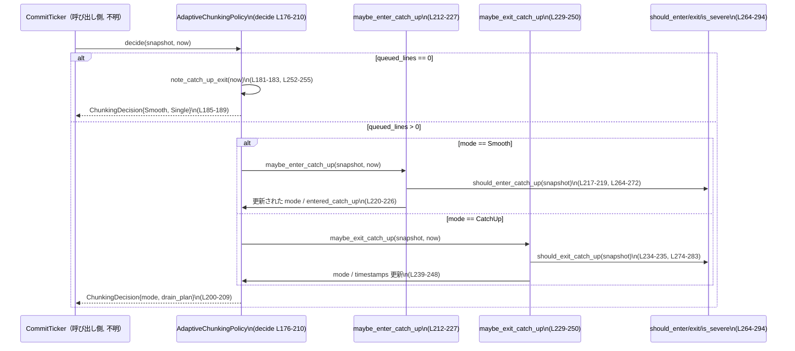

tui/src/streaming/chunking.rs

---

## 0. ざっくり一言

ストリームから届く行キューの「混み具合」を見て、コミットタイミングごとに  
「何行まとめて描画キューから取り出すか」を決める **適応的なチャンクングポリシー** を実装したモジュールです（chunking.rs:L1-37, L155-161, L176-210）。

---

## 1. このモジュールの役割

### 1.1 概要

- コミット（描画）ティックごとに、行キューから何行 drain（取り出し）するかを決定します（chunking.rs:L31-36, L176-180）。
- キューの「深さ」と「最古行の経過時間」だけを入力とし、2 つのモード  
  - `Smooth`（1 行ずつ）（chunking.rs:L118-123）  
  - `CatchUp`（バックログをまとめて drain）（chunking.rs:L123-125, L200-203）  
  の間をヒステリシス付きで切り替えます。
- `QueueSnapshot` と現在時刻 `Instant` を受け取り、`ChunkingDecision`（モード＋バッチサイズ）を返します（chunking.rs:L127-134, L144-153, L176-210）。

### 1.2 アーキテクチャ内での位置づけ

このチャンクだけでは周辺コンポーネントの実装は分かりませんが、ドキュメントコメントから次の関係が読み取れます（chunking.rs:L61-71, L176-180）。

- 上位層がストリームから行を受信し、内部キューに蓄積する（このチャンクには現れない）。
- コミットタイマー等が、現在のキューの状態を `QueueSnapshot` にまとめる（chunking.rs:L127-134）。
- 各コミットティックで `AdaptiveChunkingPolicy::decide` を呼び、`DrainPlan` に従ってキューを drain する（chunking.rs:L155-161, L176-210, L136-142）。

概念的な依存関係は次のようになります（キューやレンダラーは概念ノードであり、このチャンクには現れません）。

```mermaid
flowchart LR
    subgraph "ストリーム入力（他モジュール, 不明）"
        Reader["行受信処理"]
    end

    Queue["行キュー（他モジュール, 不明）"]
    Snapshot["QueueSnapshot\n(chunking.rs:L127-134)"]
    Policy["AdaptiveChunkingPolicy\n(chunking.rs:L155-262)"]
    Renderer["描画コミット処理（他モジュール, 不明）"]

    Reader --> Queue
    Queue --> Snapshot
    Snapshot -->|状態 + now| Policy
    Policy -->|ChunkingDecision\n(DrainPlan)| Renderer
    Renderer -->|指定行数だけ drain| Queue
```

### 1.3 設計上のポイント

- **2 モード構成**  
  - `ChunkingMode::Smooth`: 毎ティック 1 行だけ drain（chunking.rs:L118-123, L200-201）。
  - `ChunkingMode::CatchUp`: 現在の backlog 全体を 1 ティックで drain（chunking.rs:L123-125, L200-203）。
- **ヒステリシス付きモード遷移**  
  - `Smooth` → `CatchUp` は「高い閾値」で即座に遷移（chunking.rs:L212-223, L264-272）。
  - `CatchUp` → `Smooth` は「低い閾値」を一定時間満たした場合のみ遷移（chunking.rs:L229-250, L274-283, L102-103）。
  - 再突入抑制（re-entry hold）でチャタリングを防止（chunking.rs:L105-108, L212-223, L258-261）。
- **状態管理の責務**  
  - 現在モード `mode`（chunking.rs:L157-159）。
  - Exit 閾値を下回り続けている開始時刻 `below_exit_threshold_since`（chunking.rs:L155-161, L229-250）。
  - 直近の catch-up 退出時刻 `last_catch_up_exit_at`（chunking.rs:L155-161, L229-244, L252-255）。
- **安全性 / エラー / 並行性**  
  - `unsafe` コードは一切なく、パニックを起こしうる処理もありません（明示的 `unwrap` 等が存在しないことから、chunking.rs 全体）。
  - 時刻差の計算には `Instant::saturating_duration_since` を使い、時刻逆転時もパニックせず 0 に飽和します（chunking.rs:L240-241, L258-261）。
  - すべての状態変更は `&mut self` 経由で行われ、内部可変性は使っていないため、並行利用時は呼び出し側が排他制御（Mutex など）を提供する前提です（chunking.rs:L163-210）。

---

## 2. 主要な機能一覧

- 適応チャンクモード管理: `AdaptiveChunkingPolicy` で `Smooth` / `CatchUp` モードとヒステリシス状態を保持（chunking.rs:L155-161）。
- キュー状態のスナップショット表現: `QueueSnapshot` に深さと最古行の経過時間を格納（chunking.rs:L127-134）。
- チャンク決定の出力表現: `ChunkingDecision` と `DrainPlan` にモードと drain 行数を格納（chunking.rs:L136-142, L144-153）。
- モード遷移ロジック:
  - エントリ判定: `should_enter_catch_up`（chunking.rs:L264-272）。
  - エグジット判定: `should_exit_catch_up`（chunking.rs:L274-283）。
  - 深刻バックログ判定: `is_severe_backlog`（chunking.rs:L285-294）。
- 公開 API（crate 内）:
  - `AdaptiveChunkingPolicy::decide` による 1 ティックごとの `ChunkingDecision` 計算（chunking.rs:L176-210）。
  - `mode` / `reset` による状態参照・リセット（chunking.rs:L163-174）。

---

## 3. 公開 API と詳細解説

### 3.1 型一覧（構造体・列挙体など）

#### コンポーネントインベントリー（型）

| 名前 | 種別 | 役割 / 用途 | 定義位置 |
|------|------|------------|----------|
| `ChunkingMode` | enum | チャンク動作モード。`Smooth`（1行ずつ）と `CatchUp`（まとめて drain）を表現 | chunking.rs:L118-125 |
| `QueueSnapshot` | struct | 現在のキュー圧力（行数と最古行の age）を表現 | chunking.rs:L127-134 |
| `DrainPlan` | enum | このティックで何行 drain すべきかを表現 (`Single` or `Batch(n)`) | chunking.rs:L136-142 |
| `ChunkingDecision` | struct | 一度の決定におけるモード・遷移フラグ・ドレイン計画をまとめた出力 | chunking.rs:L144-153 |
| `AdaptiveChunkingPolicy` | struct | モードとヒステリシス状態を保持し、`decide` を通してポリシー決定を行う | chunking.rs:L155-161 |

#### コンポーネントインベントリー（閾値定数）

| 名前 | 型 | 意味 | 値 / 単位 | 定義位置 |
|------|----|------|-----------|----------|
| `ENTER_QUEUE_DEPTH_LINES` | `usize` | CatchUp へ入るためのキュー深さ閾値 | 8 行以上で候補 | chunking.rs:L82-85 |
| `ENTER_OLDEST_AGE` | `Duration` | CatchUp へ入るための最古行 age 閾値 | 120ms 以上で候補 | chunking.rs:L87-90 |
| `EXIT_QUEUE_DEPTH_LINES` | `usize` | CatchUp から出るときのキュー深さ閾値 | 2 行以下で候補 | chunking.rs:L92-95 |
| `EXIT_OLDEST_AGE` | `Duration` | CatchUp から出るときの最古行 age 閾値 | 40ms 以下で候補 | chunking.rs:L97-100 |
| `EXIT_HOLD` | `Duration` | Exit 閾値を連続して満たす必要時間 | 250ms | chunking.rs:L102-103 |
| `REENTER_CATCH_UP_HOLD` | `Duration` | CatchUp から出た後の再突入抑制時間 | 250ms | chunking.rs:L105-108 |
| `SEVERE_QUEUE_DEPTH_LINES` | `usize` | 深刻バックログとみなすキュー深さ閾値 | 64 行以上 | chunking.rs:L110-113 |
| `SEVERE_OLDEST_AGE` | `Duration` | 深刻バックログとみなす age 閾値 | 300ms 以上 | chunking.rs:L115-116 |

### 3.2 関数詳細（主要 7 件）

#### `AdaptiveChunkingPolicy::decide(&mut self, snapshot: QueueSnapshot, now: Instant) -> ChunkingDecision`

**概要**

- 現在のモードとキュー状態 `snapshot`、時刻 `now` に基づき、  
  モード遷移と drain 計画（`DrainPlan`）を 1 ティック分決定します（chunking.rs:L176-210）。
- モジュールのコアとなる公開 API（crate 内）です。

**引数**

| 引数名 | 型 | 説明 |
|--------|----|------|
| `snapshot` | `QueueSnapshot` | このティック時点でのキュー状態（行数と最古行 age）（chunking.rs:L127-134） |
| `now` | `Instant` | 判定時刻。ヒステリシス計測と再突入抑制に使用（chunking.rs:L155-161, L176-180） |

**戻り値**

- `ChunkingDecision`（chunking.rs:L144-153）  
  - `mode`: このティック後のモード（`Smooth` / `CatchUp`）。
  - `entered_catch_up`: このティックで `Smooth` → `CatchUp` に遷移した場合のみ `true`（chunking.rs:L212-216, L192-199）。
  - `drain_plan`: このティックで drain すべき行数を表す `DrainPlan`（chunking.rs:L200-203）。

**内部処理の流れ**

1. **空キュー処理**  
   - `snapshot.queued_lines == 0` の場合、`note_catch_up_exit(now)` を呼び出して最近の catch-up exit を記録し（chunking.rs:L181-183, L252-255）、  
     `mode` を `Smooth` にリセット、exit 閾値タイマーもクリアしたうえで `DrainPlan::Single` を返します（chunking.rs:L181-190）。
2. **モードごとの遷移判定**  
   - `self.mode` が `Smooth` の場合: `maybe_enter_catch_up(snapshot, now)` を呼び出し、その返値を `entered_catch_up` にセット（chunking.rs:L192-193, L216-227）。
   - `self.mode` が `CatchUp` の場合: `maybe_exit_catch_up(snapshot, now)` を呼び出し、`entered_catch_up` は `false` 固定（chunking.rs:L193-197, L229-250）。
3. **ドレイン計画の決定**  
   - `mode` が `Smooth` なら `DrainPlan::Single`（1 行だけ）を選択（chunking.rs:L200-201）。
   - `mode` が `CatchUp` なら `DrainPlan::Batch(snapshot.queued_lines.max(1))` を選択し、現在の backlog をすべて drain する計画を返します（少なくとも 1 行）（chunking.rs:L200-203）。
4. **結果の構築**  
   - 上記の `mode`・`entered_catch_up`・`drain_plan` をまとめて `ChunkingDecision` にして返します（chunking.rs:L205-209）。

**Examples（使用例）**

以下は、単純なキューと組み合わせたコミットティック処理の一例です。

```rust
use std::collections::VecDeque;
use std::time::{Duration, Instant};
use tui::streaming::chunking::{
    AdaptiveChunkingPolicy, QueueSnapshot, DrainPlan,
}; // 実際のパスは crate 構成に依存。このチャンクには現れません。

// 1 行ぶんの情報を、到着時刻とペイロードのペアで保持する想定です。
type Line = (Instant, String);

// 単一のコミットティックでキューを drain する例
fn commit_tick(policy: &mut AdaptiveChunkingPolicy, queue: &mut VecDeque<Line>) {
    let now = Instant::now(); // 現在時刻を取得

    // QueueSnapshot を構築する:
    // - queued_lines はキュー長
    // - oldest_age は先頭要素の到着時刻との差分
    let snapshot = QueueSnapshot {
        queued_lines: queue.len(),
        oldest_age: queue
            .front()
            .map(|(ts, _)| now.saturating_duration_since(*ts)),
    };

    // ポリシーに決定させる
    let decision = policy.decide(snapshot, now);

    // DrainPlan に従ってキュー先頭から行を取り出す
    let to_drain = match decision.drain_plan {
        DrainPlan::Single => 1,       // Smooth モード: 1 行だけ
        DrainPlan::Batch(n) => n,     // CatchUp モード: backlog をまとめて drain
    };

    for _ in 0..to_drain {
        if let Some((_ts, line)) = queue.pop_front() {
            // 実際の描画処理（このチャンクには現れません）
            println!("{line}");
        } else {
            break; // キューが空になったら終了
        }
    }

    // decision.entered_catch_up を使えば、
    // CatchUp への遷移タイミングだけメトリクスを送る、といった観測ができます。
}
```

**Errors / Panics**

- この関数自身が `Result` を返さず、内部でも `unwrap` などを使用していないため、通常の入力でパニックする経路は見当たりません（chunking.rs:L176-210）。
- 時刻差計算は `saturating_duration_since` 経由で行われており、時刻が巻き戻るようなケースでもパニックにならず 0 に飽和します（chunking.rs:L240-241, L258-261）。

**Edge cases（エッジケース）**

- `snapshot.queued_lines == 0` の場合（最重要）  
  - モードは無条件で `Smooth` に戻り、`DrainPlan::Single` が返ります（chunking.rs:L181-190）。  
    実際のキューは空なので、呼び出し側は `Single` を無視しても構いません。
- `snapshot.queued_lines > 0` かつ `snapshot.oldest_age == None` の場合  
  - `should_enter_catch_up` / `should_exit_catch_up` / `is_severe_backlog` は age 判定をスキップし、深さのみで判断します（`is_some_and` が `false` を返すため、chunking.rs:L269-272, L281-283, L292-293）。  
  - テストコードでは、行がある場合は常に `Some` を渡しているため、この状況は使用想定外の可能性があります（chunking.rs:L301-306）。
- 非常に大きな `queued_lines`（`usize::MAX` など）  
  - `DrainPlan::Batch(snapshot.queued_lines.max(1))` により、その値がそのまま `Batch` に入り、内部で溢れ処理は行いません（chunking.rs:L200-203）。  
    実際に何行 drain するかは、呼び出し側のキュー長に依存します。

**使用上の注意点**

- `snapshot` は「現在のキュー状態」を忠実に反映している必要があります。  
  ドキュメントコメントでも「synthetic snapshots（作為的なスナップショット）」を避けるよう注意書きがあります（chunking.rs:L176-180）。
  - 特に `oldest_age` が実際より古く見える（過大評価）と、早く CatchUp を抜けてしまう可能性があります。
- 1 インスタンスを複数スレッドから使う場合、`&mut self` が必要なため、`Mutex` などで排他制御を行う前提になります（chunking.rs:L163-210）。
- `DrainPlan::Single` が返っても、必ず 1 行 drain しなければならないわけではありませんが、「ポリシーとしては 1 行 drain を想定している」ことを前提として設計されています（chunking.rs:L136-142, L176-210）。

---

#### `AdaptiveChunkingPolicy::maybe_enter_catch_up(&mut self, snapshot: QueueSnapshot, now: Instant) -> bool`

**概要**

- `Smooth` モード時に、CatchUp に入るべきかを判定・遷移する内部関数です（chunking.rs:L212-227）。
- 実際にモードを `CatchUp` に変えた場合のみ `true` を返します。

**引数 / 戻り値**

- 引数は `decide` と同じ `snapshot`, `now`（chunking.rs:L216-217）。
- 戻り値は「この呼び出しで `Smooth` → `CatchUp` に遷移したかどうか」を表す `bool`（chunking.rs:L216-227）。

**内部処理**

1. `should_enter_catch_up(snapshot)` を評価し、深さか age のどちらかが閾値を超えていなければ即座に `false` を返す（chunking.rs:L217-219, L264-272）。
2. 直近の catch-up exit から `REENTER_CATCH_UP_HOLD` 未満しか経っていない場合、かつ `is_severe_backlog(snapshot)` が `false` の場合、再突入を抑制して `false` を返す（chunking.rs:L220-221, L258-261, L285-294, L105-108）。
3. 上記をすべて通過した場合、`self.mode = ChunkingMode::CatchUp` とし、exit 閾値タイマー・最後の exit 記録をリセットして `true` を返す（chunking.rs:L223-226）。

**Edge cases / 注意点**

- 再突入抑制中でも、`is_severe_backlog` が `true`（行数 ≥ 64 または age ≥ 300ms）の場合は CatchUp に入ることができます（chunking.rs:L285-294, L220-221）。
- 関数は `decide` から `Smooth` モード時にのみ呼ばれる設計になっており、モードとの整合性は `decide` に依存します（chunking.rs:L192-193）。

---

#### `AdaptiveChunkingPolicy::maybe_exit_catch_up(&mut self, snapshot: QueueSnapshot, now: Instant)`

**概要**

- `CatchUp` モードから `Smooth` へ戻るかどうかを、 exit 閾値と `EXIT_HOLD` 時間を使って判定する内部関数です（chunking.rs:L229-250）。

**内部処理**

1. `should_exit_catch_up(snapshot)` が `false` の場合  
   - exit 閾値下回り開始時刻 `below_exit_threshold_since` を `None` にクリアし、戻り値なしで終了（chunking.rs:L234-237）。
2. `should_exit_catch_up(snapshot)` が `true` の場合  
   - `below_exit_threshold_since` が  
     - `Some(since)` かつ `now - since >= EXIT_HOLD` の場合  
       - `self.mode = Smooth` に戻し、`below_exit_threshold_since` をリセットしつつ `last_catch_up_exit_at = Some(now)` をセット（chunking.rs:L239-244, L102-103）。
     - `Some(_)` だが hold 未満の場合  
       - 何もせず CatchUp 継続（chunking.rs:L245）。
     - `None` の場合  
       - 「初めて exit 閾値を下回った」とみなし、`below_exit_threshold_since = Some(now)` を設定（chunking.rs:L246-248）。

**Edge cases / 注意点**

- `snapshot.oldest_age == None` の場合、age 条件を満たすことができず、`should_exit_catch_up` は `false` になります（chunking.rs:L281-283）。  
  行がある場合は `Some` を渡すことが前提と考えられます（テスト参照: chunking.rs:L301-306）。
- Exit 判定は「深さ **か** age」のどちらかではなく、「深さ **かつ** age」が閾値以下であることを要求するため、どちらか一方だけ軽くなった状態でのチャタリングを防いでいます（chunking.rs:L274-283）。

---

#### `AdaptiveChunkingPolicy::reentry_hold_active(&self, now: Instant) -> bool`

**概要**

- 直近の catch-up exit から `REENTER_CATCH_UP_HOLD`（250ms）未満しか経っていないかを判定する内部関数です（chunking.rs:L258-261, L105-108）。

**ポイント**

- `self.last_catch_up_exit_at.is_some_and(|exit| now.saturating_duration_since(exit) < REENTER_CATCH_UP_HOLD)` という 1 行で実装されています（chunking.rs:L258-261）。
- `saturating_duration_since` を使うことで、時刻が巻き戻ってもパニックせず 0 にクリップされます。

---

#### `should_enter_catch_up(snapshot: QueueSnapshot) -> bool`

**概要**

- 現在のキュー圧力が CatchUp に入るのに十分かどうかを判定する純粋関数です（chunking.rs:L264-272）。

**判定条件**

- 次のいずれかを満たせば `true`（chunking.rs:L268-272）。
  - `snapshot.queued_lines >= ENTER_QUEUE_DEPTH_LINES`（8 行以上）。
  - `snapshot.oldest_age.is_some_and(|oldest| oldest >= ENTER_OLDEST_AGE)`（最古行 age が 120ms 以上）。

---

#### `should_exit_catch_up(snapshot: QueueSnapshot) -> bool`

**概要**

- CatchUp からの exit を考え始めてよいほどキュー圧力が低いかどうかを判定する純粋関数です（chunking.rs:L274-283）。

**判定条件**

- 次の両方を満たす場合に `true`（chunking.rs:L279-283）。
  - `snapshot.queued_lines <= EXIT_QUEUE_DEPTH_LINES`（2 行以下）。
  - `snapshot.oldest_age.is_some_and(|oldest| oldest <= EXIT_OLDEST_AGE)`（最古行 age が 40ms 以下）。

---

#### `is_severe_backlog(snapshot: QueueSnapshot) -> bool`

**概要**

- バックログが「深刻」とみなせるかを判定し、再突入抑制をバイパスするかどうかの判断に使う純粋関数です（chunking.rs:L285-294）。

**判定条件**

- 次のいずれかを満たせば `true`（chunking.rs:L290-294）。
  - `snapshot.queued_lines >= SEVERE_QUEUE_DEPTH_LINES`（64 行以上）。
  - `snapshot.oldest_age.is_some_and(|oldest| oldest >= SEVERE_OLDEST_AGE)`（最古行 age が 300ms 以上）。

---

### 3.3 その他の関数

#### `AdaptiveChunkingPolicy` の補助メソッド

| 関数名 | 役割（1 行） | 定義位置 |
|--------|--------------|----------|
| `mode(&self) -> ChunkingMode` | 直近の `decide` で使用したモードを取得 | chunking.rs:L163-167 |
| `reset(&mut self)` | モードとヒステリシス状態（タイムスタンプ）を初期状態に戻す | chunking.rs:L169-174 |
| `note_catch_up_exit(&mut self, now: Instant)` | 現在モードが `CatchUp` のときに、exit 発生時刻を `last_catch_up_exit_at` に記録 | chunking.rs:L252-256 |

#### テスト用関数

| 関数名 | 役割 | 定義位置 |
|--------|------|----------|
| `snapshot(queued_lines, oldest_age_ms)` | テストで使う `QueueSnapshot` の簡易コンストラクタ | chunking.rs:L301-306 |
| `smooth_mode_is_default` ほか 8 件 | 各種しきい値・ヒステリシス・再突入抑制の振る舞いを検証する単体テスト | chunking.rs:L308-455 |

---

### 3.4 テストのカバレッジ概要

テストモジュールでは、次のシナリオが明示的に検証されています（chunking.rs:L296-455）。

- デフォルトモードが `Smooth` であり、1 行だけ drain される（chunking.rs:L308-317）。
- 行数閾値（8 行）または age 閾値（120ms）で CatchUp に入る（chunking.rs:L319-339）。
- 深刻バックログ（64 行）時に Batch のサイズが backlog に一致する（chunking.rs:L341-353, L355-362）。
- Exit 閾値を 250ms 維持した後に CatchUp から Smooth に戻る（chunking.rs:L364-383）。
- キューが空になったときに Smooth に戻る（chunking.rs:L386-401）。
- CatchUp exit 直後の再突入抑制と、深刻バックログによる抑制バイパス（chunking.rs:L405-455）。

未テストの可能性がある点（このチャンクから読み取れる範囲）:

- `queued_lines > 0` かつ `oldest_age == None` のようなスナップショット入力。
- 極端に大きな `queued_lines` に対する振る舞い（`Batch(usize::MAX)` など）。

---

## 4. データフロー

ここでは、`AdaptiveChunkingPolicy::decide` を 1 ティックごとに呼ぶ標準シナリオを示します。



要点:

- 呼び出し側は `decide` の中で行われるモード遷移詳細を意識する必要はなく、返ってきた `ChunkingDecision.drain_plan` に従ってキューを drain するだけでよい設計になっています（chunking.rs:L176-210）。
- 再突入抑制や深刻バックログの判定はすべて内部の helper 関数群でカプセル化されています（chunking.rs:L212-227, L229-250, L264-294）。

---

## 5. 使い方（How to Use）

### 5.1 基本的な使用方法

`AdaptiveChunkingPolicy` を 1 つ作成し、コミットティックごとに `decide` を呼び出します。

```rust
use std::collections::VecDeque;
use std::time::{Duration, Instant};

use tui::streaming::chunking::{
    AdaptiveChunkingPolicy, QueueSnapshot, DrainPlan, ChunkingMode,
}; // 実際のパスは crate 構成に依存。このチャンクには現れません。

type Line = (Instant, String); // 行の到着時刻と内容

fn main_loop() {
    let mut policy = AdaptiveChunkingPolicy::default(); // デフォルトは Smooth（chunking.rs:L118-123, L308-317）
    let mut queue: VecDeque<Line> = VecDeque::new();

    // 仮のイベントループ
    loop {
        // ここで queue にストリーム行が追加されている想定（このチャンクには現れません）

        let now = Instant::now();

        let snapshot = QueueSnapshot {
            queued_lines: queue.len(),                        // 行数（chunking.rs:L131）
            oldest_age: queue.front().map(|(ts, _)| {
                now.saturating_duration_since(*ts)            // age（chunking.rs:L133）
            }),
        };

        let decision = policy.decide(snapshot, now);          // コア判定（chunking.rs:L176-210）

        // モードに応じてコメントなどを出したい場合
        if decision.entered_catch_up {
            eprintln!("entering CatchUp mode");
        }

        let to_drain = match decision.drain_plan {
            DrainPlan::Single => 1,
            DrainPlan::Batch(n) => n,
        };

        for _ in 0..to_drain {
            if let Some((_ts, line)) = queue.pop_front() {
                // 描画処理（このチャンクには現れません）
                println!("{line}");
            } else {
                break;
            }
        }

        // 適当なスリープや次の tick への調整（このチャンクには現れません）
        std::thread::sleep(Duration::from_millis(16));
    }
}
```

### 5.2 よくある使用パターン

- **通常運転（Smooth）での保守的 drain**  
  - キューが浅く、age も若い間は `DrainPlan::Single` になるため、アニメーション的に 1 行ずつ表示されます（chunking.rs:L136-142, L176-210）。
- **突発的なバックログ発生時の CatchUp**  
  - 行数が 8 行以上、または最古行 age が 120ms を超えると CatchUp に入り、1 ティックで backlog 全体を drain する計画が返ります（chunking.rs:L82-90, L264-272, L355-362）。
- **再突入抑制の活用**  
  - CatchUp を抜けた直後の 250ms 間は、再度閾値を超えてもモード遷移が抑制され、`Smooth` のまま 1 行ずつ drain されます（chunking.rs:L105-108, L212-223, L405-427）。  
  - メトリクスなどで `entered_catch_up` を観測すると、チャタリングの有無を簡単に把握できます（chunking.rs:L212-216, L409-433）。

### 5.3 よくある間違い

```rust
// 間違い例: oldest_age を誤って 0 固定にしてしまう
let snapshot = QueueSnapshot {
    queued_lines: queue.len(),
    oldest_age: Some(Duration::from_millis(0)),  // 実際の age を反映していない
};

// 正しい例: 先頭要素の到着時刻との差分を使う
let now = Instant::now();
let snapshot = QueueSnapshot {
    queued_lines: queue.len(),
    oldest_age: queue.front().map(|(ts, _)| now.saturating_duration_since(*ts)),
};
```

- 間違い例のように age を常に 0 にしてしまうと、`should_enter_catch_up` が深さだけでしか判断できず、  
  遅延（age 側）のシグナルを無視してしまうことになります（chunking.rs:L264-272）。

```rust
// 間違い例: サブスレッドから &mut AdaptiveChunkingPolicy に同時アクセス
// let policy = Arc::new(AdaptiveChunkingPolicy::default());
// let p1 = policy.clone();
// let p2 = policy.clone();
// thread::spawn(move || loop { p1.decide(snapshot1(), Instant::now()); });
// thread::spawn(move || loop { p2.decide(snapshot2(), Instant::now()); });

// 正しい例: Mutex などで排他制御を行う
use std::sync::{Arc, Mutex};

let policy = Arc::new(Mutex::new(AdaptiveChunkingPolicy::default()));
let p1 = policy.clone();
let p2 = policy.clone();

std::thread::spawn(move || loop {
    let mut guard = p1.lock().unwrap();
    let snapshot = /* ... */;
    guard.decide(snapshot, Instant::now());
});

std::thread::spawn(move || loop {
    let mut guard = p2.lock().unwrap();
    let snapshot = /* ... */;
    guard.decide(snapshot, Instant::now());
});
```

- `decide` は `&mut self` を要求するため、並行に呼ぶ場合は必ず Mutex などによる排他が必要です（chunking.rs:L176-180）。

### 5.4 使用上の注意点（まとめ）

- **スナップショットの一貫性**  
  - `snapshot` は「同一ティックの時刻 `now` におけるキュー状態」を反映している必要があります（chunking.rs:L176-180）。  
    古い age や行数に基づく決定は、期待しないタイミングでモード遷移を起こし得ます。
- **性能面のトレードオフ**  
  - CatchUp 時には backlog 全体を 1 ティックで drain する計画を返すため、大量の行がたまった場合は 1 ティックの処理が重くなる可能性があります（chunking.rs:L200-203, L355-362）。  
    これは「遅延を素早く解消する」ことを優先した設計であり、必要なら閾値定数のチューニングでバランスを調整します（chunking.rs:L45-52）。
- **並行性**  
  - タイムスタンプや状態を内部に保持しているため、複数スレッドから同じインスタンスを使う場合は同期が前提です（chunking.rs:L155-161, L163-210）。
- **観測性**  
  - `ChunkingDecision.entered_catch_up` は「CatchUp へ遷移した瞬間」だけ `true` になるよう設計されており、ログやメトリクス用のフックとして使えます（chunking.rs:L144-153, L192-199, L212-216）。

---

## 6. 変更の仕方（How to Modify）

### 6.1 新しい機能を追加する場合

このモジュールでは、ポリシーのパラメータとロジックが比較的明確に分離されています（定数 vs ロジック）。

1. **しきい値の追加・変更**  
   - 新しい閾値定数を追加する場合は、既存定数と同じセクション（定数ブロック）に追加すると整合性が保ちやすいです（chunking.rs:L82-116）。
   - 既存の `should_*` 関数に条件を追加する形が自然です（chunking.rs:L264-294）。
2. **新しいモードを追加する場合**（例: `SlowCatchUp` など）  
   - `ChunkingMode` にバリアントを追加し（chunking.rs:L118-125）、  
     `AdaptiveChunkingPolicy::decide` の `match self.mode` に分岐を追加する必要があります（chunking.rs:L192-203）。
   - モードごとの drain 戦略は `DrainPlan` で表現されるため、新モードに対応した `DrainPlan` パターンも定義する必要があります（chunking.rs:L136-142, L200-203）。
3. **観測性の拡張**  
   - 例えば「CatchUp exit 時のフラグ」などを追加したい場合は、`ChunkingDecision` にフィールドを追加し（chunking.rs:L144-153）、  
     `maybe_exit_catch_up` / `note_catch_up_exit` の呼び出しに応じて設定する形が自然です（chunking.rs:L229-250, L252-255）。

### 6.2 既存の機能を変更する場合

- **影響範囲の確認**  
  - 主要な呼び出し元はこのチャンク内では `tests` のみですが、crate 全体では他モジュールから呼ばれている可能性があります。このチャンクだけでは分からないため、`AdaptiveChunkingPolicy` の使用箇所を ripgrep 等で検索する必要があります（このチャンクには現れません）。
- **契約の確認**  
  - `decide` は「同じ `(mode, snapshot, now)` トリプルに対して決定が決定論的である」ことがコメントされています（chunking.rs:L178-179）。  
    ロジック変更時にはこの性質が崩れないことを確認する必要があります。
  - `DrainPlan::Batch` の意味（「現在の backlog を drain することを意図している」）を変更する場合は、呼び出し側の実装とテストの両方の確認が必須です（chunking.rs:L136-142, L355-362）。
- **関連テストの更新**  
  - 閾値やタイミングを変更した場合は、対応するテスト（しきい値・ホールド時間を前提にしているテスト）が落ちる可能性が高いです（chunking.rs:L319-339, L364-383, L405-455）。  
    新仕様に合わせて期待値（行数・モード・タイミング）を更新する必要があります。

---

## 7. 関連ファイル

このチャンク内から分かる関連ファイルは次の通りです。

| パス | 役割 / 関係 |
|------|------------|
| `tui/src/streaming/chunking.rs` | 本ドキュメント対象。チャンクングポリシー本体。 |
| `docs/tui-stream-chunking-review.md` | チャンクングに関するレビュー用ドキュメント（コメントより）（chunking.rs:L73-76）。 |
| `docs/tui-stream-chunking-tuning.md` | チューニングガイド（コメントより）（chunking.rs:L73-76）。 |
| `docs/tui-stream-chunking-validation.md` | 検証関連ドキュメント（コメントより）（chunking.rs:L73-77）。 |

実際のキュー実装やレンダラー、コミットタイマー等はこのチャンクには現れず、別モジュールで提供されていると推測されますが、コードから直接は特定できません。
