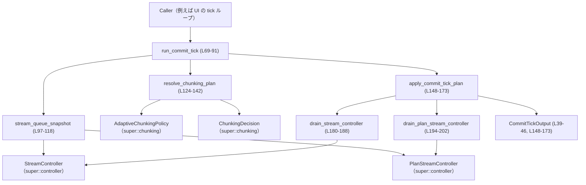
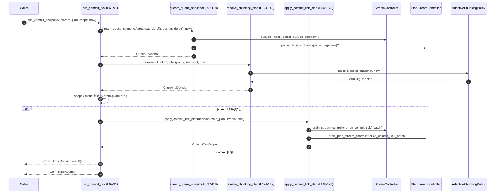

tui/src/streaming/commit_tick.rs

---

## 0. ざっくり一言

ストリーミング用の 2 種類の controller に対して、キュー状態を集計し、チャンクングポリシーの決定に従って行を drain する「1 ティック分のコミット処理」をまとめて実行するオーケストレータです（commit_tick.rs:L1-14, L62-75）。

---

## 1. このモジュールの役割

### 1.1 概要

- このモジュールは、**キューの混雑具合（queue pressure）に基づく chunking policy** と、実際のストリーム controller を橋渡しする役割を持ちます（commit_tick.rs:L3-5）。
- 呼び出し側が現在の controller 群と tick scope（通常モードか catch-up 限定か）を渡すと、モジュールはキュー状態を測定し、drain plan（どれだけ行を出すか）を決定・適用し、排出された `HistoryCell` を返します（commit_tick.rs:L3-5, L62-75）。
- キューの先頭からのみ drain することで順序を維持し（実際の実装自体は controller 側にあります）、UI のアニメーションや履歴への挿入などの副作用は行いません（commit_tick.rs:L7-9）。

### 1.2 アーキテクチャ内での位置づけ

このモジュールは、上位の「tick ループ」から呼ばれ、`chunking` モジュールのポリシーと、`controller` モジュールの実際のストリーム制御をつなぎます（commit_tick.rs:L3-5, L21-27, L62-75）。



### 1.3 設計上のポイント

- **責務の分離**
  - 本モジュールはキュー状態の集約と drain plan の適用に限定され、tick のスケジューリングや UI 状態の変更は行いません（commit_tick.rs:L7-9）。
  - キューの状態取得（`stream_queue_snapshot`）、ポリシー決定（`resolve_chunking_plan`）、plan の適用（`apply_commit_tick_plan`）が関数レベルで分離されています（commit_tick.rs:L11-14, L69-91, L97-118, L124-142, L148-173）。

- **状態管理**
  - `AdaptiveChunkingPolicy` は外部から `&mut` で渡され、モード遷移などの内部状態を保持します（commit_tick.rs:L69-71, L124-131）。
  - 本モジュール自身はフィールドを持たず、グローバル状態も使用しません。

- **エラーハンドリング**
  - このモジュール内の関数はすべて `Result` を返さず、内部で `panic!` 相当の処理も行っていません（commit_tick.rs 全体）。  
    エラーや失敗は、`AdaptiveChunkingPolicy` や各 controller の実装側で扱われる設計と考えられます（ただし詳細はこのチャンクには現れません）。

- **並行性・安全性**
  - controller と policy は `&mut` 参照で受け取っており、Rust の所有権・借用規則により、「同時に複数からミュータブルにアクセスされる」状態はコンパイル時に防止されます（commit_tick.rs:L69-74）。
  - スレッドや `async` は使用されておらず、このモジュールは同期的に 1 tick 分の処理を行う構造です（commit_tick.rs 全体）。

- **観測性 (observability)**
  - チャンクングモードの遷移時には `tracing::trace!` でログを出力し、モード変更の検知ポイントを一箇所に集約しています（commit_tick.rs:L120-141）。

- **スコープ制御**
  - `CommitTickScope` により、「すべてのモードで commit を行うか」「catch-up モード時のみ commit を行うか」を制御します（commit_tick.rs:L29-36, L82-84）。

---

## 2. 主要な機能一覧

- `run_commit_tick`: ポリシーと controller 群に対して 1 回の commit tick を実行し、結果を `CommitTickOutput` で返す（commit_tick.rs:L62-91）。
- `stream_queue_snapshot`: 2 種類の controller からキューの深さと最も古い行の age を集約し、`QueueSnapshot` を構築する（commit_tick.rs:L93-118）。
- `resolve_chunking_plan`: `AdaptiveChunkingPolicy` にキュー状態を渡して 1 回の `ChunkingDecision` を得て、モード遷移時のみ trace ログを出力する（commit_tick.rs:L120-142）。
- `apply_commit_tick_plan`: `DrainPlan` を controller 群に適用し、排出された `HistoryCell` と idle 状態を集計して `CommitTickOutput` を生成する（commit_tick.rs:L144-173）。
- `drain_stream_controller`: main 側 `StreamController` を 1 ステップ drain する（単一行またはバッチ）（commit_tick.rs:L175-188）。
- `drain_plan_stream_controller`: plan 用 `PlanStreamController` を 1 ステップ drain する（commit_tick.rs:L190-202）。
- `max_duration`: `Option<Duration>` を 2 つ受け取り、より長い方（存在すれば）を返すユーティリティ（commit_tick.rs:L204-213）。

---

## 3. 公開 API と詳細解説

### 3.1 型一覧（構造体・列挙体など）

| 名前 | 種別 | 可視性 | 役割 / 用途 | 主なフィールド・バリアント | 定義位置 |
|------|------|--------|------------|-----------------------------|----------|
| `CommitTickScope` | enum | `pub(crate)` | commit tick を「常に実行するか」「catch-up モード時のみ commit するか」を表すスコープ指定（commit_tick.rs:L29-36） | `AnyMode`, `CatchUpOnly` | commit_tick.rs:L29-36 |
| `CommitTickOutput` | struct | `pub(crate)` | 1 回の commit tick の結果として、排出されたセル / controller の有無 / idle 状態をまとめて返す（commit_tick.rs:L38-46） | `cells: Vec<Box<dyn HistoryCell>>`, `has_controller: bool`, `all_idle: bool` | commit_tick.rs:L38-46 |
| `AdaptiveChunkingPolicy` | 構造体（他モジュール） | 不明（このチャンク外） | キュー状態と時間から `ChunkingDecision` を返すポリシーオブジェクト（commit_tick.rs:L21, L64-65, L124-131） | 少なくともメソッド `mode()`, `decide(QueueSnapshot, Instant)` を持つ | 定義ファイル不明（`super::chunking` モジュール） |
| `ChunkingDecision` | 構造体（他モジュール） | 不明 | ポリシーの決定結果。モード、catch-up への遷移フラグ、`DrainPlan` などを含む（commit_tick.rs:L22, L81-82, L129-138） | フィールド `mode`, `drain_plan`, `entered_catch_up` が存在 | 定義ファイル不明（`super::chunking` モジュール） |
| `ChunkingMode` | enum（他モジュール） | 不明 | 少なくとも `CatchUp` バリアントを持つチャンクングモード（commit_tick.rs:L23, L82） | `CatchUp` ほかのバリアントが存在すると推測されるが、このチャンクからは不明 | 定義ファイル不明 |
| `DrainPlan` | enum（他モジュール） | 不明 | drain 量を `Single` か `Batch(max_lines)` で表す（commit_tick.rs:L24, L175-187, L190-201） | `Single`, `Batch(max_lines)`。`Copy` であることがこのコードから分かる | 定義ファイル不明 |
| `QueueSnapshot` | 構造体（他モジュール） | 不明 | キューの総行数と、最も古い行の age をまとめたスナップショット（commit_tick.rs:L25, L93-118） | `queued_lines: usize`, `oldest_age: Option<Duration>` | 定義ファイル不明 |
| `StreamController` | 構造体（他モジュール） | 不明 | メインストリーム用 controller。キュー情報の取得と drain を提供する（commit_tick.rs:L27, L71-72, L97-99, L105-107, L180-187） | 少なくともメソッド `queued_lines()`, `oldest_queued_age(Instant)`, `on_commit_tick()`, `on_commit_tick_batch(max_lines)` を持つ | 定義ファイル不明（`super::controller`） |
| `PlanStreamController` | 構造体（他モジュール） | 不明 | plan ストリーム用 controller。`StreamController` と同様の API を持つ（commit_tick.rs:L26, L72-73, L98-100, L109-111, L194-201） | 上記と同様のメソッド群 | 定義ファイル不明 |
| `HistoryCell` | トレイト or 型（他モジュール） | 不明 | 出力履歴に格納される 1 セル分のデータを表す型。`Box<dyn HistoryCell>` として動的ディスパッチされる（commit_tick.rs:L19, L41, L181, L195） | 具体的なメソッドはこのチャンクには現れない | `crate::history_cell` |

> 他モジュールの可視性（`pub` / `pub(crate)` 等）や詳細なフィールド構成は、このチャンクには現れません。

---

### 3.2 関数詳細

以下、モジュール内の 7 関数すべてについて詳細を記載します。

---

#### `run_commit_tick(policy: &mut AdaptiveChunkingPolicy, stream_controller: Option<&mut StreamController>, plan_stream_controller: Option<&mut PlanStreamController>, scope: CommitTickScope, now: Instant) -> CommitTickOutput`

**概要**

- 与えられたポリシーと 0〜2 個の controller に対して 1 回の commit tick を実行し、その結果を `CommitTickOutput` として返します（commit_tick.rs:L62-75）。
- 処理は「スナップショット取得 → ポリシー決定 → スコープ判定 → drain plan 適用」という流れで行われます（commit_tick.rs:L76-90）。

**引数**

| 引数名 | 型 | 説明 |
|--------|----|------|
| `policy` | `&mut AdaptiveChunkingPolicy` | チャンクングポリシー。内部状態（モードなど）を更新しながら `ChunkingDecision` を返す（commit_tick.rs:L69-71, L81）。 |
| `stream_controller` | `Option<&mut StreamController>` | メインストリーム用 controller。存在しない場合は `None`（commit_tick.rs:L71-72）。 |
| `plan_stream_controller` | `Option<&mut PlanStreamController>` | plan ストリーム用 controller。存在しない場合は `None`（commit_tick.rs:L72-73）。 |
| `scope` | `CommitTickScope` | commit tick のスコープ。`CatchUpOnly` の場合、catch-up モード以外では commit を抑制します（commit_tick.rs:L73-74, L82-84）。 |
| `now` | `Instant` | 現在時刻。キューの age 計算やポリシー決定に利用されます（commit_tick.rs:L74-75, L97-101, L124-127）。 |

**戻り値**

- `CommitTickOutput`  
  - `cells`: この tick で controller から排出された `HistoryCell` のリスト（commit_tick.rs:L40-41, L155-160, L164-168）。  
  - `has_controller`: 少なくとも 1 つの controller がこの tick で drain 対象になったかどうか（commit_tick.rs:L42-43, L155-157, L163-165）。  
  - `all_idle`: 対象となったすべての controller が drain 後に idle だったかどうか（commit_tick.rs:L44-45, L153-154, L161-170）。

**内部処理の流れ**

1. `stream_queue_snapshot` を呼び出し、両 controller のキュー状態から `QueueSnapshot` を取得します（commit_tick.rs:L76-80, L97-118）。
2. `resolve_chunking_plan` を呼び出し、ポリシーにスナップショットと `now` を渡して `ChunkingDecision` を得ます（commit_tick.rs:L81, L124-131）。
3. `scope` が `CatchUpOnly` かつ `decision.mode` が `ChunkingMode::CatchUp` でない場合、`CommitTickOutput::default()` を返して commit を抑制します（commit_tick.rs:L82-84, L48-59）。
   - このとき `CommitTickOutput::default()` は「commit を行っていない状態」を表します。
4. 上記条件に該当しない場合、`apply_commit_tick_plan` を呼び出し、`decision.drain_plan` と両 controller を渡して drain を実行し、その結果を返します（commit_tick.rs:L86-90, L144-173）。

**Examples（使用例）**

> ここでは、すでに `AdaptiveChunkingPolicy`, `StreamController`, `PlanStreamController` のインスタンスが用意されている前提の擬似コードです。

```rust
use std::time::Instant;
use crate::tui::streaming::commit_tick::{run_commit_tick, CommitTickScope};
use crate::tui::streaming::chunking::AdaptiveChunkingPolicy;
use crate::tui::streaming::controller::{StreamController, PlanStreamController};

fn tick_loop(
    policy: &mut AdaptiveChunkingPolicy,                  // ポリシーは外側で保持
    stream: Option<&mut StreamController>,                // メインストリーム controller（あれば）
    plan: Option<&mut PlanStreamController>,              // plan ストリーム controller（あれば）
) {
    let now = Instant::now();                             // 現在時刻を取得
    let output = run_commit_tick(
        policy,
        stream,
        plan,
        CommitTickScope::AnyMode,                         // すべてのモードで commit
        now,
    );

    // 出力セルを履歴に追加するなど、呼び出し側で副作用を処理する
    for cell in output.cells {
        // history.insert(cell); など
    }

    if output.has_controller && output.all_idle {
        // すべての controller が idle になった場合の処理
    }
}
```

**Errors / Panics**

- この関数自体は `Result` を返さず、`unwrap` や `panic!` 等も使用していません（commit_tick.rs:L69-91）。
- ただし、内部で呼び出している `policy.decide` や controller のメソッドがエラーを返す・panic する可能性については、このチャンクには記述がありません。

**Edge cases（エッジケース）**

- `stream_controller` と `plan_stream_controller` の両方が `None` の場合  
  - `stream_queue_snapshot` では `queued_lines = 0`, `oldest_age = None` のスナップショットが生成されます（commit_tick.rs:L102-117）。  
  - `apply_commit_tick_plan` はどちらの分岐にも入らず、`CommitTickOutput::default()` 相当の `has_controller = false`, `all_idle = true`, `cells = []` が返ります（commit_tick.rs:L148-154, L171-172）。
- `scope == CommitTickScope::CatchUpOnly` かつ `decision.mode != ChunkingMode::CatchUp` の場合  
  - controller が存在しても drain は行われず、`CommitTickOutput::default()` が返ります（commit_tick.rs:L82-84）。  
  - このとき `has_controller` は `false` のままであり、「controller は渡されたが tick は論理的に実行されていない」状態になります（commit_tick.rs:L42-43, L55-57, L82-84）。

**使用上の注意点**

- モジュールコメントにある通り、古い controller 参照（現在の turn と紐づかないもの）を渡すと、キュー age の計算が狂い、ポリシーが必要以上に catch-up モードに留まる可能性があります（commit_tick.rs:L66-68）。  
  → controller のライフサイクルと tick タイミングを揃えることが前提条件です。
- `scope` を `CatchUpOnly` にしている場合、ポリシーモードが catch-up でない間は commit が抑制されるため、上位側で「いつ drain が行われるか」を理解しておく必要があります（commit_tick.rs:L29-36, L82-84）。

---

#### `stream_queue_snapshot(stream_controller: Option<&StreamController>, plan_stream_controller: Option<&PlanStreamController>, now: Instant) -> QueueSnapshot`

**概要**

- 2 種類の controller からキュー情報を集約し、ポリシーの入力となる `QueueSnapshot` を構築します（commit_tick.rs:L93-101）。
- キュー行数は合算し、キュー age は 2 つの controller のうち **最も古い行** の age（Duration の最大値）を採用します（commit_tick.rs:L95-96, L105-112, L204-213）。

**引数**

| 引数名 | 型 | 説明 |
|--------|----|------|
| `stream_controller` | `Option<&StreamController>` | メインストリーム controller への共有参照。存在しない場合は `None`（commit_tick.rs:L97-99）。 |
| `plan_stream_controller` | `Option<&PlanStreamController>` | plan ストリーム controller への共有参照。存在しない場合は `None`（commit_tick.rs:L98-100）。 |
| `now` | `Instant` | age 計算に使用する現在時刻（commit_tick.rs:L100-101）。 |

**戻り値**

- `QueueSnapshot`  
  - `queued_lines`: 2 controller の `queued_lines()` の合計（commit_tick.rs:L102-103, L105-111, L114-116）。  
  - `oldest_age`: 両 controller の `oldest_queued_age(now)` のうち Duration の最大値（もっとも古い行の age）を `Option<Duration>` で保持（commit_tick.rs:L103-104, L105-112, L114-117）。

**内部処理の流れ**

1. `queued_lines` を 0、`oldest_age` を `None` で初期化（commit_tick.rs:L102-103）。
2. `stream_controller` が `Some` の場合、その `queued_lines()` を加算し、`oldest_age` と `controller.oldest_queued_age(now)` の最大値を `max_duration` で計算（commit_tick.rs:L105-108, L204-213）。
3. `plan_stream_controller` も同様に処理（commit_tick.rs:L109-112）。
4. 最終的な `queued_lines` と `oldest_age` から `QueueSnapshot` を生成（commit_tick.rs:L114-117）。

**Examples（使用例）**

`run_commit_tick` 以外から直接呼び出すケースは想定されていませんが、単体テストなどで使用するイメージです。

```rust
let now = Instant::now();
let snapshot = stream_queue_snapshot(
    stream_controller.as_deref(),     // Option<&mut T> から Option<&T> に変換して渡す
    plan_stream_controller.as_deref(),
    now,
);

// snapshot.queued_lines や snapshot.oldest_age を検査する
```

**Errors / Panics**

- この関数自体にエラーや panic の要素はありません（commit_tick.rs:L97-118）。
- `queued_lines()` や `oldest_queued_age()` の挙動は controller 側に依存し、このチャンクには現れません。

**Edge cases**

- 両方 `None` の場合: `queued_lines = 0`, `oldest_age = None`（commit_tick.rs:L102-103, L105-112, L114-117）。
- 一方の controller のみ存在し、かつ `oldest_queued_age(now)` が `None` の場合: `oldest_age` は `None` のまま（`max_duration` の `(None, None)` 分岐）（commit_tick.rs:L103-104, L105-112, L207-213）。
- 両 controller に age がある場合: `max_duration` により、より大きい Duration（より古い行）が採用されます（commit_tick.rs:L105-112, L204-213）。

**使用上の注意点**

- この関数は controller を `&` 参照で受け取るため、キューの状態を取得するだけで、キュー内容を変更しません（commit_tick.rs:L97-100）。  
  drain は `apply_commit_tick_plan` 側で行われます。

---

#### `resolve_chunking_plan(policy: &mut AdaptiveChunkingPolicy, snapshot: QueueSnapshot, now: Instant) -> ChunkingDecision`

**概要**

- ポリシーに対して 1 回の決定処理を実行し、チャンクングモードの遷移があった場合に `tracing::trace!` でログを出力します（commit_tick.rs:L120-142）。

**引数**

| 引数名 | 型 | 説明 |
|--------|----|------|
| `policy` | `&mut AdaptiveChunkingPolicy` | chunking policy。現在モードを取得し、キュー状態と時刻に基づく新たな `ChunkingDecision` を計算する（commit_tick.rs:L124-131）。 |
| `snapshot` | `QueueSnapshot` | キュー状態のスナップショット（commit_tick.rs:L126-127）。 |
| `now` | `Instant` | 決定処理に用いる現在時刻（commit_tick.rs:L127）。 |

**戻り値**

- `ChunkingDecision`  
  - 少なくとも `mode`, `drain_plan`, `entered_catch_up` の各フィールドを持つことが、この関数および他の呼び出しから分かります（commit_tick.rs:L81-82, L129-138, L148-151）。

**内部処理の流れ**

1. 現在のモードを `prior_mode = policy.mode()` で取得（commit_tick.rs:L129）。
2. `decision = policy.decide(snapshot, now)` を呼び出して 1 回の決定処理を実行（commit_tick.rs:L130）。
3. `decision.mode != prior_mode` の場合のみ、`tracing::trace!` でモード遷移ログを出力（commit_tick.rs:L131-139）。
   - ログには旧モード、新モード、`queued_lines`、`oldest_queued_age_ms`、`entered_catch_up` が含まれます（commit_tick.rs:L133-138）。
4. `decision` をそのまま返却（commit_tick.rs:L141）。

**Examples（使用例）**

通常は `run_commit_tick` からのみ呼び出される内部関数です（commit_tick.rs:L81）。

**Errors / Panics**

- この関数自体は `Result` を返さず、`tracing::trace!` も panic を引き起こしません（通常の使用において）（commit_tick.rs:L124-142）。
- `policy.decide` のエラー挙動はこのチャンクには現れません。

**Edge cases**

- モードが変わらなかった場合、trace ログは出力されません（commit_tick.rs:L131-140）。  
  → ログを観測している側は「モードが変わったときのみログが出る」と解釈できます。
- `snapshot.oldest_age` が `None` の場合、`oldest_queued_age_ms` も `None` がログに出力されます（commit_tick.rs:L136）。

**使用上の注意点**

- モード遷移ログをこの関数に集約することで、`run_commit_tick` を呼び出す側はポリシーのモード変化をトレースしやすくなっています（commit_tick.rs:L121-123）。  
  逆に言うと、ポリシー決定を別の場面で行う場合は、この関数経由にするか、同様のログ出力を追加する必要があります。

---

#### `apply_commit_tick_plan(drain_plan: DrainPlan, stream_controller: Option<&mut StreamController>, plan_stream_controller: Option<&mut PlanStreamController>) -> CommitTickOutput`

**概要**

- `DrainPlan` を 0〜2 個の controller に適用し、得られた `HistoryCell` と idle 情報を `CommitTickOutput` にまとめます（commit_tick.rs:L144-173）。

**引数**

| 引数名 | 型 | 説明 |
|--------|----|------|
| `drain_plan` | `DrainPlan` | 1 tick でどれだけ drain するかを表す plan。`DrainPlan` が `Copy` であるため、両 controller に同一 plan を適用できます（commit_tick.rs:L149-170）。 |
| `stream_controller` | `Option<&mut StreamController>` | メインストリーム controller。存在しなければ drain されません（commit_tick.rs:L149-151, L155-162）。 |
| `plan_stream_controller` | `Option<&mut PlanStreamController>` | plan ストリーム controller。存在しなければ drain されません（commit_tick.rs:L150-151, L163-170）。 |

**戻り値**

- `CommitTickOutput`  
  - `cells`: 各 controller の `on_commit_tick` / `on_commit_tick_batch` が返した `HistoryCell`（存在する場合）のベクタ（commit_tick.rs:L155-160, L164-168）。  
  - `has_controller`: 少なくとも 1 つの controller が `Some` であったかどうか（commit_tick.rs:L153-157, L163-165）。  
  - `all_idle`: 登録されたすべての controller の idle フラグを AND した結果（commit_tick.rs:L153-154, L161-170）。

**内部処理の流れ**

1. `CommitTickOutput::default()` で出力を初期化（`cells = []`, `has_controller = false`, `all_idle = true`）（commit_tick.rs:L153-154, L48-59）。
2. `stream_controller` が `Some` の場合:
   - `has_controller = true` に設定（commit_tick.rs:L155-157）。
   - `drain_stream_controller(controller, drain_plan)` を呼び出し、`(cell, is_idle)` を取得（commit_tick.rs:L157-158）。
   - `cell` が `Some` なら `cells` に push（commit_tick.rs:L158-160）。
   - `all_idle &= is_idle` で idle 状態を更新（commit_tick.rs:L161）。
3. `plan_stream_controller` についても同様に `drain_plan_stream_controller` を呼び出し、`cells` と `all_idle` を更新（commit_tick.rs:L163-170）。
4. 最終的な `output` を返却（commit_tick.rs:L172）。

**Examples（使用例）**

通常は `run_commit_tick` からのみ呼ばれますが、挙動理解のための擬似コードです。

```rust
let plan = DrainPlan::Single; // または DrainPlan::Batch(n)
let output = apply_commit_tick_plan(plan, stream_controller, plan_stream_controller);

// output.cells, output.has_controller, output.all_idle を参照
```

**Errors / Panics**

- この関数自体にはエラー処理や panic はありません（commit_tick.rs:L148-173）。
- `drain_stream_controller` / `drain_plan_stream_controller` が内部でどう扱うかは、このチャンクには現れません。

**Edge cases**

- 両 controller が `None` の場合  
  - 何も drain されず、`CommitTickOutput::default()` と同値の結果が返ります（commit_tick.rs:L153-154, L171-172）。
- 片方のみ存在する場合  
  - `has_controller` は `true` になり、`all_idle` はその controller の idle フラグの値になります（commit_tick.rs:L155-162 または L163-170）。
- 2 つの controller のうち片方が idle でない場合  
  - `all_idle` は `true & is_idle1 & is_idle2` の形で更新されるため、いずれかが `false` なら `false` になります（commit_tick.rs:L153-154, L161, L169-170）。

**使用上の注意点**

- `CommitTickOutput::default()` は「tick を実行していない状態」と「controller が 0 件で、何も drain されなかった状態」を区別できません。  
  `has_controller` の値を見れば後者を検出できますが、`run_commit_tick` で scope により commit を抑制した場合も `has_controller = false` になる点は注意が必要です（commit_tick.rs:L48-59, L82-84, L153-157）。

---

#### `drain_stream_controller(controller: &mut StreamController, drain_plan: DrainPlan) -> (Option<Box<dyn HistoryCell>>, bool)`

**概要**

- メインストリーム用 `StreamController` に対して 1 tick 分の drain を実行し、排出されたセル（あれば）と idle 状態を返します（commit_tick.rs:L175-188）。

**引数**

| 引数名 | 型 | 説明 |
|--------|----|------|
| `controller` | `&mut StreamController` | drain 対象のメインストリーム controller（commit_tick.rs:L181-182）。 |
| `drain_plan` | `DrainPlan` | `Single` なら 1 行、`Batch(max_lines)` なら最大 `max_lines` 行を drain する計画（commit_tick.rs:L180-187）。 |

**戻り値**

- `(Option<Box<dyn HistoryCell>>, bool)`  
  - `Option<Box<dyn HistoryCell>>`: drain により新たに生成された履歴セル（存在しない場合は `None`）（commit_tick.rs:L181-187）。  
  - `bool`: drain 後に controller が idle かどうか（commit_tick.rs:L181-187）。

**内部処理の流れ**

1. `match drain_plan` で `Single` か `Batch(max_lines)` かを分岐（commit_tick.rs:L184-187）。
2. `Single` の場合 `controller.on_commit_tick()` を呼び出す（commit_tick.rs:L185）。
3. `Batch(max_lines)` の場合 `controller.on_commit_tick_batch(max_lines)` を呼び出す（commit_tick.rs:L186）。

**Examples（使用例）**

`apply_commit_tick_plan` から呼ばれる内部ヘルパーであり、外部から直接呼ぶケースは想定されていません（commit_tick.rs:L157-159）。

**Errors / Panics**

- この関数自体は `Result` を返さず、`match` で単純に controller メソッドへ委譲するだけです（commit_tick.rs:L180-187）。
- `on_commit_tick` / `on_commit_tick_batch` のエラー挙動はこのチャンクには現れません。

**Edge cases**

- `DrainPlan::Batch(max_lines)` において `max_lines` が 0 や極端に大きい値の場合の挙動は、controller 側の実装に依存します。このチャンクからは不明です。

**使用上の注意点**

- メソッドの doc コメントに「queue head を drain する」と記載があるため、本関数を通じて、キューの順序が保持されることが期待されていますが、実際の順序保証は controller 実装に依存します（commit_tick.rs:L7-7, L175-180）。  
  実際に先頭のみを drain しているかどうかは、このチャンクには現れません。

---

#### `drain_plan_stream_controller(controller: &mut PlanStreamController, drain_plan: DrainPlan) -> (Option<Box<dyn HistoryCell>>, bool)`

**概要**

- `PlanStreamController` に対して 1 tick 分の drain を実行する、`drain_stream_controller` の対になる関数です（commit_tick.rs:L190-202）。

**引数 / 戻り値**

- 仕様は `drain_stream_controller` と同じですが、対象が `PlanStreamController` に変わるだけです（commit_tick.rs:L194-201）。

**内部処理の流れ**

- `drain_stream_controller` と同様に `DrainPlan` を `match` し、`on_commit_tick` または `on_commit_tick_batch` を呼び出します（commit_tick.rs:L195-201）。

**使用上の注意点**

- コメントにもある通り、main と plan の両 controller が同じ chunking policy 決定に従って動作することを保証するためのミラー実装になっています（commit_tick.rs:L191-193）。

---

#### `max_duration(lhs: Option<Duration>, rhs: Option<Duration>) -> Option<Duration>`

**概要**

- 2 つの `Option<Duration>` のうち、より大きい Duration（存在すれば）を返します（commit_tick.rs:L204-213）。
- 片方のみが `Some` の場合はそちらをそのまま返し、両方 `None` なら `None` を返します（commit_tick.rs:L207-213）。

**引数**

| 引数名 | 型 | 説明 |
|--------|----|------|
| `lhs` | `Option<Duration>` | 比較対象の 1 つ目。 |
| `rhs` | `Option<Duration>` | 比較対象の 2 つ目。 |

**戻り値**

- `Option<Duration>`  
  - 両方 `Some` の場合は `Some(left.max(right))`（commit_tick.rs:L208）。  
  - 一方のみ `Some` の場合はその値（commit_tick.rs:L209-211）。  
  - 両方 `None` の場合は `None`（commit_tick.rs:L212-213）。

**使用箇所**

- `stream_queue_snapshot` 内で、controller ごとの `oldest_queued_age(now)` をマージするために使用されています（commit_tick.rs:L103-104, L107-108, L111-112, L204-213）。

**使用上の注意点**

- `Duration::max` を用いているため、より**大きい** Duration（=より古い行）が選択されます（commit_tick.rs:L208）。  
  名前が `oldest_age` であることと整合しています（commit_tick.rs:L103-104）。

---

### 3.3 その他の関数

- このモジュールには上記 7 関数のみが定義されており、補助的なラッパー関数等は存在しません（commit_tick.rs:L69-91, L97-118, L124-142, L148-173, L180-188, L194-202, L207-213）。

---

## 4. データフロー

ここでは、典型的な 1 回の commit tick 実行時におけるデータフローを示します。

1. 呼び出し側が `run_commit_tick` に `policy`, controllers, `scope`, `now` を渡す（commit_tick.rs:L69-75）。
2. `run_commit_tick` が `stream_queue_snapshot` を呼び出し、`QueueSnapshot` を構築（commit_tick.rs:L76-80, L97-118）。
3. `resolve_chunking_plan` が `policy.decide` を呼び出し、`ChunkingDecision` を得る（commit_tick.rs:L81, L124-131）。
4. `scope` と `decision.mode` に応じて commit を抑制するかどうかを判定（commit_tick.rs:L82-84）。
5. commit を行う場合は `apply_commit_tick_plan` で controller の drain を実行し、`CommitTickOutput` を返す（commit_tick.rs:L86-90, L148-173）。



> 注: `queued_lines()` や `oldest_queued_age()`、`on_commit_tick(_batch)` などの詳細なデータフローは、それぞれの controller 実装に依存します。このチャンクには具体的な中身は現れません。

---

## 5. 使い方（How to Use）

### 5.1 基本的な使用方法

典型的には、UI やストリーミング処理の「tick ループ」から、一定間隔ごとに `run_commit_tick` を呼び出して使用します。

```rust
use std::time::Instant;
use tui::streaming::commit_tick::{run_commit_tick, CommitTickScope};
use tui::streaming::chunking::AdaptiveChunkingPolicy;
use tui::streaming::controller::{StreamController, PlanStreamController};

fn on_timer_tick(
    policy: &mut AdaptiveChunkingPolicy,                 // 状態を保持するポリシー
    stream_controller: Option<&mut StreamController>,    // メインストリーム controller
    plan_stream_controller: Option<&mut PlanStreamController>, // plan ストリーム controller
) {
    let now = Instant::now();                            // 現在時刻を取得

    // 通常モード: どのチャンクングモードでも commit を行う
    let output = run_commit_tick(
        policy,
        stream_controller,
        plan_stream_controller,
        CommitTickScope::AnyMode,
        now,
    );

    // 出力セルを UI や履歴に反映するのは呼び出し側の責任
    for cell in output.cells {
        // 例: history.push(cell);
    }

    if output.has_controller && output.all_idle {
        // すべての controller が idle になったことを検知して、後続処理を行うなど
    }
}
```

ポイント（commit_tick.rs:L62-75, L38-46, L148-173）:

- `policy` は関数ごとに新しく作るのではなく、ライフタイムの長いオブジェクトとして `&mut` で渡す設計になっています。
- controller は存在しないこともあるため、`Option<&mut ...>` として扱います。
- `CommitTickOutput` からは「今回の tick でセルが出たか」「controller が存在したか」「すべて idle か」が分かります。

### 5.2 よくある使用パターン

1. **通常運用モード (`AnyMode`)**

   - チャンクングモードに関わらず、毎 tick で policy に従って drain を行う（commit_tick.rs:L29-33, L82-84）。
   - UI 更新とストリーム処理を平滑に行いたい場合の基本パターンです。

2. **catch-up 限定モード (`CatchUpOnly`)**

   - 履歴の backlog が多い場合など、「通常時は描画を抑えて、catch-up フェーズでのみ実際の commit を行う」ようなモード切り替えに利用できます（commit_tick.rs:L34-36, L82-84）。
   - 実装上、`CatchUpOnly` でも `resolve_chunking_plan` は常に実行されるため、ポリシーの内部状態は更新され続けます（commit_tick.rs:L81-84, L124-131）。

3. **片側 controller のみ使用**

   - plan ストリームが存在しない場合、`plan_stream_controller` に `None` を渡せばよく、`stream_queue_snapshot` と `apply_commit_tick_plan` はメインストリームだけを対象に動作します（commit_tick.rs:L97-112, L148-170）。

### 5.3 よくある間違い

```rust
// 間違い例: 古い controller 参照を渡している
fn bad_tick(policy: &mut AdaptiveChunkingPolicy) {
    let now = Instant::now();

    // 例: すでに別のターンで使用されている controller を再利用してしまう
    let mut stale_stream_controller = get_stale_controller(); // 仮の関数

    let _ = run_commit_tick(
        policy,
        Some(&mut stale_stream_controller),
        None,
        CommitTickScope::AnyMode,
        now,
    );
    // => モジュールドキュメントにある通り、キュー age が誤って解釈され、
    //    ポリシーが catch-up モードに長く留まる可能性がある（commit_tick.rs:L66-68）。
}

// 正しい例: 現在のターンに対応した controller を渡す
fn good_tick(
    policy: &mut AdaptiveChunkingPolicy,
    stream_controller: &mut StreamController,
) {
    let now = Instant::now();
    let _ = run_commit_tick(
        policy,
        Some(stream_controller), // 現在のターンに紐づく controller
        None,
        CommitTickScope::AnyMode,
        now,
    );
}
```

また、`CatchUpOnly` スコープで「モードが catch-up でないのに commit が行われる」と期待する誤解も起こりやすいです。実際には、モードが `CatchUp` でなければ `CommitTickOutput::default()` が返され、セルは排出されません（commit_tick.rs:L82-84）。

### 5.4 使用上の注意点（まとめ）

- **controller のライフサイクル**  
  - モジュールコメントにあるように、現在の turn に紐づかない controller を渡すとキュー age の解釈が誤り、ポリシーの挙動に影響します（commit_tick.rs:L66-68）。
- **スコープとモードの関係**  
  - `CatchUpOnly` を使う場合、`ChunkingMode::CatchUp` 以外では commit が抑制されるため、上位ロジックで「いつ catch-up になるか」を把握しておく必要があります（commit_tick.rs:L29-36, L82-84）。
- **並行性**  
  - このモジュールは `&mut` 参照を前提としているため、同一の policy/controller を複数スレッドから同時に `run_commit_tick` に渡すことは型システム上できません。  
    `Arc<Mutex<...>>` 等で共有する設計がされているかどうかは、このチャンクには現れません。
- **エラー処理**  
  - このモジュールはエラーを返さないため、エラーが必要な場合は controller や policy の側で `Result` を扱う設計になっていると考えられます（commit_tick.rs 全体）。  
    どのような条件でエラーになるかはこのチャンクでは不明です。

---

## 6. 変更の仕方（How to Modify）

### 6.1 新しい機能を追加する場合

1. **新たな controller を commit tick に統合したい場合**

   - 例: 第 3 のストリーム controller を追加したい場合
   - 変更ポイント:
     - `run_commit_tick` の引数に新 controller を `Option<&mut NewController>` で追加（commit_tick.rs:L69-75）。
     - `stream_queue_snapshot` にも同様に `Option<&NewController>` を追加し、`queued_lines` と `oldest_age` の集計に含める（commit_tick.rs:L97-112）。
     - `apply_commit_tick_plan` に新 controller を渡し、`drain_*` に相当するヘルパー関数を実装して `cells` / `all_idle` を更新する（commit_tick.rs:L148-173, L180-201）。

2. **新しい `DrainPlan` バリアントを追加する場合**

   - 変更ポイント:
     - `drain_stream_controller` / `drain_plan_stream_controller` の `match drain_plan` に新バリアントの分岐を追加（commit_tick.rs:L184-187, L195-201）。
     - `AdaptiveChunkingPolicy::decide` が返す `DrainPlan` にも同様に対応する必要があります（定義はこのチャンク外）。

3. **追加の観測ログを入れたい場合**

   - `resolve_chunking_plan` の `tracing::trace!` にフィールドを追加する、または `run_commit_tick` 内にログを追加します（commit_tick.rs:L132-139, L69-91）。

### 6.2 既存の機能を変更する場合

- **スコープの挙動を変えたい場合**
  - `CatchUpOnly` 時の条件分岐は `run_commit_tick` の `if scope == ...` の部分に集約されています（commit_tick.rs:L82-84）。  
    ここを変更することで、catch-up モード以外での振る舞いを調整できます。
  - 変更後は `CommitTickOutput::default()` を返す条件が変わるため、「has_controller/all_idle の意味」が上位コードでどう扱われているかを確認する必要があります（commit_tick.rs:L38-46, L48-59）。

- **queue pressure への反映方法を変えたい場合**
  - `QueueSnapshot` への集約ロジックは `stream_queue_snapshot` にまとまっています（commit_tick.rs:L97-118）。  
    行数の weighting や age の扱いを変更する場合、ここを中心に修正します。
  - `max_duration` のロジックを変更する際は、`oldest_age` の意味（最古行の age か、それ以外か）を再定義する必要があります（commit_tick.rs:L103-104, L204-213）。

- **モード遷移ログの形式を変えたい場合**
  - `tracing::trace!` の呼び出しは `resolve_chunking_plan` 内だけに存在するため（commit_tick.rs:L132-139）、ここを変更すればモード遷移ログのフォーマットを一括で変更できます。

- **テストに関して**
  - このチャンクにはテストコードは現れません。  
    変更の際には、少なくとも以下のケースをカバーするテストがあるか（または追加するか）を検討するのが実用的です（設計上の推奨であり、コードからはテスト有無を判断できません）:
    - controller が 0, 1, 2 個の場合の `CommitTickOutput`。
    - `CatchUpOnly` スコープとモードの組み合わせ。
    - queue 状態に応じた `DrainPlan` 決定（こちらは `AdaptiveChunkingPolicy` 側のテストが主体になります）。

---

## 7. 関連ファイル

このモジュールと密接に関係するモジュールは、`use` 文から以下のように読み取れます。

| パス / モジュール | 役割 / 関係 |
|------------------|------------|
| `crate::history_cell::HistoryCell` | commit tick で排出される履歴セルの型。`Box<dyn HistoryCell>` として `CommitTickOutput.cells` に格納されます（commit_tick.rs:L19, L41, L181, L195）。 |
| `super::chunking::AdaptiveChunkingPolicy` | queue 状態と時間から `ChunkingDecision` を計算するポリシーオブジェクト。`run_commit_tick` と `resolve_chunking_plan` から使用されます（commit_tick.rs:L21, L64-65, L124-131）。 |
| `super::chunking::ChunkingDecision` | ポリシーの決定結果。モード、`DrainPlan`、`entered_catch_up` などを含みます（commit_tick.rs:L22, L81-82, L129-138, L148-151）。 |
| `super::chunking::ChunkingMode` | チャンクングモードを表す enum。少なくとも `CatchUp` バリアントがあり、`CatchUpOnly` スコープ判定に使用されます（commit_tick.rs:L23, L82）。 |
| `super::chunking::DrainPlan` | drain 量を表す enum。`Single` と `Batch(max_lines)` が定義されており、`DrainPlan` 自体は `Copy` であることがコードから分かります（commit_tick.rs:L24, L175-187, L190-201, L148-170）。 |
| `super::chunking::QueueSnapshot` | キュー行数と最古行の age を保持する構造体。`stream_queue_snapshot` の戻り値であり、`policy.decide` の入力になります（commit_tick.rs:L25, L97-118, L126-127）。 |
| `super::controller::StreamController` | メインストリームの controller。キュー状態や drain 操作のインターフェースを提供します（commit_tick.rs:L27, L71-72, L97-99, L105-107, L180-187）。 |
| `super::controller::PlanStreamController` | plan ストリームの controller。`StreamController` と同様のインターフェースを持ち、同じ chunking policy に従って drain されます（commit_tick.rs:L26, L72-73, L98-100, L109-111, L194-201）。 |

> これらモジュールの具体的なファイルパス（`chunking.rs` なのか `chunking/mod.rs` なのか等）は、このチャンクには現れません。そのため、ここではモジュールパスのみを記載しています。
