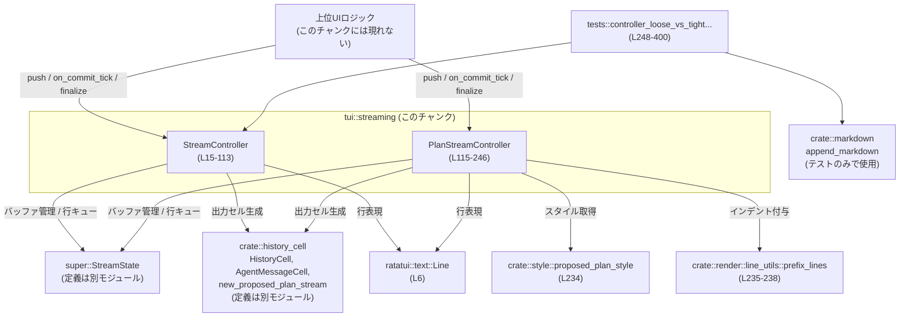
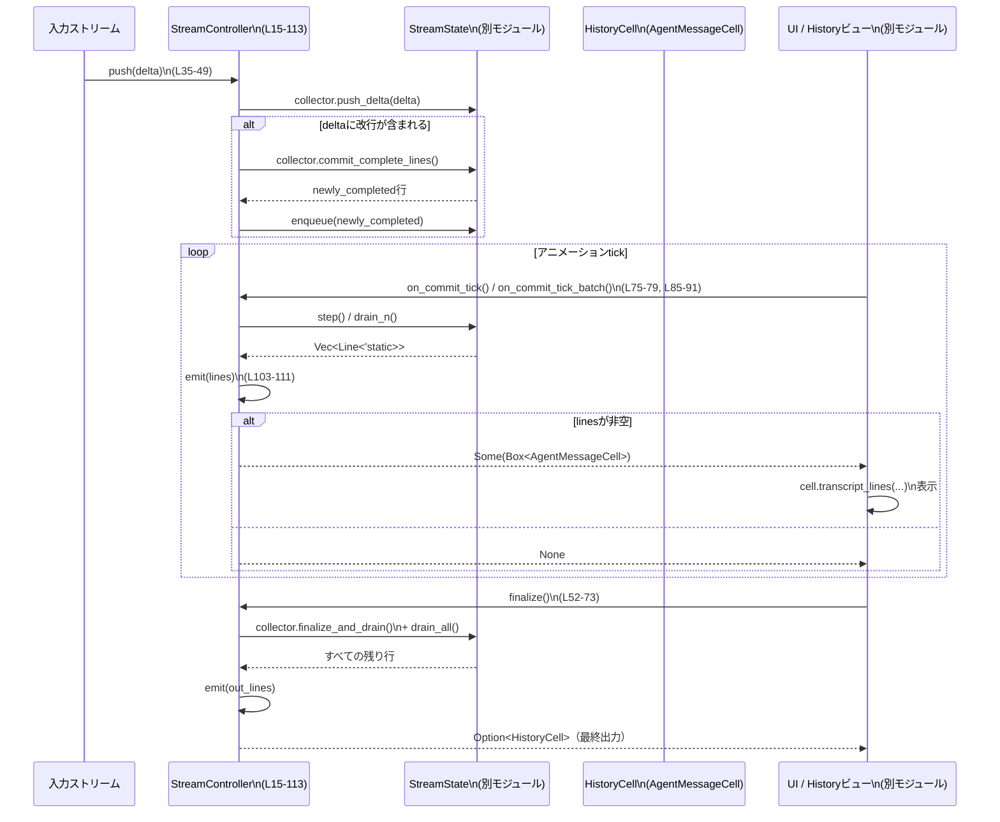
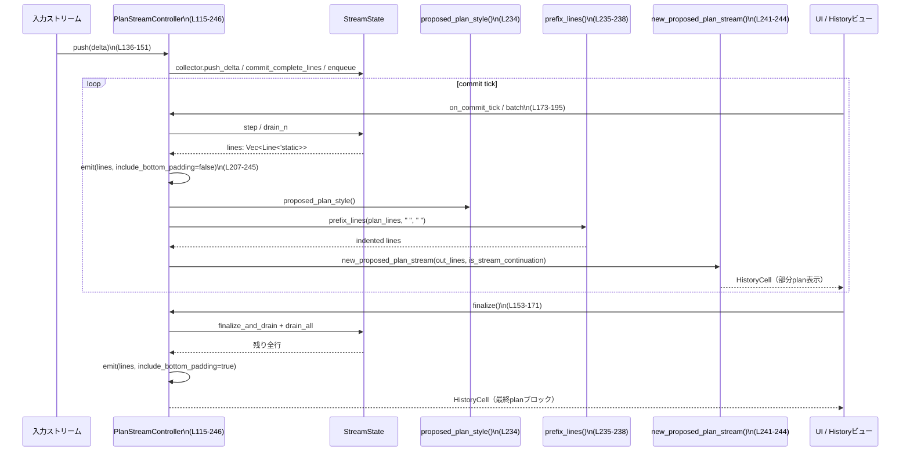

tui/src/streaming/controller.rs

---

## 0. ざっくり一言

- Markdown のストリーミング（行単位のコミットとアニメーション表示）を制御するコントローラと、提案プラン専用のストリーミングコントローラを提供するモジュールです  
  （`StreamController` と `PlanStreamController`）。  
  （tui/src/streaming/controller.rs:L13-19, L115-120）

---

## 1. このモジュールの役割

### 1.1 概要

- このモジュールは **ストリーミングで受信するテキスト（Markdown）を、新規行ごとに UI に流す** ための制御層です。  
- **行バッファリング（改行まで蓄積）** と **キューからの段階的な取り出し（アニメーション）**、**ヘッダ行の挿入** を行い、`HistoryCell` として描画レイヤに渡します。  
  （tui/src/streaming/controller.rs:L13-19, L34-49, L75-79, L103-111）
- `PlanStreamController` は、同様の仕組みを「Proposed Plan」ブロック用に特化し、スタイル付与やインデントなどを追加で行います。  
  （tui/src/streaming/controller.rs:L115-120, L207-245）

### 1.2 アーキテクチャ内での位置づけ

このモジュールが依存する主なコンポーネントと、上位レイヤからの呼び出し関係を簡略化した図です。



### 1.3 設計上のポイント

- **責務分割**
  - `StreamController` は汎用のメッセージストリームを担当し、`history_cell::AgentMessageCell` を生成します。  
    （tui/src/streaming/controller.rs:L15-19, L103-111）
  - `PlanStreamController` は「Proposed Plan」専用で、ヘッダ・パディング・スタイル適用などを行ったうえで `new_proposed_plan_stream` を呼びます。  
    （tui/src/streaming/controller.rs:L115-120, L207-245）
  - 両者とも、行のバッファリングやキュー管理は `StreamState` に委譲しています。  
    （tui/src/streaming/controller.rs:L16, L117, L26-32, L128-134）

- **状態管理**
  - `StreamController` は `state`, `finishing_after_drain`, `header_emitted` を内部に持つ状態fulな構造体です。  
    （tui/src/streaming/controller.rs:L15-19）
  - `PlanStreamController` は `state`, `header_emitted`, `top_padding_emitted` を保持します。  
    （tui/src/streaming/controller.rs:L115-120）
  - すべての操作は `&mut self` を要求し、単一スレッド／単一所有者による逐次使用を前提としたインターフェースになっています。

- **行単位のコミット（newline-gated streaming）**
  - `push` はテキスト増分（delta）を受け取り、改行が含まれるまで `state.collector` にバッファし、改行が含まれる場合にだけ「完了した行」を `state.enqueue` します。  
    （tui/src/streaming/controller.rs:L34-49, L136-151）
  - 実際の表示への反映は `on_commit_tick` / `on_commit_tick_batch` で行われ、これらがキューから行を取り出し `emit` に渡します。  
    （tui/src/streaming/controller.rs:L75-79, L81-91, L173-180, L182-195）

- **エラーハンドリング方針**
  - 公開メソッドは `Result` ではなく、  
    - 「UI に反映すべき新しい内容があるか」を `Option<Box<dyn HistoryCell>>` で表現し、  
    - 「まだキューに残りがあるか」を `bool` で返します。  
    （tui/src/streaming/controller.rs:L75-79, L85-91, L173-180, L186-195）
  - このファイル内には `panic!` や `unwrap` は登場せず、エラーは下位層（`StreamState` や `history_cell`）に隠蔽されています。

- **並行性**
  - すべてのメソッドは `&mut self` を取り、内部可変性（`RefCell` 等）は使われていません。このため、Rust の借用規則により「同時に複数スレッドから操作」するような誤用はコンパイル時に防がれます。
  - 非同期コンテキストとの接点はテスト（`#[tokio::test]`）のみであり、コントローラ自身は同期 API です。  
    （tui/src/streaming/controller.rs:L272-273）

---

## 2. 主要な機能一覧

- ストリーム開始時のコンテキスト（行幅・cwd）のスナップショット取得 (`new`)  
  （tui/src/streaming/controller.rs:L26-32, L128-134）
- テキスト増分（delta）の受付と、改行単位での行バッファ確定（`push`）  
  （tui/src/streaming/controller.rs:L34-49, L136-151）
- 行キューからの段階的な取り出し（アニメーション用 commit tick / batch tick）  
  （tui/src/streaming/controller.rs:L75-79, L81-91, L173-180, L182-195）
- ストリーム終了時の残余バッファのフラッシュ（`finalize`）  
  （tui/src/streaming/controller.rs:L51-73, L153-171）
- 現在のキュー長と最古行の滞留時間の取得（監視・適応制御用）  
  （tui/src/streaming/controller.rs:L93-101, L197-205）
- 一般メッセージストリームの `HistoryCell` ラップ (`AgentMessageCell::new`)  
  （tui/src/streaming/controller.rs:L103-111）
- 「Proposed Plan」ブロックのヘッダ・インデント・スタイル適用と `HistoryCell` 生成  
  （tui/src/streaming/controller.rs:L207-245）
- ストリーミング結果が非ストリーミング描画と一致することの検証テスト  
  （tui/src/streaming/controller.rs:L272-400）

---

## 3. 公開 API と詳細解説

### 3.1 型一覧（構造体・列挙体など）

| 名前 | 種別 | 役割 / 用途 | 定義位置 |
|------|------|-------------|----------|
| `StreamController` | 構造体 | 一般メッセージのストリーミング制御。改行で行を確定し、commit tick ごとに `HistoryCell` を生成する。 | tui/src/streaming/controller.rs:L15-19 |
| `PlanStreamController` | 構造体 | 「Proposed Plan」専用のストリーミング制御。ヘッダ・パディング・スタイル付きの計画ブロックを構築する。 | tui/src/streaming/controller.rs:L115-120 |
| `tests` モジュール | モジュール | `StreamController` のストリーミング結果がフルレンダリングと等価であることを検証するテスト群。 | tui/src/streaming/controller.rs:L248-401 |

（`StreamState` や `history_cell` の型はこのチャンクには定義がなく、モジュールパスのみ分かります。）

---

### 3.2 関数詳細（7件）

#### `StreamController::push(&mut self, delta: &str) -> bool`

**概要**

- ストリームから受け取ったテキスト増分 `delta` を内部バッファに追加し、  
  **改行を含む場合にだけ「完了した行」を行キューに積む** メソッドです。  
  （tui/src/streaming/controller.rs:L34-49）

**引数**

| 引数名 | 型 | 説明 |
|--------|----|------|
| `delta` | `&str` | 新たに到着したテキスト増分。改行を含むかどうかで処理が分岐します。 |

**戻り値**

- `bool`  
  - `true`: 新たにキューに積まれた行があり、アニメーションを進める価値があることを示します。  
  - `false`: キューには何も追加されていません（改行がなく行が確定していない、あるいは空 `delta`）。

**内部処理の流れ**

1. `delta` が空でなければ `state.has_seen_delta = true` にセットする（ストリームが何か受信した事実の記録）。  
   （tui/src/streaming/controller.rs:L36-39）
2. `state.collector.push_delta(delta)` により、`StreamState` 内部の「増分コレクタ」にテキストを追加。  
   （tui/src/streaming/controller.rs:L40）
3. `delta.contains('\n')` を確認し、改行が含まれていない場合は何も確定せず `false` を返す。  
   （tui/src/streaming/controller.rs:L41, L48）
4. 改行が含まれている場合は `state.collector.commit_complete_lines()` を呼び、  
   **改行までの完全な行を収集** する。  
   （tui/src/streaming/controller.rs:L42）
5. 収集された行が空でなければ `state.enqueue(newly_completed)` で行キューに積み、`true` を返す。  
   （tui/src/streaming/controller.rs:L43-45）
6. 行がなければ `false` を返す。  
   （tui/src/streaming/controller.rs:L47-48）

**Examples（使用例）**

```rust
use std::path::Path;
use tui::streaming::controller::StreamController; // モジュールパスは例示

fn drive_stream(mut deltas: Vec<String>) {
    let cwd = Path::new(".");                                      // 現在ディレクトリ
    let mut ctrl = StreamController::new(/*width*/ None, cwd);     // コントローラ生成

    for d in deltas.drain(..) {                                    // 各 delta を順番に処理
        let has_new_lines = ctrl.push(&d);                         // delta を追加
        if has_new_lines {
            // 新しい行がキューに入ったので commit tick を回す
            while let (Some(cell), idle) = ctrl.on_commit_tick() { // 1行ずつコミット
                let _lines = cell.transcript_lines(u16::MAX);      // HistoryCell から行を取得
                // ここで UI に描画するなどの処理を行う
                if idle {                                          // キューが空なら抜ける
                    break;
                }
            }
        }
    }

    if let Some(cell) = ctrl.finalize() {                          // ストリーム終了時に残りをフラッシュ
        let _lines = cell.transcript_lines(u16::MAX);
    }
}
```

**Errors / Panics**

- このメソッド自体は `Result` を返さず、明示的な `panic!` もありません。  
- 内部で呼び出している `state.collector.push_delta` や `commit_complete_lines` がどのようなエラー条件を持つかは、このチャンクからは分かりません。（`StreamState` の実装は別モジュール）

**Edge cases（エッジケース）**

- `delta` が空文字列 `""` の場合  
  - `has_seen_delta` は変更されず、キューにも何も追加されません（常に `false`）。  
    （tui/src/streaming/controller.rs:L36-39, L48）
- 改行を含まない `delta`（例: `"Hello"`）が繰り返し送られる場合  
  - `collector` 内部にはデータが蓄積されますが、行はまだ確定されず、push は常に `false` を返します。  
- 改行だけの `delta`（例: `"\n"`）  
  - 直前のバッファ内容に応じて空行または行末が確定し、`state.enqueue` に積まれる可能性があります。

**使用上の注意点**

- UI 側でアニメーションを行う場合は、`push` の戻り値 `true` をトリガとして `on_commit_tick` 等を呼び出す前提になっています。  
- `push` の呼び出しだけでは `HistoryCell` は生成されず、**必ず commit tick 系メソッドまたは `finalize` が必要**です。

---

#### `StreamController::finalize(&mut self) -> Option<Box<dyn HistoryCell>>`

**概要**

- 現在のストリームを終了させ、バッファとキューに残っているすべての行をまとめて `HistoryCell` として返します。  
  （tui/src/streaming/controller.rs:L51-73）

**引数**

- なし（`&mut self` のみ）

**戻り値**

- `Option<Box<dyn HistoryCell>>`  
  - `Some(cell)`: 残っていた行を含む `HistoryCell`。  
  - `None`: 出力すべき行が一切なかった場合（ヘッダも出さない）。

**内部処理の流れ**

1. `state.collector.finalize_and_drain()` を呼び、  
   **増分コレクタの残りをすべて行に変換** する。  
   （tui/src/streaming/controller.rs:L54-57）
2. `remaining` が空でなければ `state.enqueue(remaining)` でキューに積む。  
   （tui/src/streaming/controller.rs:L61-64）
3. `state.drain_all()` により、キュー上のすべての行を取り出し `out_lines` に格納する。  
   （tui/src/streaming/controller.rs:L65-67）
4. `self.state.clear()` で内部状態をリセットし、`finishing_after_drain` を `false` にセットする。  
   （tui/src/streaming/controller.rs:L69-71）
5. `self.emit(out_lines)` を呼び、`out_lines` が空でなければ `HistoryCell` を生成して返す。  
   （tui/src/streaming/controller.rs:L72-73, L103-111）

**Examples（使用例）**

テストコードと同様のパターンです。

```rust
let mut ctrl = StreamController::new(/*width*/ None, &test_cwd());          // 初期化
// ... push / on_commit_tick を繰り返してストリーミング ...

if let Some(cell) = ctrl.finalize() {                                       // 終了時のフラッシュ
    let lines = cell.transcript_lines(u16::MAX);                            // すべての行を取得
    // UI へ最終出力
}
```

（tui/src/streaming/controller.rs:L272-361 を参照）

**Errors / Panics**

- このメソッド自身に明示的なエラーはなく、`emit` が `None` を返す場合もエラーではなく「表示するものがない」という意味です。  
- `state.clear()` の具体的な挙動（リソース解放など）は `StreamState` の実装に依存し、このチャンクからは不明です。

**Edge cases**

- 一度も `push` を呼ばずに `finalize` した場合  
  - `remaining` もキューも空となり、`emit` が `None` を返すため、何も描画されません。  
    （tui/src/streaming/controller.rs:L54-67, L103-106）
- ストリーム途中で `finalize` を呼ぶ場合  
  - まだ改行が来ていないバッファ内容も `finalize_and_drain` により行として扱われる可能性があります（実際の分割ルールは `StreamState` 次第）。

**使用上の注意点**

- `finalize` を呼んだ後は `state.clear()` されていますが、このファイル内では `StreamController` の再利用（再度 `push` など）についての仕様は明示されていません。再利用可否は上位設計に依存します。  
- `finishing_after_drain` フィールドは `new` と `finalize` で `false` に設定されるのみで、このファイル内では参照されていません（用途は不明です）。  
  （tui/src/streaming/controller.rs:L17-18, L26-32, L69-72）

---

#### `StreamController::on_commit_tick(&mut self) -> (Option<Box<dyn HistoryCell>>, bool)`

**概要**

- アニメーションの「1ステップ」を進めるメソッドです。  
  **キューから 1 ステップ分の行を取り出して `HistoryCell` に変換し**、同時に「まだキューが残っているか」を返します。  
  （tui/src/streaming/controller.rs:L75-79）

**引数**

- なし（`&mut self` のみ）

**戻り値**

- `(Option<Box<dyn HistoryCell>>, bool)` のタプル
  - 第1要素: この tick で表示する内容。`None` なら表示はなし。
  - 第2要素: `state.is_idle()` の結果。`true` ならキューが空（アイドル）であることを意味します。

**内部処理の流れ**

1. `self.state.step()` を呼び、キューから 1 ステップ分（通常は1行）の `Vec<Line<'static>>` を取得。  
   （tui/src/streaming/controller.rs:L77）
2. `self.emit(step)` で `HistoryCell` に変換。空行であれば `None`。  
   （tui/src/streaming/controller.rs:L77, L103-111）
3. 同時に `self.state.is_idle()` を評価し、キューが空かどうかを返す。  
   （tui/src/streaming/controller.rs:L78）

**Examples（使用例）**

テスト内の使用例:

```rust
for d in deltas.iter() {
    ctrl.push(d);                                                       // delta を追加
    while let (Some(cell), idle) = ctrl.on_commit_tick() {              // コミットを進める
        lines.extend(cell.transcript_lines(u16::MAX));                  // 出力行を蓄積
        if idle {                                                       // キューが空ならループ終了
            break;
        }
    }
}
```

（tui/src/streaming/controller.rs:L348-356）

**Errors / Panics**

- このメソッド自身はエラーやパニックを発生させません。

**Edge cases**

- キューが空のときに呼び出した場合
  - `state.step()` が空を返し、`emit` も `None` を返すと考えられますが、`step` の仕様は別モジュールのため厳密には不明です。  
- 非常に短い間隔で連続して呼び出す場合
  - 1 tick あたりの表示行数は `StreamState::step` の実装に依存しますが、設計コメントからは「高々1行」のコミットを意図しているように読めます。  
    （tui/src/streaming/controller.rs:L75）

**使用上の注意点**

- `while let (Some(cell), idle) = on_commit_tick()` のようなループパターンは、1 tick で複数ステップ進む可能性がある実装にも対応できます（ただし現在のコメントからは 1行想定）。  
- タイマー駆動のアニメーションなどで利用する場合、`idle == true` をもってタイマー停止のトリガにする設計が自然です。

---

#### `PlanStreamController::push(&mut self, delta: &str) -> bool`

**概要**

- 機能は `StreamController::push` と同様で、**計画テキストの増分を集め、改行単位で行キューに積む** メソッドです。  
  （tui/src/streaming/controller.rs:L136-151）

**引数・戻り値**

- 引数と戻り値の意味は `StreamController::push` と同じです。

**内部処理の流れ**

`StreamController::push` とほぼ同一の実装です。  
（tui/src/streaming/controller.rs:L137-151）

**Edge cases / 使用上の注意点**

- `PlanStreamController` 固有の違いは `emit` 側にあり、`push` 自体は一般版と同じ挙動です。  
- 最終的な表示は `emit` でヘッダやスタイルが追加されるため、「行キューの中身」と「ユーザーに見える行」が一致しない（インデントや空行が増える）点に注意が必要です。

---

#### `PlanStreamController::finalize(&mut self) -> Option<Box<dyn HistoryCell>>`

**概要**

- 提案プランストリームを終了し、残りの行をすべてプランブロックとして出力します。  
  **一般版と異なり、行が全く無くても「空の plan ブロック」を生成する場合がある** のが特徴です。  
  （tui/src/streaming/controller.rs:L153-171, L207-245）

**内部処理の流れ**

1. `state.collector.finalize_and_drain()` で残りのテキストを行に変換。  
   （tui/src/streaming/controller.rs:L155-158）
2. 空でなければ `state.enqueue(remaining)`。  
   （tui/src/streaming/controller.rs:L161-164）
3. `state.drain_all()` で全行を取り出して `out_lines` に格納。  
   （tui/src/streaming/controller.rs:L165-167）
4. `self.state.clear()` で状態をクリア。  
   （tui/src/streaming/controller.rs:L169）
5. `self.emit(out_lines, /*include_bottom_padding*/ true)` を呼ぶ。  
   - `include_bottom_padding = true` によって、`lines.is_empty()` でもヘッダとパディング付きの plan ブロックが生成されます。  
   （tui/src/streaming/controller.rs:L170-171, L207-214, L218-232）

**Edge cases**

- 1文字も受信していない状態で `finalize` した場合  
  - `lines` は空ですが `include_bottom_padding = true` のため `emit` は `None` を返さず、  
    「`Proposed Plan` ヘッダ + 上下に空行のみのブロック」が生成されます。  
    （tui/src/streaming/controller.rs:L207-232）
- すでに `on_commit_tick` 等で大部分を流した後の `finalize`  
  - 残りの行と、必要に応じた下パディングだけが追加されます。

**使用上の注意点**

- 「空 plan でも UI 上にはブロックが出る」という振る舞いが、この設計の契約と言えます。  
  必要に応じて呼び出し側で「plan が実質的に空か」を判定して `finalize` 自体を呼ぶかどうか制御する必要があります。

---

#### `PlanStreamController::emit(&mut self, lines: Vec<Line<'static>>, include_bottom_padding: bool) -> Option<Box<dyn HistoryCell>>`

**概要**

- Plan ストリーム固有の **レイアウト構築とスタイル適用の中核** です。  
- 渡された行に対し、ヘッダ・パディング・インデント・スタイルを追加し、`new_proposed_plan_stream` を用いて `HistoryCell` に包みます。  
  （tui/src/streaming/controller.rs:L207-245）

**引数**

| 引数名 | 型 | 説明 |
|--------|----|------|
| `lines` | `Vec<Line<'static>>` | `StreamState` から取り出された素の計画行。 |
| `include_bottom_padding` | `bool` | 下部に一行の空行パディングを含めるかどうか。`finalize` 時は `true`。 |

**戻り値**

- `Option<Box<dyn HistoryCell>>`
  - `None`: `lines` が空かつ `include_bottom_padding == false` の場合のみ（何も描画しない）。  
    （tui/src/streaming/controller.rs:L212-214）
  - `Some(cell)`: plan ブロックとして描画可能な `HistoryCell`。

**内部処理の流れ**

1. `lines.is_empty() && !include_bottom_padding` の場合は何も生成せず `None` を返す。  
   （tui/src/streaming/controller.rs:L212-214）
2. `out_lines` を空で初期化。  
   （tui/src/streaming/controller.rs:L216）
3. `header_emitted` を確認し、まだヘッダを出していない場合は:
   - `• Proposed Plan` 行を追加（`•` を dim スタイル、`Proposed Plan` を bold）。  
     （tui/src/streaming/controller.rs:L218-221）
   - その下に空行を1行追加。  
   - `header_emitted = true` にセット。  
4. `plan_lines` を空で作り、`top_padding_emitted` が偽なら先頭に空行を追加し、真にセット。  
   （tui/src/streaming/controller.rs:L224-228）
5. `plan_lines.extend(lines)` で本文行を追加。  
   （tui/src/streaming/controller.rs:L229）
6. `include_bottom_padding` が真なら末尾にも空行を追加。  
   （tui/src/streaming/controller.rs:L230-232）
7. `proposed_plan_style()` で plan 用スタイル（色等）を取得し、  
   `prefix_lines(plan_lines, "  ".into(), "  ".into())` で各行に 2スペースのインデントを付ける。  
   その後 `.style(plan_style)` でまとめてスタイルを適用。  
   （tui/src/streaming/controller.rs:L234-238）
8. 生成した plan 行を `out_lines` に結合。  
   （tui/src/streaming/controller.rs:L239）
9. `history_cell::new_proposed_plan_stream(out_lines, is_stream_continuation)` を呼んで `HistoryCell` を生成し、`Some(Box::new(...))` として返す。  
   - `is_stream_continuation` は `header_emitted` の過去値であり、「このセルが plan ブロックの継続かどうか」を示します。  
   （tui/src/streaming/controller.rs:L217, L241-244）

**Examples（使用例）**

擬似的な使用例です（実際には `emit` は内部メソッドで、直接呼び出しません）。

```rust
let mut ctrl = PlanStreamController::new(/*width*/ None, &cwd);
// push / on_commit_tick を経由して、内部で emit が呼ばれ HistoryCell が生成される
while let (Some(cell), idle) = ctrl.on_commit_tick() {
    let lines = cell.transcript_lines(u16::MAX);
    // lines[0] には "• Proposed Plan" ヘッダ
    // 以降の行には 2スペースインデント & plan_style が適用された計画行が入る
}
```

**Errors / Panics**

- `proposed_plan_style`, `prefix_lines`, `style` 呼び出しには明示的なエラー処理がなく、この関数内でパニックが起こるコードはありません。  
- メモリ確保に失敗した場合などのランタイムエラーは Rust ランタイムに依存し、このコードからは制御できません。

**Edge cases**

- 2回目以降の `emit` 呼び出し  
  - `header_emitted` が真のため、ヘッダ行は追加されません。  
  - `top_padding_emitted` が真なので、先頭の空行も追加されず、新しい行だけがインデント & スタイルを付けられて追加されます。  
- `include_bottom_padding == false` の通常 tick では、末尾の空行が追加されません。  
  - これにより、ストリーミング中は余計な空きが増えず、`finalize` 時にだけきれいなブロック終端が挿入されます。

**使用上の注意点**

- `emit` の呼び出しフロー（`on_commit_tick` / `on_commit_tick_batch` / `finalize`）によって `include_bottom_padding` の値が変化するため、  
  「どのタイミングで plan ブロックの上下にどれだけの空行が出るか」が変わります。UI デザイン上これを前提として扱う必要があります。  
  （tui/src/streaming/controller.rs:L170-171, L176-178, L190-193）

---

#### `controller_loose_vs_tight_with_commit_ticks_matches_full()`

**概要**

- `StreamController` のストリーミング出力が、同じテキストを非ストリーミングで `append_markdown` した結果と**完全に一致する**ことを検証する非同期テストです。  
  特に Loose / Tight な箇条書きの扱いが一致するかを確認しています。  
  （tui/src/streaming/controller.rs:L272-400）

**引数・戻り値**

- `#[tokio::test] async fn ...()` のためテストフレームワークから呼び出され、引数・戻り値はありません。  
  （戻り値型は暗黙の `()`）

**テストの流れ**

1. `StreamController::new` でコントローラを生成。  
   （tui/src/streaming/controller.rs:L274）
2. `deltas` ベクタに、Loose / Tight 箇条書きセクションを構成するテキスト増分（細かく分割された文字列）を準備。  
   （tui/src/streaming/controller.rs:L277-346）
3. 各 `delta` について:
   - `ctrl.push(d)` を呼ぶ。  
   - その後 `while let (Some(cell), idle) = ctrl.on_commit_tick()` ループでコミット済み行を `lines` に集約。  
   （tui/src/streaming/controller.rs:L348-357）
4. 全ての delta を処理したら、`ctrl.finalize()` で残りをフラッシュし、同様に `lines` に追加。  
   （tui/src/streaming/controller.rs:L358-361）
5. `lines_to_plain_strings` で `lines` から文字列だけを取り出し、  
   各行の先頭2文字を `chars().skip(2)` でスキップして `streamed` とする（ヘッダやインデントを除外する意図）。  
   （tui/src/streaming/controller.rs:L363-367）
6. 同じ `deltas` を連結して `source` を作成し、`crate::markdown::append_markdown` で一括レンダリングした結果を `rendered_strs` として取得。  
   （tui/src/streaming/controller.rs:L369-379）
7. `assert_eq!(streamed, rendered_strs)` でストリーミング版とフルレンダリング版の一致を確認。  
   （tui/src/streaming/controller.rs:L381）
8. さらに、期待される具体的な行配列 `expected` と `streamed` の完全一致も検証。  
   （tui/src/streaming/controller.rs:L384-398）

**カバーしている契約 / エッジケース**

- **Loose vs Tight リストのレンダリングが streaming / non-streaming で一致すること**  
  → Markdown の構文解釈が、入力の分割単位（delta 増分）に依存しないことを保証します。  
- **複数の空行・入れ子リストなどの複雑なレイアウト**  
  → 空行、入れ子リスト（nested bullet）、段落の継続行などのケースを含む。  
  （tui/src/streaming/controller.rs:L277-346）

---

### 3.3 その他の関数

実装は簡潔で、振る舞いが明確な補助メソッドを一覧にまとめます。

| 関数名 | 所属 | 役割（1行） | 定義位置 |
|--------|------|-------------|----------|
| `StreamController::new` | `StreamController` | `StreamState::new` を呼び、幅と cwd をスナップショットしてコントローラを初期化する。 | tui/src/streaming/controller.rs:L26-32 |
| `StreamController::on_commit_tick_batch` | `StreamController` | 最大 `max_lines.max(1)` 行まで一度に drain して `HistoryCell` を生成する。 | tui/src/streaming/controller.rs:L85-91 |
| `StreamController::queued_lines` | `StreamController` | 現在キューにある行数を返す（`state.queued_len()`）。 | tui/src/streaming/controller.rs:L93-96 |
| `StreamController::oldest_queued_age` | `StreamController` | 最古のキュー行がどれだけキューに滞留しているか（`Duration`）を返す。 | tui/src/streaming/controller.rs:L98-101 |
| `StreamController::emit` | `StreamController` | 行ベクタを `AgentMessageCell` にラップし、初回のみヘッダフラグを立てる。 | tui/src/streaming/controller.rs:L103-111 |
| `PlanStreamController::new` | `PlanStreamController` | plan ストリーム用に `StreamState` を初期化し、ヘッダ／パディングフラグをリセットする。 | tui/src/streaming/controller.rs:L128-134 |
| `PlanStreamController::on_commit_tick` | `PlanStreamController` | 1ステップ分の行を取り出し、plan ブロックとして部分表示する。 | tui/src/streaming/controller.rs:L173-180 |
| `PlanStreamController::on_commit_tick_batch` | `PlanStreamController` | 最大 `max_lines.max(1)` 行をまとめて表示（catch-up drain 用）。 | tui/src/streaming/controller.rs:L186-195 |
| `PlanStreamController::queued_lines` | `PlanStreamController` | plan 行キューの長さを返す。 | tui/src/streaming/controller.rs:L197-200 |
| `PlanStreamController::oldest_queued_age` | `PlanStreamController` | plan 行の最古滞留時間を返す。 | tui/src/streaming/controller.rs:L202-205 |
| `test_cwd` | `tests` | テスト用に安定した絶対パスの cwd を返す（`std::env::temp_dir()`）。 | tui/src/streaming/controller.rs:L253-257 |
| `lines_to_plain_strings` | `tests` | `Line` の `spans` から文字列を抽出して連結し、`Vec<String>` に変換する。 | tui/src/streaming/controller.rs:L259-270 |

---

## 4. データフロー

### 4.1 一般ストリームのデータフロー（StreamController）

「delta が届いてから行が UI に表示されるまで」の代表的フローを示します。



### 4.2 Plan ストリームのデータフロー（PlanStreamController）



---

## 5. 使い方（How to Use）

### 5.1 基本的な使用方法（StreamController）

ストリーミングでメッセージを表示する典型的なコードフロー例です。

```rust
use std::path::Path;
use tui::streaming::controller::StreamController; // 実際のパスは crate に依存

fn stream_message_example() {
    let cwd = Path::new(".");                                      // セッション開始時の cwd を決める
    let mut ctrl = StreamController::new(/*width*/ None, cwd);     // コントローラを初期化

    let deltas = vec!["Hello", " world", "!\n", "Second line\n"];  // ストリームから届く増分の例

    for d in deltas {
        let has_new_lines = ctrl.push(d);                          // 増分をバッファ & 行確定
        if has_new_lines {
            // 行がキューに積まれたのでコミットステップを進める
            while let (Some(cell), idle) = ctrl.on_commit_tick() {
                let lines = cell.transcript_lines(u16::MAX);       // 描画用の行を取得
                // ここで ratatui のバッファに描画するなどの処理を行う
                if idle {                                          // キューが空になったら抜ける
                    break;
                }
            }
        }
    }

    // ストリームが完全に終了したら finalize で残りをフラッシュ
    if let Some(cell) = ctrl.finalize() {
        let lines = cell.transcript_lines(u16::MAX);
        // 最終出力を描画
    }
}
```

### 5.2 PlanStreamController の使用パターン

「Proposed Plan」ブロックを段階的に表示する例です。

```rust
use std::path::Path;
use tui::streaming::controller::PlanStreamController;

fn stream_plan_example() {
    let cwd = Path::new(".");
    let mut plan_ctrl = PlanStreamController::new(/*width*/ None, cwd);

    let plan_deltas = vec![
        "1. First step\n",
        "2. Second step\n",
        "3. Third step\n",
    ];

    for d in plan_deltas {
        let has_new_lines = plan_ctrl.push(d);
        if has_new_lines {
            while let (Some(cell), idle) = plan_ctrl.on_commit_tick() {
                let lines = cell.transcript_lines(u16::MAX);
                // lines[0]: "• Proposed Plan" （最初の emit の場合）
                // 以降: インデント & スタイル付きの plan 行
                if idle {
                    break;
                }
            }
        }
    }

    if let Some(final_cell) = plan_ctrl.finalize() {
        let lines = final_cell.transcript_lines(u16::MAX);
        // plan ブロック全体を描画（末尾に空行パディングあり）
    }
}
```

### 5.3 よくある間違いと正しい使い方

```rust
// 間違い例: push だけ呼んで commit tick を呼ばない
let mut ctrl = StreamController::new(None, &cwd);
ctrl.push("Hello world\n");
// このままでは HistoryCell が生成されず、UI には何も表示されない

// 正しい例: push の後に on_commit_tick / finalize を呼ぶ
let mut ctrl = StreamController::new(None, &cwd);
ctrl.push("Hello world\n");
while let (Some(cell), idle) = ctrl.on_commit_tick() {
    let _lines = cell.transcript_lines(u16::MAX);
    if idle {
        break;
    }
}
if let Some(cell) = ctrl.finalize() {
    let _lines = cell.transcript_lines(u16::MAX);
}
```

```rust
// 間違い例: on_commit_tick_batch に 0 を渡して何もしないことを期待する
let (cell, idle) = ctrl.on_commit_tick_batch(0);
// 実際には max_lines.max(1) により 1 行は drain される

// 正しい理解:
// 0 を渡しても「最低1行」は進みます。0 行進めたい場合はそもそも呼び出さない必要があります。
```

（tui/src/streaming/controller.rs:L85-91, L186-195）

### 5.4 使用上の注意点（まとめ）

- **ストリームライフサイクル**
  - `new` → （`push` / `on_commit_tick` を繰り返し）→ `finalize` というライフサイクルを前提とした設計です。  
  - `finalize` を呼ばないと、最後の行やヘッダが UI に出ない場合があります。

- **ヘッダ表示**
  - `StreamController` では、最初に非空の `lines` を `emit` したタイミングでのみ、`AgentMessageCell` 側でヘッダが付与されるような設計が想定されています（`header_emitted` フラグ）。  
    （tui/src/streaming/controller.rs:L103-111）
  - `PlanStreamController` では、最初の `emit` で `• Proposed Plan` ヘッダが必ず出力されます。  
    （tui/src/streaming/controller.rs:L218-221）

- **安全性 / エラー**
  - このファイルには `unsafe` ブロックは存在せず、Rust の所有権・借用規則に従う安全なインターフェースです。  
  - 例外的な状況は `Option` や `bool` で表現され、`panic!` や `unwrap` による失敗は使われていません。

- **並行性**
  - すべての操作が `&mut self` を要求するため、**同じコントローラを複数スレッドで同時に操作することはコンパイルエラー**になります。  
  - 非同期環境（tokio など）で使用する場合も、スレッドセーフなキュー越しに単一タスクがコントローラを所有する、という設計が自然です。

---

## 6. 変更の仕方（How to Modify）

### 6.1 新しいストリーミングモードを追加する場合

例: 「コードブロックだけを別スタイルでストリーミングするコントローラ」を追加したい場合。

1. **新しいコントローラ構造体を定義**
   - 本ファイルと同じモジュールに `CodeBlockStreamController` のような構造体を定義し、`state: StreamState` とヘッダ管理用フラグを持たせる。  
   - `StreamController` / `PlanStreamController` の `new` 実装（tui/src/streaming/controller.rs:L26-32, L128-134）を参考に、幅と cwd を `StreamState::new` に渡す。

2. **push / on_commit_tick / finalize の 3 点セットを実装**
   - `push` / `on_commit_tick` / `on_commit_tick_batch` / `finalize` は、既存コントローラとほぼ同じパターン（`StreamState` への委譲）で実装可能です。  
   - 差異がある場合は `emit` 相当の内部メソッドで吸収します。

3. **emit 相当のメソッドでスタイルやレイアウトを構築**
   - `PlanStreamController::emit`（tui/src/streaming/controller.rs:L207-245）のように、ヘッダ行追加・パディング・インデント・スタイル適用を行い、  
     最後に `history_cell` モジュールの適切なコンストラクタ関数を呼び出します。

4. **テストの追加**
   - 既存のテスト `controller_loose_vs_tight_with_commit_ticks_matches_full`（L272-400）を参考に、  
     ストリーミング vs 非ストリーミングで同じ出力になることを検証するテストを追加します。

### 6.2 既存の機能を変更する場合の注意点

- **契約の確認**
  - `StreamController` と `PlanStreamController` のメソッドは、上位コードから多数呼ばれている可能性があります。このチャンク内では呼び出し元はテストのみですが、実運用コードは別モジュールにあります。  
    変更前に `grep` 等で使用箇所を確認する必要があります。

- **前提条件・返り値の意味**
  - `push` が返す `bool` は「アニメーションを進めるべきか」のシグナルとして利用されていると考えられます。  
    これを別の意味で使用すると、既存コードの挙動が変わる恐れがあります。  
  - `on_commit_tick` / `on_commit_tick_batch` の第2戻り値 `bool` は「idle かどうか」の契約になっています（テスト L348-356 参照）。

- **テスト更新**
  - Markdown レンダリング結果を厳密に比較するテスト（L272-400）があるため、  
    行の分割や空行の扱いを変える場合にはテストの期待値も合わせて更新する必要があります。

---

## 7. 関連ファイル

| パス / モジュール | 役割 / 関係 |
|-------------------|------------|
| `super::StreamState` | 行のバッファリング、キュー管理、`collector` や `enqueue` / `drain_*` / `step` / `queued_len` / `oldest_queued_age` / `clear` を提供する内部状態オブジェクト。このチャンクには定義がありません。 |
| `crate::history_cell` | `HistoryCell` トレイト、`AgentMessageCell::new`、`new_proposed_plan_stream` 関数などを提供し、本モジュールから生成された行ベクタを UI 表示用セルへラップします。 （tui/src/streaming/controller.rs:L1-3, L103-111, L241-244） |
| `crate::render::line_utils::prefix_lines` | `PlanStreamController::emit` で plan 行にインデントを付与する関数。 （tui/src/streaming/controller.rs:L3, L235-238） |
| `crate::style::proposed_plan_style` | plan ブロックに適用するスタイルを返す関数。`PlanStreamController::emit` で利用。 （tui/src/streaming/controller.rs:L4, L234） |
| `ratatui::text::Line` | 1 行分のテキストとスタイルを表す型。両コントローラの内部表現・テストで使用。 （tui/src/streaming/controller.rs:L6, L103-111, L207-245, L259-270） |
| `crate::markdown::append_markdown` | テスト内で使用される Markdown レンダリング関数。ストリーミング結果との一致を検証する。 （tui/src/streaming/controller.rs:L370-378） |

---

### Bugs / Security / Contracts / Edge Cases まとめ（このチャンクで観測できる範囲）

- **潜在的な不明点**
  - `StreamController` の `finishing_after_drain` フィールドは、このファイル内では書き込みのみで読み出されておらず、用途は不明です。  
    （tui/src/streaming/controller.rs:L17-18, L26-32, L69-72）  
    ただし、これだけではバグとは断定できません（他のモジュールで使用されている可能性があります）。

- **セキュリティ**
  - このモジュールはファイル I/O やネットワーク、コマンド実行などを直接行っておらず、受信済みテキストの整形に限定されています。  
    このチャンクから読み取れる範囲では、特別なセキュリティリスクは見当たりません。

- **契約 / エッジケース**
  - `push` が改行のない `delta` を受け取った場合に行が確定しないこと、  
    `finalize` が残りのテキストをすべて行として処理することなどが、実質的な API 契約になっています。  
  - `PlanStreamController::finalize` が「空 plan でもブロックを生成する」挙動は、UI 仕様として重要な契約になり得ます。  

- **テストでカバーされない点**
  - このチャンクのテストは Loose / Tight lists を詳細に検証しますが、  
    - 非 ASCII 文字  
    - 非常に長い行や大量の delta  
    - `on_commit_tick_batch` の挙動  
    などのエッジケースはカバーされていません。これらは別途テストされている可能性がありますが、このチャンクからは分かりません。

- **パフォーマンス / スケーラビリティ（概要）**
  - `on_commit_tick_batch` に非常に大きな `max_lines` を渡すと、「アニメーションではなく一気に出る」挙動になるとコメントされています（tui/src/streaming/controller.rs:L81-85, L182-185）。  
  - `PlanStreamController::emit` では `prefix_lines` と `style` 適用により各行ごとの処理が発生するため、大量の行を一度に処理する場合には若干のコストが増えますが、このレベルの UI コードとしては一般的な範囲と考えられます。
