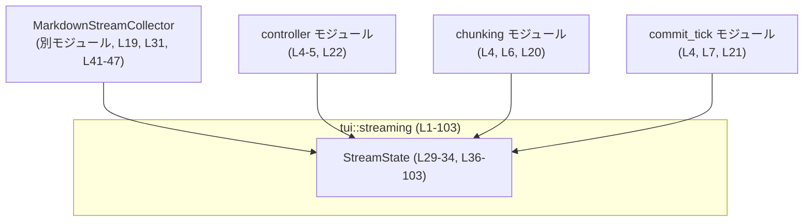
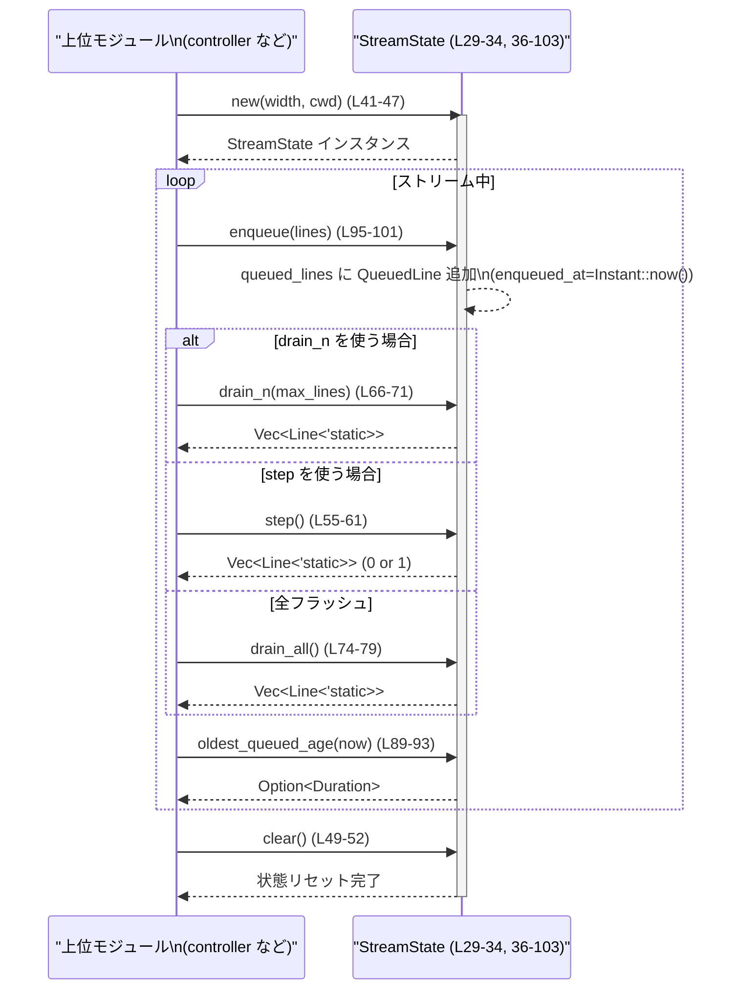

# tui\src\streaming\mod.rs コード解説

## 0. ざっくり一言

TUI のトランスクリプト表示パイプラインで使う、**ストリーム中の Markdown とレンダリング行キューを管理するためのプリミティブ**を提供するモジュールです（tui\src\streaming\mod.rs:L1-10, L29-34）。  

---

## 1. このモジュールの役割

### 1.1 概要

- このモジュールは、TUI のトランスクリプトストリームにおいて、
  - **Markdown のストリーム収集**と（tui\src\streaming\mod.rs:L3, L29-32）
  - **レンダリング用行（`Line<'static>`）の FIFO キュー管理**
  を担います（tui\src\streaming\mod.rs:L3, L24-27, L29-33）。
- 上位の `controller` / `chunking` / `commit_tick` モジュールは、この `StreamState` を土台として制御ロジックを構成します（tui\src\streaming\mod.rs:L4-7, L20-22）。
- 重要な不変条件は「**キューの順序保持**」であり、**全ての drain 操作は先頭から取り出し、enqueue 時に到着時刻を記録**することで、テキスト内容を覗かずとも「最も古い行の滞留時間」を計測可能にしています（tui\src\streaming\mod.rs:L9-10, L24-27, L89-92, L94-101）。

### 1.2 アーキテクチャ内での位置づけ

- `StreamState` は、
  - 下位の `MarkdownStreamCollector` に依存し（tui\src\streaming\mod.rs:L19, L31, L41-47）、
  - 上位の `controller` / `chunking` / `commit_tick` モジュールから利用される「中核の状態オブジェクト」として位置づけられています（tui\src\streaming\mod.rs:L4-7, L20-22, L29-34）。



- `controller`:
  - キューされた行を `HistoryCell` という表示用単位に変換する役割を持つとコメントされています（tui\src\streaming\mod.rs:L4-5）。
- `chunking`:
  - キューの“圧力”（深さや滞留時間）から「どれだけ drain するか」という計画を計算すると記述されています（tui\src\streaming\mod.rs:L6）。
- `commit_tick`:
  - `chunking` 等のポリシー決定を実際の `controller` drain 呼び出しに結びつける役割とされています（tui\src\streaming\mod.rs:L7）。

（これら上位モジュールの具体的な実装は、このチャンクには現れません。）

### 1.3 設計上のポイント

- **責務分割**
  - Markdown の収集とレンダリング行キューの管理を `StreamState` にまとめ、ポリシーや UI への出力は他モジュールに委ねています（tui\src\streaming\mod.rs:L3-7, L29-34）。
- **状態の構成**
  - `MarkdownStreamCollector`（Markdown 断片の蓄積）と、`QueuedLine` の FIFO キュー、そして `has_seen_delta` フラグを 1 つの構造体にまとめています（tui\src\streaming\mod.rs:L24-27, L29-33）。
- **時間情報による制御**
  - `Instant` と `Duration` を用い、行ごとの enqueued 時刻と先頭行の「経過時間」を計測できるようにしています（tui\src\streaming\mod.rs:L14-15, L24-27, L89-92, L95-101）。
- **Rust の安全性**
  - すべてのミューテーションは `&mut self` メソッド経由で行われ、同時に複数の可変参照を持てないため、**データ競合（data race）はコンパイル時に防止**されます（tui\src\streaming\mod.rs:L41, L49, L55, L66, L74, L81, L85, L89, L95）。
  - キューに格納する行は `Line<'static>` であり、**ライフタイム `'static`** により、「プログラム全体のライフタイム中有効なデータのみを保持する」ことが型レベルで保証されます（tui\src\streaming\mod.rs:L25, L55, L66, L74, L95）。

---

## 2. 主要な機能一覧

- Markdown ストリームの収集状態とレンダリング行キューをまとめて保持する `StreamState` の提供（tui\src\streaming\mod.rs:L29-34）。
- ローカルファイルリンクの解決に対応した `StreamState::new` による初期化（tui\src\streaming\mod.rs:L37-41）。
- 次のストリーム用に collector とキューをまとめてリセットする `clear`（tui\src\streaming\mod.rs:L48-53）。
- 1 行のみ / 指定数 / 全行の drain（取り出し）メソッド：
  - `step`（1 行）・`drain_n`（最大 N 行）・`drain_all`（全行）（tui\src\streaming\mod.rs:L54-79）。
- キュー状態の問い合わせ：
  - 空かどうか (`is_idle`)、長さ (`queued_len`)、最古行の滞留時間 (`oldest_queued_age`)（tui\src\streaming\mod.rs:L80-93）。
- 行の enqueue（追加）と enqueued 時刻の記録 (`enqueue`)（tui\src\streaming\mod.rs:L94-101）。
- `drain_n` が「要求数より少ない場合でも安全に動作する」ことを確認するテスト（tui\src\streaming\mod.rs:L118-125）。

### 2.1 コンポーネントインベントリー（構造体・モジュール）

| コンポーネント | 種別 | 役割 / 説明 | 定義位置 |
|----------------|------|-------------|----------|
| `chunking` | モジュール | キュー圧力に応じた drain 計画を計算する上位モジュールとコメントされています | tui\src\streaming\mod.rs:L4, L6, L20 |
| `commit_tick` | モジュール | ポリシー決定を実際の controller drain 呼び出しに結びつけるモジュールとコメントされています | tui\src\streaming\mod.rs:L4, L7, L21 |
| `controller` | モジュール | キューされた行を `HistoryCell` への出力規則に適用するモジュールとコメントされています | tui\src\streaming\mod.rs:L4-5, L22 |
| `QueuedLine` | 構造体（非公開） | 1 行分の `Line<'static>` とその enqueue 時刻 (`Instant`) を保持する | tui\src\streaming\mod.rs:L24-27 |
| `StreamState` | 構造体（`pub(crate)`） | Markdown collector、行キュー、フラグ `has_seen_delta` をまとめたストリーム状態 | tui\src\streaming\mod.rs:L29-34 |

### 2.2 コンポーネントインベントリー（関数・メソッド）

| 名前 | 所属 | 概要 | 定義位置 |
|------|------|------|----------|
| `StreamState::new` | `StreamState` impl | collector と空のキューを初期化 | tui\src\streaming\mod.rs:L37-47 |
| `StreamState::clear` | `StreamState` impl | collector とキューとフラグをリセット | tui\src\streaming\mod.rs:L48-53 |
| `StreamState::step` | `StreamState` impl | 先頭の 1 行だけを drain して `Vec` で返す | tui\src\streaming\mod.rs:L54-61 |
| `StreamState::drain_n` | `StreamState` impl | 最大 `max_lines` 行を先頭から drain して返す | tui\src\streaming\mod.rs:L62-71 |
| `StreamState::drain_all` | `StreamState` impl | 全てのキューを drain して返す | tui\src\streaming\mod.rs:L73-79 |
| `StreamState::is_idle` | `StreamState` impl | キューが空かどうかを返す | tui\src\streaming\mod.rs:L80-83 |
| `StreamState::queued_len` | `StreamState` impl | 現在のキュー長を返す | tui\src\streaming\mod.rs:L84-87 |
| `StreamState::oldest_queued_age` | `StreamState` impl | 先頭行の滞留時間を `Option<Duration>` で返す | tui\src\streaming\mod.rs:L88-93 |
| `StreamState::enqueue` | `StreamState` impl | 行群を現在時刻とともに enqueue する | tui\src\streaming\mod.rs:L94-101 |
| `test_cwd` | tests モジュール | テスト用の安定した cwd として `temp_dir` を返す | tui\src\streaming\mod.rs:L111-115 |
| `drain_n_clamps_to_available_lines` | tests モジュール | `drain_n` が行数を超える要求でも安全なことを検証 | tui\src\streaming\mod.rs:L118-125 |

---

## 3. 公開 API と詳細解説

このファイル内の「公開 API」は `pub(crate)` スコープで、同じクレート内の他モジュールから利用されることを想定しています（tui\src\streaming\mod.rs:L20-22, L29-31, L41, L49, L55, L66, L74, L81, L85, L89, L95）。

### 3.1 型一覧

| 名前 | 種別 | 役割 / 用途 | 主要フィールド | 定義位置 |
|------|------|-------------|----------------|----------|
| `QueuedLine` | 構造体（非公開） | キュー内の 1 レコードとして、レンダリング用行と enqueue 時刻をまとめる | `line: Line<'static>`（レンダリング行）、`enqueued_at: Instant`（登録時刻） | tui\src\streaming\mod.rs:L24-27 |
| `StreamState` | 構造体（`pub(crate)`） | ストリームの Markdown collector と、commit 済みレンダリング行キュー、および補助フラグを保持するメイン状態 | `collector: MarkdownStreamCollector`、`queued_lines: VecDeque<QueuedLine>`、`has_seen_delta: bool` | tui\src\streaming\mod.rs:L29-34 |

- `has_seen_delta` はこのファイルでは初期化と `clear` 時のリセットのみ行われており（tui\src\streaming\mod.rs:L33, L45-46, L52）、更新や利用は他モジュールに委ねられています（具体的な意味はこのチャンクからは分かりません）。

---

### 3.2 重要な関数・メソッド詳細（最大 7 件）

ここでは `StreamState` のうち、特に中心的な 7 メソッドについて詳しく説明します。

#### `StreamState::new(width: Option<usize>, cwd: &Path) -> StreamState`

**概要**

- Markdown collector を、ローカルファイルリンクを `cwd` 相対で解決するように初期化し、空のキューとフラグを持つ `StreamState` を生成します（tui\src\streaming\mod.rs:L37-47）。

**引数**

| 引数名 | 型 | 説明 |
|--------|----|------|
| `width` | `Option<usize>` | Markdown の折り返し幅など、collector の描画幅設定に渡されます（具体的意味は `MarkdownStreamCollector` 側の実装依存で、このチャンクには現れません）。tui\src\streaming\mod.rs:L41-43 |
| `cwd` | `&Path` | ローカルファイルリンク解決の基準パスとして使われるとコメントされています（tui\src\streaming\mod.rs:L37-41）。 |

**戻り値**

- 新しい `StreamState` インスタンス。
  - `collector` は `MarkdownStreamCollector::new(width, cwd)` で初期化（tui\src\streaming\mod.rs:L41-43）。
  - `queued_lines` は空の `VecDeque`（tui\src\streaming\mod.rs:L44）。
  - `has_seen_delta` は `false`（tui\src\streaming\mod.rs:L45-46）。

**内部処理の流れ**

1. `MarkdownStreamCollector::new(width, cwd)` を呼んで collector を構築（tui\src\streaming\mod.rs:L41-43）。
2. `VecDeque::new()` で空のキューを用意（tui\src\streaming\mod.rs:L44）。
3. `has_seen_delta` を `false` に設定（tui\src\streaming\mod.rs:L45-46）。
4. これらをフィールドに持つ `StreamState` を返却（tui\src\streaming\mod.rs:L41-47）。

**Examples（使用例）**

```rust
use std::path::Path;
use tui::streaming::StreamState; // 実際のパスはクレート構成に依存

fn create_state() -> StreamState {
    let cwd = Path::new("/some/session/dir");          // セッションのカレントディレクトリ
    let state = StreamState::new(Some(80), cwd);       // 幅 80 で初期化
    state
}
```

※ 実際のクレートパスはこのチャンクからは不明なので、`use` 行は擬似コードです。

**Errors / Panics**

- このメソッド内では結果型 `Result` を使用しておらず、明示的なエラー分岐もありません（tui\src\streaming\mod.rs:L41-47）。
- `MarkdownStreamCollector::new` の内部でエラーやパニックが起こるかどうかは、このチャンクからは分かりません。

**Edge cases（エッジケース）**

- `width` が `None` の場合:
  - そのまま collector に渡され、collector 側で「幅未指定」として扱われると推測されますが、具体的挙動はこのチャンクには現れません（tui\src\streaming\mod.rs:L41-43）。
- `cwd` が存在しないパスであっても、この関数では検証していません（tui\src\streaming\mod.rs:L41-47）。

**使用上の注意点**

- コメントに「セッションの cwd を一度渡し、アクティブなストリームのライフタイム中は安定させるべき」とあります（tui\src\streaming\mod.rs:L37-40）。  
  -> セッション中に `cwd` を変えたい場合は、新しい `StreamState` を作る前提の設計と解釈できます。

---

#### `StreamState::clear(&mut self)`

**概要**

- 現在のストリームを終了し、次のストリームに備えて collector・キュー・フラグをリセットします（tui\src\streaming\mod.rs:L48-53）。

**引数**

| 引数名 | 型 | 説明 |
|--------|----|------|
| `self` | `&mut StreamState` | 自身を可変参照で受け取り、内部状態を破壊的にリセットします（tui\src\streaming\mod.rs:L49-52）。 |

**戻り値**

- なし（`()`）。副作用として `collector`・`queued_lines`・`has_seen_delta` が初期状態に戻ります（tui\src\streaming\mod.rs:L49-52）。

**内部処理の流れ**

1. `self.collector.clear()` を呼んで collector 側の内部状態をリセット（tui\src\streaming\mod.rs:L50）。
2. `self.queued_lines.clear()` で行キューを空にする（tui\src\streaming\mod.rs:L51）。
3. `self.has_seen_delta = false` としてフラグを初期状態に戻す（tui\src\streaming\mod.rs:L52）。

**Examples（使用例）**

```rust
fn restart_stream(state: &mut StreamState) {
    // 前回ストリームの残りを破棄し、collector とキューをリセット
    state.clear();                                     // L49-52 相当
}
```

**Errors / Panics**

- `clear` 自身はパニックを発生させるコードを含みません（tui\src\streaming\mod.rs:L49-52）。
- `MarkdownStreamCollector::clear` の挙動はこのチャンクからは分かりませんが、一般にはオブジェクト内部状態のリセットが行われるはずです。

**Edge cases**

- すでにキューが空でも問題なく動作します（`VecDeque::clear` は冪等）（tui\src\streaming\mod.rs:L51）。
- `has_seen_delta` フラグの意味は外部モジュール依存のため、「リセットしてはいけないタイミング」が存在するかどうかは、このチャンクからは判断できません。

**使用上の注意点**

- ストリームのライフサイクル管理として、**新しいストリームを始める前の初期化処理**として使う位置づけです（コメントからの文脈、tui\src\streaming\mod.rs:L48-53）。
- 進行中のストリームに対して呼ぶと、そのストリームのデータが失われるため、呼び出しタイミングには注意が必要です。

---

#### `StreamState::enqueue(&mut self, lines: Vec<Line<'static>>)`

**概要**

- 引数で与えられた `Line<'static>` のベクタを、共通の enqueue 時刻 `Instant::now()` とともにキュー末尾に追加します（tui\src\streaming\mod.rs:L94-101）。

**引数**

| 引数名 | 型 | 説明 |
|--------|----|------|
| `self` | `&mut StreamState` | 内部キューに要素を追加するための可変参照（tui\src\streaming\mod.rs:L95-101）。 |
| `lines` | `Vec<Line<'static>>` | enqueue するレンダリング行群。すべて `'static` ライフタイム制約を満たす必要があります（tui\src\streaming\mod.rs:L95）。 |

**戻り値**

- なし（`()`）。副作用として、`queued_lines` に `QueuedLine` が追加されます（tui\src\streaming\mod.rs:L97-101）。

**内部処理の流れ**

1. `Instant::now()` で現在時刻を取得し、`now` に束縛（tui\src\streaming\mod.rs:L96）。
2. `lines.into_iter()` で行ベクタをイテレートし、各行ごとに `QueuedLine { line, enqueued_at: now }` を生成（tui\src\streaming\mod.rs:L97-101）。
3. それらを `self.queued_lines.extend(...)` でキュー末尾に追加（tui\src\streaming\mod.rs:L97-101）。

**Examples（使用例）**

```rust
use ratatui::text::Line;

fn enqueue_example(state: &mut StreamState) {
    let line1 = Line::from("hello");                   // 'static を満たす Line の生成方法は ratatui に依存
    let line2 = Line::from("world");
    state.enqueue(vec![line1, line2]);                 // 2 行を同じ enqueue 時刻で追加
}
```

**Errors / Panics**

- `Instant::now()` や `VecDeque::extend` は通常パニックを起こしません（tui\src\streaming\mod.rs:L96-101）。
- ここでは `Result` を返さないため、「失敗し得る処理」は行われていません。

**Edge cases**

- `lines` が空ベクタの場合:
  - `lines.into_iter()` は空になり、`extend` により何も追加されません（tui\src\streaming\mod.rs:L97-101）。  
  - `queued_lines` の状態は変わりません。
- `lines` の要素数が非常に多い場合:
  - その分だけ `VecDeque` が伸長されますが、特別な分割処理等は行いません（tui\src\streaming\mod.rs:L97-101）。

**使用上の注意点**

- 1 回の `enqueue` 呼び出しで渡した全ての行に**同じ `enqueued_at` が設定される**点が重要です（tui\src\streaming\mod.rs:L96-101）。  
  - つまり、「バッチとして一緒に来た行」として扱う設計になっています。
- `Line<'static>` 制約により、`Line` が一時的なバッファを参照している場合はそのままでは渡せません。  
  - 所有する `String` 等から作るなど、**ライフタイム `'static` を満たす方法**をとる必要があります。これは Rust の所有権・ライフタイムに基づく安全性の要件です。

---

#### `StreamState::drain_n(&mut self, max_lines: usize) -> Vec<Line<'static>>`

**概要**

- キュー先頭から最大 `max_lines` 行までを取り出し、それらを `Vec<Line<'static>>` として返します。  
- キューの残量が `max_lines` より少ない場合は、**存在する行数だけ取り出す**ようにクランプします（tui\src\streaming\mod.rs:L62-71）。

**引数**

| 引数名 | 型 | 説明 |
|--------|----|------|
| `self` | `&mut StreamState` | キューから行を取り出すための可変参照（tui\src\streaming\mod.rs:L66-71）。 |
| `max_lines` | `usize` | 1 回の呼び出しで取り出す行数の上限（tui\src\streaming\mod.rs:L66）。 |

**戻り値**

- 実際に取り出された行を要素とする `Vec<Line<'static>>`（tui\src\streaming\mod.rs:L66-71）。
- 取り出された行は `queued_lines` から削除されます（`drain(..end)` による）（tui\src\streaming\mod.rs:L68-71）。

**内部処理の流れ**

1. `self.queued_lines.len()` で現在のキュー長を取得し、それと `max_lines` の小さい方を `end` として決定（tui\src\streaming\mod.rs:L67）。
2. `self.queued_lines.drain(..end)` で、先頭から `end` 個の `QueuedLine` を取り出しつつイテレータを得る（tui\src\streaming\mod.rs:L68-71）。
3. `map(|queued| queued.line)` で `QueuedLine` を `Line<'static>` に変換（tui\src\streaming\mod.rs:L69-70）。
4. `collect()` で `Vec<Line<'static>>` にまとめて返す（tui\src\streaming\mod.rs:L71）。

**Examples（使用例）**

テストコードに近い形での使用例です（tui\src\streaming\mod.rs:L118-125）。

```rust
use ratatui::text::Line;

fn drain_example(state: &mut StreamState) {
    state.enqueue(vec![Line::from("one")]);            // 1 行だけ enqueue
    let drained = state.drain_n(8);                    // max_lines=8 だが 1 行しかない

    assert_eq!(drained.len(), 1);                      // 実際には 1 行だけ返る
    assert!(state.is_idle());                          // キューは空になっている
}
```

**Errors / Panics**

- `max_lines` がどんな値でも、`end = max_lines.min(self.queued_lines.len())` により配列範囲外を指定しないため、**インデックス範囲外アクセスによるパニックは起きません**（tui\src\streaming\mod.rs:L67-71）。
- `VecDeque::drain` や `collect` 自体も通常はパニックを起こしません（メモリ不足を除く）。

**Edge cases**

- `max_lines == 0` の場合:
  - `end` は `0` になり、`drain(..0)` により何も取り出さず、空の `Vec` を返します（tui\src\streaming\mod.rs:L67-71）。
- `max_lines` が非常に大きい場合:
  - `end` はキュー長にクランプされ、実際のキュー長以上は取り出しません（tui\src\streaming\mod.rs:L67-71）。
- キューが空の場合:
  - `self.queued_lines.len() == 0` のため、常に `end == 0` となり、空の `Vec` が返ります（tui\src\streaming\mod.rs:L67-71）。

**使用上の注意点**

- 「**一度にどれだけ UI に流すか**」といった制御で使われる想定です。`chunking` モジュールで計算した drain プランに基づいて `max_lines` を渡す形が考えられます（tui\src\streaming\mod.rs:L6, L62-71）。
- `drain_n` を呼ぶとキューから要素が削除されるため、再表示の必要がある場合は、返された `Vec<Line<'static>>` を別途保存する必要があります。

**関連するテスト**

- `drain_n_clamps_to_available_lines` テストは、`max_lines` がキュー長より大きくてもきちんと「ある分だけ」取り出すことを検証しています（tui\src\streaming\mod.rs:L118-125）。

---

#### `StreamState::drain_all(&mut self) -> Vec<Line<'static>>`

**概要**

- キューにある全ての行を先頭から順に取り出し、`Vec<Line<'static>>` で返します（tui\src\streaming\mod.rs:L73-79）。

**引数・戻り値**

- `&mut self` を受け取り、キューを空にしながら全行を返します（tui\src\streaming\mod.rs:L74-79）。

**内部処理**

- `self.queued_lines.drain(..)` で全範囲を drain し（tui\src\streaming\mod.rs:L75-77）、`QueuedLine` から `line` を取り出して `Vec` にまとめています（tui\src\streaming\mod.rs:L77-78）。

**Edge cases / 注意点**

- キューが空でも、空の `Vec` を返すだけで問題はありません（tui\src\streaming\mod.rs:L75-79）。
- 「一定間隔ごとにキューを完全にフラッシュする」ような用途に向いています。

---

#### `StreamState::step(&mut self) -> Vec<Line<'static>>`

**概要**

- キュー先頭の 1 行だけを取り出し、それを 1 要素の `Vec<Line<'static>>` として返します（tui\src\streaming\mod.rs:L54-61）。

**内部処理**

1. `self.queued_lines.pop_front()` で先頭の `QueuedLine` を `Option` として取り出し（tui\src\streaming\mod.rs:L56-57）。
2. あれば `queued.line` に変換（`map`）、なければ `None` のまま（tui\src\streaming\mod.rs:L58）。
3. `Option` に対して `.into_iter().collect()` を呼ぶことで、「1 要素または 0 要素」の `Vec<Line<'static>>` に変換（tui\src\streaming\mod.rs:L59-60）。

**Edge cases / 注意点**

- キューが空の場合、空の `Vec` を返します（tui\src\streaming\mod.rs:L56-60）。
- 1 行だけを逐次的に流したい場合に使うメソッドです。

---

#### `StreamState::oldest_queued_age(&self, now: Instant) -> Option<Duration>`

**概要**

- 現在時刻 `now` と、キュー最前列にある行の `enqueued_at` の差を計算し、その滞留時間を `Some(Duration)` で返します（tui\src\streaming\mod.rs:L88-93）。
- キューが空の場合は `None` を返します。

**引数**

| 引数名 | 型 | 説明 |
|--------|----|------|
| `self` | `&StreamState` | 読み取り専用でキューにアクセスします（tui\src\streaming\mod.rs:L89-93）。 |
| `now` | `Instant` | 現在時刻。呼び出し側で取得した `Instant::now()` などを渡す想定です（tui\src\streaming\mod.rs:L89-93）。 |

**戻り値**

- `Option<Duration>`:
  - キューに 1 つ以上行があれば、先頭行の滞留時間 (`Some(duration)`)。
  - キューが空であれば `None`（tui\src\streaming\mod.rs:L90-93）。

**内部処理**

1. `self.queued_lines.front()` で先頭の `QueuedLine` を `Option<&QueuedLine>` として取得（tui\src\streaming\mod.rs:L90-91）。
2. `map` で `now.saturating_duration_since(queued.enqueued_at)` を計算（tui\src\streaming\mod.rs:L92）。
   - `saturating_duration_since` は、`now < enqueued_at` になった場合でも 0 にクランプされ、パニックしない関数です。

**Edge cases**

- キューが空の場合:
  - `front()` が `None` を返し、そのまま `None` が戻り値になります（tui\src\streaming\mod.rs:L90-93）。
- `now` が `enqueued_at` よりも過去の `Instant` の場合:
  - `saturating_duration_since` により、`Duration::ZERO` が返ることが Rust の標準仕様です。  
    -> このメソッド内ではパニックしません（tui\src\streaming\mod.rs:L92）。

**使用上の注意点**

- キュー全体の滞留時間指標として、`chunking` モジュールなどのポリシー判断に使われることが想定されます（コメントからの文脈、tui\src\streaming\mod.rs:L6, L88-93）。
- `now` の取得タイミングは呼び出し側に委ねられているため、**同じ `now` を他の計測にも使う場合**は、呼び出し側で 1 度だけ `Instant::now()` を呼び、それを使い回す方が一貫性のある測定になります。

---

### 3.3 その他の関数

#### `StreamState::is_idle(&self) -> bool`

- キューが空 (`queued_lines.is_empty()`) であれば `true` を返します（tui\src\streaming\mod.rs:L80-83）。
- 「新しい行を待っている状態」かどうかのシンプルな判定に使えます。

#### `StreamState::queued_len(&self) -> usize`

- 現在キューに溜まっている行数を返します（tui\src\streaming\mod.rs:L84-87）。
- キュー圧力を測る簡易なメトリクスとして扱えます。

#### テスト関数

- `test_cwd()`:
  - `std::env::temp_dir()` を返す、テスト専用のヘルパーです（tui\src\streaming\mod.rs:L111-115）。
- `drain_n_clamps_to_available_lines`:
  - `drain_n` 呼び出し時に `max_lines` がキュー内行数より大きくても、**パニックせず存在する行数のみ drain** されることを検証します（tui\src\streaming\mod.rs:L118-125）。

---

### 3.4 安全性・エラーハンドリング・並行性（まとめ）

- **エラー処理**
  - このファイル内のメソッドは `Result` 型を返さず、I/O など失敗しうる操作も行っていないため、**明示的なエラー経路はありません**（tui\src\streaming\mod.rs:L41-102）。
- **パニックの可能性**
  - インデックス指定や `unwrap` は使用しておらず、`VecDeque::drain` もクランプされた範囲でのみ使用しています（tui\src\streaming\mod.rs:L67-71, L75-79）。
  - 標準ライブラリの `Instant` / `Duration` / `VecDeque` の通常利用であり、特筆すべきパニック要因はありません。
- **並行性**
  - 変更を行うメソッドはすべて `&mut self` を要求するため、Rust の型システム上、**同時に 2 つのスレッドから同じ `StreamState` を可変アクセスすることはできません**（tui\src\streaming\mod.rs:L49, L55, L66, L74, L95）。
  - `StreamState` が `Send` / `Sync` かどうかは、フィールド `MarkdownStreamCollector` と `Line<'static>` の実装に依存しており、このチャンクからは断定できません（tui\src\streaming\mod.rs:L31, L41-43, L55, L66, L74, L95）。

---

## 4. データフロー

ここでは、代表的なシナリオとして「上位モジュールが行を enqueue し、一定刻みで drain して TUI に渡す」流れを示します。

### 4.1 処理の要点

1. 上位モジュール（例: `controller`）が、描画すべき `Line<'static>` の集合を `StreamState::enqueue` に渡し、キューに溜めます（tui\src\streaming\mod.rs:L4-5, L94-101）。
2. 一定時間ごと、またはイベントごとに、`chunking` などで決めた行数 `max_lines` を使って `StreamState::drain_n` もしくは `step` / `drain_all` を呼び出します（tui\src\streaming\mod.rs:L6, L54-61, L62-71, L73-79）。
3. 返ってきた `Vec<Line<'static>>` を TUI コンポーネントに渡して描画します（描画側はこのチャンクには現れません）。
4. 必要に応じて `oldest_queued_age` や `queued_len` を用い、キュー滞留時間や深さに基づいたポリシー制御を行います（tui\src\streaming\mod.rs:L6, L84-87, L88-93）。

### 4.2 シーケンス図



---

## 5. 使い方（How to Use）

### 5.1 基本的な使用方法

テストのパターンを含めた典型的なコードフローです（tui\src\streaming\mod.rs:L111-115, L118-125）。

```rust
use std::path::PathBuf;
use ratatui::text::Line;
// use crate::streaming::StreamState; // 実際のパスはクレート構成に依存

fn main_loop_example() {
    // 1. 設定や依存オブジェクトを用意する
    let cwd: PathBuf = std::env::current_dir().unwrap();   // セッションの cwd とする

    // 2. StreamState を初期化する
    let mut state = StreamState::new(/*width*/ Some(80), &cwd);

    // 3. 入力を準備して enqueue を呼ぶ
    state.enqueue(vec![
        Line::from("first line"),
        Line::from("second line"),
    ]);

    // 4. chunking 等で決めた drain ポリシーに基づき drain_n を呼び出す
    let drained = state.drain_n(/*max_lines*/ 8);

    // 5. drained 行を UI に描画する（ここでは単に debug 表示）
    for line in drained {
        // Line 自体の表示方法は ratatui 側の API に依存
        println!("{:?}", line);
    }

    // 6. ストリームを切り替えるときに clear でリセット
    state.clear();
}
```

### 5.2 よくある使用パターン

1. **一括描画型**
   - 入力完了後に `enqueue` し、すぐ `drain_all` で全部取り出して描画する。
   - シンプルなバッチ描画用途（tui\src\streaming\mod.rs:L73-79, L94-101）。

2. **段階的描画型**
   - ストリームに行を随時 `enqueue` しつつ、一定間隔ごとに `drain_n` で少しずつ描画する。
   - `queued_len` や `oldest_queued_age` を見て `max_lines` を調整するなど、スロットリングやバックプレッシャー制御が可能です（tui\src\streaming\mod.rs:L6, L84-87, L88-93）。

3. **1 行ずつの逐次描画**
   - 「1 ティックにつき 1 行」など、アニメーション的な描画に `step` を用いる（tui\src\streaming\mod.rs:L54-61）。

### 5.3 よくある間違い（想定されるもの）

このファイルと関数シグネチャから推測できる範囲での誤用例を示します（推測であり、実際の利用側コードはこのチャンクには現れません）。

```rust
// 誤り例: &mut self が必要なメソッドを同時に複数スレッドから扱おうとする
/*
let state = Arc::new(StreamState::new(None, &cwd));
let s1 = state.clone();
let s2 = state.clone();
std::thread::spawn(move || {
    s1.enqueue(vec![Line::from("one")]); // &mut self が必要なのでコンパイルエラー
});
*/

// 正しい例: 1 スレッドで一貫して可変アクセスを行う
let mut state = StreamState::new(None, &cwd);
state.enqueue(vec![Line::from("one")]);   // OK: &mut self が取れる
let drained = state.drain_all();          // OK
```

- Rust の型システムにより、`&mut self` を要求するこれらのメソッドは、「同じ `StreamState` を複数スレッドから同時に更新する」ようなコードをコンパイル時に防ぎます（tui\src\streaming\mod.rs:L49, L55, L66, L74, L95）。

別の誤用例:

```rust
// 誤り例: clear せずに前ストリームの残りが次ストリームに混入する
fn start_new_stream_without_clear(state: &mut StreamState) {
    // 前ストリームの行がまだ残っている可能性がある
    state.enqueue(vec![Line::from("new stream line")]);
    let _ = state.drain_all(); // 古い行と新しい行が混在する
}

// 正しい例: 新しいストリーム前に clear でリセット
fn start_new_stream(state: &mut StreamState) {
    state.clear(); // L49-52 相当
    state.enqueue(vec![Line::from("new stream line")]);
}
```

### 5.4 使用上の注意点（まとめ）

- **ストリーム間の切り替え**
  - 前のストリームの内容を次ストリームに持ち越したくない場合は、`clear` を呼んで collector とキューとフラグをリセットする必要があります（tui\src\streaming\mod.rs:L48-53）。
- **ライフタイム `'static`**
  - `Line<'static>` の制約を満たす必要があるため、一時的なデータを参照する行を直接キューに載せることはできません（tui\src\streaming\mod.rs:L25, L55, L66, L74, L95）。
- **時間測定の一貫性**
  - `enqueue` は内部で `Instant::now()` を呼びますが（tui\src\streaming\mod.rs:L96）、`oldest_queued_age` の `now` は呼び出し側で渡す必要があります（tui\src\streaming\mod.rs:L89）。  
    -> 同じタイミングで複数のメトリクスを取りたい場合は、`Instant::now()` を 1 回だけ呼び、その値を全てに使い回すとよいです。
- **性能面**
  - `drain_n` / `drain_all` は `VecDeque::drain` を使っており、キューからの削除は効率的です（tui\src\streaming\mod.rs:L68-71, L75-77）。  
  - ただし、大量の行を一度に `Vec` に集めると、一時的なメモリ使用量が増えます。

---

## 6. 変更の仕方（How to Modify）

### 6.1 新しい機能を追加する場合

例: 「キュー全体の平均滞留時間」など、追加のメトリクスを計算したい場合。

1. **場所の特定**
   - 新しいメトリクスは `StreamState` に密接に関係するため、この `impl StreamState` ブロックにメソッドを追加するのが自然です（tui\src\streaming\mod.rs:L36-103）。
2. **既存フィールドの利用**
   - 必要な情報（行数、最古行の滞留時間など）は `queued_lines` と `oldest_queued_age` から取得できます（tui\src\streaming\mod.rs:L32, L84-87, L88-93）。
3. **公開範囲の決定**
   - クレート内から利用したいなら `pub(crate)`、内部専用なら `fn` のままにするなど、このファイルの既存の公開ポリシーに合わせます（tui\src\streaming\mod.rs:L29-31, L41, L49, L55, L66, L74, L81, L85, L89, L95）。

### 6.2 既存の機能を変更する場合

例: `enqueue` で行ごとに異なる `enqueued_at` を持たせたい、など。

- **影響範囲の確認**
  - `enqueued_at` は `oldest_queued_age` でのみ使用されており（tui\src\streaming\mod.rs:L24-27, L89-93）、他モジュール内で `QueuedLine` に直接アクセスしているかどうかは、このチャンクからは分かりません。
- **契約の確認**
  - コメントに「enqueue は arrival timestamp を記録し、ポリシーコードが最も古いキューの age をテキストに触れずに推論できる」とあります（tui\src\streaming\mod.rs:L9-10）。  
    -> この契約（「最古行の age を計測できる」）を壊さないようにする必要があります。
- **テストの更新**
  - `drain_n` の挙動を変える場合は、`drain_n_clamps_to_available_lines` テストを更新・追加する必要があります（tui\src\streaming\mod.rs:L118-125）。

---

## 7. 関連ファイル

このモジュールと密接に関係するファイル・モジュールは、コメントおよび `use` 句から次のように読み取れます。

| パス / モジュール | 役割 / 関係 |
|-------------------|------------|
| `crate::markdown_stream::MarkdownStreamCollector` | Markdown ストリームを収集し、ローカルファイルリンクを `cwd` 相対でレンダリングする collector。`StreamState` の `collector` フィールドとして保持されます（tui\src\streaming\mod.rs:L19, L31, L37-43）。 |
| `tui::streaming::chunking` | 「キュー圧力」から drain 計画を計算するモジュールとコメントされています（tui\src\streaming\mod.rs:L4, L6, L20）。 |
| `tui::streaming::commit_tick` | ポリシー決定を具体的な controller の drain 呼び出しに結び付けるモジュールとコメントされています（tui\src\streaming\mod.rs:L4, L7, L21）。 |
| `tui::streaming::controller` | キューされた行を `HistoryCell` への出力ルールに適用するモジュールとコメントされています（tui\src\streaming\mod.rs:L4-5, L22）。 |

---

### Bugs / Security に関する補足

- **現時点で観測できる範囲**では、明らかなバグや安全上の問題は見当たりません。
  - 範囲外アクセスや `unwrap` によるパニック箇所はありません（tui\src\streaming\mod.rs:L55-79）。
  - I/O や外部入力のパースは行っておらず、セキュリティ上の典型的な脆弱性（インジェクション等）に直接関わる部分はありません（tui\src\streaming\mod.rs:L12-102）。
- セキュリティ上の性質（例えば `MarkdownStreamCollector` がどのような入力を許可するかなど）は、関連モジュール側の実装が必要であり、このチャンクだけでは評価できません。
