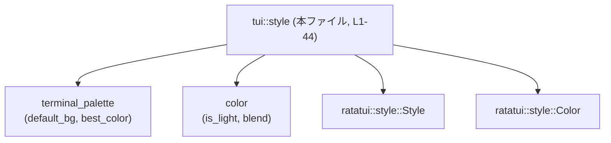
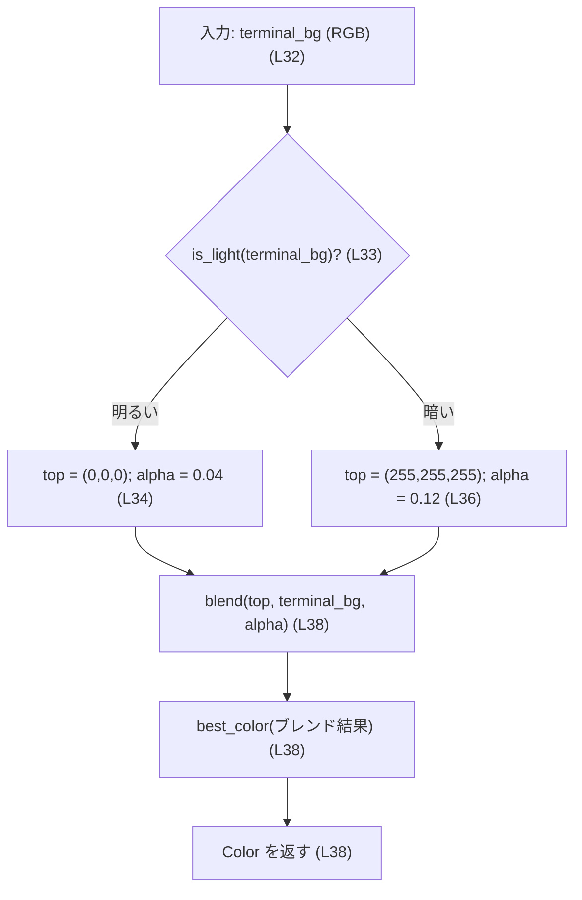
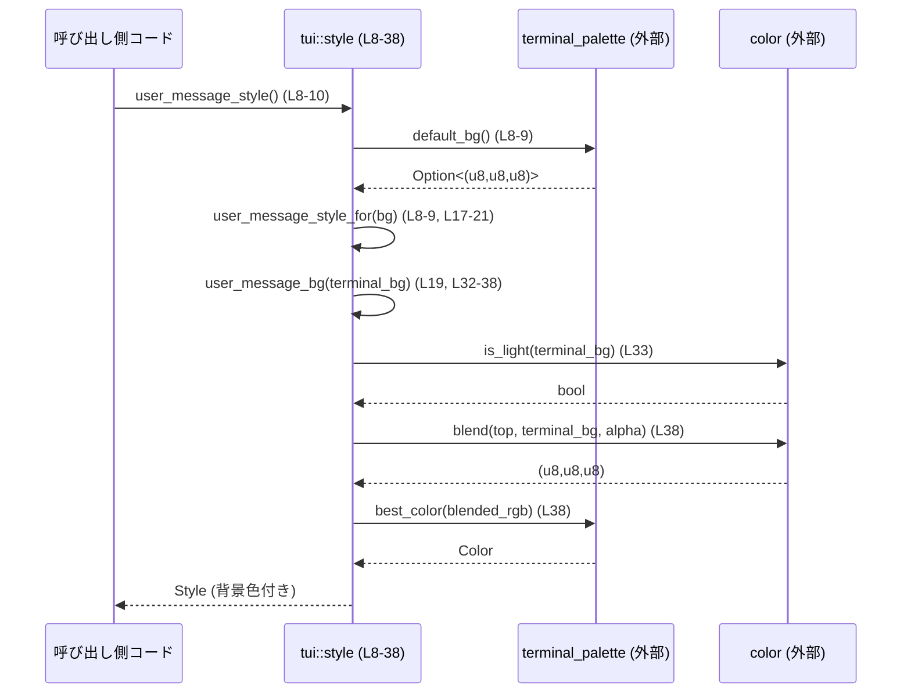

# tui/src/style.rs コード解説

## 0. ざっくり一言

端末背景色に応じて、ユーザメッセージや計画メッセージ用の **背景色付き Style**（`ratatui::style::Style`）を生成するユーティリティ関数群です。

---

## 1. このモジュールの役割

### 1.1 概要

- このモジュールは、TUI（テキストユーザインターフェース）上で表示する
  - ユーザメッセージ
  - 提案された計画メッセージ  
 それぞれの **見た目（背景色つきスタイル）** を決定するために存在します。
- 端末の背景色を `terminal_palette::default_bg` から取得し（`tui/src/style.rs:L8-14`）、明るさを判定した上で、見やすい背景色を計算します（`tui/src/style.rs:L31-38`）。

### 1.2 アーキテクチャ内での位置づけ

このファイルは「スタイル決定用フロントエンド」であり、色計算の詳細は他モジュールに委譲しています。

- `crate::terminal_palette`
  - `default_bg` で現在の端末背景色（`Option<(u8,u8,u8)>` を想定）を取得（`tui/src/style.rs:L8-14`）
  - `best_color` でターミナルの実際のカラーパレットから最適な `Color` を選択（`tui/src/style.rs:L38`）
- `crate::color`
  - `is_light` で背景色が明るいかどうかを判定（`tui/src/style.rs:L33`）
  - `blend` で色のブレンドを行い、希望の RGB を計算（`tui/src/style.rs:L38`）
- `ratatui::style`
  - `Style` と `Color` を使って、描画に使うスタイルを表現（`tui/src/style.rs:L5-6, L19-20, L26-27, L32, L38`）

このチャンクのコード範囲（L1-44）を対象にした依存関係図は次の通りです。



### 1.3 設計上のポイント

- **関数のみ・状態なし**
  - このファイル内に構造体やグローバル状態はなく、すべて純粋な関数として定義されています（`tui/src/style.rs:L8-44`）。
- **背景色の取得と適用を分離**
  - 「背景色の取得」を行う関数（`*_style`）と、「与えられた背景色からスタイルを決定」する関数（`*_style_for` / `*_bg`）に分割されています（`tui/src/style.rs:L8-29, L31-43`）。
- **明暗に応じたコントラスト調整**
  - 背景が明るい場合と暗い場合でブレンドする色とアルファ値を変えることで、読みやすいコントラストになるようにしています（`tui/src/style.rs:L32-38`）。
- **提案計画とユーザメッセージの共通化**
  - 現状では計画メッセージ用背景はユーザメッセージ用背景と同一のロジックを再利用しています（`tui/src/style.rs:L42-43`）。

---

## 2. コンポーネント（関数）インベントリー

このチャンクに含まれる関数の一覧です。行番号は `tui/src/style.rs:L開始-終了` 形式で示します。

| 名前 | 種別 | シグネチャ（概要） | 役割 | 定義位置 |
|------|------|--------------------|------|----------|
| `user_message_style` | 関数 | `fn user_message_style() -> Style` | 端末デフォルト背景を用いてユーザメッセージの `Style` を返す | `tui/src/style.rs:L8-10` |
| `proposed_plan_style` | 関数 | `fn proposed_plan_style() -> Style` | 端末デフォルト背景を用いて提案計画メッセージの `Style` を返す | `tui/src/style.rs:L12-14` |
| `user_message_style_for` | 関数 | `fn user_message_style_for(Option<(u8,u8,u8)>) -> Style` | 任意の背景色情報に対するユーザメッセージ用 `Style` を生成 | `tui/src/style.rs:L16-22` |
| `proposed_plan_style_for` | 関数 | `fn proposed_plan_style_for(Option<(u8,u8,u8)>) -> Style` | 任意の背景色情報に対する提案計画用 `Style` を生成 | `tui/src/style.rs:L24-29` |
| `user_message_bg` | 関数 | `fn user_message_bg((u8,u8,u8)) -> Color` | 明暗判定とブレンドによりユーザメッセージ背景色を計算 | `tui/src/style.rs:L31-39` |
| `proposed_plan_bg` | 関数 | `fn proposed_plan_bg((u8,u8,u8)) -> Color` | ユーザメッセージ背景色ロジックを再利用して計画背景色を計算 | `tui/src/style.rs:L41-43` |

---

## 3. 公開 API と詳細解説

### 3.1 型一覧（構造体・列挙体など）

このファイルでは新たな型定義は行っていませんが、次の外部型をスタイル表現に利用しています。

| 名前 | 種別 | 役割 / 用途 | 根拠 |
|------|------|-------------|------|
| `Style` | 型（外部 crate） | テキストの前景色・背景色・装飾などを表すスタイル。`Style::default()` から生成して `bg` メソッドで背景色を付与しています。 | `use ratatui::style::Style;` / `Style::default().bg(...)`（`tui/src/style.rs:L5, L19, L26`） |
| `Color` | 型（外部 crate） | 端末に送る実際の色指定を表します。`user_message_bg` / `proposed_plan_bg` の戻り値型です。 | `use ratatui::style::Color;` / `fn user_message_bg(...) -> Color`（`tui/src/style.rs:L5, L32, L42`） |

`Style` や `Color` の詳細な定義は `ratatui` クレート側にあり、このチャンクからは内部構造は分かりません。

### 3.2 関数詳細

#### `user_message_style() -> Style`

**概要**

- 端末のデフォルト背景色を自動取得し、その上で表示する「ユーザメッセージ」用のスタイル (`Style`) を返します（`tui/src/style.rs:L8-10`）。

**引数**

- ありません。

**戻り値**

- `Style`  
  - 背景色が設定済みの `Style`、または背景色未設定の `Style` を返します。
  - 背景色の有無は `default_bg()` の戻り値に依存します（`tui/src/style.rs:L8-10`）。

**内部処理の流れ**

1. `default_bg()` を呼び出して端末背景色を `Option<(u8,u8,u8)>` として取得します（`tui/src/style.rs:L8-9`）。
2. 取得した値を `user_message_style_for` にそのまま渡します（`tui/src/style.rs:L8-9`）。
3. `user_message_style_for` から返ってきた `Style` をそのまま返します（`tui/src/style.rs:L8-10`）。

**Mermaid（呼び出し関係、L8-22 対象）**

```mermaid
graph LR
    caller["呼び出し側"] -->|user_message_style() (L8-10)| ums["user_message_style"]
    ums -->|default_bg()| defaultBg["terminal_palette::default_bg (外部)"]
    ums -->|user_message_style_for(bg)| ums_for["user_message_style_for (L17-22)"]
```

**Examples（使用例）**

```rust
use ratatui::widgets::Paragraph;
use ratatui::layout::Alignment;
// モジュールパスは実際のプロジェクト構成に応じて調整が必要です。
use crate::tui::style::user_message_style;

// ユーザメッセージ用のスタイルを取得する
let style = user_message_style(); // default_bg() に基づく Style が返る

// 取得したスタイルを Paragraph に適用する
let paragraph = Paragraph::new("User message")
    .style(style)                // 背景色付きのスタイルを適用
    .alignment(Alignment::Left);
```

**Errors / Panics**

- この関数自身は `Result` を返さず、`panic!` や `unwrap` なども使用していません（`tui/src/style.rs:L8-10`）。
- したがって、この関数のレイヤーではエラーを表現していません。
- 内部で呼び出す `default_bg` / `user_message_style_for` / さらにその先の `user_message_bg` / `best_color` / `blend` / `is_light` のエラー・panic の可能性については、このチャンクだけからは判断できません。

**Edge cases（エッジケース）**

- 端末背景色が取得できない場合  
  `default_bg()` が `None` を返した場合、`user_message_style_for(None)` の `None` 分岐により、背景色が設定されていないデフォルト `Style` が返ります（`tui/src/style.rs:L17-21`）。
- 端末背景色が極端に明るい/暗い場合  
  その場合の処理は `user_message_bg` 側に委ねられますが、本関数の観点では常に有効な `Style` を返します（`tui/src/style.rs:L8-10`）。

**使用上の注意点**

- 端末背景色に基づいてスタイルを自動調整したい場合は、この関数を使うと良いです。
- 特定の背景色（例えばテスト時やカスタムテーマ）を明示的に使いたい場合は、`user_message_style_for` を利用する必要があります。

---

#### `proposed_plan_style() -> Style`

**概要**

- 端末のデフォルト背景色を用いて、提案された計画（プラン）メッセージ用のスタイルを返します（`tui/src/style.rs:L12-14`）。

**引数**

- ありません。

**戻り値**

- `Style`  
  - 内容は `proposed_plan_style_for(default_bg())` の返り値です（`tui/src/style.rs:L12-14`）。

**内部処理の流れ**

1. `default_bg()` で端末背景色を取得します（`tui/src/style.rs:L12-13`）。
2. その結果を `proposed_plan_style_for` に渡して `Style` を得ます（`tui/src/style.rs:L12-13`）。
3. 得られた `Style` を呼び出し元に返します（`tui/src/style.rs:L12-14`）。

**Examples（使用例）**

```rust
use ratatui::widgets::Paragraph;
use crate::tui::style::proposed_plan_style;

// 提案された計画を表示する Paragraph 用のスタイル
let plan_style = proposed_plan_style();

let paragraph = Paragraph::new("Proposed plan")
    .style(plan_style);
```

**Errors / Panics**

- `user_message_style` と同様、この関数自体はエラーを表現せず、panic を明示的に発生させません（`tui/src/style.rs:L12-14`）。

**Edge cases**

- 端末背景色が取得できない場合、`proposed_plan_style_for(None)` により背景色未設定の `Style` になります（`tui/src/style.rs:L24-28`）。

**使用上の注意点**

- 現状では、背景色計算ロジックは `proposed_plan_bg` → `user_message_bg` によってユーザメッセージと同じものが使用されます（`tui/src/style.rs:L41-43`）。
- 将来、計画用メッセージの背景色を差別化したいときは `proposed_plan_bg` を変更する形で拡張するのが自然です。

---

#### `user_message_style_for(terminal_bg: Option<(u8, u8, u8)>) -> Style`

**概要**

- 任意に渡された端末背景色情報に基づいて、ユーザメッセージの背景色付き `Style` を生成します（`tui/src/style.rs:L17-21`）。

**引数**

| 引数名 | 型 | 説明 |
|--------|----|------|
| `terminal_bg` | `Option<(u8, u8, u8)>` | 端末の背景色を RGB（0–255）で表したタプルを `Some` で包んだもの。取得できない／利用しない場合は `None`。 |

**戻り値**

- `Style`  
  - `terminal_bg` が `Some(bg)` の場合は、`user_message_bg(bg)` で計算された色を背景に持つ `Style`。
  - `terminal_bg` が `None` の場合は、背景色未設定の `Style::default()`（`tui/src/style.rs:L19-21`）。

**内部処理の流れ**

1. `match terminal_bg` で `Some` / `None` を分岐します（`tui/src/style.rs:L18`）。
2. `Some(bg)` の場合
   - `Style::default().bg(user_message_bg(bg))` を評価し、背景色付きの `Style` を生成します（`tui/src/style.rs:L19`）。
3. `None` の場合
   - `Style::default()` をそのまま返します（`tui/src/style.rs:L20`）。

**Examples（使用例）**

```rust
use crate::tui::style::user_message_style_for;

// 端末背景色が #202020 の場合（16進で 0x20 = 32）
let style_dark = user_message_style_for(Some((32, 32, 32)));   // 暗い背景用の Style

// 端末背景色が分からない場面
let style_unknown = user_message_style_for(None);              // 背景なし Style::default()
```

**Errors / Panics**

- `match` の分岐は `Some` / `None` の 2 パターンで網羅されており（`tui/src/style.rs:L18-21`）、panic を発生させるコードは含まれていません。

**Edge cases**

- `terminal_bg` = `None`  
  - 背景色が一切付かない `Style` が返り、周囲のウィジェットや端末のデフォルト設定に依存して見た目が決まります（`tui/src/style.rs:L20`）。
- `terminal_bg` に不自然な値（例えば 0〜255 以外）が渡された場合  
  - 型は `(u8,u8,u8)` なので、コンパイル時に 0〜255 に制限されます。このため範囲外値はそもそも渡せません。
- `terminal_bg` が非常に明るい／暗い境界値で `is_light` の閾値付近の場合  
  - どちら側の分岐に入るかは `is_light` の実装次第であり、このチャンクからは閾値は分かりません。

**使用上の注意点**

- 端末背景色を自前で取得している場面では、`user_message_style_for(Some(bg))` のように明示的に渡すことで、`default_bg()` との二重取得を避けられます。
- 背景色が未設定の `Style` が欲しいだけなら、`Style::default()` を直接使うのと同等ですが、将来ロジックが変わる可能性を考えると、意味を明示するためにこの関数経由で取得することも選択肢になります。

---

#### `proposed_plan_style_for(terminal_bg: Option<(u8, u8, u8)>) -> Style`

**概要**

- 任意の背景色情報に対して、提案計画メッセージ用の `Style` を生成します（`tui/src/style.rs:L24-28`）。

**引数**

| 引数名 | 型 | 説明 |
|--------|----|------|
| `terminal_bg` | `Option<(u8, u8, u8)>` | 端末背景色の RGB タプル（または `None`）。`user_message_style_for` と同じ意味付けです。 |

**戻り値**

- `Style`  
  - `Some(bg)` の場合は `proposed_plan_bg(bg)` による背景色を持つ `Style`。
  - `None` の場合は `Style::default()`（`tui/src/style.rs:L26-27`）。

**内部処理の流れ**

1. `match terminal_bg` で分岐（`tui/src/style.rs:L25`）。
2. `Some(bg)` の場合
   - `Style::default().bg(proposed_plan_bg(bg))` を生成（`tui/src/style.rs:L26`）。
3. `None` の場合
   - `Style::default()` を返す（`tui/src/style.rs:L27`）。

**Examples（使用例）**

```rust
use crate::tui::style::proposed_plan_style_for;

// 明るい背景を仮定して計画メッセージのスタイルを作る
let style_light = proposed_plan_style_for(Some((240, 240, 240)));

// 背景不明なコンテキストでは None
let style_no_bg = proposed_plan_style_for(None);
```

**Errors / Panics**

- `user_message_style_for` と同様に、この関数自体にエラーや panic のコードはありません（`tui/src/style.rs:L24-28`）。

**Edge cases**

- `terminal_bg = None` の挙動は `user_message_style_for` と同様に背景色未設定の `Style` になります（`tui/src/style.rs:L27`）。
- `proposed_plan_bg` が将来変更された場合でも、この関数のインターフェースは影響を受けにくく、内部で利用する背景色ロジックだけが差し替わります（`tui/src/style.rs:L26`）。

**使用上の注意点**

- 計画とユーザメッセージで別の背景色ポリシーを導入したい場合は、`proposed_plan_bg` を修正することになります。`*_style_for` のインターフェースはそのままにしておくと呼び出し側の変更を最小限にできます。

---

#### `user_message_bg(terminal_bg: (u8, u8, u8)) -> Color`

**概要**

- 単一の端末背景色に対し、
  - 明るさ判定 (`is_light`) に基づき
  - 適した前景色（黒または白）を薄くブレンドし
  - その結果を端末パレット上の最適な `Color` に変換  
 することで、ユーザメッセージ用の背景色を決定します（`tui/src/style.rs:L32-38`）。

**引数**

| 引数名 | 型 | 説明 |
|--------|----|------|
| `terminal_bg` | `(u8, u8, u8)` | 端末背景色の RGB 値（0〜255）。 |

**戻り値**

- `Color`  
  - `blend` でブレンドされた RGB を `best_color` に通した結果の色です（`tui/src/style.rs:L38`）。

**内部処理の流れ（アルゴリズム）**

1. `is_light(terminal_bg)` で背景が「明るい」かどうかを判定します（`tui/src/style.rs:L33`）。
2. 明るさ判定結果に応じて `(top, alpha)` を設定します（`tui/src/style.rs:L33-37`）。
   - 明るい場合 (`true`)  
     - `top = (0, 0, 0)`（黒）  
     - `alpha = 0.04`
   - それ以外（暗い場合）  
     - `top = (255, 255, 255)`（白）  
     - `alpha = 0.12`
3. `blend(top, terminal_bg, alpha)` で `top` と `terminal_bg` をアルファブレンドして、新しい RGB 値を計算します（`tui/src/style.rs:L38`）。
4. `best_color(...)` にその RGB を渡し、実際のターミナルカラーパレットから最も近い `Color` を取得します（`tui/src/style.rs:L38`）。
5. 得られた `Color` を返します。

**Mermaid（処理フロー, L32-38 対象）**



**Examples（使用例）**

```rust
use crate::tui::style::user_message_bg;

// 暗めの端末背景
let term_bg = (32, 32, 32);
let msg_bg_color = user_message_bg(term_bg);

// ここで得られた Color を、自前で Style に適用することもできる
use ratatui::style::Style;
let style = Style::default().bg(msg_bg_color);
```

**Errors / Panics**

- `if` / `else` による分岐と関数呼び出しのみで、panic を発生させるコードはありません（`tui/src/style.rs:L32-38`）。
- `blend` や `best_color`, `is_light` の内部実装についてはこのチャンクには現れず、そこでの panic 可能性は不明です。

**Edge cases**

- 非常に明るい（または暗い）背景  
  - `is_light` の判定結果に従って `top` と `alpha` が決まるため、背景が閾値付近の場合には見た目の変化が微妙になる可能性がありますが、閾値はこのチャンクには現れません。
- `alpha` が極端に小さい/大きい値ではない  
  - `alpha = 0.04` と `0.12` は比較的小さな値であり、背景色に対してごく薄い差分色を乗せる設計であると解釈できます（`tui/src/style.rs:L34, L36`）。  
  （ただし「どの程度の濃さになるか」は `blend` の実装次第であり、このチャンクからは断定できません。）
- RGB の範囲  
  - 引数は `(u8,u8,u8)` なので、0〜255 の範囲外の値はコンパイル時点で表現できません。

**使用上の注意点**

- 本関数は端末背景色の RGB が既に分かっている場合のユーティリティです。端末から実際に RGB を取得する責務は `default_bg` 等、別モジュール側にあります。
- ユーザメッセージ以外の用途でこの色を使うことも可能ですが、その場合は UI の一貫性（同じ色が異なる意味で使われないか）に留意する必要があります。

---

#### `proposed_plan_bg(terminal_bg: (u8, u8, u8)) -> Color`

**概要**

- 現状では `user_message_bg` と同一のロジックを利用して、提案計画メッセージの背景色を決定します（`tui/src/style.rs:L42-43`）。

**引数**

| 引数名 | 型 | 説明 |
|--------|----|------|
| `terminal_bg` | `(u8, u8, u8)` | 端末背景色の RGB 値。 |

**戻り値**

- `Color`  
  - `user_message_bg(terminal_bg)` の結果をそのまま返します（`tui/src/style.rs:L42-43`）。

**内部処理の流れ**

1. `user_message_bg(terminal_bg)` を呼び出します（`tui/src/style.rs:L43`）。
2. 得られた `Color` をそのまま返します（`tui/src/style.rs:L43`）。

**Examples（使用例）**

```rust
use crate::tui::style::proposed_plan_bg;

let term_bg = (16, 16, 16);
let plan_bg = proposed_plan_bg(term_bg); // 現状は user_message_bg(term_bg) と同じ値
```

**Errors / Panics**

- 本関数内では `user_message_bg` を単に呼び出しているだけで、追加のエラーや panic の可能性はありません（`tui/src/style.rs:L42-43`）。

**Edge cases**

- エッジケースは完全に `user_message_bg` に依存します。
- 将来 `proposed_plan_bg` が独自ロジックに変わる場合、ここが差分ポイントになります。

**使用上の注意点**

- 「ユーザメッセージ」と「提案計画」を視覚的に区別したい場合は、この関数の実装を変更することになります。
- 呼び出し側はインターフェース（引数・戻り値）を保ったまま内部ロジックだけ変更できるように設計されています。

---

### 3.3 その他の関数

- このチャンクには、上記以外の補助関数やラッパー関数は存在しません（`tui/src/style.rs:L1-44` 全体を確認）。

---

## 4. データフロー

ここでは、「ユーザメッセージを描画する際にスタイルがどのように決定されるか」の典型的なフローを示します。

1. 呼び出し側が `user_message_style()` を呼ぶ（`tui/src/style.rs:L8-10`）。
2. `user_message_style` が `default_bg()` を使って端末背景色を取得する。
3. 取得した背景色を `user_message_style_for` に渡す（`tui/src/style.rs:L8-9, L17-21`）。
4. `user_message_style_for` が `user_message_bg` を使って背景 `Color` を計算し、`Style` に適用する（`tui/src/style.rs:L19, L32-38`）。
5. 計算された `Style` が呼び出し側に返され、ウィジェットに適用されて描画される。

このチャンク（L1-44）に現れる関数だけを対象としたシーケンス図は次の通りです。



---

## 5. 使い方（How to Use）

### 5.1 基本的な使用方法

最も基本的な使い方は、デフォルトの端末背景色に基づいたスタイルを取得してウィジェットに適用する方法です。

```rust
use ratatui::widgets::{Block, Borders, Paragraph};
use ratatui::layout::Alignment;
use crate::tui::style::{user_message_style, proposed_plan_style};

// ユーザメッセージ用のスタイル
let user_style = user_message_style();          // L8-10 を経由して Style を取得

// 計画メッセージ用のスタイル
let plan_style = proposed_plan_style();         // L12-14 を経由して Style を取得

// それぞれ Paragraph に適用
let user_paragraph = Paragraph::new("User says...")
    .style(user_style)
    .alignment(Alignment::Left)
    .block(Block::default().borders(Borders::ALL));

let plan_paragraph = Paragraph::new("Proposed plan...")
    .style(plan_style)
    .alignment(Alignment::Left)
    .block(Block::default().borders(Borders::ALL));
```

### 5.2 よくある使用パターン

1. **自前で取得した端末背景色を使う**

   `default_bg()` を二重に呼びたくない場合や、テストで固定背景色を使いたい場合に有効です。

   ```rust
   use crate::tui::style::user_message_style_for;

   // 例: テスト用に固定の端末背景を仮定する
   let fake_term_bg = Some((40, 40, 40)); // ダークグレー
   let style = user_message_style_for(fake_term_bg);
   ```

2. **背景色だけを使って独自の Style を組み立てる**

   `*_bg` 関数を使って `Color` だけ取得し、前景色や装飾は別途指定します。

   ```rust
   use ratatui::style::{Style, Color};
   use crate::tui::style::user_message_bg;

   let term_bg = (20, 20, 20);
   let bg_color: Color = user_message_bg(term_bg);     // L32-38

   let style = Style::default()
       .bg(bg_color)
       .fg(Color::Yellow); // 前景色は独自指定
   ```

3. **背景色不明なコンテキストでの使用**

   背景色をあえて反映させたくない場合、`*_style_for(None)` を使って「背景なし」のスタイルを明示できます。

   ```rust
   use crate::tui::style::proposed_plan_style_for;

   // 背景色に依存しない見た目にしたい
   let style = proposed_plan_style_for(None);  // Style::default() と同等（L24-28）
   ```

### 5.3 よくある（起こりうる）誤用と正しい例

```rust
use crate::tui::style::{user_message_style_for, user_message_bg};

// 誤用例: 背景色を反映させたいのに None を渡している
let style_wrong = user_message_style_for(None);
// この場合、背景色は設定されず Style::default() になる（L17-21）。

// 正しい例: 端末背景色をちゃんと Some で渡す
let term_bg = (30, 30, 30);
let style_correct = user_message_style_for(Some(term_bg));

// 別の誤用例: user_message_bg の結果を無視してしまう
let _ = user_message_bg(term_bg); // 色を使っていない

// 正しい例: 戻り値の Color を Style に適用する
use ratatui::style::Style;
let bg = user_message_bg(term_bg);
let style = Style::default().bg(bg);
```

### 5.4 使用上の注意点（まとめ）

- **スレッド安全性**
  - このモジュールは共有状態を持たず、関数は引数だけに依存する純粋な計算なので、並列に呼び出してもデータ競合の心配はありません（`tui/src/style.rs:L8-43`）。
- **パフォーマンス**
  - 各関数は短い計算しか行いませんが、行単位など高頻度で呼ぶ場合は、結果の `Style` をキャッシュするか、一度だけ生成して再利用する設計が適切です。
- **セキュリティ**
  - 入力は RGB 値と `Option` のみであり、I/O や外部入力のパース処理は含まれていないため、このモジュール単体でのセキュリティ上の懸念は小さいと考えられます（ただし `default_bg` 等の外部依存はこのチャンクからは不明です）。
- **契約（Contract）の暗黙の前提**
  - `(u8,u8,u8)` は端末背景の「実際の見た目」を表す RGB であることを前提としており、異なる色空間やスケール（0〜1 など）を表すものを渡すことは想定されていません。

---

## 6. 変更の仕方（How to Modify）

### 6.1 新しい機能を追加する場合

例として、「システムメッセージ」用のスタイルを追加する場合を考えます。

1. **背景色ロジックの追加**
   - `user_message_bg` と同様の形で、新しいロジックを持つ `system_message_bg` を定義します（`tui/src/style.rs:L31-39` を参考）。
2. **`Style` を返すラッパーの追加**
   - `*_style_for` パターンに倣い、`system_message_style_for(terminal_bg: Option<(u8,u8,u8)>) -> Style` を追加します（`tui/src/style.rs:L17-21` を参考）。
   - デフォルト背景を用いる `system_message_style() -> Style` も追加し、`default_bg()` を使って `*_style_for` に委譲します（`tui/src/style.rs:L8-14` を参考）。
3. **利用元コードの更新**
   - 新しいメッセージ種別に対して `system_message_style` 等を利用するように TUI レイヤのコードを変更します。
4. **テストの追加**
   - このチャンクにはテストコードは含まれていませんが（`tui/src/style.rs:L1-44`）、別ファイルのテストに新しい関数用のケースを追加するのが望ましいです。

### 6.2 既存の機能を変更する場合

たとえば、ユーザメッセージの背景色をもう少し強くしたい場合（アルファ値を変更するなど）は以下の点に注意します。

- **影響範囲の確認**
  - `user_message_bg` を変更すると、`user_message_style_for` → `user_message_style` だけでなく、`proposed_plan_bg` / `proposed_plan_style_for` / `proposed_plan_style` にも影響が及びます（`tui/src/style.rs:L19, L26, L42-43`）。
- **契約の維持**
  - 戻り値の型（`Style` / `Color`）や引数の型は変えないことで、呼び出し側の変更を最小限に抑えられます。
- **テスト・視覚確認**
  - 単体テストがあれば、それを更新・追加する必要があります。このチャンクにはテストは含まれていないため、別ファイルのテストがどうなっているかを確認する必要があります。
  - 実際の端末やスクリーンショットを使って、明／暗背景それぞれで可読性が保たれているかを確認することが重要です。
- **将来の拡張を考えたリファクタリング**
  - 明暗判定やブレンドパラメータ（`top`, `alpha`）を構成値としてどこかに集約する設計も考えられますが、そのような変更は本ファイル以外の設計にも影響するため、慎重な検討が必要です。

---

## 7. 関連ファイル

このモジュールと密接に関係する（本チャンクから参照が確認できる）ファイル・モジュールは次の通りです。

| パス / モジュール | 役割 / 関係 | 根拠 |
|------------------|-------------|------|
| `crate::color` | `is_light` で背景色が明るいかどうかを判定し、`blend` で RGB をブレンドする。背景色計算のコアロジックを提供していると解釈できます。 | `use crate::color::blend;` / `use crate::color::is_light;` / `is_light(terminal_bg)` / `blend(top, terminal_bg, alpha)`（`tui/src/style.rs:L1-2, L33, L38`） |
| `crate::terminal_palette` | `default_bg` で端末のデフォルト背景色を取得し、`best_color` でブレンド後の RGB に対応する最適な `Color` を返します。TUI 実行環境依存の情報を扱うモジュールと推測できます。 | `use crate::terminal_palette::best_color;` / `use crate::terminal_palette::default_bg;` / `default_bg()` / `best_color(...)`（`tui/src/style.rs:L3-4, L8-9, L38`） |
| `ratatui::style` | `Style` と `Color` の型を提供し、TUI ウィジェットに適用するスタイル表現の基盤となります。 | `use ratatui::style::Color;` / `use ratatui::style::Style;` / `Style::default()` / `Style::default().bg(...)`（`tui/src/style.rs:L5-6, L19, L26`） |

このチャンクには、本モジュールを利用している側のコード（どこから `user_message_style` 等が呼ばれているか）は現れません。そのため、利用元については別ファイルの調査が必要です。
