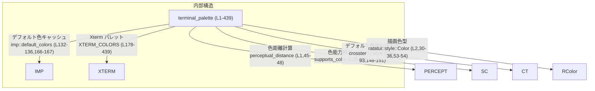
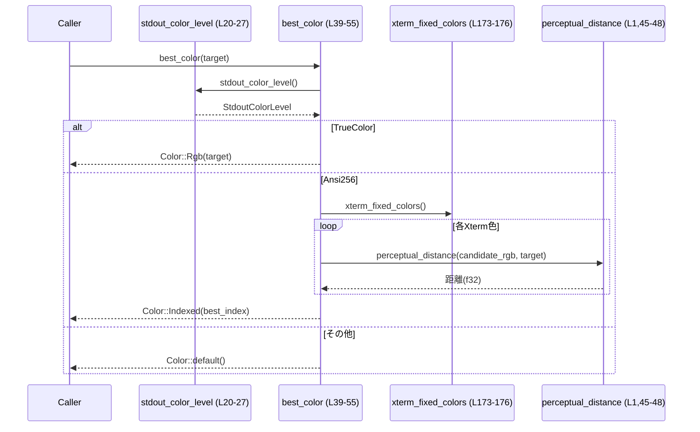
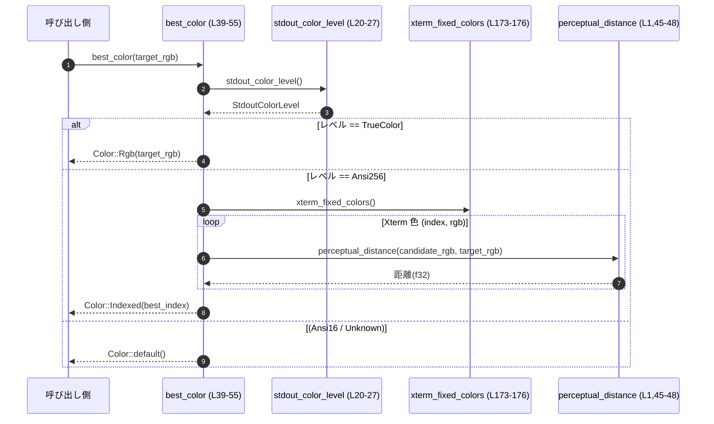

# tui/src/terminal_palette.rs コード解説

## 0. ざっくり一言

ターミナルがサポートする色能力（TrueColor / 256 色など）に応じて最適な色を選び、  
端末のデフォルト前景色・背景色をキャッシュ付きで問い合わせるためのユーティリティモジュールです。  
また、Xterm の 256 色パレット定義も提供します。

---

## 1. このモジュールの役割

### 1.1 概要

- このモジュールは、**ターミナルの色情報を検出・抽象化**するために存在し、以下の機能を提供します。
  - 標準出力が TrueColor / 256 色 / 16 色のどれに対応しているかの検出（`StdoutColorLevel` と `stdout_color_level`）  
    `tui/src/terminal_palette.rs:L12-27`
  - 任意の RGB 色に対して、ターミナルで表現可能な「最も近い色」を選択（`best_color`）  
    `tui/src/terminal_palette.rs:L39-55`
  - 端末のデフォルト前景色・背景色の問い合わせとキャッシュ（`DefaultColors`, `default_colors`, `default_fg`, `default_bg`）  
    `tui/src/terminal_palette.rs:L62-77, L88-152, L162-170`
  - Xterm 256 色パレット定義の公開（`XTERM_COLORS` と `xterm_fixed_colors`）  
    `tui/src/terminal_palette.rs:L173-176, L178-439`

### 1.2 アーキテクチャ内での位置づけ

このモジュールは、外部クレートと内部モジュールの橋渡しとして機能します。

- 外部クレート
  - `supports_color`: 標準出力のカラーサポートレベルを検出  
    `tui/src/terminal_palette.rs:L20-26`
  - `crossterm::style`: 実際の端末デフォルト色を問い合わせ  
    `tui/src/terminal_palette.rs:L91-93, L148-151`
  - `ratatui::style::Color`: TUI 描画で使う色型  
    `tui/src/terminal_palette.rs:L2, L30-36, L53-54`
- 内部依存
  - `crate::color::perceptual_distance`: 色の「見た目の距離」を計算して、最も近い Xterm 色を選ぶために使用  
    `tui/src/terminal_palette.rs:L1, L45-48`

依存関係のイメージです（行番号付き／このチャンクのみ）:



### 1.3 設計上のポイント

コードから読み取れる設計上の特徴は次のとおりです。

- **色能力の抽象化**  
  - 実際の検出は `supports_color` に委譲しつつ、結果を `StdoutColorLevel` という enum にマッピングして内部表現をシンプルにしています。  
    `tui/src/terminal_palette.rs:L12-27`
- **グローバルなパレットバージョンカウンタ**  
  - `DEFAULT_PALETTE_VERSION: AtomicU64` を使い、デフォルト色再取得が行われたタイミングを単調増加のカウンタで追跡します（Relaxed オーダリング）。  
    `tui/src/terminal_palette.rs:L6-10, L84-86`
- **デフォルト色のキャッシュ＋1回限りの試行**  
  - `OnceLock<Mutex<Cache<DefaultColors>>>` により、デフォルト色の問い合わせ結果をキャッシュします。  
    `Cache` には `attempted` フラグと `value: Option<T>` があり、  
    「一度問い合わせて失敗したらその後は再試行しない」という方針になっています。  
    `tui/src/terminal_palette.rs:L97-125, L127-145`
- **プラットフォーム依存の実装切り替え**  
  - `#[cfg(all(unix, not(test)))]` と `#[cfg(not(all(unix, not(test)))]` で `imp` モジュールを切り替え、  
    Unix 非テスト環境では crossterm による実問い合わせ、それ以外では常に `None` を返す実装になっています。  
    `tui/src/terminal_palette.rs:L88-160, L162-171`
- **スレッドセーフな設計**  
  - グローバルキャッシュには `Mutex` を使用し、バージョンカウンタには `AtomicU64` を用いることで、  
    複数スレッドからの同時アクセスを安全に扱っています。  
    `tui/src/terminal_palette.rs:L6-10, L94-95, L127-129`

---

## 2. 主要な機能一覧

- 標準出力のカラーサポートレベルの判定（TrueColor / 256 / 16 / Unknown）
- 任意の RGB 色に対する「ターミナルで表示可能な最適色」の決定
- 端末のデフォルト前景色・背景色の取得とキャッシュ
- デフォルト色再取得時のバージョンカウンタ更新（キャッシュ無効化検知用）
- Xterm 256 色パレットの定数定義と、そのうち比較的一貫した色のみを返すイテレータ

### 2.1 コンポーネントインベントリー（関数・構造体など）

#### トップレベル（公開 API 含む）

| 名称 | 種別 | 公開範囲 | 概要 | 定義位置 |
|------|------|----------|------|----------|
| `DEFAULT_PALETTE_VERSION` | `static AtomicU64` | モジュール内 | デフォルト色再取得回数を表す単調カウンタ | `tui/src/terminal_palette.rs:L6-6` |
| `bump_palette_version` | 関数 | モジュール内 | パレットバージョンカウンタを +1 する | `tui/src/terminal_palette.rs:L8-10` |
| `StdoutColorLevel` | `enum` | `pub` | 標準出力の色レベル（TrueColor / Ansi256 / Ansi16 / Unknown） | `tui/src/terminal_palette.rs:L12-18` |
| `stdout_color_level` | 関数 | `pub` | `supports_color` を使って `StdoutColorLevel` を判定 | `tui/src/terminal_palette.rs:L20-27` |
| `rgb_color` | 関数 | `pub` | `(u8,u8,u8)` を `ratatui::style::Color::Rgb` に変換 | `tui/src/terminal_palette.rs:L29-32` |
| `indexed_color` | 関数 | `pub` | インデックス色を `Color::Indexed` として生成 | `tui/src/terminal_palette.rs:L34-36` |
| `best_color` | 関数 | `pub` | ターミナルが表示可能な範囲でターゲットに最も近い色を返す | `tui/src/terminal_palette.rs:L39-55` |
| `requery_default_colors` | 関数 | `pub` | `imp` モジュールを通じてデフォルト色を再問い合わせし、バージョンを更新 | `tui/src/terminal_palette.rs:L57-60` |
| `DefaultColors` | 構造体 | `pub`（フィールドは非公開） | 前景 (`fg`) / 背景 (`bg`) のデフォルト色を `(u8,u8,u8)` で保持 | `tui/src/terminal_palette.rs:L62-66` |
| `default_colors` | 関数 | `pub` | `imp::default_colors` の薄いラッパー | `tui/src/terminal_palette.rs:L68-70` |
| `default_fg` | 関数 | `pub` | デフォルト前景色のみを `Option<(u8,u8,u8)>` で返す | `tui/src/terminal_palette.rs:L72-74` |
| `default_bg` | 関数 | `pub` | デフォルト背景色のみを `Option<(u8,u8,u8)>` で返す | `tui/src/terminal_palette.rs:L76-77` |
| `palette_version` | 関数 | `pub` | `DEFAULT_PALETTE_VERSION` を読み出す（モノトニックカウンタ） | `tui/src/terminal_palette.rs:L80-86` |
| `xterm_fixed_colors` | 関数 | モジュール内 | Xterm 色のうち、16 番以降（比較的安定な色）のイテレータを返す | `tui/src/terminal_palette.rs:L173-176` |
| `XTERM_COLORS` | 定数 | `pub` | Xterm 256 色の RGB 定数配列 | `tui/src/terminal_palette.rs:L178-439` |

#### `imp` モジュール（Unix 非テスト環境）

| 名称 | 種別 | 公開範囲 | 概要 | 定義位置 |
|------|------|----------|------|----------|
| `imp` | モジュール | モジュール内（`cfg(all(unix, not(test)))`） | Unix 非テスト環境向け実装 | `tui/src/terminal_palette.rs:L88-160` |
| `Cache<T>` | 構造体 | `imp` 内 | デフォルト色問い合わせの結果をキャッシュするための汎用コンテナ | `tui/src/terminal_palette.rs:L97-100` |
| `Cache::get_or_init_with` | メソッド | `imp` 内 | 未試行なら初回問い合わせを行い、結果をキャッシュして返す | `tui/src/terminal_palette.rs:L111-118` |
| `Cache::refresh_with` | メソッド | `imp` 内 | 常に問い合わせを行い、結果でキャッシュを更新する | `tui/src/terminal_palette.rs:L120-124` |
| `default_colors_cache` | 関数 | `imp` 内 | `OnceLock` で初期化された `Mutex<Cache<DefaultColors>>` を返す | `tui/src/terminal_palette.rs:L127-130` |
| `imp::default_colors` | 関数 | `pub(super)` | キャッシュを使ってデフォルト色を問い合わせる | `tui/src/terminal_palette.rs:L132-136` |
| `imp::requery_default_colors` | 関数 | `pub(super)` | 失敗済みでない限り、デフォルト色を再問い合わせしてキャッシュを更新 | `tui/src/terminal_palette.rs:L138-145` |
| `query_default_colors` | 関数 | `imp` 内 | crossterm を用いて実際のデフォルト前景／背景色を取得 | `tui/src/terminal_palette.rs:L148-152` |
| `color_to_tuple` | 関数 | `imp` 内 | `crossterm::style::Color` を `(u8,u8,u8)` に変換（RGB のみ対応） | `tui/src/terminal_palette.rs:L154-159` |

#### `imp` モジュール（非 Unix またはテスト）

| 名称 | 種別 | 公開範囲 | 概要 | 定義位置 |
|------|------|----------|------|----------|
| `imp` | モジュール | モジュール内（`cfg(not(all(unix, not(test)))`） | 非 Unix / テスト環境用ダミー実装 | `tui/src/terminal_palette.rs:L162-171` |
| `imp::default_colors` | 関数 | `pub(super)` | 常に `None` を返す | `tui/src/terminal_palette.rs:L166-167` |
| `imp::requery_default_colors` | 関数 | `pub(super)` | 何もしない空実装 | `tui/src/terminal_palette.rs:L170-170` |

---

## 3. 公開 API と詳細解説

### 3.1 型一覧（構造体・列挙体・定数）

| 名前 | 種別 | 役割 / 用途 | 定義位置 |
|------|------|-------------|----------|
| `StdoutColorLevel` | 列挙体 (`enum`) | 標準出力の色能力を 4 種類に分類する (`TrueColor`, `Ansi256`, `Ansi16`, `Unknown`) | `tui/src/terminal_palette.rs:L12-18` |
| `DefaultColors` | 構造体 | 端末のデフォルト前景 (`fg`)・背景 (`bg`) 色を RGB タプルで保持する | `tui/src/terminal_palette.rs:L62-66` |
| `XTERM_COLORS` | 定数配列 | Xterm 256 色パレットを `(u8,u8,u8)` の配列で定義したもの | `tui/src/terminal_palette.rs:L178-439` |

`DefaultColors` のフィールドは非公開のため、外部モジュールからは `default_fg` / `default_bg` 経由で値を取得する設計になっています。  
`tui/src/terminal_palette.rs:L62-66, L72-77`

---

### 3.2 関数詳細（7 件）

#### 3.2.1 `stdout_color_level() -> StdoutColorLevel` （L20-27）

**概要**

- 標準出力ストリームがサポートする色能力を `StdoutColorLevel` に変換して返します。  
  `supports_color::on_cached` の結果をラップする薄い抽象化です。  
  `tui/src/terminal_palette.rs:L20-27`

**引数**

- なし

**戻り値**

- `StdoutColorLevel`  
  - `TrueColor`: 24bit (16m) カラーをサポートすると検出された場合  
  - `Ansi256`: 256 色をサポートすると検出された場合  
  - `Ansi16`: 上記以外で 16 色のみサポートと判断された場合  
  - `Unknown`: `supports_color` が情報を取得できなかった場合

**内部処理の流れ**

1. `supports_color::on_cached(supports_color::Stream::Stdout)` を呼び出し、`Option<Level>` を取得します。  
   `tui/src/terminal_palette.rs:L21`
2. `match` 式で結果を解釈します。  
   - `Some(level) if level.has_16m` → `StdoutColorLevel::TrueColor`  
     `tui/src/terminal_palette.rs:L22`
   - `Some(level) if level.has_256` → `StdoutColorLevel::Ansi256`  
     `tui/src/terminal_palette.rs:L23`
   - `Some(_)` → `StdoutColorLevel::Ansi16`  
     `tui/src/terminal_palette.rs:L24`
   - `None` → `StdoutColorLevel::Unknown`  
     `tui/src/terminal_palette.rs:L25`

**Errors / Panics**

- この関数内で `panic!` や `unwrap` は使用していません。`supports_color` 側の実装に依存しますが、ここからはエラーは表に出ません。

**Edge cases**

- ターミナルが全くカラー情報を返さない（`None` の場合）:  
  → `StdoutColorLevel::Unknown` を返します。`tui/src/terminal_palette.rs:L25`
- 16m と 256 の両方を示すようなケース（`has_16m` が優先）:  
  条件の順番から TrueColor 判定が優先されます。`tui/src/terminal_palette.rs:L22-23`

**使用上の注意点**

- 実際の色再現度はターミナル実装に依存するため、`StdoutColorLevel` はあくまでヒューリスティックな判定結果です。
- 呼び出しコストは `supports_color` 側のキャッシュ機構により低減されている前提です（`on_cached` 使用）。  

---

#### 3.2.2 `best_color(target: (u8, u8, u8)) -> Color` （L39-55）

**概要**

- 指定した RGB 色 `target` を、ターミナルが扱える表示能力に応じて最適に近い `ratatui::style::Color` に変換します。  
  TrueColor 対応ならそのまま返し、256 色環境では Xterm パレットから最も近い色を選びます。  
  `tui/src/terminal_palette.rs:L39-55`

**引数**

| 引数名 | 型 | 説明 |
|--------|----|------|
| `target` | `(u8, u8, u8)` | 目標とする RGB 色（0–255 の各チャネル） |

**戻り値**

- `ratatui::style::Color`  
  - TrueColor 対応環境: `Color::Rgb(target)`  
  - 256 色環境: `Color::Indexed(i)` （Xterm パレットから最も近い色のインデックス）  
  - それ以外: `Color::default()`（ライブラリ定義のデフォルト色）  

**内部処理の流れ**

1. `stdout_color_level()` で色レベルを判定します。  
   `tui/src/terminal_palette.rs:L41`
2. TrueColor の場合は、単に `rgb_color(target)` を返します。  
   `tui/src/terminal_palette.rs:L42-43`
3. そうでなく、Ansi256 の場合は以下を行います。  
   `tui/src/terminal_palette.rs:L44-51`
   - `xterm_fixed_colors()` を呼び出し、(インデックス, RGB) のイテレータを取得。`L45`
   - `min_by` を使って、`perceptual_distance(*a, target)` が最小になるエントリを探索。`L45-49`
   - 見つかった `(i, _)` から `indexed_color(i as u8)` を返します。`L51`
4. それ以外の色レベル（Ansi16 / Unknown）の場合は `Color::default()` を返します。  
   `tui/src/terminal_palette.rs:L52-54`

**内部の処理フロー図**

この図は `stdout_color_level` と `best_color` の協調動作（L20-27, L39-55）を示します。



**Errors / Panics**

- `perceptual_distance` の戻り値は `f32` で、`partial_cmp` を呼び出した結果が `None` の場合、`unwrap_or(std::cmp::Ordering::Equal)` によって比較結果を `Equal` とみなします。  
  これにより `min_by` が panic することはありません。`tui/src/terminal_palette.rs:L46-48`
- `xterm_fixed_colors()` は 240 色（インデックス 16–255）を返すため、通常 `min_by` の結果は `Some` です。ただし、コード上は `if let Some((i, _)) = ...` となっており、`None` の場合は `Color::default()` にフォールバックします。`tui/src/terminal_palette.rs:L44-55`
- この関数自身には `panic!` はありません。

**Edge cases**

- 色レベルが `Ansi16` または `Unknown` の場合:  
  → `Color::default()` しか返さないため、細かい色分けは行われません。`tui/src/terminal_palette.rs:L52-54`
- `perceptual_distance` が NaN を返すケース:  
  - `partial_cmp` が `None` になり、`Ordering::Equal` で扱われるため、該当色は「同点」とみなされます。`tui/src/terminal_palette.rs:L46-48`
- `xterm_fixed_colors` が理論上空になる場合（コード上は起きない想定）:  
  - `min_by` は `None` を返し、最終的に `Color::default()` にフォールバックします。`tui/src/terminal_palette.rs:L44-55`

**使用上の注意点**

- TrueColor 対応環境では元の RGB がそのまま使われるため、色数は多い反面、非対応環境ではフォールバック色がかなり大雑把になる可能性があります。
- 頻繁に呼び出される場合、256 色環境では 240 色 × 距離計算が毎回行われるため、描画パフォーマンスに影響する可能性があります。  
  同じ色を何度も使う場合は、呼び出し側でキャッシュする設計が望ましいです（本モジュールにはそのキャッシュはありません）。

---

#### 3.2.3 `requery_default_colors()` （L57-60, L138-145, L170）

**概要**

- 端末のデフォルト前景色・背景色を再度問い合わせ、キャッシュを更新します（Unix 非テスト環境のみ）。  
  成功・失敗に関わらず、実行ごとにグローバルなパレットバージョンカウンタをインクリメントします。  
  `tui/src/terminal_palette.rs:L57-60, L138-145, L170`

**引数**

- なし

**戻り値**

- なし（`()`）

**内部処理の流れ**

1. トップレベルの `requery_default_colors` で `imp::requery_default_colors()` を呼びます。  
   `tui/src/terminal_palette.rs:L57-58`
2. 次に `bump_palette_version()` を呼び出し、`DEFAULT_PALETTE_VERSION` を 1 増やします。  
   `tui/src/terminal_palette.rs:L59, L8-10`
3. Unix 非テスト環境 (`cfg(all(unix, not(test)))`) の場合、`imp::requery_default_colors` は以下のように動作します。  
   `tui/src/terminal_palette.rs:L88-89, L138-145`
   - `default_colors_cache().lock()` でキャッシュ用 `Mutex` をロック。`L139-140`
   - ロック取得が失敗した場合は何もせず終了 (`if let Ok(..)` ガード)。`L139`
   - すでに `attempted == true` かつ `value.is_none()` の場合（過去に問い合わせて失敗している）は、再問い合わせせず即 return。`L140-142`
   - 上記以外の場合は `cache.refresh_with(|| query_default_colors().unwrap_or_default())` で再問い合わせ・キャッシュ更新。`L143-145`
4. 非 Unix またはテスト環境 (`cfg(not(all(unix, not(test)))`) の場合、`imp::requery_default_colors` は空関数で何もしません。`tui/src/terminal_palette.rs:L170`

**Errors / Panics**

- ロック取得失敗（`lock()` が `Err`）の場合は単に何もせず return するため、panic は発生しません。`tui/src/terminal_palette.rs:L139`
- `query_default_colors()` が `Err` を返した場合は、`unwrap_or_default()` により `Ok(None)` に変換されます。  
  結果としてキャッシュには `None` が格納されますが、エラーは外部に露出しません。`tui/src/terminal_palette.rs:L143-145, L148-152`
- この関数自体には `panic!` 呼び出しはありません。

**Edge cases**

- 端末がデフォルト色を返さない、あるいは RGB 情報を返さない場合（`query_default_colors` が `Ok(None)` / `Err(_)` の場合）:
  - キャッシュ `value` は `None` となり、以後 `requery_default_colors` は再試行しません(`attempted == true && value.is_none()`)。`tui/src/terminal_palette.rs:L141-142`
- 非 Unix / テスト環境では `imp::requery_default_colors` は no-op のため、`requery_default_colors` はバージョンだけを進める関数になります。`tui/src/terminal_palette.rs:L170, L57-60`

**使用上の注意点**

- 「デフォルト色の問い合わせ失敗」を再試行しない設計です。  
  一度失敗すると、そのプロセスライフタイム中は `default_colors()` はずっと `None` を返す可能性があります。
- `palette_version()` はあくまで「再問い合わせが行われた回数」を示し、「成功した回数」ではありません。  
  キャッシュが `None` のままでもカウンタは増えます。

---

#### 3.2.4 `default_colors() -> Option<DefaultColors>` （L68-70, L132-136, L166-167）

**概要**

- 端末のデフォルト前景色・背景色を `(u8, u8, u8)` のペアとして返します。  
  実際の取得とキャッシュ管理は `imp::default_colors` に委譲しています。  
  `tui/src/terminal_palette.rs:L68-70`

**引数**

- なし

**戻り値**

- `Option<DefaultColors>`  
  - `Some(DefaultColors { fg, bg })`: デフォルト色が取得できた場合  
  - `None`: 取得できなかった場合 / 非 Unix / テスト環境の場合 / キャッシュロック取得に失敗した場合

**内部処理の流れ**

1. トップレベルの `default_colors` は単に `imp::default_colors()` を呼び、その戻り値を返します。  
   `tui/src/terminal_palette.rs:L68-70`
2. Unix 非テスト環境の `imp::default_colors` の動作:  
   `tui/src/terminal_palette.rs:L132-136`
   - `default_colors_cache()` から `Mutex<Cache<DefaultColors>>` を取得。`L133-134`
   - `lock().ok()?` でロックを試み、失敗した場合は `None` を返す（`?`）`L134`
   - `cache.get_or_init_with(|| query_default_colors().unwrap_or_default())` を呼び出し、  
     初回のみ `query_default_colors` を実行し、その結果（`Option<DefaultColors>`）をキャッシュ＆返却。`L135`
3. `query_default_colors` は `query_foreground_color` / `query_background_color` を呼び出し、  
   両方が RGB として取得できた場合だけ `Some(DefaultColors { fg, bg })` を返します。  
   そうでない場合は `Ok(None)` を返し、エラー時も `unwrap_or_default()` により `Ok(None)` になります。  
   `tui/src/terminal_palette.rs:L148-152`
4. 非 Unix / テスト環境の `imp::default_colors` は常に `None` を返します。  
   `tui/src/terminal_palette.rs:L166-167`

**Errors / Panics**

- キャッシュの `Mutex` がポイズンされた場合など `lock()` が `Err` になると、`ok()?` により `None` を返します。panic にはなりません。`tui/src/terminal_palette.rs:L134`
- `query_default_colors` 内では `?` によるエラー伝播がありますが、呼び出し側で `unwrap_or_default` しているため、`default_colors` の呼び出し元にはエラーは露出しません。`tui/src/terminal_palette.rs:L135, L148-152`

**Edge cases**

- 端末が RGB 形式のデフォルト色を返さない場合（例: 16 色指定のみ）:
  - `color_to_tuple` が `None` を返し `fg` or `bg` のどちらかが `None` → `fg.zip(bg)` が `None` → `Ok(None)` → キャッシュも `None`。`tui/src/terminal_palette.rs:L148-152, L154-159`
- 非 Unix / テスト環境:  
  - 設計上 `None` 固定です。デフォルト色に依存した描画は呼び出し側でフォールバックが必要になります。`tui/src/terminal_palette.rs:L162-167`

**使用上の注意点**

- `Option` で返ってくるため、呼び出し側で `unwrap()` すると `None` の場合に panic します。  
  利用時は `if let Some(colors)` などで安全に扱う必要があります。
- 初回呼び出し時のみ実際の問い合わせが走り、その結果（成功・失敗含む）がプロセスライフタイム中キャッシュされます。  
  端末のデフォルト色変更は `requery_default_colors()` を呼ばない限り反映されません。

---

#### 3.2.5 `palette_version() -> u64` （L80-86）

**概要**

- `requery_default_colors()` が呼ばれるたびに増加するモノトニックカウンタを返します。  
  キャッシュされたレンダリング結果の無効化判断などに利用できます。  
  `tui/src/terminal_palette.rs:L80-86`

**引数**

- なし

**戻り値**

- `u64`: 現在のパレットバージョン（起動直後は 0、`requery_default_colors` 呼び出しごとに +1）

**内部処理の流れ**

1. `DEFAULT_PALETTE_VERSION.load(Ordering::Relaxed)` を実行し、現在値を取得して返すだけです。  
   `tui/src/terminal_palette.rs:L85-85`

**Errors / Panics**

- `AtomicU64::load` は panic を起こしません。
- この関数にはエラー経路はありません。

**Edge cases**

- 非 Unix / テスト環境では `requery_default_colors` がデフォルト色を実際には更新しなくても、  
  `bump_palette_version` によりカウンタだけは増えます。  
  → 「色の再問い合わせ試行数」を表す値と解釈するのが自然です。`tui/src/terminal_palette.rs:L57-60, L80-86`

**使用上の注意点**

- 並行アクセスに対しても `AtomicU64` によって安全に読み取れますが、オーダリングは `Relaxed` のため、  
  他のメモリ操作との厳密な順序保証はありません。  
  単に「値が変わったか」を見る用途には適していますが、「値が変わっていたら必ずキャッシュ内容も更新済み」といった  
  強い順序を期待する使い方は避ける必要があります。

---

#### 3.2.6 `imp::query_default_colors() -> std::io::Result<Option<DefaultColors>>` （L148-152）

**概要**

- crossterm を利用して端末のデフォルト前景色・背景色を問い合わせ、両方とも RGB として取得できたときだけ `Some(DefaultColors)` を返します。  
  それ以外の場合は `Ok(None)` を返します。  
  `tui/src/terminal_palette.rs:L148-152`

**引数**

- なし（`imp` モジュール内のプライベート関数）

**戻り値**

- `std::io::Result<Option<DefaultColors>>`  
  - `Ok(Some(DefaultColors { fg, bg }))`: 両方の色が取得できた場合  
  - `Ok(None)`: 片方または両方の色が取得できない（非 RGB / 未設定など）の場合  
  - `Err(e)`: crossterm の問い合わせ自体に失敗した場合

**内部処理の流れ**

1. `query_foreground_color()?` を呼び出し、結果に `and_then(color_to_tuple)` を適用して `Option<(u8,u8,u8)>` に変換。`tui/src/terminal_palette.rs:L149`
2. 同様に `query_background_color()?` を呼び出して `bg` を取得。`tui/src/terminal_palette.rs:L150`
3. `fg.zip(bg)` により両方の `Option` が `Some` の場合のみ `(fg, bg)` を得る。それ以外は `None`。`tui/src/terminal_palette.rs:L151`
4. `map(|(fg, bg)| DefaultColors { fg, bg })` により `Option<DefaultColors>` に変換して `Ok(...)` として返す。`tui/src/terminal_palette.rs:L151-151`

**Errors / Panics**

- `query_foreground_color` / `query_background_color` が `Err` を返した場合は、そのまま `Err` が返ります。  
  ただし、上位の呼び出し（`imp::default_colors`, `imp::requery_default_colors`）では `unwrap_or_default` によって  
  `Ok(None)` に変換されるため、公開 API までエラーは届きません。`tui/src/terminal_palette.rs:L135, L143-145`
- この関数自体に `panic!` はありません。

**Edge cases**

- 端末が 16 色や名前付き色など、RGB で表現できない形式でデフォルト色を返した場合:  
  - `color_to_tuple` が `None` を返し、最終的に `Ok(None)` になります。`tui/src/terminal_palette.rs:L154-159`
- 前景色だけ、または背景色だけが取得できた場合も `fg.zip(bg)` により `None` と扱われます。`tui/src/terminal_palette.rs:L151`

**使用上の注意点**

- この関数は `imp` 内部でのみ使用されており、エラーは公開 API から見えない形で潰されています。  
  失敗の有無を外部から知るには、「`default_colors()` が `None` を返すかどうか」で判断するしかありません。

---

#### 3.2.7 `xterm_fixed_colors() -> impl Iterator<Item = (usize, (u8, u8, u8))>` （L173-176）

**概要**

- `XTERM_COLORS` 配列のうち、16 番以降（コメントに「The rest of the colors are consistent」とある部分）を  
  `(インデックス, RGB)` のイテレータとして返します。  
  `best_color` の 256 色フォールバックで使用されます。  
  `tui/src/terminal_palette.rs:L173-176`

**引数**

- なし

**戻り値**

- `impl Iterator<Item = (usize, (u8, u8, u8))>`  
  - 各要素は `(index, (r, g, b))` の形で、`index` は 0..=255、ただしこの関数では 16..=255 のみを返します。

**内部処理の流れ**

1. `XTERM_COLORS.into_iter().enumerate()` で `(index, (r,g,b))` のイテレータを生成。`tui/src/terminal_palette.rs:L175`
2. `.skip(16)` により、インデックス 0〜15 の色をスキップ。  
   これらは「ターミナルテーマによって変化しやすい」とコメントされています。`tui/src/terminal_palette.rs:L175, L180-197`
3. 残りの要素（16〜255）がイテレータとして返されます。

**Errors / Panics**

- 配列に対する単純なイテレータ生成とスキップのみであり、panic の可能性はありません。

**Edge cases**

- `XTERM_COLORS` のサイズは 256 に固定されているため、`skip(16)` 後も必ず 240 要素が存在します。`tui/src/terminal_palette.rs:L178-439`
- `best_color` 側ではさらに `min_by` の結果を `if let Some` で扱っているため、仮にイテレータが空でも安全にフォールバックします。`tui/src/terminal_palette.rs:L44-55`

**使用上の注意点**

- この関数はモジュール内専用であり、`best_color` からのみ使用されていることがコードから読み取れます。  
  他の用途に使う場合は、0〜15 の色を含めるかどうかを改めて検討する必要があります。

---

### 3.3 その他の関数

補助的な関数・メソッドの一覧です。

| 関数名 / メソッド名 | 役割（1 行） | 定義位置 |
|---------------------|-------------|----------|
| `bump_palette_version()` | `DEFAULT_PALETTE_VERSION` を `fetch_add` で +1 する | `tui/src/terminal_palette.rs:L8-10` |
| `rgb_color((r,g,b))` | 単純に `Color::Rgb(r, g, b)` を生成するヘルパー | `tui/src/terminal_palette.rs:L29-32` |
| `indexed_color(index)` | `Color::Indexed(index)` を生成するヘルパー | `tui/src/terminal_palette.rs:L34-36` |
| `default_fg()` | `default_colors().map(|c| c.fg)` で前景のみを抽出する | `tui/src/terminal_palette.rs:L72-74` |
| `default_bg()` | `default_colors().map(|c| c.bg)` で背景のみを抽出する | `tui/src/terminal_palette.rs:L76-77` |
| `Cache::get_or_init_with` | 一度だけ初期化処理を行い、結果をキャッシュするユーティリティ | `tui/src/terminal_palette.rs:L111-118` |
| `Cache::refresh_with` | 常に再評価してキャッシュを上書きするユーティリティ | `tui/src/terminal_palette.rs:L120-124` |
| `default_colors_cache()` | `OnceLock` でグローバルな `Mutex<Cache<DefaultColors>>` を初期化・取得 | `tui/src/terminal_palette.rs:L127-130` |
| `color_to_tuple(color)` | `CrosstermColor::Rgb{..}` だけを `(u8,u8,u8)` に変換し、それ以外は `None` | `tui/src/terminal_palette.rs:L154-159` |
| `imp::default_colors`（非 Unix） | 常に `None` を返すダミー実装 | `tui/src/terminal_palette.rs:L166-167` |
| `imp::requery_default_colors`（非 Unix） | 何もしないダミー実装 | `tui/src/terminal_palette.rs:L170-170` |

---

## 4. データフロー

### 4.1 `best_color` を使った色決定のデータフロー

典型的なシナリオとして、「任意の RGB 値からターミナルで表示可能な最適色を得る処理」のフローを示します。  
対象範囲は `stdout_color_level` と `best_color`, `xterm_fixed_colors` です。  
`tui/src/terminal_palette.rs:L20-27, L39-55, L173-176`



要点:

- 色能力判定 (`stdout_color_level`) と実際の色選択 (`best_color`) が分離されています。
- 256 色環境では、内部で 240 色分の距離計算を行って最も近い色を選びます。
- 16 色環境や不明環境では安全側に倒し、`Color::default()` にフォールバックしています。

---

## 5. 使い方（How to Use）

### 5.1 基本的な使用方法

「任意の RGB 色を、環境に応じて適切な `Color` に変換して UI に使う」例です。

```rust
use ratatui::style::{Color, Style};                            // TUI 用の色・スタイル型
use crate::terminal_palette::{                                  // 同一クレート内からの利用例
    best_color,                                                 // 最適な色を選ぶ関数
    default_bg,                                                 // デフォルト背景色の取得
    StdoutColorLevel,                                           // 色レベル enum（用途に応じて）
};

// 強調したい色（鮮やかなオレンジ）を RGB で指定する
let target_rgb = (255, 165, 0);                                 // (R,G,B)

// 環境に応じて最適な Color に変換する
let fg_color: Color = best_color(target_rgb);                   // TrueColor/256/その他で挙動が変わる

// 端末のデフォルト背景色が取得できれば、それに合わせて背景を設定する
let bg_color: Color = default_bg()
    .map(|(r, g, b)| Color::Rgb(r, g, b))                       // (u8,u8,u8) → Color::Rgb
    .unwrap_or_else(Color::default);                            // 取得できなければデフォルト色

// ratatui のスタイルに適用する
let style = Style::default()
    .fg(fg_color)                                               // 前景色を設定
    .bg(bg_color);                                              // 背景色を設定
```

このコードでは、環境差を `best_color` と `default_bg` に委ねることで、呼び出し側は一貫した API でスタイル指定ができます。

### 5.2 よくある使用パターン

#### パターン 1: デフォルト色の変更を検知してキャッシュを無効化する

レンダリング結果をキャッシュしている場合、デフォルト色が変わったタイミングでキャッシュを無効化する用途に `palette_version` が使えます。  
`tui/src/terminal_palette.rs:L57-60, L80-86`

```rust
use crate::terminal_palette::{requery_default_colors, palette_version}; // デフォルト色再取得とバージョン
use std::cell::Cell;

// どこかにキャッシュのバージョンを保持しているとする
thread_local! {
    static LAST_PALETTE_VERSION: Cell<u64> = Cell::new(0);      // スレッドローカルに保存する例
}

// デフォルト色を再取得する操作（ユーザがテーマを変えたときなど）
requery_default_colors();                                       // 実際の再問い合わせ（Unix 非テスト環境）とバージョン更新

// レンダリング前にキャッシュの有効性をチェック
let current_version = palette_version();                        // 現在のバージョンを取得

LAST_PALETTE_VERSION.with(|v| {
    if v.get() != current_version {                             // バージョンが変わっていれば
        // ここでキャッシュを無効化・再構築する
        // ...

        v.set(current_version);                                 // キャッシュ側のバージョンを更新
    }
});
```

#### パターン 2: デフォルト前景色だけを使う

`DefaultColors` のフィールドは外部から直接見えないので、`default_fg` / `default_bg` を使うのが簡単です。  
`tui/src/terminal_palette.rs:L62-66, L72-77`

```rust
use ratatui::style::Color;
use crate::terminal_palette::default_fg;

// デフォルト前景色が取得できれば、それをそのまま Color に変換する
let fg_color: Color = default_fg()
    .map(|(r, g, b)| Color::Rgb(r, g, b))                       // RGB タプルから Color を作る
    .unwrap_or_else(Color::default);                            // 取得できない場合はフォールバック
```

### 5.3 よくある間違い

このモジュールの設計と戻り値型から推測できる、誤用しやすいパターンを挙げます。

```rust
use crate::terminal_palette::default_colors;

// 誤り例: Option を安易に unwrap してしまう
let colors = default_colors().unwrap();                         // デフォルト色が取れない場合に panic する

// 正しい扱い方: None を考慮してハンドリングする
let colors = match default_colors() {
    Some(colors) => colors,                                     // 取得成功時
    None => {
        // フォールバック処理（固定色を使うなど）
        // ...
        return;                                                 // ここでは単に早期リターンの例
    }
};
```

- `default_colors` / `default_fg` / `default_bg` はすべて `Option` を返すため、  
  端末や OS によっては `None` になる可能性があります。  
  そのため、`unwrap` は避け、`match` や `if let` で扱う必要があります。  
  `tui/src/terminal_palette.rs:L68-77`

### 5.4 使用上の注意点（まとめ）

- **環境依存性**
  - デフォルト色取得 (`default_colors` 系) は Unix 非テスト環境でのみ実際に問い合わせが行われます。  
    その他の環境では常に `None` です。`tui/src/terminal_palette.rs:L162-167`
- **エラーの可視性**
  - crossterm による色問い合わせエラーは `unwrap_or_default` で `Ok(None)` に変換されるため、  
    呼び出し側からは「単に `None` だった」としか分かりません。`tui/src/terminal_palette.rs:L135, L143-145`
- **並行性**
  - キャッシュへのアクセスは `Mutex` で保護されており、安全に並行アクセスできます。  
    ロック取得失敗時は `None` が返る設計です。`tui/src/terminal_palette.rs:L94-95, L134, L139`
- **バージョンカウンタの意味**
  - `palette_version` は「再問い合わせが行われた回数」であり、「問い合わせが成功した回数」ではありません。  
    カウンタが進んでも `default_colors` が `None` のままという状況はありえます。

---

## 6. 変更の仕方（How to Modify）

### 6.1 新しい機能を追加する場合

例として、「Windows など非 Unix 環境でもデフォルト色を問い合わせたい」機能追加を考えると、以下のような入口が想定されます。

1. **対象ファイル**
   - 本モジュール `tui/src/terminal_palette.rs` の `imp` モジュール（`cfg` 条件付き部分）。  
     `tui/src/terminal_palette.rs:L88-160, L162-171`
2. **既存の依存関係**
   - Unix 版 `imp` は `crossterm::style::query_*` を使っているため、他 OS 向け実装も crossterm API をそのまま使えるかを確認する必要があります。  
     `tui/src/terminal_palette.rs:L91-93, L148-151`
3. **追加のステップ例**
   - `cfg` の条件分けを細かくし、Windows 向けの別 `imp` 実装ブロックを追加する。
   - その中で Unix 実装と同等の `default_colors` / `requery_default_colors` / `query_default_colors` を定義する。
   - 既存の公開 API (`default_colors`, `default_fg`, `default_bg`, `requery_default_colors`) には変更を加えないことで、  
     既存コードへの影響を最小限にできます。

### 6.2 既存の機能を変更する場合

特に重要な契約・注意点は次のとおりです。

- **`best_color` の契約**
  - `StdoutColorLevel::TrueColor` なら引数の RGB をそのまま `Color::Rgb` として返す。`tui/src/terminal_palette.rs:L40-43`
  - `Ansi256` なら Xterm パレット（16〜255）から最小距離の色を選ぶ。`tui/src/terminal_palette.rs:L44-51, L173-176`
  - それ以外は `Color::default`。`tui/src/terminal_palette.rs:L52-54`
  - この挙動を変えると、UI 全体の色調が変わるため、影響範囲は広いです。
- **`default_colors` のキャッシュ戦略**
  - 一度問い合わせて失敗した場合、再試行しないという契約があります（`attempted && value.is_none()` で早期 return）。  
    `tui/src/terminal_palette.rs:L97-100, L141-142`
  - これを変更すると、「一時的な失敗からの回復」や「毎フレーム問い合わせ」などの挙動が変化します。
- **テストとの関係**
  - テスト環境では `imp` がダミー実装になり、`default_colors` は常に `None` を返します。  
    テストで「実際のデフォルト色」を前提にしたアサーションを書くと失敗するため、  
    変更時もこの `cfg` 挙動を維持することが重要です。`tui/src/terminal_palette.rs:L88, L162-167`

#### テストに関する補足

- このチャンクにはテストコードは含まれていません（`#[cfg(test)]` ブロック等は存在しません）。
- `cfg(not(all(unix, not(test)))` によって、テスト実行時の挙動は「非 Unix と同等（常に `None`）」になっています。  
  → テストを書く場合は、この前提を踏まえてモックやフォールバックロジックをテストする形になります。

#### バグ・セキュリティ観点のメモ

- **バグの可能性**
  - 一度の失敗で再問い合わせをしなくなる (`attempted && value.is_none()`) 挙動は、  
    一時的な I/O エラーから回復しないという意味で注意が必要ですが、  
    コメントに「Don't try to refresh if the cache is already attempted and failed.」とあるため、意図された設計と解釈できます。  
    `tui/src/terminal_palette.rs:L140-142`
- **セキュリティ**
  - 外部入力（ユーザデータ）を扱わず、ターミナル状態の問い合わせと定数定義のみで構成されているため、  
    直接的なセキュリティリスク（注入、バッファオーバーフローなど）は見当たりません。
- **観測性 (Observability)**
  - ログ出力やメトリクス送信などの観測用コードは含まれていません。  
    「なぜ `default_colors` が `None` なのか」を診断するには、呼び出し側で追加のログを仕込む必要があります。

---

## 7. 関連ファイル

このモジュールと密接に関係するモジュール・外部クレートを一覧にします。

| パス / モジュール | 役割 / 関係 |
|-------------------|------------|
| `crate::color` | `perceptual_distance` 関数を提供し、`best_color` の色距離計算に使用されています（ファイルパスはこのチャンクからは不明）。`tui/src/terminal_palette.rs:L1, L45-48` |
| 外部クレート `ratatui::style::Color` | TUI 描画用の色型。`rgb_color` / `indexed_color` / `best_color` の戻り値で使用。`tui/src/terminal_palette.rs:L2, L30-36, L53-54` |
| 外部クレート `supports_color` | 標準出力のカラーサポートレベル検出を行い、`stdout_color_level` でラップされています。`tui/src/terminal_palette.rs:L20-26` |
| 外部クレート `crossterm::style` | 端末デフォルト色の問い合わせ API (`query_foreground_color`, `query_background_color`) と色型 (`Color`) を提供。`imp` モジュール内で使用。`tui/src/terminal_palette.rs:L91-93, L148-151, L154-159` |

このチャンク内にはテストコードや、そのほか本モジュール専用のユーティリティファイルは見当たりません。
