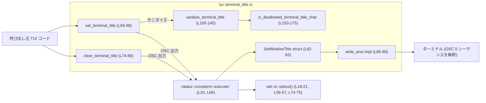

# tui/src/terminal_title.rs コード解説

---

## 0. ざっくり一言

ターミナルタイトル（OSC 0）を安全に書き込むためのヘルパーモジュールです。  
信頼できない文字列から制御文字や不可視フォーマット文字を除去し、長さも制限した上で、ANSI エスケープシーケンスとして stdout に出力します（tui/src/terminal_title.rs:L1-16, L46-55）。

---

## 1. このモジュールの役割

### 1.1 概要

- このモジュールは、**ターミナルタイトルに書き込む文字列のサニタイズと OSC シーケンス出力**を担当します（tui/src/terminal_title.rs:L1-16, L46-55）。
- 入力文字列は「信頼できない表示テキスト」とみなし、制御文字・不可視/双方向制御文字・過剰な空白を除去してからタイトルとして出力します（tui/src/terminal_title.rs:L10-16, L105-109, L147-152）。
- タイトルをいつ変更するか、空文字をどう解釈するか（何もしない・クリア・独自挙動）は、呼び出し元のポリシーに委ねています（tui/src/terminal_title.rs:L4-6, L38-43, L50-55）。
- すでに設定されている「元のタイトル」を読み出したり復元したりはしません。これはターミナル間でポータブルではないためです（tui/src/terminal_title.rs:L7-8）。

### 1.2 アーキテクチャ内での位置づけ

このモジュールは TUI 内の「タイトル出力専用レイヤ」です。タイトル文字列を受け取り、サニタイズし、`crossterm` を通じて OSC シーケンスを stdout に流します（tui/src/terminal_title.rs:L18-24, L56-68, L105-145）。

主要コンポーネントと依存関係を Mermaid で表します。



- 外側の TUI コードからは `set_terminal_title` / `clear_terminal_title` を呼び出すだけで、低レベルな OSC シーケンス生成はこのモジュールが担当します（tui/src/terminal_title.rs:L56-68, L74-80）。
- サニタイズは `sanitize_terminal_title` と `is_disallowed_terminal_title_char` に分離されており、見た目に影響を与えない制御文字などをフィルタします（tui/src/terminal_title.rs:L105-145, L153-175）。
- 実際のエスケープシーケンス構築は `SetWindowTitle` の `Command` 実装 `write_ansi` が担います（tui/src/terminal_title.rs:L82-90）。

### 1.3 設計上のポイント

- **サニタイズの徹底**  
  - 制御文字（`char::is_control()`）はすべて除去し、さらに一連の不可視・双方向制御コードポイントを明示的にブロックしています（tui/src/terminal_title.rs:L147-175）。  
  - これにより Trojan Source 的な bidi 制御や不可視文字による紛らわしいタイトル表現を抑制します（tui/src/terminal_title.rs:L149-152, L158-161）。
- **空白の正規化**  
  - 任意の空白類（スペース、タブ、改行など）は「単一の ASCII スペース 1 つ」に畳み込み、先頭の空白は除去します（tui/src/terminal_title.rs:L115-121, L127-133）。
- **長さ制限**  
  - 実用上の上限として 240 文字を定義し、それ以上は切り詰めます（tui/src/terminal_title.rs:L26-31, L112-113, L127-139）。  
  - これにより、ターミナルやタブバーが暗黙に切り詰める状態よりも制御しやすくなっています。
- **TTY チェック**  
  - `stdout().is_terminal()` で stdout が端末かどうかを確認し、端末でない場合は何も書かず成功扱いにします（tui/src/terminal_title.rs:L56-59, L74-77）。  
  - ログリダイレクトや非 TTY 環境でも安全に呼び出せます。
- **ポリシーとメカニズムの分離**  
  - サニタイズ後に可視文字が 0 になった場合、タイトルを「クリア」せず `NoVisibleContent` を返すだけです（tui/src/terminal_title.rs:L61-64, L33-43）。  
  - 「空のタイトル」をどう扱うかは呼び出し側が決めます。
- **安全性（Rust 視点）**  
  - `unsafe` コードは使用しておらず、標準ライブラリと `crossterm` の安全な API のみを利用しています（tui/src/terminal_title.rs:全体）。
  - グローバルな可変状態は持たず、関数はすべて純粋または I/O に限定されます。

---

## 2. 主要な機能一覧（コンポーネントインベントリー）

### 2.1 コンポーネント一覧（定数・型・関数）

| 種別 | 名前 | 公開範囲 | 概要 | 定義位置 |
|------|------|----------|------|----------|
| 定数 | `MAX_TERMINAL_TITLE_CHARS` | `const` (モジュール内) | タイトルの最大長（240 文字）を定義 | tui/src/terminal_title.rs:L26-31 |
| enum | `SetTerminalTitleResult` | `pub(crate)` | タイトル設定の結果（適用された / 可視文字なし）を表す | tui/src/terminal_title.rs:L33-44 |
| struct | `SetWindowTitle` | private | タイトル文字列を保持し、`crossterm::Command` として OSC 0 を生成 | tui/src/terminal_title.rs:L82-83 |
| 関数 | `set_terminal_title` | `pub(crate)` | 文字列をサニタイズし、必要なら OSC 0 を stdout に書く | tui/src/terminal_title.rs:L46-68 |
| 関数 | `clear_terminal_title` | `pub(crate)` | 空の OSC 0 タイトルを出力し、現在のタイトルをクリア | tui/src/terminal_title.rs:L70-80 |
| 関数 | `sanitize_terminal_title` | private | 信頼できないタイトル文字列を 1 行の安全な表示テキストに正規化 | tui/src/terminal_title.rs:L105-145 |
| 関数 | `is_disallowed_terminal_title_char` | private | タイトルから除去すべき文字かどうかを判定 | tui/src/terminal_title.rs:L147-175 |
| メソッド | `SetWindowTitle::write_ansi` | private impl | OSC 0 シーケンス `ESC ] 0;title ESC \` を書き込む | tui/src/terminal_title.rs:L85-90 |
| メソッド | `SetWindowTitle::execute_winapi` | private, `#[cfg(windows)]` | Windows API 経由の実行を禁止し、エラーを返す | tui/src/terminal_title.rs:L92-97 |
| メソッド | `SetWindowTitle::is_ansi_code_supported` | private, `#[cfg(windows)]` | ANSI シーケンスの使用を許可（true を返す） | tui/src/terminal_title.rs:L99-102 |
| テスト | `sanitizes_terminal_title` | test | 制御文字・空白のサニタイズ動作を検証 | tui/src/terminal_title.rs:L186-191 |
| テスト | `strips_invisible_format_chars_from_terminal_title` | test | 不可視フォーマット文字の除去を検証 | tui/src/terminal_title.rs:L193-199 |
| テスト | `truncates_terminal_title` | test | 最大長での切り詰めを検証 | tui/src/terminal_title.rs:L201-206 |
| テスト | `truncation_prefers_visible_char_over_pending_space` | test | 末尾近辺で、スペースより可視文字を優先する挙動を検証 | tui/src/terminal_title.rs:L208-213 |
| テスト | `writes_osc_title_with_string_terminator` | test | 生成される OSC シーケンスが `ESC ] 0;title ESC \` であることを検証 | tui/src/terminal_title.rs:L216-222 |

---

## 3. 公開 API と詳細解説

### 3.1 型一覧（構造体・列挙体など）

| 名前 | 種別 | 役割 / 用途 | 定義位置 |
|------|------|-------------|----------|
| `SetTerminalTitleResult` | enum | `set_terminal_title` の結果。タイトルを書いたか、サニタイズ後に可視文字がなく何もしなかったかを区別する（`Applied` / `NoVisibleContent`） | tui/src/terminal_title.rs:L33-44 |
| `SetWindowTitle` | struct | ターミナルタイトル文字列を保持し、`crossterm::Command` 実装を通じて OSC 0 シーケンスを生成する内部型 | tui/src/terminal_title.rs:L82-83 |

各バリアントの意味:

- `Applied`: stdout が端末であり、かつサニタイズ後のタイトルに可視文字があった場合に返されます。また stdout が端末でない場合も「書く必要がなかった」という意味で `Applied` 扱いです（tui/src/terminal_title.rs:L36-37, L56-59, L66-67）。
- `NoVisibleContent`: サニタイズの結果、可視文字が 1 文字も残らなかった場合に返されます（tui/src/terminal_title.rs:L38-43, L61-64）。

### 3.2 関数詳細

#### `pub(crate) fn set_terminal_title(title: &str) -> io::Result<SetTerminalTitleResult>`

**定義位置**: tui/src/terminal_title.rs:L46-68  

**概要**

信頼できない `title` 文字列をサニタイズし、必要であれば OSC 0 タイトルシーケンスを stdout に書き込みます。stdout が端末でない場合や、サニタイズ後に可視文字が残らない場合には、実際の書き込みは行いません（tui/src/terminal_title.rs:L46-55, L56-64）。

**引数**

| 引数名 | 型 | 説明 |
|--------|----|------|
| `title` | `&str` | 元になるタイトル文字列。モデル出力やスレッド名など、信頼できない文字列を想定（tui/src/terminal_title.rs:L10-16, L46-55）。 |

**戻り値**

- `Ok(SetTerminalTitleResult::Applied)`  
  - stdout が端末でない場合（何も書かないが成功扱い）（tui/src/terminal_title.rs:L56-59）。  
  - またはサニタイズ後のタイトルが非空であり、`execute!` による書き込みが成功した場合（tui/src/terminal_title.rs:L61-67）。
- `Ok(SetTerminalTitleResult::NoVisibleContent)`  
  - サニタイズ後のタイトルが空だった場合（tui/src/terminal_title.rs:L61-64）。
- `Err(io::Error)`  
  - `execute!` マクロ内部で stdout への書き込みが失敗した場合（tui/src/terminal_title.rs:L66-67）。

**内部処理の流れ**

1. `stdout().is_terminal()` で stdout が端末かを確認し、端末でなければすぐ `Applied` で成功を返します（tui/src/terminal_title.rs:L56-59）。
2. `sanitize_terminal_title(title)` を呼び出し、サニタイズ済みタイトルを生成します（tui/src/terminal_title.rs:L61, L105-145）。
3. サニタイズ結果が空なら `NoVisibleContent` を返し、タイトルのクリアや書き込みは行いません（tui/src/terminal_title.rs:L61-64）。
4. 非空の場合、`execute!(stdout(), SetWindowTitle(title))` で OSC 0 タイトルシーケンスを stdout に書き込みます（tui/src/terminal_title.rs:L66, L82-90）。
5. 書き込みが成功すれば `Applied` を返します（tui/src/terminal_title.rs:L67）。

**Examples（使用例）**

（モジュールパスは実際のクレート構成に応じて調整が必要です。）

```rust
use std::io;
use crate::tui::terminal_title::{set_terminal_title, SetTerminalTitleResult}; // 仮のパス

fn main() -> io::Result<()> {
    // モデル出力やスレッド名など、信頼できない文字列をそのまま渡す
    let raw_title = "  Project\t|\nWorking\x1b[31m |  Thread  ";

    // タイトル設定を試みる
    match set_terminal_title(raw_title)? {
        SetTerminalTitleResult::Applied => {
            // サニタイズされたタイトルがターミナルに適用されたか、
            // 端末でないので何もしていない状態
        }
        SetTerminalTitleResult::NoVisibleContent => {
            // サニタイズの結果、可視文字がなくなったためタイトルは変更されていない
        }
    }

    Ok(())
}
```

**Errors / Panics**

- **エラー**  
  - `execute!` を通じた stdout への書き込みが失敗した場合、`io::Error` を返します（tui/src/terminal_title.rs:L66-67）。  
    （例: パイプの切断、ファイルディスクリプタの異常など）
- **パニック**  
  - 関数内に明示的な `panic!` 呼び出しはなく、標準ライブラリ API の仕様外利用もないため、通常の使用でパニックは想定されません（tui/src/terminal_title.rs:L56-68）。

**Edge cases（エッジケース）**

- stdout が端末ではない場合  
  - `is_terminal()` が false であればサニタイズも実行せず、即座に `Applied` を返します（tui/src/terminal_title.rs:L56-59）。
- サニタイズ後に可視文字が 0 の場合  
  - `NoVisibleContent` を返し、タイトルは変更されません（tui/src/terminal_title.rs:L61-64）。
- 非 ASCII や絵文字を含む場合  
  - サニタイズ自体は `char` 単位で行われるため、許可されているコードポイントであればタイトルに残ります（tui/src/terminal_title.rs:L105-145, L153-175）。
- 非常に長い文字列の場合  
  - サニタイズ関数が最大 `MAX_TERMINAL_TITLE_CHARS` までで打ち切るため、それ以上は出力されません（tui/src/terminal_title.rs:L26-31, L112-113, L136-142）。

**使用上の注意点**

- 空文字列を渡しても「タイトルクリア」にはなりません。サニタイズ後に空であれば `NoVisibleContent` を返すだけで、既存タイトルは変更されません（tui/src/terminal_title.rs:L38-43, L61-64）。  
  タイトルを積極的に消したい場合は `clear_terminal_title` を用いる必要があります（tui/src/terminal_title.rs:L70-80）。
- 複数スレッドから同時に呼び出した場合、stdout への書き込み順序が前後し、タイトルシーケンスが競合する可能性があります。メモリ安全性は保たれますが、表示が期待通りにならない可能性があります（tui/src/terminal_title.rs:L56-68）。
- 戻り値の `SetTerminalTitleResult` を無視すると、「タイトルが実際に変わったか」「サニタイズで消えたか」の区別ができなくなります。

---

#### `pub(crate) fn clear_terminal_title() -> io::Result<()>`

**定義位置**: tui/src/terminal_title.rs:L70-80  

**概要**

現在のターミナルタイトルを、空の OSC 0 シーケンスを送ることで明示的にクリアします。もともとのシェルや他プログラムが設定していたタイトルは復元しません（tui/src/terminal_title.rs:L70-73）。

**引数**

- なし。

**戻り値**

- `Ok(())`  
  - stdout が端末でない場合（何も書かないが成功扱い）（tui/src/terminal_title.rs:L74-77）。  
  - 端末であり、空タイトルを書き込むことに成功した場合（tui/src/terminal_title.rs:L79-80）。
- `Err(io::Error)`  
  - stdout への書き込みが `execute!` 内で失敗した場合（tui/src/terminal_title.rs:L79-80）。

**内部処理の流れ**

1. `stdout().is_terminal()` で stdout が端末かを確認し、端末でなければ即 `Ok(())` を返します（tui/src/terminal_title.rs:L74-77）。
2. 端末の場合、`execute!(stdout(), SetWindowTitle(String::new()))` を呼び出し、空のタイトル文字列を OSC 0 シーケンスとして書き込みます（tui/src/terminal_title.rs:L79-80）。

**Examples（使用例）**

```rust
use std::io;
use crate::tui::terminal_title::clear_terminal_title; // 仮のパス

fn main() -> io::Result<()> {
    // TUI を終了する前などにタイトルをクリアする
    clear_terminal_title()?;
    Ok(())
}
```

**Errors / Panics**

- stdout が端末でない場合にエラーは発生しません（早期に `Ok(())`）（tui/src/terminal_title.rs:L74-77）。
- 端末への書き込みエラーが発生した場合のみ `io::Error` が返ります（tui/src/terminal_title.rs:L79-80）。
- 明示的なパニックはありません。

**Edge cases**

- パイプやファイルにリダイレクトされた場合  
  - 端末ではないため何も書かず成功扱いです（tui/src/terminal_title.rs:L74-77）。
- 非対応なターミナル  
  - OSC 0 を理解しないターミナルでは、エスケープシーケンスがそのまま表示される可能性がありますが、このモジュールはそこまで管理していません（挙動はターミナル依存であり、コードからは判断できません）。

**使用上の注意点**

- 「元のシェルタイトルへの復元」は行いません。Codex が管理するタイトルを単に空にするだけです（tui/src/terminal_title.rs:L72-73）。
- TUI の終了時など、ポリシーとしてタイトルを消すと決めた箇所からのみ呼び出すのが自然な使い方です。

---

#### `fn sanitize_terminal_title(title: &str) -> String`

**定義位置**: tui/src/terminal_title.rs:L105-145  

**概要**

信頼できないタイトル文字列を 1 行の表示テキストに正規化する内部ヘルパーです。  
制御文字を削除し、不可視/双方向制御文字をフィルタし、連続した空白を 1 つのスペースにまとめ、最大 `MAX_TERMINAL_TITLE_CHARS` 文字で切り詰めます（tui/src/terminal_title.rs:L105-109, L115-142, L147-175）。

**引数**

| 引数名 | 型 | 説明 |
|--------|----|------|
| `title` | `&str` | 元のタイトル文字列。改行、タブ、エスケープシーケンスなど任意の文字を含み得る。 |

**戻り値**

- サニタイズされたタイトル文字列（`String`）。  
  - 先頭・末尾の余分な空白は削除。  
  - 中間の空白は単一スペースに圧縮。  
  - 禁止文字は削除。  
  - 最大長 `MAX_TERMINAL_TITLE_CHARS` 以内の長さに制限（tui/src/terminal_title.rs:L111-113, L115-142）。

**内部処理の流れ**

1. 結果用の `String`、カウント用の `chars_written`、保留スペース用の `pending_space` を初期化（tui/src/terminal_title.rs:L110-114）。
2. 入力文字列を `chars()` イテレータで `char` 単位に走査（Unicode スカラー値）します（tui/src/terminal_title.rs:L115）。
3. 各文字について:
   - `ch.is_whitespace()` なら  
     - すでに何か書いてある場合のみ `pending_space = true` にし、ループを続行（先頭の空白は無視）（tui/src/terminal_title.rs:L115-121）。
   - `is_disallowed_terminal_title_char(ch)` が true なら  
     - その文字をスキップ（tui/src/terminal_title.rs:L123-125, L153-175）。
   - `pending_space` が true の場合  
     - 残り許容量を計算し、最低 2 文字以上の余地があるときのみスペースを 1 つ追加し、`chars_written` を増やし `pending_space` をクリア（tui/src/terminal_title.rs:L127-133）。
       - これは「末尾近辺でスペースより可視文字を優先する」ための工夫です（テストで検証, tui/src/terminal_title.rs:L208-213）。
   - `chars_written >= MAX_TERMINAL_TITLE_CHARS` なら  
     - ループを打ち切り（tui/src/terminal_title.rs:L136-138）。
   - それ以外の場合  
     - 文字を `sanitized` に push し、`chars_written` をインクリメント（tui/src/terminal_title.rs:L140-141）。
4. ループ終了後、`sanitized` を返却（tui/src/terminal_title.rs:L144-145）。

**Examples（使用例）**

テストと同等の例：

```rust
use crate::tui::terminal_title::sanitize_terminal_title; // 実際には private のためテストコードなどで利用

fn main() {
    let raw = "  Project\t|\nWorking\x1b\x07\u{009D}\u{009C} |  Thread  ";
    let sanitized = sanitize_terminal_title(raw);
    assert_eq!(sanitized, "Project | Working | Thread");
}
```

この例では:

- 先頭・末尾の空白は削除され（tui/src/terminal_title.rs:L115-121）、
- 改行やタブ、制御文字 (`\x1b`, `\x07`, `\u{009D}`, `\u{009C}`) は除去され（tui/src/terminal_title.rs:L123-125, L153-175）、
- 中間の空白は 1 つのスペースに正規化されます（tui/src/terminal_title.rs:L127-133, L115-121, L186-191）。

**Errors / Panics**

- I/O を行わず、`unsafe` も使用していない純粋関数です。入力の長さに依存した時間で実行され、通常の使用においてパニックの可能性はありません（tui/src/terminal_title.rs:L105-145）。

**Edge cases**

- すべて禁止文字または空白のみの入力  
  - 結果は空文字列になります（tui/src/terminal_title.rs:L115-125, L144-145）。  
  - これにより `set_terminal_title` は `NoVisibleContent` を返します（tui/src/terminal_title.rs:L61-64）。
- ちょうど `MAX_TERMINAL_TITLE_CHARS` 文字の入力  
  - すべて許可文字であればそのままの長さで返ります（tui/src/terminal_title.rs:L112-113, L136-142, L201-205）。
- `MAX_TERMINAL_TITLE_CHARS` を超える入力  
  - 先頭から `MAX_TERMINAL_TITLE_CHARS` 個の可視文字までが残り、それ以降は無視されます（tui/src/terminal_title.rs:L136-142, L201-205）。
- 末尾が `" ...a b"` のような形で、残りが 1 文字分しかない場合  
  - スペースよりも後続の可視文字を優先するため、末尾が可視文字で終わるように設計されています（tui/src/terminal_title.rs:L127-133, L208-213）。

**使用上の注意点**

- この関数はモジュール内の内部実装用で、外部からの直接利用は想定されていません（private, tui/src/terminal_title.rs:L110）。
- マルチバイト文字も `char` 単位でカウントするため、「ユーザーの視覚的な幅」と「カウントされる文字数」が一致しない場合があります（例えば全角文字は 1 文字としてカウントされます）。

---

#### `fn is_disallowed_terminal_title_char(ch: char) -> bool`

**定義位置**: tui/src/terminal_title.rs:L153-175  

**概要**

ターミナルタイトルから除去すべき文字かどうかを判定する内部関数です。  
通常の制御文字 (`is_control()`) に加えて、Trojan Source 関連の bidi 制御文字や、一般的な不可視フォーマット文字をまとめて除去対象にしています（tui/src/terminal_title.rs:L147-152, L153-175）。

**引数**

| 引数名 | 型 | 説明 |
|--------|----|------|
| `ch` | `char` | 判定対象の Unicode 文字。 |

**戻り値**

- `true`  
  - ターミナルタイトルから除去すべき文字である場合（tui/src/terminal_title.rs:L154-156, L161-175）。
- `false`  
  - タイトルに残してよい文字である場合。

**内部処理の流れ**

1. `ch.is_control()` が true の場合、即 `true` を返します（tui/src/terminal_title.rs:L154-156）。  
   - これには U+0000〜U+001F、U+007F〜U+009F 等が含まれ、ESC (`\x1b`) も含まれます。
2. 制御文字でない場合、`matches!` を用いて以下のいずれかに該当すれば `true` を返します（tui/src/terminal_title.rs:L161-175）。
   - ソフトハイフン U+00AD
   - コンバイニンググラフクラスタ結合子 U+034F
   - アラビック・レター・マーク U+061C
   - 伝統的な不可視文字 U+180E
   - ゼロ幅スペース等 `U+200B..=U+200F`
   - 双方向制御文字 `U+202A..=U+202E`（Trojan Source で問題になる範囲）
   - ワード結合子や不可視フォーマット `U+2060..=U+206F`
   - バリアントセレクタ `U+FE00..=U+FE0F`
   - BOM `U+FEFF`
   - 相互参照用不可視文字 `U+FFF9..=U+FFFB`
   - インビジブル・セパレータ `U+1BCA0..=U+1BCA3`
   - 追加のバリアントセレクタ `U+E0100..=U+E01EF`
3. どれにも当てはまらない場合は `false` を返します。

**Examples（使用例）**

```rust
fn main() {
    assert!(is_disallowed_terminal_title_char('\x1b'));       // ESC は制御文字なので除外
    assert!(is_disallowed_terminal_title_char('\u{202E}'));   // RLO (右から左へ埋め込み) は除外
    assert!(!is_disallowed_terminal_title_char('A'));         // 通常の英字は許可
}
```

**Errors / Panics**

- 純粋関数であり、パニックもエラーも発生しません（tui/src/terminal_title.rs:L153-175）。

**Edge cases**

- 一般に知られていない不可視文字や双方向制御文字も多く含まれているため、ユーザーからは「文字数が合わない」「見えない文字が消える」と感じられる可能性がありますが、意図的な仕様です（tui/src/terminal_title.rs:L158-161）。
- 上記以外の不可視文字が完全に排除されているわけではありません。ここに列挙されていないコードポイントは許可されます（tui/src/terminal_title.rs:L161-175）。

**使用上の注意点**

- ここで列挙されているコードポイントの集合を変える場合、Trojan Source 対策や可読性への影響を十分に検討する必要があります。  
  テストも更新する必要があります（tui/src/terminal_title.rs:L193-199）。

---

#### `impl Command for SetWindowTitle { fn write_ansi(&self, ...) }`

**定義位置**: tui/src/terminal_title.rs:L85-90  

**概要**

`crossterm::Command` トレイトの実装であり、`SetWindowTitle` に含まれるタイトル文字列から、OSC 0 タイトルシーケンス `ESC ] 0;{title} ESC \` を生成して書き込みます（tui/src/terminal_title.rs:L85-90）。

**引数**

| 引数名 | 型 | 説明 |
|--------|----|------|
| `&self` | `&SetWindowTitle` | タイトル文字列を保持するインスタンス。 |
| `f` | `&mut impl fmt::Write` | 書き込み先（文字列バッファや stdout にラップされたライターなど） |

**戻り値**

- `fmt::Result`  
  - 書き込み成功であれば `Ok(())`、失敗であれば `Err`（tui/src/terminal_title.rs:L85-90）。

**内部処理の流れ**

1. `write!(f, "\x1b]0;{}\x1b\\", self.0)` を呼び出し、  
   `ESC ] 0;` + タイトル + `ESC \` という文字列を `f` に書き込みます（tui/src/terminal_title.rs:L87-89）。
2. これは xterm などで標準的な「ウィンドウタイトル設定」のシーケンスです（tui/src/terminal_title.rs:L87-88）。

**Examples（使用例）**

テストからの例（文字列バッファへの書き込み）:

```rust
use crossterm::Command;
use crate::tui::terminal_title::SetWindowTitle; // 実際には tests モジュール内で使用

fn main() {
    let mut out = String::new();
    SetWindowTitle("hello".to_string())
        .write_ansi(&mut out)
        .expect("encode terminal title");
    assert_eq!(out, "\x1b]0;hello\x1b\\");
}
```

（tui/src/terminal_title.rs:L216-222）

**Errors / Panics**

- `fmt::Write` の実装に依存してエラーが返る可能性がありますが、`panic!` は行っていません（tui/src/terminal_title.rs:L85-90）。
- 一般に、`String` への書き込みでパニックが起こることは想定されません。

**Edge cases**

- タイトル文字列が長くても、この関数自身は切り詰めを行いません。サニタイズ側で長さを制限している前提です（tui/src/terminal_title.rs:L26-31, L105-145）。
- ANSI シーケンスを解釈しないターミナルでは、文字列がそのまま表示される可能性があります（ターミナル依存でありコードからは分かりません）。

**使用上の注意点**

- Windows では WinAPI 経由の実装はあえて失敗させ、ANSI コードのみを使用する設計になっています（tui/src/terminal_title.rs:L92-97, L99-102）。  
  そのため、ANSI エスケープをサポートしない環境では思った通りに動かない可能性があります。

---

### 3.3 その他の関数・メソッド

| 関数名 | 役割（1 行） | 定義位置 |
|--------|--------------|----------|
| `SetWindowTitle::execute_winapi` | Windows で `Command` が WinAPI 経由で実行されるのを防ぎ、必ず ANSI コードを使わせるためにエラーを返す | tui/src/terminal_title.rs:L92-97 |
| `SetWindowTitle::is_ansi_code_supported` | Windows で ANSI コードサポートを示すフラグとして `true` を返す | tui/src/terminal_title.rs:L99-102 |
| `tests::sanitizes_terminal_title` | 制御文字や余分な空白のサニタイズ動作を検証する単体テスト | tui/src/terminal_title.rs:L186-191 |
| `tests::strips_invisible_format_chars_from_terminal_title` | 不可視フォーマット文字の除去を検証する単体テスト | tui/src/terminal_title.rs:L193-199 |
| `tests::truncates_terminal_title` | 最大長 (`MAX_TERMINAL_TITLE_CHARS`) でタイトルが切り詰められることを検証 | tui/src/terminal_title.rs:L201-206 |
| `tests::truncation_prefers_visible_char_over_pending_space` | 長さ上限付近で、スペースよりも可視文字が優先されることを検証 | tui/src/terminal_title.rs:L208-213 |
| `tests::writes_osc_title_with_string_terminator` | 生成される OSC シーケンスが `ESC ] 0;title ESC \` であることを検証 | tui/src/terminal_title.rs:L216-222 |

---

## 4. データフロー

### 4.1 代表的な処理シナリオ

シナリオ: 「信頼できないタイトル文字列から、サニタイズ済み OSC 0 シーケンスがターミナルに届くまで」。

1. 呼び出し元が `set_terminal_title(raw_title)` を呼ぶ（tui/src/terminal_title.rs:L56-68）。
2. stdout が端末か確認され、端末なら `sanitize_terminal_title` へ（tui/src/terminal_title.rs:L56-61）。
3. `sanitize_terminal_title` が文字列を走査して不要文字を削除し、最大長を超えない安全な 1 行テキストを生成（tui/src/terminal_title.rs:L105-145）。
4. サニタイズ結果が空なら `NoVisibleContent` が返り終了。それ以外なら `execute!(stdout(), SetWindowTitle(sanitized))` が呼ばれる（tui/src/terminal_title.rs:L61-67）。
5. `SetWindowTitle::write_ansi` が `ESC ] 0;{title} ESC \` を生成し、`execute!` 経由で stdout に書き込まれる（tui/src/terminal_title.rs:L85-90）。
6. ターミナルが OSC シーケンスを解釈し、表示上のウィンドウタイトルを更新する（ターミナル側の挙動）。

### 4.2 シーケンス図

```mermaid
sequenceDiagram
    participant Caller as 呼び出し元コード
    participant TT as set_terminal_title (L56-68)
    participant San as sanitize_terminal_title (L105-145)
    participant Dis as is_disallowed_terminal_title_char (L153-175)
    participant Exec as execute! (L24, L66)
    participant SWT as SetWindowTitle.write_ansi (L85-90)
    participant T as ターミナル

    Caller->>TT: set_terminal_title(raw_title)
    TT->>TT: stdout().is_terminal()? (L56-59)
    alt stdout is not a terminal
        TT-->>Caller: Ok(Applied)
    else stdout is a terminal
        TT->>San: sanitize_terminal_title(raw_title)
        loop for each char (L115-142)
            San->>Dis: is_disallowed_terminal_title_char(ch)
            Dis-->>San: true/false
        end
        alt sanitized is empty (L61-64)
            TT-->>Caller: Ok(NoVisibleContent)
        else non-empty
            TT->>Exec: execute!(stdout(), SetWindowTitle(sanitized)) (L66)
            Exec->>SWT: write_ansi(...)
            SWT-->>Exec: "\x1b]0;{title}\x1b\\"
            Exec->>T: 書き込み
            TT-->>Caller: Ok(Applied)
        end
    end
```

---

## 5. 使い方（How to Use）

### 5.1 基本的な使用方法

クレート内部から、TUI の状態に応じてタイトルを更新・クリアする典型的な流れです。

```rust
use std::io;
use crate::tui::terminal_title::{set_terminal_title, clear_terminal_title, SetTerminalTitleResult}; // 仮のパス

fn main() -> io::Result<()> {
    // 1. TUI 起動時にタイトルを設定する
    let initial_title = "My Project | Home Screen";          // 任意の生文字列
    match set_terminal_title(initial_title)? {               // サニタイズ＆タイトル設定
        SetTerminalTitleResult::Applied => {
            // タイトルを適用済み or 端末でないため何もしなかった
        }
        SetTerminalTitleResult::NoVisibleContent => {
            // サニタイズで可視文字が消えたため、タイトルは変わっていない
        }
    }

    // ... TUI メインループ ...

    // 2. 終了時にタイトルをクリアする
    clear_terminal_title()?;                                // 空の OSC 0 を送ってタイトルを消す

    Ok(())
}
```

- 信頼できない文字列をそのまま `set_terminal_title` に渡してよい設計です（tui/src/terminal_title.rs:L10-16, L46-55, L105-145）。
- クリア時は `clear_terminal_title` を明示的に呼び出す点が重要です（tui/src/terminal_title.rs:L70-80）。

### 5.2 よくある使用パターン

1. **コンテキストごとのタイトル更新**

   - スレッド名やアクティブな会話スレッドに応じてタイトルを更新し、ユーザーに現在のコンテキストを伝える（tui/src/terminal_title.rs:L10-16）。

   ```rust
   fn update_title_for_thread(thread_name: &str) -> std::io::Result<()> {
       let title = format!("Codex | {}", thread_name);
       let _ = set_terminal_title(&title)?; // 結果は無視してもよいが、ログに残してもよい
       Ok(())
   }
   ```

2. **エラーを無視してベストエフォートで動かす**

   - ターミナルタイトル更新が必須ではない場合、I/O エラーを無視しても問題ありません。

   ```rust
   fn try_update_title(raw: &str) {
       if let Err(e) = set_terminal_title(raw) {
           eprintln!("failed to set terminal title: {e}");
       }
   }
   ```

3. **サニタイズ挙動のテストやデバッグ**

   - 実際には `sanitize_terminal_title` は private ですが、テストモジュールから直接呼び出して挙動を検証しています（tui/src/terminal_title.rs:L186-206）。

### 5.3 よくある間違い

**誤り例: 空文字でタイトルをクリアできると期待する**

```rust
// 誤り: "" を渡してもタイトルはクリアされない
// サニタイズ後に空文字となり、NoVisibleContent が返るだけ
let result = set_terminal_title("");
// 既存のタイトルは変わらない
```

**正しい例: 明示的にクリア API を呼ぶ**

```rust
// 正: clear_terminal_title を呼ぶことでタイトルを空にする
clear_terminal_title()?;  // 端末に空の OSC 0 を送る
```

（tui/src/terminal_title.rs:L38-43, L61-64, L70-80）

**誤り例: stdout が端末でない環境で挙動を過信する**

- パイプやファイルにリダイレクトしていると `is_terminal()` が false になり、何も書かれません（tui/src/terminal_title.rs:L56-59, L74-77）。
- これを知らずに「タイトルが変わっていない」と誤解する可能性があります。

### 5.4 使用上の注意点（まとめ）

- **前提条件**
  - ANSI OSC 0 を解釈できるターミナルであることを前提としています（tui/src/terminal_title.rs:L85-90）。
  - stdout が端末かどうかは自動で判定しますが、「端末でない場合は何もしない」という仕様を前提に呼び出す必要があります（tui/src/terminal_title.rs:L56-59, L74-77）。

- **エラーの扱い**
  - I/O エラーは `io::Result` で呼び出し元に伝播します。タイトル更新が必須でない場合はログに出すだけに留める設計も考えられます（tui/src/terminal_title.rs:L56-68, L70-80）。

- **並行性**
  - 関数自体はスレッドセーフ（共有可変状態なし）ですが、複数スレッドが同時にタイトルを更新すると OSC シーケンスが競合する可能性があります。  
    タイトル更新ポリシーを集中管理するスレッド（またはタスク）を 1 つに決めると挙動が明瞭になります。

- **パフォーマンス**
  - サニタイズは最大でも `MAX_TERMINAL_TITLE_CHARS` 可視文字までで打ち切るため、非常に長い文字列を渡しても処理時間はある程度抑えられます（tui/src/terminal_title.rs:L112-113, L136-142）。  
  - 通常の TUI アプリケーションでボトルネックになるような処理量ではありません。

---

## 6. 変更の仕方（How to Modify）

### 6.1 新しい機能を追加する場合

例: 「タイトルにプレフィックス（アプリ名など）を常に付与したい」場合。

1. **プレフィックス付与用のヘルパーを追加**
   - `set_terminal_title` の前に、プレフィックスを付与する公開関数 `set_terminal_title_with_prefix` をこのモジュールに追加するのが自然です。  
   - 実装としては `format!("{prefix}{title}")` を作り、既存の `set_terminal_title` を呼び出します。

2. **サニタイズロジックの再利用**
   - サニタイズは `sanitize_terminal_title` に集約されているため、新機能からもこの関数を通すことで安全性を保てます（tui/src/terminal_title.rs:L105-145）。

3. **テストの追加**
   - 新しい機能の振る舞い（プレフィックスとサニタイズの組み合わせなど）に対するテストを `tests` モジュールに追加することが推奨されます（tui/src/terminal_title.rs:L178-223）。

### 6.2 既存の機能を変更する場合

変更時に注意すべきポイント:

- **サニタイズポリシーの変更**
  - `is_disallowed_terminal_title_char` に含まれるコードポイント集合を変更する場合、Trojan Source 由来の攻撃や紛らわしい表示が再び可能にならないかを検討する必要があります（tui/src/terminal_title.rs:L158-175）。
  - 対応するテスト（不可視フォーマット文字の除去など）を更新または追加します（tui/src/terminal_title.rs:L193-199）。

- **長さ上限の変更**
  - `MAX_TERMINAL_TITLE_CHARS` を変更することでタイトルの最大長が変わります（tui/src/terminal_title.rs:L26-31）。  
  - 切り詰めに関するテストも修正が必要です（tui/src/terminal_title.rs:L201-206, L208-213）。

- **戻り値の意味**
  - `SetTerminalTitleResult` のバリアントや意味を変更する場合、この enum を利用している呼び出し側のロジックに影響があります（tui/src/terminal_title.rs:L33-44, L56-68）。  
  - 新しいバリアントを追加する際は、すべての `match` が網羅されているか確認する必要があります。

- **Windows サポート**
  - `execute_winapi` と `is_ansi_code_supported` の実装を変更すると、Windows 上での挙動が変わります（tui/src/terminal_title.rs:L92-102）。  
  - 現在は「WinAPI を使わず ANSI のみを使う」というポリシーになっている点に留意が必要です。

---

## 7. 関連ファイル

このチャンクには、同じクレート内の他モジュールへの直接的な参照（パス名）は現れていません。  
外部クレートとの関係を含めて整理すると、以下のようになります。

| パス / クレート | 役割 / 関係 |
|----------------|------------|
| `crossterm::Command` | `SetWindowTitle` が実装するトレイト。`write_ansi` などを通じてターミナルへのエスケープシーケンス出力を抽象化します（tui/src/terminal_title.rs:L23, L85-90）。 |
| `ratatui::crossterm::execute` | `execute!` マクロを提供し、`Command` 実装を通じて stdout に OSC シーケンスを出力します（tui/src/terminal_title.rs:L24, L66, L79）。 |
| `std::io::stdout` / `std::io::IsTerminal` | stdout ハンドルの取得と、端末かどうかの判定に使用されます（tui/src/terminal_title.rs:L18-21, L56-59, L74-77）。 |

同一クレート内でこのモジュールを利用しているファイル（TUI のメインループや状態管理モジュールなど）の情報は、このチャンクには現れていないため不明です。
