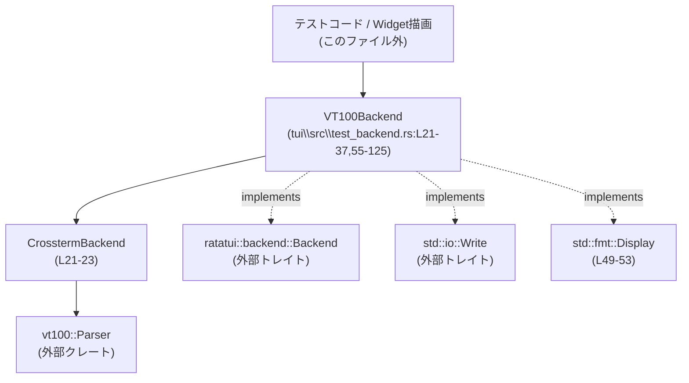
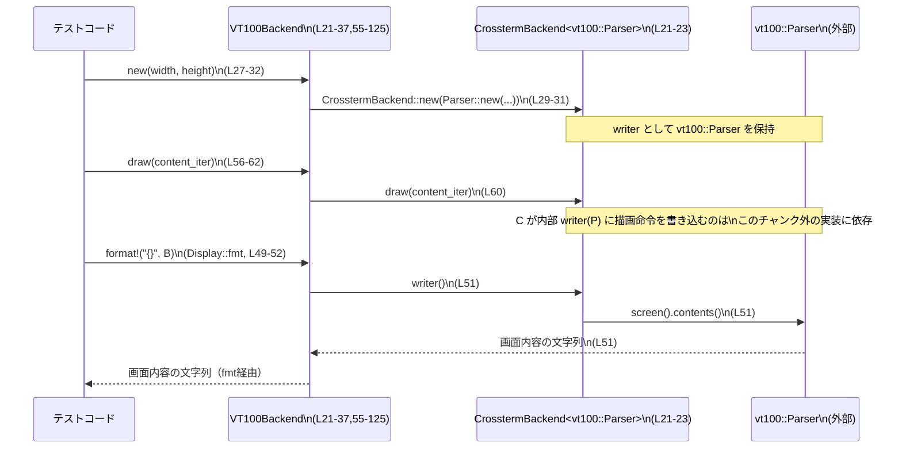

tui\src\test_backend.rs

---

## 0. ざっくり一言

`VT100Backend` は、`ratatui` の `CrosstermBackend` と `vt100::Parser` を組み合わせた **テスト用の擬似ターミナル backend** です。実際の端末（stdout）には一切書き込まず、内部バッファとしての画面状態を検査できるようにしています（tui\src\test_backend.rs:L14-23）。

---

## 1. このモジュールの役割

### 1.1 概要

- このモジュールは、`ratatui::backend::Backend` トレイトを実装するテスト用 backend として `VT100Backend` を提供します（L21-23, L55-125）。
- 実ターミナルの代わりに `vt100::Parser` を使うことで、描画結果をメモリ上で再現し、テストから内容を検査できるようにしています（L21-23, L34-36, L49-52）。
- コメントにあるように、**crossterm が stdout に直接書き込む可能性のある API（ターミナルサイズ取得・カーソル位置取得など）を使わない** ことが目的です（L14-20）。

### 1.2 アーキテクチャ内での位置づけ

`VT100Backend` は ratatui のバックエンド実装の一種として振る舞い、その内部で `CrosstermBackend<vt100::Parser>` を保持します（L21-23）。



- アプリケーション／テストコードは `VT100Backend` を `Backend` トレイト実装として利用します（L55-125）。
- `VT100Backend` は処理の大部分を内部の `CrosstermBackend<vt100::Parser>` に委譲します（例: `draw`, `hide_cursor` など, L56-67, L69-72）。
- ターミナルサイズ・カーソル位置など、一部の情報は `vt100::Parser` の `screen()` から直接取得し、crossterm の実際のターミナル問い合わせを避けています（L74-76, L94-97, L99-107）。

### 1.3 設計上のポイント

- **責務の分割**
  - 端末エミュレーション自体は `vt100::Parser` に任せ、`VT100Backend` は「`Backend` トレイト実装 + 安全なラッパー」という役割に限定されています（L21-23, L34-36, L49-52, L55-125）。
- **実ターミナルへの副作用の回避**
  - コメントにあるように、`crossterm` が stdout へ直接書き出す可能性のある API の利用を避けています（L14-20）。
  - 具体的には `get_cursor_position` と `size` / `window_size` を **独自実装** しており、`CrosstermBackend` 側の同名メソッドには委譲していません（L74-76, L94-97, L99-107）。
- **状態管理**
  - `VT100Backend` は内部に `CrosstermBackend<vt100::Parser>` を 1 つだけ持つため、画面状態は `vt100::Parser` に集約されています（L21-23）。
  - ほとんどのメソッドが `&mut self` を要求し、**同時に複数から操作されない前提**になっています（L39-47, L55-125）。
- **エラーハンドリング**
  - すべての I/O 操作は `std::io::Result` でラップされ、内部 backend からのエラーをそのまま伝播しています（L40-46, L56-62, L64-67, など）。
- **観測性**
  - `Display` 実装により、`VT100Backend` を `{}` でフォーマットすると vt100 の画面内容全体の文字列が得られます（L49-52）。テストでのスナップショット比較に利用しやすい設計です。

---

### 1.4 コンポーネント一覧（インベントリー）

このファイル内の主な構造体・impl・関数の一覧です。

| 種別 | 名前 / シグネチャ | 役割 | 定義範囲 |
|------|--------------------|------|----------|
| 構造体 | `VT100Backend` | テスト用の ratatui backend。内部に `CrosstermBackend<vt100::Parser>` を保持 | L21-23 |
| impl | `impl VT100Backend` | コンストラクタと vt100 パーサへのアクセサ | L25-37 |
| 関数 | `pub fn new(width: u16, height: u16) -> Self` | 指定サイズの `VT100Backend` を構築 | L27-32 |
| 関数 | `pub fn vt100(&self) -> &vt100::Parser` | 内部 `vt100::Parser` への参照を返す | L34-36 |
| impl | `impl Write for VT100Backend` | `std::io::Write` トレイトの実装（内部 writer への委譲） | L39-47 |
| 関数 | `fn write(&mut self, buf: &[u8]) -> io::Result<usize>` | バイト列を書き込む | L40-42 |
| 関数 | `fn flush(&mut self) -> io::Result<()>` | バッファをフラッシュ | L44-46 |
| impl | `impl fmt::Display for VT100Backend` | 画面内容のテキスト化 | L49-53 |
| 関数 | `fn fmt(&self, f: &mut fmt::Formatter<'_>) -> fmt::Result` | 画面全体を `Formatter` に書き込む | L50-52 |
| impl | `impl Backend for VT100Backend` | ratatui の `Backend` トレイト実装 | L55-125 |
| 関数 | `fn draw<'a, I>(&mut self, content: I) -> io::Result<()>` | 画面描画処理の委譲 | L56-62 |
| 関数 | `fn hide_cursor(&mut self) -> io::Result<()>` | カーソル非表示 | L64-67 |
| 関数 | `fn show_cursor(&mut self) -> io::Result<()>` | カーソル表示 | L69-72 |
| 関数 | `fn get_cursor_position(&mut self) -> io::Result<Position>` | vt100 の画面からカーソル位置を取得 | L74-76 |
| 関数 | `fn set_cursor_position<P: Into<Position>>(&mut self, position: P) -> io::Result<()>` | カーソル位置の設定（CrosstermBackend へ委譲） | L78-80 |
| 関数 | `fn clear(&mut self) -> io::Result<()>` | 画面クリア | L82-84 |
| 関数 | `fn clear_region(&mut self, clear_type: ClearType) -> io::Result<()>` | 一部領域のクリア | L86-88 |
| 関数 | `fn append_lines(&mut self, line_count: u16) -> io::Result<()>` | 行の追加 | L90-92 |
| 関数 | `fn size(&self) -> io::Result<Size>` | vt100 の画面サイズから `Size` を計算 | L94-97 |
| 関数 | `fn window_size(&mut self) -> io::Result<WindowSize>` | 文字単位・ピクセル単位のウィンドウサイズを返す | L99-107 |
| 関数 | `fn flush(&mut self) -> io::Result<()>` | 内部 writer のフラッシュ | L110-112 |
| 関数 | `fn scroll_region_up(&mut self, Range<u16>, u16) -> io::Result<()>` | 部分スクロール（上方向） | L114-116 |
| 関数 | `fn scroll_region_down(&mut self, Range<u16>, u16) -> io::Result<()>` | 部分スクロール（下方向） | L118-123 |

---

## 2. 主要な機能一覧

- テスト用 backend の生成: `VT100Backend::new` で指定サイズの擬似ターミナルを構築する（L27-32）。
- vt100 画面状態への直接アクセス: `VT100Backend::vt100` で `vt100::Parser` にアクセスし、カーソル位置や画面内容を読み取る（L34-36, L74-76, L94-97, L99-107）。
- ratatui の `Backend` としての描画: `draw` をはじめとする `Backend` 実装により、既存の ratatui API と同じように利用できる（L55-92, L114-124）。
- サイズ・カーソル情報の安全な取得: `get_cursor_position`, `size`, `window_size` を `vt100::Parser` ベースで返し、実ターミナルへの問い合わせを避ける（L74-76, L94-97, L99-107）。
- 画面内容のテキスト出力: `Display` 実装により、`format!("{}", backend)` で画面の文字列表現を取得できる（L49-52）。
- `Write` トレイト互換性: `VT100Backend` 自体を `Write` として扱うことで、必要ならバイト列レベルでの操作も可能にしている（L39-47）。

---

## 3. 公開 API と詳細解説

### 3.1 型一覧（構造体・列挙体など）

| 名前 | 種別 | 役割 / 用途 | 定義範囲 |
|------|------|-------------|-----------|
| `VT100Backend` | 構造体 | `CrosstermBackend<vt100::Parser>` をラップし、テスト向けに安全化した backend | L21-23 |

この構造体は 1 フィールドのみを持ちます。

- `crossterm_backend: CrosstermBackend<vt100::Parser>`（L22）

### 3.2 関数詳細（主要 7 件）

#### `VT100Backend::new(width: u16, height: u16) -> Self`

**概要**

指定された幅・高さで新しい `VT100Backend` を作成します。内部では `vt100::Parser` とそれを writer とする `CrosstermBackend` を構築します（L27-32）。

**引数**

| 引数名 | 型 | 説明 |
|--------|----|------|
| `width` | `u16` | 端末の列数（文字数）として使われる想定。値の制約はコードからは分かりません（L27）。 |
| `height` | `u16` | 端末の行数として使われる想定。値の制約はコードからは分かりません（L27）。 |

**戻り値**

- `VT100Backend` の新しいインスタンス（L27-32）。

**内部処理の流れ**

1. `crossterm::style::force_color_output(true)` を呼び出し、crossterm の色出力設定を強制的に有効化します（L28）。  
   - この関数の詳細な副作用はこのファイルからは分かりませんが、グローバル設定を変更する可能性があります。
2. `vt100::Parser::new(height, width, 0)` を呼び出して新しいパーサを作成し、それを writer とする `CrosstermBackend` を構築します（L29-31）。
3. その `CrosstermBackend` をフィールドに入れた `VT100Backend` を返します（L29-31）。

**Examples（使用例）**

```rust
use tui::test_backend::VT100Backend;                // モジュールパスは仮定です（このチャンクには不明）

// 幅80列・高さ24行の擬似ターミナルを作成
let backend = VT100Backend::new(80, 24);            // L27-32 に対応
```

**Errors / Panics**

- 戻り値の型は `Self` であり、`Result` ではないため、関数自体はエラーを返しません（L27-32）。
- `vt100::Parser::new` や `crossterm::style::force_color_output` が内部で panic する可能性については、このチャンクからは分かりません。

**Edge cases（エッジケース）**

- `width` や `height` に 0 や非常に大きな値を渡したときの挙動は、`vt100::Parser::new` の仕様に依存しており、このファイルからは分かりません（L29-31）。
- 何度も `new` を呼ぶと、そのたびに `force_color_output(true)` が呼ばれますが、その再呼び出しの影響は不明です（L28）。

**使用上の注意点**

- この関数は crossterm のグローバルな設定を変更する可能性があり、テスト全体に影響するかもしれません（L28）。
- 実運用コードではなくテスト用 backend として利用される想定であり、コメントからもそれが読み取れます（例: L100-107 のコメント）。

---

#### `VT100Backend::vt100(&self) -> &vt100::Parser`

**概要**

内部に保持している `vt100::Parser` への共有参照を返します。画面内容やカーソル位置などをテストコードから直接確認するために利用できます（L34-36）。

**引数**

- なし（メソッドレシーバとして `&self` のみ）。

**戻り値**

- `&vt100::Parser`：内部のパーサの共有参照（L34-36）。

**内部処理の流れ**

1. `self.crossterm_backend.writer()` を呼び出し、内部 writer を参照します（L35）。
2. それをそのまま返します。型は `&vt100::Parser` です（L34-36）。

**Examples（使用例）**

```rust
let backend = VT100Backend::new(80, 24);                 // 擬似ターミナル作成（L27-32）

// vt100パーサを直接参照して、カーソル位置などを確認する
let parser: &vt100::Parser = backend.vt100();            // L34-36
let screen = parser.screen();                            // screen() の仕様はこのチャンク外
let (rows, cols) = screen.size();                        // 画面サイズの取得（推定: vt100のAPI）
```

**Errors / Panics**

- エラーを返さず、panic の可能性もこのメソッド自体にはありません（L34-36）。

**Edge cases**

- 返されるのが共有参照 `&vt100::Parser` のみなので、テストコードからパーサを変更（書き込み）することはできません。  
  変更は `VT100Backend` 経由の描画処理でのみ行われます（L34-36, L55-62）。

**使用上の注意点**

- 返される参照は `VT100Backend` が生存している間のみ有効であり、Rust の借用規則により、`&mut VT100Backend` と同時には使えません。
- `vt100::Parser` の API はこのファイルには含まれていないため、詳しい使い方は vt100 クレートのドキュメントを参照する必要があります。

---

#### `impl fmt::Display for VT100Backend::fmt(&self, f: &mut fmt::Formatter<'_>) -> fmt::Result`

**概要**

`VT100Backend` の画面内容を `Formatter` に書き込みます。内部の `vt100::Parser` が保持するスクリーンの内容を文字列として取得し、そのまま出力します（L49-52）。

**引数**

| 引数名 | 型 | 説明 |
|--------|----|------|
| `f` | `&mut fmt::Formatter<'_>` | フォーマット先のバッファ（`format!` や `println!` から渡される） |

**戻り値**

- `fmt::Result`：書き込みが成功したかどうかを示す結果（L50-52）。

**内部処理の流れ**

1. `self.crossterm_backend.writer()` から `&vt100::Parser` を取得します（L51）。
2. `parser.screen().contents()` を呼び出し、スクリーン全体の内容を文字列として取得します（L51）。
3. その文字列を `write!(f, "{}", ...)` で `Formatter` に書き込みます（L51）。

**Examples（使用例）**

```rust
let mut backend = VT100Backend::new(80, 24);

// ここで ratatui の Terminal などを使って描画したと仮定（このチャンクには未定義）

// 画面内容を文字列として取得
let screen_text = format!("{}", backend);     // L49-52

// テストで期待値と比較するイメージ
// assert_eq!(screen_text, "期待する画面内容");
```

**Errors / Panics**

- `write!` マクロ内部で I/O エラーが起きた場合は `Err(fmt::Error)` を返します（L51）。
- `screen().contents()` 自体が panic する可能性については、このチャンクからは分かりません。

**Edge cases**

- まだ何も描画していない状態で呼び出した場合の文字列表現がどうなるかは、`vt100::Parser` の初期状態に依存します（L51）。

**使用上の注意点**

- 大きな画面サイズの場合、文字列も長くなり、テストのログが肥大化する可能性があります。
- `Display` は人間が読む用途を想定したインターフェースであり、フォーマットは `vt100::Parser::screen().contents()` の仕様に従います。

---

#### `Backend::draw<'a, I>(&mut self, content: I) -> io::Result<()>`

**概要**

ratatui の `draw` 要求を内部の `CrosstermBackend` に委譲します（L56-62）。`content` はセル座標とセル情報のイテレータです。

**引数**

| 引数名 | 型 | 説明 |
|--------|----|------|
| `content` | `I` where `I: Iterator<Item = (u16, u16, &'a Cell)>` | 描画対象セルの座標 (`x, y`) とセル情報 (`&Cell`) を返すイテレータ（L56-58）。 |

**戻り値**

- `io::Result<()>`：内部 `draw` が成功すれば `Ok(())`、失敗した場合は `Err(io::Error)` を返します（L56-62）。

**内部処理の流れ**

1. `self.crossterm_backend.draw(content)?;` を呼び出し、描画処理を内部 backend に委譲します（L60）。
2. `?` 演算子により、`draw` が `Err(e)` を返した場合は即座にその `Err(e)` を呼び出し元に返します（L60）。
3. 成功した場合は `Ok(())` を返します（L61-62）。

**Examples（使用例）**

`ratatui::Terminal` を経由するのが一般的ですが、このチャンクには `Terminal` のコードはないため、イテレータを直接渡す簡単な例を示します。

```rust
use ratatui::buffer::Cell;

let mut backend = VT100Backend::new(10, 5);

// 単一セルだけ描画するイテレータ
let cells = std::iter::once((0u16, 0u16, &Cell::default()));

backend.draw(cells)?;                         // L56-62
```

**Errors / Panics**

- エラー条件は `CrosstermBackend::draw` に依存し、このファイルからは詳細不明です（L60）。
- このメソッド自身は panic を発生させるようなコードを含みません（L56-62）。

**Edge cases**

- `content` が空のイテレータの場合、実質的に何も描画されませんが、エラーにもなりません（そのように実装されていると推測されますが、`CrosstermBackend` の挙動はこのチャンクにありません）。
- 同じセル座標が複数回出てくる場合の上書きルールも、内部 backend 次第です。

**使用上の注意点**

- `&mut self` を要求するため、同じ `VT100Backend` を複数の描画処理から同時に使うことはできません（Rust の借用規則で禁止されます）。
- `draw` の呼び出しは I/O を伴うため、頻繁な呼び出しによるパフォーマンスへの影響があり得ますが、テスト用 backend であるため重要度は低いと考えられます。

---

#### `Backend::get_cursor_position(&mut self) -> io::Result<Position>`

**概要**

カーソル位置を crossterm ではなく `vt100::Parser` のスクリーン情報から取得し、`Position` に変換して返します（L74-76）。これにより、実端末への問い合わせを避けています。

**引数**

- レシーバ `&mut self` のみ（L74）。

**戻り値**

- `io::Result<Position>`：成功時は `Ok(position)`、パーサからの情報取得でエラーが起きた場合は `Err` を返す可能性がありますが、`vt100::Parser::screen().cursor_position()` が `Result` なのかはこのファイルからは分かりません（L75）。

**内部処理の流れ**

1. `self.vt100()` で内部パーサへの参照を取得します（L75）。
2. `screen().cursor_position()` でカーソル位置を取得します（L75）。
3. それを `.into()` で `Position` 型に変換し、`Ok(...)` でラップして返します（L75）。

**Examples（使用例）**

```rust
let mut backend = VT100Backend::new(80, 24);

// 何らかの描画を行ったあとにカーソル位置を取得
let pos = backend.get_cursor_position()?;     // L74-76
println!("cursor at: ({}, {})", pos.x, pos.y);
```

**Errors / Panics**

- 戻り値は `io::Result<Position>` ですが、内部では `?` は使っておらず、`Ok(...)` で直接包んでいます（L75）。  
  → 少なくともこのコードパスでは I/O エラーは発生していません。
- `cursor_position()` が panic する可能性については、このチャンクからは分かりません。

**Edge cases**

- まだ何も描画していない状態でのカーソル位置がどこになるかは、`vt100::Parser` の仕様に依存します（L75）。
- スクロールや部分スクロール後のカーソル位置も同様に vt100 の挙動次第です。

**使用上の注意点**

- crossterm の実ターミナルとは異なるカーソル位置の扱いをする可能性があります。  
  テストでカーソル位置を検証する場合は、vt100 の仕様に基づくべきです。

---

#### `Backend::size(&self) -> io::Result<Size>`

**概要**

端末サイズを `vt100::Parser` の画面サイズから計算して返します（L94-97）。`CrosstermBackend` の `size` には委譲していません。

**引数**

- レシーバ `&self` のみ（L94）。

**戻り値**

- `io::Result<Size>`：成功時は `Ok(Size)`、エラーは返されていません（L94-97）。

**内部処理の流れ**

1. `let (rows, cols) = self.vt100().screen().size();` で vt100 の画面サイズをタプルで取得します（L95）。
   - このタプルが `(rows, cols)` なのか `(cols, rows)` なのかは、このチャンクだけでは断定できませんが、変数名として `rows`, `cols` と読んでいます。
2. `Ok(Size::new(cols, rows))` を返します（L96）。

**Examples（使用例）**

```rust
let backend = VT100Backend::new(80, 24);

// VT100Backendのsize()で論理画面サイズを取得
let size = backend.size()?;                  // L94-97
println!("width={}, height={}", size.width, size.height);
```

**Errors / Panics**

- 現在の実装では常に `Ok(...)` を返しており、`Result` の `Err` 分岐はありません（L94-97）。
- `screen().size()` が panic する可能性については、このチャンクからは分かりません。

**Edge cases**

- `vt100::Parser` 側の画面サイズが変更された場合（例えばリサイズに相当するエスケープシーケンスが出力された場合）にどう反映されるかは、このチャンクからは不明です。
- `rows` と `cols` の位置を入れ替えて `Size::new(cols, rows)` としている点は、ratatui の `Size` が `(width, height)` 順であることを意識したものと推測されますが、タプルの意味まではコードからは断定できません（L95-96）。

**使用上の注意点**

- 実際のターミナルのサイズとは無関係であり、完全に `vt100::Parser` 内部の状態に依存します。
- この backend を使うテストは、サイズが `new(width, height)` で指定したものと一致する前提で書かれることが多いと考えられます。

---

#### `Backend::window_size(&mut self) -> io::Result<WindowSize>`

**概要**

文字単位のサイズとピクセル単位のサイズを含む `WindowSize` を返します（L99-107）。コメントにある通り、ピクセルサイズはテストで利用されていない任意の値です（L102-106）。

**引数**

- レシーバ `&mut self` のみ（L99）。

**戻り値**

- `io::Result<WindowSize>`：成功時に `Ok(WindowSize)` を返し、エラーは返していません（L99-107）。

**内部処理の流れ**

1. `self.vt100().screen().size().into()` を `columns_rows` フィールドに設定します（L101）。
   - タプルから `WindowSize` の `columns_rows` 型への変換は `.into()` により行われます。
2. `pixels` フィールドには固定値 `Size { width: 640, height: 480 }` を設定します（L103-106）。
3. これらをまとめた `WindowSize` を `Ok(...)` で返します（L100-107）。

**Examples（使用例）**

```rust
let mut backend = VT100Backend::new(80, 24);

let win = backend.window_size()?;            // L99-107
let cols_rows = win.columns_rows;
let pixels = win.pixels;

println!("{}x{} chars, {}x{} pixels",
         cols_rows.width, cols_rows.height,
         pixels.width, pixels.height);
```

**Errors / Panics**

- 現在の実装では常に `Ok(...)` を返しており、`Err` 分岐はありません（L99-107）。

**Edge cases**

- コメントに「Arbitrary size, we don't rely on this in testing.」とあり、`pixels` 値には意味を持たせていないことが明示されています（L102-106）。
- `columns_rows` フィールドの意味（`width` が列数か行数か）は、`WindowSize` 型の定義を見ないと断定できません。

**使用上の注意点**

- ピクセルサイズはテストで前提としてはいけない値です（L102-106）。
- 文字単位のサイズも `vt100::Parser` 依存であり、実ターミナルのサイズとは一致しません。

---

### 3.3 その他の関数（委譲メソッド）

以下のメソッドは比較的単純で、ほぼすべて内部 `CrosstermBackend` への委譲になっています。

| 関数名 | シグネチャ | 役割 / 説明 | 定義範囲 |
|--------|------------|-------------|-----------|
| `write` | `fn write(&mut self, buf: &[u8]) -> io::Result<usize>` | `Write` トレイト実装。`crossterm_backend.writer_mut().write(buf)` に委譲（L40-42）。 | L40-42 |
| `flush` (Write impl) | `fn flush(&mut self) -> io::Result<()>` | `Write` トレイト実装。内部 writer の `flush()` に委譲（L44-46）。 | L44-46 |
| `hide_cursor` | `fn hide_cursor(&mut self) -> io::Result<()>` | カーソル非表示。`crossterm_backend.hide_cursor()` に委譲し、`?` でエラーをそのまま返す（L64-67）。 | L64-67 |
| `show_cursor` | `fn show_cursor(&mut self) -> io::Result<()>` | カーソル表示。`crossterm_backend.show_cursor()` に委譲（L69-72）。 | L69-72 |
| `set_cursor_position` | `fn set_cursor_position<P: Into<Position>>(&mut self, position: P) -> io::Result<()>` | カーソル位置設定を内部 backend に委譲（L78-80）。 | L78-80 |
| `clear` | `fn clear(&mut self) -> io::Result<()>` | 画面クリア処理の委譲（L82-84）。 | L82-84 |
| `clear_region` | `fn clear_region(&mut self, clear_type: ClearType) -> io::Result<()>` | 一部領域クリアの委譲（L86-88）。 | L86-88 |
| `append_lines` | `fn append_lines(&mut self, line_count: u16) -> io::Result<()>` | 末尾への行追加処理の委譲（L90-92）。 | L90-92 |
| `flush` (Backend impl) | `fn flush(&mut self) -> io::Result<()>` | `Backend` 側の flush。内部 writer の `flush()` に委譲（L110-112）。 | L110-112 |
| `scroll_region_up` | `fn scroll_region_up(&mut self, region: Range<u16>, scroll_by: u16) -> io::Result<()>` | 指定範囲を上方向へスクロール。`crossterm_backend.scroll_region_up` に委譲（L114-116）。 | L114-116 |
| `scroll_region_down` | `fn scroll_region_down(&mut self, region: Range<u16>, scroll_by: u16) -> io::Result<()>` | 指定範囲を下方向へスクロール。`crossterm_backend.scroll_region_down` に委譲（L118-123）。 | L118-123 |

これらのメソッドのエラー条件・挙動は、基本的に `CrosstermBackend` とその内部で使用する `crossterm` / `vt100::Parser` に依存します。

---

## 4. データフロー

### 4.1 典型シナリオ：テストで描画して画面内容を取得する

テストコードが `VT100Backend` を用いてウィジェットを描画し、その結果の画面内容を文字列として取得する流れを示します。



このシーケンスから分かること：

- 画面状態は常に `vt100::Parser` の内部に保持されます（L21-23, L34-36, L49-52）。
- テストは `draw` を通じて描画し、`Display` 実装か `vt100()` アクセサで結果を観測します（L34-36, L49-52, L56-62）。
- 実際のターミナル（stdout）には一切アクセスしていません（コメント L14-20、および `get_cursor_position`/`size` の実装 L74-76, L94-97 から推測）。

---

## 5. 使い方（How to Use）

### 5.1 基本的な使用方法

ratatui の `Terminal` と組み合わせて「テスト用ターミナル」を構築し、描画後に画面内容を検査するのが典型的な使い方です（`Terminal` のコードはこのチャンクにはありませんが、ratatui の一般的なパターンに基づく例です）。

```rust
use tui::test_backend::VT100Backend;                 // モジュールパスはこのチャンクには未記載
use ratatui::Terminal;                               // ratatuiのTerminal
use ratatui::widgets::Paragraph;
use ratatui::layout::Rect;

fn main() -> std::io::Result<()> {
    // 1. バックエンドを初期化する
    let backend = VT100Backend::new(80, 24);         // L27-32

    // 2. Terminal にラップする（所有権を移動）
    let mut terminal = Terminal::new(backend)?;      // Terminal側の実装はこのチャンク外

    // 3. 通常どおり描画
    terminal.draw(|f| {
        let area = Rect::new(0, 0, 80, 1);
        let p = Paragraph::new("Hello");
        f.render_widget(p, area);
    })?;

    // 4. Terminal から backend を取り出し、画面内容を文字列として取得するイメージ
    let backend = terminal.into_inner();             // into_innerの実装はこのチャンク外
    let screen_text = format!("{}", backend);        // L49-52

    println!("{}", screen_text);                     // テストでは assert などに利用

    Ok(())
}
```

### 5.2 よくある使用パターン

1. **画面内容のスナップショットテスト**

   - `format!("{}", backend)` で画面全体を文字列化し、期待する文字列と比較する（L49-52）。
   - エラー時には差分を出力することで、UI の変化を確認できます。

2. **カーソル位置の検証**

   ```rust
   let mut backend = VT100Backend::new(80, 24);
   // ... 描画処理 ...

   let pos = backend.get_cursor_position()?;     // L74-76
   assert_eq!(pos.x, 0);
   assert_eq!(pos.y, 1);
   ```

3. **サイズ関連の検証**

   - テストが特定のレイアウト用に画面サイズに依存する場合、`size()` や `window_size()` で検証できます（L94-97, L99-107）。

### 5.3 よくある間違い

```rust
// 間違い例: VT100Backend を実運用の backend として使う
// 実際のターミナルサイズやピクセルサイズを前提にしているアプリでは不適切
let backend = VT100Backend::new(80, 24);
// これをそのまま実行環境用に使うと、実端末のサイズが無視される

// 正しい例: テスト時にのみ使う
#[cfg(test)]
mod tests {
    use super::VT100Backend;

    #[test]
    fn render_snapshot() {
        let backend = VT100Backend::new(80, 24);  // L27-32
        // ... ratatuiのTerminalで描画 ...
        let screen = format!("{}", backend);      // L49-52
        // assert_eq!(screen, "... expected ...");
    }
}
```

別の典型的な誤用：

```rust
// 間違い例: vt100() から得た参照を保持したまま &mut VT100Backend を使おうとする
let mut backend = VT100Backend::new(80, 24);
let parser_ref = backend.vt100();          // &vt100::Parser を取得（L34-36）
// let size = backend.size()?;             // エラー: すでに不変参照が存在するため &mut self が取れない

// 正しい例: 参照のスコープを限定する
let mut backend = VT100Backend::new(80, 24);
{
    let parser_ref = backend.vt100();      // ここだけで使う
    let _screen = parser_ref.screen();
}                                         // 参照のスコープがここで終了
let size = backend.size()?;               // ここでは &mut self が取得できる（L94-97）
```

### 5.4 使用上の注意点（まとめ）

- **テスト専用であること**
  - コメントやピクセルサイズの扱いから、この backend はテストでの利用を前提としていると読み取れます（L14-20, L100-107）。
- **実ターミナルとは異なる振る舞い**
  - サイズ・カーソル位置などは実端末ではなく vt100 エミュレーションに依存します（L74-76, L94-97, L99-107）。
- **グローバル状態の変更**
  - `new` 内で `crossterm::style::force_color_output(true)` を呼んでおり、これがグローバルに影響する可能性があります（L28）。
- **並行性**
  - ほとんどのメソッドが `&mut self` を受け取るため、1つのインスタンスを複数スレッドから同時に操作するような使い方は想定されていません（L39-47, L55-125）。
- **エラー処理**
  - すべての I/O 関連メソッドは `io::Result` を返し、内部 backend からのエラーをそのまま伝播します（L40-46, L56-62, L64-67, など）。
  - テストコード側では `?` か `match` によるエラー処理が必要です。

---

## 6. 変更の仕方（How to Modify）

### 6.1 新しい機能を追加する場合

例: 画面内容を行単位で取得するヘルパーメソッドを追加したい場合。

1. **場所の選定**
   - `VT100Backend` の固有 API として追加するので、`impl VT100Backend` ブロック（L25-37）にメソッドを追加するのが自然です。
2. **既存メソッドの利用**
   - `vt100()` や `Display` 実装で既に `screen().contents()` を呼び出しているため（L34-36, L49-52）、同様に `vt100().screen()` から必要な情報を取得できます。
3. **返り値の設計**
   - テストの利便性を重視し、`Vec<String>` や `String` など、扱いやすい型を返すのが実用的です。

### 6.2 既存の機能を変更する場合

- **影響範囲の確認**
  - `Backend` トレイトのシグネチャを変えることはできないため、挙動を変える場合でも返り値や引数の型は維持する必要があります（L55-125）。
  - `size` や `window_size` の挙動を変更すると、ratatui のレイアウト計算に影響するテストが壊れる可能性があります（L94-97, L99-107）。
- **前提条件・契約**
  - `get_cursor_position`, `size`, `window_size` は「実ターミナルにアクセスせず `vt100::Parser` から情報を取得する」という設計意図がコメントから読み取れます（L14-20, L74-76, L94-97, L99-107）。  
    → ここを crossterm の API に戻してしまうと、実ターミナルへ出力される危険があります。
- **テストの確認**
  - この backend 自体がテスト向けなので、変更後はこの backend を利用しているテストが期待どおり動作するか要確認です。

---

## 7. 関連ファイル

このチャンクには他のソースファイルへの直接の参照はありませんが、外部クレートやモジュールとの関係は以下のとおりです。

| パス / モジュール | 役割 / 関係 |
|------------------|------------|
| `ratatui::backend::Backend` | 本モジュールが実装している backend トレイト（L7, L55-125）。 |
| `ratatui::prelude::CrosstermBackend` | 内部フィールドとして保持している backend 実装（L5, L21-23）。 |
| `ratatui::buffer::Cell` | `draw` メソッドの入力イテレータ要素（L10, L56-58）。 |
| `ratatui::layout::{Position, Size}` | カーソル位置とサイズ表現に使用される型（L11-12, L74-76, L94-97, L99-107）。 |
| `ratatui::backend::WindowSize` | ウィンドウサイズ（文字・ピクセル）の情報をまとめた型（L9, L99-107）。 |
| `vt100::Parser` | 擬似ターミナルの画面状態を管理するパーサであり、`CrosstermBackend` の writer として利用（L21-23, L29-31, L34-36, L49-52, L74-76, L94-97, L99-101）。 |
| `crossterm::style::force_color_output` | 色付き出力を強制する crossterm の関数。初期化時に呼び出される（L28）。 |

上記以外の crate 構成（このファイルがどの module ツリーに属するかなど）は、このチャンク内には現れないため不明です。
