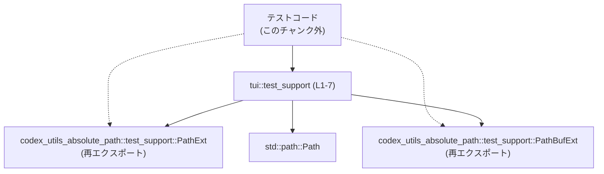
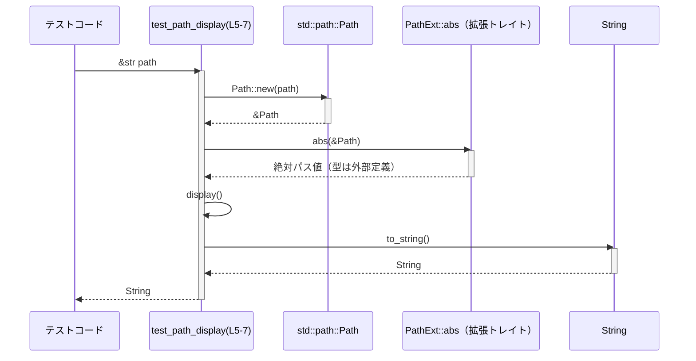

# tui/src/test_support.rs コード解説

## 0. ざっくり一言

TUI 関連のテストコード向けに、パス操作用トレイトを再エクスポートし、文字列パスから「絶対パスの文字列表現」を得るための小さなヘルパー関数を提供するモジュールです。

---

## 1. このモジュールの役割

### 1.1 概要

- このモジュールは **テストでのパス操作を簡潔に記述できるようにする** ために存在し、次の機能を提供します。
  - `codex_utils_absolute_path::test_support` に定義されたパス拡張トレイトの再エクスポート
  - `&str` で与えられたパスから、「絶対パスの `display()` 表現」を `String` として取得する関数

### 1.2 アーキテクチャ内での位置づけ

`tui::test_support` は、外部クレート `codex_utils_absolute_path` と標準ライブラリ `std::path::Path` に依存する、テスト支援用モジュールとして位置付けられます。



- テストコード（`E`）はこのモジュール（`A`）を通じて `PathExt` / `PathBufExt` を利用し、必要に応じて `test_path_display` を呼び出す構造になっています。
- `PathExt` が提供する `abs` メソッドにより、`std::path::Path` に絶対パス取得の機能を追加していると解釈できます（メソッド呼び出しから読み取れる事実です）。

### 1.3 設計上のポイント

- **責務の分割**  
  - 本モジュール自体はロジックをほとんど持たず、外部トレイトの再エクスポートと、薄いラッパー関数のみを提供しています（`tui/src/test_support.rs:L1-2,5-7`）。
- **状態を持たない**  
  - グローバル状態や構造体を持たず、関数はすべて純粋関数的に振る舞います。
- **エラーハンドリング**  
  - `test_path_display` は `Result` ではなく `String` を直接返しており、絶対パス取得の失敗をエラーとして外に出さない設計です（`tui/src/test_support.rs:L5`）。
  - `abs()` の戻り値が `Result` でないことは、チェーンの中でエラー処理が行われていない点から読み取れます（`tui/src/test_support.rs:L6`）。
- **公開範囲**  
  - すべて `pub(crate)` で定義されており、**クレート内部専用のテスト支援 API** であることがわかります（`tui/src/test_support.rs:L1-2,5`）。

---

## 2. 主要な機能一覧

- パス拡張トレイトの再エクスポート: テストコードから `PathExt` / `PathBufExt` をインポートしやすくする
- `test_path_display`: `&str` で与えたパスを絶対パスに変換し、その `display()` 表現を `String` として取得するヘルパー

---

## 3. 公開 API と詳細解説

### 3.1 型・トレイト一覧（再エクスポート）

| 名前           | 種別         | 役割 / 用途                                                                 | 定義場所（外部）                                       | 行番号 |
|----------------|--------------|------------------------------------------------------------------------------|--------------------------------------------------------|--------|
| `PathBufExt`   | トレイト（再エクスポート） | `PathBuf` に対する拡張メソッド群を提供するトレイトと推測されますが、詳細はこのチャンクには現れません。 | `codex_utils_absolute_path::test_support` 内（外部）   | `tui/src/test_support.rs:L1` |
| `PathExt`      | トレイト（再エクスポート） | `Path` に対する拡張メソッド群を提供するトレイトであり、少なくとも `abs` メソッドを定義していることがわかります。 | `codex_utils_absolute_path::test_support` 内（外部）   | `tui/src/test_support.rs:L2` |

- どちらも **このファイル内では定義されておらず**、再エクスポートのみが行われています。
- メソッドの具体的な一覧や挙動は、外部クレート側のコードを確認する必要があります。

### 3.2 関数詳細

#### `test_path_display(path: &str) -> String`

**定義位置**

- `tui/src/test_support.rs:L5-7`

**概要**

- 文字列で与えられたファイルパス・ディレクトリパスを `std::path::Path` に変換し、`PathExt::abs` によって絶対パス化したうえで、その `display()` 表現を `String` として返すテスト用ヘルパー関数です。

**引数**

| 引数名 | 型     | 説明 |
|--------|--------|------|
| `path` | `&str` | パス文字列。UTF-8 文字列であり、相対パス・絶対パスともに渡されうると考えられますが、扱いの詳細は `abs` の実装に依存します。 |

**戻り値**

- 型: `String`
- 意味: `Path::new(path).abs().display()` で得られる表示用オブジェクトを `to_string()` した結果です。  
  - フォーマットは `std::path::Display` の実装に従うため、OS によって区切り文字（`/` / `\`）などが異なります。

**内部処理の流れ**

コード（`tui/src/test_support.rs:L5-7`）:

```rust
pub(crate) fn test_path_display(path: &str) -> String {
    Path::new(path).abs().display().to_string()
}
```

処理ステップ:

1. `Path::new(path)` で `&str` を `&Path` に変換する（`tui/src/test_support.rs:L6`）。
2. `abs()` を呼び出して絶対パスを取得する。  
   - `abs` は再エクスポートされた `PathExt` トレイトによる拡張メソッドであると読み取れます（`tui/src/test_support.rs:L2,6`）。
3. 絶対パス値に対し `display()` を呼び出し、フォーマット用のオブジェクト（`Display` ラッパー）を得る（`tui/src/test_support.rs:L6`）。
4. `to_string()` により、その表示表現を `String` として確保し、呼び出し元に返す（`tui/src/test_support.rs:L6`）。

**Examples（使用例）**

> モジュールパスは上位の `mod` 宣言に依存します。以下では仮に `crate::tui::test_support` というパスだと仮定した例を示します。

```rust
// テスト支援関数をインポートする                         // ヘルパー関数を使いやすくする
use crate::tui::test_support::test_path_display;          // 実際のモジュールパスはプロジェクト構成に依存

#[test]                                                   // 通常のユニットテスト
fn show_absolute_path_for_relative_input() {              // 相対パスから絶対パス文字列を得るテスト
    let rel = "data/config.toml";                         // 相対パス文字列（UTF-8）
    let abs_disp = test_path_display(rel);                // 絶対パスの表示用文字列を取得

    println!("absolute path = {}", abs_disp);             // テストログ等に出力して確認
}
```

`PathExt` を直接利用する例（型は外部トレイト定義に依存するため、ここでは明示しません）:

```rust
use crate::tui::test_support::PathExt;                    // Path に abs メソッドを追加する拡張トレイト
use std::path::Path;                                      // 標準ライブラリの Path 型

fn example_abs_usage() {
    let p = Path::new("logs/app.log");                    // 相対パスを Path に変換
    let abs = p.abs();                                    // PathExt により提供される abs メソッドを呼び出す
    let disp = abs.display().to_string();                 // display() → to_string() で表示文字列を得る

    println!("absolute log path = {}", disp);             // 結果を表示
}
```

**Errors / Panics（エラー・パニック条件）**

- この関数は `Result` を返さず、シグネチャ上はエラーを返しません（`tui/src/test_support.rs:L5`）。
- `Path::new(path)` は標準ライブラリの仕様上、失敗しません（無効な UTF-8 は `&str` 型では表現されないため）。
- `abs()` の戻り値が `Result` 型ではないため、**エラーを値として返すことはありません**。  
  - 内部でパニックを起こす可能性の有無は、`PathExt::abs` の実装がこのチャンクには現れないため不明です。
- `display().to_string()` も通常はパニックしない想定ですが、実際には `Display` 実装次第であり、このチャンクからはパニックの有無を断定できません。

**Edge cases（エッジケース）**

以下は、この関数のシグネチャと呼び出しから読み取れる範囲の事実です。挙動の詳細は `PathExt::abs` の実装に依存します。

- `path` が空文字列 `""` の場合
  - `Path::new("")` は妥当なパス値として生成されますが、どのような絶対パスに変換されるかは `abs` の実装次第です。
- `path` が相対パス（例: `"."`, `"./foo"`, `"../bar"`）の場合
  - どのディレクトリを基準に解決されるか（カレントディレクトリかどうか）は、このチャンクからは分かりません。
- `path` が絶対パスの場合
  - 既に絶対パスであっても、`abs` がどの程度正規化（`..` の除去など）を行うかは不明です。
- 非 UTF-8 のパス
  - 引数型が `&str` のため、**非 UTF-8 のパスはそもそも渡すことができません**。  
    OS レベルの非 UTF-8 なパスを扱う必要がある場合、この関数は利用できないという意味での「エッジケース」となります。

**使用上の注意点**

- 文字列表現は OS ごとに異なる  
  - 区切り文字（`/` vs `\`）やドライブレター（Windows など）の有無が変わるため、テストで厳密な文字列一致を行うと OS 依存になりやすいです。
- 環境に依存しうる  
  - 相対パス入力時の結果は、**カレントディレクトリや `PathExt::abs` の仕様に依存**します。再現性の高いテストを行う場合は、この点を考慮する必要があります。
- スレッド安全性  
  - 関数内で共有可変状態や I/O を利用しておらず、`&str` から `String` を生成するだけなので、**複数スレッドから同時に呼び出しても問題とならない構造**になっています。

### 3.3 その他の関数

- このファイルには、`test_path_display` 以外の関数は定義されていません（`tui/src/test_support.rs:L1-7`）。

---

## 4. データフロー

このセクションでは、代表的なシナリオとして「テストコードから `test_path_display` を呼び出して絶対パス文字列を得る」ケースのデータフローを示します。

1. テストコードが相対パスや絶対パスを `&str` として `test_path_display` に渡す。
2. 関数内で `Path::new` により `&Path` を生成。
3. 拡張トレイト `PathExt::abs` により、絶対パスに変換。
4. そのパスに対し `display().to_string()` で `String` を生成し、テストコードに返す。



- `abs` の内部でどのようなシステムコールやパス解決が行われるかは、このチャンクには現れません。
- 上記フローはすべて単一スレッド内で完結し、非同期処理や並行処理は利用していません。

---

## 5. 使い方（How to Use）

### 5.1 基本的な使用方法

> 実際のモジュールパスはプロジェクトのモジュール構成に依存します。ここでは例として `crate::tui::test_support` を使用します。

```rust
// テスト支援モジュールから関数をインポート                     // モジュールパスは適宜調整
use crate::tui::test_support::test_path_display;            // `pub(crate)` のため同一クレート内でのみ利用可能

#[test]                                                     // ユニットテスト定義
fn it_produces_display_string_of_absolute_path() {          // 絶対パス文字列が得られることを確認する例
    let relative = "resources/sample.txt";                  // 相対パス文字列
    let display = test_path_display(relative);              // 絶対パスの表示用文字列を取得

    // OS 依存のため、厳密な文字列一致よりも部分一致や正規表現を使う方が安全
    assert!(display.contains("resources"));                 // 例: 特定ディレクトリ名が含まれるかを確認
}
```

### 5.2 よくある使用パターン

1. **テストログ用の人間可読なパス表示**

   ```rust
   use crate::tui::test_support::test_path_display;         // ヘルパー関数をインポート

   fn log_path_for_debug(path: &str) {                      // デバッグログ用の関数
       let display = test_path_display(path);               // 絶対パスの表示文字列を取得
       eprintln!("[DEBUG] using path: {}", display);        // デバッグ出力に利用
   }
   ```

2. **`PathExt` を使った直接的な絶対パス取得**

   ```rust
   use crate::tui::test_support::PathExt;                   // Path に abs メソッドを追加する拡張トレイト
   use std::path::Path;

   fn ensure_absolute(path: &str) {                         // パスを絶対パス化して使う例
       let p = Path::new(path);                             // &str → &Path
       let abs = p.abs();                                   // PathExt の abs メソッドを呼び出し
       println!("absolute = {}", abs.display());            // display() で表示
   }
   ```

   - `abs` の戻り値の正確な型は、外部トレイトの定義に依存しますが、`display()` を呼べるパス型であることはコードから分かります（`tui/src/test_support.rs:L6`）。

### 5.3 よくある間違い

コードから推測できる、起こりがちな誤用例とその修正例です。

```rust
// 誤りの例: OS ごとの違いを考慮しない文字列比較
use crate::tui::test_support::test_path_display;

#[test]
fn bad_assert_on_display() {
    let disp = test_path_display("foo/bar");
    // Windows と Unix で区切り文字が異なるため、次のような断定的な比較は危険
    // assert_eq!(disp, "/home/user/project/foo/bar"); // OS 依存でテストが壊れる可能性
}

// より安全な例: 一部のみを比較、もしくは OS ごとの差異を吸収する
#[test]
fn better_assert_on_display() {
    let disp = test_path_display("foo/bar");
    assert!(disp.ends_with("foo/bar") || disp.ends_with("foo\\bar")); // 区切り文字の違いを許容
}
```

> 上記のようなアサーション方針はあくまで一例であり、正確な期待値はプロジェクトの要件に依存します。

### 5.4 使用上の注意点（まとめ）

- **UTF-8 前提**  
  - 引数が `&str` のため、OS レベルの非 UTF-8 パス（Unix の一部ケースなど）は扱えません。
- **OS 依存性**  
  - 文字列フォーマットは `std::path::Display` に依存するため、テストで文字列を比較する際には OS 差異を考慮する必要があります。
- **テスト専用 API としての位置づけ**  
  - 関数名やモジュール名から、テスト支援用であることが読み取れます。  
    本番コードでの利用は避け、テスト・開発支援用途に限定する設計であると解釈できます。
- **並行実行時の安全性**  
  - 外部状態に依存せず、引数から戻り値を計算するだけの純粋な関数のため、複数スレッドから同時に呼び出してもレースコンディションは発生しません。

---

## 6. 変更の仕方（How to Modify）

### 6.1 新しい機能を追加する場合

新しいテスト用パスユーティリティを追加する場合の一般的な手順です。

1. **同一モジュールに関数を追加する**  
   - 例: パスの親ディレクトリを文字列で返すヘルパー関数などを、`test_path_display` と同様のスタイルで追加します。
2. **既存のトレイトを再利用する**  
   - すでに再エクスポートされている `PathExt` / `PathBufExt` のメソッドを利用すると、パスの正規化や絶対パス化を統一できます（`tui/src/test_support.rs:L1-2`）。
3. **公開範囲の検討**  
   - クレート内のテストからのみ利用したい場合は、既存と同様に `pub(crate)` とすることで、外部クレートへの露出を避けられます。

### 6.2 既存の機能を変更する場合

`test_path_display` の仕様変更や内部実装の変更を行う場合に注意すべき点です。

- **契約（インターフェース）の確認**
  - 現状の契約としては、少なくとも以下が成り立っています:
    - 引数: `&str` パスを受け取る（`tui/src/test_support.rs:L5`）。
    - 処理: `Path::new(path).abs().display()` に相当するパスの表示表現を返す（`tui/src/test_support.rs:L6`）。
    - 戻り値: `String` を返し、`Result` ではない（エラーは表に出ない）。
  - ロジックを変更する際は、これらのうちどれを変えるのかを明確にし、それに依存するテストコードを洗い出す必要があります。
- **影響範囲の調査**
  - クレート内で `test_path_display` を呼び出しているテストを検索し、どのような前提で文字列をアサートしているかを確認します。
  - `PathExt` / `PathBufExt` の再エクスポートに依存しているコードも、名前や場所の変更があれば影響を受けます。
- **テストの更新**
  - パスの表示形式を変える（例えば正規化の度合いを変える）などの場合、既存テストが OS 依存の前提で書かれていないかを確認し、必要に応じてテストを修正します。

---

## 7. 関連ファイル

このモジュールと密接に関係する外部モジュール・コンポーネントです。

| パス / モジュール名                               | 役割 / 関係 |
|---------------------------------------------------|------------|
| `codex_utils_absolute_path::test_support`        | `PathExt` / `PathBufExt` トレイトを定義している外部クレート側のモジュールです。本ファイルはここからこれらのトレイトを再エクスポートしています（`tui/src/test_support.rs:L1-2`）。 |
| `std::path::Path`                                | `Path::new` により `&str` を `&Path` に変換するために使用されています（`tui/src/test_support.rs:L3,6`）。 |
| （このチャンクには現れない）TUI 関連テストコード | `test_path_display` や再エクスポートされたトレイトに依存していると考えられますが、具体的なファイル名や内容はこのチャンクからは分かりません。 |

---

### Bugs / Security / Contracts / Edge Cases についての補足

- **明らかなバグ・セキュリティ問題**  
  - この短いヘルパー関数からは、明らかなバッファオーバーフローや権限昇格などの問題は読み取れません。
  - パスを「表示用文字列」に変換するのみであり、ファイルの読み書きや実行は行っていません。
- **契約のポイント**  
  - 「渡したパスを絶対パスに変換し、`display()` の結果を `String` として返す」という振る舞いが、テストコード側の前提条件になりやすい部分です。
- **エッジケース**  
  - 相対パス・空文字列など、パスの内容による挙動の違いは `PathExt::abs` の実装次第であり、このチャンクからは詳細を判断できません。  
    こうした入力をテストで多用する場合は、`codex_utils_absolute_path` 側の仕様を確認することが重要です。
