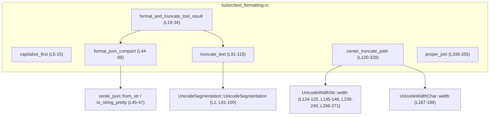
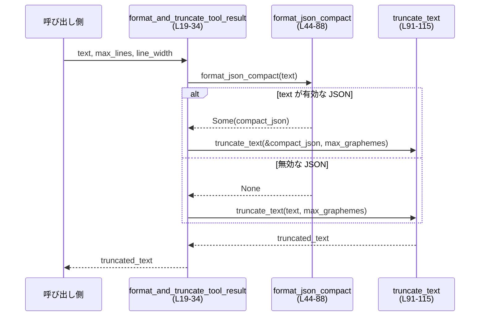

# tui/src/text_formatting.rs

## 0. ざっくり一言

TUI 上に表示する文字列（通常テキスト・JSON・パス・英語のリスト）を、**見栄えよく・安全に切り詰め／整形するためのユーティリティ関数群**です。

---

## 1. このモジュールの役割

### 1.1 概要

- このモジュールは、**端末幅・行数・Unicode 幅**などを考慮してテキストを整形／トリミングするために存在します。
- 主な機能は次のとおりです。
  - 先頭文字の大文字化（`capitalize_first`、L5-15）
  - ツール結果テキストを（必要なら JSON として整形した上で）グラフェム数で切り詰める（`format_and_truncate_tool_result`、L19-34）
  - Ratatui で折り返しやすいコンパクトな 1 行 JSON への整形（`format_json_compact`、L44-88）
  - グラフェム単位での安全な切り詰め（`truncate_text`、L91-115）
  - パス文字列を中央省略＋前方省略で表示幅に収める（`center_truncate_path`、L120-328）
  - 英語のリスト文字列の自然な結合（`proper_join`、L336-355）

### 1.2 アーキテクチャ内での位置づけ

- 依存ライブラリ
  - `unicode_segmentation::UnicodeSegmentation`（グラフェム境界の計算、L1）
  - `unicode_width::{UnicodeWidthChar, UnicodeWidthStr}`（表示幅の計測、L2-3）
  - `serde_json`（JSON パース＆整形、L45-47）
- 他モジュールからは、「テキスト表示前の最後の整形レイヤ」として利用される位置づけです（コードから Ratatui の名前が出ているため、L36-43）。

主要な関数間と外部依存の関係は次のとおりです。



### 1.3 設計上のポイント

- **すべて関数ベース・状態なし**
  - グローバル状態や内部キャッシュはなく、すべて純粋関数として実装されています（全関数 `pub(crate) fn`、L5, L19, L44, L91, L120, L336）。
- **Unicode を意識した安全な切り詰め**
  - 生のバイト列ではなく、`grapheme_indices(true)` を使ってグラフェム境界で切ることで、結合文字や絵文字を途中で壊さない実装になっています（`truncate_text`, L91-100）。
- **「表示幅」を考慮したパス表示**
  - パスの切り詰めは `UnicodeWidthStr` / `UnicodeWidthChar` を用いて端末セル幅ベースで行っています（L124-125, L185-188）。
- **JSON は「端末で読みやすく・折り返しやすく」整形**
  - Serde の pretty 形式をベースに、自前の 1 行整形器で「`:` と `,` の後にのみスペースを入れる」ルールを実装し、Ratatui の行折り返し制約を回避しています（L36-43, L54-83）。
- **エラーハンドリング**
  - JSON 整形は `Option<String>` を返し、パース失敗時は `None`（`format_json_compact`, L44-46, L87）、利用側の `format_and_truncate_tool_result` では JSON として扱わないフォールバックを取る設計です（L29-33）。
- **テストが充実**
  - 各機能に対して多くの単体テストがあり、境界条件・Unicode 文字・さまざまな JSON 形態・パスパターンが網羅されています（`mod tests`, L357-580）。

---

## 2. 主要な機能一覧

- 先頭大文字化: 文字列の最初の Unicode 文字を大文字化し、残りをそのまま連結します（`capitalize_first`, L5-15）。
- ツール結果の JSON 整形＋トリミング: テキストが JSON ならコンパクトな 1 行に整形し、最大グラフェム数で切り詰めます（`format_and_truncate_tool_result`, L19-34）。
- JSON の 1 行コンパクト整形: `serde_json` の `Value` を 1 行の可読な形式（`{"k": "v", ...}`）に変換します（`format_json_compact`, L44-88）。
- グラフェム単位の文字列切り詰め: 最大グラフェム数を超える場合、必要なら末尾に `"..."` を付けて切り詰めます（`truncate_text`, L91-115）。
- パスの中央省略＋前方省略表示: 左右のディレクトリ名を残しつつ中央を `…` で省略し、必要ならセグメント自体を前方省略します（`center_truncate_path`, L120-328）。
- 英語リストの自然な結合: `"apple and banana"`, `"apple, banana and cherry"` のような自然な列挙文字列を作成します（`proper_join`, L336-355）。

---

## 3. 公開 API と詳細解説

### 3.1 型一覧（構造体・列挙体など）

このファイルには公開構造体はありませんが、`center_truncate_path` 内部でのみ利用されるローカル構造体があります。

| 名前 | 種別 | 役割 / 用途 | 定義位置 |
|------|------|-------------|----------|
| `Segment<'a>` | 構造体（ローカル） | パスの 1 セグメントの元文字列／現在の表示文字列／トリミング可否／suffix かどうかを保持する | `tui/src/text_formatting.rs:L152-157` |

### 3.2 関数詳細

#### `capitalize_first(input: &str) -> String`  （L5-15）

**概要**

- 文字列の先頭の 1 文字を大文字（`to_uppercase`）に変換し、残りをそのまま後ろに付けた新しい `String` を返します（L6-13）。

**引数**

| 引数名 | 型 | 説明 |
|--------|----|------|
| `input` | `&str` | 変換対象の文字列。空文字列も可です。 |

**戻り値**

- `String`: 先頭を大文字化した文字列。入力が空の場合は空の `String`（L13）。

**内部処理の流れ**

1. `input.chars()` で Unicode スカラ値のイテレータを取得（L6）。
2. `chars.next()` で最初の文字を取り出す（L7）。
3. 最初の文字が存在すれば、`to_uppercase().collect::<String>()` で大文字列に変換（L8-9）。
4. 残りの文字列部分（`chars.as_str()`）をそのまま連結（L10）。
5. 最初の文字が存在しなければ `String::new()` を返す（L13）。

**Examples（使用例）**

```rust
// "hello" の先頭を大文字化
let s = capitalize_first("hello");  // "Hello"

// Unicode 文字も処理される
let s2 = capitalize_first("ñandú"); // 先頭 ñ が大文字化される
```

**Errors / Panics**

- エラーも panic も発生しません。`to_uppercase` は常に成功し、`collect::<String>()` も OOM 以外でパニックしません。

**Edge cases（エッジケース）**

- `""`（空文字列）: 空の `String` を返します（`None => String::new()`、L13）。
- 先頭の文字が複数コードポイントからなる場合（ギリシャ文字など）:
  - `to_uppercase()` が 1 文字を複数文字に変換する可能性がありますが、その結果を `String` に収集しているため、すべて保持されます（L9）。

**使用上の注意点**

- 「**先頭の 1 グラフェム**」ではなく「**先頭の 1 char（Unicode スカラ値）**」を対象にしています。そのため、結合文字を含むグラフェムなどには厳密には対応していませんが、多くのケースでは問題なく動作します。

---

#### `format_and_truncate_tool_result(text: &str, max_lines: usize, line_width: usize) -> String`  （L19-34）

**概要**

- ツール結果テキストを、指定された**行数 × 行幅**に収まるようにグラフェム数で切り詰めます。
- 元テキストが JSON の場合は、まず `format_json_compact` で 1 行のコンパクトな整形を行い、その結果を `truncate_text` で切り詰めます（L29-33）。

**引数**

| 引数名 | 型 | 説明 |
|--------|----|------|
| `text` | `&str` | ツールからの出力テキスト。JSON かもしれない任意の文字列。 |
| `max_lines` | `usize` | 表示可能な最大行数。0 の場合は 0 グラフェム扱いになります（L27）。 |
| `line_width` | `usize` | 1 行あたりの最大「セル幅」。ここでは 1 グラフェム ≒ 1 セルとして近似計算します（L24-27）。 |

**戻り値**

- `String`: 整形済みかつ切り詰め済みの文字列。

**内部処理の流れ**

1. 表示可能なグラフェム数を `max_lines * line_width - max_lines` として計算（L27）。
   - 行ごとに 1 セル分の誤差を見込んで減らしています（コメント L24-27）。
2. `format_json_compact(text)` で JSON としてパースできるか試みる（L29）。
3. JSON として整形できた場合:
   - 整形結果を `truncate_text(&formatted_json, max_graphemes)` で切り詰め（L29-30）。
4. JSON として扱えない場合:
   - 元の `text` を `truncate_text(text, max_graphemes)` で切り詰め（L31-32）。

**Examples（使用例）**

```rust
// 10行 × 80列 のエリアにツール結果を収める
let raw = r#"{ "name": "John", "age": 30, "hobbies": ["reading", "coding"] }"#;
let formatted = format_and_truncate_tool_result(raw, 10, 80);  // JSONとして整形・切り詰め

// 非JSONのテキストもそのまま切り詰め
let plain = "This is a very long log message ...";
let formatted_plain = format_and_truncate_tool_result(plain, 5, 40);
```

**Errors / Panics**

- JSON パース失敗時は `format_json_compact` が `None` を返し、単に JSON 整形をスキップするだけです（L29-33）。
- 独自の panic の可能性はありません。`saturating_sub` によりオーバーフローも防いでいます（L27）。

**Edge cases（エッジケース）**

- `max_lines == 0` または `line_width == 0`:
  - `max_graphemes` が `0.saturating_sub(0) == 0` となり、`truncate_text` により空文字列が返されます（`truncate_text` のテスト L377-380）。
- 非 JSON テキスト:
  - `format_json_compact` が `None` となり、そのまま `truncate_text` が使われます（L29-33）。
- 非 BMP や複合絵文字を含むテキスト:
  - 実際のセル幅までは正確には考慮できませんが、`truncate_text` がグラフェム境界で切るため、文字化けや途中切りは避けられます。

**使用上の注意点**

- コメントにもある通り、「**1 グラフェム = 1 セル**」ではないケース（幅 2 の全角文字など）では表示結果が厳密に枠に収まらない可能性があります（L24-27）。
- 端末サイズの変化（リサイズ）までは考慮していない「近似」であることに注意が必要です（コメント L24-27）。

---

#### `format_json_compact(text: &str) -> Option<String>`  （L44-88）

**概要**

- 任意の JSON テキストをパースし、Ratatui で折り返しやすい **1 行コンパクト形式**に整形します（L36-43）。
- 入力が JSON として無効な場合は `None` を返します（L45）。

**引数**

| 引数名 | 型 | 説明 |
|--------|----|------|
| `text` | `&str` | JSON 文字列（になるかもしれない任意の文字列）。 |

**戻り値**

- `Option<String>`:
  - `Some(compact)` … 整形済み 1 行 JSON。例: `{"name": "John", "age": 30}`（テスト L444-447）。
  - `None` … `serde_json::from_str` に失敗した場合（L45）。

**内部処理の流れ**

1. `serde_json::from_str::<serde_json::Value>(text).ok()?` で `Value` にパース（L45）。
   - 失敗時は早期 `None`（`?` により）を返す。
2. `serde_json::to_string_pretty(&json)` で pretty な複数行の JSON を生成し、失敗時は `json.to_string()` にフォールバック（L46）。
3. その文字列を 1 文字ずつ走査し、次の状態を管理（L50-53）:
   - `in_string`: JSON 文字列の内部かどうか。
   - `escape_next`: 次の文字がエスケープ対象かどうか。
4. 走査時のルール（L55-83）:
   - 文字列外の `\n` / `\r` は破棄（L65-67）。
   - 文字列外の空白・タブは原則破棄。ただし直前が `:` または `,` で、次の文字が `}` / `]` でない場合に限り 1 個のスペースを挿入（L69-76）。
   - `"`（ダブルクオート）は `escape_next` が立っていないときに `in_string` フラグをトグル（L57-60）。
   - `\`（バックスラッシュ）は文字列内でのみ `escape_next` をトグルしつつ結果に追加（L61-63, L79-81）。
   - 上記以外はそのまま結果に追加（L78-83）。
5. 最終的な結果文字列を `Some(result)` として返却（L87）。

**Examples（使用例）**

```rust
let json = r#"
{
    "name": "John",
    "hobbies": ["reading", "coding"]
}
"#;

let compact = format_json_compact(json).unwrap();
// compact == r#"{"name": "John", "hobbies": ["reading", "coding"]}"#
```

**Errors / Panics**

- JSON パースに失敗した場合は `None` を返すだけで、panic はしません（L45）。
- `serde_json::to_string_pretty` 失敗時も `unwrap_or_else` のフォールバックにより panic しません（L46）。

**Edge cases（エッジケース）**

- オブジェクト／配列が空のとき:
  - `"{}"` や `"[]"` のようにそのまま表現される（テスト L543-546, L550-553）。
- プリミティブ値のみ（数値・真偽値・null・文字列）:
  - `42`, `true`, `"string"` などはそのまま返却されます（テスト L557-562）。
- 文字列リテラル内の空白や改行:
  - `in_string` フラグにより処理の対象外となるため、元の JSON と同じ意味内容が保たれます（L57-63, L79-81）。

**使用上の注意点**

- 整形結果は**必ず 1 行**ですが、行長制限は設けていないため、非常に大きな JSON の場合は長い 1 行になります（`format_and_truncate_tool_result` で切り詰める設計）。
- 元の JSON の空白（インデント等）は失われます。意味的には同じですが、完全に同じ文字列には戻りません。

---

#### `truncate_text(text: &str, max_graphemes: usize) -> String`  （L91-115）

**概要**

- 文字列を **グラフェム（ユーザーが目で見る 1 文字の単位）** の数に基づいて切り詰めます。
- 上限を超える場合、`max_graphemes >= 3` なら末尾に `"..."` を付けて、全体が `max_graphemes` グラフェム以内に収まるようにします（L95-104）。

**引数**

| 引数名 | 型 | 説明 |
|--------|----|------|
| `text` | `&str` | 対象文字列。Unicode 文字列全般に対応。 |
| `max_graphemes` | `usize` | 残したい最大グラフェム数。0 も可です。 |

**戻り値**

- `String`: 切り詰め後の文字列。必要に応じて `"..."` が付加されます。

**内部処理の流れ**

1. `text.grapheme_indices(true)` でグラフェム境界のイテレータを取得（L92）。
2. `graphemes.nth(max_graphemes)` を実行（L95）。
   - `Some((byte_index, _))` → **元のテキストには `max_graphemes + 1` 個以上のグラフェムがある**ことを意味します。
   - `None` → グラフェム数が `max_graphemes` 以下であるため、そのまま返します（L111-114）。
3. さらに `max_graphemes >= 3` の場合:
   - 先頭 `max_graphemes - 3` グラフェムまでを取得し（別のイテレータで `nth(max_graphemes - 3)`、L99-100）、その部分文字列に `"..."` を付加（L101-102）。
4. `max_graphemes < 3` の場合:
   - `"..."` を付けず、先頭 `max_graphemes` グラフェム分のみを返します（L107-110）。

**Examples（使用例）**

```rust
// シンプルな ASCII 文字列
assert_eq!(truncate_text("Hello, world!", 8), "Hello...");

// 絵文字を含む文字列（テストより）
let text = "👋🌍🚀✨💫";
assert_eq!(truncate_text(text, 3), "...");   // 3グラフェム → "..."
assert_eq!(truncate_text(text, 4), "👋..."); // 4グラフェム → 1文字 + "..."
```

**Errors / Panics**

- グラフェム境界から得たバイトオフセットで `&text[..byte_index]` をスライスしているため、UTF-8 の不正な境界で panic することはありません（L100-102, L108-109）。
- `unicode_segmentation` の API 使用上の panic 条件はありません。

**Edge cases（エッジケース）**

テストで明示的に確認されています（L362-441）。

- `max_graphemes == 0` → `""`（空文字列、L377-380）。
- `max_graphemes == 1` → 先頭 1 グラフェムのみ返す（L383-387）。
- `max_graphemes == 2` → 先頭 2 グラフェムのみ返す（L390-394）。
- `max_graphemes == 3` → `"..."` だけ（元は "Hello" → "...", L397-401）。
- 入力が空文字列 → 常に空文字列（L369-374）。
- 非常に長いテキスト → `"aaaaaaa..."` のように `"..."` 含めてちょうど `max_graphemes` グラフェムに収める（L435-441）。
- 結合文字を含む文字列（"é́ñ̃"） → グラフェム単位で扱うため途中で分断されません（L428-433）。

**使用上の注意点**

- **グラフェム数ベース**であり、端末セル幅ベースではありません。全角文字や絵文字は視覚的な幅と一致しないことがあります。
- `max_graphemes < 3` の場合は `"..."` が付かないため、「切り詰められていることを明示したい」用途では少なくとも 3 以上を指定する必要があります。

---

#### `center_truncate_path(path: &str, max_width: usize) -> String`  （L120-328）

**概要**

- パス様の文字列を、**表示幅 `max_width` 以内**に収めるためのトリミング関数です。
- 可能な限り「先頭のディレクトリ」「末尾の 1〜2 セグメント」を保持し、中央部を `…`（Unicode の三点リーダ）で省略します（L202-223, L287-323）。
- 個々のセグメントが長すぎる場合は、セグメントの先頭を `…` で省略する**前方省略**を行います（L173-200, L264-279）。

**引数**

| 引数名 | 型 | 説明 |
|--------|----|------|
| `path` | `&str` | OS のパス区切り文字（`std::path::MAIN_SEPARATOR`）を用いるパス様文字列。 |
| `max_width` | `usize` | 表示可能な最大セル幅（`UnicodeWidthStr::width` ベース）。0 の場合は空文字列になります（L121-123）。 |

**戻り値**

- `String`: 可能な限り情報を残しつつ、`max_width` 以内に収められたパス文字列。

**内部処理の流れ（概要）**

1. **早期リターン条件**（L121-150）
   - `max_width == 0` → `""`（L121-123）。
   - `UnicodeWidthStr::width(path) <= max_width` → そのまま `path.to_string()`（L124-126）。
   - 先頭／末尾のセパレータを考慮しつつ `raw_segments` に分割し、空セグメントを除去（L128-140）。
   - セグメントが空（例: ルートのみ）なら、可能ならルートのセパレータだけを返し、収まらなければ "…" を返す（L142-150）。
2. `Segment<'a>` 構造体の定義（L152-157）
   - `original`: 元のセグメント文字列
   - `text`: 現在の表示文字列（トリム後）
   - `truncatable`: トリムしてよいか
   - `is_suffix`: 右側セグメントかどうか（後述の優先度に使う）
3. 関数／クロージャ群の定義
   - `assemble`: 先頭セパレータとセグメントを結合して候補パスを構築（L159-171）。
   - `front_truncate`: セグメントの先頭を `…` で省略して、`allowed_width` 以内に収める（L173-200）。
   - `sort_combos`: 左右セグメント数の組み合わせをソートするヘルパ（L224-231）。
   - `fit_segments`: 現在のセグメント構成が `max_width` に収まるか試し、必要なら前方省略を試みるメインロジック（L235-285）。
4. **左右セグメント数の組み合わせ生成**（L202-223）
   - `segment_count` 個のセグメントから、`left_count`（左側）と `right_count`（右側）の組み合わせをすべて作成。
   - 原則として「末尾 2 セグメントを優先的に残す」ために `desired_suffix` を 2（最大でも `segment_count - 1`）とし、それを満たす組み合わせを優先（L210-223）。
5. **組み合わせごとの試行**（L287-325）
   - 左側 `left_count` 個のセグメントを `Segment` として構築（L287-296）。
   - `left_count + right_count < segment_count` のとき中央に `…` セグメントを挿入（L298-305）。
   - 右側 `right_count` 個のセグメントを `is_suffix = true` で追加（L308-317）。
   - `fit_segments` を呼び出して、前方省略を含めた調整を行い、`max_width` 以内に収まる候補が得られればそれを採用（L321-323）。
6. すべての組み合わせで失敗した場合は、パス全体を `front_truncate(path, max_width)` で前方省略します（L327）。

**`front_truncate` の動作詳細**（L173-200）

- `allowed_width == 0` → `""`（L174-176）。
- セグメント全体が `allowed_width` に収まるならそのまま返す（L177-179）。
- `allowed_width == 1` → `"…"` のみ（L180-182）。
- それ以外:
  - 1 セルを `…` に予約し、末尾側から幅を足していき、収まる範囲までを逆順に収集（L184-193）。
  - 最後に `…` + 収集した文字列で返す（L195-199）。

**Examples（使用例）**

テストから代表例を抜粋します。

```rust
// 端末に十分な幅がある → そのまま表示
let sep = std::path::MAIN_SEPARATOR;
let path = format!("{sep}Users{sep}codex{sep}Public");
assert_eq!(center_truncate_path(&path, 40), path); // L460-467

// 中央を省略しつつ先頭と末尾を保持
let path = format!("~{sep}hello{sep}the{sep}fox{sep}is{sep}very{sep}fast");
let truncated = center_truncate_path(&path, 24);
assert_eq!(
    truncated,
    format!("~{sep}hello{sep}the{sep}…{sep}very{sep}fast") // L471-478
);

// セグメント自体が長い場合は前方省略
let path = format!("~{sep}supercalifragilisticexpialidocious");
let truncated = center_truncate_path(&path, 18);
assert_eq!(truncated, format!("~{sep}…cexpialidocious")); // L495-500
```

**Errors / Panics**

- `UnicodeWidthStr::width` および `UnicodeWidthChar::width` の使用は、UTF-8 の有効性が前提ですが、Rust の `&str` は常に有効な UTF-8 なので panic は想定されません（L124-125, L145-146, L187-188）。
- インデックス計算やスライスは文字列の範囲外にアクセスしないよう配慮されています。`front_truncate` は文字単位で構築し、`assemble` は `push_str` のみを使用しています。

**Edge cases（エッジケース）**

- `max_width == 0` → 常に `""`（L121-123）。
- パスがすでに `max_width` 以下 → そのまま返す（L124-126）。
- パスがルートだけ（例: `"/"`）:
  - ルート記号が収まる場合はそれだけ返し、そうでなければ "…" を返します（L142-150）。
- セグメント数が 1 または 2 の場合:
  - 中央 `…` を挿入する必要がないため、`allow_front_truncate = true` となり、必要に応じて前方省略だけで調整します（L210-213, L321）。
- どのセグメントもさらに短くできない場合:
  - `changed == false` となり `None` を返して別の組み合わせの検討に移るか、最終的に `front_truncate(path, max_width)` にフォールバックします（L264-279, L281-283, L327）。

**使用上の注意点**

- パスセパレータには `std::path::MAIN_SEPARATOR` を使用しているため、Windows と Unix で挙動は同じロジックですが、文字自体は OS ごとに変わります（L128）。
- 表示幅は `UnicodeWidthStr`／`UnicodeWidthChar` に依存しており、すべての端末エミュレータと完全に一致するとは限りません。
- 表示の一貫性を保つため、`center_truncate_path` と他のテキスト描画ロジックで同じ幅計算を使うことが望ましいです。

---

#### `proper_join<T: AsRef<str>>(items: &[T]) -> String`  （L336-355）

**概要**

- 英語の単語リストを自然な形で結合します。
  - `[]` → `""`
  - `["apple"]` → `"apple"`
  - `["apple", "banana"]` → `"apple and banana"`
  - `["apple", "banana", "cherry"]` → `"apple, banana and cherry"`（L330-335, L341-353）。

**引数**

| 引数名 | 型 | 説明 |
|--------|----|------|
| `items` | `&[T]` (`T: AsRef<str>`) | 結合対象の要素スライス。`&str`, `String` などに対応。 |

**戻り値**

- `String`: 自然な英語の列挙表現。

**内部処理の流れ**

1. 要素数に応じた分岐（L337-354）:
   - 0 個 → `String::new()`（L338）。
   - 1 個 → その要素を `to_string()`（L339）。
   - 2 個 → `"{} and {}"` 形式の `format!`（L340）。
   - 3 個以上:
     1. 最後の要素を `last` として控えておく（L342）。
     2. 末尾以外の要素を `", "` 区切りで `result` に連結（L343-350）。
     3. `format!("{result} and {last}")` で `"A, B, C and D"` 形式に仕上げる（L352）。

**Examples（使用例）**

```rust
assert_eq!(proper_join(&[] as &[&str]), "");
assert_eq!(proper_join(&["apple"]), "apple");
assert_eq!(proper_join(&["apple", "banana"]), "apple and banana");
assert_eq!(
    proper_join(&["apple", "banana", "cherry"]),
    "apple, banana and cherry"
);
```

（上記はテスト L565-577 と一致）

**Errors / Panics**

- panic 条件はありません。`AsRef<str>` 変換と `format!` は通常のメモリアロケーション以外で panic しません。

**Edge cases（エッジケース）**

- 非 ASCII や空文字列を含む要素も、そのまま結合されます（コード上の制限はありません）。
- 3 個以上のとき、いわゆる「オックスフォード・カンマ」は使用していません（`"A, B and C"` 形式）。

**使用上の注意点**

- 常に `"and"` を使用します。`"or"` などが必要な場合は別関数が必要です（本チャンクには存在しません）。
- ローカライズは考慮していないため、英語 UI 専用のヘルパと考えるのが自然です。

---

### 3.3 その他の関数

このファイルのトップレベル関数はすべて上記で説明した 6 つです（L5-15, L19-34, L44-88, L91-115, L120-328, L336-355）。  
補助ロジックはすべてローカルなクロージャとして `center_truncate_path` 内に定義されています（L159-171, L173-200, L224-231, L235-285）。

---

## 4. データフロー

ここでは、ツール結果が画面に表示される前に整形・切り詰められる典型的なフローを整理します。

### 4.1 ツール結果テキストの整形・切り詰めフロー

1. 呼び出し側（TUI ロジックなど）が、ツールの生の結果 `text` と、画面における `max_lines`・`line_width` を決定します。
2. `format_and_truncate_tool_result` を呼び出します（L19-34）。
3. 関数内部で JSON パースを試みるため、`format_json_compact` が呼び出されます（L29）。
   - 成功した場合: コンパクト 1 行 JSON を取得。
   - 失敗した場合: `None` が返却されるため、このステップをスキップ。
4. 得られた文字列（JSON の場合は整形後、それ以外は元の文字列）を `truncate_text` に渡し、グラフェム数に基づく切り詰めを行います（L29-33）。
5. 最終的な文字列が呼び出し元に返され、TUI コンポーネントで描画されます。

Mermaid のシーケンス図として表すと次のようになります。



---

## 5. 使い方（How to Use）

### 5.1 基本的な使用方法

ツール結果を TUI 上の特定領域に表示する単純な例です。

```rust
use tui::text_formatting::{
    capitalize_first,
    format_and_truncate_tool_result,
    center_truncate_path,
    proper_join,
};

// TUI が持つ描画領域の制約
let max_lines = 10;     // 表示できる行数
let line_width = 80;    // 1行あたりの最大セル幅

// ツールの生の結果（JSON でもテキストでもよい）
let raw_result = r#"{ "name": "John", "age": 30 }"#;

// 整形＋切り詰め
let display_text = format_and_truncate_tool_result(raw_result, max_lines, line_width);

// パスをタイトル行などに表示する際の例
let path = "/Users/codex/Projects/super/long/path/file.txt";
let path_title = center_truncate_path(path, 40);

// リストの説明文
let features = ["files", "folders", "symlinks"];
let features_str = proper_join(&features); // "files, folders and symlinks"
```

### 5.2 よくある使用パターン

1. **ログや長文メッセージの安全な切り詰め**

```rust
let log = "very long log message ...";
let short = truncate_text(log, 120); // Unicodeグラフェム単位で安全に切り詰め
```

1. **ラベルの先頭だけを強調**

```rust
let label = "error";
let label_cap = capitalize_first(label); // "Error"
```

1. **ファイルピッカーなどのパス表示**

```rust
let path = "/Users/codex/Public";
let title = center_truncate_path(path, 20);
// 20セル幅に収まるように中央を必要に応じて省略
```

### 5.3 よくある間違い

```rust
// 誤り例: max_lines や line_width を 0 のまま渡してしまう
let truncated = format_and_truncate_tool_result("some text", 0, 80);
// → max_graphemes が 0 となり、常に空文字列になる

// 正しい例: 最低限の行数と幅を指定する
let truncated = format_and_truncate_tool_result("some text", 1, 80);
```

```rust
// 誤り例: 切り詰め済みの文字列をさらにバイト単位で切り詰める
let s = truncate_text("👋🌍🚀", 2);
// ここで &s[..1] などを行うと UTF-8 境界を壊す危険

// 正しい例: 追加の切り詰めも truncate_text を使う
let s2 = truncate_text(&s, 1);
```

### 5.4 使用上の注意点（まとめ）

- **Unicode と幅の違い**
  - `truncate_text` はグラフェム数ベース、`center_truncate_path` はセル幅ベースで動きます。用途に応じて使い分ける必要があります。
- **JSON 整形の副作用**
  - `format_json_compact` に通すと空白や改行が変更されるため、「完全に同じ文字列」を保持する用途には向きません。
- **0 値パラメータ**
  - `max_lines == 0` や `max_width == 0` は意図せず「常に空」の結果になる可能性があるため、呼び出し前に値の妥当性を確認することが重要です（L121-123, `truncate_text` のテスト L377-380）。

---

## 6. 変更の仕方（How to Modify）

### 6.1 新しい機能を追加する場合

例: 「URL を中央省略する関数」を追加する場合。

1. **このファイルに追加するかを検討**
   - 本モジュールは「テキスト整形／切り詰め」のユーティリティを集約しているため、URL 書式も性質的にはここに追加するのが自然です。
2. **既存の実装パターンを参考にする**
   - Unicode 幅・グラフェム処理が必要なら、`truncate_text` や `center_truncate_path` のパターン（`UnicodeWidthStr`, `UnicodeSegmentation`）を再利用します（L91-115, L120-328）。
3. **インターフェース設計**
   - 他の関数と同様に `pub(crate) fn` で公開し、必要なパラメータ（最大幅など）を引数として受け取る形にします。
4. **テストの追加**
   - 本ファイルのテストモジュール（L357-580）にならい、境界条件と代表例をカバーするテストを追加します。

### 6.2 既存の機能を変更する場合

- **影響範囲の確認**
  - `format_and_truncate_tool_result` の変更は、ツール結果の表示全体に影響します。呼び出し元のモジュールを `ripgrep` 等で検索し、期待される挙動の変化を整理する必要があります（呼び出し側は本チャンクには出現しません）。
- **契約の維持**
  - `truncate_text`:
    - 「グラフェム境界で切る」「`max_graphemes >= 3` なら `"..."` を付ける」という契約が多くのテストに依存しているため、変更時はテスト（L362-441）を更新するか、互換性を維持する必要があります。
  - `format_json_compact`:
    - 「有効な JSON なら `Some`、そうでなければ `None`」「1 行形式」という契約を破ると、`format_and_truncate_tool_result` の挙動も変わります（L29-33）。
  - `center_truncate_path`:
    - Windows/Unix 双方のパスを扱うテストがあるため（L481-492）、OS 依存の挙動変更には注意が必要です。
- **テストの更新**
  - どの関数も単体テストが密に結び付いているため、挙動変更後は該当テストを必ず確認・更新します。

---

## 7. 関連ファイル

このチャンクから直接参照できるのは、このファイル自身と外部クレートのみです。他モジュールとの関係はコード上には現れていません。

| パス / クレート | 役割 / 関係 |
|----------------|------------|
| `tui/src/text_formatting.rs` | 本ファイル。TUI 層でのテキスト整形ユーティリティを提供。 |
| `unicode_segmentation` クレート | グラフェム境界の計算に使用（L1, L91-100）。 |
| `unicode_width` クレート | 文字・文字列の表示幅計算に使用（L2-3, L124-125, L145-146, L187-188, L239-240, L266-271）。 |
| `serde_json` クレート | JSON のパースと整形に使用（L45-47）。 |

他の TUI モジュール（ウィジェットや画面描画ロジック）が本ユーティリティをどのように呼び出しているかについては、このチャンクには記述がないため不明です。
