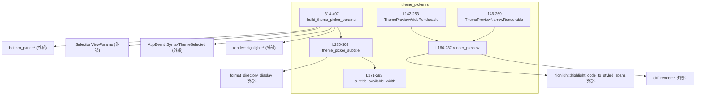
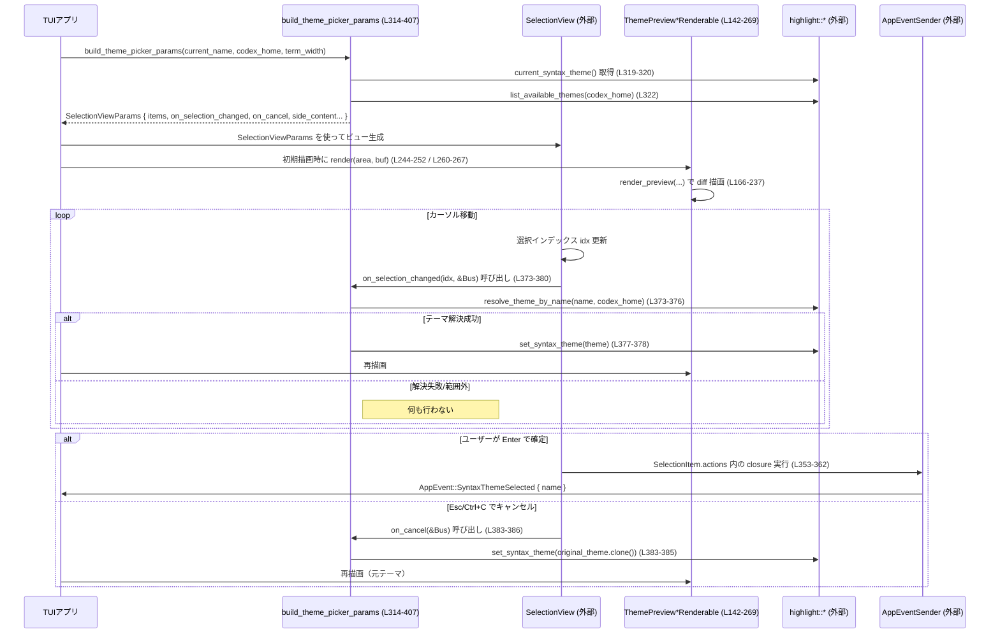

# tui/src/theme_picker.rs コード解説

---

## 0. ざっくり一言

`/theme` コマンドで開く「シンタックステーマ選択ダイアログ」のパラメータと、右側／下側のライブプレビュー用レンダラを定義するモジュールです。  
テーマ一覧の生成・選択時のライブプレビュー・キャンセル時の元テーマ復元・決定時のイベント送信を担います（`tui/src/theme_picker.rs:L304-407`）。

---

## 1. このモジュールの役割

### 1.1 概要

このモジュールは **TUI のテーマ選択ダイアログを構成するための部品** を提供します（`tui/src/theme_picker.rs:L304-407`）。

- テーマ一覧と選択コールバックをまとめた `SelectionViewParams` を構築する（`build_theme_picker_params`，`L314-407`）。
- サイドパネル／スタック表示用の **Rust diff プレビュー** を描画する `Renderable` 実装を提供する（`ThemePreviewWideRenderable`, `ThemePreviewNarrowRenderable`, `L142-269`）。
- 端末幅と `CODEx_HOME` に応じたサブタイトル文言を生成する（`theme_picker_subtitle`, `L285-302`）。

### 1.2 アーキテクチャ内での位置づけ

依存関係の概要です。



- 上位レイヤ（TUI アプリ本体）は `build_theme_picker_params` を呼び出して `SelectionViewParams` を取得し、ビューを構築します。
- 描画時には `SelectionViewParams.side_content` / `stacked_side_content` に格納された `ThemePreview*Renderable` が `render()` を通じて呼ばれ、`render_preview` から diff レンダラ群へ処理が流れます。
- テーマ変更・キャンセル時には `on_selection_changed` / `on_cancel` コールバックから `highlight` モジュールと `AppEvent` に処理が渡ります（`L368-386`）。

### 1.3 設計上のポイント

- **責務分割**
  - テーマ一覧＋コールバック生成: `build_theme_picker_params`（`L314-407`）。
  - プレビュー描画ロジック: `render_preview` とその補助型／関数（`L45-237`）。
  - サブタイトル生成: `theme_picker_subtitle` と `subtitle_available_width`（`L271-302`）。
- **状態管理**
  - グローバルなテーマ状態は `highlight` モジュールに委譲し、このモジュールでは
    「現在のテーマのスナップショット」と「選択中のテーマ名のリスト」をクローンして保持するだけです（`L320`, `L370-373`）。
- **エラーハンドリング**
  - すべての公開関数は `Result` ではなくプレーンな値を返します。
  - テーマ解決失敗やインデックス範囲外などは `if let` による早期 return で「何もしない」挙動とし、パニックを避けています（`L373-378`）。
  - 描画処理では 0 サイズ領域や空配列を事前にチェックし、即 return します（`L173-178`）。
- **安全性（Rust 観点）**
  - 幅・オフセット計算は `saturating_sub` などを用いてオーバーフロー／アンダーフローを避けています（`L157`, `L193`, `L195`, `L203`）。
  - TUI コールバックは `Send + Sync` を要求し（`L379-380`, `L385-386`）、並行環境でも扱えるよう設計されています。キャプチャする値は `String`, `PathBuf`, `Vec` など標準ライブラリ型のみです。

---

## 2. 主要な機能一覧

- テーマ選択ビューの構築: `build_theme_picker_params` が `SelectionViewParams` を生成し、一覧・検索・アクション・プレビューなどを一括設定する（`L314-407`）。
- テーマ選択時の **ライブプレビュー**:
  - `on_selection_changed` コールバックで選択テーマを解決し、`highlight::set_syntax_theme` に反映（`L373-378`）。
- キャンセル時の **元テーマ復元**:
  - ダイアログ表示時のテーマをスナップショットし、`on_cancel` で復元（`L320`, `L383-385`）。
- テーマ決定イベントの送出:
  - 各 `SelectionItem.actions` から `AppEvent::SyntaxThemeSelected` を送信（`L353-362`）。
- 横幅に応じた diff プレビュー描画:
  - ワイド表示: `ThemePreviewWideRenderable`（`L142-253`）。
  - ナロー表示: `ThemePreviewNarrowRenderable`（`L146-269`）。
- サブタイトルメッセージ生成:
  - `CODEx_HOME` 配下 `themes/` ディレクトリをチルダ付きパスで表示しつつ、幅が足りない場合は汎用メッセージへフォールバック（`L285-302`）。

---

## 3. 公開 API と詳細解説

### 3.1 型一覧（構造体・列挙体など）

| 名前 | 種別 | 役割 / 用途 | 定義位置 |
|------|------|-------------|----------|
| `PreviewDiffKind` | enum | プレビュー行が「文脈」「追加」「削除」のどれかを表現 | `theme_picker.rs:L45-50` |
| `PreviewRow` | struct | 1 行の diff プレビュー（行番号・種別・コード文字列）を表現 | `L53-57` |
| `ThemePreviewWideRenderable` | 構造体（ユニット構造体） | サイドパネル用のワイド diff プレビューを描画する `Renderable` 実装 | `L142`, `L239-253` |
| `ThemePreviewNarrowRenderable` | 構造体（ユニット構造体） | リスト下に縦積みするナロー diff プレビュー用の `Renderable` 実装 | `L146`, `L255-269` |
| `SelectionViewParams` | 構造体（外部 crate） | テーマピッカー全体の設定。タイトル、項目、プレビュー、コールバック等を保持 | （インポート `L26`、構築 `L387-405`） |

主な定数:

| 名前 | 種別 | 説明 | 定義位置 |
|------|------|------|----------|
| `NARROW_PREVIEW_ROWS` | `[PreviewRow; 4]` | ナロー表示時の 4 行プレビュー用サンプル diff | `L61-82` |
| `WIDE_PREVIEW_ROWS` | `[PreviewRow; 8]` | ワイド表示時の 8 行プレビュー用サンプル diff | `L86-127` |
| `WIDE_PREVIEW_MIN_WIDTH` | `u16` | サイドパネルでワイドプレビューを出すための最小幅 | `L129-130` |
| `WIDE_PREVIEW_LEFT_INSET` | `u16` | ワイドプレビュー時の左側インデント（列数） | `L132-133` |
| `PREVIEW_FRAME_PADDING` | `u16` | 垂直方向センタリング時の枠パディング | `L135-136` |
| `PREVIEW_FALLBACK_SUBTITLE` | `&'static str` | サブタイトルのフォールバックメッセージ | `L138` |

### 3.2 関数詳細（重要関数）

#### `pub(crate) fn build_theme_picker_params(current_name: Option<&str>, codex_home: Option<&Path>, terminal_width: Option<u16>) -> SelectionViewParams`

**概要**

テーマ選択ダイアログ全体の設定 (`SelectionViewParams`) を構築します。  
現在のテーマ設定・利用可能なテーマ一覧・プレビュー・サブタイトル・コールバックを一括で組み立てます（`L314-407`）。

**引数**

| 引数名 | 型 | 説明 |
|--------|----|------|
| `current_name` | `Option<&str>` | 設定ファイル上の `Config::tui_theme` 値。利用不可なテーマ名の場合は無視されます（`L325-334`）。 |
| `codex_home` | `Option<&Path>` | `CODEx_HOME` ディレクトリのパス。サブタイトル生成とカスタムテーマ探索に使用（`L322-323`, `L285-290`）。 |
| `terminal_width` | `Option<u16>` | 現在の端末幅。サブタイトルの折り返し可否の判定に利用（`L387-392`, `L271-283`）。 |

**戻り値**

- `SelectionViewParams`: テーマピッカーのビュー構築に必要なすべての情報。
  - テーマ項目リスト
  - 検索設定
  - プレビュー用 `Renderable`
  - 選択変更／キャンセル時のコールバック など（`L387-405`）。

**内部処理の流れ**

1. **現在テーマのスナップショット**
   - `highlight::current_syntax_theme()` で今のテーマを取得し、`on_cancel` で復元できるよう保持します（`L319-320`, `L383-385`）。

2. **利用可能なテーマ一覧取得**
   - `highlight::list_available_themes(codex_home)` からテーマエントリを取得（`L322`）。
   - 同時に `codex_home` の `PathBuf` コピーを作成（`L323`）。

3. **有効なテーマ名（effective_name）の決定**
   - `current_name` が `Some` かつ `entries` 内に存在する場合のみそれを採用（`L328-331`）。
   - そうでなければ `highlight::configured_theme_name()` を使用（`L332-334`）。

4. **`SelectionItem` リストの構築**
   - 各エントリに対し:
     - `(custom)` suffix の付加（カスタムテーマの場合、`L343-347`）。
     - `is_current` フラグの設定と、該当インデックスを `initial_idx` として記録（`L348-351`）。
     - 検索用 `search_value` にテーマ名を入れる（`L353-358`）。
     - アクションとして `AppEvent::SyntaxThemeSelected { name }` を送るクロージャを登録（`L353-362`）。
   - これを `Vec<SelectionItem>` に収集（`L339-366`）。

5. **プレビュー用のテーマ名マッピング生成**
   - `items` から `search_value` を抽出して `Vec<Option<String>>` を作成し、プレビュー時にインデックスからテーマ名を引けるようにします（`L368-371`）。

6. **選択変更時コールバックの設定**
   - `on_selection_changed` は `idx` を受け取り、`preview_theme_names[idx]` からテーマ名を取り出し（範囲外や `None` は無視）、`highlight::resolve_theme_by_name` でテーマを解決します（`L373-376`）。
   - 解決に成功した場合のみ `highlight::set_syntax_theme` を呼び、ライブプレビューを更新します（`L377-378`）。

7. **キャンセル時コールバックの設定**
   - `on_cancel` は保存しておいた `original_theme` を `set_syntax_theme` へ戻します（`L383-385`）。

8. **`SelectionViewParams` の構築**
   - タイトル、サブタイトル（`theme_picker_subtitle` 使用）、フッターヒント、検索設定、プレビュー用 `Renderable`、コールバック等を設定し、`SelectionViewParams` を返します（`L387-405`）。

**Examples（使用例）**

```rust
// テーマピッカーを構築してビューに渡す例（コンテキスト用の疑似コード）
use std::path::Path;
use crate::tui::theme_picker::build_theme_picker_params;

fn open_theme_picker(
    current_tui_theme: Option<String>,          // Config::tui_theme 相当
    codex_home: Option<&Path>,
    terminal_width: u16,
) {
    let params = build_theme_picker_params(
        current_tui_theme.as_deref(),          // Option<&str> に変換
        codex_home,
        Some(terminal_width),
    );
    // ここで SelectionViewParams を TUI のビュー管理に渡す
    // ui.push_selection_view(params);
}
```

**Errors / Panics**

- この関数自体は `Result` を返さず、内部でも `unwrap` や `expect` を使用していません。
- ただし、呼び出している `highlight::*` や `list_available_themes` 等がパニックを起こさない前提です（コードからは不明）。

**Edge cases（エッジケース）**

- `current_name` が利用不能なテーマ名:
  - `entries` に存在しない場合は `configured_theme_name()` にフォールバックし、そのテーマの項目を選択状態にします（`L328-334`）。
- テーマ一覧が空 (`entries.is_empty()`):
  - その場合でも `items` は空の `Vec` になります。`initial_selected_idx` は `None` のままです（`L336-338`, `L339-366`）。選択時コールバックもインデックス範囲外扱いで何も起きません（`L373-375`）。
- `codex_home` が `None`:
  - カスタムテーマ探索は `highlight::list_available_themes(None)` の実装に依存しますが、サブタイトルはフォールバックメッセージになります（`theme_picker_subtitle`, `L285-302`）。
- `terminal_width` が `None`:
  - サブタイトルの幅計算で 80 カラムとして扱われます（`subtitle_available_width`, `L271-273`）。

**使用上の注意点**

- `build_theme_picker_params` は **UI スレッド／メインスレッドで呼び出す前提** に見えます。非同期から呼ぶこと自体は問題ありませんが、返ってくる `SelectionViewParams` がどのスレッドで使用されるかは UI 実装側に依存します。
- `current_name` に不正なテーマ名を渡してもパニックはしませんが、選択結果は `configured_theme_name()` にフォールバックします。  
  呼び出し側が「現在選択されているテーマ名」を必ず把握したい場合は、返り値の `initial_selected_idx` と `items[idx].search_value` を利用する必要があります（`L397-399`, `L644-652`）。

---

#### `fn render_preview(area: Rect, buf: &mut Buffer, preview_rows: &[PreviewRow], center_vertically: bool, left_inset: u16)`

**概要**

共通の diff プレビュー描画ロジックです。  
ワイド／ナローの両レンダラから呼ばれ、指定領域内に行番号＋差分マーカー付きの Rust コードサンプルを描画します（`L166-237`）。

**引数**

| 引数名 | 型 | 説明 |
|--------|----|------|
| `area` | `Rect` | 描画対象の矩形領域（ratatui）。 |
| `buf` | `&mut Buffer` | 描画先バッファ。 |
| `preview_rows` | `&[PreviewRow]` | 描画する diff 行の配列。順番どおりに処理されます。 |
| `center_vertically` | `bool` | `true` の場合、縦方向にセンタリングします（ワイドプレビュー用、`L195-200`）。 |
| `left_inset` | `u16` | 左側のインデント幅（ワイド＝2、ナロー＝0、`L195`, `L260-267`）。 |

**戻り値**

- 戻り値はありません。`buf` に直接描画します。

**内部処理の流れ**

1. **領域・入力チェック**
   - 高さまたは幅が 0 の場合、何も描画せず return（`L173-175`）。
   - `preview_rows` が空の場合も return（`L176-178`）。

2. **シンタックスハイライト用の前処理**
   - `preview_rows` の `code` を行ごとに結合して 1 つの文字列にし、`highlight_code_to_styled_spans` に渡します（`L179-185`）。
   - プレビュー中の最大行番号を求め、行番号表示幅 `ln_width` を計算します（`L186-191`）。

3. **レイアウト計算**
   - プレビュー行数と領域高さから実際のコンテンツ高さを算出（`L193`）。
   - 左インデント `left_pad` と縦方向オフセット `top_pad` を計算します（`L195-200`）。
   - 描画開始行 `y` と描画幅 `render_width` を決定します（`L202-203`）。

4. **行ごとの diff 行レンダリング**
   - diff レンダリングスタイルコンテキストを取得（`L204`）。
   - 各 `PreviewRow` に対して:
     - `preview_diff_line_type` で `DiffLineType` に変換（`L209-210`, `L148-153`）。
     - シンタックスハイライト情報があれば `push_wrapped_diff_line_with_syntax_and_style_context`、なければ `push_wrapped_diff_line_with_style_context` を呼び、折り返し済みの `Line` 群を生成（`L210-229`）。
     - 最初の `Line` だけを取り出し（1 行分）、計算済み位置に `render()` します（`L230-234`）。
     - `y` を 1 行分進め、領域下端を超えたらループ終了（`L205-208`, `L235`）。

**Examples（使用例）**

通常、直接呼ぶのではなく `Renderable` 実装経由で使用されます。

```rust
// Wide プレビューを 80x20 のバッファに描画するテストと同様の使い方（L498-505）
let lines = render_lines(
    &ThemePreviewWideRenderable, // Renderable 実装
    /*width*/ 80,
    /*height*/ 20,
);
// `lines` 内のテキストとして diff プレビューが得られる
```

**Errors / Panics**

- `unwrap_or_else(|| Line::from(""))` で空の `Line` にフォールバックしており、`wrapped` が空でもパニックしません（`L230`）。
- オフセット計算に `saturating_sub` を使っているため、幅不足によるアンダーフローは避けられています（`L193`, `L195`, `L203`）。
- ただし、`push_wrapped_diff_line_*` や `highlight::highlight_code_to_styled_spans` が内部でパニックしないことが前提です（コードからは不明）。

**Edge cases**

- `area` が小さすぎる場合:
  - 高さ 0 or 幅 0 の場合、描画しません（`L173-175`）。
  - 高さが `preview_rows.len()` 未満の場合、上から `area.height` 行だけ描画されます（`L205-208`）。
- `preview_rows` が空:
  - 何も描画しません（`L176-178`）。
- シンタックスハイライトが返す行数 < `preview_rows.len()`:
  - その行以降は非ハイライト版の diff 描画にフォールバックします（`L210-229`）。

**使用上の注意点**

- `left_inset` と `area.width` のバランスが取れていない場合（`left_inset >= area.width`）、少なくとも 1 列は描画できるように `left_pad = left_inset.min(width-1)` としているため、**幅 1 の領域でも描画は行われます**（`L195`）。
- この関数は「最初の折り返し行のみ」を描画する設計になっているため、非常に長いコード行でも 1 行目のみが見えることに注意が必要です（`L230`）。

---

#### `fn centered_offset(available: u16, content: u16, min_frame: u16) -> u16`

**概要**

縦方向センタリングに使う、コンテンツ開始位置のオフセットを計算する関数です（`L156-164`）。  
周囲のフレームパディングを最低 `min_frame` 確保できる場合はそれを維持しつつ中央揃えを行います。

**引数**

| 引数名 | 型 | 説明 |
|--------|----|------|
| `available` | `u16` | 利用可能な全体行数（領域高さ）。 |
| `content` | `u16` | 表示したいコンテンツの行数。 |
| `min_frame` | `u16` | 上下に挟む最低パディング行数。 |

**戻り値**

- `u16`: コンテンツの先頭行を配置すべきオフセット。

**アルゴリズム概要**

1. `free = available.saturating_sub(content)` で余白行数を求める（`L157`）。
2. `free >= 2 * min_frame` なら `frame = min_frame`、そうでなければ `frame = 0`（`L158-162`）。
3. 残りの余白から上下フレームを除いたものを 2 で割り、`frame + (free - 2*frame)/2` を返します（`L163`）。

**使用箇所**

- `render_preview` 内で `center_vertically == true` の場合に上オフセットとして使用されています（`L195-199`）。
- テスト `wide_preview_renders_all_lines_with_vertical_center_and_left_inset` によって、上下に余白が付くことが検証されています（`L498-527`）。

**Edge cases**

- `content >= available` の場合、`free == 0` となり `frame == 0`、返り値 0 です。このときコンテンツは上詰めで描画されます（`L157-163`）。

---

#### `fn subtitle_available_width(terminal_width: Option<u16>) -> usize`

**概要**

現在の端末幅に基づき、テーマピッカーのサブタイトルに使える文字幅を見積もります（`L271-283`）。

**引数**

| 引数名 | 型 | 説明 |
|--------|----|------|
| `terminal_width` | `Option<u16>` | 端末全体の幅。`None` のときは 80 カラムとして扱います。 |

**戻り値**

- `usize`: サブタイトルに使える最大表示幅（全角等を考慮した実際の表示幅ではなく、レイアウト上のカラム数）。

**処理概要**

1. `width = terminal_width.unwrap_or(80)` でデフォルト 80 カラムにフォールバック（`L272-273`）。
2. `popup_content_width(width)` でポップアップ内のコンテンツ幅を計算（`L273`）。
3. `side_by_side_layout_widths(content_width, SideContentWidth::Half, WIDE_PREVIEW_MIN_WIDTH)` を使い、サイドバイサイド表示が可能か判定（`L274-278`）。
   - 可能ならリスト側の幅 `list_width` を返す。
   - 不可能ならコンテンツ全幅 `content_width` を返す（`L279-282`）。

**Edge cases**

- `terminal_width` が小さく、サイドバイサイドが不可能な場合でも `content_width` を返すため、サブタイトルはリスト＋プレビューをまとめた幅で判断されます。
- テスト `subtitle_falls_back_for_94_column_terminal_side_by_side_layout` が、94 カラムで特定の挙動になることを検証しています（`L626-634`）。

---

#### `fn theme_picker_subtitle(codex_home: Option<&Path>, terminal_width: Option<u16>) -> String`

**概要**

`/theme` ダイアログのサブタイトル文字列を生成します（`L285-302`）。  
`CODEx_HOME/themes` ディレクトリへのヒントを表示できる場合はそれを使用し、幅が足りないか `CODEx_HOME` 自体が無い場合はフォールバックメッセージにします。

**引数**

| 引数名 | 型 | 説明 |
|--------|----|------|
| `codex_home` | `Option<&Path>` | `CODEx_HOME` のパス。存在すれば `themes/` を連結します（`L286`）。 |
| `terminal_width` | `Option<u16>` | 端末幅。`subtitle_available_width` に渡されます（`L290`）。 |

**戻り値**

- `String`: サブタイトル文言。

**内部処理の流れ**

1. `themes_dir = codex_home.map(|home| home.join("themes"))` により、`CODEx_HOME/themes` のパスを生成（`L286`）。
2. `format_directory_display(path, None)` でディレクトリ表示用の文字列を生成（`L287-289`）。
   - この文字列がホームディレクトリ配下の場合、`~` で始まる短縮パスになる前提がうかがえます（テストより、`L597-606`）。
3. サブタイトルに使える幅 `available_width` を `subtitle_available_width(terminal_width)` から取得（`L290`）。
4. `themes_dir_display` が存在しかつ `~` で始まる場合のみ、説明文 `"Custom .tmTheme files can be added to the {path} directory."` を組み立て、その表示幅を `UnicodeWidthStr::width` で算出（`L292-297`）。
   - 幅が `available_width` 以下ならこの説明文を返す（`L295-298`）。
5. 上記以外のケースでは `PREVIEW_FALLBACK_SUBTITLE`（"Move up/down to live preview themes"）を返します（`L300-301`）。

**Edge cases**

- `codex_home` がホームディレクトリ配下でない場合:
  - `path.starts_with('~')` が偽になり、常にフォールバックメッセージとなります（`L292-294`, テスト `L620-623`）。
- サブタイトルが長すぎる場合:
  - `UnicodeWidthStr::width(subtitle) > available_width` の場合にフォールバックします（`L295-298`）。
  - これは狭い端末や `codex_home` に長いパスが含まれる場合を想定した挙動で、テスト `subtitle_falls_back_when_tilde_path_subtitle_is_too_wide`（`L608-617`）で確認されています。

**使用上の注意点**

- 呼び出し元で幅をどう計算するかは `subtitle_available_width` に委ねられているため、別コンテキストで再利用する場合はその前提を理解しておく必要があります。
- `format_directory_display` の挙動（特に `~` への短縮）は外部依存であり、プラットフォームによって差がある可能性があります（コードからは詳細不明）。

---

#### `impl Renderable for ThemePreviewWideRenderable / ThemePreviewNarrowRenderable`

**概要**

両者とも ratatui の `Renderable` トレイトを実装し、それぞれワイド／ナロー用に `render_preview` を呼び出します（`L239-253`, `L255-269`）。

**メソッド**

| 型 | メソッド | 説明 | 定義位置 |
|----|---------|------|----------|
| `ThemePreviewWideRenderable` | `desired_height(&self, _width) -> u16` | できるだけ領域全体を使いたいため `u16::MAX` を返す | `L239-242` |
| 同上 | `render(&self, area, buf)` | `render_preview(area, buf, &WIDE_PREVIEW_ROWS, true, WIDE_PREVIEW_LEFT_INSET)` を呼ぶ | `L244-252` |
| `ThemePreviewNarrowRenderable` | `desired_height(&self, _width) -> u16` | 4 行分 (`NARROW_PREVIEW_ROWS.len()`) の高さを要求 | `L255-258` |
| 同上 | `render(&self, area, buf)` | `render_preview(area, buf, &NARROW_PREVIEW_ROWS, false, 0)` を呼ぶ | `L260-267` |

**Edge cases**

- ナロー表示では `desired_height` が固定 4 行のため、親レイアウトがそれ未満の高さを与えた場合は `render_preview` の `min(area.height, rows.len())` により切り詰めて描画されます（`L193`）。
- ワイド表示は `desired_height = u16::MAX` なので、親レイアウト側が高さを制限する必要があります。テスト `wide_preview_renders_all_lines_with_vertical_center_and_left_inset` は高さ 20 でレイアウトしたケースをチェックしています（`L498-545`）。

---

### 3.3 その他の関数

#### 本体ロジック側

| 関数名 | 役割（1 行） | 定義位置 |
|--------|--------------|----------|
| `preview_diff_line_type(kind: PreviewDiffKind) -> DiffLineType` | プレビュー用の行種別を diff レンダラ用の `DiffLineType` にマッピングします。 | `L148-154` |

#### テスト用ヘルパー

| 関数名 | 役割（1 行） | 定義位置 |
|--------|--------------|----------|
| `render_buffer` | 任意の `Renderable` を指定サイズの `Buffer` に描画するユーティリティ | `L415-420` |
| `render_lines` | `render_buffer` の結果を 1 行ごとの `String` ベクタに変換 | `L422-438` |
| `first_non_space_style_after_marker` | diff マーカー (`+` / `-`) の直後のテキストに適用されているスタイルを取得 | `L440-449` |
| `preview_line_number` | 描画済み 1 行の先頭に付与された行番号をパース | `L451-462` |
| `preview_line_marker` | 行番号に続く diff マーカー（`+` / `-`）を取得 | `L464-475` |

---

## 4. データフロー

### 4.1 ユーザー操作からテーマ変更・復元まで

ユーザーが `/theme` を開いてテーマを変更／キャンセルするまでの典型的なデータフローを示します。



**要点**

- ライブプレビューは `on_selection_changed` 経由で `highlight::set_syntax_theme` を呼ぶことで実現されています（`L373-378`）。
- 決定時の永続化はこのモジュールでは行わず、`AppEvent::SyntaxThemeSelected` をイベントバスに送るだけです（`L353-362`）。
- キャンセル時にはスナップショットしたテーマが復元されます（`L319-320`, `L383-385`）。

---

## 5. 使い方（How to Use）

### 5.1 基本的な使用方法

TUI アプリ側からの典型的な利用フローです。

```rust
use std::path::Path;
use crate::tui::theme_picker::build_theme_picker_params;
use crate::bottom_pane::SelectionView; // 仮の型名：実際の定義は他ファイル

fn open_theme_picker(
    current_tui_theme: Option<String>,  // Config::tui_theme の値
    codex_home: Option<&Path>,          // CODEx_HOME
    terminal_width: u16,                // 現在の端末幅
) {
    // テーマピッカーのパラメータを構築
    let params = build_theme_picker_params(
        current_tui_theme.as_deref(),   // Option<&str> に変換
        codex_home,
        Some(terminal_width),
    );

    // SelectionViewParams を使ってビューを生成し、UI スタックに積む
    // let view = SelectionView::new(params);
    // ui.push_view(Box::new(view));
}
```

この後のユーザー操作（カーソル移動・Enter・Esc）に応じて、`on_selection_changed` / `on_cancel` / `actions` が内部的に呼び出されます（`L353-362`, `L373-386`）。

### 5.2 よくある使用パターン

1. **設定画面からのテーマ変更**
   - 現在の設定値 `Config::tui_theme` を `current_name` に渡し、`codex_home` と端末幅も使用する。
   - `build_theme_picker_params` の戻り値をそのままモーダルダイアログとして表示し、`AppEvent::SyntaxThemeSelected` を受けて設定を永続化する。

2. **一時的なテーマプレビューのみ**
   - `AppEvent::SyntaxThemeSelected` をハンドリングせず、`on_selection_changed` が行うライブプレビューだけを利用することも可能です。  
     この場合、ダイアログを閉じる際に再度 `set_syntax_theme` を呼ぶなど、呼び出し側で追加処理を行うことが考えられます（ただし現状のコードでは `on_cancel` が復元します）。

### 5.3 よくある間違い

```rust
// 誤り例: 現在のテーマ名を None で渡してしまう
let params = build_theme_picker_params(
    None,                 // ← Config の値があるのに None にしている
    codex_home,
    Some(terminal_width),
);

// 正しい例: Config::tui_theme を Option<&str> で渡す
let params = build_theme_picker_params(
    config.tui_theme.as_deref(),   // Some("theme-name") など
    codex_home,
    Some(terminal_width),
);
```

- `current_name` を常に `None` にしてしまうと、「前回選択したテーマにカーソルを合わせる」という挙動が失われます（`L325-334`）。

### 5.4 使用上の注意点（まとめ）

- **前提条件**
  - `highlight::list_available_themes` が返すエントリの `name` は一意である前提です。`search_value` とプレビューの対応づけはこの名前に依存します（`L339-371`）。
- **並行性**
  - `on_selection_changed` / `on_cancel` は `Send + Sync` を要求するため、UI ランタイムが別スレッドで呼び出しても安全である必要があります（`L379-380`, `L385-386`）。
  - クロージャは `String`, `PathBuf`, `Vec` などの所有データをキャプチャしており、共有可変状態を直接保持していません。
- **パフォーマンス**
  - テーマ一覧を開くたびに `list_available_themes` とプレビュー用サンプルのシンタックスハイライトが行われますが、`preview_rows` は固定サイズの小さい配列です（最大全 8 行、`L86-127`）。  
    描画コストは限定的です。
  - 頻繁に `/theme` を開閉するような使い方でも大きな問題は生じにくい構造です。
- **フォールバック挙動**
  - テーマ解決やパス表示に失敗した場合でも、すべてフォールバック（何もしない／汎用メッセージ表示）として実装されており、パニックしないことが重視されています（`L373-378`, `L295-301`）。

---

## 6. 変更の仕方（How to Modify）

### 6.1 新しい機能を追加する場合

例: プレビュー用コードスニペットを設定から差し替えたい場合。

1. **スニペット定義の追加場所**
   - 現在は `NARROW_PREVIEW_ROWS` / `WIDE_PREVIEW_ROWS` としてコード内に固定定義されています（`L61-82`, `L86-127`）。
   - 設定ファイルや他モジュールから取得したい場合は、これらを生成する関数（例: `fn build_preview_rows(config: &Config) -> (Vec<PreviewRow>, Vec<PreviewRow>)`）をこのファイルか近傍のモジュールに追加するのが自然です。

2. **`Renderable` への組み込み**
   - `ThemePreviewWideRenderable::render` / `ThemePreviewNarrowRenderable::render` は現在定数配列への参照を渡しています（`L244-252`, `L260-267`）。
   - ここで外部構成に応じた `PreviewRow` を計算し、`render_preview` に渡すよう変更します。

3. **影響範囲**
   - テスト `wide_preview_renders_all_lines_with_vertical_center_and_left_inset` 等は、具体的なコード断片や行番号に依存しているため、スニペットを変更するとテストも合わせて修正する必要があります（`L498-545`, `L548-575`）。

### 6.2 既存の機能を変更する場合

- **テーマ選択ロジックの変更**
  - `effective_name` の決定ロジックは `build_theme_picker_params` 内にまとまっています（`L325-334`）。
  - 「利用できないテーマ名が指定された場合の挙動」を変えたいときは、この分岐を変更し、テスト `unavailable_configured_theme_falls_back_to_configured_or_default_selection`（`L636-653`）も合わせて更新します。

- **サブタイトル生成の挙動変更**
  - 幅制限や `~` の扱いは `theme_picker_subtitle` と `subtitle_available_width` に集中しています（`L271-302`）。
  - ここを変更する際は、関連する 4 つのテスト
    - `subtitle_uses_tilde_path_when_codex_home_under_home_directory`（`L597-606`）
    - `subtitle_falls_back_when_tilde_path_subtitle_is_too_wide`（`L608-617`）
    - `subtitle_falls_back_to_preview_instructions_without_tilde_path`（`L619-623`）
    - `subtitle_falls_back_for_94_column_terminal_side_by_side_layout`（`L626-634`）
    を合わせて見直す必要があります。

- **diff プレビューのスタイル変更**
  - diff 行種別のマッピングは `preview_diff_line_type`（`L148-154`）。
  - 実際の描画・スタイル適用は `render_preview` と外部の diff レンダラに依存します（`L166-237`）。
  - 削除行の dim 表示などはテスト `deleted_preview_code_uses_dim_overlay_like_real_diff_renderer` で検証されているため（`L578-594`）、スタイル変更時にはこのテストを参考にしてください。

---

## 7. 関連ファイル

このモジュールと密接に関係するファイル・モジュールです（インポートとテストから判定）。

| パス / モジュール | 役割 / 関係 |
|-------------------|------------|
| `crate::bottom_pane::SelectionViewParams` | テーマピッカーを含む選択ビュー全体の設定構造体。`build_theme_picker_params` の戻り値として使用（`L26`, `L387-405`）。 |
| `crate::bottom_pane::SelectionItem` | テーマ 1 件分を表す行。表示名、検索値、アクション等を保持（`L25`, `L339-366`）。 |
| `crate::bottom_pane::SideContentWidth` | サイドコンテンツ幅の指定に使用（`L27`, `L399`）。 |
| `crate::bottom_pane::popup_consts::standard_popup_hint_line` | フッターヒント文言を提供（`L28`, `L393`）。 |
| `crate::bottom_pane::{popup_content_width, side_by_side_layout_widths}` | サブタイトル領域幅やサイドバイサイドレイアウトの計算に使用（`L29-30`, `L271-283`）。 |
| `crate::diff_render::*` | diff 行の種別、行番号幅、スタイルコンテキスト、折り返し描画などを提供（`L31-35`, `L166-237`）。 |
| `crate::render::highlight` | テーマ一覧取得・現在テーマ取得・テーマ解決・テーマセットを行うモジュール。ライブプレビューとキャンセル復元の中心（`L36`, `L319-320`, `L322`, `L333-334`, `L373-378`, `L383-385`）。 |
| `crate::render::renderable::Renderable` | プレビュー用コンテンツが実装する描画トレイト（`L37`, `L239-253`, `L255-269`）。 |
| `crate::status::format_directory_display` | ディレクトリパスを `~` 付き表示に整形する関数（`L38`, `L287-289`）。 |
| `crate::app_event::AppEvent` | テーマ選択確定時に送信されるイベント型（`L24`, `L353-362`）。 |
| `crate::app_event_sender::AppEventSender` | `on_selection_changed` / `on_cancel` の引数となるイベント送信インターフェース（型は参照のみで、定義はこのチャンクには現れません、`L380`, `L386`）。 |
| `ratatui::buffer::Buffer`, `ratatui::layout::Rect`, `ratatui::text::Line`, `ratatui::widgets::Widget` | TUI 描画のためのバッファ・レイアウト・テキスト行・ウィジェット型（`L39-42`）。 |
| `unicode_width::UnicodeWidthStr` | サブタイトル文字列の表示幅（全角対応）計算に使用（`L43`, `L295-297`）。 |
| `dirs::home_dir`（テストのみ） | ホームディレクトリ取得用。サブタイトルの `~` 表示に関するテストで利用（`L599`, `L610`, `L628`）。 |

---

以上が `tui/src/theme_picker.rs` の構造・データフロー・使用方法の整理です。  
このファイルは `/theme` ダイアログの UI 振る舞いに関する多くの前提（ライブプレビュー / キャンセル復元 / サブタイトル表示）を担っているため、テーマ関連機能を変更する際はこのモジュールと関連テストを合わせて確認することが重要です。
