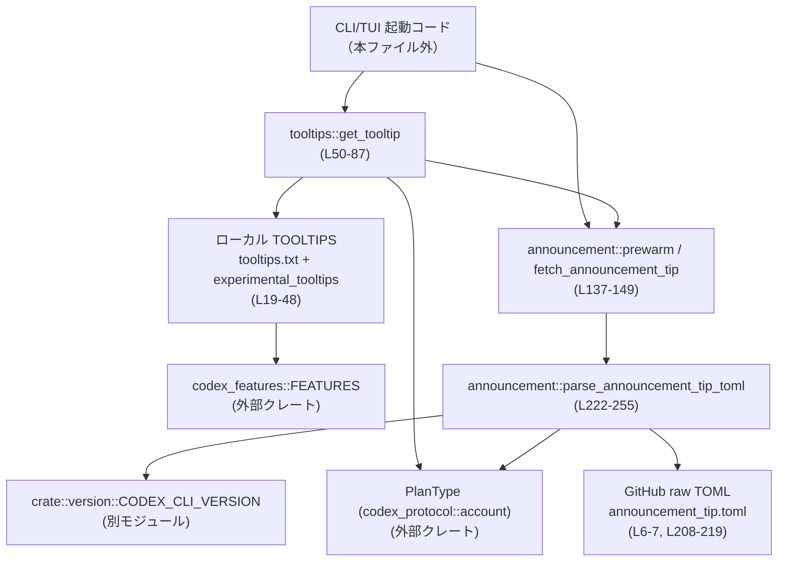
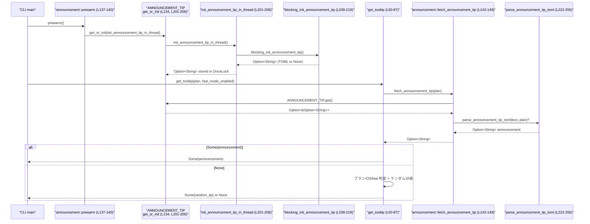

# tui/src/tooltips.rs コード解説

---

## 0. ざっくり一言

Codex CLI/TUI 起動時に表示する **ツールチップ（Tip）メッセージ**を、ローカル定義・機能フラグ・リモート TOML アナウンスから選択して返すモジュールです（`tui/src/tooltips.rs` 全体）。

---

## 1. このモジュールの役割

### 1.1 概要

- このモジュールは、CLI/TUI 起動時に表示する **1 行メッセージ（tooltip）** を決めるために存在し、次の情報源からメッセージを選びます。
  - ローカルファイル `tooltips.txt` に定義された静的ツールチップ（`RAW_TOOLTIPS` と `TOOLTIPS`）（`tui/src/tooltips.rs:L19-41`）
  - `codex_features::FEATURES` に基づく「実験機能」ツールチップ（`experimental_tooltips`）（L43-48）
  - GitHub 上の TOML ドキュメントから取得する「アナウンス」ツールチップ（`announcement` モジュール）（L122-321）
- ユーザーのプラン種別（`PlanType`）や OS、Fast モードの有無などに応じて、**ビジネスロジックに沿ったメッセージ選択**を行います（`get_tooltip`）（L50-87）。

### 1.2 アーキテクチャ内での位置づけ

このモジュールは、CLI/TUI の「UI 層」に近く **表示するメッセージの決定ロジック**を担当し、いくつかの外部モジュール／外部サービスに依存します。



- 呼び出し元（CLI main など）は、起動時に `announcement::prewarm()` を呼んでアナウンス取得をバックグラウンドで開始し（L137-140）、ツールチップ表示時には `get_tooltip` を呼びます（L50-87）。
- `announcement` モジュールは GitHub 上の `announcement_tip.toml` を `reqwest::blocking` で取得し（L208-219）、`toml` でパースして適切なアナウンスを選択します（L222-255）。

### 1.3 設計上のポイント

- **責務分割**
  - メインのツールチップ選択ロジックはトップレベル関数 `get_tooltip` に集約（L50-87）。
  - リモートアナウンスの取得とパースはサブモジュール `announcement` に分離（L122-321）。
- **状態管理**
  - ローカルツールチップ群（`TOOLTIPS`, `ALL_TOOLTIPS`）は `lazy_static!` で 1 度だけ構築（L21-41）。
  - リモートアナウンスの生テキストは `OnceLock<Option<String>>` にキャッシュし、スレッドセーフに一度だけ初期化（L134-135, L201-206）。
- **エラーハンドリング**
  - ネットワークや TOML パースの失敗はすべて `Option` による `None` で表現し、**静かにアナウンスなし**として扱います（L208-219, L222-230, L257-275）。
  - 日付・バージョンなど条件にマッチしないアナウンスは無視し、最後にマッチしたものだけを採用（L231-255）。
- **並行性**
  - アナウンス取得は `prewarm` により **バックグラウンドスレッド**で行い、UI スレッドをブロックしません（L137-140, L201-219）。
  - `OnceLock` により初期化処理は一度だけ実行され、複数スレッドからの利用でもデータ競合を避けています（L134, L201-206）。
- **プラットフォーム依存**
  - OS により表示する文言を切り替える定数・フィルタを持ちます（`IS_MACOS`, `IS_WINDOWS`, `TargetOs`）（L9-10, L25-33, L178-199）。

---

## 2. 主要な機能一覧

- ツールチップ全体の選択: `get_tooltip` – プラン・Fast モード・ランダム性・リモートアナウンスを総合して 1 つの文字列を返す（L50-87）。
- 有料ユーザー向けプロモスロットの選択: `pick_paid_tooltip` – アプリ宣伝か Fast モード宣伝かをランダム／状態に応じて選択（L97-110）。
- 汎用ランダムツールチップ選択: `pick_tooltip` – ローカル／実験機能ツールチップ集合からランダムに 1 件選ぶ（L112-119）。
- 実験機能ツールチップの生成: `experimental_tooltips` – `codex_features::FEATURES` から実験的アナウンスメッセージを抽出（L43-48）。
- アナウンスの事前取得（プリウォーム）: `announcement::prewarm` – バックグラウンドスレッドで TOML を取得してキャッシュ（L137-140）。
- アナウンスの取得・適用: `announcement::fetch_announcement_tip` – 事前取得したアナウンスを現在のプラン・OS・バージョンに合わせてパースし、適用可能なら返す（L143-149, L222-255）。
- TOML アナウンスのパース・フィルタリング: `announcement::parse_announcement_tip_toml` と `AnnouncementTip` メソッド群 – 日付、バージョン、ターゲットプラン、ターゲット OS、アプリ種別を判定（L222-255, L257-320）。

---

## 3. 公開 API と詳細解説

### 3.1 型一覧（構造体・列挙体など）

| 名前 | 種別 | 可視性 | 役割 / 用途 | 定義位置 |
|------|------|--------|-------------|----------|
| `AnnouncementTipRaw` | 構造体 | `pub(crate)`外（モジュール内） | TOML から直接デシリアライズされる 1 件分のアナウンス生データ。日付等は文字列のまま保持します。 | `tui/src/tooltips.rs:L151-160` |
| `AnnouncementTipDocument` | 構造体 | 内部 | `[[announcements]]` テーブルを持つ TOML ドキュメント全体のルート型（`announcements: Vec<AnnouncementTipRaw>`） | L162-165 |
| `AnnouncementTip` | 構造体 | 内部 | パース済みのアナウンス。日付を `NaiveDate` に、バージョン条件を `Regex` に変換し、ターゲット条件を保持します。 | L167-176, L291-299 |
| `TargetOs` | 列挙体 | 内部 | アナウンス対象の OS を表す。`linux`/`macos`/`windows`/`unknown` を TOML からデシリアライズします。 | L178-186 |
| `ANNOUNCEMENT_TIP` | `OnceLock<Option<String>>` | 内部静的 | リモートから取得したアナウンス TOML 全文を 1 度だけキャッシュするためのスレッドセーフなセルです。 | L134 |
| `CURRENT_OS` | 定数 (`TargetOs`) | 内部 | 現在のバイナリが対象とする OS を、コンパイル時 `cfg!` で決定したもの。アナウンスの OS フィルタに使われます。 | L135, L188-199 |

> これらの型はすべて `announcement` モジュール内限定で使用され、外部から直接は参照されません。

---

### 3.2 関数詳細（主要 7 件）

#### 1. `get_tooltip(plan: Option<PlanType>, fast_mode_enabled: bool) -> Option<String>`

**概要**

Codex 起動時に表示するツールチップ文字列を 1 件選択して返します。  
リモートアナウンスが利用可能ならそれを最優先し、次に有料プラン向けプロモ、無料プラン向けメッセージ、最後に汎用ランダムツールチップを選びます（根拠: `tui/src/tooltips.rs:L50-87`）。

**引数**

| 引数名 | 型 | 説明 |
|--------|----|------|
| `plan` | `Option<PlanType>` | 現在のアカウントのプラン種別。`None` の場合は不明として扱われます。 |
| `fast_mode_enabled` | `bool` | Fast モードがすでに有効化されているかどうか。有料プロモ選択ロジックに影響します。 |

**戻り値**

- `Some(String)` : 表示すべきツールチップが決まった場合のメッセージ本文。
- `None` : 有効なツールチップが 1 件も選べなかった場合（アナウンスなし・ツールチップリスト空など）。

**内部処理の流れ**

1. 乱数生成器 `rng` を初期化（`rand::rng()`）（L52）。
2. `announcement::fetch_announcement_tip(plan)` を呼び、リモートアナウンスを試みる（L54-55）。
   - ここで `Some(announcement)` なら直ちにそれを返し、他の分岐には進みません。
3. リモートアナウンスがなかった場合、`rng.random_ratio(8, 10)` による確率判定（80%）を行い、`true` のときだけ「プロモ／プラン依存ツールチップ」を検討します（L58-59）。
4. プランに応じてマッチ（L60-83）:
   - 有料・ビジネス系プラン（`Plus`, `Enterprise`, `Pro`, `ProLite`, `is_team_like`, `is_business_like`）の場合（L61-66）:
     - `pick_paid_tooltip(&mut rng, fast_mode_enabled)` でプロモ枠用ツールチップ（アプリ or Fast）を選択し、`Some` ならそれを返す（L68-70）。
   - `PlanType::Go` または `PlanType::Free` の場合（L72-74）:
     - `FREE_GO_TOOLTIP` （無料向けメッセージ）を返す。
   - それ以外（プラン不明・他種別）:
     - OS に応じて `OTHER_TOOLTIP`（macOS）または `OTHER_TOOLTIP_NON_MAC` を選び、返す（L76-82）。
5. 3 の確率判定が `false` の場合や、4 で `pick_paid_tooltip` が `None` を返した場合は、最後のフォールバックとして `pick_tooltip(&mut rng)` を呼び出し、汎用ツールチップからランダム取得します（L86）。
   - `pick_tooltip` が `Some` ならそれを `String` に変換して返し、`None` なら最終的に `None` を返します。

**Examples（使用例）**

```rust
use codex_protocol::account::PlanType;
use crate::tooltips;

// CLI 起動処理のどこか
fn show_startup_tip() {
    // 例: Pro プランで Fast モードは未有効
    let plan = Some(PlanType::Pro);
    let fast_mode_enabled = false;

    if let Some(tip) = tooltips::get_tooltip(plan, fast_mode_enabled) {
        println!("Tip: {tip}"); // いずれかのツールチップが表示される
    }
}
```

**Errors / Panics**

- この関数自身は `Result` を返さず、内部で発生しうるエラーはすべて `announcement` 側で `None` として扱われます。
- パニックになる経路は、コード上は以下のように避けられています。
  - `pick_tooltip` 内で `random_range(0..ALL_TOOLTIPS.len())` を呼び出す前に `ALL_TOOLTIPS.is_empty()` をチェック（L112-119）。

**Edge cases（エッジケース）**

- `plan == None` の場合:
  - リモートアナウンスがない場合、確率判定に通ると `_` ブランチに入り OS 依存の `OTHER_TOOLTIP` 系が返ります（L75-82）。
  - 確率判定に通らない場合は `pick_tooltip` にフォールバックします（L86）。
- `ALL_TOOLTIPS` が空の場合:
  - `pick_tooltip` は `None` を返しうるため、`get_tooltip` 全体としても `None` を返すケースがあり得ます（L112-119）。
- `announcement::fetch_announcement_tip` がプリウォーム未完了等で `None` を返す場合:
  - ローカル・ランダムロジックのみが使われます（L54-59）。

**使用上の注意点**

- リモートアナウンスを利用したい場合は、可能な限り起動時に `announcement::prewarm()` を呼び出しておく必要があります（L137-140）。そうしないと `fetch_announcement_tip` は常に `None` を返し、この関数はローカルツールチップのみを使います。
- `PlanType` の判定ロジック（有料かどうか、チームプランかどうか等）は本ファイル外にあり、ここでは `is_team_like` や `is_business_like` の結果に依存しています（L61-66）。プランの扱いを変更する場合は、これらメソッドの意味と一貫性を確認する必要があります。

---

#### 2. `announcement::prewarm()`

**概要**

リモートアナウンス TOML の取得を、バックグラウンドスレッドで先に実行しておくための関数です（L137-140）。UI スレッドをブロックしないことを意図しています。

**引数・戻り値**

- 引数なし。
- 戻り値は `()`（何も返さない）。スレッド生成成功／失敗も呼び出し元には返されません。

**内部処理の流れ**

1. `thread::spawn` で新しいスレッドを立ち上げ（L139）、
2. そのスレッド内で `ANNOUNCEMENT_TIP.get_or_init(init_announcement_tip_in_thread)` を呼び出します（クロージャ内、L139）。
   - `get_or_init` はまだ値が初期化されていない場合のみ `init_announcement_tip_in_thread` を呼びます。
   - すでに初期化されている場合は何もしません。
3. `thread::spawn` の戻り値（`JoinHandle`）は `_` に代入し、そのまま破棄されています（L139）。

**Examples（使用例）**

```rust
use crate::tooltips::announcement;

fn main() {
    // 起動直後にアナウンスをプリウォーム
    announcement::prewarm();

    // その後に通常の処理...
}
```

**Errors / Panics**

- スレッド生成 (`thread::spawn`) が失敗した場合、戻り値は `Result` ですが `let _ =` で捨てられるため、呼び出し側には伝播しません（L139）。
- `get_or_init` 内でパニックが起きた場合の挙動は標準ライブラリ `OnceLock` に依存しますが、本コード上では `blocking_init_announcement_tip` がすべてのエラーを `None` で吸収しているため、通常のネットワーク・パースエラーでパニックには至りません（L208-219）。

**使用上の注意点**

- これは **非同期初期化のトリガー**であり、完了を待たないため、「呼び出してすぐに `fetch_announcement_tip` を使うと、まだアナウンスが取得されていない」ことがあります。これはドキュコメントで明示されています（L142-148）。
- プリウォームを行わずに `fetch_announcement_tip` だけを使ってもよく、その場合は常に `None` が返る設計になっています（L143-149）。

---

#### 3. `announcement::fetch_announcement_tip(plan: Option<PlanType>) -> Option<String>`

**概要**

`prewarm` により `ANNOUNCEMENT_TIP` にキャッシュされた TOML テキストを取り出し、現在のプランに適用可能なアナウンスがあればその内容を返します（L143-149）。

**引数**

| 引数名 | 型 | 説明 |
|--------|----|------|
| `plan` | `Option<PlanType>` | 現在のプラン。`parse_announcement_tip_toml` のプランフィルタに渡されます。 |

**戻り値**

- `Some(String)` : 条件にマッチするアナウンスが見つかった場合、その本文。
- `None` : プリウォーム未完了・取得失敗・パース失敗・条件不一致など、いずれの場合も `None` に集約されます。

**内部処理の流れ**

1. `ANNOUNCEMENT_TIP.get()` でキャッシュへの参照を取得（L144）。
   - 未初期化の場合は `None` を返します。
2. `cloned()` により `Option<&Option<String>>` を `Option<Option<String>>` に変換し、`flatten()` で `Option<String>` に変換（L145-147）。
   - これにより「未初期化」と「初期化済みだが None の値」の両方が `None` として扱われます。
3. `and_then` で TOML 文字列が存在する場合のみ `parse_announcement_tip_toml(&raw, plan)` を呼びます（L148）。
4. `parse_announcement_tip_toml` が `Some` を返せばそのまま返却し、`None` なら全体として `None` を返します。

**Examples（使用例）**

```rust
use codex_protocol::account::PlanType;
use crate::tooltips::announcement;

// どこかの表示処理
fn maybe_show_announcement(plan: Option<PlanType>) {
    if let Some(msg) = announcement::fetch_announcement_tip(plan) {
        println!("Announcement: {msg}");
    } else {
        // アナウンスなし（まだプリウォーム中か、条件に合うものがない）
    }
}
```

**Errors / Panics**

- `OnceLock::get` や `Option` 操作のみで、ネットワークやパースエラーはすべて事前に `blocking_init_announcement_tip` と `parse_announcement_tip_toml` で吸収されています（L208-219, L222-230）。
- パニックを起こしうる操作はコード上定義されていません。

**Edge cases**

- `prewarm` 未呼び出し・未完了の場合: `ANNOUNCEMENT_TIP.get()` が `None` となり、即座に `None` を返します（L144-149）。
- TOML にアナウンスが 1 件もない、または全件が条件不一致のとき: `parse_announcement_tip_toml` が `None` を返し、結果として `None` になります（L231-255）。

---

#### 4. `announcement::parse_announcement_tip_toml(text: &str, plan: Option<PlanType>) -> Option<String>`

**概要**

リモートから取得した TOML テキストをパースし、現在の日付・バージョン・プラン・OS・アプリ種別に合致する **最後のアナウンス 1 件** を選んで、その本文を返します（L222-255）。  
この「最後が優先」の仕様はテストでも検証されています（L375-416）。

**引数**

| 引数名 | 型 | 説明 |
|--------|----|------|
| `text` | `&str` | TOML 形式のアナウンス定義。`[[announcements]]` テーブル、または配列形式を想定しています。 |
| `plan` | `Option<PlanType>` | 現在のプラン。`target_plan_types` フィルタに使用されます。 |

**戻り値**

- `Some(String)` : 条件にマッチした最後のアナウンスの `content` フィールド。
- `None` : パース失敗、または 1 件も条件にマッチしない場合。

**内部処理の流れ**

1. `toml::from_str::<AnnouncementTipDocument>(text)` で `announcements: Vec<AnnouncementTipRaw>` を持つ形式としてパースを試行（L226-227）。
2. 失敗した場合、`or_else` で `toml::from_str::<Vec<AnnouncementTipRaw>>(text)` を試し、配列形式としてパースを試行（L228）。
3. いずれも失敗した場合は `ok()?` により `None` を返して終了（L229-230）。
4. `announcements` ベクタをループ（L233 以降）。
   - 各 `raw` について `AnnouncementTip::from_raw(raw)` を呼び、パースとバリデーションを行う（L234-236）。
   - `from_raw` が `None` を返したエントリ（空コンテンツ、日付不正、バージョン正規表現不正、`Unknown` プラン/OS を含むもの）はスキップされます（L257-290）。
5. `AnnouncementTip` が得られた場合:
   - `plan_matches` を計算（L237-240）。
     - `target_plan_types` が `None` の場合は無条件にマッチ。
     - そうでなければ、`plan.is_some_and(|plan| target_plans.contains(&plan))` が `true` のときだけマッチ。
   - `os_matches` を計算（L241-244）。
     - `target_oses` が `None` なら全 OS マッチ。
     - そうでなければ `target_oses` に `CURRENT_OS` が含まれている場合のみマッチ。
   - さらに `version_matches(CODEX_CLI_VERSION)`（L245）と `date_matches(today)`（L246）、`target_app == "cli"`（L247）も併せて判定。
6. 上記すべてが `true` の場合、その `content` を `latest_match` に代入（L251）。
   - これにより、最後にマッチしたエントリが最終的に選ばれます。
7. ループ終了後、`latest_match` を返します（L254-255）。

**Examples（使用例）**

テストに近い簡略版の TOML を処理する例です（テスト根拠: L375-416）。

```rust
use codex_protocol::account::PlanType;
use crate::tooltips::announcement::parse_announcement_tip_toml;

let toml = r#"
[[announcements]]
content = "all plans"

[[announcements]]
content = "pro only"
target_plan_types = ["pro"]
"#;

let msg_for_pro = parse_announcement_tip_toml(toml, Some(PlanType::Pro));
let msg_for_free = parse_announcement_tip_toml(toml, Some(PlanType::Free));

assert_eq!(msg_for_pro,  Some("pro only".to_string())); // 最後にマッチした "pro only"
assert_eq!(msg_for_free, Some("all plans".to_string())); // 2 件目はマッチしないので 1 件目
```

**Errors / Panics**

- TOML 解析失敗時は `ok()?` により `None` を返すため、パニックは発生しません（L226-230）。
- 個々のエントリの不正（不正日付・不正正規表現・未知のプラン/OS など）は `AnnouncementTip::from_raw` が `None` を返すことで無視されます（L257-290）。
- バージョンマッチングには `regex_lite::Regex` を使用し、`Regex::new(&pattern).ok()?` により不正な正規表現は弾きます（L272-275）。

**Edge cases**

- `target_plan_types` が存在するが `PlanType::Unknown` を含む場合、そのエントリは拒否されます（L276-282, テスト: L511-525）。
- `target_oses` が存在するが `TargetOs::Unknown` を含む場合も同様に拒否されます（L283-289, テスト: L556-571）。
- どのエントリもマッチしない場合は `None` が返り、`get_tooltip` はローカルツールチップにフォールバックします。

**使用上の注意点**

- `target_app` を TOML で指定しない場合、`AnnouncementTip::from_raw` のデフォルトにより `"cli"` として扱われます（L291-299）。CLI 以外のアプリ向けに TOML を共有する場合、この仕様を理解しておく必要があります。
- 日付条件は `from_date` が **含む**（`today < from` の場合のみ除外）、`to_date` が **含まない**（`today >= to` の場合除外）という半開区間になっています（L308-320）。テストコメントにもこの仕様が明記されています（L452-458）。

---

#### 5. `announcement::blocking_init_announcement_tip() -> Option<String>`

**概要**

実際に GitHub 上の TOML ファイルを HTTP GET で取得し、生テキストとして返す関数です（L208-219）。名前の通り **ブロッキング I/O** を行いますが、通常はバックグラウンドスレッドからのみ呼ばれます。

**引数・戻り値**

- 引数なし。
- 戻り値:
  - `Some(String)`: HTTP 取得とステータス確認、本文テキストの読み取りまで成功した場合。
  - `None`: いずれかのステップで失敗した場合（全て `ok()?` で吸収）。

**内部処理の流れ**

1. `reqwest::blocking::Client::builder()` からクライアントビルダを作成し（L210）、
2. `.no_proxy()` を指定してシステムプロキシ検出を無効化（L211）。コメントによれば macOS のシステム設定に起因するパニック回避が目的です（L209-211）。
3. `.build().ok()?` によりクライアント構築（失敗時は `None` を返す）（L212-213）。
4. `client.get(ANNOUNCEMENT_TIP_URL)` でリクエストを構築し（L215）、
5. `.timeout(Duration::from_millis(2000))` で 2 秒のタイムアウトを設定（L216）。
6. `.send().ok()?` で送信し、ネットワークエラー時は `None` を返す（L217-218）。
7. `response.error_for_status().ok()?` で 2xx 以外のステータスをエラー扱いし、失敗は `None` に（L219）。
8. `.text().ok()` でレスポンスボディを文字列として取得し、結果を返します（L219）。

**Errors / Panics**

- 全ステップで `Result` を `ok()?` に変換しているため、通常のネットワーク・HTTP エラーはすべて `None` で表現され、パニックにはなりません（L213, L218-219）。
- 標準ライブラリや `reqwest` 内部のパニックを除き、本関数側からパニックを発生させる処理はありません。

**使用上の注意点**

- ブロッキング I/O を行うため、必ずバックグラウンドスレッドから呼び出す設計になっています。実際には `init_announcement_tip_in_thread` 経由でのみ呼ばれ、UI スレッドから直接呼ぶコードはありません（L201-206）。
- 外部サービス（GitHub）への依存があり、タイムアウト（2秒）や HTTP ステータスチェックによって `None` になるケースが常に存在しうるため、「アナウンスが取れない」ことは正常系として扱われています。

---

#### 6. `AnnouncementTip::from_raw(raw: AnnouncementTipRaw) -> Option<Self>`

**概要**

`AnnouncementTipRaw` を安全にパースして `AnnouncementTip` に変換するコンストラクタ的メソッドです（L257-300）。入力データの妥当性チェック（空コンテンツ・日付形式・正規表現・未知プラン/OS）を一括で行います。

**引数**

| 引数名 | 型 | 説明 |
|--------|----|------|
| `raw` | `AnnouncementTipRaw` | TOML からデシリアライズされた 1 件分の生データ。 |

**戻り値**

- `Some(AnnouncementTip)` : コンテンツが非空かつ、各種フィールドが妥当だった場合。
- `None` : いずれかのフィールドが不正、または拒否ルール（`Unknown` プラン/OSを含むなど）に引っかかった場合。

**内部処理の流れ**

1. `content` を `trim()` し、空であれば `None`（L259-262）。
2. `from_date` が `Some(date_str)` の場合、`NaiveDate::parse_from_str(&date, "%Y-%m-%d").ok()?` で日付パース（L264-267）。
   - 失敗した場合は `None` を返す。
3. `to_date` も同様にパース（L268-271）。
4. `version_regex` が `Some(pattern)` の場合、`Regex::new(&pattern).ok()?` で正規表現コンパイル（L272-275）。
5. `target_plan_types` を取り出し、もし `Some` かつ `plans.contains(&PlanType::Unknown)` であれば `None` を返す（L276-282）。
6. `target_oses` も同様に、`TargetOs::Unknown` を含む場合は `None` を返す（L283-289）。
7. 上記をすべてクリアした場合、フィールドを詰めて `AnnouncementTip` を構築し、`Some(Self { ... })` を返す（L291-299）。
   - `target_app` は `raw.target_app.unwrap_or("cli".to_string()).to_lowercase()` で `"cli"` をデフォルトに、小文字化して格納します（L296-297）。

**Errors / Panics**

- すべてのパース処理・正規表現コンパイルは `ok()?` を通して `None` に変換されるため、ここでもパニックは発生しません（L264-275）。
- `Unknown` プラン/OS を含む場合に `None` を返すロジックは、間違った値が TOML に紛れ込んでも安全側に倒す設計と言えます（L276-289）。

**Edge cases**

- `content` が空白のみの文字列（例: `"   "`）の場合も `trim()` により空とみなされ、エントリ全体が無視されます（L259-262）。
- 日付フィールドのどちらか一方のみが指定されていても構いません。その場合、指定された側だけがフィルタに使われます（L264-271）。
- `version_regex` を指定しない場合、全バージョンにマッチします（後述の `version_matches` 参照、L302-306）。

---

#### 7. `AnnouncementTip::date_matches(&self, today: NaiveDate) -> bool`

**概要**

アナウンスの有効期間（`from_date` ～ `to_date`）と、現在日 `today` の関係を判定するメソッドです（L308-320）。

**引数**

| 引数名 | 型 | 説明 |
|--------|----|------|
| `today` | `NaiveDate` | 判定対象の日付（UTC のみを想定）。`Utc::now().date_naive()` が渡されます（L232）。 |

**戻り値**

- `true` : `today` が有効期間内（または期間が指定されていない）場合。
- `false` : 期間外である場合。

**内部処理の流れ**

1. `if let Some(from) = self.from_date && today < from { return false; }`  
   - `from_date` が存在し、かつ `today` がそれより前なら不一致（L309-313）。
2. `if let Some(to) = self.to_date && today >= to { return false; }`  
   - `to_date` が存在し、かつ `today` がその日付以上なら不一致（L314-318）。
3. 上記両方に引っかからなければ `true` を返す（L319-320）。

**Edge cases**

- `from_date` も `to_date` も `None` の場合、常に `true` となり、日付による制限はありません（L309-320）。
- `from_date` の日の「当日」は `today < from` には該当しないため、**含む**（inclusive）側に入ります。
- `to_date` の日の「当日」は `today >= to` となるため、**含まない**（exclusive）扱いになります。  
  テストコメントにも「from_date は inclusive、to_date は exclusive」と明記されています（L452-458）。

---

### 3.3 その他の関数（インベントリー）

主要関数以外の関数と役割です。

| 関数名 | シグネチャ | 役割（1 行） | 定義位置 |
|--------|------------|--------------|----------|
| `experimental_tooltips` | `fn experimental_tooltips() -> Vec<&'static str>` | `codex_features::FEATURES` から `experimental_announcement()` を集めてツールチップに追加します。 | `tui/src/tooltips.rs:L43-48` |
| `paid_app_tooltip` | `fn paid_app_tooltip() -> Option<&'static str>` | macOS/Windows の場合のみアプリ宣伝ツールチップを返し、その他 OS では `None` を返します。 | L89-95 |
| `pick_paid_tooltip` | `fn pick_paid_tooltip<R: Rng + ?Sized>(rng: &mut R, fast_mode_enabled: bool) -> Option<&'static str>` | 有料ユーザー向けプロモ枠で、アプリ宣伝か Fast モード宣伝のどちらかを選びます。Fast 有効時はアプリ宣伝のみ。 | L97-110 |
| `pick_tooltip` | `fn pick_tooltip<R: Rng + ?Sized>(rng: &mut R) -> Option<&'static str>` | `ALL_TOOLTIPS` からランダムに 1 件を選び、空なら `None` を返します。 | L112-119 |
| `init_announcement_tip_in_thread` | `fn init_announcement_tip_in_thread() -> Option<String>` | さらに別スレッドで `blocking_init_announcement_tip` を実行し、その結果を返します。`OnceLock` 初期化用。 | L201-206 |
| `TargetOs::current` | `const fn current() -> Self` | コンパイルターゲット OS に基づいて `Linux/Macos/Windows` のいずれかを返します。 | L188-199 |
| `AnnouncementTip::version_matches` | `fn version_matches(&self, version: &str) -> bool` | `version_regex` が指定されていればそれにマッチするか、なければ常に `true` を返します。 | L302-306 |

---

## 4. データフロー

ここでは、CLI 起動時の典型的なフローを示します。

### 4.1 典型フローの概要

1. CLI 起動直後に `announcement::prewarm()` が呼ばれ、バックグラウンドで TOML アナウンスの取得が始まります（L137-140）。
2. 起動メッセージ表示時に `get_tooltip(plan, fast_mode_enabled)` が呼ばれます（L50-87）。
3. `get_tooltip` はまず `fetch_announcement_tip(plan)` を参照し、適用可能なアナウンスがあればそれを返します（L54-56, L143-149, L222-255）。
4. アナウンスがない場合は、有料プロモ → 無料専用メッセージ → 汎用ランダムツールチップの順にフォールバックします（L58-87）。

### 4.2 シーケンス図



- `Net` の HTTP 処理は完全にバックグラウンドで実行され、`Main` スレッドは `prewarm` 呼び出し後すぐに返ります（L137-140, L201-219）。
- `Fetch` は `ANNOUNCEMENT_TIP` が未初期化でもブロックせず、`None` を返すことでフォールバックを促します（L143-149）。

---

## 5. 使い方（How to Use）

### 5.1 基本的な使用方法

CLI 起動時にアナウンスをプリウォームし、ツールチップ表示時に `get_tooltip` を呼び出す典型例です。

```rust
use codex_protocol::account::PlanType;               // プラン型をインポート
use crate::tooltips;                                // このモジュール
use crate::tooltips::announcement;                  // サブモジュール

fn main() {
    // 1. 起動直後にアナウンスをプリウォーム（非同期）
    announcement::prewarm();                        // tui/src/tooltips.rs:L137-140

    // ... 何らかの初期化処理 ...

    // 2. プラン情報と Fast モード状態を把握していると仮定
    let plan = Some(PlanType::Pro);                 // 例: Pro プラン
    let fast_mode_enabled = false;                  // まだ Fast モードは有効化していない

    // 3. ツールチップを取得
    if let Some(tip) = tooltips::get_tooltip(plan, fast_mode_enabled) {
        println!("{tip}");                          // ツールチップを表示
    } else {
        // 何も表示しない、などのフォールバック
    }
}
```

### 5.2 よくある使用パターン

1. **アナウンス優先 + ランダムツールチップ**

   - 上記のように `prewarm` → `get_tooltip` を組み合わせると、アナウンスが届けばそれを、なければローカルツールチップをランダム表示できます。

2. **アナウンスのみを別箇所で表示**

   ```rust
   use codex_protocol::account::PlanType;
   use crate::tooltips::announcement;

   fn show_announcement_only() {
       let plan = Some(PlanType::Free);

       if let Some(msg) = announcement::fetch_announcement_tip(plan) {
           println!("Announcement: {msg}");
       }
       // ツールチップとは別枠で表示する場合
   }
   ```

3. **テスト・デバッグのための決定論的ランダムツールチップ**

   - 本番ロジックでは `get_tooltip` 内部でスレッドローカル RNG を使っていますが、テストのように `pick_tooltip` を直接呼ぶことで、シード付き RNG を使った再現性の高い挙動を得られます（テスト例: L337-346）。

### 5.3 よくある間違いと正しい使い方

```rust
use crate::tooltips;
use crate::tooltips::announcement;
use codex_protocol::account::PlanType;

// ❌ 間違い例: prewarm を呼ばずに、アナウンスが必ず出ると期待する
fn wrong_usage() {
    let plan = Some(PlanType::Plus);
    let announcement = announcement::fetch_announcement_tip(plan);
    // ここで常に None になる可能性が高い（プリウォームされていないため）
}

// ✅ 正しい例: 起動時に prewarm を行い、その後で get_tooltip を使う
fn correct_usage() {
    announcement::prewarm();                        // 先にプリウォーム
    let plan = Some(PlanType::Plus);

    if let Some(tip) = tooltips::get_tooltip(plan, /*fast_mode_enabled*/ true) {
        println!("{tip}");
    }
}
```

### 5.4 使用上の注意点（まとめ）

- **前提条件**
  - リモートアナウンスを利用する場合、起動直後に `announcement::prewarm()` を 1 度呼び出しておくと、`get_tooltip` 呼び出し時点でアナウンスが取得済みである可能性が高まります（L137-140）。
- **並行性**
  - `prewarm` はバックグラウンドスレッドを起動し、その中でさらにスレッドを起動して HTTP リクエストを行っています（L137-140, L201-219）。UI スレッドから直接ブロッキング I/O を行う設計ではありません。
  - `ANNOUNCEMENT_TIP` は `OnceLock` を使っており、複数スレッドから同時に初期化されても一度だけ HTTP リクエストが走るようになっています（L134, L201-206）。
- **エラーとフォールバック**
  - ネットワーク／TOML パース／正規表現コンパイルのどの段階でエラーが起きても、すべて `None` に落とされます（L208-219, L222-230, L264-275）。その結果、アナウンスが出ないことは常に許容されている挙動です。
  - `ALL_TOOLTIPS` が空になった場合、`pick_tooltip` は `None` を返しうるため、`get_tooltip` も `None` を返す可能性があります（L112-119）。プロダクトとしてツールチップ表示を必須としたい場合は、ツールチップデータの整合性を別途担保する必要があります。
- **セキュリティ／コンテンツ面**
  - アナウンスメッセージの本文は外部 TOML からそのまま `content` として使用されており、追加のサニタイズ処理は行われていません（L151-154, L291-293）。表示先（TUI/CLI）がどの程度 Markdown/HTML を解釈するかに応じて、安全な文字列のみを配信する前提になっています。

---

## 6. 変更の仕方（How to Modify）

### 6.1 新しい機能を追加する場合

1. **新しいツールチップソースを追加したい場合**
   - 例: 別の設定ファイルや API からツールチップを取得する。
   - 追加先:
     - ソース固有の取得・パース処理は、新しいサブモジュール（`tooltips::newsource` など）として追加するのが自然です（`announcement` と同様の構造）。
   - 既存のどの関数に組み込むか:
     - 最終的な選択は `get_tooltip` に追加するのが一貫しています（L50-87）。
     - リモートアナウンスより優先するか、プロモ枠より優先するかなど、優先順位を `get_tooltip` 内の分岐順・確率ロジックに基づいて決める必要があります。

2. **アナウンス TOML に新しいフィールドを追加したい場合**
   - `AnnouncementTipRaw` にフィールドを追加し、`#[derive(Deserialize)]` に含めます（L151-160）。
   - `AnnouncementTip` に対応するフィールドを追加し、`from_raw` 内でパースとバリデーションを行います（L257-300）。
   - フィルタ条件として利用する場合は、`parse_announcement_tip_toml` 内の `if` 条件に追加します（L245-249）。

### 6.2 既存の機能を変更する場合

- **プランごとの挙動を変えたい**
  - `get_tooltip` の `match plan` 部分（L60-83）を編集します。
  - 変更前に、`PlanType` に存在するバリアントと `is_team_like` / `is_business_like` メソッドの役割を確認する必要があります（外部クレートです）。
  - テスト `announcement_tip_toml_matches_target_plan_type`（L477-507）や `announcement_tip_toml_rejects_unknown_target_plan_type`（L511-525）も合わせて見直すと、安全に仕様変更できます。

- **アナウンスの選択条件（優先順位）を変えたい**
  - 「最後にマッチしたエントリを採用する」という仕様は `parse_announcement_tip_toml` の `latest_match` ロジックに依存しています（L231-255）。
  - 最初にマッチしたものを採用したい場合は、マッチした時点で `return Some(tip.content)` するように変更し、対応するテスト（L375-416）を書き換える必要があります。

- **ネットワークタイムアウトや URL を変更したい**
  - URL は `ANNOUNCEMENT_TIP_URL` 定数（L6-7）、タイムアウトは `Duration::from_millis(2000)`（L216）にハードコードされています。
  - 長すぎるタイムアウトはプリウォーム用スレッドにしか影響しませんが、起動時間に間接的な影響を与えるため、変更時は注意が必要です。

---

## 7. 関連ファイル

| パス / モジュール | 役割 / 関係 |
|------------------|------------|
| `tui/tooltips.txt`（`include_str!("../tooltips.txt")` で参照） | ローカルの静的ツールチップ文字列を 1 行ずつ定義しているファイルです（L19-24）。コメント行と空行は無視されます（L25-33）。 |
| `crate::version` モジュール（`CODEX_CLI_VERSION`） | CLI のバージョン文字列を提供し、アナウンスの `version_regex` フィルタに使用されます（L124, L245）。 |
| `codex_protocol::account::PlanType` | プラン種別（Plus/Pro/Free など）を表す列挙体です。`get_tooltip` やアナウンスのプランフィルタに利用されます（L2, L61-66, L151-160, L222-255）。 |
| `codex_features` クレート（`FEATURES`） | 実験機能の一覧を表し、`experimental_tooltips` で実験的アナウンスメッセージを生成するために使用されます（L1, L43-48）。 |
| 外部 TOML ファイル `announcement_tip.toml`（GitHub Raw） | リモートアナウンスの内容を定義する TOML ドキュメントです。`ANNOUNCEMENT_TIP_URL` と `blocking_init_announcement_tip` により取得されます（L6-7, L208-219）。 |

---

### 付録: テスト概要

最後に、本ファイル内のテストがカバーしている主な契約とエッジケースを簡潔にまとめます（`tui/src/tooltips.rs:L324-571`）。

- `random_tooltip_returns_some_tip_when_available`（L331-335）  
  `ALL_TOOLTIPS` が空でなければ `pick_tooltip` が `Some` を返すこと。
- `random_tooltip_is_reproducible_with_seed`（L337-346）  
  同じシードの `StdRng` に対して `pick_tooltip` の結果が再現可能であること。
- `paid_tooltip_pool_rotates_between_promos` / `paid_tooltip_pool_skips_fast_when_fast_mode_is_enabled`（L348-373）  
  `pick_paid_tooltip` が Fast モードの有無に応じて、アプリ宣伝と Fast 宣伝を適切に切り替えること。
- `announcement_tip_toml_*` 一連のテスト（L375-571）  
  - 最後にマッチしたアナウンスが採用されること（L375-416）。
  - 条件に合うものがなければ `None` になること（L418-436）。
  - デシリアライズ失敗時に安全に `None` を返すこと（L438-447）。
  - コメント行を含む TOML を正しく処理できること（L449-474）。
  - `target_plan_types` と `target_oses` のフィルタが意図どおり動き、未知のプラン/OS を含むエントリは拒否されること（L477-507, L511-525, L528-571）。

これらのテストは、本モジュールのビジネスロジック（「最後のマッチ優先」「アナウンスなしも正常系」「プラン/OS フィルタ」など）がコードどおりに機能していることを確認する役割を持っています。
