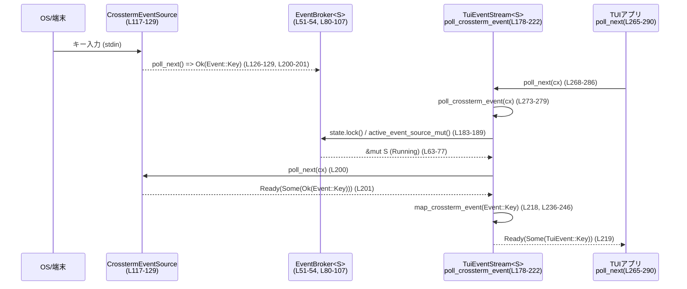

tui/src/tui/event_stream.rs

---

## 0. ざっくり一言

このモジュールは、crossterm の端末入力ストリームを共有・一元管理する `EventBroker` と、描画トリガ用ブロードキャストストリームと端末入力をまとめて `TuiEvent` の非同期ストリームとして提供する `TuiEventStream` を定義しています（event_stream.rs:L1-18, L47-54, L132-149）。

---

## 1. このモジュールの役割

### 1.1 概要

- このモジュールは **端末入力イベントと描画トリガを統合した TUI イベントストリーム** を提供します。
- crossterm の `EventStream` は stdin を継続的に読み続ける実装になっているため、外部ツール（vim など）に端末を渡す際に **stdin を完全に手放すための pause/resume 機構** を `EventBroker` で実現しています（L10-16, L47-61, L80-107）。
- `EventSource` トレイトを介して入力ソースを抽象化し、本番では `CrosstermEventSource`、テストでは `FakeEventSource` を使い分けられるようにしています（L41-45, L117-129, L309-353）。

### 1.2 アーキテクチャ内での位置づけ

主なコンポーネントと依存関係は次のとおりです。

```mermaid
graph TD
  App["TUIアプリ (TuiEventStreamをpoll)<br/>event_stream.rs 利用側"]
  TES["TuiEventStream<S><br/>(L139-171, L265-290)"]
  Broker["EventBroker<S><br/>(L51-54, L80-115)"]
  State["EventBrokerState<S><br/>(L57-61, L63-77)"]
  SourceTrait["EventSource トレイト<br/>(L41-45)"]
  CTSource["CrosstermEventSource<br/>(L117-129)"]
  DrawStream["BroadcastStream<()> / draw_stream<br/>(L141, L225-233)"]
  ResumeWatch["watch::Sender<()> / WatchStream<()><br/>(L52-53, L142, L159-160)"]
  Terminal["端末(stdin)/OSイベント<br/>crossterm::event::EventStream"]

  App -->|poll_next()| TES
  TES -->|poll_crossterm_event()| Broker
  Broker -->|state: Mutex<EventBrokerState>| State
  State -->|Running(S)| CTSource
  CTSource -->|impl EventSource| SourceTrait
  Terminal --> CTSource
  TES -->|poll_draw_event()| DrawStream
  TES -->|待機| ResumeWatch
  Broker -->|resume_events() で通知| ResumeWatch
```

- `TuiEventStream` は `Stream<Item = TuiEvent>` を実装し（L265-290）、内部で
  - crossterm 入力 (`poll_crossterm_event`, L178-222)
  - 描画トリガ (`poll_draw_event`, L225-233)
  をラウンドロビンでポーリングします。
- `EventBroker` は `EventSource` 実装（crossterm など）を一元管理し、pause/resume で EventStream を drop / 再生成する状態遷移を持ちます（L57-77, L80-107）。

### 1.3 設計上のポイント

- **イベントソースの抽象化**  
  - `EventSource` トレイトで poll ベースのインターフェイスを定義（L41-45）。  
  - `Send + 'static` 制約により、非同期ランタイム上で安全に扱えることを保証します（並行性の前提）。

- **共有 EventStream と pause/resume**  
  - `EventBrokerState` による状態管理: `Paused` / `Start` / `Running(S)`（L57-61）。  
  - `active_event_source_mut` で必要に応じて `S::default()` から新しいソースを生成（L63-77）。

- **stdin の完全解放**  
  - `pause_events` により `Running(S)` を `Paused` に変更し、`S` を drop することで crossterm の内部スレッドが stdin を読むのを止める設計です（L89-96 とモジュールコメント L10-16）。

- **非同期・並行性**  
  - `EventBroker.state` に `Mutex` を使い、同時アクセスから EventSource の状態を守ります（L51-53）。  
  - `resume_events` で `watch::Sender<()>` に通知し、`WatchStream` 経由で `TuiEventStream` を wake します（L98-107, L142, L159-160, L193-197, L209-213）。  
  - `terminal_focused` や `alt_screen_active` は `Arc<AtomicBool>` で共有し、`Ordering::Relaxed` で単純な状態フラグとして使っています（L143-148, L250-256）。

- **イベント統合と公平性**  
  - `poll_next` 内で `poll_draw_first` フラグをトグルし、描画イベントと入力イベントのどちらも飢餓しないようにしています（L268-286, コメント L269-271）。

- **テスト容易性**  
  - `FakeEventSource` + `EventBroker<FakeEventSource>` により、実際の stdin を使わずにシナリオごとの挙動を検証しています（L309-353, L372-388, L391-509）。

---

## 2. 主要な機能一覧

- イベントソースの抽象化 (`EventSource` トレイト): poll ベースで端末イベントを供給（L41-45）。
- 共有 EventStream 管理 (`EventBroker`): crossterm の EventStream を 1 つに集約し、pause/resume で drop / 再生成（L51-54, L57-77, L80-107）。
- crossterm バックエンド (`CrosstermEventSource`): `crossterm::event::EventStream` を `EventSource` としてラップ（L117-129）。
- TUI イベントストリーム (`TuiEventStream`): 描画トリガと端末入力を `TuiEvent` ストリームに統合（L139-149, L151-171, L265-290）。
- フォーカス/サスペンド処理: FocusGained/Lost や SUSPEND キーを処理し、フォーカスフラグやサスペンドを制御（L236-259）。
- テスト用フェイクソース (`FakeEventSource` + Handle): 任意の EventResult を供給可能なテスト専用のイベントソース（L309-347）。

---

## 3. 公開 API と詳細解説

### 3.1 型一覧（構造体・列挙体など）

> 行番号は、このファイルの先頭から 1 ベースで数えたものです（実リポジトリの行番号と完全一致するとは限りません）。

| 名前 | 種別 | 公開 | 役割 / 用途 | 定義位置 |
|------|------|------|------------|----------|
| `EventResult` | 型エイリアス | `pub` | イベントソースが返す `std::io::Result<Event>`。I/O エラーと `crossterm::event::Event` を表現（L38-39）。 | event_stream.rs:L38-39 |
| `EventSource` | トレイト | `pub` | 端末イベントを生成する抽象インターフェイス。`poll_next` で非同期にイベントを供給（L41-45）。 | L41-45 |
| `EventBroker<S>` | 構造体 | `pub` | 共有 EventSource（通常は crossterm）を管理し、pause/resume で drop/再生成するブローカ（L51-54）。 | L51-54 |
| `EventBrokerState<S>` | 列挙体 | private | `EventBroker` 内の状態機械。`Paused`/`Start`/`Running(S)` を保持（L57-61）。 | L57-61 |
| `CrosstermEventSource` | 構造体 | `pub` | 実際の `crossterm::event::EventStream` を保持する EventSource 実装（L117-118）。 | L117-118 |
| `TuiEventStream<S>` | 構造体 | `pub` | 描画と端末入力を統合した `Stream<Item = TuiEvent>` 実装。ジェネリックな EventSource を利用（L139-149, L151-171, L265-290）。 | L139-149, L151-171 |
| `FakeEventSource` | 構造体 | test-only | テスト用 EventSource 実装。`mpsc::UnboundedReceiver<EventResult>` からイベントを受信（L309-313）。 | L309-313 |
| `FakeEventSourceHandle` | 構造体 | test-only | テスト用に `EventBroker<FakeEventSource>` 内部にイベントを注入するためのハンドル（L315-317, L332-347）。 | L315-317 |

---

### 3.2 関数詳細（7件）

#### 1. `EventBrokerState::active_event_source_mut(&mut self) -> Option<&mut S>`

**概要**

- `EventBrokerState` の現在の状態に応じて、稼働中のイベントソースへの可変参照を返します（L63-77）。
- 状態が `Paused` なら `None` を返し、`Start` の場合は `S::default()` で新しいソースを生成して `Running` に遷移します。

**引数**

| 引数名 | 型 | 説明 |
|--------|----|------|
| `&mut self` | `&mut EventBrokerState<S>` | 内部状態を更新するための可変参照 |

**戻り値**

- `Option<&mut S>`:  
  - `Some(&mut S)` … 稼働中 (`Running`) のイベントソース。  
  - `None` … 一時停止中 (`Paused`) で、イベントソースが存在しない。

**内部処理の流れ**

1. `match self` で現在の状態を分岐（L66）。
2. `Paused` の場合は何もせず `None` を返す（L67）。
3. `Start` の場合:
   - `*self = EventBrokerState::Running(S::default())` で新しいソースを生成（L69）。
   - その直後に再度 `match self` し、`Running(events)` から `Some(events)` を返す（L70-73）。
4. `Running(events)` の場合は、そのまま `Some(events)` を返す（L75）。

**Examples（使用例）**

この関数はモジュール内部からのみ呼ばれ、典型的には `TuiEventStream::poll_crossterm_event` で利用されています（L188-199）。

```rust
// poll_crossterm_event 内での利用例（簡略化, L183-191）
let mut state = self.broker.state.lock()
    .unwrap_or_else(std::sync::PoisonError::into_inner);
let events = match state.active_event_source_mut() {
    Some(events) => events,      // Running または Start -> Running に遷移
    None => {                    // Paused
        drop(state);
        // resume_events の通知を待つ処理へ
    }
};
```

**Errors / Panics**

- 自身はエラーもパニックも発生させません。
- 呼び出し側で `Mutex` 取得に失敗した場合でも、`unwrap_or_else(PoisonError::into_inner)` によりパニックせず中身を取り出す設計です（L91-94, L100-103）。

**Edge cases（エッジケース）**

- 状態が `Start` のときに `S::default()` での生成が高コストな場合、最初の poll 時にコストが集中します。
- `S::default()` がパニックを起こす場合の挙動は、このコードからは分かりません（トレイト境界からは読み取れないため）。

**使用上の注意点**

- `S` は `Default` 実装を持つ必要があります（L63）。`Default` 実装内で重い I/O やブロッキング処理を行うと、初回のイベント取得が遅くなります。
- 呼び出しは `Mutex` ロック中に行われることが多いため、`S::default()` でブロックすると他スレッドからの pause/resume もブロックされる点に注意が必要です。

---

#### 2. `EventBroker::pause_events(&self)`

**概要**

- 現在稼働中のイベントソース（例: crossterm の `EventStream`）を drop し、状態を `Paused` にすることで **stdin の読み取りを完全に停止** します（L89-96）。
- これは外部プログラムにターミナルを譲るときなどに使われます（モジュールコメント L10-16）。

**引数**

| 引数名 | 型 | 説明 |
|--------|----|------|
| `&self` | `&EventBroker<S>` | 共有ブローカへの参照。`S` は EventSource 実装 |

**戻り値**

- なし。

**内部処理の流れ**

1. `self.state.lock()` で内部の `Mutex<EventBrokerState<S>>` をロック（L91-93）。
2. `unwrap_or_else(PoisonError::into_inner)` で、もし以前のパニックによりロックがポイズンされていても中身を取り出す（L93-94）。
3. `*state = EventBrokerState::Paused;` と代入することで、以前の `Running(S)` が drop され、イベントソースが破棄されます（L95）。

**Examples（使用例）**

テスト `resume_wakes_paused_stream` 内で、イベントストリームの一時停止に利用されています（L465-471）。

```rust
let (broker, handle, _draw_tx, draw_rx, terminal_focused) = setup();
let mut stream = make_stream(broker.clone(), draw_rx, terminal_focused);

broker.pause_events(); // ここで EventSource が drop され stdin を解放（L470）
```

アプリケーション側の典型的な利用イメージ:

```rust
// 外部コマンド実行前に TUI の入力を止める
broker.pause_events();
// 外部エディタなどを起動
std::process::Command::new("vim").status()?;
// 終了後に再開
broker.resume_events();
```

**Errors / Panics**

- `Mutex::lock` がポイズンされていても `unwrap_or_else` で中身を取り出すため、ここではパニックしません（L91-94）。
- その他のパニック条件はありません。

**Edge cases**

- すでに `Paused` の状態で呼び出した場合も、単に `Paused` を再代入するだけで副作用はほぼありません（古い `Running(S)` は存在しないため drop されません）。
- `poll_crossterm_event` が `Running` 状態で `poll_next` した直後に `pause_events` される場合:  
  - `poll_crossterm_event` 内では `Poll::Pending` のときに `state` のロックを解放してから `resume_stream` をポーリングしているため（L200-213）、`pause_events` は次のポーリングタイミングで安全に `Running(S)` を `Paused` に切り替え、`S` を drop します。

**使用上の注意点**

- この関数自体はタスクを wake しません。`pause_events` のあとに `poll_crossterm_event` を待っているタスクは、そのまま `Pending` のままで、「再開」するときに `resume_events` で通知する想定です（L98-106, L193-197, L209-213）。
- 複数の TUI 画面で `EventBroker` を共有している場合でも、`pause_events` は共有ソース全体に影響します。どれか一つでも外部プロセスにターミナルを渡すときは、他の画面も入力が止まることになります。

---

#### 3. `EventBroker::resume_events(&self)`

**概要**

- `Paused` 状態から `Start` 状態へ遷移させ、新しい EventSource を次の poll 時に作成できるようにします（L98-105）。
- さらに、`watch::Sender<()>` に通知して、`WatchStream` 経由で `poll_crossterm_event` を wake します（L105, L193-197, L209-213）。

**引数**

| 引数名 | 型 | 説明 |
|--------|----|------|
| `&self` | `&EventBroker<S>` | 再開対象のブローカ |

**戻り値**

- なし。

**内部処理の流れ**

1. `self.state.lock()` でロックを取得し（L100-103）、`unwrap_or_else` でポイズンにも対応（L103）。
2. `*state = EventBrokerState::Start;` として、次の `active_event_source_mut` 呼び出しで `S::default()` による新しいソース生成が行われるようにする（L104）。
3. `let _ = self.resume_events_tx.send(());` により、全ての watcher に `()` を送信する（L105）。  
   - `WatchStream::from_changes` で作られた `resume_stream` は、これにより wake されます（L159-160, L193-197, L209-213）。

**Examples（使用例）**

テスト `resume_wakes_paused_stream` で、一時停止中のストリームを再開させる用途で使用されています（L465-487）。

```rust
broker.pause_events();      // 入力停止（L470）
let task = tokio::spawn(async move { stream.next().await });
// ...
broker.resume_events();     // 再開通知（L475）
// この後 handle.send(Ok(Event::Key(...))) でイベントを流し、タスクが wake される
```

**Errors / Panics**

- `watch::Sender::send(())` の戻り値は無視されています（L105）。  
  - 受信者がいない場合などでエラーとなっても無害なためです。
- `Mutex` のロックに関するパニックは `unwrap_or_else` で避けています（L100-103）。

**Edge cases**

- まだ一度も EventSource が生成されていない状態 (`Start`) で `resume_events` を呼んでも、単に `Start` を再代入して通知するだけです。
- すでに `Running` のときに `resume_events` を呼ぶと、`Running(S)` が `Start` に上書きされ、次の `active_event_source_mut` 呼び出し時に古い `S` が drop され、新しい `S::default()` が生成されます（L69-75, L104）。  
  → 「再起動」に近い動作になります。

**使用上の注意点**

- `resume_events` は `pause_events` とセットで使うことが前提です。  
  独立に呼ぶと EventSource が再生成されるため、既存の入力ストリームが中断される可能性があります。
- 多数の `TuiEventStream` インスタンスが `resume_stream` を共有している場合、1 回の `resume_events` 呼び出しで全てが wake されます（L142, L159-160）。

---

#### 4. `TuiEventStream::poll_crossterm_event(&mut self, cx: &mut Context<'_>) -> Poll<Option<TuiEvent>>`

**概要**

- 共有された EventSource（通常 crossterm）のストリームから次のイベントを取得し、`TuiEvent` にマッピングして返すメインの入力処理です（L178-222）。
- マッピング対象外のイベント（FocusLost, マウス等）は内部でスキップし、`Pending` か EOF/エラーになるまでループします（L179-181, L236-259）。

**引数**

| 引数名 | 型 | 説明 |
|--------|----|------|
| `&mut self` | `&mut TuiEventStream<S>` | 入力ストリームインスタンス |
| `cx` | `&mut Context<'_>` | 非同期ランタイムから渡される waker などを含むコンテキスト |

**戻り値**

- `Poll<Option<TuiEvent>>`  
  - `Poll::Ready(Some(TuiEvent))` … マッピングされた TUI イベント。  
  - `Poll::Ready(None)` … EventSource が EOF またはエラーで終了したため、このストリームも終了。  
  - `Poll::Pending` … 今は使用可能なイベントがなく、後で wake されるまで待機。

**内部処理の流れ**

1. 外側の `loop` で、マッピング結果が `Some(TuiEvent)` になるまで繰り返します（L181, L218-220）。
2. `self.broker.state.lock()` で `EventBrokerState` をロックし、`active_event_source_mut()` から現在の EventSource への可変参照を取得（L183-189）。
   - `None`（Paused）の場合:
     1. ロックを解放（`drop(state)`, L191）。
     2. `resume_stream` を `poll_next` し、`resume_events()` による通知を待機（L193-197）。
        - `Some(())` … 再開通知を受け取り、ループ先頭へ `continue`（L194）。
        - `None` … `WatchStream` が終了したため、`Poll::Ready(None)` を返してストリームを終了（L195）。
        - `Pending` … `Poll::Pending` を返す（L196）。
   - `Some(events)` の場合:
     1. `Pin::new(events).poll_next(cx)` で EventSource をポーリング（L200）。
3. EventSource の `poll_next` 結果で分岐（L200-205, L206-213）。
   - `Ready(Some(Ok(event)))`:
     - `Some(event)` を `poll_result` に格納し、ロックを保持したままブロックを抜ける（L201）。
   - `Ready(Some(Err(_)))` または `Ready(None)`:
     - `*state = EventBrokerState::Start;` として次回以降の再生成を準備（L203）。
     - `Poll::Ready(None)` を返し、`TuiEventStream` 自体を終了（L204）。
   - `Pending`:
     1. ロックを解放（`drop(state)`, L207）。
     2. `resume_stream` をポーリングして再開通知を待つ（L209-213）。
        - `Some(())` … ループ先頭に戻って再試行（L210）。
        - `None` … `Poll::Ready(None)` を返す（L211）。
        - `Pending` … `Poll::Pending` を返す（L212）。
4. `poll_result` に `Some(event)` が入っている場合、`map_crossterm_event(event)` で `TuiEvent` へマッピング（L218）。
   - マッピング結果が `Some(mapped)` なら `Poll::Ready(Some(mapped))` を返す（L218-219）。
   - `None`（例えば FocusLost）ならループを継続し、次のイベントを取りにいく（L218-221）。

**Examples（使用例）**

通常、この関数を直接呼び出すことはなく、`Stream` 実装 (`poll_next`) 経由で間接的に利用します（L268-279）。

```rust
impl<S: EventSource + Default + Unpin> Stream for TuiEventStream<S> {
    type Item = TuiEvent;

    fn poll_next(mut self: Pin<&mut Self>, cx: &mut Context<'_>) -> Poll<Option<Self::Item>> {
        // poll_draw_event と poll_crossterm_event をラウンドロビンで呼ぶ（L273-286）
        if let Poll::Ready(event) = self.poll_crossterm_event(cx) {
            return Poll::Ready(event);
        }
        // ...
        Poll::Pending
    }
}
```

アプリケーション側では `tokio_stream::StreamExt::next()` などで `TuiEventStream` を利用します。

```rust
use tokio_stream::StreamExt;

while let Some(ev) = tui_event_stream.next().await {
    match ev {
        TuiEvent::Draw => { /* 再描画 */ }
        TuiEvent::Key(key) => { /* キー入力処理 */ }
        TuiEvent::Paste(p) => { /* ペースト処理 */ }
    }
}
```

**Errors / Panics**

- EventSource が `Err(_)` を返した場合:
  - `state` を `Start` に戻したうえで `Poll::Ready(None)` を返し、ストリームを終了します（L201-205）。  
  - エラーの詳細はログやユーザには伝搬せず、単に EOF として扱われます。
- `Mutex` ロック失敗のパニックは `unwrap_or_else` で避けられています（L183-187）。
- `resume_stream.poll_next` からのエラーはなく、EOF (`Ready(None)`) の場合はストリーム終了として扱われます（L193-197, L209-213）。

**Edge cases**

- `Event::FocusLost` やマウスイベントなど `map_crossterm_event` が `None` を返すイベントが連続した場合、内部ループが複数回回りますが、いずれも 1 回の `poll_next` 呼び出し内で完結するため、`Pending` には戻りません（L236-259, L218-221）。
- `EventSource` が一度 `None`（EOF）を返すと、その `TuiEventStream` インスタンスはそれ以降イベントを出さずに終了します（L202-205）。  
  `EventBrokerState` は `Start` に戻されるので、新しい `TuiEventStream` を作れば再度イベントを受けられます（L63-77）。

**使用上の注意点**

- 直接呼ぶのではなく `Stream` として使用するのが前提です。`poll_crossterm_event` を単独で呼ぶと、描画イベントや公平性が考慮されません。
- `EventSource` 実装は「非ブロッキングな poll」を想定しています。`poll_next` 内で長時間ブロックする実装は、`Mutex` ロック保持時間を引き延ばし、`pause_events`/`resume_events` の応答性を悪化させます。
- エラー内容が捨てられる設計のため、「なぜ入力が止まったか」をユーザーに伝える必要がある場合は、上位レイヤーで別途ログなどを追加する必要があります。

---

#### 5. `TuiEventStream::poll_draw_event(&mut self, cx: &mut Context<'_>) -> Poll<Option<TuiEvent>>`

**概要**

- `BroadcastStream<()>` から受信した描画トリガを `TuiEvent::Draw` に変換する補助関数です（L224-233）。
- ブロードキャストの「ラグ」（`Lagged` エラー）が発生しても、とりあえず 1 回 `Draw` イベントを発生させます（L227-230）。

**引数**

| 引数名 | 型 | 説明 |
|--------|----|------|
| `&mut self` | `&mut TuiEventStream<S>` | 対象ストリーム |
| `cx` | `&mut Context<'_>` | poll 用コンテキスト |

**戻り値**

- `Poll<Option<TuiEvent>>`  
  - `Ready(Some(TuiEvent::Draw))` … 正常な描画トリガ、または `Lagged` による遅延補償。  
  - `Ready(None)` … 描画ストリームが終了。  
  - `Pending` … 今は描画トリガがない。

**内部処理の流れ**

1. `Pin::new(&mut self.draw_stream).poll_next(cx)` で `BroadcastStream<()>` をポーリング（L226）。
2. マッチング結果（L226-233）:
   - `Ready(Some(Ok(())))` → `TuiEvent::Draw` に変換し `Ready(Some(...))` を返す（L227）。
   - `Ready(Some(Err(Lagged(_))))` → 取りこぼしたが再描画さえすればよいので `TuiEvent::Draw` を返す（L228-230）。
   - `Ready(None)` → ブロードキャスト送信側が全て終了したため `Ready(None)`（L231）。
   - `Pending` → `Poll::Pending`（L232）。

**Examples（使用例）**

`Stream` 実装内で直接呼ばれています（L273-276, L284-285）。

```rust
if let Poll::Ready(event) = self.poll_draw_event(cx) {
    return Poll::Ready(event); // Draw or None
}
```

**Errors / Panics**

- `BroadcastStreamRecvError::Lagged(_)` を受け取った場合もパニックせず `TuiEvent::Draw` として処理します（L227-230）。
- その他のエラーケースは `BroadcastStream` の型上存在しません。

**Edge cases**

- `Lagged` が頻発する（受信側が遅い）場合でも、最終的には「とにかく Draw 1 回」で追いつこうとする挙動になります。  
  → 描画の中間フレームは失われますが、最終状態は描画されます（テスト `lagged_draw_maps_to_draw`, L441-451）。

**使用上の注意点**

- `Draw` イベントは状態の「スナップショット描画」を意図しているため、途中を落としても問題ない前提で設計されています。  
  もし「全ての描画イベントを正確に処理する」必要がある場合は、この簡略化された扱いは要件に適合しない可能性があります。

---

#### 6. `TuiEventStream::map_crossterm_event(&mut self, event: Event) -> Option<TuiEvent>`

**概要**

- `crossterm::event::Event` をアプリ固有の `TuiEvent` に変換し、不要なイベント（マウス、FocusLost など）をスキップするマッピング関数です（L236-259）。
- フォーカス状態の更新や Unix におけるサスペンドキー処理など、**副作用** もここに集約されています（L239-256）。

**引数**

| 引数名 | 型 | 説明 |
|--------|----|------|
| `&mut self` | `&mut TuiEventStream<S>` | ストリーム本体（フォーカスフラグや suspend_context にアクセス） |
| `event` | `crossterm::event::Event` | 生の crossterm イベント |

**戻り値**

- `Option<TuiEvent>`  
  - `Some(TuiEvent::...)` … アプリ側で扱うべきイベント。  
  - `None` … 無視するイベント（FocusLost、マウスなど）。

**内部処理の流れ**

1. `match event` でイベントの種類ごとに分岐（L238-259）。

2. `Event::Key(key_event)`（キー入力）の場合（L239-246）:
   - Unix のみ:
     - `SUSPEND_KEY.is_press(key_event)` でサスペンド用キーバインドかを判定（L241）。  
       （具体的なキーはこのファイルからは不明。`job_control` に定義。）
     - サスペンドキーなら `self.suspend_context.suspend(&self.alt_screen_active)` を呼び出し、戻り値は無視（L242）。  
       その後 `TuiEvent::Draw` を返して再描画を促す（L243）。
   - その他のキーはそのまま `TuiEvent::Key(key_event)` として返す（L245）。

3. `Event::Resize(_, _)`（端末サイズ変更）:
   - `TuiEvent::Draw` を返し、レイアウト再計算と再描画を促す（L247）。

4. `Event::Paste(pasted)`:
   - `TuiEvent::Paste(pasted)` として返す（L248）。

5. `Event::FocusGained`:
   - `terminal_focused.store(true, Ordering::Relaxed)` でフォーカスフラグをセット（L250）。
   - `crate::terminal_palette::requery_default_colors()` を呼び出し、フォーカス取得時に端末のデフォルト色を再取得（L251）。
   - `TuiEvent::Draw` を返す（L252）。

6. `Event::FocusLost`:
   - `terminal_focused.store(false, Ordering::Relaxed)` で非フォーカス化（L255）。
   - イベントとしては `None` を返し、アプリには通知しない（L256）。

7. その他（マウスイベントなど）:
   - `None` を返して無視（L258-259）。

**Examples（使用例）**

`poll_crossterm_event` 内で、EventSource から受け取ったイベントをマップするために使用されています（L218-219）。

```rust
if let Some(mapped) = poll_result.and_then(|event| self.map_crossterm_event(event)) {
    return Poll::Ready(Some(mapped)); // Some(TuiEvent) の場合のみ return（L218-219）
}
```

**Errors / Panics**

- この関数自体はエラーを返さず、パニックも記述されていません。
- Unix での `suspend_context.suspend` の戻り値は無視されており、失敗してもここではエラー扱いしません（L242）。

**Edge cases**

- `FocusLost` は内部状態更新のみで TuiEvent を発生させないため、「フォーカスを失った」というイベントを明示的に扱いたい場合には、上位で `terminal_focused` を監視する必要があります（L255-256）。
- マウスイベントなどその他のイベントは全て無視されるため、マウス操作に反応したい場合は `map_crossterm_event` に分岐を追加する必要があります（L258-259）。

**使用上の注意点**

- 「どのイベントをアプリケーションとして扱うか」のポリシーはここに固まっているため、新しい入力種別のサポートや変更はこの関数で行うのが自然です。
- フォーカス状態と色再取得の副作用も含まれているため、テスト時に `terminal_focused` や `terminal_palette` の副作用を考慮する必要があります（L250-252）。

---

#### 7. `impl<S> Stream for TuiEventStream<S> { fn poll_next(...) }`

```rust
fn poll_next(mut self: Pin<&mut Self>, cx: &mut Context<'_>) -> Poll<Option<Self::Item>>
```

**概要**

- `TuiEventStream` を `tokio_stream::Stream` として動作させるエントリポイントです（L265-290）。
- 描画イベントと crossterm 入力の両方をラウンドロビンでポーリングし、どちらか一方に偏らないように簡単な公平性を提供します（コメント L269-271）。

**引数**

| 引数名 | 型 | 説明 |
|--------|----|------|
| `self` | `Pin<&mut TuiEventStream<S>>` | ストリーム本体（Unpin によって Pin 可能, L263） |
| `cx` | `&mut Context<'_>` | 非同期ランタイムのコンテキスト |

**戻り値**

- `Poll<Option<TuiEvent>>`  
  - `Ready(Some(TuiEvent))` … 描画または入力イベント。  
  - `Ready(None)` … 描画ストリームまたは EventSource が終了し、ストリーム全体が完了。  
  - `Pending` … どちらのソースにも現時点でイベントなし。

**内部処理の流れ**

1. `let draw_first = self.poll_draw_first;` で前回の状態を読み出し、`self.poll_draw_first = !self.poll_draw_first;` で反転する（L269-271）。  
   - これにより、呼び出しごとに「先に描画を poll するか、入力を poll するか」が切り替わります。

2. `if draw_first { ... } else { ... }` でポーリング順序を切り替え（L273-286）。

   - `draw_first == true` の場合（L273-279）:
     1. `poll_draw_event(cx)` を呼び、`Poll::Ready(event)` ならそのまま返す（L273-276）。
     2. そうでなければ `poll_crossterm_event(cx)` を呼び、`Ready` なら返す（L277-278）。

   - `draw_first == false` の場合（L280-286）:
     1. `poll_crossterm_event(cx)` を先に呼ぶ（L281-282）。
     2. 次に `poll_draw_event(cx)` を呼ぶ（L284-285）。

3. 両方とも `Pending` なら最後に `Poll::Pending` を返す（L289）。

**Examples（使用例）**

アプリケーション側からは `Stream` として利用されます。例:

```rust
use tokio_stream::StreamExt;

let mut stream = TuiEventStream::new(/* ... */);

while let Some(event) = stream.next().await {
    match event {
        TuiEvent::Draw => { /* 再描画 */ }
        TuiEvent::Key(key) => { /* キー処理 */ }
        _ => {}
    }
}
```

**Errors / Panics**

- `poll_draw_event` / `poll_crossterm_event` の戻り値をそのまま返しているだけで、この関数自身が追加のエラーやパニックを導入してはいません（L273-286）。

**Edge cases**

- 片方のソース（例: draw）が恒常的に `Ready(Some(...))` を返し続ける場合:
  - 呼び出しごとに順序を入れ替えているため、もう一方も定期的に poll されます（L269-286）。  
  - ただし、いずれかが常に即座に `Ready` を返す状況では、本当の意味で完全な公平性が保証されるわけではなく、「近似的な」公平性です（コメント L269-271）。

**使用上の注意点**

- `TuiEventStream` は `Unpin` を明示的に実装しているため（L263）、`Box::pin` などを使わなくても `stream.next().await` が利用できます。
- 複数の `TuiEventStream` インスタンスを同時に poll すると、モジュールコメントが指摘する通り「イベントの取り合い」が発生しうるため、基本的には **同時に poll されるインスタンスは 1 つに限る** 前提です（L132-138）。

---

### 3.3 その他の関数・メソッド一覧

> 主に補助的な初期化やテスト用関数です。

| 関数名 / メソッド | 所属 | 公開 | 役割（1 行） | 定義位置 |
|-------------------|------|------|--------------|----------|
| `EventSource::poll_next` | トレイトメソッド | - | 任意の EventSource 実装が提供すべき poll ベースのインターフェイス（L43-44）。 | L43-44 |
| `EventBroker::new()` | `EventBroker` | `pub` | `state=Start` かつ `watch::channel(())` で初期化（L80-87）。 | L80-87 |
| `EventBroker::resume_events_rx()` | `EventBroker` | `pub` | `watch::Receiver<()>` を返し、`resume_events` 通知を購読（L108-114）。 | L108-114 |
| `CrosstermEventSource::default()` | `Default` impl | - | `crossterm::event::EventStream::new()` で EventSource を生成（L120-123）。 | L120-123 |
| `CrosstermEventSource::poll_next` | `EventSource` impl | - | 内部の `EventStream` の `poll_next` を委譲（L126-129）。 | L126-129 |
| `TuiEventStream::new(...)` | `TuiEventStream` | `pub` | `BroadcastStream` と `WatchStream` をセットアップし、ストリームを構築（L151-171）。 | L151-171 |
| `FakeEventSource::new()` | test | - | `mpsc::unbounded_channel` を用いたフェイクイベントソースを作成（L319-323）。 | L319-323 |
| `Default for FakeEventSource` | test | - | `FakeEventSource::new` を呼び出す `Default` 実装（L326-329）。 | L326-329 |
| `FakeEventSourceHandle::new()` | test | - | テスト用のハンドルを生成（L332-335）。 | L332-335 |
| `FakeEventSourceHandle::send()` | test | - | `EventBroker` 内部の `FakeEventSource` に EventResult を注入（L337-347）。 | L337-347 |
| `FakeEventSource::poll_next` | test | - | `mpsc::UnboundedReceiver` の `poll_recv` に委譲（L350-353）。 | L350-353 |
| `make_stream(...)` | test | - | テスト用に `TuiEventStream<FakeEventSource>` を構築（L356-370）。 | L356-370 |
| `setup()` | test | - | `EventBroker<FakeEventSource>` と draw チャネルなどをまとめて準備（L380-388）。 | L380-388 |
| 各種 `#[tokio::test]` | test | - | マッピング・公平性・エラー/EOF・pause/resume の挙動を検証（L391-509）。 | L391-509 |

---

## 4. データフロー

ここでは、**ユーザーのキー入力が TuiEvent としてアプリに届く** 典型的な流れを説明します。

### 処理の要点（キーイベント）

1. OS からのキー入力が crossterm の `EventStream` 経由で `CrosstermEventSource` に届きます（L117-129）。
2. `TuiEventStream::poll_next` が `poll_crossterm_event` を呼び、`EventBroker` 経由で EventSource をポーリングします（L265-279, L178-222）。
3. `poll_crossterm_event` は `EventSource::poll_next` から `Event::Key` を受け取り、`map_crossterm_event` で `TuiEvent::Key` に変換します（L200-205, L236-246）。
4. 変換された `TuiEvent::Key` がストリームアイテムとしてアプリ側に渡されます（L218-219）。

### Mermaid シーケンス図



### 描画イベントの流れ（概要）

1. 別のコンポーネントが `broadcast::Sender<()>` に対して `send(())` し、描画トリガを送出します（利用側コード、テスト参照 L413-418）。
2. `TuiEventStream` 内の `BroadcastStream<()>` がそれを受信し、`poll_draw_event` によって `TuiEvent::Draw` に変換されます（L225-230）。
3. `poll_next` が `TuiEvent::Draw` を返し、アプリ側で再描画処理が行われます（L273-276, L284-285）。

---

## 5. 使い方（How to Use）

### 5.1 基本的な使用方法

ここでは、本番用 EventSource（`CrosstermEventSource`）を使って `TuiEventStream` を構築し、`StreamExt::next` でイベントを処理する例を示します。

```rust
use std::sync::Arc;
use std::sync::atomic::AtomicBool;
use tokio::sync::broadcast;
use tokio_stream::StreamExt;

use crate::tui::event_stream::{EventBroker, TuiEventStream, CrosstermEventSource};
use crate::tui::TuiEvent;

#[tokio::main(flavor = "current_thread")]
async fn main() -> std::io::Result<()> {
    // 共有 EventBroker を作成（CrosstermEventSource がデフォルトの S）（L80-87, L117-123）
    let broker: Arc<EventBroker<CrosstermEventSource>> = Arc::new(EventBroker::new());

    // 描画トリガ用の broadcast チャネルを作成（送信側は別タスクなどから使用）
    let (draw_tx, draw_rx) = broadcast::channel::<()>(16);

    // フォーカス状態フラグを共有（L143）
    let terminal_focused = Arc::new(AtomicBool::new(true));

    #[cfg(unix)]
    let suspend_context = crate::tui::job_control::SuspendContext::new();
    #[cfg(unix)]
    let alt_screen_active = Arc::new(AtomicBool::new(false));

    // TuiEventStream を生成（L151-171）
    let mut stream = TuiEventStream::new(
        broker.clone(),
        draw_rx,
        terminal_focused.clone(),
        #[cfg(unix)]
        suspend_context,
        #[cfg(unix)]
        alt_screen_active.clone(),
    );

    // メインイベントループ: TuiEvent を順に処理
    while let Some(event) = stream.next().await {
        match event {
            TuiEvent::Draw => {
                // アプリ状態に基づいて UI を再描画
            }
            TuiEvent::Key(key) => {
                // キー入力処理
                // 必要に応じて draw_tx.send(()) で再描画をトリガ
                if key.code == crossterm::event::KeyCode::Char('q') {
                    break;
                }
            }
            TuiEvent::Paste(pasted) => {
                // ペーストされた文字列の処理
                println!("pasted: {pasted}");
            }
        }
    }

    Ok(())
}
```

### 5.2 よくある使用パターン

1. **外部プログラム実行のための pause/resume**

```rust
// TUI イベントループ内など
broker.pause_events(); // stdin を TUI から切り離す（L89-96）

// 外部プログラムを実行
let status = std::process::Command::new("vim").status()?;

// 戻ってきたらイベントソースを再構築し、ストリームを再開（L98-107）
broker.resume_events();
```

- これにより、crossterm の EventStream が drop され、外部プログラムが stdin を独占できるようになります（モジュールコメント L10-16）。

1. **複数画面（ネストした TUI）の切り替え**

- 各画面ごとに `TuiEventStream` を生成しつつ、`EventBroker` と `draw_tx` は共有する設計が想定されます（L132-138）。
- ただし、「同時に poll する `TuiEventStream` は 1 つに限る」ことがドキュメントに明記されている点に注意が必要です（L137-138）。

### 5.3 よくある間違い

```rust
// 間違い例: 画面Aと画面Bで別々の EventBroker を作ってしまう
let broker_a = Arc::new(EventBroker::new());
let broker_b = Arc::new(EventBroker::new());
// それぞれが自前に CrosstermEventSource を作るため、stdin 読み取りレースが発生しうる
```

```rust
// 正しい例: 共通の EventBroker を共有し、EventSource は一つに保つ（L47-54）
let broker = Arc::new(EventBroker::new());
let stream_a = TuiEventStream::new(broker.clone(), draw_rx_a, terminal_focused.clone(), /* ... */);
let stream_b = TuiEventStream::new(broker.clone(), draw_rx_b, terminal_focused.clone(), /* ... */);
// 実際に poll するのはどちらか一方のみ（L132-138）
```

```rust
// 間違い例: 同じ TuiEventStream を複数タスクから同時に poll
let stream = TuiEventStream::new(/*...*/);
let s1 = stream; // move 1
let s2 = stream; // コンパイルエラー: move 後に使用

// あるいは Arc<Mutex<TuiEventStream>> でラップして複数タスクから poll する等も非想定
```

- `Stream` の `poll_next` は **同時に複数回呼んではならない** という Rust の非同期の一般的な契約があり、本コードもそれを前提としています。

### 5.4 使用上の注意点（まとめ）

- **スレッド安全性**  
  - `EventBroker` は内部に `Mutex` を持つため `Send + Sync` の前提で設計されています（L51-54）。  
  - `TuiEventStream` 自体は `Stream` として単一タスクから利用される想定であり、複数タスクから同時に poll してはいけません（非同期 Stream の一般契約）。

- **エラーハンドリング**  
  - EventSource のエラーは「ストリーム終了」として扱われ、エラー内容は上位に伝えられません（L201-205, テスト L454-462）。  
  - 必要なら `EventSource` 実装側でログを仕込むか、`poll_crossterm_event` を拡張する必要があります。

- **パフォーマンス**  
  - `EventBrokerState::active_event_source_mut` や `EventBroker::pause_events` など、EventSource の生成・破棄は `Mutex` ロック中に行われるため、`S::default()` が高コストだと他スレッドからの操作をブロックします（L63-77, L80-107）。  
  - `poll_crossterm_event` はマッピング対象外のイベントをスキップするため、マウスイベントが大量に来てもアプリ側には届きませんが、その分 CPU を消費する可能性があります（L179-181, L236-259）。

- **セキュリティ / 安全性**  
  - stdin を積極的に drop して他プロセスと奪い合わない設計になっているため、他の CLI ツールとの組み合わせでの「入力の取りこぼし」を減らす意図があります（モジュールコメント L10-16）。  
  - 外部から渡される `EventSource` 実装（ジェネリック `S`）は `Send + 'static` の制約がありますが、その内部でどのような I/O や OS 資源を扱うかはこのコードからは分かりません。

---

## 6. 変更の仕方（How to Modify）

### 6.1 新しい機能を追加する場合

1. **新しい crossterm イベント種別を `TuiEvent` にマッピングしたい場合**

   - `map_crossterm_event` に対応する `match` 分岐を追加します（L236-259）。
   - 例えば、マウスクリックを扱いたい場合:

   ```rust
   match event {
       Event::Mouse(mouse_event) => {
           // 新しい TuiEvent::Mouse(mouse_event) などに変換
           Some(TuiEvent::Mouse(mouse_event))
       }
       // 既存の分岐はそのまま
       _ => { /* ... */ }
   }
   ```

   - 併せて `TuiEvent` 列挙体（このファイル外、`super::TuiEvent`）に新 Variant を追加する必要があります（L36）。

2. **別種の EventSource をサポートしたい場合**

   - `EventSource` トレイトを実装した新しい型（例: リプレイ用ログソース）を別ファイルで定義します（L41-45）。
   - 利用側では `EventBroker<YourSource>` / `TuiEventStream<YourSource>` として型引数を指定すればテストや特殊モードで差し替え可能です（テストの `FakeEventSource` 利用例 L380-388, L356-370）。

3. **「再開時に自動でストリームを再構築する」のではなく「同じストリームを再利用したい」**

   - 現在は `Err` や EOF が来た時点で `EventBrokerState::Start` に戻しつつストリームを終了しています（L200-205）。  
   - 同じストリームを再利用したい場合は、`poll_crossterm_event` の `Err`/`None` 分岐を変更し、`Poll::Pending` や専用のエラーイベントを返す必要があります。

### 6.2 既存の機能を変更する場合

- **pause/resume の挙動を変えたい**

  - `EventBroker::pause_events` と `resume_events` の実装を確認し（L89-107）、`EventBrokerState` の状態遷移（L57-77）を合わせて変更します。
  - 影響範囲:
    - `poll_crossterm_event` 内の `active_event_source_mut` 呼び出しと `Paused` ハンドリング（L188-199）。
    - `resume_stream` の wake ロジック（L193-197, L209-213）。
    - テスト `resume_wakes_paused_stream` / `resume_wakes_pending_stream`（L465-487, L489-509）。

- **エラーをアプリに伝えたい**

  - 現在は `Err(_)` を単に EOF 扱いして `None` を返しています（L201-205）。
  - これを `TuiEvent::Error(String)` などへ変換したい場合:
    - `EventResult` を `Result<Event, std::io::Error>` のまま受け、その `Err(e)` を `map_crossterm_event` に渡すか、別のエラー処理経路を設ける必要があります。
    - 仕様変更となるため、既存テスト `error_or_eof_ends_stream` の期待値（L454-462）も合わせて更新が必要です。

- **公平性ポリシーを変えたい**

  - 例えば「描画イベントを常に優先する」などのポリシーに変更したい場合、`poll_next` の `poll_draw_first` ロジックを修正します（L269-286）。
  - 変更時には、同時に draw & key イベントが来た場合の挙動をテストで確認します（テスト `draw_and_key_events_yield_both`, L412-439）。

---

## 7. 関連ファイル

| パス / シンボル | 役割 / 関係 |
|----------------|------------|
| `super::TuiEvent` | このモジュールが生成するイベント型。キー入力、描画トリガ、ペーストなどのバリアントを持つと推測されますが、定義はこのチャンクにはありません（L36, L225-233, L236-259, テスト L402-438）。 |
| `crate::tui::job_control::SuspendContext` | Unix 環境でのサスペンド処理を担当。`SUSPEND_KEY` と連携して TUI のサスペンド/復帰を行います（L145-148, L241-243, テスト L365-367）。定義はこのチャンクにはありません。 |
| `crate::tui::job_control::SUSPEND_KEY` | サスペンドのためのキーバインドを表す定数／型。`KeyEvent` に対する `is_press` メソッドを持ちます（L241）。定義はこのチャンクにはありません。 |
| `crate::terminal_palette::requery_default_colors` | フォーカス取得時に端末のデフォルトカラーを再取得する関数（L251）。色テーマの管理と関連。 |
| 他の TUI モジュール（推定） | `draw_tx: broadcast::Sender<()>` や `terminal_focused: Arc<AtomicBool>` を管理し、`TuiEventStream` と連携して UI を更新するコンポーネント。内容はこのチャンクには現れません。 |

---

以上が `tui/src/tui/event_stream.rs` の主要なコンポーネント、公開 API、データフロー、および使用上の注意点の整理です。
