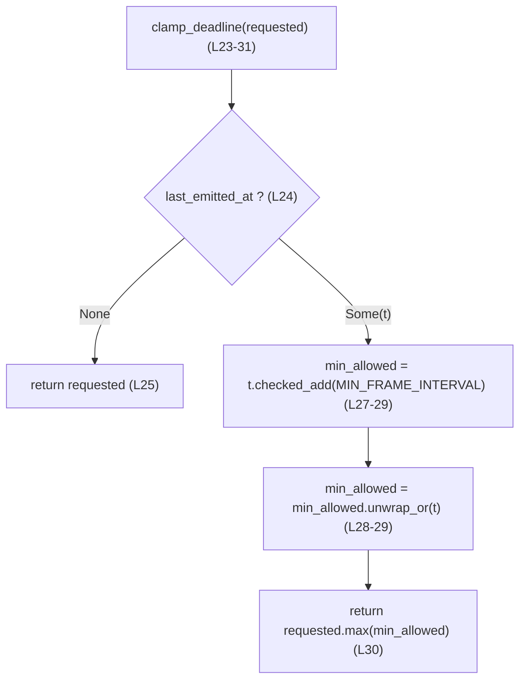
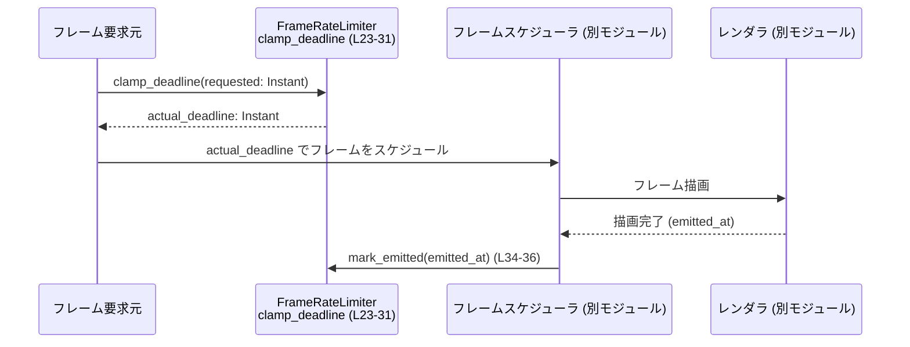

# tui/src/tui/frame_rate_limiter.rs コード解説

## 0. ざっくり一言

`tui/src/tui/frame_rate_limiter.rs` は、フレーム描画通知の頻度を 120 FPS 以下に制限するための、小さな状態付きヘルパーを提供するモジュールです（`FrameRateLimiter` 構造体と関連メソッド）。`frame_rate_limiter.rs:L1-7`

---

## 1. このモジュールの役割

### 1.1 概要

- ウィジェットが `FrameRequester::schedule_frame()` をユーザーが知覚できる以上の頻度で呼び出しても、実際に描画を行う頻度を **最大 120 FPS** に抑えるための補助機能です。`frame_rate_limiter.rs:L1-4`
- 直近にフレームを送出した時刻を覚えておき、次に送出可能な最も早い時刻を計算し、それより早いリクエストを将来側に「締め付け（clamp）」します。`frame_rate_limiter.rs:L15-19, L23-31`
- 「小さく純粋（pure）なヘルパー」として設計されており、他の非同期フレームスケジューラから独立して単体テストしやすい形になっています。`frame_rate_limiter.rs:L5-7`

### 1.2 アーキテクチャ内での位置づけ

モジュール内のコメントから、以下のような関係性が読み取れます：`frame_rate_limiter.rs:L1-7`

```mermaid
flowchart LR
  subgraph "frame_rate_limiter.rs (L1-62)"
    FRL["FrameRateLimiter (L17-36)"]
  end

  Widgets["ウィジェット (別モジュール, コメントのみ)"]
  FR["FrameRequester (別モジュール, コメントのみ)"]
  Scheduler["非同期フレームスケジューラ (別モジュール, コメントのみ)"]
  AppLoop["アプリ/イベントループ (別モジュール, コメントのみ)"]

  Widgets -->|schedule_frame 呼び出し| FR
  FR -->|requested: Instant| FRL
  FRL -->|clamp_deadline(requested) で締め付けた締切| Scheduler
  Scheduler --> AppLoop
```

- `FrameRequester` や非同期フレームスケジューラ本体は、このチャンクには定義が現れません（コメント中の言及のみです）。`frame_rate_limiter.rs:L1-7`
- 本モジュールは、時間計算ロジックのみを担当し、実際のスケジューリング・描画処理は他モジュールに任せる設計になっています。`frame_rate_limiter.rs:L5-7, L23-31, L34-36`

### 1.3 設計上のポイント

コードから読み取れる設計上の特徴です。

- **責務の分離**
  - フレームレート制限（時間の締め付け）だけを担当するヘルパーとし、フレームスケジューラやイベントループの実装から切り離されています。`frame_rate_limiter.rs:L5-7`
- **状態管理**
  - `FrameRateLimiter` は直近のフレーム送出時刻 `last_emitted_at: Option<Instant>` を 1 つだけ保持する、シンプルな状態付きオブジェクトです。`frame_rate_limiter.rs:L17-19`
- **エラーハンドリング**
  - `Instant::checked_add` を使い、時間加算でオーバーフローが起こる場合は元の時刻にフォールバックすることで panic を避けています（`unwrap_or(last_emitted_at)`）。`frame_rate_limiter.rs:L27-29`
  - メソッドは `Result` を返さず、常に有効な `Instant` を返します。`frame_rate_limiter.rs:L23-31`
- **並行性**
  - 内部に `Instant` と `Option` しか持たず、`unsafe` もないため、Rust の規則に従って自動的に `Send`/`Sync` 可能な構造体となります。
  - ただし状態を変更する `mark_emitted` は `&mut self` を要求するため、1 インスタンスを複数スレッドから更新する場合は `Mutex` などで同期する必要があります。`frame_rate_limiter.rs:L34-36`
- **テスト容易性**
  - モジュール内に `#[cfg(test)] mod tests` があり、基本的な挙動が単体テストでカバーされています。`frame_rate_limiter.rs:L39-62`

---

## 2. 主要な機能一覧

このモジュールが提供する主要な機能です。

- 120 FPS 用の最小フレーム間隔定数 `MIN_FRAME_INTERVAL` を提供する。`frame_rate_limiter.rs:L12-13`
- 直近フレーム送出時刻を保持する `FrameRateLimiter` 構造体。`frame_rate_limiter.rs:L15-19`
- 要求された描画締切を 120 FPS 制限に合わせて将来側に切り上げる `FrameRateLimiter::clamp_deadline`。`frame_rate_limiter.rs:L22-31`
- 実際にフレームを送出した時刻を記録する `FrameRateLimiter::mark_emitted`。`frame_rate_limiter.rs:L33-36`
- 上記の挙動を検証するテスト関数群。`frame_rate_limiter.rs:L39-62`

### 2.1 コンポーネント一覧（このチャンク）

| 名前 | 種別 | 概要 | 定義位置 |
|------|------|------|----------|
| `MIN_FRAME_INTERVAL` | `pub(super) const Duration` | 120 FPS を実現するための最小フレーム間隔（約 8.33ms）。`Duration::from_nanos(8_333_334)` で定義。 | `frame_rate_limiter.rs:L12-13` |
| `FrameRateLimiter` | 構造体 | 直近のフレーム送出時刻を保持し、次のフレーム締切を制限する状態オブジェクト。 | `frame_rate_limiter.rs:L15-19` |
| `FrameRateLimiter::clamp_deadline` | メソッド | 要求された締切 `requested` を受け取り、最後の送出時刻から `MIN_FRAME_INTERVAL` 未満であれば締め付けた締切を返す。 | `frame_rate_limiter.rs:L22-31` |
| `FrameRateLimiter::mark_emitted` | メソッド | 実際にフレームを送出した時刻を `last_emitted_at` として記録する。 | `frame_rate_limiter.rs:L33-36` |
| `tests` | テストモジュール | `FrameRateLimiter` の基本挙動を検証する単体テスト群。 | `frame_rate_limiter.rs:L39-62` |
| `default_does_not_clamp` | テスト関数 | 既定状態 (`last_emitted_at == None`) では締め付けが発生しないことを確認。 | `frame_rate_limiter.rs:L44-49` |
| `clamps_to_min_interval_since_last_emit` | テスト関数 | 直近送出時刻から `MIN_FRAME_INTERVAL` 経過するまで締切が将来にずらされることを確認。 | `frame_rate_limiter.rs:L51-60` |

---

## 3. 公開 API と詳細解説

### 3.1 型一覧（構造体・列挙体など）

| 名前 | 種別 | 役割 / 用途 | 定義位置 |
|------|------|-------------|----------|
| `FrameRateLimiter` | 構造体 | 直近のフレーム送出時刻を保持し、次に送出してよい最も早い時刻を計算するためのヘルパー。 | `frame_rate_limiter.rs:L17-19` |

フィールド:

- `last_emitted_at: Option<Instant>`  
  - `None`: まだフレーム送出が一度も記録されていない状態。  
  - `Some(t)`: 直近にフレーム送出が記録された時刻 `t`。  
  `frame_rate_limiter.rs:L17-19`

`#[derive(Debug, Default)]` により、`Debug` 表示と既定値 (`last_emitted_at = None`) が自動実装されています。`frame_rate_limiter.rs:L16-18`

### 3.2 関数詳細

#### `FrameRateLimiter::clamp_deadline(&self, requested: Instant) -> Instant`

**概要**

- 引数で指定された締切時刻 `requested` を受け取り、**最後にフレームを送出した時刻から `MIN_FRAME_INTERVAL` が経過していなければ**、締切を将来側（遅い時刻）に切り上げて返します。`frame_rate_limiter.rs:L22-31`
- これにより、実際のフレーム送出頻度が最大でも 120 FPS（およそ 8.33ms 間隔）になるよう制限されます。`frame_rate_limiter.rs:L12-13, L27-31`

**引数**

| 引数名 | 型 | 説明 |
|--------|----|------|
| `requested` | `Instant` | 呼び出し側が「この時刻までにフレームを描画したい」と考えている締切時刻。`frame_rate_limiter.rs:L23` |

**戻り値**

- `Instant`：`requested` そのもの、または `last_emitted_at + MIN_FRAME_INTERVAL` との最大値。  
  - `last_emitted_at` が `None` の場合は常に `requested` をそのまま返します。`frame_rate_limiter.rs:L24-26`
  - それ以外の場合は、`requested` と「直近送出時刻 + 最小間隔」の遅い方を返します。`frame_rate_limiter.rs:L27-31`

**内部処理の流れ**

1. `last_emitted_at` が `None`（まだ一度も送出されていない）なら、そのまま `requested` を返します。`frame_rate_limiter.rs:L24-26`
2. `Some(last_emitted_at)` の場合、`last_emitted_at.checked_add(MIN_FRAME_INTERVAL)` を計算します。`frame_rate_limiter.rs:L27-28`
   - `checked_add` はオーバーフロー時に `None` を返す安全な加算メソッドです。
3. `checked_add` が `None` を返した場合（理論上のオーバーフロー）、`unwrap_or(last_emitted_at)` により `min_allowed = last_emitted_at` とします。`frame_rate_limiter.rs:L28-29`
4. 最後に `requested.max(min_allowed)` を返します。`max` は 2 つの `Instant` のうち **遅い方** を返します。`frame_rate_limiter.rs:L30`

簡略フローチャート:



**Examples（使用例）**

1. 単純な使用例（同期）

```rust
use std::time::{Duration, Instant};
use tui::tui::frame_rate_limiter::{FrameRateLimiter, MIN_FRAME_INTERVAL}; // 実際のパスはこのチャンクからは不明

fn main() {
    let mut limiter = FrameRateLimiter::default();           // last_emitted_at = None の状態 (L16-19)

    let requested = Instant::now();                          // 今すぐ描画したい
    let deadline = limiter.clamp_deadline(requested);        // 初回はそのまま返る (L24-26)

    // ここで実際に描画が行われたと仮定し、その時刻を記録する
    limiter.mark_emitted(deadline);                          // L34-36

    // 1ms 後にまた描画したいと要求してみる（120FPS には速すぎる）
    let requested_too_soon = deadline + Duration::from_millis(1);
    let clamped = limiter.clamp_deadline(requested_too_soon); // 最小間隔まで先送りされる (L27-31)

    assert!(clamped >= deadline + MIN_FRAME_INTERVAL);
}
```

1. 非同期スケジューラと組み合わせるイメージ例（疑似コード）

```rust
use std::time::Instant;
// ランタイムや sleep API はこのチャンクには出てこないため、ここでは疑似コードとします。

async fn frame_loop() {
    let mut limiter = FrameRateLimiter::default(); // 状態を 1 つ持つ

    loop {
        let requested = Instant::now();            // 今すぐ次のフレームが欲しいとする
        let deadline = limiter.clamp_deadline(requested);

        // deadline まで待つ（実際の待ち方は使用するランタイム/フレームワークに依存）
        wait_until(deadline).await;

        // 実際に描画を行った時刻を記録
        limiter.mark_emitted(Instant::now());
    }
}
```

**Errors / Panics**

- この関数は `Result` を返さず、panic も発生しないように書かれています。
  - `Instant::checked_add` を `unwrap` せず `unwrap_or` でフォールバックしているため、時間のオーバーフローでも panic しません。`frame_rate_limiter.rs:L27-29`
- 戻り値は常に有効な `Instant` になります。

**Edge cases（エッジケース）**

- `last_emitted_at == None`（まだ `mark_emitted` が一度も呼ばれていない）:  
  - `requested` をそのまま返します。初回はレート制限されません。`frame_rate_limiter.rs:L24-26`
- `requested` が `last_emitted_at` より **前** の時刻の場合:  
  - `min_allowed` は `last_emitted_at + MIN_FRAME_INTERVAL`（オーバーフローしないとき）なので `requested.max(min_allowed)` により、実質的に `min_allowed` を返し、最低間隔を確保します。`frame_rate_limiter.rs:L27-30`
- `last_emitted_at + MIN_FRAME_INTERVAL` が `Instant` の上限を超える（理論的なオーバーフロー）場合:  
  - `checked_add` が `None` を返し、`min_allowed` は `last_emitted_at` にフォールバックします。その結果、**前回と同じ時刻**が閾値になります。`frame_rate_limiter.rs:L27-29`
- 非現実的に長く動作し、`Instant` 上限近辺になると 120 FPS 制限が厳密に守られない可能性はありますが、通常のアプリケーションでは問題になりにくいケースです（仕様上許容していると言えます）。

**使用上の注意点**

- `mark_emitted` とペアで使用することが前提です。`clamp_deadline` だけを呼び続けても `last_emitted_at` は更新されず、レート制限の意味が薄れます。`frame_rate_limiter.rs:L23-31, L34-36`
- `mark_emitted` には実際の送出時刻（実際に描画した時刻）を渡すことが前提です。  
  - もし過去の時刻（実際より古い `Instant`）を渡すと、次のフレームが「想定より早く」許可され、レート制限が弱くなります。
- 状態 (`FrameRateLimiter` インスタンス) は継続的に再利用する必要があります。毎回新しい `FrameRateLimiter::default()` を作ると、常に「初回」と見なされてしまい、レート制限が機能しません。`frame_rate_limiter.rs:L16-19, L24-26`
- マルチスレッド環境で 1 つの `FrameRateLimiter` を共有して更新する場合、`&mut self` 要件により `Mutex` や `RwLock` などの同期プリミティブを使う必要があります（Rust コンパイラが同時可変参照を禁止するため、データ競合による未定義動作は防がれます）。

---

#### `FrameRateLimiter::mark_emitted(&mut self, emitted_at: Instant)`

**概要**

- 実際にフレーム通知（描画）が行われた時刻を `last_emitted_at` に記録します。`frame_rate_limiter.rs:L33-36`
- 次回の `clamp_deadline` 呼び出し時に、この値を基準として最小フレーム間隔が適用されます。`frame_rate_limiter.rs:L24-31, L34-36`

**引数**

| 引数名 | 型 | 説明 |
|--------|----|------|
| `emitted_at` | `Instant` | 実際にフレームが送出・描画された時刻。`frame_rate_limiter.rs:L34` |

**戻り値**

- ありません（`()`）。`last_emitted_at` フィールドを更新するだけです。`frame_rate_limiter.rs:L34-36`

**内部処理の流れ**

1. `self.last_emitted_at = Some(emitted_at);` と代入するだけの単純な処理です。`frame_rate_limiter.rs:L35`
2. 以後の `clamp_deadline` は、この `emitted_at` を基準に締め付けを行います。`frame_rate_limiter.rs:L24-31, L34-36`

**Examples（使用例）**

```rust
use std::time::{Duration, Instant};

fn render_frame() {
    // ここで実際の描画処理を行う
}

fn main() {
    let mut limiter = FrameRateLimiter::default();

    loop {
        let requested = Instant::now();
        let deadline = limiter.clamp_deadline(requested);

        // deadline まで待機（擬似コード）
        if deadline > Instant::now() {
            std::thread::sleep(deadline - Instant::now());
        }

        render_frame();

        // 実際に描画を終えた時刻を記録
        limiter.mark_emitted(Instant::now());
    }
}
```

**Errors / Panics**

- フィールド代入のみであり、panic の可能性はありません。`frame_rate_limiter.rs:L34-36`

**Edge cases（エッジケース）**

- このメソッド自体にはエッジケースとなる分岐はありませんが、渡す値 `emitted_at` に関して次が重要です:
  - もし `emitted_at` が前回の記録より **過去の時刻** であれば、内部状態が時間的に「巻き戻る」ことになります。
    - その場合、次の `clamp_deadline` はより早いタイミングでフレームを許可してしまい、意図した最大 FPS 制限を維持できなくなる可能性があります。
- 一方で、`emitted_at` が非常に未来の時刻であれば、その時刻を基準に `MIN_FRAME_INTERVAL` が適用されるため、しばらくの間フレームが抑制されることになります。

**使用上の注意点**

- **契約的前提**として、「`mark_emitted` には実際にフレームを送出した瞬間の `Instant` を渡す」ことが重要です。
- 通常は `clamp_deadline` の返り値を使ってスケジューリングを行い、その締切付近で実際に描画が完了した `Instant::now()` を `emitted_at` として渡す、という運用が前提と考えられます。`frame_rate_limiter.rs:L22-31, L34-36`
- ミリ秒単位で厳密な一致は必要ありませんが、大きくずれた値を渡すとレート制限の意味が薄れます。

---

### 3.3 その他の関数

ランタイム API ではありませんが、テストとして以下の関数が定義されています。

| 関数名 | 役割（1 行） | 定義位置 |
|--------|--------------|----------|
| `default_does_not_clamp` | 既定状態の `FrameRateLimiter` が締め付けを行わず、`requested` をそのまま返すことを検証するテスト。 | `frame_rate_limiter.rs:L44-49` |
| `clamps_to_min_interval_since_last_emit` | `last_emitted_at` 設定後、最小間隔に満たない要求があった場合に締切が `MIN_FRAME_INTERVAL` だけ先送りされることを検証するテスト。 | `frame_rate_limiter.rs:L51-60` |

---

## 4. データフロー

典型的なフレームスケジューリングのデータフローを示します。

1. 何らかの要因で「次のフレームを描画したい」という要求が発生します（ウィジェットやアニメーションなど）。`frame_rate_limiter.rs:L1-4`
2. フレームスケジューラは「できるだけ早く描画したい」という `requested: Instant` を決め、`clamp_deadline` に渡します。`frame_rate_limiter.rs:L23`
3. `FrameRateLimiter` は直近の送出時刻から `MIN_FRAME_INTERVAL` を考慮し、必要なら締切を将来にずらした `actual_deadline` を返します。`frame_rate_limiter.rs:L22-31`
4. スケジューラは `actual_deadline` で実際の描画をスケジューリングします。
5. 描画が完了したタイミングで、その時刻 `emitted_at` を `mark_emitted` に渡し、内部状態を更新します。`frame_rate_limiter.rs:L34-36`



このデータフローにより、「要求は何回でも送れるが、実際の描画は最大 120 FPS」に制限されます。`frame_rate_limiter.rs:L1-4, L12-13, L22-31, L34-36`

---

## 5. 使い方（How to Use）

### 5.1 基本的な使用方法

最も基本的なパターンは、「**同じ `FrameRateLimiter` インスタンスを ループやイベントループのライフタイム中ずっと持ち回る**」形です。

```rust
use std::time::{Duration, Instant};
// 実際のモジュールパスはこのチャンクからは不明ですが、ここでは仮のパスを使います。
use crate::tui::frame_rate_limiter::{FrameRateLimiter, MIN_FRAME_INTERVAL};

fn main_loop() {
    let mut limiter = FrameRateLimiter::default(); // last_emitted_at = None (L16-19)

    loop {
        // 1. 次のフレームを今すぐ欲しいと仮定
        let requested = Instant::now();

        // 2. レートリミットを考慮した締切を計算
        let deadline = limiter.clamp_deadline(requested); // L23-31

        // 3. 必要に応じて待機（ここでは同期 sleep）
        let now = Instant::now();
        if deadline > now {
            std::thread::sleep(deadline - now);
        }

        // 4. 実際の描画処理
        render_frame();

        // 5. 描画が完了した時刻を記録
        limiter.mark_emitted(Instant::now()); // L34-36
    }
}

fn render_frame() {
    // 実際の描画処理
}
```

### 5.2 よくある使用パターン

1. **イベントループ内での利用**

   - 入力イベント処理 → 描画要求生成 → `clamp_deadline` → 実際の描画 → `mark_emitted` という流れで利用します。
   - レンダリング負荷が高い場合でも、ユーザーが知覚できる以上のフレーム頻度にならないよう抑制できます。

2. **非同期ランタイム（疑似コード）との組み合わせ**

   ```rust
   async fn run_scheduler() {
       let mut limiter = FrameRateLimiter::default();

       loop {
           let requested = Instant::now();
           let deadline = limiter.clamp_deadline(requested);

           // ランタイムに依存する待機。tokio なら tokio::time::sleep_until など。
           async_sleep_until(deadline).await;

           render_frame_async().await;

           limiter.mark_emitted(Instant::now());
       }
   }
   ```

   - 実際の sleep API やランタイムの型はこのチャンクに現れないため、「擬似コード」として理解する前提になります。`frame_rate_limiter.rs:L5-7`

### 5.3 よくある間違い

```rust
// 間違い例 1: 毎回新しい FrameRateLimiter を作ってしまう
fn wrong_loop() {
    loop {
        let limiter = FrameRateLimiter::default();    // 毎回 last_emitted_at = None (L16-19)
        let requested = Instant::now();
        let deadline = limiter.clamp_deadline(requested); // 常に requested がそのまま返る (L24-26)
        // → 実質的にフレームレート制限が効いていない
    }
}

// 正しい例: 同じインスタンスを使い回す
fn correct_loop() {
    let mut limiter = FrameRateLimiter::default();

    loop {
        let requested = Instant::now();
        let deadline = limiter.clamp_deadline(requested);
        // 待機 & 描画...
        limiter.mark_emitted(Instant::now()); // 状態を更新 (L34-36)
    }
}
```

```rust
// 間違い例 2: mark_emitted に古い時刻を渡してしまう
fn wrong_mark_emitted(limiter: &mut FrameRateLimiter) {
    let emitted_at = Instant::now() - Duration::from_secs(60);
    limiter.mark_emitted(emitted_at); // 実際より 60 秒も過去を記録
    // → 次のフレームが必要以上に早く許可され、レート制限が弱くなる
}

// 正しい例: 実際に描画が終わった瞬間の now を渡す
fn correct_mark_emitted(limiter: &mut FrameRateLimiter) {
    // 描画処理...
    limiter.mark_emitted(Instant::now());
}
```

### 5.4 使用上の注意点（まとめ）

- **前提条件**
  - `mark_emitted` には実際にフレームを送出した時刻 (`Instant::now()` など) を渡すことが期待されています。`frame_rate_limiter.rs:L34-36`
  - `FrameRateLimiter` インスタンスは、フレームレート制限を適用したいコンテキスト全体で継続的に再利用する必要があります。`frame_rate_limiter.rs:L16-19, L24-26`
- **並行性**
  - 1 つの `FrameRateLimiter` を複数スレッドから更新する場合、`&mut self` を満たすため `Mutex<FrameRateLimiter>` 等で保護する必要があります。
- **パフォーマンス**
  - `clamp_deadline` と `mark_emitted` はいずれも定数時間 (`O(1)`) で、メモリアロケーションは行っていません。頻繁に呼び出してもオーバーヘッドは非常に小さいです。`frame_rate_limiter.rs:L23-31, L34-36`
- **観測性**
  - `FrameRateLimiter` は `Debug` を実装しているため、`{:?}` フォーマットで `last_emitted_at` の状態をログ出力し、デバッグに利用できます。`frame_rate_limiter.rs:L16-18`

---

## 6. 変更の仕方（How to Modify）

### 6.1 新しい機能を追加する場合

例として、「可変 FPS 制限（例えば 60 FPS や 30 FPS を選択可能）」を追加する場合の考え方を示します。

1. **どこに追加するか**
   - 現在は `MIN_FRAME_INTERVAL` が固定値として定義されています。`frame_rate_limiter.rs:L12-13`
   - フレーム間隔を可変にしたい場合、`FrameRateLimiter` に `min_frame_interval: Duration` フィールドを追加するのが自然です。`frame_rate_limiter.rs:L17-19`
2. **既存コードとの関係**
   - `clamp_deadline` 内の `MIN_FRAME_INTERVAL` 使用箇所を、新しいフィールドに差し替える必要があります。`frame_rate_limiter.rs:L27-28`
   - 既定の `Default` 実装で 120 FPS 相当の `Duration` を使うようにするなど、後方互換を意識できます。
3. **どこから呼び出すか**
   - フレームスケジューラの初期化箇所で `FrameRateLimiter::new(custom_interval)` といったコンストラクタを用意し、目的の FPS に応じた間隔を渡す構成が考えられます（このチャンクにはコンストラクタは定義されていませんが、追加候補として意味があります）。
4. **テストの更新**
   - 既存のテスト `clamps_to_min_interval_since_last_emit` は、120 FPS 固定を前提にしています。`frame_rate_limiter.rs:L51-60`
   - 新しい FPS 設定にも対応するテストケースを追加し、期待される締切時刻が計算されているかを検証します。

※ ここで挙げた変更案は、コードから読み取れる構造に基づいた一例であり、実際のアプリケーション設計に応じて調整が必要です。

### 6.2 既存の機能を変更する場合

- **影響範囲の確認**
  - `MIN_FRAME_INTERVAL` や `clamp_deadline` のロジックを変更すると、フレームスケジューラ全体の挙動（体感の滑らかさ・CPU 使用率など）が変化します。`frame_rate_limiter.rs:L12-13, L23-31`
  - `pub(super)` で公開されているため、同じクレート内の上位モジュールからは参照されている可能性があります（このチャンクには使用箇所は現れません）。`frame_rate_limiter.rs:L13, L23, L34`
- **契約の維持**
  - 現状の契約は「120 FPS 相当の最小間隔を守る」ことです。`MIN_FRAME_INTERVAL` の値を変える場合、その契約が意図的に変更されることになります。`frame_rate_limiter.rs:L12-13`
  - `clamp_deadline` が panic を起こさないこと（`checked_add` + `unwrap_or`）は、設計上の安全性に寄与しています。`unwrap` に変更すると panic リスクが増えるため注意が必要です。`frame_rate_limiter.rs:L27-29`
- **テストと使用箇所の再確認**
  - 変更後は、`tests` モジュールのテストが通ることを確認する必要があります。`frame_rate_limiter.rs:L39-62`
  - さらに、上位レイヤ（FrameRequester やフレームスケジューラ）が期待している FPS 制限の仕様と整合しているかを確認することが重要です（これらの実装はこのチャンクには現れません）。

---

## 7. 関連ファイル

このチャンク内から直接参照される型・モジュールと、その所在に関する情報です。

| パス / 名前 | 役割 / 関係 | 備考 |
|------------|------------|------|
| `std::time::Duration` | フレーム間隔を表現するための標準ライブラリ型。`MIN_FRAME_INTERVAL` の型。 | `use std::time::Duration;` により導入。`frame_rate_limiter.rs:L9, L12-13` |
| `std::time::Instant` | 時刻（モノトニックタイマー）を表現する標準ライブラリ型。締切や送出時刻に使用。 | `use std::time::Instant;` により導入。`frame_rate_limiter.rs:L10, L17-18, L23, L34, L46, L53` |
| `FrameRequester` | コメント中にだけ現れる型名で、フレーム要求を行うコンポーネントと推測されます。 | ファイルパスや定義はこのチャンクには現れません。`frame_rate_limiter.rs:L3` |
| 非同期フレームスケジューラ / アプリ・イベントループ | コメント中にだけ「このヘルパーを利用する側」として言及されています。 | 具体的なモジュール名・パスは不明です。`frame_rate_limiter.rs:L5-7` |
| `pretty_assertions::assert_eq` | テストで使用されているアサーションマクロ。 | テスト専用依存。`frame_rate_limiter.rs:L41-42` |

---

## Bugs / Security / Tests などの補足

- **潜在的なバグの可能性**
  - 現状のコードからは、明らかな論理バグや panic の可能性は見当たりません。`frame_rate_limiter.rs:L22-31, L34-36`
  - 理論上のオーバーフロー時に `min_allowed = last_emitted_at` となり、最小間隔が一時的に守られないケースはあり得ますが、`checked_add` + `unwrap_or` による安全側の設計と解釈できます。`frame_rate_limiter.rs:L27-29`
- **セキュリティ観点**
  - 外部入力のパースや I/O を行っておらず、時間計算のみの純粋なヘルパーであるため、典型的なセキュリティ脆弱性（バッファオーバーフロー、インジェクション等）の心配はほぼありません。`frame_rate_limiter.rs:L17-19, L23-36`
- **テストカバレッジ**
  - 2 つのテストがあり、以下を確認しています。`frame_rate_limiter.rs:L39-62`
    - 既定状態 (`last_emitted_at == None`) で締め付けが行われない。`default_does_not_clamp` `frame_rate_limiter.rs:L44-49`
    - フレーム送出を 1 回記録した後、1ms 後の要求が最小間隔まで先送りされる。`clamps_to_min_interval_since_last_emit` `frame_rate_limiter.rs:L51-60`
  - オーバーフロー時や、`requested` が `last_emitted_at` より前である場合などのエッジケースはテストされていませんが、コード上は安全に扱われています。`frame_rate_limiter.rs:L24-31`

以上が、このチャンクに基づいて読み取れる `tui/src/tui/frame_rate_limiter.rs` の構造と挙動の整理になります。
