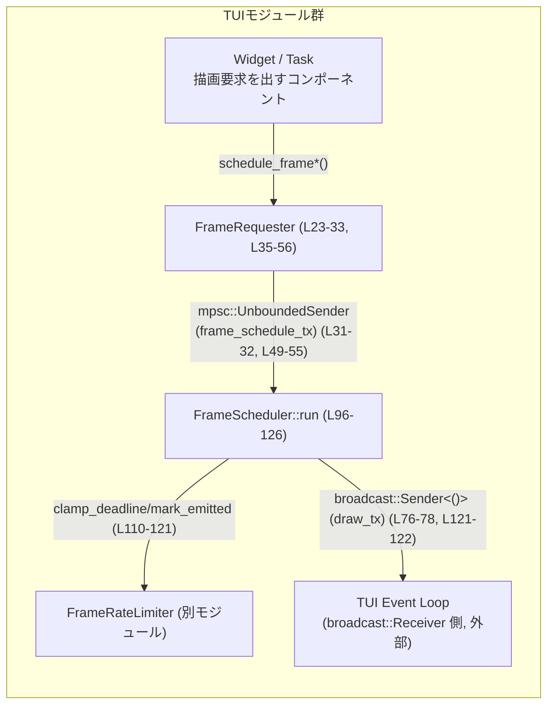
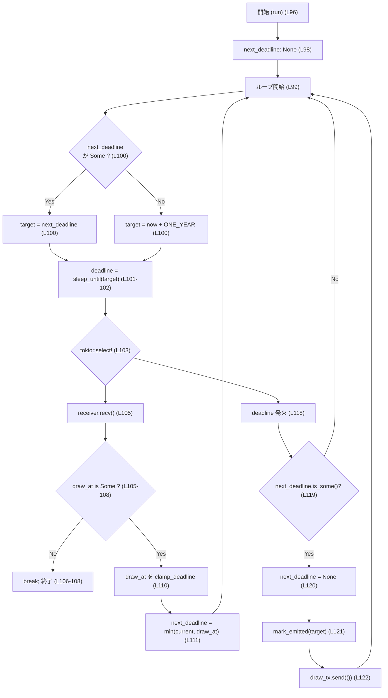

# tui/src/tui/frame_requester.rs コード解説

## 0. ざっくり一言

TUI のメインイベントループに対して「フレームを再描画してほしい」という要求を非同期に投げるための軽量ハンドル `FrameRequester` と、その要求をまとめてレート制限付きで描画通知に変換するスケジューラ `FrameScheduler` を提供するモジュールです（`tui/src/tui/frame_requester.rs:L23-33, L70-80`）。

---

## 1. このモジュールの役割

### 1.1 概要

- このモジュールは **TUI の描画要求の集約・スケジューリング** の問題を解決するために存在し、次の機能を提供します。
  - 任意のタスク／ウィジェットからの「できるだけ早く描画」「一定時間後に描画」という要求を非同期に受け付ける軽量ハンドル（`FrameRequester`）（`L23-33, L35-56`）。
  - 多数の要求を 1 回の描画通知にまとめ（coalesce）、さらに最大 120fps に制限しつつ、メイン TUI イベントループに通知するスケジューラ（`FrameScheduler`）（`L70-80, L96-126`）。

### 1.2 アーキテクチャ内での位置づけ

このモジュールは、Tokio ベースの非同期アプリケーションにおいて **actor パターン** を用いて描画要求を扱っています。

- `FrameRequester`:
  - TUI 内の各コンポーネント（ウィジェット・バックグラウンドタスクなど）に配布される「ハンドル」（`L23-33`）。
  - `tokio::sync::mpsc::UnboundedSender<Instant>` 経由でスケジューラに「いつ描画したいか」を送信します（`L31-32, L49-55`）。
- `FrameScheduler`:
  - 上記の要求を受信する「アクター」（内部構造体）（`L70-80`）。
  - `FrameRateLimiter` を用いて通知タイミングを調整し、`broadcast::Sender<()>` で TUI イベントループに「描画せよ」という通知をブロードキャストします（`L76-79, L110-122`）。

依存関係を簡略化した図を示します。



### 1.3 設計上のポイント

コードから読み取れる設計上の特徴を列挙します。

- **Actor パターンの採用**  
  - 1 つの `FrameScheduler` タスクが、複数の `FrameRequester` からの要求を集約する構造になっています（`L35-42, L96-126`）。
- **状態を持つ非同期タスク**  
  - `FrameScheduler` は `next_deadline: Option<Instant>` と `FrameRateLimiter` を内部状態として保持し（`L76-79, L97-98`）、ループ内で次の描画時刻を決定します（`L100-111`）。
- **レート制限付きのコアロジック**  
  - 描画間隔が 120fps を超えないよう `FrameRateLimiter::clamp_deadline` と `mark_emitted` を利用し（`L110-121`）、テストでも `MIN_FRAME_INTERVAL` を用いて検証しています（`L131, L235-262`）。
- **coalescing（要求のまとめ）**  
  - 多数の描画要求を「最も早い締切のみ」を覚えておき、それを 1 回の描画通知にまとめることで、無駄な描画を避ける設計です（`L100-111, L118-122`）。
- **エラーは基本的に「握りつぶす」ベストエフォート型**  
  - `mpsc::UnboundedSender::send` の戻り値は `let _ = ...` で無視されており（`L49-50, L54-55`）、`broadcast::Sender::send` の結果も同様に無視されます（`L121-122`）。  
    → 呼び出し元には失敗が伝搬しない代わりに、API はパニックせずに動作します。
- **Tokio 依存の非同期並行設計**  
  - スケジューラは `tokio::spawn` でバックグラウンドタスクとして起動され（`L39-42`）、`tokio::select!` により「新しい要求」と「現在の締切の到来」のどちらか早い方を処理します（`L103-125`）。

---

## 2. 主要な機能一覧

このモジュールが提供する主要な機能をまとめます。

- フレーム描画要求ハンドルの生成:
  - `FrameRequester::new`: `broadcast::Sender<()>` を受け取り、内部で `FrameScheduler` タスクを起動する（`L35-46`）。
- 即時描画要求:
  - `FrameRequester::schedule_frame`: 「できるだけ早く」描画してほしい要求を送る（`L48-51`）。
- 遅延描画要求:
  - `FrameRequester::schedule_frame_in`: 指定した `Duration` 後に描画してほしい要求を送る（`L53-56`）。
- 描画要求の coalescing:
  - `FrameScheduler::run`: 複数の要求を「最も早い締切」にまとめて 1 回だけ描画通知を送る（`L96-126`）。
- 最大 120fps のレート制限:
  - `FrameScheduler::run` 内で `FrameRateLimiter` を用いて締切を調整し、テストでも `MIN_FRAME_INTERVAL` を用いて検証（`L110-121, L235-262`）。
- テスト用ダミー:
  - `FrameRequester::test_dummy`: スケジューラを起動しない No-op なリクエスタをテスト用に提供（`L59-67`）。

---

## 3. 公開 API と詳細解説

### 3.1 型一覧（構造体・モジュールなど）

主要な型・モジュールのインベントリです。

| 名前 | 種別 | 公開範囲 | 定義位置 | 役割 / 用途 |
|------|------|----------|----------|-------------|
| `FrameRequester` | 構造体 | `pub` | `tui/src/tui/frame_requester.rs:L23-33` | 描画要求をスケジューラに送るハンドル。内部に `mpsc::UnboundedSender<Instant>` を 1 つだけ保持する。 |
| `FrameScheduler` | 構造体 | モジュール内のみ | `tui/src/tui/frame_requester.rs:L70-80` | `FrameRequester` からの要求を受け取り、coalescing とレート制限を行い、TUI イベントループに通知するアクター。 |
| `tests` | モジュール（`#[cfg(test)]`） | テスト時のみ | `tui/src/tui/frame_requester.rs:L129-354` | スケジューラの挙動（即時・遅延・coalescing・レート制限）を Tokio の仮想時間で検証するテスト群。 |

### 3.2 重要な関数の詳細

ここでは、本番コード側の主要な関数／メソッドをテンプレートに沿って説明します。

---

#### `FrameRequester::new(draw_tx: broadcast::Sender<()>) -> FrameRequester`

**定義位置**

- `tui/src/tui/frame_requester.rs:L35-46`

**概要**

- 新しい `FrameRequester` を生成し、その裏側で描画スケジューラ `FrameScheduler` のタスクを `tokio::spawn` により起動します（`L39-42`）。
- 渡された `draw_tx` は、スケジューラから TUI イベントループへの描画通知に使用されます（ドキュメントコメント `L36-38`）。

**引数**

| 引数名 | 型 | 説明 |
|--------|----|------|
| `draw_tx` | `broadcast::Sender<()>` | 描画通知を受け取る TUI イベントループ側（`broadcast::Receiver<()>`）への送信に使うブロードキャスト・チャネルの送信側。 |

**戻り値**

- `FrameRequester`  
  - スケジューラに描画要求を送るためのハンドル。`Clone` 可能であり、複数タスクで共有できます（`L30-31`）。

**内部処理の流れ**

1. `mpsc::unbounded_channel()` で `Instant` を運ぶ unbounded MPSC チャネルを作成（`L39-40`）。
2. `FrameScheduler::new(rx, draw_tx)` でスケジューラ構造体を生成（`L40-41`）。
3. `tokio::spawn(scheduler.run())` でスケジューラのメインループ（`run`）を別タスクとして起動（`L41-42`）。
4. 生成した `tx` を `frame_schedule_tx` に保持した `FrameRequester` を返す（`L43-45`）。

**Examples（使用例）**

TUI 初期化時に `FrameRequester` を作成する例です。

```rust
use tokio::sync::broadcast;
use tui::tui::frame_requester::FrameRequester; // 仮のパス

#[tokio::main] // Tokio ランタイムで実行する
async fn main() {
    // TUI イベントループとの間の broadcast チャネルを作成する
    let (draw_tx, mut draw_rx) = broadcast::channel::<()>(16);

    // FrameRequester とスケジューラを初期化する
    let requester = FrameRequester::new(draw_tx); // ここで scheduler.run() が spawn される

    // requester をウィジェットやタスクにクローンして配布できる
    let requester2 = requester.clone();

    // 例として 1 回だけ描画要求を出す
    requester.schedule_frame();

    // TUI イベントループ側では draw_rx.recv() を待って描画する
    if let Ok(()) = draw_rx.recv().await {
        // ここで TUI 全体を再描画する処理を呼ぶ
    }
}
```

**Errors / Panics**

- `tokio::spawn` は、Tokio ランタイム外から呼び出された場合にパニックする可能性があります。  
  → `FrameRequester::new` は **Tokio ランタイム内で呼ぶことが前提**です。
- `FrameScheduler::new` 内では特にパニックの可能性は見受けられません（`L84-90`）。
- `broadcast::Sender<()>` のクローンや保持自体はパニックしません。

**Edge cases（エッジケース）**

- `draw_tx` に対応する `broadcast::Receiver` が一つも存在しない場合でも、スケジューラは `draw_tx.send(())` を呼び出しますが（`L121-122`）、結果は無視されるため、描画通知は実際には配信されません。
- `FrameRequester` のすべてのクローンが drop されると、スケジューラの `receiver.recv()` が `None` を返し（`L105-108`）、スケジューラはループを抜けて終了します。以降は描画通知は行われません。

**使用上の注意点**

- `FrameRequester::new` は Tokio ランタイムが起動したコンテキストで呼び出す必要があります（`tokio::spawn` 使用のため）。
- `draw_tx` をどのように受け取るか（どのファイルが event loop を持つか）は、このチャンクには現れませんが、少なくともどこかで `draw_tx.subscribe()` して `recv()` する側が必要になります。
- `FrameRequester` は `Clone` 可能なので、ウィジェットごと・タスクごとにコピーして保持する運用が想定されます（`L30`）。

---

#### `FrameRequester::schedule_frame(&self)`

**定義位置**

- `tui/src/tui/frame_requester.rs:L48-51`

**概要**

- 「できるだけ早く」描画してほしいという要求をスケジューラに送信します。
- 実際の描画タイミングは `FrameScheduler` と `FrameRateLimiter` により決定され、必ずしも「即時」ではありません（`L96-126, L110-121`）。

**引数**

| 引数名 | 型 | 説明 |
|--------|----|------|
| `&self` | `&FrameRequester` | 送信に使用するハンドル。`&self` なのでスレッド間で共有しても問題ありません。（Tokio の `UnboundedSender` は `Clone + Send` であり、共有に向いています） |

**戻り値**

- 戻り値はありません（`()`）。  
  - 送信の成否は返されず、「ベストエフォート」で描画要求を投げます（`let _ = self.frame_schedule_tx.send(...)` `L49-50`）。

**内部処理の流れ**

1. `Instant::now()` により「今の時刻」を取得（`L50`）。
2. `frame_schedule_tx.send(Instant::now())` でスケジューラへ送信（`L49-50`）。
3. 戻り値 `Result<_, _>` は `let _ =` により破棄するため、呼び出し側にはエラーは伝わりません（`L49-50`）。

**Examples（使用例）**

ウィジェットから「状態が更新されたので、すぐ描画してほしい」場合の例です。

```rust
use std::sync::Arc;
use tui::tui::frame_requester::FrameRequester; // 仮のパス

struct MyWidget {
    frame_requester: Arc<FrameRequester>, // 共有で保持する
}

impl MyWidget {
    fn on_state_changed(&self) {
        // 状態が変わったので、できるだけ早く描画してほしい
        self.frame_requester.schedule_frame(); // 非同期でも即時でもなく、ベストエフォートで要求
    }
}
```

**Errors / Panics**

- 通常の使用ではパニックは発生しません。
  - `UnboundedSender::send` は、対応する `Receiver` が drop されている場合に `Err` を返しますが、ここでは無視されています（`L49-50`）。
- OS の制約により `Instant::now()` がパニックするケースはほぼ想定されません。

**Edge cases（エッジケース）**

- スケジューラが既に終了している（`receiver` が drop 済み）場合:
  - `send()` は `Err` を返しますが、無視されるため呼び出し側からは分かりません。
  - 実際には描画通知は行われません。
- 直前の描画から `MIN_FRAME_INTERVAL` 未満しか経っていない場合:
  - `FrameRateLimiter::clamp_deadline` により締切が遅らされ、120fps を超える描画は行われません（`L110-121`、テスト `L235-262`）。

**使用上の注意点**

- この関数の呼び出しは非常に軽量ですが、頻繁に呼ばれた場合でも描画回数は coalescing とレート制限により抑制されます。  
  → 呼び出し側が特別に回数を抑制する必要はない一方、「必ず呼び出し回数分の描画が走る」わけではない点に注意が必要です。
- 描画が「即時」に行われる保証はなく、`FrameScheduler` のロジックに従ってスケジュールされます。

---

#### `FrameRequester::schedule_frame_in(&self, dur: Duration)`

**定義位置**

- `tui/src/tui/frame_requester.rs:L53-56`

**概要**

- 「指定した時間 `dur` 経過後に描画してほしい」という要求をスケジューラに送信します。
- 実際の描画時刻は `now + dur` をベースにしつつ、レート制限の影響を受ける可能性があります（`L110-121`）。

**引数**

| 引数名 | 型 | 説明 |
|--------|----|------|
| `&self` | `&FrameRequester` | 描画要求の送信に使うハンドル。 |
| `dur` | `Duration` | 現在時刻からの遅延時間。`Duration::from_millis(50)` など。 |

**戻り値**

- 戻り値はありません。送信の成功・失敗は呼び出し側には報告されません（`L54-55`）。

**内部処理の流れ**

1. `Instant::now()` に `dur` を加算し、描画希望時刻 `Instant::now() + dur` を作成（`L54-55`）。
2. その `Instant` を `frame_schedule_tx.send(...)` でスケジューラに送信（`L54-55`）。
3. 戻り値は破棄するため、呼び出し側は送信失敗を検出しません。

**Examples（使用例）**

短いアニメーションや一定周期のポーリング後に描画したい場合の例です。

```rust
use std::time::Duration;
use tui::tui::frame_requester::FrameRequester; // 仮のパス

fn schedule_progress_update(requester: &FrameRequester) {
    // 50ms 後に進捗バーを更新して描画してほしい
    requester.schedule_frame_in(Duration::from_millis(50));
}
```

**Errors / Panics**

- `Instant::now() + dur` は、非常に大きな `dur` を渡した場合に OS 依存の理由でパニックする可能性があります（標準ライブラリ仕様）。  
  → 通常の GUI/TUI で使用する範囲の遅延時間（ミリ秒〜数秒）では問題にならないと考えられます。
- `send()` のエラーは握りつぶされます（`L54-55`）。

**Edge cases（エッジケース）**

- `dur == Duration::ZERO` の場合:
  - 実質的に `schedule_frame` 相当になり、`Instant::now() + dur` は `now` になります。
- すでに非常に先の締切が `next_deadline` に入っているときに、より近い時間で `schedule_frame_in` を呼んだ場合:
  - `cur.min(draw_at)` により、より早い締切に置き換えられます（`L111`）。
- 逆に、既に近い締切がある状態でさらに遅い締切を指定した場合:
  - 早い方を保持するため、遅い締切は無視されます（`L111`）。

**使用上の注意点**

- `dur` を非常に大きくしすぎると `Instant::now() + dur` の制約によりパニックの可能性があるため、常識的な時間範囲に留めることが安全です。
- レート制限の影響で、指定した時間ちょうどではなく、直近の描画から `MIN_FRAME_INTERVAL` を満たすように遅延される場合があります（テスト `L266-294`）。

---

#### `FrameRequester::test_dummy() -> FrameRequester`（テスト用）

**定義位置**

- `tui/src/tui/frame_requester.rs:L59-67`（`#[cfg(test)]`）

**概要**

- スケジューラを起動しない「No-op な FrameRequester」をテスト用に生成します。
- `frame_schedule_tx` の送信先に対応する `Receiver` は破棄されているため（`_rx` を未使用で drop `L62-63`）、送信しても何も起きません。

**引数・戻り値**

- 引数なし。
- 戻り値は `FrameRequester`。ただし、`schedule_frame*` を呼んでも実際のスケジューラは存在しません。

**使用上の注意点**

- `#[cfg(test)]` のため本番ビルドでは利用できません。
- TUI 全体を立ち上げずに「FrameRequester を必要とする他の構造体のテスト」を書く際に便利です。

---

#### `FrameScheduler::new(receiver: mpsc::UnboundedReceiver<Instant>, draw_tx: broadcast::Sender<()>) -> FrameScheduler`

**定義位置**

- `tui/src/tui/frame_requester.rs:L82-90`

**概要**

- スケジューラの内部構造体 `FrameScheduler` を初期化します。
- `FrameRateLimiter::default()` を作成し（`L88`）、受信チャネルと broadcast 送信側を束ねます。

**引数**

| 引数名 | 型 | 説明 |
|--------|----|------|
| `receiver` | `mpsc::UnboundedReceiver<Instant>` | 描画希望時刻を受け取るチャネルの受信側。`FrameRequester` から送信されます。 |
| `draw_tx` | `broadcast::Sender<()>` | 描画通知を TUI イベントループにブロードキャストするための送信側。 |

**戻り値**

- `FrameScheduler`  
  - `receiver`, `draw_tx`, `rate_limiter` の 3 フィールドを持つ構造体（`L76-79`）。

**内部処理の流れ**

1. フィールドに `receiver` と `draw_tx` をそのまま格納（`L85-87`）。
2. `rate_limiter` に `FrameRateLimiter::default()` を設定（`L88`）。
3. 生成した `FrameScheduler` を返す。

**Errors / Panics**

- この関数内にパニック要因は見当たりません。

**使用上の注意点**

- 通常は `FrameRequester::new` からしか呼ばれません（`L39-42`）。
- 外部から直接呼んで `run` を起動することも理論上可能ですが、このモジュールの意図としては `FrameRequester` を通して使用する構造になっています。

---

#### `FrameScheduler::run(mut self)`

**定義位置**

- `tui/src/tui/frame_requester.rs:L96-126`

**概要**

- 描画要求を受け付け続けるメインループです。Tokio タスクとして実行されます（`FrameRequester::new` から `tokio::spawn` される `L39-42`）。
- `mpsc::UnboundedReceiver<Instant>` から締切を受け取り、`next_deadline` に保持し、`tokio::time::sleep_until` と `tokio::select!` を使って coalescing とレート制限付きの通知を行います。

**引数**

| 引数名 | 型 | 説明 |
|--------|----|------|
| `self` | `FrameScheduler`（ムーブ） | スケジューラ自身。`tokio::spawn(scheduler.run())` により所有権がタスクに移動します。 |

**戻り値**

- 戻り値は `()` の非同期関数です（明示的な `->` なし）。  
  - すべての送信側が drop されると `receiver.recv()` が `None` を返し、ループを抜けて終了します（`L105-108`）。

**内部処理の流れ（アルゴリズム）**

1. `ONE_YEAR` を「事実上の無限待ち時間」として定義（`L97`）。
2. `next_deadline: Option<Instant>` を `None` で初期化（`L98`）。
3. 無限ループ開始（`L99`）。
4. `target` を決定:
   - `next_deadline` が `Some(deadline)` ならそれを使用。
   - そうでなければ `Instant::now() + ONE_YEAR` を使用（`L100`）。
5. `tokio::time::sleep_until(target.into())` で `deadline` future を生成し、`tokio::pin!` でピン留め（`L101-102`）。
6. `tokio::select!` により 2 つのイベントを待つ（`L103-125`）:
   1. **受信側ブランチ（`draw_at = self.receiver.recv()`）**（`L105-116`）
      - `draw_at` が `None`（チャネルがクローズ）なら `break` してループを終了（`L106-108`）。
      - `Some(draw_at)` の場合:
        1. `self.rate_limiter.clamp_deadline(draw_at)` で締切をレート制限に合わせて補正（`L110`）。
        2. `next_deadline` を既存値との `min` で更新（`L111`）。
        3. コメントにある通り、ここでは即時に描画通知は送らず、`continue` してループ先頭に戻り、新しい `target` で `sleep` を張り直す（`L113-116`）。
   2. **タイマーブランチ（`_ = &mut deadline`）**（`L118-124`）
      - `deadline` が発火した場合:
        1. `if next_deadline.is_some()` なら（実際の締切が存在する場合のみ）処理を行う（`L119`）。
        2. `next_deadline = None` にして締切をクリア（`L120`）。
        3. `self.rate_limiter.mark_emitted(target)` により、実際に描画を行った時刻をレートリミッタに通知（`L121`）。
        4. `let _ = self.draw_tx.send(())` により TUI イベントループへ描画通知をブロードキャスト（`L122`）。

**簡易フローチャート**



**Examples（使用例）**

`run` は直接呼び出すよりも、`FrameRequester::new` 経由で `tokio::spawn` される想定です（`L39-42`）。そのため、直接の呼び出し例は通常必要ありません。

**Errors / Panics**

- `receiver.recv()` が `None` を返すケース（すべての `FrameRequester` が drop された場合）でもパニックせず、ループを正常に抜けます（`L105-108`）。
- `draw_tx.send(())` の結果は無視されるため、`broadcast` にリスナがいない場合もパニックしません（`L121-122`）。
- `Instant::now() + ONE_YEAR` が OS の制約を超える場合にパニックの可能性がありますが、通常のシステムでは 1 年程度先の `Instant` は問題ないと考えられます（`L97, L100`）。

**Edge cases（エッジケース）**

- **要求がまったく来ない場合**:
  - `next_deadline` は `None` のままで、`target = now + ONE_YEAR` に対する `sleep_until` と `receiver.recv()` を併せて待ち続けるアイドル状態になります（`L97-103`）。
- **要求が頻発する場合**:
  - `next_deadline` は最も早い締切のみを保持するため、それ以降の要求は同じ描画に coalesce されます（`L111`）。
- **期限より後に再スケジュールされる場合**:
  - レートリミッタが `clamp_deadline` によって締切を後ろにずらす可能性があります（`L110`）。テスト `test_limits_draw_notifications_to_120fps` 等で検証されています（`L235-262`）。

**使用上の注意点**

- `run` は無限ループであり、終了条件は「すべての `FrameRequester` が drop されて `receiver` がクローズされる」ことだけです（`L105-108`）。  
  → アプリケーション終了時に `FrameRequester` を適切に drop することで、このタスクも終了します。
- `FrameScheduler` は内部状態を持つため、複数インスタンスを作成すると描画スケジュールの整合性が変化します。通常は `FrameRequester::new` により 1 つだけ生成される想定です。

---

### 3.3 その他の関数（関数インベントリ）

このチャンクに現れる関数の一覧です（テスト関数を含む）。

| 関数名 | 種別 | 定義位置 | 役割（1 行） |
|--------|------|----------|--------------|
| `FrameRequester::new` | メソッド | `L35-46` | `FrameScheduler` を spawn し、描画要求用ハンドルを返す。 |
| `FrameRequester::schedule_frame` | メソッド | `L48-51` | 即時描画要求をスケジューラに送信。 |
| `FrameRequester::schedule_frame_in` | メソッド | `L53-56` | 遅延描画要求をスケジューラに送信。 |
| `FrameRequester::test_dummy` | メソッド（テスト用） | `L59-67` | スケジューラを起動しない No-op な `FrameRequester` をテスト用に返す。 |
| `FrameScheduler::new` | 関数 | `L82-90` | スケジューラ構造体を初期化。 |
| `FrameScheduler::run` | `async fn` | `L96-126` | 描画要求の coalescing とレート制限付き通知を行うメインループ。 |
| `test_schedule_frame_immediate_triggers_once` | テスト | `L136-157` | 即時要求が 1 回だけ描画通知を発生させることを検証。 |
| `test_schedule_frame_in_triggers_at_delay` | テスト | `L159-183` | 遅延要求が指定時間後に 1 回だけ描画通知を発生させることを検証。 |
| `test_coalesces_multiple_requests_into_single_draw` | テスト | `L185-209` | 近接する複数の即時要求が 1 回の描画通知に coalesce されることを検証。 |
| `test_coalesces_mixed_immediate_and_delayed_requests` | テスト | `L211-232` | 遅延＋即時要求が、より早い方（即時）に coalesce されることを検証。 |
| `test_limits_draw_notifications_to_120fps` | テスト | `L234-263` | MIN_FRAME_INTERVAL 未満の間隔で通知されないこと（120fps 制限）を検証。 |
| `test_rate_limit_clamps_early_delayed_requests` | テスト | `L265-294` | レートリミッタが「早すぎる遅延要求」を後ろにずらすことを検証。 |
| `test_rate_limit_does_not_delay_future_draws` | テスト | `L297-323` | レートリミッタが「十分に先の締切」を不要に遅らせないことを検証。 |
| `test_multiple_delayed_requests_coalesce_to_earliest` | テスト | `L326-353` | 複数の遅延要求が最も早い締切に coalesce されることを検証。 |

---

## 4. データフロー

ここでは、典型的な「即時描画要求」の流れを説明します。

1. あるウィジェット／タスクが `FrameRequester::schedule_frame()` を呼び出す（`L48-51`）。
2. `FrameRequester` は `Instant::now()` を `mpsc::UnboundedSender<Instant>` に送信する（`L49-50`）。
3. バックグラウンドで動作する `FrameScheduler::run` が `receiver.recv()` でこの `Instant` を受信する（`L105-110`）。
4. `FrameScheduler` は `FrameRateLimiter::clamp_deadline` によって締切を補正し、`next_deadline` に保持する（`L110-111`）。
5. `tokio::time::sleep_until(target)` が締切までの待機を行い、発火したら `mark_emitted` と `draw_tx.send(())` によって TUI イベントループへ描画通知を送る（`L118-122`）。
6. TUI イベントループ側では `broadcast::Receiver<()>` 経由で通知を受信し、1 回のフレーム描画を実行します（この部分は本チャンクには現れません）。

### シーケンス図

```mermaid
sequenceDiagram
    autonumber
    participant Widget as "Widget / Task"
    participant Requester as "FrameRequester (L23-33, L48-56)"
    participant Scheduler as "FrameScheduler::run (L96-126)"
    participant Limiter as "FrameRateLimiter (別モジュール)"
    participant Loop as "TUI Event Loop<br/>(broadcast::Receiver<(), 外部)"

    Widget->>Requester: schedule_frame() 呼び出し (L48-51)
    Requester->>Scheduler: frame_schedule_tx.send(Instant::now()) (L49-50)
    Scheduler->>Scheduler: receiver.recv() で Instant を受信 (L105-110)
    Scheduler->>Limiter: clamp_deadline(draw_at) (L110)
    Limiter-->>Scheduler: 調整済み締切 Instant
    Scheduler->>Scheduler: next_deadline を更新 (L111)
    Scheduler->>Scheduler: sleep_until(target) が発火 (L101-102, L118)
    Scheduler->>Limiter: mark_emitted(target) (L121)
    Scheduler->>Loop: draw_tx.send(()) (L121-122)
    Loop-->>Loop: 1 フレーム描画（本チャンクには未定義）
```

---

## 5. 使い方（How to Use）

### 5.1 基本的な使用方法

典型的なコードフローは以下のようになります。

1. アプリケーション起動時に `broadcast::channel<()>` を作成する。
2. `FrameRequester::new(draw_tx)` でリクエスタとスケジューラを初期化する。
3. `draw_tx.subscribe()` で受信側を作り、イベントループで `recv()` を待ちながら描画を行う。
4. 各ウィジェット／タスクに `FrameRequester` をクローンして配布し、状態更新時に `schedule_frame*` を呼ぶ。

サンプルコード（簡略化）:

```rust
use std::time::Duration;
use tokio::sync::broadcast;
use tui::tui::frame_requester::FrameRequester; // 仮のパス

#[tokio::main]
async fn main() {
    // 1. 描画通知用 broadcast チャネルを作成
    let (draw_tx, mut draw_rx) = broadcast::channel::<()>(16);

    // 2. FrameRequester と内部スケジューラを初期化
    let requester = FrameRequester::new(draw_tx); // scheduler.run() が spawn される

    // 3. requester をウィジェットやバックグラウンドタスクにクローンして渡す
    let requester_for_task = requester.clone();

    // 例: 別タスクで定期的に描画要求を出す
    tokio::spawn(async move {
        loop {
            requester_for_task.schedule_frame_in(Duration::from_millis(100)); // 100ms 後に描画要求
            tokio::time::sleep(Duration::from_millis(100)).await; // さらに 100ms 待機
        }
    });

    // 4. メイン TUI イベントループ側で描画通知を待つ
    loop {
        // 他のイベント (キー入力など) と合わせて select! することも可能
        match draw_rx.recv().await {
            Ok(()) => {
                // ここで TUI を 1 フレーム描画
                // draw_ui();
            }
            Err(broadcast::error::RecvError::Closed) => {
                // スケジューラ側が終了した場合など
                break;
            }
            Err(broadcast::error::RecvError::Lagged(_)) => {
                // 遅延した場合は「最新の状態で描画すればよい」などの方針が考えられる
                // このモジュール自体はここまで関与しない
            }
        }
    }
}
```

### 5.2 よくある使用パターン

1. **即時描画要求のみを使うパターン**

   - 状態更新のたびに `schedule_frame()` を呼ぶ。
   - coalescing により、短時間に多数呼ばれても 1 回の描画にまとめられます（テスト `L185-209`）。

2. **即時＋遅延の混在**

   - ある処理では「一定時間後」に描画したいが、他の処理では「すぐに」描画したい場合、
     - `schedule_frame_in(Duration::from_millis(100))` と `schedule_frame()` を混在させても、より早い方に coalesce されることがテストで確認されています（`L211-232`）。

3. **レート制限を前提としたアニメーション**

   - アニメーション更新タスクが `schedule_frame()` をループで呼ぶ構成でも、`FrameRateLimiter` により最大 120fps に抑えられます（`L235-262`）。  
   - これにより、描画のしすぎによる CPU 負荷増加を抑制できます。

### 5.3 よくある間違い

このモジュールの振る舞いから推測される誤用例と正しい例を示します。

```rust
use tokio::sync::broadcast;
use tui::tui::frame_requester::FrameRequester;

// 誤り: Tokio ランタイム外で new を呼んでいる
fn main() {
    let (draw_tx, _draw_rx) = broadcast::channel::<()>(16);
    // ここは同期 main なので tokio::spawn がパニックする可能性がある
    // let requester = FrameRequester::new(draw_tx);
}

// 正しい例: Tokio ランタイム内で new を呼ぶ
#[tokio::main]
async fn main_correct() {
    let (draw_tx, _draw_rx) = broadcast::channel::<()>(16);
    let requester = FrameRequester::new(draw_tx); // OK
    // ...
}
```

```rust
// 誤り: FrameRequester をすべて drop してしまい、その後も描画を期待している
async fn wrong_usage() {
    let (draw_tx, mut draw_rx) = broadcast::channel::<()>(16);

    // requester をスコープ内ローカルに作ってすぐに drop してしまう
    let requester = FrameRequester::new(draw_tx);
    requester.schedule_frame();
    // ここで requester がスコープを抜けると sender が 1 つもなくなる→スケジューラ終了の可能性

    // ここで描画を待っても、スケジューラは既に停止しているかもしれない
    let _ = draw_rx.recv().await;
}

// 正しい例: requester をアプリケーション全体で保持する
async fn correct_usage() {
    let (draw_tx, mut draw_rx) = broadcast::channel::<()>(16);
    let requester = FrameRequester::new(draw_tx);

    // requester を必要な構造体にクローンして持たせる
    let requester_clone = requester.clone();
    requester_clone.schedule_frame();

    // requester が生きている間、スケジューラも動き続ける
    let _ = draw_rx.recv().await;
}
```

### 5.4 使用上の注意点（まとめ）

- **Tokio ランタイム必須**  
  - `FrameRequester::new` は内部で `tokio::spawn` を呼ぶため、Tokio ランタイムのコンテキスト内で呼び出す必要があります（`L39-42`）。
- **ベストエフォート型のエラーハンドリング**  
  - `schedule_frame*` は `send()` の失敗を呼び出し元に返しません（`L49-50, L54-55`）。  
    → 「描画要求を投げたのに描画されない」状況があり得ますが、それは通常、スケジューラやイベントループ側の問題です。
- **レート制限と coalescing を前提にした設計**  
  - 呼び出し側が「呼び出した回数だけ描画される」ことを期待してはいけません。  
  - 代わりに「最新状態を画面に反映するためのトリガー」としてこの API を捉えると理解しやすいです。
- **極端に大きな Duration の利用は避ける**  
  - `Instant::now() + dur` の仕様上、非常に大きな `dur` はパニックの可能性があります（`L54-55`）。  
    → 通常はミリ秒〜数秒程度の値に留めるのが無難です。

---

## 6. 変更の仕方（How to Modify）

### 6.1 新しい機能を追加する場合

例として、「優先度付きの描画要求」や「キャンセル可能な要求」を追加したい場合の入口を整理します。

- **スケジューリングロジックの追加・変更**
  - 主な入口は `FrameScheduler::run` です（`L96-126`）。
  - 現在は `Instant` のみを受け取り `next_deadline` を `min` で更新しています（`L111`）。  
    → ここに優先度や識別子を追加する場合は、`mpsc::UnboundedSender` のペイロード型と `FrameScheduler` のフィールドを拡張する必要があります（`L31-32, L76-79`）。

- **レート制限ルールの変更**
  - レート制限の詳細は `FrameRateLimiter` にカプセル化されています（`L76-79, L110-121`）。
  - フレームレート（`MIN_FRAME_INTERVAL`）を変えたい場合は、`frame_rate_limiter` モジュール側を確認する必要があります（テストのインポート `L131`）。

- **新しい公開メソッドを追加**
  - `FrameRequester` の `impl` ブロック（`L35-57`）にメソッドを追加する形になります。
  - 追加メソッドで `FrameScheduler` に新しい種別のメッセージを送信したい場合は、ペイロード型の変更が伴います。

### 6.2 既存の機能を変更する場合の注意点

- **coalescing の契約**
  - 現在の実装では、「複数の要求は最も早い締切に coalesce される」という性質がテストで前提とされています（`L185-209, L326-353`）。
  - この性質を変えると、多くのテストが意味を失うため、変更する際はテストの意図を確認する必要があります。

- **レート制限の契約**
  - `test_limits_draw_notifications_to_120fps` や `test_rate_limit_*` で、「一定の最小間隔を守る」「将来の締切は不要に遅らせない」といった契約がコード化されています（`L234-294, L297-323`）。
  - `FrameRateLimiter` や `run` を変更する際は、これらのテストが保証している性質を意識する必要があります。

- **チャネルやタスクのライフサイクル**
  - `receiver.recv() == None` でスケジューラを終了する仕様（`L105-108`）は、「`FrameRequester` がすべて drop されたらスケジューラも終わる」という直感的な挙動になっています。
  - ここを変更すると、リソースリークやタスクのゾンビ化を引き起こす可能性があるため、「どの時点で scheduler を終了させるべきか」を明確にした上で変更する必要があります。

---

## 7. 関連ファイル

このモジュールと密接に関係するファイル・コンポーネントです。

| パス / コンポーネント | 役割 / 関係 |
|-----------------------|------------|
| `tui/src/tui/frame_requester.rs`（本ファイル） | 描画要求ハンドル `FrameRequester` とスケジューラ `FrameScheduler` を定義し、テストを含む。 |
| `tui/src/tui/frame_rate_limiter.rs`（推定、`super::frame_rate_limiter`） | `FrameRateLimiter` 型と `MIN_FRAME_INTERVAL` を提供し、描画通知を最大 120fps に制限する（インポートとテストからの推測 `L21, L76-79, L110-121, L131, L235-262`）。実装自体はこのチャンクには現れません。 |
| TUI メインイベントループ（ファイル名不明） | `broadcast::Sender<()>` の受信側として `draw_tx.subscribe()` を行い、`recv()` をトリガーに TUI のフレーム描画を行う役割が想定されます。このチャンクには実装は現れません。 |

---

### Bugs / Security / 性能に関する補足（このファイルから読み取れる範囲）

- **潜在的なパニック要因**
  - `Instant::now() + dur`（`L54-55`）および `Instant::now() + ONE_YEAR`（`L97, L100`）は、極端に大きな `Duration` が指定された場合にパニックする可能性がありますが、通常の利用範囲では問題になりにくいと考えられます。
- **セキュリティ面**
  - このモジュールは UI 内部のスケジューリングロジックであり、外部入力のパースや権限操作を直接扱っていません。  
    → このチャンクからは特別なセキュリティリスクは読み取れません。
- **性能・スケーラビリティ**
  - `mpsc::unbounded_channel()` を使用しているため、極端に大量の描画要求が短時間に発生するとメモリ使用量が増加する可能性があります（`L39-40, L62-63`）。  
    ただし、coalescing により不必要な描画は減らされるため、通常の TUI アプリケーションでは問題になりにくい構造です。

以上が、このチャンクに基づく `tui/src/tui/frame_requester.rs` の公開 API・コアロジック・データフロー・エッジケースの整理です。
