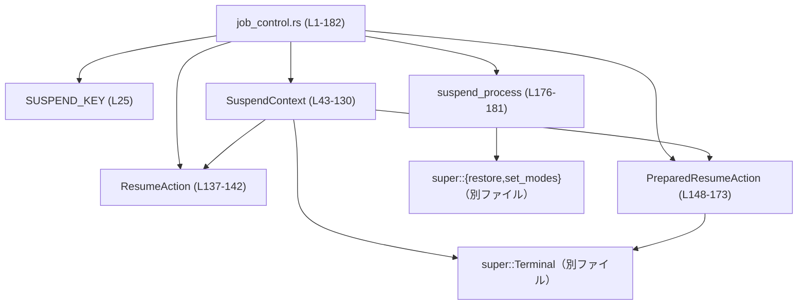
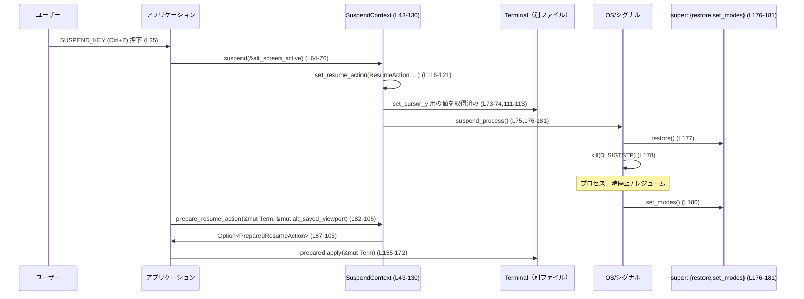

# tui/src/tui/job_control.rs

## 0. ざっくり一言

TUI が `SIGTSTP`（通常は `Ctrl+Z`）で一時停止／再開されるときに、  
端末のモード（オルタネイトスクリーン、スクロール）とビューポート位置を安全に復元するためのコンテキストと処理をまとめたモジュールです（`job_control.rs:L25-182`）。

---

## 1. このモジュールの役割

### 1.1 概要

このモジュールは、**TUI アプリケーションのサスペンド/レジューム時の端末状態の整合性確保**という問題を扱います（`job_control.rs:L27-41`）。

- サスペンド前に「どのようにレジュームすべきか」（オルタネイトスクリーンを戻すか、インライン表示を再整列するか）を記録します（`ResumeAction`）。
- サスペンド前のカーソル行をキャッシュしておき、サスペンド直前にカーソルを適切な位置に動かします（`suspend_cursor_y`）。
- レジューム時には、保存しておいた意図を消費して、TUI が再描画時に適用すべきビューポート操作を `PreparedResumeAction` として計算します。
- 端末モードの復元と `SIGTSTP` 送出を一括で行う `suspend_process` を提供します（`job_control.rs:L175-181`）。

### 1.2 アーキテクチャ内での位置づけ

このモジュールは、TUI レイヤの中で「ジョブコントロール（サスペンド/レジューム）」を担当する薄いサブコンポーネントです。

- 上位（親）モジュールからは:
  - 端末を抽象化する `Terminal` 型（`super::Terminal`）と、
  - 端末モードの切り替え関数 `super::restore` / `super::set_modes`、
  - オルタネイトスクロールの制御 `EnableAlternateScroll` / `DisableAlternateScroll`
  を利用します（`job_control.rs:L21-23,176-180`）。
- 外部ライブラリとして:
  - `crossterm` のカーソル制御・オルタネイトスクリーン制御（`MoveTo`, `Show`, `EnterAlternateScreen`, `LeaveAlternateScreen`）、
  - `ratatui::crossterm::execute` マクロ、
  - `ratatui::layout::{Rect, Position}`
  を利用します（`job_control.rs:L10-17,15`）。
- `SUSPEND_KEY` 定数を公開し、イベントループ側が「サスペンド操作用のキー」を知るために使います（`job_control.rs:L25`）。

依存関係の概要図です（行番号付きラベル）:



### 1.3 設計上のポイント

- **共有状態の設計**（`job_control.rs:L43-48`）
  - `SuspendContext` は `Clone` 可能で、内部的には `Arc<Mutex<Option<ResumeAction>>>` と `Arc<AtomicU16>` によって共有状態を持ちます。
  - これにより、イベントストリームや複数タスクから同じサスペンド状態を参照できます（`job_control.rs:L40-41`）。
- **言語レベルの並行性制御**
  - `resume_pending` は `Mutex<Option<ResumeAction>>` で排他制御され、`take()` によって「一度だけ消費される」ようになっています（`job_control.rs:L45,124-129`）。
  - `suspend_cursor_y` は `AtomicU16` で、緩いメモリ順序 (`Ordering::Relaxed`) で読み書きされます（`job_control.rs:L47,73-74,111-113`）。
- **Mutex Poisoning の扱い**
  - `resume_pending.lock().unwrap_or_else(PoisonError::into_inner)` により、ポイズンされた `Mutex` でも panic せず内部値を強制的に取り出します（`job_control.rs:L118-120,126-128`）。
- **エラーハンドリング**
  - 公開メソッドは基本的に `std::io::Result<()>` を返し、上位へ I/O エラーを伝播します（`suspend`, `PreparedResumeAction::apply`, `suspend_process`。`job_control.rs:L64,156,176`）。
  - 一部の `execute!` 呼び出しは `let _ = ...` としてエラーを明示的に無視します（`job_control.rs:L67-68,74`）。
- **UNIX シグナルとの連携**
  - `suspend_process` 内で `unsafe { libc::kill(0, libc::SIGTSTP) }` を呼び、プロセスグループに `SIGTSTP` を送ります（`job_control.rs:L176-178`）。

---

## 2. 主要な機能一覧

### 2.1 機能の概要

- `SUSPEND_KEY`: サスペンド（`SIGTSTP`）トリガ用のキー（`Ctrl+Z`）のバインディング（`job_control.rs:L25`）。
- `SuspendContext`: サスペンド/レジュームの意図とカーソル位置を管理するコンテキスト（`job_control.rs:L43-48`）。
- `ResumeAction`: サスペンド時に記録される「レジューム方式」（インライン再整列 or alt スクリーン復帰）（`job_control.rs:L132-142`）。
- `PreparedResumeAction`: レジューム後に描画時に適用すべきビューポート操作を保持する列挙体（`job_control.rs:L144-153`）。
- `suspend_process`: 端末モードをいったん戻してから `SIGTSTP` を送り、レジューム後に再度モードを適用する関数（`job_control.rs:L175-181`）。

### 2.2 コンポーネントインベントリー（型・定数）

| 名前 | 種別 | 公開レベル | 定義範囲 | 役割 / 用途 |
|------|------|------------|----------|-------------|
| `SUSPEND_KEY` | 定数 | `pub` | `job_control.rs:L25` | サスペンド操作に使うキー（`Ctrl+Z`）の `KeyBinding`。イベントループ側から参照されます。 |
| `SuspendContext` | 構造体 | `pub` | `job_control.rs:L43-48`（impl: L50-130） | サスペンド/レジュームに関する状態（レジュームアクションとカーソル行）を共有するためのコンテキスト。`Clone` 可能。 |
| `ResumeAction` | 列挙体 | `pub(crate)` | `job_control.rs:L132-142` | サスペンド時に記録される、レジューム時の振る舞い（`RealignInline` or `RestoreAlt`）を表します。 |
| `PreparedResumeAction` | 列挙体 | `pub(crate)` | `job_control.rs:L144-153`（impl: L155-173） | レジューム後の同期描画フェーズで実際に適用するビューポート操作（`RestoreAltScreen` or `RealignViewport(Rect)`）を表します。 |

### 2.3 コンポーネントインベントリー（関数・メソッド）

| 名前 | 種別 | 公開レベル | シグネチャ | 定義範囲 |
|------|------|------------|-----------|----------|
| `SuspendContext::new` | 関数（関連関数） | `pub(crate)` | `fn new() -> Self` | `job_control.rs:L51-56` |
| `SuspendContext::suspend` | メソッド | `pub(crate)` | `fn suspend(&self, alt_screen_active: &Arc<AtomicBool>) -> Result<()>` | `job_control.rs:L64-76` |
| `SuspendContext::prepare_resume_action` | メソッド | `pub(crate)` | `fn prepare_resume_action(&self, terminal: &mut Terminal, alt_saved_viewport: &mut Option<Rect>) -> Option<PreparedResumeAction>` | `job_control.rs:L82-105` |
| `SuspendContext::set_cursor_y` | メソッド | `pub(crate)` | `fn set_cursor_y(&self, value: u16)` | `job_control.rs:L111-113` |
| `SuspendContext::set_resume_action` | メソッド | `fn set_resume_action(&self, value: ResumeAction)` | `job_control.rs:L116-121` |
| `SuspendContext::take_resume_action` | メソッド | `fn take_resume_action(&self) -> Option<ResumeAction>` | `job_control.rs:L124-129` |
| `PreparedResumeAction::apply` | メソッド | `pub(crate)` | `fn apply(self, terminal: &mut Terminal) -> Result<()>` | `job_control.rs:L155-172` |
| `suspend_process` | 関数（自由関数） | `fn`（モジュール内プライベート） | `fn suspend_process() -> Result<()>` | `job_control.rs:L176-181` |

---

## 3. 公開 API と詳細解説

### 3.1 型一覧（構造体・列挙体など）

| 名前 | 種別 | 公開レベル | フィールド / バリアント概要 | 根拠 |
|------|------|------------|-----------------------------|------|
| `SuspendContext` | 構造体 | `pub` | `resume_pending: Arc<Mutex<Option<ResumeAction>>>`（サスペンド時に記録したレジューム意図）、`suspend_cursor_y: Arc<AtomicU16>`（インラインカーソル行のキャッシュ） | `job_control.rs:L43-47` |
| `ResumeAction` | 列挙体 | `pub(crate)` | `RealignInline`（インラインビューの再整列）、`RestoreAlt`（alt スクリーン復帰） | `job_control.rs:L132-142` |
| `PreparedResumeAction` | 列挙体 | `pub(crate)` | `RestoreAltScreen`（alt スクリーン再入とビューポートリセット）、`RealignViewport(Rect)`（インラインビューのシフト） | `job_control.rs:L144-153` |

---

### 3.2 関数詳細（主要 6 件）

#### `SuspendContext::new() -> Self`（job_control.rs:L51-56）

**概要**

- 新しい `SuspendContext` を生成します。
- レジューム意図は `None` に初期化され、カーソル行は `0` 行に初期化されます（`job_control.rs:L53-55`）。

**引数**

- なし。

**戻り値**

- `SuspendContext`  
  - `resume_pending` が `Arc::new(Mutex::new(None))` の状態。  
  - `suspend_cursor_y` が `Arc::new(AtomicU16::new(0))` の状態。

**内部処理の流れ**

1. `Arc<Mutex<Option<ResumeAction>>>` を `None` で初期化（`job_control.rs:L53`）。
2. `Arc<AtomicU16>` を `0` で初期化（`job_control.rs:L54`）。
3. それらをフィールドに持つ `SuspendContext` を返却（`job_control.rs:L51-56`）。

**Examples（使用例）**

```rust
// SuspendContext を生成して、イベントループなどに渡す例。
// Terminal 型やイベントループの詳細はこのチャンクには現れないため仮のものとします。

use std::sync::{Arc, atomic::AtomicBool};
use tui::tui::job_control::SuspendContext; // パスは仮のもの。実際のモジュール構成に依存します。

fn init_suspend_handling() -> (SuspendContext, Arc<AtomicBool>) {
    let suspend_ctx = SuspendContext::new();             // 新しいコンテキストを作成
    let alt_screen_active = Arc::new(AtomicBool::new(true)); // alt スクリーンが有効かどうかの共有フラグ
    (suspend_ctx, alt_screen_active)
}
```

**Errors / Panics**

- エラーも panic も発生しません（単純なメモリ初期化のみ）。

**Edge cases（エッジケース）**

- 生成直後に `suspend()` を呼ぶと、カーソル行は `0` として扱われます（`suspend_cursor_y` の初期値。`job_control.rs:L54`）。

**使用上の注意点**

- `SuspendContext` は `Clone` 可能なので、イベントループスレッドや描画スレッドにクローンを渡して共有できます（`job_control.rs:L42-43`）。

---

#### `SuspendContext::suspend(&self, alt_screen_active: &Arc<AtomicBool>) -> Result<()>`（job_control.rs:L64-76）

**概要**

- 現在の端末状態に応じてレジューム時のアクションを記録し、カーソル位置を整えた上で `SIGTSTP` を送る処理を呼び出します。
- alt スクリーンが有効なら一度抜け、無効ならインラインビューポートの再整列を記録します（`job_control.rs:L65-72`）。

**引数**

| 引数名 | 型 | 説明 |
|--------|----|------|
| `alt_screen_active` | `&Arc<AtomicBool>` | 現在 alt スクリーンが有効かどうかを示す共有フラグ。`load(Ordering::Relaxed)` で参照されます（`job_control.rs:L65`）。 |

**戻り値**

- `Result<()>` (`std::io::Result<()>`)  
  - `Ok(())`: サスペンド処理が正常に完了し、`suspend_process` も成功した場合。  
  - `Err(e)`: `super::restore` または `super::set_modes` で I/O エラーが発生した場合（`job_control.rs:L176-181` 参照）。

**内部処理の流れ**

1. `alt_screen_active.load(Ordering::Relaxed)` で alt スクリーンの有効/無効を読み取る（`job_control.rs:L65`）。
2. 有効な場合:
   - `DisableAlternateScroll` と `LeaveAlternateScreen` を `stdout()` に対して `execute!` で送る（エラーは無視。`job_control.rs:L67-68`）。
   - `self.set_resume_action(ResumeAction::RestoreAlt)` を呼び、レジューム時に alt スクリーン復帰を行うよう記録（`job_control.rs:L69`）。
3. 無効な場合:
   - `self.set_resume_action(ResumeAction::RealignInline)` を記録（`job_control.rs:L71`）。
4. `suspend_cursor_y` を `Ordering::Relaxed` で読み出し（`job_control.rs:L73`）、`MoveTo(0, y), Show` でカーソルを左端のその行に移動し、カーソルを可視化する（`job_control.rs:L74`）。
5. `suspend_process()` を呼び出し、端末モードの復元 → `SIGTSTP` 送出 → レジューム後のモード再設定を行う（`job_control.rs:L75,176-181`）。

**Examples（使用例）**

```rust
use std::sync::{Arc, atomic::{AtomicBool, Ordering}};
use std::io::Result;

fn handle_suspend(
    suspend_ctx: &SuspendContext,
    alt_screen_active: &Arc<AtomicBool>,
) -> Result<()> {
    // alt_screen_active は、alt スクリーン有効時に true にしておく想定です。
    suspend_ctx.suspend(alt_screen_active)?; // SIGTSTP を送って一時停止
    Ok(())
}
```

**Errors / Panics**

- 戻り値 `Result<()>` の `Err` は、`suspend_process()` 内の
  - `super::restore()?` または
  - `super::set_modes()?`
  から伝播します（`job_control.rs:L177,180`）。
- `execute!` による I/O エラーは `let _ = ...` で捨てており、ここから `Err` にはなりません（`job_control.rs:L67-68,74`）。
- `Mutex` ロックは `unwrap_or_else(PoisonError::into_inner)` によってポイズンを無視して内部値を取り出すため、ここから panic は発生しません（`set_resume_action` 内の実装。`job_control.rs:L118-120`）。

**Edge cases（エッジケース）**

- `alt_screen_active` が実際の状態と不整合な値の場合:
  - たとえば alt スクリーン無効なのに `true` を持っていると、`LeaveAlternateScreen` を送りつつ `RestoreAlt` が記録されます。  
    実行時の効果は、`crossterm` の実装に依存しますが、意図通りにならない可能性があります。
- `set_cursor_y` が呼ばれないままサスペンドした場合:
  - `suspend_cursor_y` の初期値 `0` 行でカーソルが移動します（`job_control.rs:L54,73-74`）。

**使用上の注意点**

- `alt_screen_active` は、alt スクリーンを切り替えるすべての箇所で一貫して更新されている必要があります。そうでないと、レジューム時の挙動がずれます。
- シグナル `SIGTSTP` は Unix 系 OS 依存です。Windows などでは動作しない可能性があります（`libc::kill` 使用。`job_control.rs:L176-178`）。
- 呼び出し元は、この関数から `Err` が返ってきた場合、TUI 全体の終了やエラーメッセージ表示など、適切なフォールバックを実装する必要があります。

---

#### `SuspendContext::prepare_resume_action(&self, terminal: &mut Terminal, alt_saved_viewport: &mut Option<Rect>) -> Option<PreparedResumeAction>`（job_control.rs:L82-105）

**概要**

- サスペンド時に記録した `ResumeAction` を一度だけ取り出し、それに基づいてレジューム後に適用すべき `PreparedResumeAction` を計算します。
- 返り値は `Option` で、サスペンド意図が記録されていない／すでに消費済みの場合は `None` を返します（`job_control.rs:L87-88`）。

**引数**

| 引数名 | 型 | 説明 |
|--------|----|------|
| `terminal` | `&mut Terminal` | TUI の端末抽象。`get_cursor_position`, `last_known_cursor_pos` フィールドにアクセスします（`job_control.rs:L90-92,97`）。 |
| `alt_saved_viewport` | `&mut Option<Rect>` | alt スクリーン用に保存しているビューポート。`RestoreAlt` の場合に `y` 座標を更新するために使われます（`job_control.rs:L85-86,98-101`）。 |

**戻り値**

- `Option<PreparedResumeAction>`  
  - `Some(PreparedResumeAction::RealignViewport(rect))`: インライン表示の再整列が必要な場合。`rect.y` にカーソル行を入れた矩形が渡されます（`job_control.rs:L89-95`）。
  - `Some(PreparedResumeAction::RestoreAltScreen)`: alt スクリーン復帰が必要な場合（`job_control.rs:L96-103`）。
  - `None`: サスペンド意図が記録されていない場合（`take_resume_action()?` による早期 return。`job_control.rs:L87-88`）。

**内部処理の流れ**

1. `let action = self.take_resume_action()?;`  
   - `resume_pending` の中身を `take()` し、`Some` でなければ `None` を返す（`job_control.rs:L87,124-129`）。
2. `match action` で振り分け:
   - `ResumeAction::RealignInline` の場合（`job_control.rs:L89-95`）:
     1. `terminal.get_cursor_position()` を `Result` として取得し、エラー時は `terminal.last_known_cursor_pos` にフォールバック（`job_control.rs:L90-92`）。
     2. `Rect::new(0, cursor_pos.y, 0, 0)` を作成し（幅・高さ 0、Y 座標のみ指定）、`PreparedResumeAction::RealignViewport(viewport)` を返す（`job_control.rs:L93-94`）。
   - `ResumeAction::RestoreAlt` の場合（`job_control.rs:L96-103`）:
     1. `terminal.get_cursor_position()` が `Ok(Position { y, .. })` であり、かつ `alt_saved_viewport.as_mut()` が `Some(saved)` のときのみ、`saved.y = y;` として保存しているビューポートの `y` を更新（`job_control.rs:L97-101`）。
     2. `PreparedResumeAction::RestoreAltScreen` を返す（`job_control.rs:L102`）。

**Examples（使用例）**

```rust
fn on_resume(
    suspend_ctx: &SuspendContext,
    terminal: &mut Terminal,
    alt_saved_viewport: &mut Option<Rect>,
) {
    if let Some(prepared) = suspend_ctx.prepare_resume_action(terminal, alt_saved_viewport) {
        // このあと、同期描画フェーズの中で prepared.apply(terminal) を呼ぶのが想定フローです。
        let _ = prepared.apply(terminal); // エラー処理は省略。実際には Result を扱うべきです。
    }
}
```

**Errors / Panics**

- この関数自体は `Option` を返すだけで、`Result` ではありません。
- `Mutex` ロックで panic しない実装 (`unwrap_or_else(PoisonError::into_inner)`) を使っているため、ロック周りの panic は起きません（`job_control.rs:L126-128`）。
- `terminal.get_cursor_position()` が `Err` を返す場合も、`RealignInline` 分岐では `unwrap_or` でフォールバックし、`RestoreAlt` 分岐では `if let Ok(...)` により単に `y` 更新をスキップします。

**Edge cases（エッジケース）**

- `suspend()` が呼ばれずに `prepare_resume_action()` を呼んだ場合:
  - `resume_pending` が `None` のため、即座に `None` を返します（`job_control.rs:L87-88`）。
- すでに一度 `prepare_resume_action()` を呼んだ後に再度呼ぶ場合:
  - `take()` 済みのため、2 回目以降は常に `None` になります（`job_control.rs:L124-129`）。
- `alt_saved_viewport` が `None` の場合:
  - `RestoreAlt` 分岐でも `saved` が `Some` でないため `y` 更新は行われませんが、`PreparedResumeAction::RestoreAltScreen` は返ります（`job_control.rs:L97-103`）。
- `terminal.get_cursor_position()` が失敗した場合:
  - `RealignInline`: `last_known_cursor_pos` で補う（`job_control.rs:L90-92`）。
  - `RestoreAlt`: `if let Ok(...)` が失敗し `saved.y` は変わらないが、`RestoreAltScreen` は返されます（`job_control.rs:L97-103`）。

**使用上の注意点**

- `prepare_resume_action` は「一度だけ取り出し可能」な API です。複数回呼ぶと 2 回目以降は `None` になるため、呼び出しタイミングを明確にする必要があります。
- `alt_saved_viewport` は、alt スクリーンのビューポートを別途管理する上位ロジックと整合性が取れていることが前提です。このチャンクにはその保存・利用ロジックは現れていません。

---

#### `SuspendContext::set_cursor_y(&self, value: u16)`（job_control.rs:L111-113）

**概要**

- インライン表示時のカーソル行をキャッシュするための setter です。
- 通常の描画中に呼び出され、サスペンド直前のカーソル位置に復元するために使われます（`job_control.rs:L107-110`）。

**引数**

| 引数名 | 型 | 説明 |
|--------|----|------|
| `value` | `u16` | サスペンド時に使うべきカーソルの Y 座標（行）。 |

**戻り値**

- なし。

**内部処理の流れ**

1. `self.suspend_cursor_y.store(value, Ordering::Relaxed);` を呼ぶだけです（`job_control.rs:L112-113`）。

**Examples（使用例）**

```rust
fn update_cursor_tracking(ctx: &SuspendContext, current_row: u16) {
    // インラインビューで描画中に、カーソルが移動するたびに呼ぶ想定。
    ctx.set_cursor_y(current_row);
}
```

**Errors / Panics**

- `AtomicU16::store` は panic しません。
- 戻り値もなくエラーは発生しません。

**Edge cases（エッジケース）**

- `value` が端末の実際の行数より大きい値でも、そのまま保存されます。  
  実際のカーソル移動時（`MoveTo(0, y)`）には、端末側の制限に依存します（`job_control.rs:L73-74`）。

**使用上の注意点**

- `Ordering::Relaxed` で書き込んでいるため、他のメモリの可視性を保証するものではありません。  
  ここでは単なる位置情報であり、強い順序保証が不要という設計になっています（`job_control.rs:L73-74,111-113`）。

---

#### `PreparedResumeAction::apply(self, terminal: &mut Terminal) -> Result<()>`（job_control.rs:L155-172）

**概要**

- 事前に計算された `PreparedResumeAction` を実際に端末に適用します。
- `RealignViewport` の場合はビューポートのシフト、`RestoreAltScreen` の場合は alt スクリーン再入・スクロールモード設定・画面クリアを行います（`job_control.rs:L156-169`）。

**引数**

| 引数名 | 型 | 説明 |
|--------|----|------|
| `self` | `PreparedResumeAction` | 適用すべきレジュームアクション。`RealignViewport(Rect)` または `RestoreAltScreen`。 |
| `terminal` | `&mut Terminal` | 端末抽象。`backend_mut`, `size`, `set_viewport_area`, `clear` メソッドを利用します（`job_control.rs:L159,162,165-167`）。 |

**戻り値**

- `Result<()>`  
  - `Ok(())`: すべての操作が成功した場合。
  - `Err(e)`: `execute!`, `terminal.clear()` など、I/O に起因するエラーが発生した場合。

**内部処理の流れ**

1. `match self` で分岐（`job_control.rs:L157-170`）。
2. `PreparedResumeAction::RealignViewport(area)` の場合:
   - `terminal.set_viewport_area(area);` を呼び、ビューポート位置を更新（`job_control.rs:L158-160`）。
3. `PreparedResumeAction::RestoreAltScreen` の場合:
   1. `execute!(terminal.backend_mut(), EnterAlternateScreen)?;` で alt スクリーンに入る（`job_control.rs:L162`）。
   2. `execute!(terminal.backend_mut(), EnableAlternateScroll)?;` で alt スクロールモードを有効化（`job_control.rs:L164`）。
   3. `if let Ok(size) = terminal.size() { ... }` で端末サイズを取得できた場合のみ:
      - ビューポートを `(0, 0, size.width, size.height)` に設定（`job_control.rs:L165-166`）。
      - `terminal.clear()?;` で画面クリア（`job_control.rs:L167`）。
4. 最後に `Ok(())` を返す（`job_control.rs:L171-172`）。

**Examples（使用例）**

```rust
fn apply_resume_action(
    terminal: &mut Terminal,
    action: PreparedResumeAction,
) -> std::io::Result<()> {
    action.apply(terminal)?;  // I/O エラーがあればここで Err が返る
    Ok(())
}
```

**Errors / Panics**

- `RealignViewport` 分岐では、`set_viewport_area` の戻り値が `()` 固定であれば、`Result` の `Err` は発生しません。
- `RestoreAltScreen` 分岐では:
  - `execute!(..., EnterAlternateScreen)`、`execute!(..., EnableAlternateScroll)` のいずれかが失敗すると `Err` が返ります（`job_control.rs:L162,164`）。
  - `terminal.size()` が `Err` の場合は `if let Ok(size)` により何もしません（エラーは捨てられます。`job_control.rs:L165`）。
  - `terminal.clear()` が `Err` の場合はそのまま伝播されます（`job_control.rs:L167-168`）。
- panic を起こすコードは含まれていません。

**Edge cases（エッジケース）**

- `RestoreAltScreen` の場合に `terminal.size()` が失敗すると:
  - ビューポートのサイズ調整と `clear()` は行われませんが、alt スクリーンへの切り替え・スクロールモード設定は済みます（`job_control.rs:L162-166`）。
- `RealignViewport` で与えられた `Rect` の `width`/`height` が `0` の場合:
  - この意味付けは `Terminal::set_viewport_area` の実装に依存します。このチャンクには詳細がありません。

**使用上の注意点**

- `apply` は描画の同期フェーズ（他の描画処理と同時に terminal 状態を更新するタイミング）で呼び出されることが想定されています（ドキュメントコメントより。`job_control.rs:L144-147`）。
- `Result` のエラーは上位でハンドリングする必要があります。ユーザーに通知するか、TUI を再初期化するなどの方針が必要です。

---

#### `suspend_process() -> Result<()>`（job_control.rs:L176-181）

**概要**

- `SIGTSTP` を送る前に TUI が設定した端末モードを解除し、プロセスがレジュームされた後に再度端末モードを設定し直します。
- 実際の `SIGTSTP` 送出は `unsafe { libc::kill(0, libc::SIGTSTP) }` で行います（`job_control.rs:L176-178`）。

**引数**

- なし。

**戻り値**

- `Result<()>`  
  - `Ok(())`: `restore` と `set_modes` が成功した場合。
  - `Err(e)`: いずれかでエラーが発生した場合。

**内部処理の流れ**

1. `super::restore()?;` を呼び出し、TUI が設定していた端末モードを通常状態に戻す（`job_control.rs:L177`）。
2. `unsafe { libc::kill(0, libc::SIGTSTP) };` でカレントプロセスグループにシグナルを送る（`job_control.rs:L178`）。
   - ここでプロセスは OS によって一時停止され、後で再開されます。
3. レジューム後に処理が再開され、`super::set_modes()?;` を呼び出して TUI 用の端末モードを再設定する（`job_control.rs:L180`）。
4. `Ok(())` を返す（`job_control.rs:L181`）。

**Examples（使用例）**

```rust
fn low_level_suspend() -> std::io::Result<()> {
    // 通常は SuspendContext::suspend 経由で呼び出されますが、
    // 直接呼び出すことで「端末モードを正しく復元しつつ SIGTSTP を送る」こともできます。
    suspend_process()
}
```

**Errors / Panics**

- `super::restore` または `super::set_modes` がエラーを返すと、そのまま `Err` として呼び出し元に伝播します（`job_control.rs:L177,180`）。
- `libc::kill` の戻り値はチェックされておらず、失敗してもこの関数はそれを検知しません。
- `unsafe` ブロックを使用していますが、ここでの不変条件（プロセスグループ ID 0 に対する `SIGTSTP` 送出）は OS 側の仕様に依存します。

**Edge cases（エッジケース）**

- 非 Unix 環境（`libc::kill` 非対応、または `SIGTSTP` が意味を持たない環境）の場合:
  - 実際の挙動はリンク先の libc 実装に依存し、このチャンクからは判断できません。
- `restore` が失敗した場合:
  - `SIGTSTP` は送られず、その時点で `Err` が返ります（`?` 演算子により早期 return。`job_control.rs:L177`）。
- `set_modes` が失敗した場合:
  - プロセスはレジュームしていますが、TUI 用の端末モードが再設定されないままになる可能性があります（`job_control.rs:L180`）。

**使用上の注意点**

- この関数は直接呼び出すよりも、`SuspendContext::suspend` 経由で使うことが想定されています（`suspend` の最後で呼び出し。`job_control.rs:L75`）。
- `unsafe` 呼び出しを含むため、プラットフォーム依存の挙動を念頭に置く必要があります。

---

### 3.3 その他の関数

| 関数名 | 公開レベル | 定義範囲 | 役割（1 行） |
|--------|------------|----------|--------------|
| `SuspendContext::set_resume_action(&self, value: ResumeAction)` | `fn`（private） | `job_control.rs:L116-121` | `resume_pending` にサスペンド時のレジューム意図を保存する。Mutex がポイズンされていても `into_inner` で内部値を取り出します。 |
| `SuspendContext::take_resume_action(&self) -> Option<ResumeAction>` | `fn`（private） | `job_control.rs:L124-129` | `resume_pending` の内容を `take()` で取り出しつつ `None` にリセットし、「一度だけ消費」する動作を実現します。 |

---

## 4. データフロー

ここでは、典型的なサスペンド → レジュームのシナリオにおけるデータフローを説明します。

1. ユーザーが `SUSPEND_KEY`（`Ctrl+Z`）を押す。
2. イベントループが `SuspendContext::suspend(&alt_screen_active)` を呼ぶ（`job_control.rs:L64-76`）。
3. `suspend()` が `resume_pending` に `ResumeAction` を記録し、カーソルを移動してから `suspend_process()` を呼ぶ。
4. `suspend_process()` が端末モードを戻し、`SIGTSTP` を送出する（`job_control.rs:L176-181`）。
5. プロセスがレジュームすると、イベントループが `SuspendContext::prepare_resume_action` を呼び、`PreparedResumeAction` を得る（`job_control.rs:L82-105`）。
6. 同期描画フェーズで `PreparedResumeAction::apply(terminal)` を呼び、ビューポートや alt スクリーン状態を復元する（`job_control.rs:L155-172`）。

これをシーケンス図で表します（行番号付きラベル）:



---

## 5. 使い方（How to Use）

### 5.1 基本的な使用方法

ここでは、本モジュールのコンポーネントを組み合わせて、サスペンド/レジュームを扱う典型的なフローを示します。  
`Terminal` 型やイベント取得 API はこのチャンクには定義がないため、コメントで補足しつつ仮定的なコードを示します。

```rust
use std::sync::{Arc, atomic::{AtomicBool, Ordering}};
use std::io::Result;
use ratatui::layout::Rect;

// 仮定: super モジュールから Terminal, SuspendContext, SUSPEND_KEY が公開されているとする。
use tui::tui::job_control::{SuspendContext, SUSPEND_KEY};

fn main_loop(mut terminal: Terminal) -> Result<()> {
    let suspend_ctx = SuspendContext::new();             // サスペンドコンテキストを作成 (L51-56)
    let alt_screen_active = Arc::new(AtomicBool::new(true)); // alt スクリーンの状態を共有

    let mut alt_saved_viewport: Option<Rect> = None;     // alt スクリーン用のビューポート保存

    loop {
        // 1. 入力イベントを取得（実際の取得方法は別ファイル）
        let event = read_event()?;                       // 仮の関数

        // 2. サスペンドキーが押されたかを判定
        if event.matches(&SUSPEND_KEY) {                 // SUSPEND_KEY は Ctrl+Z (L25)
            suspend_ctx.suspend(&alt_screen_active)?;    // SIGTSTP を送って一時停止 (L64-76)

            // プロセスが再開してここに戻ってくる
            if let Some(prepared) =
                suspend_ctx.prepare_resume_action(&mut terminal, &mut alt_saved_viewport)
            {
                prepared.apply(&mut terminal)?;          // ビューポートや alt スクリーンを復元 (L155-172)
            }
            continue;
        }

        // 3. 通常の描画処理
        //   - カーソル位置が変わるたびに set_cursor_y を呼んでおく
        let current_cursor_row = compute_cursor_row();   // 仮定: カーソル行を計算
        suspend_ctx.set_cursor_y(current_cursor_row);    // サスペンド用に保存 (L111-113)

        draw_ui(&mut terminal)?;                         // UI を描画（別ファイル）
    }
}
```

※ `read_event`, `Terminal`, `draw_ui` などはこのチャンクには現れないため、具体的な実装は不明です。

### 5.2 よくある使用パターン

1. **alt スクリーン前提の TUI**
   - 起動時に alt スクリーンへ入り、`alt_screen_active` を常に `true` にしておく設計。
   - サスペンド時は必ず `RestoreAlt` が記録され、レジューム後に alt スクリーンを再度有効にします（`job_control.rs:L65-69,96-103,162-167`）。

2. **インライン表示前提の TUI**
   - alt スクリーンを使わず、通常のシェルの上にインラインで描画。
   - `alt_screen_active` を常に `false` にしておき、サスペンド時は `RealignInline` が記録されます（`job_control.rs:L70-72,89-95`）。

3. **モード切り替え可能な TUI**
   - ある操作で alt スクリーン／インラインを切り替える場合、
     - 切り替え時に必ず `alt_screen_active.store(true/false, Ordering::Relaxed)` を更新し、
     - alt スクリーン側では `alt_saved_viewport` を適切に管理する必要があります。

### 5.3 よくある間違い

```rust
// 間違い例 1: alt_screen_active を更新しない
let alt_screen_active = Arc::new(AtomicBool::new(false));
// ... 実際には alt スクリーンに入っているのに、このフラグを true に更新していない
suspend_ctx.suspend(&alt_screen_active)?;
// → ResumeAction::RealignInline が記録され、本来 alt を復元すべきところで
//    ビューポート再整列だけが行われる可能性があります。

// 正しい例: alt スクリーン切り替えとフラグ更新をセットで行う
enter_alt_screen(&mut terminal)?;
alt_screen_active.store(true, Ordering::Relaxed);

suspend_ctx.suspend(&alt_screen_active)?; // RestoreAlt が記録される
```

```rust
// 間違い例 2: prepare_resume_action を呼ばずに apply しようとする
if let Some(action) = maybe_action {
    // SuspendContext ではなく、どこかで保存した action を再利用している（2回以上適用）
    action.apply(&mut terminal)?;
}

// 正しい例: 必ず SuspendContext から取り出し、1回だけ適用
if let Some(action) = suspend_ctx.prepare_resume_action(&mut terminal, &mut alt_saved_viewport) {
    action.apply(&mut terminal)?;
}
```

### 5.4 使用上の注意点（まとめ）

- **前提条件**
  - `alt_screen_active` フラグは alt スクリーンの状態と同期している必要があります（`job_control.rs:L65-72`）。
  - `suspend_ctx.set_cursor_y` は、インライン表示のときにカーソル行が変わるたびに更新されている方が望ましいです（`job_control.rs:L107-113`）。
- **エッジケース / 契約**
  - `prepare_resume_action` は「一度だけ取り出し可能」であり、二度目以降は `None` を返します（`job_control.rs:L87-88,124-129`）。
  - `suspend_process` は `super::restore` / `super::set_modes` の成否に依存しており、それらの契約に違反すると TUI の端末モードが不整合になります（`job_control.rs:L177-180`）。
- **並行性**
  - `SuspendContext` は `Arc` + `Mutex` + `AtomicU16` により複数スレッドから共有可能ですが、
    - `resume_pending` は `Mutex` で排他されるため、「同時に複数のスレッドがサスペンドを記録する」ケースでは最後に記録したものだけが有効になります。
    - `suspend_cursor_y` は `Ordering::Relaxed` のため、値の「最新性」は厳密には保証されませんが、カーソル位置という性質上、多少の遅延は許容する設計になっています（`job_control.rs:L73-74,111-113`）。
- **エラーと安全性（Bugs/Security 観点）**
  - `Mutex` ポイズンを無視して内部値を取り出す実装 (`PoisonError::into_inner`) により、論理的不整合があっても処理を続行します（`job_control.rs:L118-120,126-128`）。  
    これは「panic を避ける代わりに不整合な状態を許容する」選択であり、上位レイヤでの整合性チェックが重要です。
  - `suspend_process` の `unsafe { libc::kill(0, SIGTSTP) }` はプロセスグループに対してシグナルを送るため、同じグループに属する他プロセスへの影響も考慮する必要があります（`job_control.rs:L176-178`）。
- **テスト**
  - このチャンクにはユニットテストや統合テストコードは含まれていません。  
    特にサスペンド/レジュームは OS 依存・端末依存のため、実環境での動作確認が重要になります。

---

## 6. 変更の仕方（How to Modify）

### 6.1 新しい機能を追加する場合

例: 「サスペンドからの復帰時に追加のクリーニング処理を行いたい」など。

1. **レジュームアクションの種類を増やす**
   - `ResumeAction` に新しいバリアントを追加（`job_control.rs:L137-141`）。
   - `SuspendContext::suspend` 内で、その条件に応じて `set_resume_action(...)` を呼ぶように追加（`job_control.rs:L64-72,116-121`）。
2. **PreparedResumeAction に対応する処理を追加**
   - `PreparedResumeAction` に対応するバリアントを追加（`job_control.rs:L148-152`）。
   - `SuspendContext::prepare_resume_action` の `match action` に分岐を追加し、適切な `PreparedResumeAction` を返す（`job_control.rs:L88-104`）。
   - `PreparedResumeAction::apply` の `match self` に新バリアントの処理を追加（`job_control.rs:L157-170`）。

### 6.2 既存の機能を変更する場合

- **影響範囲の確認**
  - `SuspendContext::suspend` や `prepare_resume_action` のシグネチャは、このモジュール外（同クレート内）から呼ばれている可能性があります（`pub(crate)`）。  
    変更する場合は、呼び出し元（イベントループ、描画ロジック）を検索して影響箇所を確認する必要があります。
- **契約の維持**
  - `prepare_resume_action` が「一度だけ取り出し可能」である契約（`take()` を使う）を変える場合、
    - レジューム処理が複数回走ることを前提にしている呼び出し側ロジックがないか確認する必要があります（`job_control.rs:L124-129`）。
- **端末モードの扱い**
  - `suspend_process` 内の `restore` / `set_modes` の呼び出し順序や有無を変更する場合、端末の状態が壊れないことを実環境でテストする必要があります（`job_control.rs:L177-180`）。

---

## 7. 関連ファイル

このモジュールと密接に関係するコンポーネントは、コード上から次のように読み取れます。

| パス / シンボル | 役割 / 関係 |
|-----------------|------------|
| `crate::key_hint` | `SUSPEND_KEY` の型 `KeyBinding` と、`key_hint::ctrl(KeyCode::Char('z'))` 生成関数を提供します（`job_control.rs:L19,25`）。 |
| `super::Terminal` | 端末操作の抽象。`get_cursor_position`, `last_known_cursor_pos`, `set_viewport_area`, `size`, `clear`, `backend_mut` が利用されています（`job_control.rs:L84,90-92,97,159,162,165-167`）。ファイルパスはこのチャンクには現れません。 |
| `super::EnableAlternateScroll` / `super::DisableAlternateScroll` | alt スクロールモード（マウスホイールを矢印キーに変換する等）を有効/無効にするために `execute!` で送られるコマンドです（`job_control.rs:L21-22,67,164`）。 |
| `super::restore` / `super::set_modes` | サスペンド前後に端末モードを保存・復元する関数。`suspend_process` から呼ばれます（`job_control.rs:L177,180`）。ファイルパスはこのチャンクには現れません。 |
| `crossterm::cursor::{MoveTo, Show}` | サスペンド直前にカーソル位置を移動・表示するために使用されます（`job_control.rs:L10-11,74`）。 |
| `crossterm::terminal::{EnterAlternateScreen, LeaveAlternateScreen}` | alt スクリーンへの入退場を制御します（`job_control.rs:L13-14,68,162`）。 |
| `ratatui::crossterm::execute` | 端末バックエンドに対して複数のコマンドをまとめて発行するためのマクロです（`job_control.rs:L15,67-68,74,162,164`）。 |

このチャンクにはテストコードや `Terminal` の定義ファイルのパスは現れていないため、それらの詳細は不明です。
