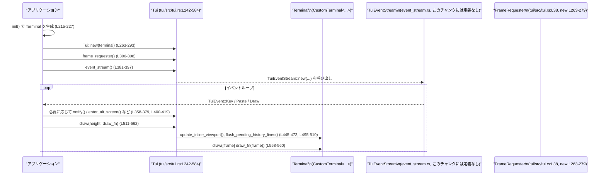

# tui/src/tui.rs コード解説

## 0. ざっくり一言

このモジュールは、crossterm + ratatui ベースの TUI（テキストユーザインターフェイス）の「端末初期化・描画・イベント・通知・alt-screen 管理」を一括して扱うフロントエンドです。  
端末モードの出入りや、Zellij 対応のスクロール処理、外部プロセス実行時の一時復旧などもここで扱います。

---

## 1. このモジュールの役割

### 1.1 概要

このモジュールは **端末上で動作する TUI アプリ** のために、次の問題を解決するために存在します。

- 端末が TTY かどうかの検査と、raw mode / bracketed paste / keyboard enhancement など **端末モードの管理**（`set_modes`, `restore` など）（tui/src/tui.rs:L90-165, L215-227）
- ratatui ベースの `Terminal` の生成と、それをラップした **`Tui` 構造体による描画とイベント処理**（L57, L215-228, L242-584）
- alt-screen への出入りや、Zellij などのマルチプレクサに配慮した **ビューポート管理とスクロール処理**（L398-472, L478-510）
- `tokio` の broadcast チャネルや `tokio_stream::Stream` を用いた **非同期イベントストリームの公開**（L36, L381-397）
- フォーカス状態に応じた **デスクトップ通知の送出**（L58-63, L356-379）

### 1.2 アーキテクチャ内での位置づけ

このファイル内で見える範囲の主要コンポーネントの関係は、次のようになっています。

```mermaid
graph TD
    subgraph "tui/src/tui.rs"
        Init["init (L215-227)"]
        Tui["Tui (L242-584)"]
        EventStream["TuiEventStream\n(event_stream.rs, このチャンクには定義なし)"]
        FrameReq["FrameRequester\n(frame_requester.rs, このチャンクには定義なし)"]
        Term["Terminal = CustomTerminal<CrosstermBackend<Stdout>> (L57)"]
        Notif["DesktopNotificationBackend\n(notifications モジュール)"]
        Job["SuspendContext\n(job_control.rs, unix のみ)"]
    end

    Init --> Term
    Init -->|set_panic_hook| Tui
    Tui -->|保持| Term
    Tui -->|frame_requester()| FrameReq
    Tui -->|event_stream()| EventStream
    Tui -->|notify()| Notif
    Tui -->|suspend_context (unix)| Job
```

- `init` が端末モードを設定し、`Terminal`（`CustomTerminal<CrosstermBackend<Stdout>>`）を生成します（L215-227）。
- アプリケーションはこの `Terminal` を `Tui::new` に渡し、`Tui` インスタンスを得ます（L263-293）。
- `Tui` からは `frame_requester()` と `event_stream()` を通じて描画要求とイベントの非同期ストリームを取得できます（L306-307, L381-397）。
- `notify()` がフォーカス状態に応じて `DesktopNotificationBackend` に通知を委譲します（L356-379）。

### 1.3 設計上のポイント

コードから読み取れる設計上の特徴を列挙します。

- **端末モード管理の一元化**  
  - `set_modes` / `restore` / `restore_keep_raw` / `RestoreMode` で、raw mode や bracketed paste 等をまとめて扱います（L90-179）。  
  - panic 時には専用の `set_panic_hook` で自動的に `restore` を呼び、端末破壊を防いでいます（L229-235）。

- **状態を持つ TUI フロントエンド**  
  - `Tui` 構造体は、端末インスタンス、alt-screen の状態、通知設定、履歴行バッファ、Zellij モードなど多くの状態を保持します（L242-260）。

- **非同期・並行性を意識した設計**  
  - `tokio::sync::broadcast::Sender<()>` を `frame_requester` と共有し、描画トリガを publish-subscribe で配布します（L36, L243-245, L263-279）。
  - イベントストリームは `tokio_stream::Stream<Item = TuiEvent> + Send + 'static` を `Pin<Box<...>>` で返し、非同期タスクで処理できます（L381-397）。
  - `alt_screen_active` / `terminal_focused` は `Arc<AtomicBool>` で共有され、別スレッドからの更新を想定しています（L252-254）。

- **エラーハンドリング方針**  
  - 端末 I/O 系の関数は基本的に `std::io::Result` を返します（例: `set_modes`, `init`, `enter_alt_screen`, `draw`）（L90, L144, L157, L162, L215, L400, L421, L445, L478, L495, L511, L563）。
  - 一部の「任意機能」や復旧系はエラーを明示的に無視し、ログにのみ出力して処理継続する設計です（例: keyboard enhancement flags, alt-scroll の enable/disable, flush 系）（L99-107, L145-148, L152, L183-190, L195-211, L341-347）。

- **プラットフォーム依存処理の分岐**  
  - stdin バッファの flush は `libc::tcflush`（Unix）と `FlushConsoleInputBuffer`（Windows）を `unsafe` で呼び出す OS 依存コードです（L183-211）。
  - `SuspendContext` 付きのジョブ制御は `#[cfg(unix)]` のみ存在し、Windows では利用されません（L45-46, L249-250, L516-521, L546-557）。

---

## 2. 主要な機能一覧

このモジュールが提供する主な機能です。

- **端末モードの設定と復旧**
  - `set_modes` / `restore` / `restore_keep_raw` / `RestoreMode` による raw mode・bracketed paste・keyboard enhancement・フォーカスイベントの on/off（L90-179）。
- **端末初期化**
  - TTY チェック、モード設定、stdin バッファ flush、panic hook 設定、`Terminal` 生成を行う `init`（L215-228）。
- **TUI の中核オブジェクト `Tui`**
  - 端末オブジェクト、イベントブローカー、描画要求チャネル、履歴バッファ、alt-screen 状態などを保持し、描画・イベント・通知を統合します（L242-260, L263-584）。
- **イベントストリームの提供**
  - `Tui::event_stream` により `Stream<Item = TuiEvent>` としてキーボード・ペースト・描画イベントを提供します（L381-397）。
- **alt-screen とインラインビューの切り替え**
  - `enter_alt_screen` / `leave_alt_screen` と、`update_inline_viewport` による inline viewport の高さ変更とスクロール処理（Zellij 対応含む）（L398-472, L478-491）。
- **履歴行の挿入**
  - 端末上部への履歴テキスト挿入 (`insert_history_lines`, `flush_pending_history_lines`) により、通常スクロールバックと共存する UI を実現します（L247-248, L434-440, L492-510）。
- **外部インタラクティブプログラムの実行サポート**
  - `with_restored` により、TUI 内から外部プログラム（例: エディタ）を実行する際に、端末モードを一時的に復旧し、終了後に再設定します（L324-355）。
- **デスクトップ通知**
  - フォーカス状態と設定に応じて通知を送る `notify`（L356-379）。

---

## 3. 公開 API と詳細解説

### 3.1 型一覧（構造体・列挙体など）

| 名前 | 種別 | 役割 / 用途 | 定義位置 |
|------|------|-------------|----------|
| `FrameRequester` | 構造体（re-export） | 描画フレームの要求を行うユーティリティ。`broadcast::Sender<()>` を使って draw トリガを飛ばします（詳細は `frame_requester` モジュール側で定義、ここでは再エクスポートのみ）。 | `pub use self::frame_requester::FrameRequester;`（tui/src/tui.rs:L38） |
| `TARGET_FRAME_INTERVAL` | 定数 (`Duration`) | UI 再描画スケジューリングのためのターゲットフレーム間隔。`frame_rate_limiter::MIN_FRAME_INTERVAL` の別名です。 | L54-55 |
| `Terminal` | 型エイリアス | TUI で使用する端末型。`CustomTerminal<CrosstermBackend<Stdout>>` として ratatui + crossterm backend をラップしています。 | L57 |
| `RestoreMode` | `enum` | 外部プログラム実行前の端末復旧モード。`Full`（raw mode も解除）と `KeepRaw`（raw mode 維持）の 2 種類を提供します。 | L166-171, L172-178 |
| `TuiEvent` | `enum` | イベントストリームで流れるイベントの種類。キーボード入力、ペースト文字列、描画トリガを表します。 | L236-240 |
| `Tui` | 構造体 | TUI アプリケーション本体のフロントエンド。端末、イベントブローカー、描画要求チャネル、alt-screen 状態、通知設定などを持ちます。 | L242-260 |
| `EnableAlternateScroll` | 構造体 | alt-screen 中にホイールを矢印キーに変換するための ANSI シーケンス（`ESC[?1007h`）を出す crossterm `Command` 実装です。 | L110-126 |
| `DisableAlternateScroll` | 構造体 | `EnableAlternateScroll` の逆操作（`ESC[?1007l`）を行う `Command` 実装です。 | L127-143 |

### 3.2 関数詳細（重要な 7 件）

#### 1. `init() -> Result<Terminal>`（tui/src/tui.rs:L215-227）

**概要**

端末が TTY かどうかを確認し、必要なモード設定・stdin バッファ flush・panic hook 設定を行ったうえで、`CustomTerminal<CrosstermBackend<Stdout>>` を生成して返します。

**引数**

なし。

**戻り値**

- `Ok(Terminal)`  
  初期化済みの `Terminal`（`CustomTerminal<CrosstermBackend<Stdout>>`）。
- `Err(std::io::Error)`  
  stdin/stdout が TTY でない、あるいはモード設定や端末生成に失敗した場合。

**内部処理の流れ**

1. `stdin().is_terminal()` / `stdout().is_terminal()` で両者が端末であることを確認し、そうでなければ `Error::other("stdin is not a terminal" / "stdout is not a terminal")` を返します（L216-221）。
2. `set_modes()` を呼び、raw mode / bracketed paste / keyboard enhancement / focus change などを有効化します（L222, L90-109）。
3. `flush_terminal_input_buffer()` を呼び、ターミナルにバッファされたキー入力を OS API でクリアします（L223, L183-211, L212-213）。
4. `set_panic_hook()` で、panic 時に `restore()` を自動呼び出しするフックを設定します（L224, L229-235）。
5. `CrosstermBackend::new(stdout())` で backend を作成し、`CustomTerminal::with_options(backend)` で `Terminal` を生成して返します（L225-227）。

**Examples（使用例）**

```rust
fn main() -> std::io::Result<()> {
    // 端末を初期化（TTY でない場合は Err が返る）
    let terminal = init()?; // tui/src/tui.rs の init を想定（同一クレート内の呼び出し例）

    // Tui 本体を組み立てる
    let mut tui = Tui::new(terminal);

    // ... event loop などを実行 ...

    // 正常終了時に端末モードを戻す場合は restore() を呼び出す
    restore()?;

    Ok(())
}
```

※ 正常終了時に `restore()` を呼ぶべきか、`Terminal` の Drop 実装に任せるべきかは、このチャンクだけでは分かりません。

**Errors / Panics**

- stdin または stdout が端末でない場合、`Error::other` でエラーを返します（L216-221）。
- `set_modes()` で crossterm や raw mode の設定に失敗した場合は、その `std::io::Error` をそのまま返します（L222）。
- `CustomTerminal::with_options` の失敗も `?` で伝播されます（L226-227）。
- panic は内部では発生させていませんが、後続で panic した場合は `set_panic_hook` により `restore()` が呼ばれます（L229-235）。

**Edge cases（エッジケース）**

- TTY でない環境（CI、ファイルリダイレクトなど）では必ず `Err` になります（L216-221）。
- `set_modes()` が途中まで成功してから失敗した場合、どこまでモードが変更されたかはこのコードだけでは分かりません。呼び出し側が `restore()` を呼ぶことで復旧できる想定です。

**使用上の注意点**

- `init` が `Err` を返した場合、端末モードが部分的に変更されている可能性がありますが、どこまでかはこのチャンクでは不明です。安全のためには、必要に応じて `restore()` の呼び出しを検討する必要があります。
- この関数は `tokio` 等のランタイムに依存せず同期的に実行されます。

---

#### 2. `Tui::new(terminal: Terminal) -> Self`（tui/src/tui.rs:L263-293）

**概要**

既に初期化された `Terminal` を受け取り、イベントブローカー・描画要求チャネル・通知設定・Zellij 検出などを初期化した `Tui` インスタンスを作成します。

**引数**

| 引数名 | 型 | 説明 |
|--------|----|------|
| `terminal` | `Terminal` | `init()` などで構築済みの `CustomTerminal<CrosstermBackend<Stdout>>`。 |

**戻り値**

- 新規に初期化された `Tui` 構造体。

**内部処理の流れ**

1. `broadcast::channel(1)` で描画トリガ用のチャネルを作成し、送信側を `draw_tx`、`FrameRequester::new(draw_tx.clone())` で `frame_requester` を作成（L264-265）。
2. `supports_keyboard_enhancement()` を呼び、キーボード拡張機能のサポート有無を `enhanced_keys_supported` にキャッシュ（L266-268）。
3. `supports_color::on_cached` や `crate::terminal_palette::default_colors()` を呼び、色関連の情報をキャッシュ（L269-271）。
4. `codex_terminal_detection::terminal_info()` で端末情報を取得し、multiplexer が `Zellij` かどうかを判定して `is_zellij` に保存（L272-275）。
5. `EventBroker::new()` によりイベントブローカーを生成し、`Arc` でラップ（L277-279）。
6. `alt_screen_active` / `terminal_focused` を `Arc<AtomicBool>` で初期化（L285-286）。
7. デフォルトの通知 backend と通知条件を設定（L288-289）。
8. `alt_screen_enabled` を `true` に設定（L291-292）。

**Examples（使用例）**

```rust
fn setup_tui() -> std::io::Result<Tui> {
    // まず端末を初期化
    let terminal = init()?; // tui/src/tui.rs の init

    // その端末を使って Tui を構築
    let mut tui = Tui::new(terminal);

    // Zellij 等を検出しているため、必要なら alt-screen を無効化も可能
    if tui.is_alt_screen_active() {
        // 必要な処理
    }

    Ok(tui)
}
```

**Errors / Panics**

- `Tui::new` 自体は `Result` を返さず、内部の呼び出しも `unwrap_or(false)` や捨てられた戻り値（`let _ = ...`）を使っているため、ここではエラーを表に出しません（L268-271）。
- `codex_terminal_detection::terminal_info()` 等の内部で panic が起きるかどうかは、このチャンクには現れません。

**Edge cases**

- 端末 multiplexer が `Zellij` の場合は `is_zellij` が `true` となり、後続のスクロール処理が Zellij 用モードに切り替わります（L272-275, L445-472）。
- 通知 backend は `detect_backend(NotificationMethod::default())` を元に初期化されますが、利用可能な backend の種類はこのチャンクからは分かりません（L288）。

**使用上の注意点**

- `Terminal` のライフタイムや所有権は `Tui` に移動し、以降は `Tui` 経由でのみ操作します。
- `Tui` が `Send` / `Sync` かどうかは `CustomTerminal` の実装に依存するため、このチャンクからは判断できません。

---

#### 3. `Tui::event_stream(&self) -> Pin<Box<dyn Stream<Item = TuiEvent> + Send + 'static>>`（tui/src/tui.rs:L381-397）

**概要**

TUI に関連するイベント（キーボード、ペースト、描画トリガなど）を `tokio_stream::Stream` として返します。  
非同期タスク内で `while let Some(ev) = stream.next().await` のようにして利用する想定です。

**引数**

なし（`&self` のみ）。

**戻り値**

- `Pin<Box<dyn Stream<Item = TuiEvent> + Send + 'static>>`  
  - `TuiEvent` を要素とする非同期ストリーム。
  - `Send + 'static` なので、別スレッド上の tokio タスクで使用可能です。

**内部処理の流れ**

- Unix の場合（L382-389）:
  1. `TuiEventStream::new` に `event_broker.clone()`, `draw_tx.subscribe()`, `terminal_focused.clone()`, `suspend_context.clone()`, `alt_screen_active.clone()` を渡してストリームを構築。
  2. それを `Box::pin` して返却。

- 非 Unix の場合（L390-395）:
  1. `TuiEventStream::new` に `event_broker.clone()`, `draw_tx.subscribe()`, `terminal_focused.clone()` を渡してストリームを構築。
  2. それを `Box::pin` して返却。

`TuiEventStream` 自体の実装は `event_stream` モジュールにあり、このチャンクには現れません（L49, L43-44）。

**Examples（使用例）**

```rust
use tokio_stream::StreamExt; // next() 用

async fn run_event_loop(mut tui: Tui) {
    let mut events = tui.event_stream(); // TuiEvent のストリーム

    while let Some(ev) = events.next().await {
        match ev {
            TuiEvent::Key(key) => {
                // キーイベントの処理
            }
            TuiEvent::Paste(text) => {
                // 貼り付けテキストの処理
            }
            TuiEvent::Draw => {
                // 描画要求に応じて frame_requester() 等と組み合わせて描画
            }
        }
    }
}
```

**Errors / Panics**

- `event_stream` 自体は `Result` を返さず、エラーは内部の `TuiEventStream` で扱われます。`TuiEventStream::new` が panic しないかなどはこのチャンクからは分かりません。

**Edge cases**

- Unix / 非 Unix で渡す引数が異なり、Unix の場合のみ `SuspendContext` や `alt_screen_active` が引き回されます（L382-389, L390-395）。
  - これにより、Unix では `Ctrl-Z` による一時停止や alt-screen 状態と連動した挙動が実装されていると推測できますが、詳細は `job_control` / `event_stream` モジュール側にあります（このチャンクには定義がありません）。

**使用上の注意点**

- 返されるストリームは `Send + 'static` なので別タスクで扱えますが、`Tui` 本体の Send/Sync 性は別問題です。`Tui` メソッドと同じスレッドで扱う設計が安全です（この点は型定義がこのチャンクにないため断定できません）。
- `pause_events` / `resume_events` を呼ぶと、内部で `EventStream` を drop/再生成するため、ストリームの有効性に影響があるかどうかは `EventBroker` 実装に依存し、このチャンクからは不明です。

---

#### 4. `Tui::draw(&mut self, height: u16, draw_fn: impl FnOnce(&mut custom_terminal::Frame)) -> Result<()>`（tui/src/tui.rs:L511-562）

**概要**

現在の inline viewport 高さを調整し、履歴行を反映し、必要に応じて Zellij 向けの全再描画を行った上で、`draw_fn` に ratatui のフレームを渡して描画します。  
`stdout().sync_update` を用いて、描画更新を crossterm の「同期更新」としてまとめて実行します。

**引数**

| 引数名 | 型 | 説明 |
|--------|----|------|
| `height` | `u16` | inline viewport の高さ（行数）。画面サイズより大きい場合は画面高さに丸められます（L452-454）。 |
| `draw_fn` | `impl FnOnce(&mut custom_terminal::Frame)` | ratatui のフレームへの描画処理。`Terminal::draw` のクロージャに渡されます（L558-560）。 |

**戻り値**

- `Ok(())`  
  描画が成功した場合。
- `Err(std::io::Error)`  
  端末サイズ取得、スクロール処理、clear、draw など I/O 操作で失敗した場合。

**内部処理の流れ**

1. Unix の場合のみ、`suspend_context.prepare_resume_action` で `Ctrl-Z` 後の復帰アクションを事前に準備（L515-521）。
2. `pending_viewport_area()` を呼び、端末サイズとカーソル位置の変化に基づく viewport のオフセット調整を事前計算（L522-524, L563-583）。
3. `stdout().sync_update(|_| { ... })` を呼び出し、同期更新ブロック内で以下を実行（L525-561）。
   - Unix の場合、`prepared_resume` があれば `prepared.apply(&mut self.terminal)?` で復帰処理を適用（L526-529）。
   - `pending_viewport_area` が `Some` なら、`terminal.set_viewport_area(new_area)` と `terminal.clear()?` を行う（L531-534）。
   - `update_inline_viewport` で inline viewport 高さの変更とスクロール処理を行い、Zellij モードでのスクロールなら `needs_full_repaint = true` にする（L535-537, L445-472）。
   - `flush_pending_history_lines` で履歴バッファを端末に書き出し、Zellij モードなら `needs_full_repaint` に OR（L537-541, L495-510）。
   - `needs_full_repaint` が `true` の場合、`terminal.invalidate_viewport()` で差分描画バッファを無効化（L542-544）。
   - Unix の場合、`suspend_context.set_cursor_y` で `Ctrl-Z` 用のカーソル位置を更新（L545-557）。
   - 最後に `terminal.draw(|frame| draw_fn(frame))` を呼び出して描画（L558-560）。
4. `sync_update` の戻り値（`Result<()>`）を `?` で伝播（L561-562）。

**Examples（使用例）**

```rust
fn simple_draw(tui: &mut Tui) -> std::io::Result<()> {
    let height = 10; // inline viewport を 10 行に

    tui.draw(height, |frame| {
        // custom_terminal::Frame に対する ratatui 描画処理
        // 例: フルスクリーンに単純なテキストを描画
        let size = frame.size();
        frame.render_widget(
            ratatui::widgets::Paragraph::new("Hello TUI"),
            size,
        );
    })
}
```

**Errors / Panics**

- `terminal.size()` / `get_cursor_position()` / `scroll_region_up` / `clear` / `draw` などでエラーが発生すると `std::io::Error` として返ります（L450-451, L462-463, L469-470, L558-560）。
- `sync_update` 内のクロージャは `?` を使うため、エラーが発生すると直ちに外側へ伝播します（L525-562）。
- panic は使用していませんが、`draw_fn` 内で panic した場合の挙動は `Terminal::draw` の実装に依存し、このチャンクからは分かりません。

**Edge cases**

- `height` が 0 の場合、`area.height = height.min(size.height)` により viewport height が 0 になりうる（L453）。その場合の描画挙動は `CustomTerminal` 実装に依存し、このチャンクからは不明です。
- 端末サイズが変わったうえでカーソル位置の `y` が変化した場合、viewport をカーソルに追従させるためオフセットを加算します（L563-580）。これは「iTerm2 ではうまく動く」ことを意図したヒューリスティックです（コメント L571-573）。

**使用上の注意点**

- `draw` は同期 I/O を行うため、高頻度で呼ぶ場合は `FrameRequester` とフレームレート制御（`TARGET_FRAME_INTERVAL`）と組み合わせる前提に見えます（`frame_rate_limiter` モジュールの詳細はこのチャンクにありません）。
- `draw_fn` の中では `Tui` を再度借用しないように注意が必要です（`&mut self` で `terminal.draw` に入っているため）。

---

#### 5. `Tui::with_restored<R, F, Fut>(&mut self, mode: RestoreMode, f: F) -> R`（非同期）  

（tui/src/tui.rs:L329-355）

**概要**

TUI 実行中に外部のインタラクティブプログラム（例: エディタやシェル）を実行するために、  
一時的に crossterm のイベントストリームを停止し、端末モードを復旧（raw mode の解除など）してから `f().await` を実行し、終了後に TUI 用のモードを再設定してイベントを再開します。

**シグネチャ**

```rust
pub async fn with_restored<R, F, Fut>(&mut self, mode: RestoreMode, f: F) -> R
where
    F: FnOnce() -> Fut,
    Fut: Future<Output = R>,
```

**引数**

| 引数名 | 型 | 説明 |
|--------|----|------|
| `mode` | `RestoreMode` | `Full` か `KeepRaw` のいずれか。外部プログラム実行前にどこまで端末状態を復旧するかを指定します（L167-171, L341-343）。 |
| `f` | `FnOnce() -> Fut` | 実行する外部処理を返すクロージャ。返される `Fut` は `Future<Output = R>` を満たします（L329-333）。 |

**戻り値**

- `f().await` の戻り値 `R` をそのまま返します（L344, L353-354）。

**内部処理の流れ**

1. `self.pause_events()` で crossterm の `EventStream` を停止し、stdin 競合を避けます（L334-335, L316-318）。
2. 現在 alt-screen が有効かどうかを `was_alt_screen` に保存し、有効なら `leave_alt_screen()` で alt-screen を出ます（L337-340）。
3. `mode.restore()` を呼び、指定モードに従って端末状態を復旧します。失敗した場合は `tracing::warn!` で警告ログを出すだけで処理は続行します（L341-343, L172-178）。
4. `let output = f().await;` で外部処理を実行（L344）。
5. 終了後、`set_modes()` で TUI 用の端末モードを再度有効化します。これが失敗しても警告ログのみ（L345-347）。
6. `flush_terminal_input_buffer()` を呼び、外部プログラム実行中に発生したキー入力を破棄します（L348-349）。
7. もともと alt-screen だった場合は `enter_alt_screen()` を再度実行（エラーは無視）（L350-352）。
8. `self.resume_events()` でイベントストリームを再開し、`output` を返します（L353-354）。

**Examples（使用例）**

```rust
async fn edit_file_with_external_editor(tui: &mut Tui, path: &str) -> std::io::Result<()> {
    // raw mode も含めて完全に復旧してから外部エディタを起動
    tui.with_restored(RestoreMode::Full, || async move {
        // ここで外部プログラムを起動する（例：`std::process::Command`）
        std::process::Command::new("vim")
            .arg(path)
            .status()
            .expect("failed to start editor");
    }).await;

    // 戻ってきたら TUI 用の端末モードとイベントが再設定された状態
    Ok(())
}
```

**Errors / Panics**

- `mode.restore()` / `set_modes()` のエラーは `tracing::warn!` ログに出力されるだけで、呼び出し元には伝播しません（L341-343, L345-347）。  
  そのため呼び出し元は「端末モードの復旧に失敗した可能性」を考慮する必要があります。
- `enter_alt_screen()` / `leave_alt_screen()` の戻り値は `_ =` で捨てており、ここでもエラーは無視されます（L339-340, L351-352）。

**Edge cases**

- 外部処理 `f` 内で panic が発生した場合でも、`with_restored` の最後の `self.resume_events()` まで到達するかどうかは保証されません。panic 時の挙動全体は `panic` の伝播に依存します。
- `with_restored` 実行中に `mode.restore()` が失敗した場合、端末は中途半端な状態のまま外部プログラムが動作する可能性があります（L341-343）。

**使用上の注意点**

- `with_restored` は `async` 関数なので、tokio などの非同期ランタイム上から `await` する必要があります。
- 外部処理の間は `pause_events` により crossterm の stdin 読み取りが停止しているため、外部プログラムで標準入力を使うことができます。
- 端末モード再設定に失敗してもエラーは返されないため、ログ（`tracing`）の監視が重要です。

---

#### 6. `Tui::enter_alt_screen(&mut self) -> Result<()>` / `leave_alt_screen(&mut self) -> Result<()>`（tui/src/tui.rs:L400-419, L421-433）

**概要**

`enter_alt_screen` は crossterm の alt-screen に入り、viewport をフルスクリーンに拡張し、以前の inline viewport を保存します。  
`leave_alt_screen` は alt-screen から戻り、保存しておいた inline viewport を復元します。

**引数**

なし（`&mut self` のみ）。

**戻り値**

- `Ok(())`  
  切り替えが成功した場合。
- `Err(std::io::Error)`  
  `terminal.size()` や `clear()` など I/O 操作の失敗時。

**内部処理の流れ（enter_alt_screen）**

1. `alt_screen_enabled` が `false` の場合は何もせず `Ok(())` を返す（L401-403）。
2. `execute!(self.terminal.backend_mut(), EnterAlternateScreen)` で alt-screen モードに入る（エラーは無視）（L404）。
3. `EnableAlternateScroll` コマンド（`ESC[?1007h`）を送って「alternate scroll」を有効化（エラーは無視）（L405-406, L110-126）。
4. `self.terminal.size()` を取得し成功した場合、現在の `viewport_area` を `alt_saved_viewport` に保存し、画面全体をカバーする viewport に設定し、`clear()` を呼ぶ（L407-416）。
5. `alt_screen_active` フラグを `true` に設定（L417）。
6. `Ok(())` を返す（L418-419）。

**内部処理の流れ（leave_alt_screen）**

1. `alt_screen_enabled` が `false` の場合は何もせず `Ok(())`（L422-424）。
2. `DisableAlternateScroll`（`ESC[?1007l`）と `LeaveAlternateScreen` コマンドを backend に送る（エラーは無視）（L425-427, L127-143）。
3. `alt_saved_viewport` に以前の inline viewport が保存されていれば、それを `set_viewport_area` で復元（L428-430）。
4. `alt_screen_active` フラグを `false` に設定（L431）。
5. `Ok(())` を返す（L432-433）。

**Examples（使用例）**

```rust
fn show_fullscreen_view(tui: &mut Tui) -> std::io::Result<()> {
    tui.enter_alt_screen()?; // alt-screen に入る

    tui.draw(0, |frame| {
        // フルスクリーン用の UI を描画
        let size = frame.size();
        frame.render_widget(
            ratatui::widgets::Paragraph::new("Fullscreen View"),
            size,
        );
    })?;

    tui.leave_alt_screen()?; // 元の inline viewport に戻る
    Ok(())
}
```

**Errors / Panics**

- `execute!` のエラーは `_ =` で無視しているため、alt-screen に入れなかった場合でも `Ok(())` が返る可能性があります（L404-407, L425-427）。
- `terminal.size()` や `terminal.clear()` のエラーは `?` によって呼び出し元に伝播します（L407-416）。

**Edge cases**

- `alt_screen_enabled` が `false` の場合、両メソッドとも no-op になります（L401-403, L422-424）。Zellij などで alt-screen が望ましくない場合に利用されます（L294-297, コメント L259-260）。
- `enter_alt_screen` 実行時に `terminal.size()` が `Err` の場合、`alt_saved_viewport` には何も保存されず viewport も変更されません（L407-416）。

**使用上の注意点**

- `enter_alt_screen` は `is_zellij` フラグとは独立して `alt_screen_enabled` で制御されます。Zellij 環境では `set_alt_screen_enabled(false)` が前提となる設計に見えます（L294-297, L272-275）。
- alt-screen 中の描画ではスクロールバックが使えないため、履歴ラインを保持したい場合は inline viewport モードとの切り替え方針を事前に設計しておく必要があります。

---

#### 7. `Tui::notify(&mut self, message: impl AsRef<str>) -> bool`（tui/src/tui.rs:L358-379）

**概要**

現在の端末フォーカス状態と通知条件 (`NotificationCondition`) に基づいて、デスクトップ通知を送信します。  
成功すると `true` を返し、失敗や条件不一致の場合は `false` を返します。

**引数**

| 引数名 | 型 | 説明 |
|--------|----|------|
| `message` | `impl AsRef<str>` | 通知メッセージ文字列。内部で `String` に変換して backend に渡されます（L366-367）。 |

**戻り値**

- `true` — 通知が送信された場合（L367-368）。
- `false` — 条件不一致、backend 未設定、あるいは送信エラー発生時（L359-365, L375-378）。

**内部処理の流れ**

1. `terminal_focused.load(Ordering::Relaxed)` で端末がフォーカスされているかを取得（L359）。
2. `should_emit_notification(self.notification_condition, terminal_focused)` で送信すべきか判定（L360-361, L58-63）。
   - `NotificationCondition::Unfocused` なら「フォーカスされていないときのみ」。
   - `NotificationCondition::Always` なら常に送信。
3. 通知不要なら `false` を返す（L361-362）。
4. `self.notification_backend.as_mut()` から backend を取り出し、なければ `false`（L363-365）。
5. `backend.notify(&message)` を呼び、成功なら `true` を返す（L366-368）。
6. 失敗した場合は `tracing::warn!` でエラーと method をログ出力し、`self.notification_backend = None` として今後の通知を無効化した上で `false` を返す（L369-377）。

**Examples（使用例）**

```rust
fn notify_when_done(tui: &mut Tui) {
    // 処理が終わったら通知（フォーカス状態と設定に応じて送信される）
    if !tui.notify("処理が完了しました") {
        // 通知が送信されなかった場合のフォールバック（ログ表示など）
        eprintln!("notification was not sent");
    }
}
```

**Errors / Panics**

- 通知 backend の `notify` がエラーを返した場合、`tracing::warn!` にログを出し、backend を無効化して `false` を返します（L369-377）。
- 例外（panic）制御は行っておらず、panic が起きるかどうかは `DesktopNotificationBackend` 実装に依存します。

**Edge cases**

- `NotificationCondition::Unfocused` のときは `terminal_focused == true` なら通知されません（L58-63, tests L64-89）。
- backend が一度エラーを返すと `self.notification_backend = None` となり、それ以降は常に `false` を返すようになります（L373-377）。

**使用上の注意点**

- フォーカス状態 (`terminal_focused`) は `TuiEventStream` 側で crossterm イベントから更新されると推測されますが、その実装はこのチャンクには現れません。
- 通知が送信されなかった理由（条件・backend 未設定・エラー）は戻り値からは区別できません。詳細を知りたい場合は `tracing` ログを見る必要があります。

---

### 3.3 その他の関数・メソッド一覧

公開 API と主要な内部ヘルパーを一覧にします。

| 名前 | 種別 | 役割（1 行） | 定義位置 |
|------|------|--------------|----------|
| `set_modes() -> Result<()>` | 関数 | bracketed paste, raw mode, keyboard enhancement, focus change を有効化する端末モード設定（失敗時は Err）。 | L90-109 |
| `restore() -> Result<()>` | 関数 | `set_modes` の逆操作として、raw mode を含む端末モードを復旧します。 | L155-160 |
| `restore_keep_raw() -> Result<()>` | 関数 | raw mode を維持したまま、その他の端末モードを復旧します。 | L161-165 |
| `RestoreMode::restore(self) -> Result<()>` | メソッド | `Full` / `KeepRaw` に応じて `restore` / `restore_keep_raw` を呼び分けます（内部利用）。 | L172-178 |
| `flush_terminal_input_buffer()` | 関数 | OS ごとの API（`tcflush` / `FlushConsoleInputBuffer`）で stdin の入力バッファを破棄します（エラーは `tracing::warn!` ログのみ）。 | L180-211, L212-213 |
| `set_panic_hook()` | 関数 | panic hook を差し替え、panic 発生時に `restore()` を呼んで端末を復旧させた後、元の hook を呼ぶようにします。 | L229-235 |
| `should_emit_notification(...) -> bool` | 関数 | 通知条件とフォーカス状態に基づいて通知送出可否を判定します（テスト付き）。 | L58-63, L64-89 |
| `Tui::set_alt_screen_enabled(&mut self, bool)` | メソッド | alt-screen への出入りを全体的に無効化／有効化します。Zellij 対応用。 | L294-297 |
| `Tui::set_notification_settings(&mut self, method, condition)` | メソッド | 通知 backend と条件を更新します。 | L298-305 |
| `Tui::frame_requester(&self) -> FrameRequester` | メソッド | 描画要求を発行するための `FrameRequester` のクローンを返します。 | L306-308 |
| `Tui::enhanced_keys_supported(&self) -> bool` | メソッド | 端末が keyboard enhancement flags をサポートしているかを返します。 | L309-311 |
| `Tui::is_alt_screen_active(&self) -> bool` | メソッド | 現在 alt-screen 中かどうかを返します（`AtomicBool` を読み取る）。 | L312-314 |
| `Tui::pause_events(&mut self)` | メソッド | `EventBroker` を通じて crossterm の `EventStream` を停止します。 | L315-318 |
| `Tui::resume_events(&mut self)` | メソッド | 一時停止していた `EventStream` を再開します。 | L319-323 |
| `Tui::insert_history_lines(&mut self, Vec<Line<'static>>)` | メソッド | 履歴用テキストをバッファに追加し、次回描画フレームをスケジュールします。 | L434-437 |
| `Tui::clear_pending_history_lines(&mut self)` | メソッド | 履歴行バッファをクリアします。 | L438-440 |
| `Tui::update_inline_viewport(...) -> Result<bool>` | メソッド（private） | inline viewport の高さを変更し、必要ならスクロール処理を行います。Zellij モード時は raw newline スクロールと再描画フラグを返します。 | L445-472 |
| `Tui::scroll_zellij_expanded_viewport(...) -> Result<()>` | メソッド（private） | Zellij で DECSTBM 非対応なため、raw newline によるスクロールを行います。 | L478-491 |
| `Tui::flush_pending_history_lines(...) -> Result<bool>` | メソッド（private） | バッファされた履歴行を `insert_history` モジュール経由で端末上部に挿入し、Zellij モードならフル再描画が必要であることを示します。 | L495-510 |
| `Tui::pending_viewport_area(&mut self) -> Result<Option<Rect>>` | メソッド（private） | 画面サイズとカーソル位置の変化に基づき、viewport をカーソルに追従させるためのオフセットを計算します。 | L563-583 |

---

## 4. データフロー

ここでは、「通常の event loop における描画とイベント処理」のデータフローを簡略的に示します。

### 処理の要点

1. アプリケーションは `init()` で `Terminal` を初期化し、`Tui::new` で `Tui` を構築します（L215-227, L263-293）。
2. `Tui::event_stream()` から `Stream<Item = TuiEvent>` を取得し、非同期タスクでイベントを受信します（L381-397）。
3. 描画が必要になったら、`FrameRequester` などを使って draw 要求を出し、`Tui::draw()` を呼び出して描画します（L306-308, L511-562）。
4. alt-screen の切り替えや通知などは `Tui` のメソッドで制御されます。

### シーケンス図（描画とイベント処理）



この図で `TuiEventStream` や `FrameRequester` の内部実装はこのチャンクには現れないため、省略されています。

---

## 5. 使い方（How to Use）

### 5.1 基本的な使用方法

最も基本的な流れは「端末初期化 → `Tui` 構築 → イベントループで `event_stream` と `draw` を駆動」です。

```rust
use std::io::Result;
use tokio_stream::StreamExt; // next() 用

async fn run_app() -> Result<()> {
    // 1. 端末を初期化
    let terminal = init()?; // tui/src/tui.rs:L215-227

    // 2. Tui 本体を構築
    let mut tui = Tui::new(terminal); // L263-293

    // 3. イベントストリームと frame requester を取得
    let mut events = tui.event_stream(); // L381-397
    let frame_req = tui.frame_requester(); // L306-308

    // 4. 最初の描画
    frame_req.schedule_frame(); // FrameRequester の API はこのチャンクには出てきません

    // 5. イベントループ
    while let Some(ev) = events.next().await {
        match ev {
            TuiEvent::Key(key) => {
                // キー入力に応じて状態を更新し、描画が必要なら frame_req.schedule_frame()
            }
            TuiEvent::Paste(text) => {
                // 貼り付けテキスト処理
            }
            TuiEvent::Draw => {
                // Draw イベントを受けて実際に描画する
                tui.draw(10, |frame| {
                    // ここに ratatui ウィジェット描画処理を書く
                    let size = frame.size();
                    frame.render_widget(
                        ratatui::widgets::Paragraph::new("Hello"),
                        size,
                    );
                })?;
            }
        }
    }

    // 正常終了時の端末復旧（必要に応じて）
    restore()?; // L155-160

    Ok(())
}
```

※ `FrameRequester` や `TuiEventStream` の詳細な API はこのチャンクに現れないため、実際の呼び出し方法はそれらの定義を参照する必要があります。

### 5.2 よくある使用パターン

#### パターン 1: 外部エディタを開く

```rust
async fn edit_file(mut tui: Tui, path: &str) -> std::io::Result<()> {
    // raw mode も含めて完全復旧してから外部エディタを起動
    tui.with_restored(RestoreMode::Full, || async move {
        std::process::Command::new("vim")
            .arg(path)
            .status()
            .expect("failed to start editor");
    }).await;

    // 戻ってきたら TUI モード復帰済み
    Ok(())
}
```

#### パターン 2: Zellij などで alt-screen を無効化

```rust
fn setup_for_zellij(mut tui: Tui) -> Tui {
    // Zellij では scrollback を活用するため alt-screen を無効化
    tui.set_alt_screen_enabled(false); // L294-297
    tui
}
```

#### パターン 3: 処理完了時の通知

```rust
fn do_work_and_notify(tui: &mut Tui) {
    // 重い処理...（省略）

    // フォーカス状態と設定に応じて通知
    if !tui.notify("ジョブが完了しました") {
        // 通知できなかった場合のフォールバック
        eprintln!("notification was not sent");
    }
}
```

### 5.3 よくある間違い

```rust
// ❌ 間違い例: init() を通さずに Tui を使う
fn wrong_usage() {
    // CustomTerminal を直接作成してしまう（ここでは仮の例）
    // let backend = CrosstermBackend::new(std::io::stdout());
    // let terminal = CustomTerminal::new(backend);

    // そのまま Tui::new に渡すと、set_modes() や panic hook 設定が行われていない
    // let mut tui = Tui::new(terminal);
}

// ✅ 正しい例: init() で端末とモードを初期化してから Tui を構築
fn correct_usage() -> std::io::Result<()> {
    let terminal = init()?;      // モード設定 + stdin flush + panic hook 設定
    let mut tui = Tui::new(terminal);
    // ...
    Ok(())
}
```

```rust
// ❌ 間違い例: with_restored を await せずに呼び出す
async fn wrong_with_restored(tui: &mut Tui) {
    // コンパイルエラー: async fn は .await が必要
    // tui.with_restored(RestoreMode::Full, || async { /* ... */ });
}

// ✅ 正しい例
async fn correct_with_restored(tui: &mut Tui) {
    tui.with_restored(RestoreMode::Full, || async {
        // 外部処理
    }).await;
}
```

### 5.4 使用上の注意点（まとめ）

- **TTY 前提**  
  - `init()` は stdin / stdout が端末でないと `Err` を返します（L216-221）。CLI ツールがファイルリダイレクトされる場合の扱いは設計時に決める必要があります。
- **端末モードの復旧**  
  - panic 時は `set_panic_hook` により `restore()` が呼ばれますが（L229-235）、正常終了時は明示的に `restore()` ないし `RestoreMode::Full` を使って復旧する設計が安全です。
- **非同期・並行性**  
  - `event_stream()` は `Send + 'static` なストリームを返しますが、`Tui` 自体がスレッドセーフかどうかはこのチャンクからは不明です。基本的には単一スレッド（メインスレッド）上で `Tui` を操作し、イベント処理のみを別タスクで行う構成が安全です。
- **Zellij 対応**  
  - Zellij 環境では DECSTBM によるスクロールがサポートされないため、Zellij 用スクロールモード（`scroll_zellij_expanded_viewport`）が使われます（L458-460, L478-491）。この場合、ラスタライズ差分を無効化してフル再描画が必要になります（L535-542）。
- **エラー無視箇所の存在**  
  - keyboard enhancement flags の設定や alt-scroll コマンドなど、一部の機能はエラーを無視して続行します（L99-107, L404-407, L425-427）。これにより TUI は動作し続けますが、利用できない機能があっても検出しづらい点に注意が必要です。
- **unsafe の使用**  
  - `flush_terminal_input_buffer` は OS API を `unsafe` で呼び出しますが、戻り値は `tracing::warn!` でログ出力するだけで上位には伝播しません（L183-211）。セキュリティ的には OS 標準 API のラッパーに留まっており、それ以上の権限操作は行っていません。

---

## 6. 変更の仕方（How to Modify）

### 6.1 新しい機能を追加する場合

例として、「新しい通知条件 `NotificationCondition` を追加する」場合を考えます。

1. **設定型の拡張**  
   - `NotificationCondition` 自体は `codex_config::types` にあります。このチャンクには定義がないため、そちらで enum を拡張する必要があります。
2. **判定ロジックの更新**  
   - `should_emit_notification`（L58-63）に新しいパターンを追加し、`Tui::notify` はこの関数を通じているため、`notify` 側の変更は不要です。
3. **テスト追加**  
   - 既存のテストモジュール（L64-89）に、新しい条件に対応するテスト関数を追加します。

別の例として「新しい `TuiEvent` バリアントを追加する」場合:

1. `TuiEvent` enum に新しい variant を追加（L237-240）。
2. `TuiEventStream`（`event_stream` モジュール）側で、そのイベント種別を生成するコードを追加。
3. イベントループ側の `match` 文を拡張して新しい variant を扱う。

### 6.2 既存の機能を変更する場合

- **端末モード関連（`set_modes` / `restore`）を変更する場合**
  - 影響範囲:
    - `init()`（L215-227）
    - `with_restored()`（L329-355）
    - panic hook（L229-235）
  - 変更時には、TUI がどの段階でどのモード状態になっているかの「契約」を整理し、`RestoreMode` の意味が変わらないように注意する必要があります。

- **描画フロー（`draw`, `update_inline_viewport`, `flush_pending_history_lines`）を変更する場合**
  - 影響範囲:
    - Zellij 向けの挙動（`is_zellij`, `scroll_zellij_expanded_viewport`）（L272-275, L445-472, L478-491）
    - 履歴挿入ロジック（`insert_history` モジュール）（L495-510）
  - スクロール方法を変えると ratatui の diff バッファとの整合性が崩れる可能性があり、その場合は `invalidate_viewport` の呼び出しタイミングを見直す必要があります（L535-542）。

- **イベント系（`event_stream`, `pause_events`, `resume_events`）を変更する場合**
  - 影響範囲:
    - `with_restored` による一時停止・再開（L334-335, L353-354）
    - `EventBroker` / `TuiEventStream` の実装（`event_stream` モジュール）
  - stdin 競合やイベントロストを避けるため、`pause_events` が何を保証しているかを確認した上で変更する必要があります。

---

## 7. 関連ファイル

このモジュールと密接に関係するファイル・ディレクトリ（このチャンクに名前だけ現れるもの）を一覧にします。

| パス | 役割 / 関係 |
|------|------------|
| `tui/src/event_stream.rs` | `EventBroker` と `TuiEventStream` を定義し、crossterm の `EventStream` から `TuiEvent` を生成する役割と見られます（L43-44, L49）。実装はこのチャンクには現れません。 |
| `tui/src/frame_rate_limiter.rs` | `MIN_FRAME_INTERVAL` を定義し、`TARGET_FRAME_INTERVAL` を通じてフレームレートを制御します（L49-55）。 |
| `tui/src/frame_requester.rs` | `FrameRequester` の実装ファイル。`Tui::new` で描画用 broadcast チャネルと共に利用されます（L38, L263-279）。 |
| `tui/src/job_control.rs`（unixのみ） | `SuspendContext` を定義し、`Ctrl-Z` などのジョブ制御時に TUI の中断・再開処理を補助します（L45-46, L249-250, L516-521, L546-557）。 |
| `crate::custom_terminal` | `CustomTerminal` 型と `Frame` 型を提供し、ratatui の `Terminal` をラップして拡張機能（viewport 管理など）を追加していると見られます（L39-41, L247-248, L281-283, L445-472, L511-562, L563-583）。このチャンクには定義がありません。 |
| `crate::notifications` | `DesktopNotificationBackend` と `detect_backend` を提供し、異なる通知方法（OS ネイティブ通知など）を抽象化します（L41-42, L256-257, L288-289, L356-379）。 |
| `crate::insert_history` | `insert_history_lines_with_mode` と `InsertHistoryMode` を提供し、履歴行バッファを端末上部に挿入する機能を実装しています（L503-507）。 |
| `crate::terminal_palette` | `default_colors()` を提供し、端末のカラーパレットを初期化する処理を持ちます（L270-271）。 |
| `codex_config::types` | `NotificationCondition` / `NotificationMethod` を定義し、通知の条件や手段を構成します（L47-48, L58-63, L298-305, L356-379）。 |
| `codex_terminal_detection` | 現在の端末の multiplexer（Zellij など）を検出するためのユーティリティを提供します（L272-275）。 |

これらのファイルの具体的な中身はこのチャンクには現れないため、実際の挙動を確認するには該当ファイルを参照する必要があります。
