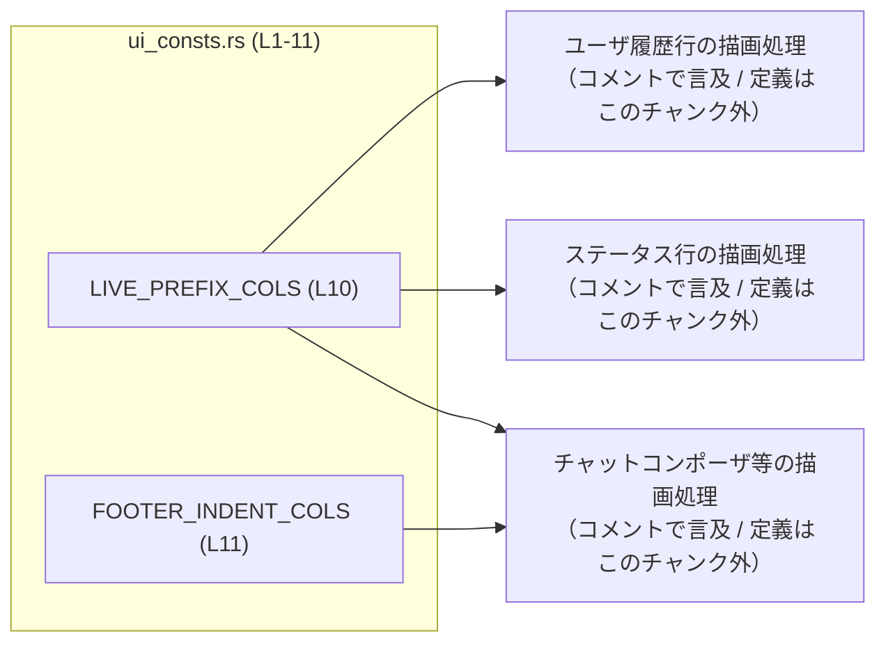
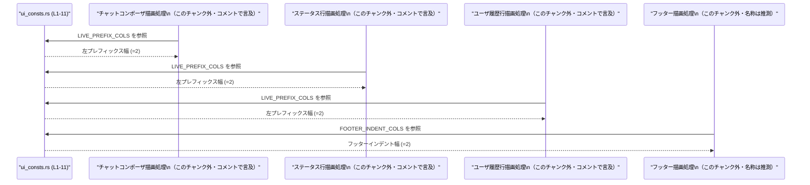

# tui/src/ui_consts.rs

## 0. ざっくり一言

TUI（テキストユーザインターフェース）のレイアウトを揃えるための「左側プレフィックス幅」と、その幅に基づくフッターのインデント幅を定義する共有定数モジュールです。  
（根拠: ファイル先頭のモジュールコメントと定数定義 `tui/src/ui_consts.rs:L1-1, L10-11`）

---

## 1. このモジュールの役割

### 1.1 概要

- このモジュールは、TUI 内で共通して使われる「左側の余白（ガター／プレフィックス）」の幅を定数としてまとめる役割を持ちます。  
  （根拠: `//! Shared UI constants for layout and alignment within the TUI.` `tui/src/ui_consts.rs:L1-1`）
- 特に、チャット入力欄（chat composer）、ステータス行、ユーザ履歴行などで、左側の境界線やプレフィックス部分をそろえるための列数を表現しています。  
  （根拠: コメント中の "Chat composer" / "Status indicator lines" / "User history lines" `tui/src/ui_consts.rs:L7-9`）
- 左プレフィックスの列数を `LIVE_PREFIX_COLS` として定義し、その値を `usize` 型に変換した `FOOTER_INDENT_COLS` をフッターインデント用に再利用しています。  
  （根拠: `pub(crate) const LIVE_PREFIX_COLS: u16 = 2;` および `pub(crate) const FOOTER_INDENT_COLS: usize = LIVE_PREFIX_COLS as usize;` `tui/src/ui_consts.rs:L10-11`）

### 1.2 アーキテクチャ内での位置づけ

このモジュール自体は状態を持たず、`pub(crate)` な定数を通じて、同一クレート内の他モジュールから参照される形で利用されることが想定されます。具体的な利用側モジュールや関数名はこのチャンクには現れませんが、コメントから次のような利用者が示唆されています。  
（根拠: 利用例を列挙したドキュメンテーションコメント `tui/src/ui_consts.rs:L7-9`）

- チャットコンポーザ（chat composer）
- ステータスインジケータ行（status indicator lines）
- ユーザ履歴行（user history lines）

これを抽象化した依存関係図は次のようになります（利用側はコメントから推測される概念であり、具体的な型・関数はこのチャンクには現れません）。



> 注: 上記図の「描画処理」ノードはコメントに現れる役割を抽象化したものであり、実際のモジュール・関数名はこのチャンクには現れません。

### 1.3 設計上のポイント

- **責務の分割**  
  - レイアウトに関する数値（左プレフィックス幅）を定数として集中管理する構造になっています。  
    （根拠: 「Shared UI constants」という説明と定数定義のみで構成されるファイル構成 `tui/src/ui_consts.rs:L1-1, L10-11`）
- **状態を持たない**  
  - いずれも `const` であり、ミュータブルな状態やランタイムロジックは存在しません。  
    （根拠: `pub(crate) const ...` のみ定義されている `tui/src/ui_consts.rs:L10-11`）
- **値の再利用**  
  - `FOOTER_INDENT_COLS` は `LIVE_PREFIX_COLS` を `usize` にキャストした値であり、片方を変更すればもう片方が自動的に追随します。  
    （根拠: `FOOTER_INDENT_COLS: usize = LIVE_PREFIX_COLS as usize;` `tui/src/ui_consts.rs:L11-11`）
- **可視性**  
  - どちらの定数も `pub(crate)` であり、クレート内からは参照可能ですが、クレート外には公開されません。  
    （根拠: `pub(crate)` 修飾子 `tui/src/ui_consts.rs:L10-11`）

---

## 2. 主要な機能一覧

このファイルには関数は存在せず、2 つの定数のみが定義されています。機能レベルでは次の 2 点に集約されます。  
（根拠: `tui/src/ui_consts.rs:L3-11`）

- 左プレフィックス幅の共有定義: `LIVE_PREFIX_COLS` により、TUI の左ガター／プレフィックスに使う列数（ここでは 2 列）を共有します。
- フッターインデント幅の共有定義: `FOOTER_INDENT_COLS` により、フッターなどのインデントを `LIVE_PREFIX_COLS` と同じ幅で扱えるようにします。

---

## 3. 公開 API と詳細解説

### 3.0 コンポーネントインベントリー（関数・型・定数）

#### 型・関数

このファイルには構造体・列挙体・関数は定義されていません。  
（根拠: 全行がコメントと `const` 定義のみである `tui/src/ui_consts.rs:L1-11`）

#### 定数一覧

| 名前 | 種別 | 型 | 値 | 説明 | 根拠 |
|------|------|----|----|------|------|
| `LIVE_PREFIX_COLS` | 定数 | `u16` | `2` | ライブセルや整列されたウィジェットが使う左ガター／プレフィックスの列数 | コメントと定義 `tui/src/ui_consts.rs:L3-4, L10` |
| `FOOTER_INDENT_COLS` | 定数 | `usize` | `LIVE_PREFIX_COLS as usize` | フッターなどで使うインデント幅。`LIVE_PREFIX_COLS` と同じ幅を `usize` で再利用 | 定義 `tui/src/ui_consts.rs:L11` |

### 3.1 型一覧（構造体・列挙体など）

- 該当する型はありません。  
  （根拠: `tui/src/ui_consts.rs:L1-11`）

### 3.2 定数の詳細解説（関数テンプレートを定数に適用）

#### 定数 `LIVE_PREFIX_COLS: u16`

**概要**

- 端末上の「左側ガター／プレフィックス」に予約される列数（カラム数）を表す定数です。現在は 2 列に設定されています。  
  （根拠: 「Width (in terminal columns) reserved for the left gutter/prefix …」というコメントと値 `2` `tui/src/ui_consts.rs:L3-4, L10`）

**型・値**

- 型: `u16`  
  - 正の整数（0〜65535）で表現される列数を持てる型です。
- 値: `2`  
  - 左ガターに 2 列を予約する設定になっています。  
    （根拠: `pub(crate) const LIVE_PREFIX_COLS: u16 = 2;` `tui/src/ui_consts.rs:L10`）

**セマンティクス（意味）**

コメントにより、次のような意味付けがされています。  
（根拠: 「Semantics:」以下の箇条書き `tui/src/ui_consts.rs:L6-9`）

- チャットコンポーザ（chat composer）は、左境界線＋パディングにこの列数を予約する。
- ステータスインジケータ行（status indicator lines）は、先頭にこの列数ぶんのスペースを置いて整列する。
- ユーザ履歴行（user history lines）は、折り返し時に `"▌ "` などのプレフィックスがこの列数ぶんの幅を占める前提で計算する。

**安全性・エラー・並行性**

- `const` 定義であり、実行時に評価される式や I/O を含まないため、ランタイムエラーを起こす要素はありません。  
  （根拠: 単純なリテラル定数 `tui/src/ui_consts.rs:L10`）
- グローバルな不変値であり、スレッドから共有しても書き換え不能なので、レースコンディションなどの並行性の問題は発生しません（Rust の `const` はコンパイル時定数であり、共有しても変更できないためです）。

**Edge cases（エッジケース）**

- この定数は固定値であり、外部入力に依存しません。そのため「空入力」「境界値」といった概念的なエッジケースは存在しません。
- 値そのものが 0 や極端に大きい数であった場合の挙動は、このファイルだけからは読み取れません。レイアウト処理側がこの値をどのように扱うかは、このチャンクには現れません。

**使用上の注意点**

- レイアウトの左側プレフィックス幅を計算するときは、この定数を直接参照することが前提になっていると読めます。コメントで複数のコンポーネントが同じ値を共有する前提が書かれているためです。  
  （根拠: 同じ値を chat composer / status lines / history lines が共有するというコメント `tui/src/ui_consts.rs:L7-9`）
- 他のモジュールで同じ値（2）をハードコードすると、この定数の値を変更したときに整合性が崩れる可能性がありますが、そのようなハードコードの有無はこのチャンクからは分かりません。

#### 定数 `FOOTER_INDENT_COLS: usize`

**概要**

- フッターのインデント幅を表す定数で、`LIVE_PREFIX_COLS` と同じ列数を `usize` 型で表現したものです。  
  （根拠: `pub(crate) const FOOTER_INDENT_COLS: usize = LIVE_PREFIX_COLS as usize;` `tui/src/ui_consts.rs:L11`）

**型・値**

- 型: `usize`  
  - コレクションのインデックスやバッファ長に使われる、プラットフォーム依存の符号なし整数型です。配列インデックスなどにそのまま使えるのが利点です。
- 値: `LIVE_PREFIX_COLS as usize`  
  - `LIVE_PREFIX_COLS` の値（現在 2）を `usize` にキャストした値になります。  
    （根拠: `tui/src/ui_consts.rs:L10-11`）

**セマンティクス（意味）**

- 名前と値の導出関係から、「フッターのインデントに使う列数を、左プレフィックス幅と同じ値にそろえる」意図が読み取れます。  
  （根拠: 名前 `FOOTER_INDENT_COLS` と `LIVE_PREFIX_COLS` からのキャスト `tui/src/ui_consts.rs:L11`）

**安全性・エラー・並行性**

- 右辺は単純な数値キャストであり、パニックやエラーにはなりません。  
  - Rust における `as` キャストは、数値型間の変換においてエラーを返さず常に完了します（ただしビット幅が狭くなるキャストでは値が切り詰められ得ます）。
  - このコードでは `u16 -> usize` のキャストであり、一般的な 32bit / 64bit 環境では `usize` の方が同等以上のビット幅を持つため、情報が失われるケースは通常想定されません。
- こちらも `const` であり、不変のグローバル値としてスレッド間で安全に共有できます。

**Edge cases（エッジケース）**

- `LIVE_PREFIX_COLS` を極端に大きな値に変更した場合（例えば `u16::MAX`）の影響は、このファイルだけでは分かりません。利用側のレイアウト計算がどのような前提を持つかは、このチャンクには現れません。
- `usize` にキャストしているため、インデックスやスライス長に使う用途との相性は良いですが、実際にそう使われているかは不明です。

**使用上の注意点**

- `LIVE_PREFIX_COLS` との関係性を保つため、`FOOTER_INDENT_COLS` の右辺を個別のリテラル値に変更すると、両者の値がずれる可能性があります。現在のように他方から導出する形にしておくことで、整合性が保たれます。  
  （根拠: 現在の実装が `LIVE_PREFIX_COLS as usize` となっていること `tui/src/ui_consts.rs:L11`）

### 3.3 その他の関数

- このファイルには関数は存在しません。  
  （根拠: `tui/src/ui_consts.rs:L1-11`）

---

## 4. データフロー

このファイル単体には関数呼び出しや状態遷移は存在せず、データフローは「定数が他モジュールから参照される」という一方向の参照に限られます。  
（根拠: `const` 定義のみで関数がないこと `tui/src/ui_consts.rs:L10-11`）

コメントから読み取れる、典型的な利用イメージを抽象化すると、次のような流れになります。

1. TUI の各描画処理（チャット入力欄、ステータス行、履歴表示など）が行を描画しようとする。
2. それぞれの描画処理が、左側に何列のプレフィックス（例: `"▌ "`）やスペースを置くかを決めるために `LIVE_PREFIX_COLS` を参照する。
3. フッター部分の描画処理が、インデントとして `FOOTER_INDENT_COLS` を参照する。
4. 得られた列数を使って、先頭のスペースや境界線を生成し、テキストを整列させる。

> 2〜3 の利用者側処理の具体的な関数・型は、このチャンクには現れません。ここではコメントに現れる役割に基づき概念的に表現しています。  
> （根拠: 「Semantics:」以下の説明 `tui/src/ui_consts.rs:L6-9`）



> 注: `FooterDraw` という名称は、このチャンクには現れない「フッター描画処理」を便宜的に表現したもので、実際の関数名とは限りません。

---

## 5. 使い方（How to Use）

### 5.1 基本的な使用方法

このファイル自体には利用例は含まれていませんが、コメントから読み取れる用途に基づき、仮想的な使用例を示します。以下のコードはあくまで「使い方のイメージ」であり、実際のコードベースにこの関数が存在するわけではありません。

```rust
// 仮想的な使用例（この関数自体はプロジェクト内に存在しません）
//
// ステータス行を描画する際に、左側に LIVE_PREFIX_COLS 分の
// スペースを入れてテキストを整列させる想定の例です。

fn render_status_line(text: &str) -> String {
    // 左プレフィックス分のスペースを作る
    let prefix = " ".repeat(FOOTER_INDENT_COLS); // FOOTER_INDENT_COLS は usize 型

    // プレフィックス + 本文 という形で 1 行の文字列を返す
    format!("{prefix}{text}")
}
```

このように、`LIVE_PREFIX_COLS`/`FOOTER_INDENT_COLS` は「何文字ぶんのプレフィックスやインデントを置くか」を一元的に決めるために参照されると考えられます。  
（根拠: コメントにある「Status indicator lines begin with this many spaces for alignment.」`tui/src/ui_consts.rs:L8-8`）

> 実際にどのモジュール・関数から参照されているかは、このチャンクだけでは分かりません。そのため、`use` パスなどはここでは示していません。

### 5.2 よくある使用パターン（想定）

このチャンクには具体的な呼び出しコードはありませんが、コメントに基づき、次のような利用パターンが想定されます。

- **行頭プレフィックスの生成**  
  - `"▌ "` のような装飾文字列を、`LIVE_PREFIX_COLS` 列ぶんの幅を占めるものとして扱い、行頭に付与する。
- **インデント付きフッターの描画**  
  - フッター内のテキストを `FOOTER_INDENT_COLS` 分だけ右に寄せる（先頭にスペースを置く）ことで、他の UI 要素と揃える。

これらはコメントに書かれた用途を一般化したものであり、実際の実装はこのチャンクには現れません。  
（根拠: 「User history lines account for this many columns (e.g., "▌ ") when wrapping.」などの記述 `tui/src/ui_consts.rs:L9-9`）

### 5.3 よくある間違い（起こりうる誤用の例）

このファイルだけから「実際に起こっている誤用」を把握することはできませんが、一般的に次のような誤用が考えられます。

```rust
// 誤用の例（一般的なパターン。実際に存在するコードではありません）

// 左プレフィックスの幅を 2 と決め打ちでハードコードしてしまう
let prefix = "  "; // 2 文字のスペース

// 正しい使い方の例（イメージ）
// LIVE_PREFIX_COLS / FOOTER_INDENT_COLS を用いることで、値の変更に強くなる
let prefix = " ".repeat(FOOTER_INDENT_COLS); // 一元管理された定数を利用
```

- このようなハードコードを避け、共通の定数を利用しておくと、プレフィックス幅を変更する際に一箇所の変更で済みます。  
- ただし、他のモジュールでこのようなハードコードが行われているかどうかは、このチャンクには現れません。

### 5.4 使用上の注意点（まとめ）

- **前提条件**  
  - この定数はクレート内で共有される前提の値です。左ガター／プレフィックス幅をレイアウト計算に使用するコンポーネントがあれば、これらの定数を参照する設計になっている可能性がありますが、具体的な利用箇所はこのチャンクには現れません。
- **並行性**  
  - どちらも `const` であり、不変・スレッドセーフです。複数スレッドから同時に参照しても問題はありません。
- **エラー条件**  
  - 実行時にエラーやパニックを発生させる要素は含まれていません（単純な整数定数のみ）。

---

## 6. 変更の仕方（How to Modify）

### 6.1 新しい機能を追加する場合

レイアウトに関する新しい定数（たとえば右側マージンやタイトルのインデント幅など）を追加したい場合、このファイルにまとめて定義するのが自然です。  
（根拠: ファイル先頭コメントの「Shared UI constants …」という趣旨 `tui/src/ui_consts.rs:L1-1`）

一般的な手順は次のとおりです。

1. `tui/src/ui_consts.rs` に新しい `pub(crate) const` を追加する。  
   - 既存の定数に合わせて、コメントで意味や利用箇所を明記すると、他の開発者にとって分かりやすくなります。
2. 利用したいモジュール側で、その定数を参照する。  
   - 具体的な `use` パスは、このチャンクからは分からないため、実際のプロジェクトのモジュール構成に従う必要があります。
3. 既存のハードコード値があれば、新しい定数を使うように置き換える。

### 6.2 既存の機能を変更する場合

`LIVE_PREFIX_COLS` や `FOOTER_INDENT_COLS` の値・型を変更する際に注意すべき点を整理します。

- **影響範囲の確認**  
  - これらの定数を参照しているすべてのモジュール・関数に影響します。参照箇所はこのチャンクには現れませんので、プロジェクト全体検索などで把握する必要があります。
- **契約（前提条件）の維持**  
  - コメントによると、チャットコンポーザ／ステータス行／履歴行が「同じ列数」を前提にレイアウトされるような契約があります。  
    （根拠: 「Semantics:」以下で同じ値が複数の用途に共有されている `tui/src/ui_consts.rs:L6-9`）
  - `LIVE_PREFIX_COLS` だけ変更して `FOOTER_INDENT_COLS` の式を変更しない、といった編集を行うと、この暗黙の契約が崩れる可能性があります。
- **テストの確認**  
  - このファイルにはテストは含まれていませんが、TUI の描画結果を検証するテスト（スナップショットテストなど）があれば、それらが影響を受ける可能性があります。テストコードの位置はこのチャンクからは分かりません。

---

## 7. 関連ファイル

このチャンクには他ファイルへの具体的なパス情報は含まれていませんが、コメントに基づき、関連しうるコンポーネントを整理します。

| パス / 名称 | 役割 / 関係 |
|------------|------------|
| `tui/src/ui_consts.rs` | 本ファイル。TUI レイアウト用の共有定数（左プレフィックス幅・フッターインデント幅）を定義する。`tui/src/ui_consts.rs:L1-11` |
| 不明（コメント上の "Chat composer"） | チャット入力欄の描画やレイアウトを担当するモジュール／関数が存在すると想定されるが、このチャンクには定義が現れない。`tui/src/ui_consts.rs:L7-7` |
| 不明（コメント上の "Status indicator lines"） | ステータス行の描画を担当するコンポーネントが、この定数を使って左側のスペースを整列させることがコメントから読み取れる。`tui/src/ui_consts.rs:L8-8` |
| 不明（コメント上の "User history lines"） | ユーザ履歴行の折り返し処理が、この列数ぶんのプレフィックス幅（例: `"▌ "）を考慮しているとコメントに記載されている。`tui/src/ui_consts.rs:L9-9` |

> 具体的なファイルパスや型名は、このチャンクには現れないため「不明」としています。
