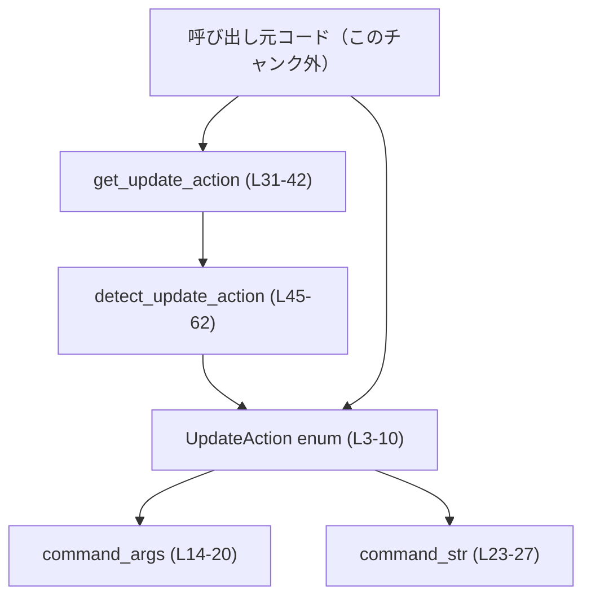
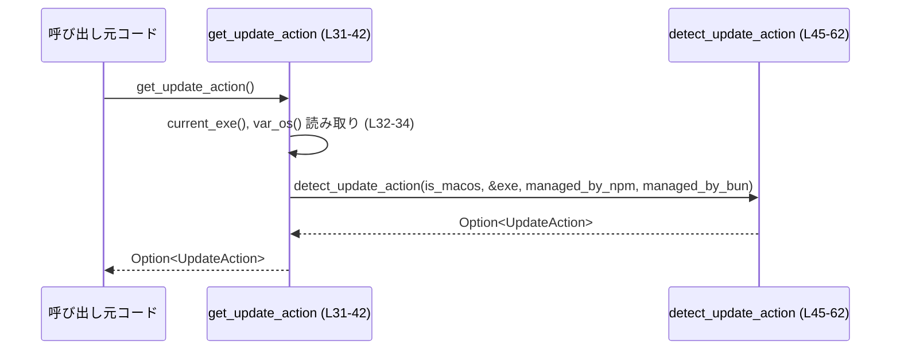
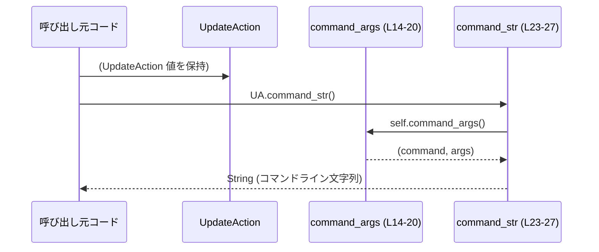

# tui/src/update_action.rs

## 0. ざっくり一言

TUI 終了後に CLI がどのように自己更新コマンドを実行すべきかを表す `UpdateAction` 列挙体と、その列挙値から実際のコマンドライン（コマンド名・引数）を生成するユーティリティ、および「どのインストール方法で管理されているか」を判定するロジックを提供するモジュールです。  
（根拠: コメントと enum 定義 `tui/src/update_action.rs:L1-10`）

---

## 1. このモジュールの役割

### 1.1 概要

- このモジュールは **CLI の自己更新方法を抽象化** し、その更新手段を表す `UpdateAction` と、そこから実行すべきコマンドを導き出す機能を提供します。（`UpdateAction` とそのメソッド `command_args` / `command_str`。`L3-27`）
- また、実行ファイルのパスと環境変数から、アプリが **npm / bun / Homebrew のどれでインストールされたか** を推定し、適切な `UpdateAction` を返す検出関数を提供します。（`get_update_action` / `detect_update_action`。`L31-62`）

### 1.2 アーキテクチャ内での位置づけ

このチャンク内では呼び出し元モジュールは定義されていませんが、コメントより「TUI が終了したあとに CLI が実行する更新アクション」を表すことが示されています。（`L1`）  
関数間の依存関係は次のとおりです。



- `get_update_action` はリリースビルド（`not(debug_assertions)`）でのみ公開され、実行環境の情報から `UpdateAction` を得るための入口です。（`L30-42`）
- `detect_update_action` は環境抽象化された純粋な判定関数で、テストや非デバッグビルドから利用されます。（`L44-50`）
- `UpdateAction::command_str` は `UpdateAction::command_args` に依存し、ユーザ表示やログ出力用にシェル安全な文字列（もしくはフォールバック文字列）を組み立てます。（`L23-27`）

### 1.3 設計上のポイント

- **責務の分割**
  - 更新手段そのものの表現（`UpdateAction`）と、その検出ロジック（`get_update_action` / `detect_update_action`）が分離されています。（`L3-10`, `L31-62`）
- **状態を持たない設計**
  - すべての関数・型は不変データのみを扱い、内部に可変状態を保持しません。`UpdateAction` はデータフィールドを持たない列挙体です。（`L3-10`）
- **環境依存ロジックの局所化**
  - 実際に環境変数や実行ファイルパスを読む処理は `get_update_action` に閉じ込められ、その結果を判定する純粋関数 `detect_update_action` に渡す設計になっています。（`L31-42`, `L45-62`）
- **コンパイル条件による挙動切替**
  - `get_update_action` はデバッグビルドではコンパイルされず、`detect_update_action` は非デバッグビルドとテストビルドで有効になります。（`L30`, `L44`）

---

## 2. 主要な機能一覧

- `UpdateAction` 列挙体: CLI の更新方法（npm グローバル / bun グローバル / Homebrew upgrade）を表現する。（`L3-10`）
- `UpdateAction::command_args`: `UpdateAction` に対応するコマンド名と引数リストを返す。（`L14-20`）
- `UpdateAction::command_str`: コマンド名と引数からシェル用の 1 本のコマンドライン文字列を生成する。（`L23-27`）
- `get_update_action`: 実行ファイルパスと環境変数から適切な `UpdateAction` を推定して返す（リリースビルドのみ）。（`L30-42`）
- `detect_update_action`: OS 種別フラグ・実行ファイルパス・管理方法フラグから `UpdateAction` を決定する純粋関数。（`L45-62`）

---

## 3. 公開 API と詳細解説

### 3.1 型一覧（構造体・列挙体など）

| 名前 | 種別 | 可視性 | 役割 / 用途 | 定義位置 |
|------|------|--------|-------------|----------|
| `UpdateAction` | 列挙体 | `pub` | CLI の更新方法（npm, bun, brew）を表す。TUI 終了後にどの更新コマンドを実行するかの選択肢として使われる。 | `tui/src/update_action.rs:L3-10` |

`UpdateAction` の列挙子:

| 列挙子 | 説明 | 定義位置 |
|--------|------|----------|
| `NpmGlobalLatest` | `npm install -g @openai/codex@latest` によるグローバルインストール更新を表す（コメントに基づく）。 | `L4-5` |
| `BunGlobalLatest` | `bun install -g @openai/codex@latest` によるグローバルインストール更新を表す。 | `L6-7` |
| `BrewUpgrade` | `brew upgrade codex`（cask）による Homebrew 更新を表す。 | `L8-9` |

> コメントと実装のコマンド引数に差異があり（`@latest` が `command_args` には含まれない）、この点は後述します。（`L4-9` vs `L16-18`）

### 3.2 関数詳細

#### `UpdateAction::command_args(self) -> (&'static str, &'static [&'static str])`

**概要**

- `UpdateAction` の各バリアントに対応する「コマンド名」と「引数リスト」（いずれも `'static` な文字列）を返します。（`L14-20`）

**引数**

| 引数名 | 型 | 説明 |
|--------|----|------|
| `self` | `UpdateAction` | 対象となる更新アクションの列挙値。 |

**戻り値**

- `(&'static str, &'static [&'static str])`
  - 1 要素目: 実行するコマンド名（例: `"npm"`）。  
  - 2 要素目: コマンドに渡す引数スライスへの参照（例: `&["install", "-g", "@openai/codex"]`）。  
  （各配列・文字列はコンパイル時に確保される `'static` データです。`L16-18`）

**内部処理の流れ**

1. `match self` で各バリアントごとに分岐します。（`L15`）
2. バリアントに応じて、コマンド名と引数スライスへの参照を返します。（`L16-18`）
   - `NpmGlobalLatest`: `("npm", &["install", "-g", "@openai/codex"])`
   - `BunGlobalLatest`: `("bun", &["install", "-g", "@openai/codex"])`
   - `BrewUpgrade`: `("brew", &["upgrade", "--cask", "codex"])`

**Examples（使用例）**

```rust
// UpdateAction を 1 つ決める
let action = UpdateAction::NpmGlobalLatest; // npm での更新を選択（L4-5 に対応）

// 対応するコマンドと引数を取得する
let (cmd, args) = action.command_args(); // L14-20

assert_eq!(cmd, "npm");                  // コマンド名
assert_eq!(args, &["install", "-g", "@openai/codex"]); // 引数一覧
```

**Errors / Panics**

- 明示的なエラーや panic は発生しません。  
  - `match` はすべてのバリアントを網羅しており、将来バリアントが増えた場合はコンパイルエラーになります。（`L15-18`）

**Edge cases（エッジケース）**

- 将来 `UpdateAction` に新しいバリアントを追加すると、この関数にもパターンを追加する必要があります。追加しない場合、コンパイルエラーとなるためランタイムでの未定義挙動は発生しません。

**使用上の注意点**

- 戻り値は `'static` なデータへの参照なので、ライフタイムに関する制約は緩く、どのスコープでも安全に参照可能です。
- この関数で返される配列は変更不可のスライスです（`&'static [&'static str]`）。内容を変更したい場合は、呼び出し側で `Vec<String>` 等にコピーする必要があります。

**根拠**

- 実装全体: `tui/src/update_action.rs:L14-20`。

---

#### `UpdateAction::command_str(self) -> String`

**概要**

- `command_args` が返すコマンド名と引数から、シェル向けの 1 本のコマンドライン文字列を生成します。（`L22-27`）
- `shlex::try_join` を使って適切にクォートされた文字列を生成し、エラー時には単純なスペース区切り文字列にフォールバックします。（`L25-26`）

**引数**

| 引数名 | 型 | 説明 |
|--------|----|------|
| `self` | `UpdateAction` | 文字列に変換したい更新アクション。 |

**戻り値**

- `String`:
  - 例: `"npm install -g @openai/codex"` のようなコマンドライン文字列。（`L25-26`）

**内部処理の流れ（アルゴリズム）**

1. `self.command_args()` を呼び出して `(command, args)` を取得します。（`L24`）
2. `std::iter::once(command)` で最初の要素（コマンド名）を持つイテレータを作成します。（`L25`）
3. `.chain(args.iter().copied())` で引数のイテレータを連結し、「コマンド名 + 引数」のイテレータにします。（`L25`）
4. `shlex::try_join(...)` で、シェル用に適切にクォートされた 1 本の文字列を生成しようとします。（`L25`）
5. `try_join` が `Err` を返した場合、`unwrap_or_else` によりフォールバックとして `"command arg1 arg2"` 形式の単純な連結文字列を生成します。（`L26`）

**Examples（使用例）**

```rust
// Homebrew 経由でインストールされた場合の例
let action = UpdateAction::BrewUpgrade;          // brew 更新アクション（L8-9）

// シェルに貼り付けられるコマンドライン文字列を生成
let cmd_line = action.command_str();             // L23-27

println!("Run this to update: {cmd_line}");
// 例: "Run this to update: brew upgrade --cask codex"
```

**Errors / Panics**

- `shlex::try_join` は `Result<String, _>` を返しますが、`unwrap_or_else` によりエラーを吸収し、フォールバック文字列を返すため、この関数としては `Result` を返さず、常に `String` を返します。（`L25-26`）
- 明示的な panic は含まれていません。通常の `String` のメモリ確保に伴う OOM などは Rust 全般に共通の挙動です。

**Edge cases（エッジケース）**

- `shlex::try_join` がエラーを返した場合:
  - 返り値は `"command "` + `args.join(" ")` という単純なスペース区切りの文字列になります。（`L26`）
  - この場合、スペースや特殊文字を含む引数は適切にクォートされない可能性がありますが、本コードでは引数はすべて固定文字列であり、スペースを含んでいません。（`L16-18`）

**使用上の注意点**

- 生成された文字列を **そのままシェルに渡す場合**, 外部コマンド実行方法によっては追加のエスケープが不要・不要でない場合があります。
  - ただしこの関数は「人間向けの表示」や「ログ出力」に特に適しています。
- `command_args` が返す引数の内容を変更した場合、`command_str` の出力も変わるため、表示やドキュメントと整合性を保つ必要があります。

**根拠**

- 実装全体: `tui/src/update_action.rs:L22-27`。

---

#### `get_update_action() -> Option<UpdateAction>`

> `#[cfg(not(debug_assertions))]` 付きのため、**リリースビルドのみ** で利用可能です。（`L30`）

**概要**

- 実際の実行環境（現在の実行ファイルのパスと環境変数）から、この CLI がどの方法で管理されているかを推定し、適切な `UpdateAction` を返すラッパー関数です。（`L31-42`）

**シグネチャ**

```rust
#[cfg(not(debug_assertions))]
pub(crate) fn get_update_action() -> Option<UpdateAction>
```

**引数**

- なし（環境から情報を取得します）。

**戻り値**

- `Option<UpdateAction>`:
  - `Some(UpdateAction::...)`: 更新方法を特定できた場合。
  - `None`: いずれの条件にも合致せず、推奨更新方法が決定できない場合。

**内部処理の流れ**

1. `std::env::current_exe()` で現在実行中のバイナリへのパスを取得し、`unwrap_or_default()` で失敗時は空の `PathBuf` を使います。（`L32`）
2. 環境変数 `CODEX_MANAGED_BY_NPM` が設定されているかを `std::env::var_os(...).is_some()` で判定し、`managed_by_npm` ブール値に格納します。（`L33`）
3. 同様に `CODEX_MANAGED_BY_BUN` を `managed_by_bun` として取得します。（`L34`）
4. `detect_update_action` を呼び出し、  
   - 第 1 引数: `cfg!(target_os = "macos")` によりコンパイル時に決まる `bool`（ターゲット OS が macOS なら `true`）。  
   - 第 2 引数: `&exe`（取得したパス）。  
   - 第 3, 4 引数: `managed_by_npm` / `managed_by_bun`。  
   を渡して `Option<UpdateAction>` を得て、そのまま返します。（`L36-41`）

**Examples（使用例）**

```rust
// リリースビルド（not(debug_assertions)）でのみ有効
#[cfg(not(debug_assertions))]
fn maybe_print_update_hint() {
    if let Some(action) = get_update_action() {      // L31-42
        // どのようにインストールされたかに応じた更新コマンドを表示
        println!("You can update via: {}", action.command_str());
    }
}
```

**Errors / Panics**

- `current_exe().unwrap_or_default()` は失敗時にデフォルト値を返すため、ここでは panic は発生しません。（`L32`）
- 環境変数読み取りは `var_os` を使っており、存在しない場合は `None` となるだけです。（`L33-34`）

**Edge cases（エッジケース）**

- `current_exe()` が失敗した場合:
  - `exe` は空の `PathBuf` になりますが、`detect_update_action` 側では Brew 判定で `starts_with("/opt/homebrew")` / `starts_with("/usr/local")` を行うため、Homebrew 管理とは判定されず、環境変数が立っていなければ `None` になります。（`L32`, `L55-57`, `L59-60`）
- ビルドターゲットが macOS 以外の場合:
  - `cfg!(target_os = "macos")` はコンパイル時に `false` となります。（`L37`）
  - その場合、Brew 判定は `is_macos` が偽のため無効になり、環境変数による npm/bun 判定のみが有効になります。（`L51-56`）

**使用上の注意点**

- この関数は `pub(crate)` であり、**同じクレート内からのみ** 参照可能です。（`L31`）
- デバッグビルドではコンパイルされないため、呼び出し側で `#[cfg(not(debug_assertions))]` を付けるか、`cfg!` マクロによる分岐を行う必要があります。
- 呼び出し結果が `None` の場合を必ず扱う必要があります。更新方法の特定に失敗したケースを想定した UI / ログ設計が必要です。

**根拠**

- 実装全体: `tui/src/update_action.rs:L30-42`。

---

#### `detect_update_action(is_macos: bool, current_exe: &Path, managed_by_npm: bool, managed_by_bun: bool) -> Option<UpdateAction>`

**概要**

- 「macOS かどうか」「実行ファイルのパス」「npm/bun 管理フラグ」から、適切な `UpdateAction` を判定する純粋関数です。（`L45-62`）
- 実際の環境依存 I/O は行わず、すべての情報は引数で受け取ります。

**シグネチャ**

```rust
#[cfg(any(not(debug_assertions), test))]
fn detect_update_action(
    is_macos: bool,
    current_exe: &std::path::Path,
    managed_by_npm: bool,
    managed_by_bun: bool,
) -> Option<UpdateAction>
```

**引数**

| 引数名 | 型 | 説明 |
|--------|----|------|
| `is_macos` | `bool` | ターゲット OS が macOS かどうか。通常は `cfg!(target_os = "macos")` の結果が渡される。 |
| `current_exe` | `&Path` | 現在の実行ファイルのパス。Homebrew 管理の判定に使用。 |
| `managed_by_npm` | `bool` | npm 管理とみなすかどうかのフラグ。通常は環境変数 `CODEX_MANAGED_BY_NPM` の有無から決定される。 |
| `managed_by_bun` | `bool` | bun 管理とみなすかどうかのフラグ。通常は環境変数 `CODEX_MANAGED_BY_BUN` の有無から決定される。 |

**戻り値**

- `Option<UpdateAction>`:
  - `Some(UpdateAction::NpmGlobalLatest)`: `managed_by_npm == true` の場合。（`L51-52`）
  - `Some(UpdateAction::BunGlobalLatest)`: `managed_by_bun == true` の場合。（`L53-54`）
  - `Some(UpdateAction::BrewUpgrade)`: `is_macos == true` かつ、実行パスが `/opt/homebrew` または `/usr/local` で始まる場合。（`L55-58`）
  - `None`: 上記のいずれにも該当しない場合。（`L59-60`）

**内部処理の流れ**

1. `managed_by_npm` が `true` の場合、`Some(UpdateAction::NpmGlobalLatest)` を返します。（`L51-52`）
2. そうでなく `managed_by_bun` が `true` の場合、`Some(UpdateAction::BunGlobalLatest)` を返します。（`L53-54`）
3. それ以外で `is_macos` が `true` かつ  
   `current_exe` が `/opt/homebrew` または `/usr/local` で始まる場合、`Some(UpdateAction::BrewUpgrade)` を返します。（`L55-58`）
4. どれにも当てはまらなければ `None` を返します。（`L59-60`）

**Examples（使用例）**

テストコードの一部は、そのまま典型例になっています。（`L69-115`）

```rust
// Mac 以外 & 環境変数なし → None
let action = detect_update_action(
    false,                                      // is_macos
    std::path::Path::new("/any/path"),         // current_exe
    false,                                     // managed_by_npm
    false,                                     // managed_by_bun
);
assert_eq!(action, None);

// npm 管理フラグが立っている → NpmGlobalLatest
let action = detect_update_action(
    false,
    std::path::Path::new("/any/path"),
    true,                                      // managed_by_npm
    false,
);
assert_eq!(action, Some(UpdateAction::NpmGlobalLatest));
```

**Errors / Panics**

- 外部 I/O は行っておらず、すべての引数は値/参照なので、関数内で panic やエラーを起こすコードは存在しません。（`L51-60`）

**Edge cases（エッジケース）**

- `managed_by_npm` と `managed_by_bun` が **両方とも true** の場合:
  - `if managed_by_npm` が優先され、`NpmGlobalLatest` が選ばれます。（`L51-54`）
- `is_macos == false` の場合:
  - 実行パスに関わらず、Brew 判定には到達せず、npm/bun フラグだけで判定されます。（`L55`）
- `is_macos == true` だが、`current_exe` が `/opt/homebrew` や `/usr/local` 以外のパス（例: `/usr/bin/...`）の場合:
  - Homebrew 管理とみなされず、`None` になります。（`L55-60`）

**使用上の注意点**

- この関数は `pub` ではなくモジュール内関数ですが、`#[cfg(test)] mod tests` から直接呼び出される設計になっています。（`L44-45`, `L70-115`）
- 外部から利用する場合、テストや内部ユーティリティとしてのみ想定されており、実際の環境取得は `get_update_action` に任せるのが一貫した使い方です。

**根拠**

- 実装全体: `tui/src/update_action.rs:L44-62`。  
- テストによる挙動確認: `tui/src/update_action.rs:L69-115`。

---

### 3.3 その他の関数

| 関数名 | 可視性 / 用途 | 役割（1 行） | 定義位置 |
|--------|----------------|--------------|----------|
| `detects_update_action_without_env_mutation` | `#[test]` 関数 | `detect_update_action` の判定ロジックを、環境変数を実際には変更せずにテーブルテスト的に検証する。 | `tui/src/update_action.rs:L68-115` |

---

### 3.4 既知の懸念点（バグ候補・セキュリティ観点）

- **コメントと実装の不一致**
  - `UpdateAction` のドキュメンテーションコメントでは  
    `npm install -g @openai/codex@latest` / `bun install -g @openai/codex@latest` が記述されていますが、実際の `command_args` は `@openai/codex` のみを渡しています。（`L4-7` vs `L16-17`）
  - 「どのバージョンをインストールするか」に関する仕様がコメントと異なる可能性があります。この点は仕様書や他コードと合わせて確認が必要です。
- **セキュリティ観点**
  - コマンド名・引数はすべてソースコード内の固定文字列であり、ユーザー入力を含みません。（`L16-18`）
  - そのため、`command_args` / `command_str` 自体からシェルインジェクションなどのリスクは読み取れません。
  - 環境変数 `CODEX_MANAGED_BY_*` の値は内容を参照せず、「設定されているかどうか」だけを見ているため、値による攻撃経路はありません。（`L33-34`）

---

## 4. データフロー

### 4.1 関数間の呼び出しフロー

このファイル内で完結するデータフローは、主に次の 2 つです。

1. **更新方法の検出フロー**（環境 → `UpdateAction`）
2. **`UpdateAction` からコマンド文字列への変換フロー**

#### 4.1.1 更新方法の検出フロー



- 呼び出し元は `get_update_action()` を 1 回呼び出すだけで、実行環境に応じた `Option<UpdateAction>` を得られます。（`L31-42`）
- 実際の OS 判定・パス判定ロジックは `detect_update_action` に委譲されます。（`L36-41`, `L45-62`）

#### 4.1.2 `UpdateAction` からコマンド文字列への変換フロー



- 呼び出し元は `UpdateAction` 値から直接 `command_str()` を呼び出すだけで、人間向けのコマンドラインを得られます。（`L23-27`）
- `command_str` は内部的に `command_args` を利用しています。（`L24`）

---

## 5. 使い方（How to Use）

### 5.1 基本的な使用方法

リリースビルドで、環境に応じて更新コマンドを表示する一例です。

```rust
use crate::tui::update_action::UpdateAction; // 実際のパスはこのチャンクからは不明
                                             // 同一モジュール内なら use は不要です。

// リリースビルドでのみコンパイルされる関数
#[cfg(not(debug_assertions))]
fn show_update_hint_if_applicable() {
    // 実行環境から UpdateAction を推定
    if let Some(action) = crate::tui::update_action::get_update_action() { // L31-42
        // コマンドライン文字列を生成して表示
        let cmd_line = action.command_str();                               // L23-27
        println!("You can update codex via:\n  {cmd_line}");
    } else {
        // 更新方法が特定できない場合のフォールバック
        println!("No automatic update method detected.");
    }
}
```

> `get_update_action` の正確なパス（`crate::...` 部分）は、このチャンクには現れないため不明です。上記では説明のために仮のパスを用いています。

### 5.2 よくある使用パターン

1. **テストからの判定ロジック直接利用**

   - `detect_update_action` は `#[cfg(test)]` でも有効なため、テストや独立した検証コードから直接呼び出し、さまざまなパス・フラグの組み合わせを検証できます。（`L44`, `L69-115`）

   ```rust
   #[test]
   fn npm_is_preferred_when_both_flags() {
       let action = detect_update_action(
           true,                                      // is_macos
           std::path::Path::new("/opt/homebrew/bin/codex"),
           true,                                      // managed_by_npm
           true,                                      // managed_by_bun
       );
       assert_eq!(action, Some(UpdateAction::NpmGlobalLatest)); // L51-54 に基づく優先順位
   }
   ```

2. **固定の更新手段を表示するだけの利用**

   - 環境に依存せず、ドキュメントやヘルプテキストに「npm で更新するには次を実行」といった文言を書きたい場合、`UpdateAction::NpmGlobalLatest` を直接利用できます。

   ```rust
   fn print_npm_update_help() {
       let action = UpdateAction::NpmGlobalLatest;   // L4-5
       println!("To update via npm, run:\n  {}", action.command_str());
   }
   ```

### 5.3 よくある間違い

このチャンクから推測できる誤用例と対比例です。

```rust
// 誤り例 1: デバッグビルドでも get_update_action を呼び出そうとする
// fn debug_update() {
//     let action = get_update_action(); // L30 により debug ビルドでは定義されない
// }

// 正しい例: コンパイル条件を揃える
#[cfg(not(debug_assertions))]
fn release_update() {
    if let Some(action) = get_update_action() {
        println!("{}", action.command_str());
    }
}
```

```rust
// 誤り例 2: 自前でコマンド文字列を雑に組み立てる
fn wrong_build_command(action: UpdateAction) -> String {
    // Display 実装が無い場合やフォーマット指定が変わる場合に脆い
    format!("{:?}", action) // L2 の Debug 派生はありますが、コマンドにはなりません
}

// 正しい例: 提供されている API を使う
fn correct_build_command(action: UpdateAction) -> String {
    action.command_str() // L23-27
}
```

### 5.4 使用上の注意点（まとめ）

- `get_update_action` はリリースビルド専用であること（`#[cfg(not(debug_assertions))]`）。  
  デバッグビルドで同じロジックをテストしたい場合は `detect_update_action` を直接利用する必要があります。（`L30`, `L44`）
- 環境変数 `CODEX_MANAGED_BY_NPM` / `CODEX_MANAGED_BY_BUN` の有無が npm/bun 管理判定の決め手になります。値の中身は使われません。（`L33-34`, `L48-49`）
- Homebrew 管理判定は **macOS かつ特定パスプレフィックス** の条件でのみ行われるため、カスタムパスにインストールされた場合は検出されません。（`L45-47`, `L55-58`）
- 本モジュールには可変なグローバル状態やスレッド共有状態はおらず、`UpdateAction` もフィールドを持たない列挙体なので、多スレッドで同じ値を共有しても競合状態は発生しません。

---

## 6. 変更の仕方（How to Modify）

### 6.1 新しい機能を追加する場合

例: 新しいパッケージマネージャー（例: `pnpm`）経由の更新手段を追加する場合。

1. **列挙子の追加**
   - `UpdateAction` に新しいバリアント（例: `PnpmGlobalLatest`）を追加します。（`L3-10`）
2. **コマンド定義の追加**
   - `command_args` の `match` に新しいバリアントを追加し、対応するコマンド名・引数を返すようにします。（`L15-18`）
3. **検出ロジックの拡張**
   - `detect_update_action` に、新しいフラグやパス判定などを追加します。（`L51-60`）
   - 必要であれば `get_update_action` にも対応する環境変数や検出情報の取得を追加します。（`L31-40`）
4. **テストの追加**
   - `#[cfg(test)] mod tests` 内に、新しいバリアントを検証するアサーションを追加します。（`L69-115`）

### 6.2 既存の機能を変更する場合

- **`command_args` の引数内容を変更する場合**
  - ドキュメントコメント（`L4-9`）との整合性を確認する必要があります。特に、`@latest` の有無などはユーザーの期待する動作に直結します。
- **検出条件（`detect_update_action`）を変更する場合**
  - 分岐の優先順位（npm > bun > brew > None）が変わらないか注意が必要です。（`L51-60`）
  - `tests` モジュールのテストケースが新条件に沿っているか確認し、必要に応じて修正します。（`L69-115`）
- **環境変数名の変更**
  - `CODEX_MANAGED_BY_NPM` / `CODEX_MANAGED_BY_BUN` の名称を変える場合は、ドキュメントや他モジュールが同じ名前を参照していないか確認する必要があります。（`L33-34`）

---

## 7. 関連ファイル

このチャンクには、他のソースファイルやモジュール名への明示的な参照は現れません。そのため、モジュール間の関係はここからは分かりません。

| パス | 役割 / 関係 |
|------|------------|
| （不明） | このファイルから直接参照される他の自作モジュールは存在しません。標準ライブラリ（`std::env`, `std::path`）と外部クレート `shlex` のみが使用されています。（`L32-34`, `L47`, `L25`） |

他の TUI/CLI 関連モジュールがこの `UpdateAction` や `get_update_action` をどのように呼び出しているかは、このチャンクには現れないため不明です。
