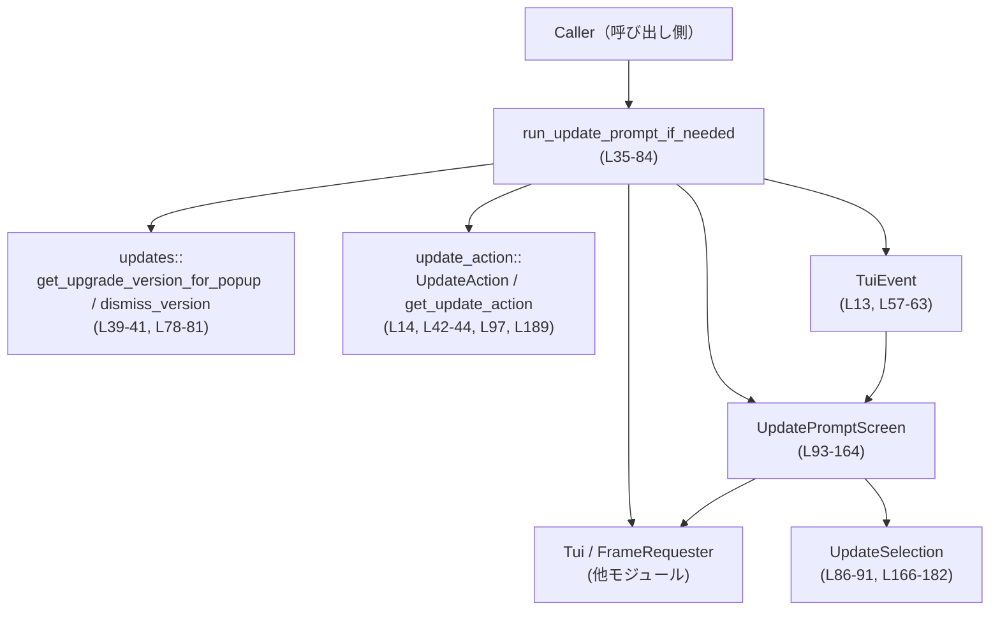

# tui/src/update_prompt.rs

---

## 0. ざっくり一言

このモジュールは、**新しいバージョンが利用可能な場合に表示する TUI のアップデート確認モーダル**と、その実行フローを提供するモジュールです。ユーザーの選択に応じて「今すぐ更新するか／今回はスキップするか／このバージョンについては再度通知しないか」を判定します。

---

## 1. このモジュールの役割

### 1.1 概要

- このモジュールは、**アプリケーションのアップデート案内を TUI 上で行う**ために存在し、以下の機能を提供します。
  - 新バージョンが存在するかを確認し、必要な場合だけアップデートモーダルを表示する（`run_update_prompt_if_needed`）  
    （tui/src/update_prompt.rs:L35-84）
  - モーダルの内部状態（どの選択肢がハイライトされているか・最終選択は何か）を保持し、キーボード入力で更新する  
    （構造体 `UpdatePromptScreen` とそのメソッド群, L93-164）
  - ratatui を用いてモーダル UI を描画する（`impl WidgetRef for &UpdatePromptScreen`, L184-240）

### 1.2 アーキテクチャ内での位置づけ

このモジュールは、`Tui` と `updates` / `update_action` モジュールの間に位置し、**アップデート確認 UI と結果の橋渡し**を行います。



### 1.3 設計上のポイント

- **非デバッグビルドのみ有効**  
  ファイル先頭に `#![cfg(not(debug_assertions))]` があり、`debug_assertions` が有効なビルド（通常の `cargo build` / `cargo test`）ではこのモジュール全体がコンパイル対象外になります（L1）。  
  リリースビルドや `cargo test --release` で有効になります。
- **明確な責務分割**
  - 外部 API: 「必要ならモーダルを走らせる」非同期関数 `run_update_prompt_if_needed`（L35-84）
  - 内部状態管理: `UpdatePromptScreen` と `UpdateSelection`（L86-164, L166-182）
  - 描画: `WidgetRef for &UpdatePromptScreen`（L184-240）
- **イベント駆動・非同期処理**
  - `tokio_stream::StreamExt` を使ったイベントストリーム（L28, L52-56）
  - `while !screen.is_done()` でループし、`TuiEvent` を逐次処理（L55-65）
- **エラーハンドリング**
  - 描画やターミナルクリアの失敗は `Result` 経由で呼び出し元に伝播（`?` 演算子, L48-50, L61-63, L73）。
  - アップデート無効化の保存（`updates::dismiss_version`）は失敗してもログ出力のみで処理継続（L78-81）。
- **状態遷移の明示化**
  - 選択肢は enum `UpdateSelection` と `next` / `prev` メソッドで循環遷移（L86-91, L166-182）。
  - キー入力は `handle_key` 内で全て集約的に処理（L118-138）。

---

## 2. 主要なコンポーネント一覧（インベントリ）

### 2.1 本番コード（非テスト）

| 名前 | 種別 | 役割 / 用途 | 定義位置 |
|------|------|-------------|----------|
| `UpdatePromptOutcome` | enum | モーダル終了後に呼び出し元へ返す結果（続行 / 更新実行） | tui/src/update_prompt.rs:L30-33 |
| `run_update_prompt_if_needed` | `pub(crate) async fn` | アップデートが必要ならモーダルを表示し、ユーザー選択を待って結果を返す | L35-84 |
| `UpdateSelection` | enum | モーダル内の3つの選択肢（今すぐ更新 / スキップ / このバージョンは通知しない） | L86-91 |
| `UpdatePromptScreen` | struct | モーダルの描画・入力処理に必要な状態（バージョン情報・ハイライト・選択）を保持 | L93-100 |
| `UpdatePromptScreen::new` | fn | `UpdatePromptScreen` のコンストラクタ | L103-116 |
| `UpdatePromptScreen::handle_key` | fn | `KeyEvent` を受け取り、ハイライトや選択状態を更新 | L118-138 |
| `UpdatePromptScreen::set_highlight` | fn | ハイライトを変更し、再描画要求を送る | L140-145 |
| `UpdatePromptScreen::select` | fn | 最終選択を確定し、再描画要求を送る | L147-151 |
| `UpdatePromptScreen::is_done` | fn | 最終選択が行われたかを判定 | L153-155 |
| `UpdatePromptScreen::selection` | fn | 最終選択を返す | L157-159 |
| `UpdatePromptScreen::latest_version` | fn | 最新バージョン文字列への参照を返す | L161-163 |
| `UpdateSelection::next` | fn | 次の選択肢へ循環的に移動 | L167-173 |
| `UpdateSelection::prev` | fn | 前の選択肢へ循環的に移動 | L175-181 |
| `impl WidgetRef for &UpdatePromptScreen::render_ref` | traitメソッド | モーダルの UI を ratatui で描画 | L184-239 |

### 2.2 テストコード

| 名前 | 種別 | 役割 / 用途 | 定義位置 |
|------|------|-------------|----------|
| `new_prompt` | fn | テスト用の `UpdatePromptScreen` 初期化ヘルパ | L252-258 |
| `update_prompt_snapshot` | `#[test]` | モーダル描画のスナップショットテスト | L260-268 |
| `update_prompt_confirm_selects_update` | `#[test]` | Enter キーで「今すぐ更新」が選択されることの検証 | L270-276 |
| `update_prompt_dismiss_option_leaves_prompt_in_normal_state` | `#[test]` | 「Skip」選択の挙動検証 | L278-284 |
| `update_prompt_dont_remind_selects_dismissal` | `#[test]` | 「Skip until next version」選択の挙動検証 | L287-295 |
| `update_prompt_ctrl_c_skips_update` | `#[test]` | Ctrl+C でスキップ扱いになることの検証 | L297-303 |
| `update_prompt_navigation_wraps_between_entries` | `#[test]` | Up/Down キーで選択が循環することの検証 | L305-311 |

---

## 3. 公開 API と詳細解説

### 3.1 型一覧（構造体・列挙体など）

| 名前 | 種別 | 役割 / 用途 | 主なフィールド / バリアント | 定義位置 |
|------|------|-------------|-----------------------------|----------|
| `UpdatePromptOutcome` | `pub(crate) enum` | モーダル完了後の外向き結果 | `Continue`, `RunUpdate(UpdateAction)` | L30-33 |
| `UpdateSelection` | enum | モーダル内の選択肢状態 | `UpdateNow`, `NotNow`, `DontRemind` | L86-91 |
| `UpdatePromptScreen` | struct | モーダルの内部状態と描画に必要な情報 | `request_frame: FrameRequester`, `latest_version: String`, `current_version: String`, `update_action: UpdateAction`, `highlighted: UpdateSelection`, `selection: Option<UpdateSelection>` | L93-100 |

### 3.2 関数詳細（主要7件）

#### `run_update_prompt_if_needed(tui: &mut Tui, config: &Config) -> Result<UpdatePromptOutcome>`

**定義位置**: tui/src/update_prompt.rs:L35-84  

**概要**

- アップデートが必要な場合にのみ TUI モーダルを起動し、ユーザーが選択を完了するまで TUI イベントループを回します。
- 最終的な選択に応じて `UpdatePromptOutcome` を返し、呼び出し元に「アップデートを実行するか」「そのまま続行するか」を伝えます。

**引数**

| 引数名 | 型 | 説明 |
|--------|----|------|
| `tui` | `&mut Tui` | 描画とイベント取得のための TUI ハンドル（他モジュールで定義, L12, L48-52） |
| `config` | `&Config` | アップデート表示ルールやバージョン情報を含む設定（L5, L39, L78） |

**戻り値**

- `Result<UpdatePromptOutcome>`（L38）  
  - `Ok(UpdatePromptOutcome::Continue)`  
    - アップデート案内を表示しなかった場合（`get_upgrade_version_for_popup` が `None`、または `get_update_action` が `None`）  
      （L39-44）  
    - またはユーザーが「今は更新しない」「選択せずにイベントストリームが終了した」場合（L71, L76-77）
  - `Ok(UpdatePromptOutcome::RunUpdate(update_action))`  
    - ユーザーが「Update now」を選んだ場合（L72-75）
  - `Err(e)`  
    - 初期描画や再描画、ターミナルクリアでエラーが発生した場合（`?` による伝播, L48-50, L61-63, L73）

**内部処理の流れ**

1. `updates::get_upgrade_version_for_popup(config)` でアップデート対象バージョンを取得し、`None` なら即座に `Continue` を返す（L39-41）。  
2. `crate::update_action::get_update_action()` で実行すべきアップデートコマンド情報を取得し、`None` なら `Continue` を返す（L42-44）。  
3. `UpdatePromptScreen::new(...)` でモーダル状態オブジェクトを生成し（L46-47）、`tui.draw` で初回描画を行う（L48-50）。  
4. `tui.event_stream()` からイベントストリームを取得し、`tokio::pin!` でピン留めする（L52-53）。  
5. `while !screen.is_done()` でループし、`events.next().await` で `TuiEvent` を1件ずつ受信（L55-56）。  
   - `TuiEvent::Key` は `screen.handle_key` に委譲（L57-58）。  
   - `TuiEvent::Draw` は再描画（`tui.draw`）を行う（L60-63）。  
   - `TuiEvent::Paste` は現在何もしない（L59）。  
   - ストリームが `None` を返した場合は `break`（L66-67）。  
6. ループ終了後、`screen.selection()` に応じて分岐（L71-83）。  
   - `UpdateNow`: ターミナルをクリアして（L73）、`RunUpdate(update_action)` を返す（L74）。  
   - `NotNow` または `None`: `Continue` を返す（L76-77）。  
   - `DontRemind`: `updates::dismiss_version(config, screen.latest_version()).await` でこのバージョンの通知を無効化し（L78）、失敗した場合は `tracing::error!` でログに残してから `Continue` を返す（L78-81）。

**Examples（使用例）**

この関数は「アプリ起動時にアップデート確認を行う」ような場面で使われる想定です。

```rust
use crate::legacy_core::config::Config;
use crate::tui::Tui;
use crate::update_prompt::{run_update_prompt_if_needed, UpdatePromptOutcome}; // 実際のパスは crate 構成に依存

async fn startup_flow(tui: &mut Tui, config: &Config) -> color_eyre::Result<()> {
    // アップデート確認モーダルを必要なら表示し、結果を受け取る
    let outcome = run_update_prompt_if_needed(tui, config).await?; // 非同期関数なので .await が必要

    match outcome {
        UpdatePromptOutcome::RunUpdate(action) => {
            // ここで action を使って実際のアップデート処理を行う（別モジュールの責務）
            // 例: action.run()?;  // ※実際のメソッド名はこのチャンクには出てこないため不明
        }
        UpdatePromptOutcome::Continue => {
            // アップデートせず通常のアプリ起動処理を続行
        }
    }

    Ok(())
}
```

※ `UpdatePromptOutcome` の公開パスや `UpdateAction` の実行方法は、このチャンクからは分かりません。

**Errors / Panics**

- **Err を返す条件**
  - 初回描画 `tui.draw(...)`（L48-50）が失敗した場合。
  - 再描画 `tui.draw(...)`（`TuiEvent::Draw` ハンドリング, L61-63）が失敗した場合。
  - `tui.terminal.clear()` が失敗した場合（L73）。
  - 具体的なエラー型は `color_eyre::Result` の型エイリアスに依存し、このチャンクからは不明です。
- **panic の可能性**
  - この関数内で `panic!` 相当のコードは見当たりません。
  - ただし、内部で呼ぶ他モジュール（`Tui`, `Terminal`, `updates` 等）が panic する可能性については、このチャンクからは判断できません。

**Edge cases（エッジケース）**

- **アップデート対象がない場合**  
  - `get_upgrade_version_for_popup` が `None` を返すと、モーダルは一切表示されず `Continue` が返ります（L39-41）。
- **アップデートアクションが不明な場合**  
  - `get_update_action` が `None` を返すと、同様に `Continue`（L42-44）。
- **イベントストリームの早期終了**
  - `events.next().await` が `None` を返した場合、`break` して `screen.selection()` の結果に従います（L66-67）。
  - その際、ユーザーが何も選択していなければ `selection()` は `None` のままであり、`Continue` 扱いになります（L71, L76-77）。
- **`DontRemind` 選択時の永続化失敗**
  - `dismiss_version` が `Err` を返した場合でも、ログ出力のみで `Continue` を返します（L78-81）。ユーザーは「通知しない」と選んだが、設定が保存されない可能性があります。

**使用上の注意点**

- **非同期コンテキストでのみ利用可能**  
  - `async fn` であり、内部で `.await` を行うため、Tokio などの非同期ランタイム内から呼び出す必要があります（L35, L56, L78）。
- **`Tui` の排他的借用**  
  - 引数に `&mut Tui` を取るため、関数実行中は同じ `Tui` を他のコードから同時に操作することはできません（所有権／借用ルールに基づく Rust の安全性）。
- **アップデート実行は呼び出し側の責務**  
  - `RunUpdate(UpdateAction)` の場合、このモジュールは「実行すべきアクション」を返すだけで、実際のコマンド実行は行いません（L30-33, L71-75）。コマンド実行時のセキュリティやエラー処理は呼び出し側で考慮する必要があります。
- **UI ブロッキング**  
  - この関数は「モーダルが閉じるまで TUI のイベントループを占有」する設計になっているため（L55-69）、他の UI 画面と同時に表示する用途には適していません。

---

#### `UpdatePromptScreen::new(request_frame: FrameRequester, latest_version: String, update_action: UpdateAction) -> UpdatePromptScreen`

**定義位置**: L103-116  

**概要**

- モーダル表示に必要な状態を初期化し、`UpdatePromptScreen` インスタンスを生成します。
- 現在のアプリバージョンはコンパイル時定数 `env!("CARGO_PKG_VERSION")` から取得します（L111）。

**引数**

| 引数名 | 型 | 説明 |
|--------|----|------|
| `request_frame` | `FrameRequester` | 再描画要求をスケジューリングするためのハンドル（L94, L143, L150） |
| `latest_version` | `String` | 利用可能な最新バージョン文字列（L105, L110） |
| `update_action` | `UpdateAction` | 実行予定のアップデートコマンド情報（L106, L112） |

**戻り値**

- 初期化済みの `UpdatePromptScreen`。  
  - `highlighted` は常に `UpdateSelection::UpdateNow`（最上段）で開始（L113）。
  - `selection` は `None`（未選択）で開始（L114）。

**内部処理の流れ**

1. 引数をフィールドにそのまま格納（L109-110, L112）。  
2. `current_version` に `env!("CARGO_PKG_VERSION").to_string()` を設定（L111）。  
3. `highlighted` を `UpdateSelection::UpdateNow`、`selection` を `None` で初期化（L113-114）。

**Examples（使用例）**

テストコードでの利用例（簡略化）:

```rust
use crate::tui::FrameRequester;
use crate::update_action::UpdateAction;

fn create_screen_for_test() -> UpdatePromptScreen {
    UpdatePromptScreen::new(
        FrameRequester::test_dummy(),          // テスト用の FrameRequester（L254）
        "9.9.9".to_string(),                   // テスト用の最新バージョン
        UpdateAction::NpmGlobalLatest,         // テスト用のアップデートアクション（L256）
    )
}
```

**Errors / Panics**

- `env!("CARGO_PKG_VERSION")` はコンパイル時に埋め込まれるため、通常はパニックしません。
- その他の処理は単純なフィールド代入のみで、エラーを返しません。

**Edge cases**

- `latest_version` が現在バージョンと同じ、あるいは古い場合でも、この関数自体は検証を行いません（L105-106, L111）。  
  表示するかどうかの判断は `run_update_prompt_if_needed` 内の `updates::get_upgrade_version_for_popup` に委ねられています（L39-41）。

**使用上の注意点**

- このコンストラクタはモジュール内部でのみ使用されており（L46-47, L252-258）、外部から直接 `UpdatePromptScreen` を扱う必要は通常ありません。
- 再描画を行うには `request_frame` が正しく機能する必要がありますが、その詳細は `FrameRequester` 実装に依存します。

---

#### `UpdatePromptScreen::handle_key(&mut self, key_event: KeyEvent)`

**定義位置**: L118-138  

**概要**

- 単一のキーボードイベントを解釈し、ハイライトや選択状態を変更します。
- Emacs/Vi 風のキー操作（`j`/`k`）、数字キー、Enter、Esc、Ctrl+C / Ctrl+D などをサポートしています。

**引数**

| 引数名 | 型 | 説明 |
|--------|----|------|
| `key_event` | `KeyEvent` | crossterm 由来のキーボードイベント（L18, L118） |

**戻り値**

- 返り値はありません。内部状態（`highlighted` / `selection`）およびフレーム再描画のスケジュールを更新します（L140-151）。

**内部処理の流れ**

1. `KeyEventKind::Release` のイベントは無視して早期 return（L119-121）。これによりキー押下とキー離しの両方が届く環境でも二重処理を避けています。
2. `Ctrl` 修飾子付きで `c` または `d` が押された場合、`NotNow` を選択してモーダルを終了（L122-127）。  
   - `self.select(UpdateSelection::NotNow)` を呼び出し、選択確定・再描画要求を行う（L125, L147-151）。
3. それ以外のキーコードに応じて `match`（L128-137）。  
   - 上移動系: `KeyCode::Up` または `KeyCode::Char('k')` → `highlighted.prev()` へ移動し `set_highlight`（L129）。  
   - 下移動系: `KeyCode::Down` または `KeyCode::Char('j')` → `highlighted.next()` へ移動し `set_highlight`（L130）。  
   - 直接選択: `Char('1')` / `'2'` / `'3'` → それぞれ `UpdateNow` / `NotNow` / `DontRemind` を選択 (`select` 呼び出し, L131-133)。  
   - 決定: `Enter` → 現在ハイライト中の選択肢で `select`（L134）。  
   - キャンセル: `Esc` → `NotNow` で `select`（L135）。  
   - その他のキーは無視（L136）。

**Examples（使用例）**

テストからの例（簡略化）:

```rust
use crossterm::event::{KeyCode, KeyEvent, KeyModifiers};

let mut screen = create_screen_for_test(); // UpdatePromptScreen::new を使って初期化

// Enter キーでデフォルト（UpdateNow）を選択
screen.handle_key(KeyEvent::new(KeyCode::Enter, KeyModifiers::NONE));
assert!(screen.is_done());
assert_eq!(screen.selection(), Some(UpdateSelection::UpdateNow));

// Ctrl+C でスキップ（NotNow）を選択
let mut screen = create_screen_for_test();
screen.handle_key(KeyEvent::new(KeyCode::Char('c'), KeyModifiers::CONTROL));
assert_eq!(screen.selection(), Some(UpdateSelection::NotNow));
```

（実際のテストは L270-276, L297-303 を参照）

**Errors / Panics**

- この関数自体はエラーを返さず、パニックを起こす処理も含みません。
- 再描画は `FrameRequester::schedule_frame()` によって非同期に要求されるだけであり、このメソッド内で I/O エラー等は発生しません（L143, L150）。

**Edge cases**

- **キー離しイベントの扱い**  
  - `KeyEventKind::Release` を無視することで、同じキーの押下/離しの両方が届くターミナル環境での二重処理を避けています（L119-121）。
- **複数修飾子**  
  - `key_event.modifiers.contains(KeyModifiers::CONTROL)` で判定しているため、Ctrl+Shift+C のような複合修飾でも「Ctrl+C」と同様に扱われる可能性があります（L122-123）。
- **未定義キー**  
  - 上記以外のキー入力は無視され、状態は変化しません（L136）。

**使用上の注意点**

- `handle_key` は単独で呼び出しても画面更新は行われません。ハイライトや選択の変更時に `set_highlight` / `select` が内部で `schedule_frame` を呼び出し、外側の TUI イベントループが `TuiEvent::Draw` を受け取って描画します（L140-145, L147-151, L60-63）。
- スレッド安全性: `&mut self` を取る通常のメソッドであり、同一インスタンスに対する並行呼び出しは Rust の所有権ルール上発生しません。

---

#### `UpdateSelection::next(self) -> Self`

**定義位置**: L167-173  

**概要**

- 現在の選択肢から「下方向」に一つ移動した選択肢を返します。
- 3つの選択肢を循環させる実装になっています。

**引数**

- レシーバ `self: UpdateSelection` のみ。

**戻り値**

- 次の `UpdateSelection`。
  - `UpdateNow` → `NotNow`  
  - `NotNow` → `DontRemind`  
  - `DontRemind` → `UpdateNow`  

（L169-171）

**内部処理の流れ**

- `match self` で 3つのケースに分岐し、上記対応に従って値を返すだけの単純なロジックです（L168-172）。

**Examples（使用例）**

```rust
let s = UpdateSelection::UpdateNow;
assert_eq!(s.next(), UpdateSelection::NotNow);

let s = UpdateSelection::DontRemind;
assert_eq!(s.next(), UpdateSelection::UpdateNow); // 循環する
```

**Errors / Panics**

- エラー・パニックの可能性はありません（列挙体の完全なパターンマッチのみ）。

**Edge cases**

- 列挙体に新しいバリアントを追加した場合、この `match` は非網羅となりコンパイルエラーになります。  
  そのため、新バリアント追加時には `next` / `prev` の更新が必須です。

**使用上の注意点**

- UI 上の「下方向」キー (`Down`, `j`) からのみ呼ばれる前提で設計されています（L130）。  
  上方向の挙動は `prev` 側にのみ実装されています（L175-181）。

---

#### `UpdateSelection::prev(self) -> Self`

**定義位置**: L175-181  

**概要**

- 現在の選択肢から「上方向」に一つ移動した選択肢を返します。
- `next` 同様、選択肢は循環しますが方向が逆です。

**戻り値**

- 前の `UpdateSelection`。
  - `UpdateNow` → `DontRemind`  
  - `NotNow` → `UpdateNow`  
  - `DontRemind` → `NotNow`  

（L177-179）

**Examples（使用例）**

```rust
let s = UpdateSelection::UpdateNow;
assert_eq!(s.prev(), UpdateSelection::DontRemind); // 上方向に循環

let s = UpdateSelection::NotNow;
assert_eq!(s.prev(), UpdateSelection::UpdateNow);
```

その他の項目は `next` と同様であり、ここでは省略します。

---

#### `UpdatePromptScreen::is_done(&self) -> bool`

**定義位置**: L153-155  

**概要**

- ユーザーの最終選択が確定したかどうかを判定します。
- イベントループの終了条件として使用されます（L55）。

**戻り値**

- `true` … `selection` フィールドが `Some(...)` になっている場合（L154）。  
- `false` … まだ何も選択されていない場合（`selection` が `None`）。

**Examples（使用例）**

```rust
let mut screen = create_screen_for_test();
assert!(!screen.is_done()); // 初期状態

screen.handle_key(KeyEvent::new(KeyCode::Enter, KeyModifiers::NONE));
assert!(screen.is_done());  // Enter で選択が確定
```

（L270-275 相当）

**使用上の注意点**

- `is_done` のみでは「どの選択肢が選ばれたか」は分からないため、終了後には `selection()` を併用する必要があります（L71-83, L157-159）。

---

#### `impl WidgetRef for &UpdatePromptScreen { fn render_ref(&self, area: Rect, buf: &mut Buffer) }`

**定義位置**: L184-239  

**概要**

- `UpdatePromptScreen` の内容を ratatui のバッファ上に描画するメソッドです。
- モーダルのタイトル、バージョン表示、選択肢、キー操作ヒントなどを縦方向に並べて表示します。

**引数**

| 引数名 | 型 | 説明 |
|--------|----|------|
| `area` | `Rect` | 描画対象領域（L185） |
| `buf` | `&mut Buffer` | ratatui の描画バッファ（L185） |

**戻り値**

- 返り値はありません。`buf` をインプレースに更新します。

**内部処理の流れ**

1. `Clear.render(area, buf)` で対象領域をクリア（L186）。  
2. `ColumnRenderable::new()` で縦方向に `Line` を積み上げるためのヘルパを生成（L187）。  
3. `update_command = self.update_action.command_str()` でアップデートコマンドの文字列表現を取得（L189）。  
4. タイトル行を追加（L191-202）。
   - `padded_emoji("  ✨").bold().cyan()` による絵文字＋装飾（L193）。
   - `"Update available!".bold()` による太字タイトル（L194）。
   - `"current -> latest"` 形式のバージョン表示を `.dim()` で薄く描画（L196-201）。  
5. 「Release notes: <URL>」行をインデント付きで追加（L204-212）。
6. 選択肢3つを `selection_option_row` で追加（L214-228）。
   - インデックス 0〜2 と、ラベル文字列、ハイライト状態（`self.highlighted == ...`）を引数に渡す（L215-218, L219-223, L224-228）。
   - 一番上の行は「Update now (runs `...`)」とし、実際に実行されるコマンドを表示（L215-217）。
7. 「Press Enter to continue」行をインデント付きで追加（L230-237）。`key_hint::plain(KeyCode::Enter)` を利用してキー表示を生成（L231-234）。
8. 最後に `column.render(area, buf)` で全行を書き出し（L238-239）。

**Examples（使用例）**

テストからの利用例（描画部分のみ抜粋, L262-266）:

```rust
use ratatui::Terminal;
use crate::test_backend::VT100Backend;

let screen = create_screen_for_test();                             // UpdatePromptScreen
let mut terminal = Terminal::new(VT100Backend::new(80, 12))?;      // 80x12 のテスト用バックエンド
terminal.draw(|frame| {
    // frame.area() 全体に対して render_ref が呼ばれる
    frame.render_widget_ref(&screen, frame.area());
})?;
```

**Errors / Panics**

- このメソッド自体はエラーを返しません。
- `command_str` や `selection_option_row` の内部実装に依存するエラーやパニックの可能性は、このチャンクからは判断できません。

**Edge cases**

- **狭い描画領域**  
  - `area` が小さい場合、テキストが切れる・重なるなどの見た目の問題が発生する可能性がありますが、その振る舞いは ratatui の仕様に依存します。
- **長いコマンド文字列**  
  - `update_command` が非常に長いと、モーダルの横幅に収まらない可能性があります（L189, L215-217）。

**使用上の注意点**

- `WidgetRef` 実装のため、「所有権を持つウィジェット」ではなく「参照から描画するウィジェット」として利用されます（`&UpdatePromptScreen` に対する impl, L184）。  
  これにより、同一インスタンスを TUI 内で繰り返し描画することができます。
- 実際の描画は `Tui::draw` など外部のラッパを通じて行われます（L48-50, L61-63）。

---

### 3.3 その他の関数（概要）

| 関数名 | 役割（1 行） | 定義位置 |
|--------|--------------|----------|
| `UpdatePromptScreen::set_highlight` | ハイライト選択肢を更新し、変化があったときのみ再描画を要求する | L140-145 |
| `UpdatePromptScreen::select` | 最終選択肢を確定し、再描画を要求する | L147-151 |
| `UpdatePromptScreen::selection` | 現在の最終選択（`Option<UpdateSelection>`）を返す | L157-159 |
| `UpdatePromptScreen::latest_version` | 最新バージョン文字列への参照を返す（`dismiss_version` に渡すため） | L161-163 |
| テスト内 `new_prompt` | テスト用に `UpdatePromptScreen` を標準設定で生成する | L252-258 |
| 各種 `#[test]` 関数 | キーバインドと選択ロジック、および描画スナップショットの検証 | L260-311 |

---

## 4. データフロー

### 4.1 代表的な処理シナリオ：アップデート確認モーダル

アップデート確認の典型的な流れは以下の通りです。

1. 呼び出し側が `run_update_prompt_if_needed` を呼ぶ（L35-38）。
2. `updates` モジュールからアップデート対象バージョンを取得し、`update_action` を決定（L39-44）。
3. `UpdatePromptScreen` を生成し、初回描画（L46-50）。
4. `Tui` のイベントストリームから `TuiEvent` を受け取り、キーイベントや描画要求を処理（L52-65）。
5. ユーザーが選択を確定するとループ終了し、結果に応じて `UpdatePromptOutcome` を返す（L71-83）。

```mermaid
sequenceDiagram
    participant Caller as Caller（呼び出し側）
    participant Run as run_update_prompt_if_needed<br/>(L35-84)
    participant Updates as updates<br/>(L39-41, L78-81)
    participant UAct as update_action<br/>(L42-44)
    participant Tui as Tui<br/>(L48-53, L61-63, L73)
    participant Screen as UpdatePromptScreen<br/>(L93-164)
    participant Events as events Stream<br/>(L52-56)

    Caller->>+Run: run_update_prompt_if_needed(tui, config)
    Run->>Updates: get_upgrade_version_for_popup(config)
    Updates-->>Run: Option<latest_version>
    Run->>UAct: get_update_action()
    UAct-->>Run: Option<UpdateAction>
    Run->>Screen: UpdatePromptScreen::new(...)

    Run->>Tui: draw(initial screen)
    Tui-->>Run: Result<()>

    Run->>Events: tui.event_stream()
    loop イベントループ（L55-69）
        Run->>Events: next().await
        alt Some(TuiEvent)
            Events-->>Run: TuiEvent::Key / Draw / Paste
            alt Key
                Run->>Screen: handle_key(key_event)
                Screen->>Tui: request_frame.schedule_frame()
            else Draw
                Run->>Tui: draw(screen)
            else Paste
                Run: （何もしない）
            end
        else None
            Run: break
        end
    end

    Run->>Screen: selection()
    Screen-->>Run: Option<UpdateSelection>

    alt UpdateNow
        Run->>Tui: terminal.clear()
        Run-->>Caller: RunUpdate(update_action)
    else DontRemind
        Run->>Updates: dismiss_version(config, latest_version)
        Updates-->>Run: Result<()>
        Run-->>Caller: Continue
    else NotNow / None
        Run-->>Caller: Continue
    end
```

このシーケンス図は、このチャンク内の `run_update_prompt_if_needed`（L35-84）と `UpdatePromptScreen` 周辺のコードに基づいています。

---

## 5. 使い方（How to Use）

### 5.1 基本的な使用方法

典型的には、アプリケーション起動時またはコマンド実行前に、アップデート確認として呼び出す想定です。

```rust
use crate::legacy_core::config::Config;
use crate::tui::Tui;
use crate::update_prompt::{run_update_prompt_if_needed, UpdatePromptOutcome}; // 実際のパスは不明
use color_eyre::Result;

// 何らかの非同期コンテキスト内（tokioランタイム上）を想定
async fn run_app(tui: &mut Tui, config: &Config) -> Result<()> {
    // 1. アップデート確認モーダルを実行
    match run_update_prompt_if_needed(tui, config).await? {
        UpdatePromptOutcome::RunUpdate(action) => {
            // 2. ユーザーが「今すぐ更新」を選んだ場合の処理
            //    action の実行は別モジュールの責務（このチャンクでは不明）
            // action.run()?; // 仮のイメージ。実際のメソッド名はこのチャンクにはない。
        }
        UpdatePromptOutcome::Continue => {
            // 3. アップデートせず通常の処理へ
        }
    }

    // 4. 通常のアプリ処理に進む
    Ok(())
}
```

ポイント:

- `run_update_prompt_if_needed` は **必ず `.await` する必要がある非同期関数** です（L35, L56, L78）。
- 戻り値が `Result` なので、上記のように `?` でエラーを呼び出し元に伝播するのが典型的です（L48-50, L61-63, L73）。

### 5.2 よくある使用パターン

1. **アップデート実行後にアプリを終了するパターン**

   ```rust
   match run_update_prompt_if_needed(tui, config).await? {
       UpdatePromptOutcome::RunUpdate(action) => {
           // アップデート処理を実行し、成功したらアプリを終了
           // run_update_action(action).await?;
           return Ok(());
       }
       UpdatePromptOutcome::Continue => {
           // 通常起動
       }
   }
   ```

2. **アップデート結果を記録しつつ続行するパターン**

   ```rust
   let outcome = run_update_prompt_if_needed(tui, config).await?;
   let user_chose_update = matches!(outcome, UpdatePromptOutcome::RunUpdate(_));

   // ログやメトリクスで「アップデートを選んだかどうか」を記録してから処理を続行
   // record_update_choice(user_chose_update);
   ```

### 5.3 よくある間違い（起こりうる誤用）

```rust
// 誤り例: 非同期関数を同期コンテキストから直接呼んでいる
// let outcome = run_update_prompt_if_needed(&mut tui, &config); // .await がない

// 正しい例: 非同期コンテキスト内で .await する
let outcome = run_update_prompt_if_needed(&mut tui, &config).await?;
```

```rust
// 誤り例: 結果を無視している
run_update_prompt_if_needed(&mut tui, &config).await?;
// この場合、ユーザーが「今すぐ更新」を選んでも無視されてしまう

// 正しい例: 戻り値の UpdatePromptOutcome に応じて処理を分岐する
match run_update_prompt_if_needed(&mut tui, &config).await? {
    UpdatePromptOutcome::RunUpdate(action) => {
        // アップデートを実行する
    }
    UpdatePromptOutcome::Continue => {
        // 通常処理
    }
}
```

### 5.4 使用上の注意点（まとめ）

- **ビルド条件**
  - ファイル先頭の `#![cfg(not(debug_assertions))]` により、この実装は `debug_assertions` が有効なビルドではコンパイルされません（L1）。  
    デバッグビルド時に対応する別実装が存在するかどうかは、このチャンクからは不明です。
- **エラー処理**
  - 描画やターミナル操作のエラーは `Err` として呼び出し元に返されます（L48-50, L61-63, L73）。  
    これらのエラーを無視すると、TUI が不正な状態になる可能性があります。
- **通知無効化の保存失敗**
  - 「Skip until next version」を選択した場合でも、`updates::dismiss_version` の失敗時にはログ出力のみで処理を続行します（L78-81）。  
    「通知しない」というユーザー期待と実際の挙動が一致しない可能性を考慮する必要があります（セキュリティというより UX/信頼性の観点）。
- **セキュリティ上の考慮**
  - `UpdatePromptOutcome::RunUpdate(UpdateAction)` が返す `UpdateAction` の内容（実際に実行されるコマンド）は、このモジュール内では表示に使われるのみ（L189-217）で、実行は行いません。  
    コマンド実行時の安全性（例: 任意コマンド実行にならないようにする）は、呼び出し元および `UpdateAction` 実装側で管理する必要があります。

---

## 6. 変更の仕方（How to Modify）

### 6.1 新しい機能を追加する場合

例: **第四の選択肢（例: “Remind me tomorrow”）を追加したい場合**

1. **選択肢の追加**
   - `UpdateSelection` に新しいバリアントを追加（L86-91）。
2. **遷移ロジックの更新**
   - `UpdateSelection::next` / `prev` に新バリアントを組み込む（L167-173, L175-181）。
3. **キー入力ハンドリングの追加**
   - `UpdatePromptScreen::handle_key` の `match key_event.code` に新しいキー対応を追加（L128-137）。
4. **描画の更新**
   - `render_ref` 内で `selection_option_row` の行を1つ追加し、ハイライト条件に新バリアントを用いる（L214-228）。
5. **結果処理の追加**
   - `run_update_prompt_if_needed` の `match screen.selection()` に新しい選択肢の分岐を追加し、適切な `UpdatePromptOutcome` または新しい結果型を定義（L71-83, L30-33）。
6. **テストの更新**
   - 既存のテスト（L260-311）に新しい選択肢の検証を追加し、スナップショットテストも更新します。

### 6.2 既存の機能を変更する場合

- **キーバインドを変える**
  - `UpdatePromptScreen::handle_key` の `match key_event.code` を修正（L128-137）。
  - 対応するテスト（例: `update_prompt_ctrl_c_skips_update`, L297-303）を更新。
- **表示テキストを変える**
  - `render_ref` 内の文字列リテラルを変更（タイトル L192-201, 選択肢 L215-227, ヒント L231-235）。
  - `update_prompt_snapshot` のスナップショットテスト（L260-268）を更新。
- **アップデートスキップ時の挙動を変える**
  - `run_update_prompt_if_needed` の `match screen.selection()` 節（L71-83）を調整。  
    例えば、「NotNow」時にログを出したい場合はこの分岐に追加する。
- **変更時の注意点**
  - `UpdatePromptScreen::is_done` の仕様（「選択済みかどうか」）を変える場合は、イベントループの終了条件に直接影響するため（L55, L153-155）、全体のデータフローを確認する必要があります。
  - enum にバリアントを追加・削除する場合、コンパイラエラーを利用して `match` 文（L167-173, L175-181, L71-83）を漏れなく更新することが重要です。

---

## 7. 関連ファイル

このモジュールと密接に関係する他モジュールは、`use` 文および関数呼び出しから読み取れます。

| パス / シンボル | 役割 / 関係 | 根拠 |
|-----------------|------------|------|
| `crate::updates` | アップデート対象バージョンの取得と、「このバージョンは通知しない」設定の永続化を担当 | `get_upgrade_version_for_popup(config)`（L39）と `dismiss_version(config, latest_version)`（L78-81）から |
| `crate::update_action` | アップデートコマンドに関する情報と、その取得ロジックを提供 | `UpdateAction` 型および `get_update_action()` の利用（L14, L42-44, L97, L189, L256） |
| `crate::tui::{Tui, FrameRequester, TuiEvent}` | TUI 全体の描画・イベント処理・再描画要求の仕組みを提供 | `Tui` の `draw` / `event_stream` 利用（L48-53, L61-63）、`FrameRequester::schedule_frame`（L143, L150）、`TuiEvent` の `match`（L57-63） |
| `crate::render::renderable::{ColumnRenderable, Renderable, RenderableExt}` | 縦方向レイアウトおよびレンダリング拡張メソッドを提供 | `ColumnRenderable::new()`（L187）、`column.push` や `render`（L191-239） |
| `crate::selection_list::selection_option_row` | 選択肢行を描画するためのユーティリティ | 3つの選択肢行の描画に利用（L214-228） |
| `crate::history_cell::padded_emoji` | 絵文字の表示幅調整や装飾用のヘルパ | タイトル行の絵文字部分で使用（L193） |
| `crate::key_hint` | キーヒント用のテキスト生成ユーティリティ | 「Press Enter to continue」行で `key_hint::plain(KeyCode::Enter)` を利用（L231-234） |
| `crate::test_backend::VT100Backend` | ratatui 用のテストバックエンド | スナップショットテストで使用（L245-247, L263-267） |

テストコード（L242-311）は、**キー入力と選択ロジック、および描画内容**が意図通りであることを確認する役割を持ちます。特にスナップショットテストは、UI の変更が意図しないものでないかを検知するための観測手段（オブザーバビリティ）として機能します。
