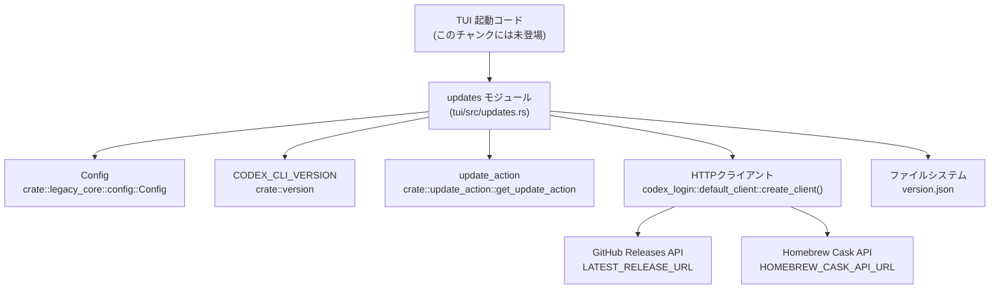
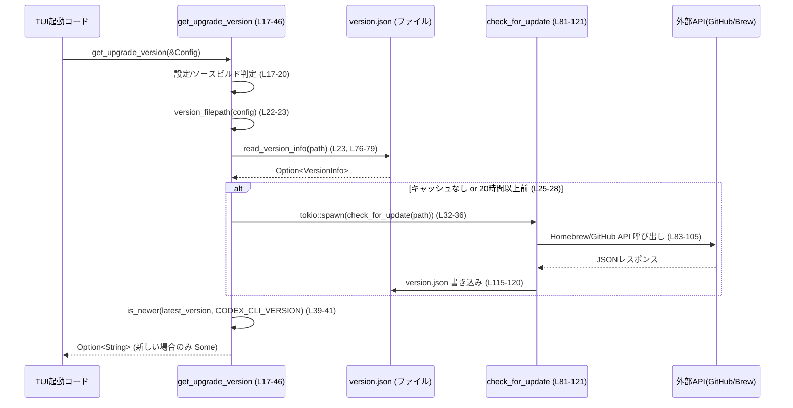

# `tui/src/updates.rs` コード解説

## 0. ざっくり一言

- CLI/TUI の **アップデート有無の判定と、その結果のキャッシュ(version.json)管理** を行うモジュールです。
- GitHub API / Homebrew API から最新バージョンを取得し、ポップアップ表示や「二度と表示しない」制御に使う情報を扱います。

---

## 1. このモジュールの役割

### 1.1 概要

- このモジュールは **CLI の新しいバージョンが存在するかどうかを判定し、結果をローカルにキャッシュする問題** を解決するために存在し、次の機能を提供します。
  - TUI 起動時に「アップデートありか」を高速に判定する (`get_upgrade_version`)【tui/src/updates.rs:L17-46】
  - バックグラウンドで最新バージョン情報を取得し `version.json` に保存する【L81-121】
  - ユーザーが「このバージョンのポップアップは表示しない」と選択した情報を記録・尊重する【L48-55, L137-153, L155-170】
  - 文字列バージョンのパースと比較（セマンティックバージョン風）【L123-128, L172-177】

### 1.2 アーキテクチャ内での位置づけ

TUI から見た依存関係は次のようになっています（全てこのファイル内／インポートに基づく事実です）。



- `get_upgrade_version` / `get_upgrade_version_for_popup` は TUI 側から呼ばれる公開 API です【L17-46, L139-153】。
- 実際のネットワークアクセス（GitHub / Homebrew）は `check_for_update` 内で行われます【L81-105】。
- 永続化ファイル `version.json` のパスは `Config.codex_home` を元に組み立てられます【L72-74, L57】。

### 1.3 設計上のポイント

- **非同期更新 + キャッシュ読み出し**  
  - 起動時はローカルキャッシュのみを同期的に読み出し、ネットワーク更新は `tokio::spawn` でバックグラウンド実行します【L22-24, L32-36】。
- **ユーザー設定とビルド種別の尊重**  
  - `Config.check_for_update_on_startup` が `false` の場合、またはバージョンが `0.0.0` の「ソースビルド」の場合は一切のチェックを行いません【L17-20, L140-142, L180-182】。
- **エラーハンドリング方針**  
  - ファイル読み込み・HTTP エラーなどは `anyhow::Result` として扱い、上位ロジック（起動フロー）は基本的に失敗を無視（ログのみ）して継続します【L23, L76-79, L81-121, L35-36】。
- **バージョン比較のシンプルさと保守性**  
  - `parse_version` により `"MAJOR.MINOR.PATCH"` 形式のみを扱い、プリリリース等を含む複雑な SemVer は「比較不能」として `None` を返す実装です【L172-177, L217-220】。
- **並行性**  
  - ファイル書き込みは `tokio::fs` を用いた非同期 I/O で行われます【L117-120, L165-168】。
  - 同一ファイル (`version.json`) への複数タスクからの同時書き込みに対するロックは実装されていません（コードからはそのような機構は読み取れません）。

---

## 2. コンポーネント（型・関数）一覧

### 2.1 型一覧

| 名前 | 種別 | フィールド / 役割 | 定義位置 |
|------|------|------------------|----------|
| `VersionInfo` | 構造体（非公開） | `latest_version: String`（最新バージョン文字列）、`last_checked_at: DateTime<Utc>`（最終チェック時刻）、`dismissed_version: Option<String>`（ユーザーが閉じた最新バージョン）【L48-55】 | `tui/src/updates.rs:L48-55` |
| `ReleaseInfo` | 構造体（非公開） | GitHub Releases API の JSON から取得する `tag_name: String`【L62-65】 | `tui/src/updates.rs:L62-65` |
| `HomebrewCaskInfo` | 構造体（非公開） | Homebrew Cask API の JSON から取得する `version: String`【L67-70】 | `tui/src/updates.rs:L67-70` |

### 2.2 関数インベントリー（全 16 件）

| 関数名 | シグネチャ（抜粋） | 公開範囲 | 用途 / 役割 | 定義位置 |
|--------|--------------------|----------|-------------|----------|
| `get_upgrade_version` | `pub fn get_upgrade_version(config: &Config) -> Option<String>` | 公開 | 起動時に「現在より新しいバージョンが存在するか」を判定し、そのバージョン文字列を返す【L17-46】 | `tui/src/updates.rs:L17-46` |
| `version_filepath` | `fn version_filepath(config: &Config) -> PathBuf` | 非公開 | `version.json` のファイルパスを組み立てる【L72-74】 | `tui/src/updates.rs:L72-74` |
| `read_version_info` | `fn read_version_info(version_file: &Path) -> anyhow::Result<VersionInfo>` | 非公開 | `version.json` を読み込み `VersionInfo` にデシリアライズする【L76-79】 | `tui/src/updates.rs:L76-79` |
| `check_for_update` | `async fn check_for_update(version_file: &Path) -> anyhow::Result<()>` | 非公開 | GitHub/Homebrew API を叩いて最新バージョンを取得し、`version.json` に書き出す【L81-121】 | `tui/src/updates.rs:L81-121` |
| `is_newer` | `fn is_newer(latest: &str, current: &str) -> Option<bool>` | 非公開 | 2 つのバージョン文字列を比較し、`latest` が新しいかどうかを返す【L123-128】 | `tui/src/updates.rs:L123-128` |
| `extract_version_from_latest_tag` | `fn extract_version_from_latest_tag(latest_tag_name: &str) -> anyhow::Result<String>` | 非公開 | GitHub のタグ名 `rust-v1.2.3` から `1.2.3` 部分を取り出す【L130-135】 | `tui/src/updates.rs:L130-135` |
| `get_upgrade_version_for_popup` | `pub fn get_upgrade_version_for_popup(config: &Config) -> Option<String>` | 公開 | ポップアップ用に、ユーザーの「このバージョンは表示しない」設定を考慮して最新バージョンを返す【L137-153】 | `tui/src/updates.rs:L137-153` |
| `dismiss_version` | `pub async fn dismiss_version(config: &Config, version: &str) -> anyhow::Result<()>` | 公開 | 指定バージョンを「表示しない」として `version.json` に記録する【L155-170】 | `tui/src/updates.rs:L155-170` |
| `parse_version` | `fn parse_version(v: &str) -> Option<(u64, u64, u64)>` | 非公開 | `"MAJOR.MINOR.PATCH"` を数値タプルに変換する【L172-177】 | `tui/src/updates.rs:L172-177` |
| `is_source_build_version` | `fn is_source_build_version(version: &str) -> bool` | 非公開 | バージョンが `0.0.0`（ソースビルド）かどうかを判定する【L180-182】 | `tui/src/updates.rs:L180-182` |
| `extract_version_from_brew_api_json` | `fn extract_version_from_brew_api_json()` | テスト | Homebrew Cask の JSON から `version` を取り出せることのテスト【L188-201】 | `tui/src/updates.rs:L188-201` |
| `extracts_version_from_latest_tag` | `fn extracts_version_from_latest_tag()` | テスト | `extract_version_from_latest_tag` の成功パターンのテスト【L203-208】 | `tui/src/updates.rs:L203-208` |
| `latest_tag_without_prefix_is_invalid` | 同上 | テスト | `rust-v` プレフィックスがないタグをエラーにするテスト【L211-214】 | `tui/src/updates.rs:L211-214` |
| `prerelease_version_is_not_considered_newer` | 同上 | テスト | プリリリースを含む場合 `is_newer` が `None` を返すことのテスト【L217-220】 | `tui/src/updates.rs:L217-220` |
| `plain_semver_comparisons_work` | 同上 | テスト | 通常の `MAJOR.MINOR.PATCH` 比較の正しさのテスト【L222-227】 | `tui/src/updates.rs:L222-227` |
| `whitespace_is_ignored` | 同上 | テスト | 前後の空白を無視する挙動のテスト【L230-234】 | `tui/src/updates.rs:L230-234` |

---

## 3. 公開 API と詳細解説

### 3.1 型一覧（詳細）

（2.1 参照。ここでは利用時のポイントのみ簡潔に補足します。）

- `VersionInfo`【L48-55】  
  - `latest_version`: 次回以降の起動時に参照される「最新バージョン」。
  - `last_checked_at`: 20 時間以上前なら、バックグラウンド更新をトリガーします【L25-28】。
  - `dismissed_version`: ユーザーがポップアップを閉じた最新バージョン。`get_upgrade_version_for_popup` で使われます【L144-152】。

### 3.2 重要関数の詳細

#### `get_upgrade_version(config: &Config) -> Option<String>`

**概要**

- 起動時に実行され、**現在の CLI バージョンより新しいリリースが存在する場合に、そのバージョン文字列を返す**関数です【L17-46】。
- ネットワークアクセスは行わず、ローカルキャッシュ（`version.json`）を読みます。必要に応じて **バックグラウンドでキャッシュ更新タスク** を起動します【L22-24, L32-36】。

**引数**

| 引数名 | 型 | 説明 |
|--------|----|------|
| `config` | `&Config` | 設定オブジェクト。`codex_home` と `check_for_update_on_startup` を参照します【L17-23, L72-74】 |

**戻り値**

- `Option<String>`  
  - `Some(version)`：現在より新しいバージョンが存在すると判定された場合、そのバージョン文字列【L39-45】。
  - `None`：新しいバージョンがない／判定不能／アップデートチェックが無効な場合【L18-20, L39-45】。

**内部処理の流れ**

1. 設定チェック  
   - `config.check_for_update_on_startup` が `false` なら `None` を返して終了【L17-20】。
   - `CODEX_CLI_VERSION` がソースビルド (`0.0.0`) の場合も `None`【L17-20, L180-182】。
2. キャッシュファイルのパス算出  
   - `version_filepath(config)` により `config.codex_home` 配下の `version.json` を決定【L22, L72-74】。
3. キャッシュ読み込み  
   - `read_version_info` で `VersionInfo` を読み込み、失敗した場合は `info: Option<VersionInfo> = None` とする【L23, L76-79】。
4. 更新が古いかの判定  
   - キャッシュがない (`info.is_none()`) か、`last_checked_at` が 20 時間以上前ならバックグラウンド更新をトリガー【L25-28】。
   - 更新タスクは `tokio::spawn` で非同期に実行し、エラーは `tracing::error!` にログ出力【L32-36】。
5. 新バージョンの判定  
   - `info.and_then(...)` で、`VersionInfo.latest_version` と `CODEX_CLI_VERSION` を `is_newer` で比較【L39-41, L123-128】。
   - `is_newer` が `Some(true)` を返したときのみ `Some(latest_version)` を返し、それ以外は `None`【L39-45】。

**Examples（使用例）**

TUI 起動時に、バナー表示用の情報を取得する例です。

```rust
use crate::legacy_core::config::Config;
use crate::tui::updates::get_upgrade_version;

fn maybe_print_update_banner(config: &Config) {
    if let Some(latest) = get_upgrade_version(config) {       // ローカルキャッシュを参照して判定
        eprintln!("A new version of codex is available: {latest}");
    }
}
```

- この関数呼び出し時点で、`tokio` ランタイムが動作している必要があります（内部で `tokio::spawn` を呼ぶため）【L32-36】。

**Errors / Panics**

- 直接 `Result` は返さず、失敗時も `Option` で `None` を返す設計です。
- 内部でのエラーの扱い:
  - `read_version_info` エラー → `.ok()` により `None` へ変換【L23】。
  - バックグラウンドタスク `check_for_update` のエラー → `tracing::error!` でログしつつ無視【L32-36】。
- `tokio::spawn` を利用しているため、**Tokio ランタイムの外で呼び出すとランタイム依存の panic が発生する可能性**があります（コード上に明示はありませんが、Tokio の仕様によるものです）。

**Edge cases（エッジケース）**

- キャッシュファイルが存在しない / 壊れている  
  → `read_version_info` が失敗し `info == None` になり、**バックグラウンド更新を行い、現在の起動では `None` を返す**【L23, L25-28】。
- キャッシュが古い（20 時間超）  
  → 既存のキャッシュ内容を使って新バージョン判定を行いつつ、バックグラウンドで更新を行います【L25-28】。
- バージョン文字列が `"0.11.0-beta.1"` のようにプリリリース付き  
  → `parse_version` が `None` を返すため、`is_newer` も `None` となり、「新しいかどうか判定できない」として `None` を返します【L123-128, L172-177, L217-220】。

**使用上の注意点**

- `get_upgrade_version` 自体は同期関数ですが、**Tokio ランタイム上で呼び出す前提**になっています（`tokio::spawn` を使用）【L32-36】。
- ネットワークやファイル I/O の失敗は `None` になるため、「`None` だからアップデートなし」と断定しないほうが安全です。

---

#### `async fn check_for_update(version_file: &Path) -> anyhow::Result<()>`

**概要**

- **最新バージョン情報を外部 API から取得し、`version.json` に書き込む** 非公開の非同期関数です【L81-121】。
- 呼び出し側からは `anyhow::Result<()>` としてエラーを返しますが、`get_upgrade_version` からはバックグラウンドタスクとして呼ばれ、エラーはログに送られるのみです【L32-36】。

**引数**

| 引数名 | 型 | 説明 |
|--------|----|------|
| `version_file` | `&Path` | 書き込み対象となる `version.json` のパス【L81】 |

**戻り値**

- `anyhow::Result<()>`  
  - `Ok(())`：更新に成功。
  - `Err(e)`：HTTP エラー、JSON パースエラー、ファイル I/O エラーなど。

**内部処理の流れ**

1. 更新方法の選択【L81-105】  
   - `update_action::get_update_action()` によりアップデート手段を取得【L82】。
   - `Some(UpdateAction::BrewUpgrade)` の場合:
     - Homebrew Cask API (`HOMEBREW_CASK_API_URL`) を叩き、`HomebrewCaskInfo.version` を使用【L83-91】。
   - それ以外の場合:
     - GitHub Releases API (`LATEST_RELEASE_URL`) を叩き、`ReleaseInfo.tag_name` から `extract_version_from_latest_tag` でバージョンを抽出【L93-104, L130-135】。
2. 前回の dismiss 設定の引き継ぎ【L107-113】  
   - 既存の `VersionInfo` を `read_version_info` で読み込み、`dismissed_version` を新しい `VersionInfo` にコピー。
3. 新しい `VersionInfo` 生成【L109-113】  
   - `latest_version`、`Utc::now()` を `last_checked_at` として設定。
4. JSON のシリアライズとディレクトリ作成【L115-119】  
   - `serde_json::to_string(&info)` で JSON 文字列化し、末尾に改行をつける【L115】。
   - 親ディレクトリがない場合は、`tokio::fs::create_dir_all` で作成【L116-118】。
5. ファイル書き込み【L119-120】  
   - `tokio::fs::write(version_file, json_line).await?` で書き込み。

**Examples（使用例）**

`get_upgrade_version` から直接呼ばれるため、通常はアプリケーションコードから直接呼び出す必要はありません【L32-35】。  
明示的に使うなら、Tokio ランタイム内で次のようになります。

```rust
use std::path::Path;
use crate::tui::updates::check_for_update;  // この関数は非公開なので、実際には直接呼べません。

async fn force_update(path: &Path) -> anyhow::Result<()> {
    check_for_update(path).await
}
```

※ 実際には `check_for_update` は `pub` ではないため、このような直接利用はできません。この例は内部フロー理解用です。

**Errors / Panics**

- HTTP 関連
  - `.send().await?` で送信エラーを `Err` として返却【L86-87, L98-99】。
  - `.error_for_status()?` で 4xx/5xx レスポンスをエラーに変換【L88-89, L100-101】。
- JSON デシリアライズ失敗  
  → `json::<T>().await?` で `Err`【L89-90, L101-102, L76-79】。
- ファイル I/O エラー  
  → `create_dir_all` / `write` の `?` 演算子経由で `Err`【L116-120】。
- この関数内に `panic!` を引き起こすコードはありません（`anyhow::Result` 経由のエラー伝播のみ）。

**Edge cases**

- Homebrew / GitHub API のスキーマ変更  
  - 期待するフィールド (`version`, `tag_name`) がない／型が変わった場合、JSON パースエラーとなり `Err` を返します【L84-90, L94-102】。
- タグ名が `rust-v` で始まらない場合  
  - `extract_version_from_latest_tag` が `Err` を返し、この関数も `Err` になります【L103-104, L130-135, L211-214】。
- 既存の `version.json` が壊れている場合  
  - `read_version_info` が `Err` を返し、`prev_info` が `None` となり、`dismissed_version` が引き継がれないだけで処理自体は継続します【L107-113】。

**使用上の注意点**

- ファイル書き込みとディレクトリ作成は非同期 (`tokio::fs`) で行われるため、**ブロッキング I/O にはなりません**【L116-120】。
- 同時に複数タスクが `check_for_update` を呼ぶと、最後に書き込んだものが勝つ形になります。ロックなどの排他制御は実装されていません（コードからは確認できません）。

---

#### `get_upgrade_version_for_popup(config: &Config) -> Option<String>`

**概要**

- 「アップデートがあります」ポップアップに表示すべきバージョンを返す公開関数です【L137-153】。
- ユーザーが以前「このバージョンは表示しない」とした場合、そのバージョンは返さないようになっています。

**引数**

| 引数名 | 型 | 説明 |
|--------|----|------|
| `config` | `&Config` | 起動設定。アップデートチェック有無など【L139-142】 |

**戻り値**

- `Option<String>`  
  - `Some(version)`：ポップアップに表示すべき最新バージョン。
  - `None`：ポップアップを出さない（アップデートなし、設定で無効、あるいはそのバージョンが既に dismiss 済み）【L140-152】。

**内部処理の流れ**

1. `check_for_update_on_startup` / ソースビルド判定【L139-142】。
2. `get_upgrade_version` で新バージョンを取得【L145】（ここでキャッシュ更新のトリガーも兼ねます）。
3. 取得した `latest` が、`VersionInfo.dismissed_version` と一致するか確認【L146-151】。
   - 一致していれば `None` を返し、不一致または `dismissed_version == None` なら `Some(latest)` を返す【L147-152】。

**Examples（使用例）**

```rust
use crate::legacy_core::config::Config;
use crate::tui::updates::get_upgrade_version_for_popup;

fn maybe_show_popup(config: &Config) {
    if let Some(latest) = get_upgrade_version_for_popup(config) {
        // ポップアップ表示ロジック（UI側）はこのモジュール外
        println!("Update available: {latest}");
    }
}
```

**Errors / Panics**

- 内部で `get_upgrade_version` と `read_version_info` を呼びますが、どちらもエラーを `Option` 化 (`None`) しており、関数シグネチャとしては `Result` を返しません【L145, L147-151】。
- `tokio::spawn` と同様、Tokio ランタイム外で `get_upgrade_version` が呼ばれる場合の挙動はランタイムに依存します（この関数では直接 `spawn` していませんが、内部で呼び出しています）。

**Edge cases**

- `version.json` が存在しない場合  
  - `get_upgrade_version` がバックグラウンド更新を開始しますが、この起動では `None` を返すため、ポップアップは表示されません【L22-28, L145】。
- `dismissed_version` が別の古いバージョンを指している場合  
  - 最新バージョンとは一致せず、ポップアップは表示されます【L147-152】。

**使用上の注意点**

- **ポップアップの表示可否判定はこの関数の結果のみで行う**と、UI コードがシンプルになります。
- dismiss 処理は別途 `dismiss_version` で行われるため、バージョン文字列の一貫性（同じ文字列を使うこと）が重要です。

---

#### `pub async fn dismiss_version(config: &Config, version: &str) -> anyhow::Result<()>`

**概要**

- ユーザーが「このバージョンのアップデート通知は不要」と選択した際に、そのバージョンを `VersionInfo.dismissed_version` として永続化する関数です【L155-170】。
- 次回以降 `get_upgrade_version_for_popup` が同じバージョンをポップアップに出さないように制御します【L144-152】。

**引数**

| 引数名 | 型 | 説明 |
|--------|----|------|
| `config` | `&Config` | `version.json` の場所を決めるために使用【L158, L72-74】 |
| `version` | `&str` | dismiss 対象のバージョン文字列（通常は `get_upgrade_version_for_popup` が返した値）【L157-164】 |

**戻り値**

- `anyhow::Result<()>`  
  - `Ok(())`：dismiss 設定が正常に保存されたか、もしくは `version.json` が存在せず何もせずに終了した場合【L159-162】。
  - `Err(e)`：ディレクトリ作成や書き込み時の I/O エラーなど。

**内部処理の流れ**

1. パス構築【L158】  
   - `version_filepath(config)` で `version.json` のパスを取得【L72-74】。
2. 既存情報読込【L159-162】  
   - `read_version_info` を呼び、成功時は `info` を取得【L159-160】。
   - エラー時（ファイルなし・壊れなど）は `Ok(())` を返して早期終了【L159-162】（dismiss しない）。
3. `dismissed_version` の更新【L163】  
   - `info.dismissed_version = Some(version.to_string())`。
4. JSON シリアライズと書き込み【L164-169】  
   - `serde_json::to_string(&info)` で文字列化【L164】。
   - 親ディレクトリを `create_dir_all` で作成【L165-167】。
   - `tokio::fs::write` でファイルへ書き込み【L168】。

**Examples（使用例）**

```rust
use crate::legacy_core::config::Config;
use crate::tui::updates::{get_upgrade_version_for_popup, dismiss_version};

async fn handle_update_popup(config: &Config) -> anyhow::Result<()> {
    if let Some(latest) = get_upgrade_version_for_popup(config) {
        // ユーザーが「今後このバージョンは表示しない」を選んだと仮定
        dismiss_version(config, &latest).await?;          // 非同期で永続化
    }
    Ok(())
}
```

**Errors / Panics**

- `version.json` の読み込みに失敗した場合は **エラーを返さず `Ok(())`** を返すため、呼び出し側にはエラーとして見えません【L159-162】。
- それ以外のエラー（ディレクトリ作成、ファイル書き込み）は `Err` として返されます【L165-169】。

**Edge cases**

- `version.json` がない or 壊れている  
  → dismiss 情報は保存されず、そのまま `Ok(())` で終了【L159-162】。
- `version` に `latest_version` と異なる文字列を渡した場合  
  → `get_upgrade_version_for_popup` の判定と一致しないため、期待通りに dismiss が効かない可能性があります【L147-152, L163】。

**使用上の注意点**

- **非同期関数** のため、必ず `.await` して利用する必要があります【L157】。
- dismiss するバージョン文字列は、可能な限り `get_upgrade_version_for_popup` または `get_upgrade_version` が返した値をそのまま渡すと安全です。

---

#### `fn is_newer(latest: &str, current: &str) -> Option<bool>`

**概要**

- 2 つのバージョン文字列を比較し、`latest` が `current` より大きいかどうかを返すヘルパー関数です【L123-128】。
- 文字列は `"MAJOR.MINOR.PATCH"` 形式のみサポートし、それ以外は比較不能 (`None`) とします【L172-177, L217-220】。

**引数**

| 引数名 | 型 | 説明 |
|--------|----|------|
| `latest` | `&str` | 比較対象の、最新候補バージョン【L123】 |
| `current` | `&str` | 現在バージョン【L123】 |

**戻り値**

- `Option<bool>`  
  - `Some(true)`：`latest` の方が新しい。
  - `Some(false)`：`latest` の方が古いか同じ。
  - `None`：どちらか一方でもパースに失敗（例えばプリリリース表現を含む）【L124-127】。

**内部処理の流れ**

1. `parse_version` を `latest` と `current` に対して呼び出し【L124】。
2. 両方 `Some((maj, min, pat))` を返した場合は `l > c` を比較して `Some(true/false)`【L124-125】。
3. いずれかが `None` の場合は `None`【L126-127】。

**Examples**

```rust
assert_eq!(is_newer("0.11.1", "0.11.0"), Some(true));
assert_eq!(is_newer("0.11.0", "0.11.1"), Some(false));
assert_eq!(is_newer("0.11.0-beta.1", "0.11.0"), None); // プリリリースは比較しない
```

（上記はテストコードと一致します【L222-227, L217-220】）

**使用上の注意点**

- `None` は「エラー」とも「比較不能」とも解釈できるため、呼び出し側では `unwrap_or(false)` などで扱いを明示する必要があります【L40】。

---

#### `fn parse_version(v: &str) -> Option<(u64, u64, u64)>`

**概要**

- 前後の空白を除去した上で、`"MAJOR.MINOR.PATCH"` 形式の文字列を `(maj, min, pat)` の `u64` タプルに変換します【L172-177】。

**引数 / 戻り値**

- 引数 `v: &str`。
- 戻り値 `Option<(u64, u64, u64)>`  
  - 整数 3 要素に正しくパースできたとき `Some`、それ以外は `None`【L172-177】。

**内部処理**

1. `v.trim().split('.')` で分割【L173】。
2. `maj`, `min`, `pat` を順に取り出し、それぞれ `u64` にパース【L174-176】。
3. 途中で `next()` が `None` または `parse` 失敗 (`Err`) の場合は即帰り `None`（`?` 演算子による）【L174-176】。

**Examples**

```rust
assert_eq!(parse_version("1.2.3"), Some((1, 2, 3)));
assert_eq!(parse_version(" 1.2.3 \n"), Some((1, 2, 3))); // trim により空白は無視
assert_eq!(parse_version("1.2"), None);                  // 要素不足
```

（テスト `whitespace_is_ignored` と一致【L230-233】）

**使用上の注意点**

- `1.2.3-beta.1` のような文字列は `pat` の `parse::<u64>()` が失敗するため `None` になります【L175-176】。

---

#### `fn extract_version_from_latest_tag(latest_tag_name: &str) -> anyhow::Result<String>`

**概要**

- GitHub Releases のタグ名（例: `"rust-v1.5.0"`）から、バージョン部分（`"1.5.0"`）を取り出す関数です【L130-135】。

**引数 / 戻り値**

- 引数 `latest_tag_name: &str`。
- 戻り値 `anyhow::Result<String>`  
  - `Ok("1.5.0".to_string())` のような形式。
  - タグ名が `"rust-v"` プレフィックスを持たない場合は `Err`。

**内部処理**

1. `strip_prefix("rust-v")` で `"rust-v"` を取り除こうとする【L131-132】。
2. 成功時は残りの文字列 `str::to_owned` を返却【L133】。
3. 失敗時は `anyhow::anyhow!` でエラーを生成【L134】。

**Examples**

```rust
assert_eq!(
    extract_version_from_latest_tag("rust-v1.5.0").unwrap(),
    "1.5.0"
);
assert!(extract_version_from_latest_tag("v1.5.0").is_err()); // "rust-v" で始まっていない
```

（テスト `extracts_version_from_latest_tag`, `latest_tag_without_prefix_is_invalid`【L203-208, L211-214】）

**使用上の注意点**

- タグ名のフォーマットが変わった場合、この関数が `Err` を返し、`check_for_update` 全体の失敗要因になります【L103-104】。

---

### 3.3 その他の関数

| 関数名 | 役割 | 定義位置 |
|--------|------|----------|
| `version_filepath(config: &Config) -> PathBuf` | `config.codex_home` 配下の `version.json` へのパスを返す【L72-74】 | `tui/src/updates.rs:L72-74` |
| `read_version_info(version_file: &Path) -> anyhow::Result<VersionInfo>` | ファイルを同期的に読み込み、`VersionInfo` にデシリアライズ【L76-79】 | `tui/src/updates.rs:L76-79` |
| `is_source_build_version(version: &str) -> bool` | `parse_version(version) == Some((0,0,0))` かどうかでソースビルド判定【L180-182】 | `tui/src/updates.rs:L180-182` |

---

## 4. データフロー

ここでは、「TUI 起動時にアップデートバナーを表示するかどうか決める」典型シナリオのデータフローを示します。

### 4.1 起動時のフロー（`get_upgrade_version` 中心）



**要点**

- 起動時の同期パスでは **ネットワーク I/O を行わず**、ローカルキャッシュのみを読みます【L22-24】。
- キャッシュが古い場合は、UI をブロックしないよう `tokio::spawn` でバックグラウンド更新を行います【L25-28, L32-36】。
- 実際に表示するかどうかは `Option<String>` によって TUI 側が判断します【L39-45】。

### 4.2 ポップアップ + dismiss のフロー（概要）

1. `get_upgrade_version_for_popup` が `get_upgrade_version` を呼び出し、新バージョン候補を取得【L139-145】。
2. `read_version_info` で `dismissed_version` を読み出し、現在の `latest` と一致したらポップアップ抑止【L144-152】。
3. ユーザーが「このバージョンは表示しない」を選んだ場合、UI 側で `dismiss_version(config, latest).await` を呼び、`dismissed_version` を保存【L157-169】。

---

## 5. 使い方（How to Use）

### 5.1 基本的な使用方法

TUI アプリケーションの起動コードから、このモジュールの公開 API を利用する典型的な流れです。

```rust
use crate::legacy_core::config::Config;
use crate::tui::updates::{
    get_upgrade_version,
    get_upgrade_version_for_popup,
    dismiss_version,
};

// Tokio ランタイム内で呼び出される想定
async fn startup(config: &Config) -> anyhow::Result<()> {
    // バナー用 (テキストメッセージなど)
    if let Some(latest) = get_upgrade_version(config) {    // L17-46
        eprintln!("A new version is available: {latest}");
    }

    // ポップアップ用 (ユーザーに見せるかどうかの最終判定)
    if let Some(latest) = get_upgrade_version_for_popup(config) { // L139-153
        // ... ポップアップUI表示 ...

        // ユーザーが "Don't show this version again" を選んだ場合:
        dismiss_version(config, &latest).await?;            // L157-170
    }

    Ok(())
}
```

**注意点**

- `get_upgrade_version` 自体は同期関数ですが、内部で `tokio::spawn` を使うため、**呼び出しは Tokio ランタイムの中で行う必要**があります【L32-36】。
- `dismiss_version` は非同期関数なので、`.await` を忘れると dismiss 情報が保存されません【L157】。

### 5.2 よくある使用パターン

- **単に「アップデートあり/なし」を知りたい場合**  
  → `get_upgrade_version` の戻り値の有無だけを見れば足ります【L39-45】。
- **ユーザーの選択を尊重したい場合**  
  → `get_upgrade_version_for_popup` と `dismiss_version` を組み合わせて利用します【L139-153, L155-170】。
- **ソースビルドでアップデートチェックを無効化したい場合**  
  → `CODEX_CLI_VERSION` を `"0.0.0"` にしておけば（実装上そう解釈されています）、すべてのチェックがスキップされます【L17-20, L140-142, L180-182】。

### 5.3 よくある間違いと正しい例

```rust
// 間違い例: Tokio ランタイム外から get_upgrade_version を呼ぶ
fn main() {
    let config = load_config();
    let _ = get_upgrade_version(&config);  // 内部で tokio::spawn を呼ぶため危険
}

// 正しい例: Tokio ランタイム内で呼び出す
#[tokio::main]
async fn main() {
    let config = load_config();
    let _ = get_upgrade_version(&config);  // ランタイム内なので tokio::spawn が安全に動く
}
```

```rust
// 間違い例: dismiss_version の .await を忘れる
async fn on_dismiss_button(config: &Config, version: String) {
    dismiss_version(config, &version);      // Future を作るだけで開始されない
}

// 正しい例
async fn on_dismiss_button(config: &Config, version: String) -> anyhow::Result<()> {
    dismiss_version(config, &version).await?;
    Ok(())
}
```

### 5.4 モジュール全体の使用上の注意点（まとめ）

- **Tokio ランタイム前提**  
  - `get_upgrade_version` から `tokio::spawn` が呼ばれるため、ランタイム外では利用しない前提になっています【L32-36】。
- **ファイルの競合書き込み**  
  - `check_for_update` と `dismiss_version` が別タスクで同時に `version.json` を書き換える可能性がありますが、ロック機構は実装されていません【L81-121, L155-170】。
- **比較対象バージョンのフォーマット**  
  - `"MAJOR.MINOR.PATCH"` 以外は比較不能 (`None`) として扱われるため、プリリリース等を含むバージョン表現を増やす際は注意が必要です【L172-177, L217-220】。

---

## 6. 変更の仕方（How to Modify）

### 6.1 新しい機能を追加する場合

例として、「別の配信チャネル（例: 自前の API）からバージョン取得を追加する」場合の入口です。

1. **ネットワーク取得ロジックの追加**  
   - `check_for_update` 内の `match update_action::get_update_action()` 分岐【L81-105】に新しい分岐を追加する形が自然です。
   - 新たな JSON スキーマが必要な場合は、このファイルに新しい `struct XxxInfo` を追加し、`serde::Deserialize` を derive します（`ReleaseInfo` / `HomebrewCaskInfo` のパターン【L62-70】）。
2. **バージョン文字列形式の統一**  
   - 既存コードは最終的に `VersionInfo.latest_version: String` に格納し、`parse_version` / `is_newer` で比較します【L48-55, L123-128, L172-177】。
   - 新しい情報源もこの形式（`"MAJOR.MINOR.PATCH"`）に正規化する必要があります。

### 6.2 既存の機能を変更する場合の注意点

- **バージョン比較ロジック変更時**  
  - `is_newer` / `parse_version` を変更する場合は、テスト群（`prerelease_version_is_not_considered_newer`, `plain_semver_comparisons_work`, `whitespace_is_ignored`【L217-234】）がカバーしている前提を確認し、必要に応じて更新します。
- **ファイルフォーマット変更時**  
  - `VersionInfo` のフィールドや JSON 形式を変更する場合は、`read_version_info` / `check_for_update` / `dismiss_version` がすべて影響を受けます【L48-55, L76-79, L81-121, L155-170】。
  - 既存 `version.json` との後方互換性が必要かどうかは、仕様側の判断になります（このチャンクからは不明です）。
- **エラーの扱いを厳しくしたい場合**  
  - 現状、キャッシュ読み込み失敗や dismiss 読み込み失敗はほぼ黙殺されます【L23, L159-162】。
  - アプリケーション全体で「アップデートチェックの失敗をどう扱うか」を決めた上で、`Result` を返す API に変更するかどうかを検討することになります。

---

## 7. 関連ファイル・モジュール

このモジュールと密接に関係する外部モジュール（コード上で参照されているもの）です。

| パス / モジュール | 役割 / 関係 |
|-------------------|------------|
| `crate::legacy_core::config::Config` | `codex_home` や `check_for_update_on_startup` を提供する設定オブジェクト【L3, L17-23, L72-74】。ファイルパス（ソース位置）はこのチャンクには現れません。 |
| `crate::version::CODEX_CLI_VERSION` | 実行中 CLI のバージョン文字列。ソースビルド (`0.0.0`) 判定や新旧比較に使用【L15, L17-20, L39-41, L140-142】。 |
| `crate::update_action` / `UpdateAction` | 現在のアップデート方法（Homebrew 経由か、直接アップデートかなど）を表すモジュール・列挙体【L4-5, L81-93】。具体的な定義はこのチャンクには現れません。 |
| `codex_login::default_client::create_client` | HTTP クライアント生成関数。GitHub / Homebrew API 呼び出しで使用【L9, L83-90, L96-102】。 |
| `tokio` | 非同期タスク実行 (`tokio::spawn`) と非同期ファイル I/O (`tokio::fs`) を提供【L32-36, L116-120, L165-168】。 |
| `serde` / `serde_json` | `VersionInfo`, `ReleaseInfo`, `HomebrewCaskInfo` の（逆）シリアライズに使用【L48-55, L62-70, L76-79, L84-90, L95-102, L115, L164】。 |

---

### 補足: テストと品質面のメモ

- **テストカバレッジ**  
  - JSON パース、タグのフォーマット、プレリリース比較不可の挙動、空白の扱いなど、文字列処理の部分はテストでカバーされています【L188-234】。
  - 実際の HTTP 通信やファイル I/O の成功・失敗パスは、このチャンク内のテストではカバーされていません。
- **観測性（ログ）**  
  - `check_for_update` の失敗は `tracing::error!` でログされます【L35-36】。それ以外（`read_version_info` 失敗など）はログされません。

この情報を踏まえると、更新チェックの挙動を理解し、UI 側から安全に利用・変更する際の指針が得られます。
