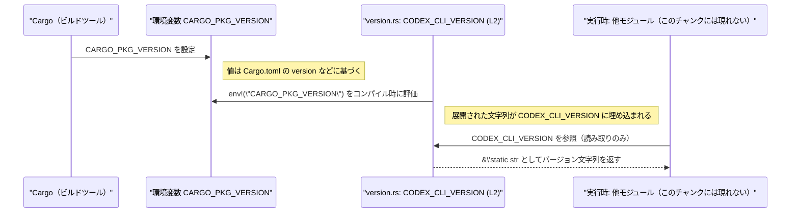

# tui/src/version.rs コード解説

## 0. ざっくり一言

`tui/src/version.rs` は、ビルド時に埋め込まれた **Codex CLI のバージョン文字列を公開する定数**を 1 つだけ定義しているモジュールです（version.rs:L1-2）。

---

## 1. このモジュールの役割

### 1.1 概要

- このモジュールは、**Codex CLI のビルドされたバージョン情報を、他のコードから参照可能にする**ために存在します（version.rs:L1-2）。
- バージョンは Cargo が設定する環境変数 `CARGO_PKG_VERSION` を元に、コンパイル時に決定されます（version.rs:L2）。

### 1.2 アーキテクチャ内での位置づけ

このモジュール自身は、環境変数からバージョン文字列を取得して定数に格納するだけです。  
誰がこの定数を参照しているかは、このチャンクには現れません（version.rs:L1-2）。

```mermaid
graph TD
    subgraph "ビルド時"
        Cargo["Cargo（ビルドツール）"]
        Env["環境変数 CARGO_PKG_VERSION"]
    end

    subgraph "tui/src/version.rs (L1-2)"
        VersionConst["pub const CODEX_CLI_VERSION: &str"]
    end

    Cargo --> Env
    Env --> VersionConst["env!(\"CARGO_PKG_VERSION\") で展開"]

    %% 呼び出し元はこのチャンクにはないことを明示
    Other["他モジュール（このチャンクには現れない）"] -. 参照 .-> VersionConst
```

- 依存元（誰が `CODEX_CLI_VERSION` を使うか）は、このファイルからは不明です。
- 依存先は、標準マクロ `env!` とコンパイル時環境変数 `CARGO_PKG_VERSION` です（version.rs:L2）。

### 1.3 設計上のポイント

- **状態を持たない**: グローバルな不変定数 `pub const` のみを公開しており、実行時に変化する状態はありません（version.rs:L2）。
- **コンパイル時埋め込み**: `env!` マクロにより、ビルド時にバージョン文字列が埋め込まれます。実行時に環境変数を読む処理はありません（version.rs:L2）。
- **エラー挙動**: `env!` は指定した環境変数が存在しない場合、**コンパイルエラー**になります。ただし `CARGO_PKG_VERSION` は Cargo により常に設定されることが前提です。
- **並行性の懸念がない**: 定数（イミュータブルな `&'static str`）のみのため、スレッド間共有しても競合状態は起きません（version.rs:L2）。

---

## 2. 主要な機能一覧

このモジュールが提供する機能は 1 つです。

- `CODEX_CLI_VERSION` 定数: Codex CLI のバージョン文字列（`&'static str`）を公開する（version.rs:L2）

---

## 3. 公開 API と詳細解説

### 3.1 型・コンポーネント一覧

このモジュールは構造体や列挙体を定義していません（version.rs:L1-2）。  
代わりに、公開定数をコンポーネントとして一覧化します。

| 名前 | 種別 | 型 | 役割 / 用途 | 根拠 |
|------|------|----|-------------|------|
| `CODEX_CLI_VERSION` | 定数（`pub const`） | `&'static str` | Codex CLI の現在のバージョン文字列を表す不変定数。値はビルド時に `CARGO_PKG_VERSION` から埋め込まれる。 | version.rs:L1-2 |

#### 契約（Contracts）

`CODEX_CLI_VERSION` について、コードと Rust/Cargo の仕様から読み取れる前提条件を整理します。

- **常に定義される**: `pub const` として宣言されているため、このクレート内からは必ず参照可能です（version.rs:L2）。
- **型は不変**: 型は常に `&'static str` であり、これが変わるとコンパイルエラーになります（version.rs:L2）。
- **値の寿命**: `&'static str` なので、プログラム全体のライフタイムにわたり有効です（version.rs:L2）。
- **バージョンの内容**: 通常は `Cargo.toml` の `version` フィールドに対応する文字列（例: `"1.2.3"`）が入ります。これは Cargo の仕様によるもので、このチャンクには直接書かれていません。

#### Edge cases（エッジケース）

- **環境変数未定義**: `env!("CARGO_PKG_VERSION")` はコンパイル時に評価されるため、`CARGO_PKG_VERSION` が未定義の場合は **コンパイルエラー** となり、バイナリが生成されません（version.rs:L2）。
  - 通常の `cargo build` では Cargo が自動で設定するため、実用上このケースは発生しない想定です。
- **値の形式**: 数値のみ・セマンティックバージョニングでない文字列など、どんな文字列でも許容されます。`CODEX_CLI_VERSION` 自体は単なる文字列参照であり、形式チェックは行いません（version.rs:L2）。
- **実行時エラーなし**: コンパイルが通っている場合、`CODEX_CLI_VERSION` の参照でランタイムエラーやパニックが発生することはありません（version.rs:L2）。

#### Bugs / Security 観点

- **バグ要因**:
  - 実行時に他の環境変数からバージョンを取るようなコードではないため、動的なミスコンフィグレーションは起きません（version.rs:L2）。
  - バージョン文字列の値そのものは Cargo プロジェクト設定に依存し、このファイルでは検証しません。
- **セキュリティ**:
  - 公開されるのはバージョン文字列のみであり、機密情報は含みません（version.rs:L1-2）。
  - メタ情報としてログや User-Agent に載ることはありえますが、このファイルからは用途は分かりません（このチャンクには呼び出し元が現れません）。

### 3.2 関数詳細（最大 7 件）

このモジュールには **関数が 1 つも定義されていません**（version.rs:L1-2）。  
そのため、関数向けの詳細テンプレートに該当する対象はありません。

### 3.3 その他の関数

- なし（version.rs:L1-2）

---

## 4. データフロー

### 4.1 代表的なフローの概要

このモジュールの主なデータフローは **ビルド時のみ** 発生します。

1. Cargo がビルドプロセスの中で `CARGO_PKG_VERSION` 環境変数を設定する（Cargo の仕様）。
2. コンパイル時に `env!("CARGO_PKG_VERSION")` が評価され、対応する文字列リテラルへと展開される（version.rs:L2）。
3. 展開された文字列リテラルが `CODEX_CLI_VERSION` 定数としてバイナリに埋め込まれる（version.rs:L2）。
4. 実行時には、他のモジュールがこの定数を参照するだけで、追加の I/O や環境変数アクセスは発生しません（呼び出し元はこのチャンクには現れません）。

### 4.2 シーケンス図（ビルド〜実行）



- 呼び出し側 `App` はこのチャンクには現れず、実際にどのモジュールが参照しているかは不明です。
- 並行実行されるスレッドが複数あっても、`CODEX_CLI_VERSION` は読み取り専用の定数であり、競合は発生しません（version.rs:L2）。

---

## 5. 使い方（How to Use）

### 5.1 基本的な使用方法

`CODEX_CLI_VERSION` は単なる文字列定数なので、任意の場所から参照して表示などに使えます。  
以下は、CLI ツールが `--version` オプションでバージョンを表示する例です（あくまで使用例であり、このプロジェクト内にこのコードが存在するとは限りません）。

```rust
// 別モジュールから版数を表示する例
mod version; // `tui/src/version.rs` が `mod version;` で読み込まれている想定

fn print_version() {                                              // バージョンを表示する関数
    println!("Codex CLI version: {}", version::CODEX_CLI_VERSION); // 定数を参照して表示
}
```

このコードの結果として、コンパイル時に埋め込まれたバージョン文字列が標準出力に表示されます。

### 5.2 よくある使用パターン

#### ログやヘルプメッセージへの埋め込み

```rust
mod version;

fn log_startup() {
    // アプリケーション起動時に、バージョンつきでログ出力する例
    log::info!("Starting Codex CLI v{}", version::CODEX_CLI_VERSION);
}
```

#### プロトコルや API との組み合わせ（例）

```rust
mod version;

fn default_user_agent() -> String {
    // HTTP クライアントの User-Agent に CLI バージョンを含める例
    format!("codex-cli/{}", version::CODEX_CLI_VERSION)
}
```

### 5.3 よくある間違い（起こりうる誤用）

このファイル自体は単純ですが、似たパターンを利用するときに起こりそうな誤用を挙げます。

```rust
// （潜在的な誤用パターンの例）
// 実行時に変えたい値を env! で取得しようとする
pub const RUNTIME_CONFIG: &str = env!("RUNTIME_CONFIG");
// ↑ RUNTIME_CONFIG 環境変数がビルド時に設定されていないとコンパイルエラーになる
```

```rust
// 上記と対比した正しい例（実行時に変えたい場合）
// ※ これは version.rs のパターンではなく、誤用回避のための参考例です
fn read_runtime_config() -> Option<String> {
    std::env::var("RUNTIME_CONFIG").ok() // 実行時に環境変数を読む
}
```

`tui/src/version.rs` の場合は **「ビルド時に決まるべき値（バージョン）」** を `env!` で取得しているため、この誤用には当てはまりません（version.rs:L2）。

### 5.4 使用上の注意点（まとめ）

- **ビルド時固定**: バージョンはビルド時に固定されるため、バイナリを配布したあとに環境変数を変えても `CODEX_CLI_VERSION` の値は変わりません（version.rs:L2）。
- **環境依存性の限定**: 依存する環境変数は `CARGO_PKG_VERSION` のみであり、これは Cargo が管理します（version.rs:L2）。
- **スレッドセーフ**: `&'static str` の定数なので、どのスレッドから読んでも安全です（version.rs:L2）。
- **テスト**: このファイル内にはテストコードは含まれていません。`CODEX_CLI_VERSION` の値を前提にしたテストがあるかどうかは、このチャンクからは不明です（version.rs:L1-2）。

---

## 6. 変更の仕方（How to Modify）

### 6.1 新しい機能を追加する場合

例えば、「Codex CLI の API バージョン」や「プロトコルバージョン」など別種のバージョン定数を追加する場合の手順です。

1. **同じファイルに定数を追加する**  
   例:

   ```rust
   /// Codex CLI の API バージョン（例）
   pub const CODEX_API_VERSION: &str = "v1"; // 直接文字列を埋め込む
   ```

2. **Cargo 管理にするかを決める**  
   - アプリケーションバージョンと同様に Cargo から供給したいなら、独自の環境変数をビルドスクリプトで設定し、`env!` を使う必要があります。
   - このファイルにはビルドスクリプトは現れないため、具体的な連携方法は別ファイル（不明）側の話になります。

3. **既存呼び出しとの関係**  
   - 追加した定数は、`CODEX_CLI_VERSION` と型を揃える (`&'static str`) と扱いやすくなります（version.rs:L2 との一貫性）。
   - 既存コードが `CODEX_CLI_VERSION` に依存している限り、この定数を削除・リネームするとコンパイルエラーになります。

### 6.2 既存の機能を変更する場合

`CODEX_CLI_VERSION` の定義を変更する際の注意点です。

- **名前を変える場合**  
  - すべての参照サイトを更新しない限りコンパイルエラーになります。呼び出し元はこのチャンクには現れないため、IDE や `rg` などで参照箇所を検索する必要があります。
- **型を変える場合**  
  - 例: `String` や構造体に変更すると、すべての利用コードの型も合わせて変更する必要があります。
- **取得方法を変える場合**  
  - もし `env!("CARGO_PKG_VERSION")` をやめて固定文字列に変えるなどの変更を行うと、Cargo に依存しなくなりますが、`Cargo.toml` のバージョン変更と自動同期されなくなります（version.rs:L2）。
- **ビルドスクリプトとの連携**  
  - より複雑なバージョン情報（Git のコミットハッシュなど）を埋め込みたい場合は、`build.rs` などで環境変数を設定し `env!` で読むパターンが一般的ですが、そのようなコードはこのチャンクには現れません。

---

## 7. 関連ファイル

このチャンクから直接分かる関連ファイルはありませんが、一般的に次のようなファイルと関係している可能性があります。

| パス | 役割 / 関係 | 根拠 |
|------|------------|------|
| `Cargo.toml` | `CARGO_PKG_VERSION` の元となる `version` フィールドを定義するファイル。`CODEX_CLI_VERSION` の値は通常ここから導かれます。 | Cargo と `env!("CARGO_PKG_VERSION")` の仕様に基づく。version.rs:L2 と外部仕様の組合せ。 |
| `build.rs`（存在する場合） | 追加の環境変数を設定している可能性があるが、このチャンクには登場しないため不明。 | このファイル内には `build.rs` への言及はなく、「不明」とするのが妥当（version.rs:L1-2）。 |

- `CODEX_CLI_VERSION` を実際にどのモジュールが使っているかは、このチャンクには現れません。そのため、具体的な依存モジュール名は「不明」となります（version.rs:L1-2）。

---

### 付記：パフォーマンス / スケーラビリティ / 観測性について

- **パフォーマンス**:  
  `CODEX_CLI_VERSION` はコンパイル時に確定した静的文字列への参照であり、アクセスは単なる参照取得だけです。パフォーマンスへの影響は無視できるレベルです（version.rs:L2）。

- **スケーラビリティ**:  
  プロセス内のどれだけ多くの場所・スレッドから読まれても、追加コストはほとんどありません。大規模なアプリケーションでもスケール上の問題は生じません（version.rs:L2）。

- **観測性（Observability）**:  
  このモジュール自体はログ出力やメトリクスを行いません（version.rs:L1-2）。  
  ただし、他のモジュールが `CODEX_CLI_VERSION` を利用してログメッセージやヘルプテキストにバージョンを含めることで、ランタイムの観測性向上に寄与する可能性があります。具体的な利用箇所はこのチャンクからは分かりません。
