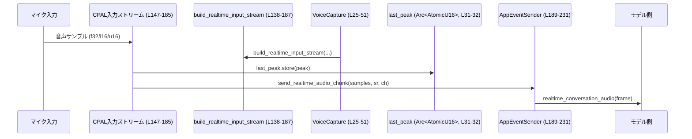
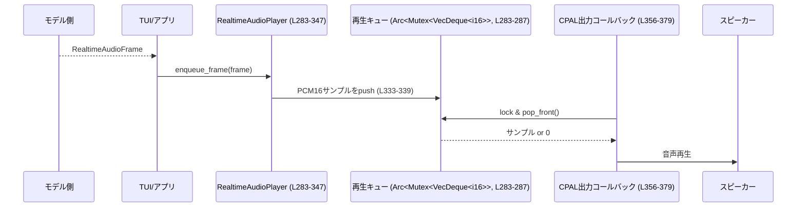

tui/src/voice.rs コード解説
================================

## 0. ざっくり一言

このファイルは、CPAL を使った **マイク入力のリアルタイムキャプチャとメータ表示用のピーク計測**, および **モデルから返ってきた PCM 音声のデコード・リサンプリング・再生** を行うモジュールです（`tui/src/voice.rs:L16-L472`）。

---

## 1. このモジュールの役割

### 1.1 概要

- このモジュールは、**TUI アプリケーションでの音声会話機能**を実現するために存在し、次の機能を提供します。
  - CPAL を用いたマイク入力の開始・停止（`VoiceCapture`、`tui/src/voice.rs:L19-L67`）
  - 入力レベルをテキスト（ブラインドメータ風の Unicode）に変換するメータ状態管理（`RecordingMeterState`、L69-L125）
  - モデルとのリアルタイム会話用の音声フレームのエンコード・送信（`send_realtime_audio_chunk`、L189-L231）
  - モデルからの音声フレームのデコード・リサンプリング・キューイングと再生（`RealtimeAudioPlayer`、L283-L347）
  - PCM16 のサンプルレート・チャンネル数変換（`convert_pcm16`、L416-L472）

### 1.2 アーキテクチャ内での位置づけ

このモジュールは、以下のコンポーネントと連携します。

- 入力側:
  - `Config`（`crate::legacy_core::config::Config`）: 使用するデバイス・サンプルレート・チャンネル数などの設定（L2）
  - `crate::audio_device::select_configured_input_device_and_config`（L132-L136）: 適切な入力デバイスと `cpal::SupportedStreamConfig` を取得
  - CPAL の入力ストリーム: コールバックでサンプルバッファを受け取り、ピーク計算・エンコード・送信を行う（L138-L187）
  - `AppEventSender`: エンコード済み音声をアプリケーションイベントとして送信（L25, L189-L231）

- 出力側:
  - `crate::audio_device::select_configured_output_device_and_config`（L291-L293）
  - CPAL の出力ストリーム: キューからサンプルを取り出して再生（L349-L381, L384-L413）
  - モデルから届く `RealtimeAudioFrame`（`codex_protocol::protocol`、L5）を基にフレームを再生

```mermaid
flowchart LR
    subgraph Capture "入力系 (L19-231)"
        Cfg["Config (外部)"]
        VC["VoiceCapture::start_realtime (L25-51)"]
        SelIn["select_realtime_input_device_and_config (L132-136)"]
        BuildIn["build_realtime_input_stream (L138-187)"]
        CbIn["CPAL入力コールバック (L147-185)"]
        Chunk["send_realtime_audio_chunk (L189-231)"]
        Tx["AppEventSender::realtime_conversation_audio (外部)"]
    end

    subgraph Playback "出力系 (L283-413)"
        RPStart["RealtimeAudioPlayer::start (L291-307)"]
        BuildOut["build_output_stream (L349-381)"]
        CbOut["CPAL出力コールバック (L356-379)"]
        Queue["Arc<Mutex<VecDeque<i16>>> (L283-287)"]
        Enq["RealtimeAudioPlayer::enqueue_frame (L309-340)"]
    end

    Cfg --> SelIn --> VC --> BuildIn --> CbIn --> Chunk --> Tx
    RPStart --> BuildOut --> CbOut
    Enq --> Queue --> CbOut
```

### 1.3 設計上のポイント

- **責務の分割**（行番号は定義位置の根拠です）
  - 入力の開始・停止とメータ用のピーク値共有を `VoiceCapture` に集約（L19-L67）。
  - メータ表示ロジック（ノイズ追従・コンプレッション）は `RecordingMeterState` に分離（L69-L125）。
  - モデル用の音声フォーマット変換と送信は `send_realtime_audio_chunk` と `convert_pcm16` で共通化（L189-L231, L416-L472）。
  - 出力ストリーム管理とフレームのデコード・キューイングを `RealtimeAudioPlayer` に集約（L283-L347）。

- **状態管理と並行性**
  - 入力レベルメータ用の最新ピーク値を `Arc<AtomicU16>` で共有（L31-L32, L145, L152, L165, L178）。
  - キャプチャ終了フラグを `Arc<AtomicBool>` で公開（L21, L31, L55, L60-L62）。
  - 出力バッファを `Arc<Mutex<VecDeque<i16>>>` で共有し、CPAL の出力コールバックから読み出す（L283-L287, L349-L381, L384-L413）。

- **エラーハンドリング**
  - 公開 API は主に `Result<..., String>` を返却し、ユーザー側でメッセージを表示しやすい形にしている（例: L25-L51, L291-L307, L309-L340）。
  - ストリームコールバック内のエラーは `tracing::error!` ログに送出（L156, L168, L181, L360, L368, L376）。

- **音声フォーマットの正規化**
  - モデル側は 24kHz / モノラル PCM16 を要求 (`MODEL_AUDIO_SAMPLE_RATE`, `MODEL_AUDIO_CHANNELS`、L16-L17)。
  - 入出力のサンプルレート・チャンネル数の違いはすべて `convert_pcm16` で吸収（L199-L208, L323-L329, L416-L472）。

---

## 2. 主要な機能一覧

- マイク入力開始: `VoiceCapture::start_realtime` – 設定に基づき CPAL 入力ストリームを構築して開始（L25-L51）。
- マイク入力停止: `VoiceCapture::stop` – 停止フラグ設定とストリーム破棄によるキャプチャ停止（L53-L58）。
- 入力レベルメータ: `RecordingMeterState::next_text` – ピーク値からノイズ追従型メータ文字列を生成（L88-L125）。
- 入力音声のエンコード・送信: `send_realtime_audio_chunk` – PCM16 をモデル向けの base64 エンコードフレームに変換し送信（L189-L231）。
- モデル音声再生: `RealtimeAudioPlayer::start` / `enqueue_frame` – 出力ストリーム開始と `RealtimeAudioFrame` からの再生キューへの投入（L291-L340）。
- PCM16 のリサンプリング／チャンネル変換: `convert_pcm16` – サンプルレートとチャンネル数の一般的な変換処理（L416-L472）。

---

## 3. 公開 API と詳細解説

### 3.1 型一覧（構造体など）

| 名前 | 種別 | 公開範囲 | 役割 / 用途 | 定義位置 |
|------|------|----------|-------------|----------|
| `VoiceCapture` | 構造体 | `pub` | 入力ストリームハンドルと停止フラグ・最新ピーク値を保持 | `tui/src/voice.rs:L19-L23` |
| `RecordingMeterState` | 構造体 | `pub(crate)` | 入力レベルメータの内部状態（履歴とノイズ推定） | `tui/src/voice.rs:L69-L73` |
| `RealtimeAudioPlayer` | 構造体 | `pub(crate)` | 出力ストリームと再生キュー、出力フォーマット情報を保持 | `tui/src/voice.rs:L283-L288` |

### 3.2 関数詳細（主要 7 件）

#### `VoiceCapture::start_realtime(config: &Config, tx: AppEventSender) -> Result<VoiceCapture, String>`

**概要**

- 設定 (`Config`) に基づいて入力デバイスとストリーム設定を選択し、CPAL の入力ストリームを構築・開始します（L25-L51）。
- ストリームコールバックは `AppEventSender` 経由でモデルに音声フレームを送信します（L138-L187, L189-L231）。

**引数**

| 引数名 | 型 | 説明 |
|--------|----|------|
| `config` | `&Config` | 入力デバイス・サンプルレート・チャンネル数などの設定（L26-L30）。 |
| `tx` | `AppEventSender` | エンコード済み音声フレームを送るためのアプリケーションイベント送信インターフェース（L26, L189-L231）。 |

**戻り値**

- `Ok(VoiceCapture)` – 入力ストリームのハンドル。保持している間はマイク入力が継続します（L46-L50）。
- `Err(String)` – デバイス選択・ストリーム構築・ストリーム開始のいずれかに失敗した場合のメッセージ（L27, L34-L41, L42-L44）。

**内部処理の流れ**

1. `select_realtime_input_device_and_config(config)` を呼び出して、入力デバイスと `cpal::SupportedStreamConfig` を取得します（L27, L132-L136）。
2. `config` から実際のサンプルレートとチャンネル数を抽出します（L29-L30）。
3. 停止フラグ (`Arc<AtomicBool>`) と最新ピーク値 (`Arc<AtomicU16>`) の共有状態を初期化します（L31-L32）。
4. `build_realtime_input_stream` を呼び出し、コールバック付きの `cpal::Stream` を構築します（L34-L41, L138-L187）。
5. `stream.play()` を実行してストリームを開始します。失敗した場合はエラー文字列を返します（L42-L44）。
6. `VoiceCapture` インスタンスを生成し、`stream`, `stopped`, `last_peak` を格納して返します（L46-L50）。

**Examples（使用例）**

```rust
use crate::legacy_core::config::Config;
use crate::app_event_sender::AppEventSender;
use tui::voice::VoiceCapture; // 実際のパスは crate 構成に依存

fn start_mic(config: &Config, tx: AppEventSender) -> Result<VoiceCapture, String> {
    // マイク入力を開始し、VoiceCapture ハンドルを取得
    let capture = VoiceCapture::start_realtime(config, tx)?;
    Ok(capture)
}
```

**Errors / Panics**

- `Err("...")` が返る条件:
  - 入力デバイスの選択や設定取得に失敗した場合（`select_configured_input_device_and_config` からのエラー、L132-L136）。
  - `build_realtime_input_stream` がサポートされないサンプルフォーマットや CPAL の内部エラーで失敗した場合（L138-L187）。
  - `stream.play()` に失敗した場合（L42-L44）。
- この関数自体は `panic!` を発生させません。

**Edge cases（エッジケース）**

- `config` に対応する入力デバイスが存在しない／使用不可な場合は、エラーとして `Err(String)` が返る（L132-L136 に委譲）。
- `AppEventSender` が内部的に落ちているなどで送信に失敗した場合の挙動は、このファイルからは分かりません（`tx.realtime_conversation_audio` の実装が別モジュール、L222-L230）。

**使用上の注意点**

- `VoiceCapture` を **保持している間のみ** キャプチャが継続します。`VoiceCapture` がドロップされると、内部の `cpal::Stream` もドロップされ、入力は停止します（L46-L50, L53-L58）。
- `AppEventSender` はこの関数に値渡しされ、ストリームコールバック内で使用されます（L144, L150-L155）。呼び出し元で別途クローンを保持する必要がある場合があります（実装は別モジュール）。
- 並行性: CPAL の入力コールバックは別スレッドで実行されるため、やり取りは `Arc<AtomicU16>` と `AppEventSender` 経由で行われます（L31-L32, L145-L152）。

---

#### `VoiceCapture::stop(self)`

**概要**

- 入力キャプチャを停止するためのメソッドです（L53-L58）。
- 停止フラグを立てた後、内部の `cpal::Stream` をドロップします。

**引数**

| 引数名 | 型 | 説明 |
|--------|----|------|
| `self` | `VoiceCapture`（所有権） | ハンドル自身を消費して停止を行います（L53）。 |

**戻り値**

- 戻り値はありません（単純な停止処理）。

**内部処理の流れ**

1. `stopped` フラグに `true` を書き込み、外部のメータ監視タスクなどが終了できるようにします（L55）。
2. `self.stream.take()` によって `Option<cpal::Stream>` から `Stream` を取り出しドロップし、CPAL 側のキャプチャを停止します（L57）。

**Errors / Panics**

- このメソッド自体は `Result` を返さず、エラーも発生させません。
- `AtomicBool::store` や `Option::take` は panic を起こさない前提です。

**Edge cases**

- すでに `stream` が `None` の場合でも `take()` は `None` を返すだけで問題なく動作します（L57）。

**使用上の注意点**

- `self` を値で消費するため、`stop()` 呼び出し後に同じ `VoiceCapture` インスタンスを再利用することはできません（L53）。
- 停止フラグ (`stopped_flag()`) を監視しているタスクがある前提の設計に見えますが、その利用箇所はこのファイルには現れません（L60-L62）。

---

#### `RecordingMeterState::next_text(&mut self, peak: u16) -> String`

**概要**

- 最新のピーク値と内部状態（環境音レベルの推定）から、4 文字のメータ文字列を生成します（L88-L125）。
- ブラユニコードのような文字（⠤, ⠴, ... ⣿）を使ったビジュアルなレベル表示です（L89）。

**引数**

| 引数名 | 型 | 説明 |
|--------|----|------|
| `&mut self` | `&mut RecordingMeterState` | 状態（履歴・ノイズ推定・エンベロープ）を更新するための可変参照（L75-L86）。 |
| `peak` | `u16` | 最新サンプルバッファから計算したピーク値。`peak_f32` や `peak_i16` の結果を想定（L88, L244-L263）。 |

**戻り値**

- 最新 4 サンプル分のレベルを表す `String`。左から古い順に、「静か → 大きい」へ変化する文字列です（L120-L124）。

**内部処理の流れ**

1. `peak` を `i16::MAX` で割り正規化した `latest_peak` を計算（L94）。
2. `ATTACK` / `RELEASE` 係数を使ったエンベロープフォロワ（`self.env`）を更新（L96-L100）。
3. `self.env` からノイズレベルを指数移動平均で推定し、`self.noise_ema` を更新（L102-L104）。
4. ノイズに対する信号比 `raw` を計算し、対数圧縮 (`ln_1p`) でダイナミクスを圧縮（L105-L109）。
5. 圧縮値を 0〜6 のインデックスにマッピングし、`SYMBOLS` からレベル文字を取得（L89-L113）。
6. 履歴キュー `history` の先頭を必要に応じて捨て、新しいレベル文字を末尾に追加（L115-L119）。
7. 履歴 4 文字を連結して `String` として返却（L120-L124）。

**Examples（使用例）**

```rust
use tui::voice::RecordingMeterState;

fn render_meter(last_peak: u16, state: &mut RecordingMeterState) -> String {
    // 最新ピーク値からメータ文字列を更新
    state.next_text(last_peak)
}
```

**Errors / Panics**

- 通常の使用条件では panic は発生しません。
- `SYMBOLS[idx]` へのアクセスは、`idx` を `clamp` しているため安全です（L110-L113）。

**Edge cases**

- `peak == 0` の場合、`latest_peak` は 0 になり、`self.env` と `self.noise_ema` は徐々に減衰していきます。
- `peak` が `i16::MAX` に対応する範囲より大きい値でも、正規化後の計算は継続できますが、レベルが最大付近に張り付きやすくなります（`peak` の上限は計算側で保証される想定、L244-L263, L266-L276）。
- 初期状態では `history` があらかじめ「⠤⠤⠤⠤」で埋められています（L76-L80）。

**使用上の注意点**

- 状態は `RecordingMeterState` に保持されるため、メータ表示ごとに **同じインスタンス** を使い回す必要があります（L75-L86）。
- `peak` のスケールは `peak_f32` / `peak_i16` の計算方法に依存するため、他の計算結果を渡す場合はスケールの整合性に注意します（L244-L263）。

---

#### `RealtimeAudioPlayer::start(config: &Config) -> Result<RealtimeAudioPlayer, String>`

**概要**

- 出力デバイスと設定を選択し、CPAL の出力ストリームを構築・開始します（L291-L307）。
- 再生用の共有キューも初期化します（L296-L297）。

**引数**

| 引数名 | 型 | 説明 |
|--------|----|------|
| `config` | `&Config` | 出力デバイスやサンプルレートなどの設定。`audio_device` モジュールに渡されます（L291-L295）。 |

**戻り値**

- `Ok(RealtimeAudioPlayer)` – 出力ストリームと再生キューを保持するハンドル（L301-L306）。
- `Err(String)` – デバイス選択またはストリーム構築・開始に失敗したときのエラーメッセージ（L291-L293, L297-L300）。

**内部処理の流れ**

1. `select_configured_output_device_and_config` を呼び出して出力デバイスと設定を取得（L291-L293）。
2. 選択した設定からサンプルレートとチャンネル数を取得し、フィールドに保持（L294-L295, L301-L305）。
3. 再生キューとして `Arc<Mutex<VecDeque<i16>>>` を初期化（L296）。
4. `build_output_stream` を呼び出して、キューを読み出す出力ストリームを構築（L297, L349-L381）。
5. `stream.play()` を呼び出して出力ストリームを開始（L298-L300）。
6. `RealtimeAudioPlayer` インスタンスを組み立てて返却（L301-L306）。

**Examples（使用例）**

```rust
use crate::legacy_core::config::Config;
use tui::voice::RealtimeAudioPlayer;

fn init_player(config: &Config) -> Result<RealtimeAudioPlayer, String> {
    let player = RealtimeAudioPlayer::start(config)?;
    Ok(player)
}
```

**Errors / Panics**

- `Err("...")` が返る条件:
  - 出力デバイス選択や設定取得の失敗（L291-L293）。
  - CPAL 出力ストリーム構築の失敗（L349-L381）。
  - `stream.play()` の失敗（L298-L300）。
- このメソッド自身は panic を起こしません。

**Edge cases**

- サポートされていないサンプルフォーマットしかないデバイスの場合、`build_output_stream` が `"unsupported output sample format: ..."` でエラーになります（L380）。

**使用上の注意点**

- インスタンスがドロップされると `_stream` がドロップされ、再生が停止します（L283-L287）。
- 再生するフレームは `enqueue_frame` 経由で投入する必要があります（L309-L340）。
- 出力ストリームコールバックは別スレッドで動作するため、並行性の前提としてキューへのアクセスは `Mutex` で保護されています（L283-L287, L384-L413）。

---

#### `RealtimeAudioPlayer::enqueue_frame(&self, frame: &RealtimeAudioFrame) -> Result<(), String>`

**概要**

- モデルなどから受け取った `RealtimeAudioFrame` をデコードし、出力フォーマットに合わせて変換したうえで再生キューに追加します（L309-L340）。

**引数**

| 引数名 | 型 | 説明 |
|--------|----|------|
| `&self` | `&RealtimeAudioPlayer` | 再生キューと出力フォーマット情報にアクセスするための参照（L309-L329）。 |
| `frame` | `&RealtimeAudioFrame` | base64 でエンコードされた PCM16 音声フレーム（L309-L329）。 |

**戻り値**

- `Ok(())` – 正常にキューに追加された、もしくは変換結果が空で何もしなかった場合（L330-L332, L339）。
- `Err(String)` – フレームフォーマット不正・デコード失敗・キューロック失敗などの場合（L310-L312, L313-L318, L333-L337）。

**内部処理の流れ**

1. `frame.num_channels == 0` または `frame.sample_rate == 0` の場合は、フォーマット不正としてエラーを返す（L310-L312）。
2. `frame.data` を base64 デコードし、バイト列 `raw_bytes` を取得（L313-L315）。
3. バイト数が奇数（2 バイトで 1 サンプルを表現する PCM16 に合わない）ならエラーを返す（L316-L318）。
4. 2 バイトずつ `i16::from_le_bytes` で PCM16 サンプルに復元し、ベクタ `pcm` に格納（L319-L322）。
5. `convert_pcm16` で入力フレームのサンプルレート・チャンネル数からプレーヤ出力フォーマットへ変換（L323-L329, L416-L472）。
6. 変換結果が空の場合は何もせず `Ok(())` を返す（L330-L332）。
7. 共有キューを `lock` し、`guard.extend(converted)` でサンプルを追加（L333-L339）。

**Examples（使用例）**

```rust
use codex_protocol::protocol::RealtimeAudioFrame;

// モデルから受信したフレームを再生キューに投入する例
fn on_frame(player: &RealtimeAudioPlayer, frame: &RealtimeAudioFrame) -> Result<(), String> {
    player.enqueue_frame(frame)
}
```

**Errors / Panics**

- `Err("invalid realtime audio frame format")` – `num_channels == 0` または `sample_rate == 0`（L310-L312）。
- `Err("failed to decode realtime audio: ...")` – base64 デコードに失敗（L313-L315）。
- `Err("realtime audio frame had odd byte length")` – デコード後の PCM バイト列長が奇数（L316-L318）。
- `Err("failed to lock output audio queue")` – 再生キューの `Mutex` がロックできなかった場合（ポイズン含む、L333-L337）。
- panic を起こすコードは含まれていません。

**Edge cases**

- 非常に大きいフレームを連続して投入すると、`VecDeque` のキュー長が伸び続ける可能性があります（L337 コメントにて制限 TODO が記載）。
- 入力フォーマットと出力フォーマットが同一の場合でも、`convert_pcm16` を経由するため、ほぼコピーに近い処理になります（L323-L329, L434-L439）。

**使用上の注意点**

- 再生の遅延やメモリ使用量を抑えるため、上位層でフレームサイズや投入頻度を制御する必要があります（L337 でキュー制御の TODO に言及）。
- `RealtimeAudioFrame` の `data` フィールドは **little-endian の PCM16** を前提としており、エンコード側とフォーマットが一致している必要があります（L319-L322, L215-L217）。

---

#### `build_realtime_input_stream(...) -> Result<cpal::Stream, String>`

シグネチャ（簡略）:  
`fn build_realtime_input_stream(device: &cpal::Device, config: &cpal::SupportedStreamConfig, sample_rate: u32, channels: u16, tx: AppEventSender, last_peak: Arc<AtomicU16>) -> Result<cpal::Stream, String>`

**概要**

- 入力デバイスと設定に対して、サンプルフォーマット別の CPAL 入力ストリームを構築します（L138-L187）。
- ストリームコールバックでピーク値の更新と `send_realtime_audio_chunk` の呼び出しを行います。

**引数**

| 引数名 | 型 | 説明 |
|--------|----|------|
| `device` | `&cpal::Device` | 入力に使用するオーディオデバイス（L139）。 |
| `config` | `&cpal::SupportedStreamConfig` | サンプルフォーマット・レート・チャンネルなどの設定（L140）。 |
| `sample_rate` | `u32` | 実際に使用するサンプルレート（L141）。 |
| `channels` | `u16` | 実際に使用するチャンネル数（L142）。 |
| `tx` | `AppEventSender` | 音声フレーム送信用のイベント送信者（L143-L144）。 |
| `last_peak` | `Arc<AtomicU16>` | 最新ピーク値を書き込む共有変数（L144-L145）。 |

**戻り値**

- `Ok(cpal::Stream)` – 構築された入力ストリーム。
- `Err(String)` – サンプルフォーマット非対応や CPAL のエラー時（L147-L185）。

**内部処理の流れ**

1. `config.sample_format()` でサンプルフォーマットを取得（L146）。
2. `SampleFormat::F32` / `I16` / `U16` の場合で `build_input_stream` を呼び出す。各フォーマットごとに別のコールバックを設定（L147-L185）。
   - F32 パス:
     - `peak_f32` でピークを計算し `last_peak` に格納（L150-L152, L244-L253）。
     - `f32_to_i16` で PCM16 に変換して `send_realtime_audio_chunk` に渡す（L153-L155, L239-L242）。
   - I16 パス:
     - `peak_i16` でピーク計算（L162-L166, L255-L263）。
     - バッファを `to_vec()` してそのまま `send_realtime_audio_chunk` に渡す（L166-L167）。
   - U16 パス:
     - `convert_u16_to_i16_and_peak` で i16 への変換とピーク計測を行う（L175-L179, L266-L276）。
3. エラーコールバックでは `tracing::error!` でログ出力（L156, L168, L181）。
4. 未対応のサンプルフォーマットの場合は `"unsupported input sample format"` のエラーを返す（L185）。

**Errors / Panics**

- `Err("failed to build input stream: ...")` – CPAL が `build_input_stream` でエラーを返した場合（L147-L159, L160-L171, L172-L184）。
- `Err("unsupported input sample format")` – サポートされないフォーマット（L185）。
- コールバック内部は panic を起こさないよう実装されています（ループやベクタ操作は境界内で行われる）。

**Edge cases**

- 非常に大量のサンプルが一度に入ってくる場合でも、`Vec::with_capacity(input.len())` などで一時バッファを確保して処理します（L176-L180）。
- サンプルレートやチャンネル数がモデルと異なる場合でも、`send_realtime_audio_chunk` 側で変換されます（L199-L208）。

**使用上の注意点**

- コールバック内で重い処理を行うと、音声ドロップやレイテンシ増大を招く可能性があります。ここでは `send_realtime_audio_chunk` のみを呼ぶ設計になっていますが、その実装コストも考慮する必要があります（L189-L231）。
- `tx` と `last_peak` はコールバッククロージャへムーブされるため、適切に `Send + 'static` が満たされている必要があります（このファイルでは型制約は記述されていませんが、CPAL の trait 要件から推測されます）。

---

#### `convert_pcm16(input: &[i16], input_sample_rate: u32, input_channels: u16, output_sample_rate: u32, output_channels: u16) -> Vec<i16>`

**概要**

- PCM16 サンプルの配列を、サンプルレートとチャンネル数を変換しながら別フォーマットに変換するユーティリティです（L416-L472）。
- **最近傍補間によるリサンプリング**と、単純なチャンネルの複製・平均化・間引き・埋めを行います。

**引数**

| 引数名 | 型 | 説明 |
|--------|----|------|
| `input` | `&[i16]` | 入力 PCM16 サンプル列。`input_channels` チャンネルのインターリーブ形式（L416-L420）。 |
| `input_sample_rate` | `u32` | 入力サンプルレート（L418）。 |
| `input_channels` | `u16` | 入力チャンネル数（L419）。 |
| `output_sample_rate` | `u32` | 出力サンプルレート（L420）。 |
| `output_channels` | `u16` | 出力チャンネル数（L421）。 |

**戻り値**

- 変換された PCM16 サンプル列（インターリーブ形式）。空入力・不正なチャンネル数の場合は空のベクタを返します（L423-L425, L429-L432）。

**内部処理の流れ**

1. 入力が空・チャンネル数が 0 の場合は空ベクタを返す（L423-L425）。
2. `in_frames = input.len() / in_channels` でフレーム数を計算。0 なら空を返す（L427-L432）。
3. 出力フレーム数 `out_frames` を、
   - サンプルレートが同じなら `in_frames`、
   - 違うなら `in_frames * output_sample_rate / input_sample_rate`（少なくとも 1）として計算（L434-L439）。
4. `out_frames * out_channels` の容量を持つ出力バッファを確保（L441）。
5. 各出力フレームについて、対応する入力フレームインデックス `src_frame_idx` を線形補間に基づいて計算（L442-L447）。
6. 入力から `in_channels` 分をスライスで取得し（L448-L449）、(in_channels, out_channels) によって以下のように変換（L450-L470）。
   - (1,1): そのままコピー。
   - (1,n): モノラルを n チャンネルへ複製。
   - (n,1): 複数チャンネルの平均をとりモノラルへダウンミックス（L457-L460）。
   - (n,m), n==m: そのままコピー（L461）。
   - (n,m), n>m: 先頭 m チャンネルのみ使用（L462）。
   - (n,m), n<m: 元チャンネルをコピーしたあと、最後のチャンネルを m まで複製（L463-L469）。
7. すべての出力フレームを処理したら `out` を返す（L472）。

**Examples（使用例）**

```rust
// 48kHz ステレオ → 24kHz モノラルへの変換例（テストと同等）
let input = vec![100, 300, 200, 400, 500, 700, 600, 800];
let converted = convert_pcm16(&input, 48_000, 2, 24_000, 1);
// => vec![200, 700] （L481-L487 のテストで検証）
```

**Errors / Panics**

- この関数は `Result` を返さず、panic も発生しないように実装されています。
  - インデックス計算は `saturating_mul` と「フレーム数 - 1」ベースの計算で、上限を厳密に守る構造です（L441, L442-L447, L448-L449）。
- 非正規な入力（`input.len() % input_channels != 0`）の場合、最後の部分フレームは切り捨てられますが、範囲外アクセスは発生しません（L427-L432）。

**Edge cases**

- `input` が空、または `input_channels == 0`/`output_channels == 0` の場合は空ベクタ（L423-L425）。
- `input_sample_rate != output_sample_rate` でも、`out_frames` は最低 1 フレーム以上保証されます（L437-L439）。
- 入力チャンネル数が多く、出力チャンネル数が少ない場合はチャンネルの一部が無視されます（L462）。
- 入力チャンネル数より出力チャンネル数が多い場合は、最後の入力チャンネルを複製して埋めます（L463-L469）。

**使用上の注意点**

- 音質: リサンプリングは **最近傍法** であり、音質的には高品質ではありません。リアルタイム用途での簡便さを優先した実装です（L442-L447）。
- 入力データの正規性（`len` がチャンネル数で割り切れるなど）は呼び出し側で保証されている前提です（L427-L432）。
- サンプル数が非常に多い場合、`Vec` の確保とコピーコストが大きくなるため、高頻度で呼び出す場合は注意が必要です（L441-L471）。

---

### 3.3 その他の関数

| 関数名 | 役割（1 行） | 定義位置 |
|--------|--------------|----------|
| `select_realtime_input_device_and_config` | 入力用デバイスと CPAL 設定を `audio_device` モジュールに委譲して取得 | `tui/src/voice.rs:L132-L136` |
| `send_realtime_audio_chunk` | PCM16 サンプルをモデル用フォーマット（24kHz モノラル base64）に変換し `AppEventSender` に送信 | `tui/src/voice.rs:L189-L231` |
| `f32_abs_to_u16` | `[-1.0,1.0]` の浮動小数ピーク値を `u16` にスケール変換 | `tui/src/voice.rs:L233-L237` |
| `f32_to_i16` | `[-1.0,1.0]` の浮動小数サンプルを PCM16 (`i16`) に変換 | `tui/src/voice.rs:L239-L242` |
| `peak_f32` | `&[f32]` バッファから最大絶対値ピークを計算し `u16` に変換 | `tui/src/voice.rs:L244-L253` |
| `peak_i16` | `&[i16]` バッファから最大絶対値ピークを計算し `u16` に変換 | `tui/src/voice.rs:L255-L263` |
| `convert_u16_to_i16_and_peak` | `u16` サンプルを符号付き `i16` に変換しつつピークを測定 | `tui/src/voice.rs:L266-L276` |
| `build_output_stream` | 出力デバイスと設定からフォーマット別の CPAL 出力ストリームを構築 | `tui/src/voice.rs:L349-L381` |
| `fill_output_i16` | 出力コールバックでキューから `i16` サンプルを読み出して書き込む | `tui/src/voice.rs:L384-L392` |
| `fill_output_f32` | 出力コールバックでキューの PCM16 を `f32` にスケーリングして書き込む | `tui/src/voice.rs:L394-L403` |
| `fill_output_u16` | 出力コールバックでキューの PCM16 をオフセット付き `u16` に変換して書き込む | `tui/src/voice.rs:L405-L413` |

---

## 4. データフロー

### 4.1 代表的な処理シナリオ – 入力からモデル送信まで

- ユーザーのマイク入力は CPAL の入力ストリームコールバックに流れ、ここでピーク値の更新とモデル用フォーマットへの変換・送信が行われます。
- `VoiceCapture` はそのストリームのライフタイムとメータ用ピーク値のみを保持します。



### 4.2 代表的な処理シナリオ – モデルからの音声再生

- モデルから受信した `RealtimeAudioFrame` を `RealtimeAudioPlayer::enqueue_frame` でキューに入れます。
- CPAL の出力コールバックがキューからサンプルを取り出して再生します。



---

## 5. 使い方（How to Use）

### 5.1 基本的な使用方法

**マイク入力とメータ表示の例**

```rust
use crate::legacy_core::config::Config;
use crate::app_event_sender::AppEventSender;
use tui::voice::{VoiceCapture, RecordingMeterState};

fn run_capture(config: &Config, tx: AppEventSender) -> Result<(), String> {
    let capture = VoiceCapture::start_realtime(config, tx)?; // 入力開始 (L25-L51)
    let last_peak = capture.last_peak_arc();                 // メータ用ピーク値 (L64-L66)
    let mut meter_state = RecordingMeterState::new();        // メータ状態 (L75-L86)

    // ここでは単純なループ例（実際には非同期タスクなど想定）
    loop {
        let peak = last_peak.load(std::sync::atomic::Ordering::Relaxed);
        let text = meter_state.next_text(peak);              // メータ文字列を取得 (L88-L125)
        println!("meter: {}", text);

        // 外部条件で終了
        // if should_stop() { break; }
    }

    // capture.stop() を呼ぶなら所有権を move しておく必要があります
    // capture.stop();

    Ok(())
}
```

**モデル音声の再生の例**

```rust
use crate::legacy_core::config::Config;
use codex_protocol::protocol::RealtimeAudioFrame;
use tui::voice::RealtimeAudioPlayer;

fn handle_audio_stream(config: &Config, frames: &[RealtimeAudioFrame]) -> Result<(), String> {
    let player = RealtimeAudioPlayer::start(config)?;       // 出力開始 (L291-L307)

    for frame in frames {
        player.enqueue_frame(frame)?;                       // フレームを再生キューに追加 (L309-L340)
    }

    Ok(())
}
```

### 5.2 よくある使用パターン

- **会話セッション単位でのハンドルライフタイム**
  - 会話開始時に `VoiceCapture::start_realtime` / `RealtimeAudioPlayer::start` を呼び、セッション終了時に `VoiceCapture` をドロップ（または `stop`）し、`RealtimeAudioPlayer` もドロップするパターン。

- **メータ表示用バックグラウンドタスク**
  - `VoiceCapture::last_peak_arc` を取得し、別スレッドまたは非同期タスクで `load` し続けて UI に反映するパターン（L31-L32, L64-L66, L88-L125）。

### 5.3 よくある間違い

```rust
// 間違い例: VoiceCapture をすぐにドロップしてしまい、キャプチャが継続しない
fn wrong_usage(config: &Config, tx: AppEventSender) -> Result<(), String> {
    VoiceCapture::start_realtime(config, tx)?; // ハンドルを保持していない
    // この時点で VoiceCapture はドロップされ、入力ストリームも停止する
    Ok(())
}

// 正しい例: ハンドルをスコープの外まで保持する
fn correct_usage(config: &Config, tx: AppEventSender) -> Result<(), String> {
    let capture = VoiceCapture::start_realtime(config, tx)?; // 保持
    // capture が生きている間は音声キャプチャが継続する
    // ...
    Ok(())
}
```

```rust
// 間違い例: RealtimeAudioFrame に num_channels == 0 を設定してしまう
let frame = RealtimeAudioFrame {
    data: "...".to_string(),
    sample_rate: 24_000,
    num_channels: 0, // 無効
    samples_per_channel: None,
    item_id: None,
};
// player.enqueue_frame(&frame) は Err("invalid realtime audio frame format") を返す (L310-L312)
```

### 5.4 使用上の注意点（まとめ）

- **スレッド安全性**
  - `last_peak` は `Arc<AtomicU16>` により、ロックなしでスレッド間共有可能です（L31-L32, L145-L152）。
  - 再生キューは `Arc<Mutex<VecDeque<i16>>>` で保護され、CPAL の出力コールバックとアプリ本体から安全にアクセスできます（L283-L287, L384-L413）。

- **エラー処理**
  - 公開 API は `Result<_, String>` を返すため、呼び出し側で必ず `?` や `match` で処理する必要があります（L25-L51, L291-L307, L309-L340）。
  - コールバック内部のエラーは `tracing::error!` でログに残るのみで、ストリームは基本的に継続します（L156, L168, L181, L360, L368, L376）。

- **キューの肥大化**
  - `RealtimeAudioPlayer::enqueue_frame` 内のコメントにある通り、キューの上限は現状ありません（L337）。大量のフレームを短時間に投入すると、メモリ使用量と再生遅延が増加します。

- **フォーマット前提**
  - 本モジュールは **16bit PCM、リトルエンディアン** を前提に設計されています（L215-L217, L319-L322, L416-L472）。
  - モデル側のフレームは `send_realtime_audio_chunk` と互換なフォーマットであることが期待されます（L219-L230, L309-L329）。

---

## 6. 変更の仕方（How to Modify）

### 6.1 新しい機能を追加する場合

- **別種のメータ表示を追加したい場合**
  1. `RecordingMeterState` に新しいメソッド（例: `next_numeric_level`）を追加し、`peak` や `env` の値から数値レベルを返すように実装する（L69-L125 を参考）。
  2. TUI 側で文字列ではなく数値を使ったバー表示などに活用する。

- **高度なリサンプリングアルゴリズムを導入したい場合**
  1. `convert_pcm16` の処理を差し替えるか、新関数 `convert_pcm16_high_quality` を追加（L416-L472）。
  2. `send_realtime_audio_chunk` / `RealtimeAudioPlayer::enqueue_frame` から呼び出す関数を切り替える（L199-L208, L323-L329）。

- **キュー上限の導入**
  1. `RealtimeAudioPlayer` のフィールドに上限サンプル数やフレーム数を保持するフィールドを追加（L283-L288）。
  2. `enqueue_frame` 内の `guard.extend` の前で長さチェックを行い、古いデータを捨てる・新しいデータを拒否する等のポリシーを実装（L333-L339, コメント L337 を参照）。

### 6.2 既存の機能を変更する場合

- **モデル側の要求サンプルレート・チャンネルが変わった場合**
  - `MODEL_AUDIO_SAMPLE_RATE` と `MODEL_AUDIO_CHANNELS` を変更（L16-L17）。
  - それに伴い `send_realtime_audio_chunk` での `samples_per_channel` 計算も自動的に追従しますが、外部プロトコルとの整合性を確認する必要があります（L219-L221, L222-L230）。

- **エラー処理方針を詳細化したい場合**
  - 現在は `String` ベースのエラーですが、独自のエラー型（enum）を導入する場合は、`start_realtime`, `RealtimeAudioPlayer::start`, `enqueue_frame` などすべての戻り値型と `map_err` 呼び出しを修正する必要があります（L25-L51, L291-L307, L309-L340, L147-L185, L349-L381）。

- **スレッド間同期の挙動変更**
  - メータ停止フラグの使用方法を変更する場合は、`VoiceCapture::stop` と `stopped_flag` の意味を維持しつつ、監視側コードと整合させる必要があります（L53-L62）。

---

## 7. 関連ファイル

| パス | 役割 / 関係 |
|------|------------|
| `crate::audio_device` | `select_configured_input_device_and_config` / `select_configured_output_device_and_config` を提供し、本モジュールの入出力デバイス選択を担います（L132-L136, L291-L293）。 |
| `crate::legacy_core::config::Config` | オーディオ設定（デバイス名、サンプルレート、チャンネル数など）を保持し、このモジュールの `start_realtime` / `start` に渡されます（L2, L25-L30, L291-L295）。 |
| `crate::app_event_sender::AppEventSender` | エンコード済み音声フレームをアプリケーションやバックエンドに送信するためのインターフェースです（L1, L25, L189-L231）。 |
| `codex_protocol::protocol::RealtimeAudioFrame` / `ConversationAudioParams` | モデルとのリアルタイム音声通信に使われるプロトコル定義で、本モジュールはこの型に従ってフレームを生成・再生します（L4-L5, L219-L230, L309-L329）。 |
| `tui/src/voice.rs` 内 `mod tests` | `convert_pcm16` のダウンミックスとリサンプリングの挙動を検証するユニットテストを提供します（L475-L489）。 |

---

### Bugs / Security / Contracts まとめ（このファイルから読み取れる範囲）

- **潜在的な問題**
  - 出力キューに上限がないため、入力が再生より速い場合にメモリ使用量とレイテンシが増大する可能性があります（L337）。
  - エラー処理は基本的に呼び出し側に `String` で返すのみで、きめ細かな分類はされていません（使用上問題とは限りませんが、契約としては緩い）。

- **安全性（Rust 的観点）**
  - 共有状態は `Arc<Atomic*>` と `Arc<Mutex<...>>` のみで、`unsafe` コードは存在しません。
  - 配列アクセスはすべてスライスの範囲内に制限されており、インデックス計算も安全側に寄せて実装されています（L441-L449, L450-L470）。

- **契約／前提条件**
  - `RealtimeAudioPlayer::enqueue_frame` は、`frame.sample_rate > 0` かつ `frame.num_channels > 0` を前提とし、不正な場合はエラーを返します（L310-L312）。
  - `convert_pcm16` は、`input.len()` が `input_channels` で割り切れることを暗黙の前提としていますが、割り切れない場合も先頭の完全なフレームだけを使用する形で安全に動作します（L427-L432）。

この範囲で、コードから読み取れる安全性・エラー条件・並行性の挙動を網羅しました。
