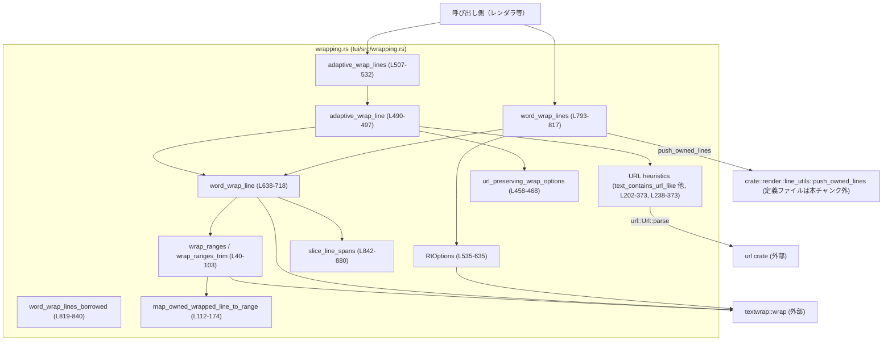
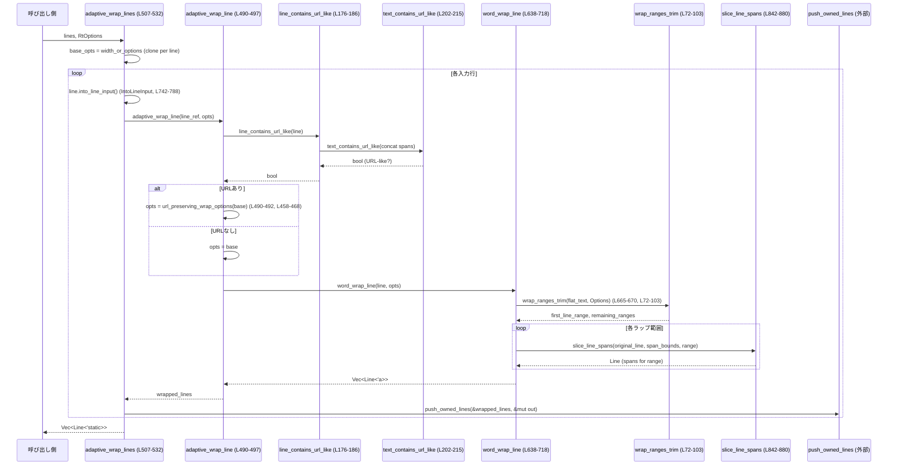

tui/src/wrapping.rs

---

## 0. ざっくり一言

- ratatui の `Line` を、URL をできるだけ分断しないように改行するためのラッパーです。  
- `textwrap` の結果から元テキストのバイト範囲を復元するユーティリティと、URL らしさを判定するヘルパーも含まれます。

---

## 1. このモジュールの役割

### 1.1 概要

このモジュールは、TUI で表示するテキストを安全かつ URL フレンドリーに折り返すための処理を提供します。

- 通常のワードラップ（`word_wrap_line`, `word_wrap_lines`）と  
  URL を極力分割しないアダプティブなラップ（`adaptive_wrap_line`, `adaptive_wrap_lines`）の 2 系統を持ちます（tui/src/wrapping.rs:L8-22, L482-497, L499-533）。
- `textwrap` が生成したラップ結果から、元のテキスト中のバイト範囲を復元する `wrap_ranges` / `wrap_ranges_trim` を提供します（L37-103）。
- URL らしさを判定するヘルパー群（`text_contains_url_like` など）により、「URL だけは折り返し位置から除外する」というヒューリスティックを実現します（L202-373）。

### 1.2 アーキテクチャ内での位置づけ

主なコンポーネントと依存関係は以下のようになっています。



- 上位の TUI レンダラ等が `word_wrap_lines` または `adaptive_wrap_lines` を呼び出す前提です（実際の呼び出し元はこのチャンクには現れません）。
- ラップ処理の実体は `word_wrap_line` に集中し、マルチライン版はそれを組み合わせる構造になっています（L638-718, L793-817, L819-840）。
- URL ヒューリスティックは、アダプティブ系（`adaptive_*`）からのみ利用されます（L490-497, L507-532, L176-215 など）。

### 1.3 設計上のポイント

コードから読み取れる設計上の特徴です。

- **2 系統のラップ API**
  - 「素の textwrap ベース（`word_wrap_*`）」と「URL に配慮した設定を自動適用（`adaptive_wrap_*`）」で関心を分離しています（L8-22, L482-497）。
- **オプションの二重ラップ**
  - textwrap の `Options` を直接外に出さず、`RtOptions` というラッパー構造体を定義し、インデントを ratatui の `Line` で持てるようにしています（L535-561）。
- **バイト範囲復元と unsafe**
  - `wrap_ranges` 系は textwrap のラップ結果を元テキストのバイトオフセットに戻すために `unsafe` なポインタ差分を使用しています（L40-52, L84-86）。
  - textwrap がハイフネーションのために「元テキストにない文字」を挿入するケースに備えて、`map_owned_wrapped_line_to_range` で復元ロジックを持っています（L105-174）。
- **URL 判定の保守的なヒューリスティック**
  - `text_contains_url_like` は、スキーム付き URL・ベアドメイン URL・IPv4/localhost などを対象としつつ、ファイルパス風の文字列を意図的に除外しています（L202-213, L343-373）。
- **状態レス・スレッドセーフ**
  - すべての API は関数とイミュータブルな構造体のみで構成され、グローバル状態や内部可変性はありません。このモジュール内だけを見る限り、どの関数も並行呼び出し可能です。

---

## 2. 主要な機能一覧とコンポーネントインベントリー

### 2.1 主要な機能一覧

- 行テキストのバイト範囲ラップ:
  - `wrap_ranges`, `wrap_ranges_trim` — `textwrap::wrap` の結果を元テキストのバイト範囲にマッピング（L37-103）。
- URL らしさ判定:
  - `text_contains_url_like`, `line_contains_url_like`, 各種ヘルパー（L202-373, L176-200）。
- URL を分割しないラップ設定:
  - `url_preserving_wrap_options`, `split_non_url_word`（L458-480）。
- 単一行ラップ:
  - `word_wrap_line` — ratatui `Line` をスタイル付きでラップ（L637-718）。
- 複数行ラップ:
  - `word_wrap_lines`, `word_wrap_lines_borrowed`, `IntoLineInput`, `LineInput`（L721-788, L790-817, L819-840）。
- URL 対応のアダプティブラップ:
  - `adaptive_wrap_line`, `adaptive_wrap_lines`（L482-533）。
- ラップオプション構築:
  - `RtOptions` とそのビルダーメソッド（L535-635）。
- スタイル付きスパンの部分切り出し:
  - `slice_line_spans` — `Line` 中の特定バイト範囲をスタイル保持したまま抽出（L842-880）。

### 2.2 コンポーネントインベントリー（型・関数一覧）

主な型・関数を一覧化します（テスト関数は除外）。

#### 型

| 名前 | 種別 | 公開範囲 | 役割 / 用途 | 定義位置 |
|------|------|----------|-------------|----------|
| `RtOptions<'a>` | 構造体 | `pub` | textwrap のオプションをラップしつつ、インデントを ratatui の `Line` として保持する。`Into<RtOptions>` により簡易指定も可能。 | tui/src/wrapping.rs:L535-561 |
| `LineInput<'a>` | enum | private | 借用/所有/文字列など多様な入力を `Line<'a>` ベースに統一するための内部ユーティリティ。 | L721-726 |
| `IntoLineInput<'a>` | トレイト | private | `&Line`, `Line`, `&str`, `String`, `Span` などを `LineInput` に変換するための内部トレイト。 | L737-740 |

#### 関数（公開 API として使われそうなもの）

| 関数名 | 公開範囲 | 役割（1 行） | 定義位置 |
|--------|----------|--------------|----------|
| `wrap_ranges` | `pub(crate)` | textwrap のラップ結果から、元テキスト中の「各ラップ行のバイト範囲＋末尾スペース＋センチネル 1 バイト」を返す。 | L37-70 |
| `wrap_ranges_trim` | `pub(crate)` | 上記から末尾スペースとセンチネルを除いたバイト範囲を返す。 | L72-103 |
| `line_contains_url_like` | `pub(crate)` | ratatui `Line` 内に URL らしきトークンが含まれるか判定する。 | L176-186 |
| `line_has_mixed_url_and_non_url_tokens` | `pub(crate)` | 1 行に URL っぽいトークンと有意味な非 URL トークンが共存するか判定する。 | L188-200 |
| `text_contains_url_like` | `pub(crate)` | `&str` 内に URL らしきトークンがあるか判定する。 | L202-215 |
| `url_preserving_wrap_options` | `pub(crate)` | URL を分割しないように `RtOptions` を再構成する。 | L458-468 |
| `adaptive_wrap_line` | `pub(crate)` | 1 行を URL 検出の有無に応じて URL 保護設定に切り替えてラップする。 | L482-497 |
| `adaptive_wrap_lines` | `pub(crate)` | 複数行版アダプティブラップ。行ごとに URL を検出して個別に設定を切り替える。 | L499-533 |
| `word_wrap_line` | `pub(crate)` | ratatui `Line` を `RtOptions` に従ってスタイル保持しつつラップする。 | L637-718 |
| `word_wrap_lines` | `pub(crate)` | 複数行をラップし、最初の出力行にのみ `initial_indent` を適用する。 | L790-817 |
| `word_wrap_lines_borrowed` | `pub(crate)` | 借用 `&Line` のイテレータをそのまま返すバリアント（現在未使用想定、`#[allow(dead_code)]`）。 | L819-840 |

#### 関数（内部ヘルパー）

| 関数名 | 役割（1 行） | 定義位置 |
|--------|--------------|----------|
| `map_owned_wrapped_line_to_range` | `Cow::Owned` なラップ行を元テキストのバイト範囲にマッピングする。 | L105-174 |
| `text_has_mixed_url_and_non_url_tokens` | 文字列内で URL と有意味な非 URL が両方存在するかを判定する。 | L217-235 |
| `is_url_like_token` | 1 トークンが URL らしいか判定する。 | L238-245 |
| `is_substantive_non_url_token` | 装飾記号ではない有意味なトークンか判定する。 | L247-254 |
| `is_decorative_marker_token` | 箇条書きマーカー等の装飾トークンか判定する。 | L256-276 |
| `is_ordered_list_marker` | `1.` や `2)` 形式の番号付きリストマーカーか判定する。 | L278-281 |
| `trim_url_token` | URL 判定前に括弧や句読点などの周辺記号を取り除く。 | L283-303 |
| `is_absolute_url_like` | `scheme://host` 形式の絶対 URL らしさをチェックする。 | L305-325 |
| `has_valid_scheme_prefix` | カスタムスキームを含む `scheme://` のスキーム部分が仕様通りか確認する。 | L327-341 |
| `is_bare_url_like` | スキーム無しのベアドメイン URL らしさ（`host[:port]/path` 等）をチェックする。 | L343-373 |
| `split_host_port_and_trailer` | トークンを `host[:port]` とその後ろのパス/クエリ/フラグメントに分割する。 | L375-380 |
| `split_host_and_port` | `host:port` をホストとポートに分割し、ポートが数字のみか検証する。 | L383-397 |
| `is_valid_port` | ポート文字列が 1〜65535 の整数に収まるか確認する。 | L400-405 |
| `is_ipv4` | `a.b.c.d` 形式の IPv4 アドレスかどうか判定する。 | L408-417 |
| `is_domain_name` | TLD を含むドメイン名か確認する。 | L419-434 |
| `is_tld` | TLD の長さと文字種が妥当かチェックする。 | L436-437 |
| `is_domain_label` | ドメインラベル（ホスト名の各部分）が仕様を満たすか確認する。 | L440-456 |
| `split_non_url_word` | URL なら分割ポイントなし、それ以外なら全キャラ境界を返すカスタム WordSplitter。 | L470-480 |
| `LineInput::as_ref` | `LineInput` から `&Line` を取り出す。 | L728-735 |
| `slice_line_spans` | flatten したバイト範囲を元の `Line` の span 群にマッピングし直す。 | L842-880 |

---

## 3. 公開 API と詳細解説

### 3.1 型一覧（構造体・列挙体など）

| 名前 | 種別 | 役割 / 用途 | 主なフィールド | 定義位置 |
|------|------|-------------|----------------|----------|
| `RtOptions<'a>` | 構造体 (`#[derive(Debug, Clone)]`) | ラップ幅・改行種別・インデント・ハイフネーション戦略など、ラップ時の全設定を保持する。`textwrap::Options` への変換に用いる。 | `width: usize`, `line_ending`, `initial_indent: Line<'a>`, `subsequent_indent: Line<'a>`, `break_words: bool`, `wrap_algorithm`, `word_separator`, `word_splitter` | L535-561 |

`RtOptions` のビルダー的メソッドはすべて `self` を消費して新しい `RtOptions` を返す形式で、メソッドチェーンを前提としています（L583-635）。

### 3.2 重要関数の詳細

ここでは特に重要な 7 関数を詳しく解説します。

---

#### `wrap_ranges<'a, O>(text: &str, width_or_options: O) -> Vec<Range<usize>>`  

（tui/src/wrapping.rs:L37-70）

**概要**

- `textwrap::wrap` の結果を、元の `text` における各ラップ行のバイト範囲として返します。
- 各範囲は「行末のスペースも含み、さらに +1 バイトのセンチネル」を含みます（L37-39, L52-54, L63-65）。
- テキストエリアのカーソル位置計算に利用される想定です（コメントより）。

**引数**

| 引数名 | 型 | 説明 |
|--------|----|------|
| `text` | `&str` | 元の UTF-8 テキスト。 |
| `width_or_options` | `O: Into<Options<'a>>` | textwrap の幅やインデントなどを表す `Options` または、それに変換可能な値。 |

**戻り値**

- `Vec<Range<usize>>`: `text` のバイトインデックス範囲を表す `Range<usize>` のリスト。
  - 各 `Range` は 「`start..end_plus`」で、`end_plus` は `行末のスペース + センチネル 1 バイト` までを含む位置になっています（L52-54, L63-65）。
  - センチネルバイト自体は実際の文字列には存在せず、「1 文字分カーソルを進めた位置」を表すために +1 されています。

**内部処理の流れ**

1. `width_or_options` を `Options<'a>` に変換する（L44）。
2. 空の `lines` ベクタと `cursor=0` を用意（L45-46）。
3. `textwrap::wrap(text, &opts)` を実行し、各ラップ行（`Cow<'a, str>`）を `enumerate` で走査する（L47）。
4. `Cow::Borrowed` の場合:
   - スライスのポインタ差分から `text` における開始位置 `start` を計算（unsafe）（L49-51）。
   - `slice.len()` で `end` を計算し、続くスペース数を `trailing_spaces` として数える（L51-53）。
   - `start..(end + trailing_spaces + 1)` を `lines` に push し、`cursor` を `end + trailing_spaces` に更新（L52-55）。
5. `Cow::Owned` の場合:
   - 行頭/継続行に応じて synthetic なインデント（`initial_indent` or `subsequent_indent`）を取得（L56-61）。
   - `map_owned_wrapped_line_to_range` に `text`, `cursor`, `slice`, `synthetic_prefix` を渡し、元テキスト上の範囲を復元（L62）。
   - その範囲の直後にあるスペースを `trailing_spaces` として数え、同様に +1 センチネル付き範囲を push（L63-65）。
6. 全行処理後、`lines` を返す（L69）。

**Examples（使用例）**

センチネル込みの範囲をカーソル位置計算に使う例（ファイル位置は仮想的な呼び出し例です）。

```rust
use std::ops::Range;                                     // Range 型を利用する
use textwrap::Options;
use tui::wrapping::wrap_ranges;                          // モジュールパスはプロジェクト構成に依存（このチャンクからは不明）

fn compute_cursor_positions(text: &str, width: usize) {   // テキストと幅からカーソル位置を計算する仮想関数
    let opts = Options::new(width);                      // 指定幅で textwrap オプションを構築
    let ranges: Vec<Range<usize>> = wrap_ranges(text, opts); // 各ラップ行のバイト範囲を取得（末尾スペース＋センチネル含む）

    for (line_idx, range) in ranges.iter().enumerate() { // 各行の範囲を走査
        let visual_end = range.end;                      // センチネルを含むカーソル位置（実際の text.len() より 1 進んでいることもある）
        println!("line {line_idx}: cursor_end = {visual_end}");
    }
}
```

**Errors / Panics**

- `unsafe { slice.as_ptr().offset_from(text.as_ptr()) as usize }` が誤ったアロケーション間差分を取った場合、未定義動作の可能性がありますが、コードは textwrap が `Borrowed` の場合に必ず `text` 由来のスライスを返すことを前提としています（L49-51）。  
  この前提が崩れるケースは、このチャンクだけからは判断できません。
- `text[mapped.end..]` のスライスは、`mapped.end <= text.len()` であることを前提にしています。`map_owned_wrapped_line_to_range` 内部でこの条件が保たれている前提です（L62-64）。

**Edge cases（エッジケース）**

- テキストが空文字列の場合でも、`textwrap::wrap` の挙動に応じて 0 または 1 行の範囲が生成されます。具体的な範囲の中身は `textwrap` の仕様に依存し、このチャンク単体では確定できません。
- `Cow::Owned` が返るケース（ハイフネーションや synthetic インデント付き行）に対応するため、`map_owned_wrapped_line_to_range` を通じて部分的なマッピングにフォールバックします。その結果、範囲が「元テキストの先頭部分のみ」となる場合があります（L164-173）。

**使用上の注意点**

- 返される範囲の `end` は「1 文字分進めたカーソル位置」を表すため、実際に `&text[start..end]` として取り出す際には `min(end, text.len())` する必要があります（テストでもカーソル進行で再構成しています、L1295-1317, L1369-1383）。
- ラップロジックの詳細は `textwrap::wrap` と `Options` に依存するため、インデントやハイフネーション設定を変えると範囲も変化します。

---

#### `text_contains_url_like(text: &str) -> bool`  

（tui/src/wrapping.rs:L202-215）

**概要**

- `text` を ASCII 空白で分割し、少なくとも 1 つのトークンが URL らしいと判定された場合に `true` を返します（L213-215）。
- URL 判定の詳細は `is_url_like_token` およびその下位関数群に委ねられます（L238-245, L305-373）。

**引数**

| 引数名 | 型 | 説明 |
|--------|----|------|
| `text` | `&str` | URL を含むかどうか判定したい文字列。 |

**戻り値**

- `bool`: 少なくとも 1 トークンが URL らしければ `true`、それ以外は `false`。

**内部処理の流れ**

1. `text.split_ascii_whitespace()` で ASCII 空白文字（スペースやタブなど）で分割（L213）。
2. 各トークンに `is_url_like_token` を適用し、どれか 1 つでも `true` であれば `.any(...)` により `true` を返す（L213-215）。
3. どのトークンも URL らしくなければ `false`。

**Examples（使用例）**

```rust
use tui::wrapping::text_contains_url_like;               // 実際のモジュールパスはプロジェクト依存

fn classify_line(line: &str) {                           // 1 行が URL を含むかどうか分類する例
    if text_contains_url_like(line) {                    // URL らしいトークンがあれば
        println!("This line likely contains a URL.");
    } else {
        println!("No URL-like tokens found.");
    }
}
```

**Errors / Panics**

- この関数自体は単純な文字列操作のみで、パニックを発生させません。
- 下位の `is_url_like_token` も判定ミスはあり得ますが、パニックするコードは含みません（L238-245 以下）。

**Edge cases**

- `""`（空文字）の場合: トークンが 1 つもないため `false`。
- 強い判定条件:
  - `"hello.world"` のようにドットを含むがパス等がないトークンは URL と見なされません（テスト参照、L1172-1180）。
  - `"src/main.rs"`, `"foo/bar"` のようなファイルパス風トークンも意図的に除外されています（L209-212, テスト L1172-1180）。

**使用上の注意点**

- 判定はヒューリスティックであり、誤検知（false positive）と見逃し（false negative）があり得る前提です（モジュールコメント L24-27）。
- ただし設計上「保守的」であり、ファイルパスはなるべく URL と誤判定しない方針になっています。

---

#### `url_preserving_wrap_options<'a>(opts: RtOptions<'a>) -> RtOptions<'a>`  

（tui/src/wrapping.rs:L458-468）

**概要**

- 既存の `RtOptions` に対し、URL らしきトークンを決して分割しないように設定を上書きした新しい `RtOptions` を返します。
- 具体的には:
  - `AsciiSpace` で単語区切り（スラッシュやハイフンを単語区切りにしない）
  - `WordSplitter::Custom(split_non_url_word)` を設定
  - `break_words = false`（長い単語も強制分割しない）
  とします（L460-467）。

**引数**

| 引数名 | 型 | 説明 |
|--------|----|------|
| `opts` | `RtOptions<'a>` | ベースとなるラップ設定。その他の値（幅やインデント等）は保持されます。 |

**戻り値**

- `RtOptions<'a>`: URL 保護設定に更新された新しいオプション。

**内部処理の流れ**

1. 渡された `opts` に対して
   - `.word_separator(textwrap::WordSeparator::AsciiSpace)` を適用（L465）。
   - `.word_splitter(textwrap::WordSplitter::Custom(split_non_url_word))` を適用（L466）。
   - `.break_words(false)` を適用（L467）。
2. メソッドチェーンにより新しい `RtOptions` が返されます。

**Examples（使用例）**

```rust
use ratatui::text::Line;
use tui::wrapping::{RtOptions, url_preserving_wrap_options, word_wrap_line};

fn wrap_url_line(line: &Line) {                          // URL を含む可能性のある行をラップする例
    let base = RtOptions::new(24);                       // 幅 24 の基本設定を構築
    let opts = url_preserving_wrap_options(base);        // URL を分割しないように設定を変更
    let wrapped = word_wrap_line(line, opts);            // 実際にラップする

    for l in wrapped {
        println!("{}", l.to_string());                   // ラップ結果を表示
    }
}
```

**Errors / Panics**

- `RtOptions` を単純に組み立て直すだけなのでパニック要素はありません。

**Edge cases**

- この関数単体では URL 検出は行いません。URL を含まない行にこのオプションを適用すると、「長い非 URL 単語も分割されなくなるため、行幅オーバーが増える」動作になります（L460-463）。
- `split_non_url_word` は URL でない単語に対して全ての文字境界を分割ポイントとして返すため、逆に非 URL 単語は文字単位まで細かく分割され得ます（L470-480）。

**使用上の注意点**

- 通常は `adaptive_wrap_line`/`adaptive_wrap_lines` の内部で自動的に使われる想定です（L490-497, L507-532）。呼び出し側から直接使う場合は、「すべての行が URL 保護設定でラップされる」点に注意が必要です。

---

#### `adaptive_wrap_line<'a>(line: &'a Line<'a>, base: RtOptions<'a>) -> Vec<Line<'a>>`  

（tui/src/wrapping.rs:L482-497）

**概要**

- 1 行の `Line` をラップする際に、その行の内容に URL らしきトークンが含まれているかを見て、URL 保護設定の有無を切り替えます（L490-495）。
- URL が無い場合は素の `word_wrap_line` と同じ挙動になります（L485-487）。

**引数**

| 引数名 | 型 | 説明 |
|--------|----|------|
| `line` | `&Line<'a>` | ラップ対象の ratatui 行。 |
| `base` | `RtOptions<'a>` | ベースとなるラップ設定。URL が検出された場合は `url_preserving_wrap_options` を通してから使用。 |

**戻り値**

- `Vec<Line<'a>>`: ラップされた複数行。各 `Line` は元のスタイルを維持して構築されます。

**内部処理の流れ**

1. `line_contains_url_like(line)` で行内に URL らしきトークンが存在するか判定（L490-491, L176-186）。
2. `true` の場合:
   - `url_preserving_wrap_options(base)` で URL 保護設定に変換（L491-492）。
3. `false` の場合:
   - `base` をそのまま使用（L493-494）。
4. 選択された `RtOptions` を `word_wrap_line` に渡し、ラップ結果を返す（L495-496）。

**Examples（使用例）**

```rust
use ratatui::text::Line;
use tui::wrapping::{RtOptions, adaptive_wrap_line};

fn wrap_maybe_url_line() {
    let line = Line::from("see https://example.com/path for details"); // URL を含む行
    let opts = RtOptions::new(24);                     // 幅 24 の基本設定
    let wrapped = adaptive_wrap_line(&line, opts);     // URL 有無に応じて設定を自動切り替え

    for (i, l) in wrapped.iter().enumerate() {
        println!("{i}: {}", l.to_string());            // URL 部分は分割されないことが期待される
    }
}
```

**Errors / Panics**

- 内部で `word_wrap_line` を呼び出すため、その中で発生しうるパニック（UTF-8 境界を前提としたスライスなど）は同様に影響します（詳細は後述の `word_wrap_line` を参照）。

**Edge cases**

- 行全体が URL のみの場合:
  - URL が 1 トークンとして扱われ、`break_words = false` の設定により、行幅を超えても分割されません（テスト L1133-1148, L1230-1237 参照）。
- URL と長い非 URL トークンの混在行:
  - URL トークンは分割されませんが、長い非 URL トークンは文字単位でラップされます（テスト L1251-1265）。

**使用上の注意点**

- `base` に設定した `initial_indent` / `subsequent_indent` などはそのまま尊重されます。URL 保護によって変更されるのは「単語区切り」と「分割方法」と「`break_words`」のみです（L460-467）。
- 1 行単位の判定であり、複数行まとめて見ているわけではありません。

---

#### `adaptive_wrap_lines<'a, I, L>(lines: I, width_or_options: RtOptions<'a>) -> Vec<Line<'static>>`  

（tui/src/wrapping.rs:L499-533）

**概要**

- 複数入力行をまとめてラップし、各行ごとに URL 有無を判定して URL 保護設定を適用するマルチライン版 API です（L499-505）。
- 1 行目の最初の出力行には `initial_indent` を、以降の行には `subsequent_indent` を適用します（L504-505, L519-526）。

**引数**

| 引数名 | 型 | 説明 |
|--------|----|------|
| `lines` | `I: IntoIterator<Item = L>` | ラップ対象の行シーケンス。`L` は `IntoLineInput<'a>` を実装している型（`Line`, `&str`, `String` など）です（L511-513, L742-788）。 |
| `width_or_options` | `RtOptions<'a>` | ベースとなるラップ設定。行ごとにクローンされ、必要に応じて `initial_indent` が差し替えられます（L515-526）。 |

**戻り値**

- `Vec<Line<'static>>`: 所有権付きのラップ済み行。内部で `push_owned_lines` によって `'static` に昇格されます（L528-530）。

**内部処理の流れ**

1. `width_or_options` を `base_opts` として保持（L515）。
2. 出力ベクタ `out` を作成（L516）。
3. `lines.into_iter().enumerate()` で各入力行を処理（L518）。
4. 各行について:
   - `line.into_line_input()` により、`LineInput` に変換（L519-520）。
   - 最初の行（`idx == 0`）なら `base_opts.clone()` をそのまま使用（L520-521）。
   - 2 行目以降なら `base_opts.clone().initial_indent(base_opts.subsequent_indent.clone())` とし、各行の最初の出力行にも `subsequent_indent` を使う（L523-526）。
   - 上記 `opts` と `line_input.as_ref()` を `adaptive_wrap_line` に渡してラップ（L528）。
   - ラップ結果を `push_owned_lines` で `out` に追加（L528-529）。
5. 全ての行を処理した後、`out` を返す（L531-532）。

**Examples（使用例）**

```rust
use ratatui::text::Line;
use tui::wrapping::{RtOptions, adaptive_wrap_lines};

fn render_history_cell() {
    let lines = vec![
        Line::from("1. see https://example.com/path for details"), // 番号付き URL 行
        Line::from("additional notes without url"),                 // URL を含まない行
    ];

    let opts = RtOptions::new(30)
        .initial_indent(Line::from("- "))                          // 最初の行頭インデント
        .subsequent_indent(Line::from("  "));                       // 2 行目以降のインデント

    let wrapped = adaptive_wrap_lines(lines, opts);                 // 全行を URL 対応でラップ

    for l in wrapped {
        println!("{}", l.to_string());
    }
}
```

**Errors / Panics**

- 内部で `adaptive_wrap_line` → `word_wrap_line` を呼ぶので、それらの制約がそのまま適用されます。
- `push_owned_lines` の実装はこのチャンクには含まれていません。`Line<'a>` から `Line<'static>` への昇格（クローンなど）を行うと推測されますが、詳細は不明です（L35, L528-530）。

**Edge cases**

- `lines` が空のときは単に空のベクタを返します。
- `initial_indent` が空で `subsequent_indent` のみ設定されている場合、2 行目以降の最初の出力行は `subsequent_indent` から始まります（`word_wrap_lines` と同じパターンであることがテストから推測されますが、`adaptive_wrap_lines` 固有のテストはこのチャンクにはありません）。

**使用上の注意点**

- 1 行目の最初の出力行のみ `initial_indent`、それ以外のすべての出力行に `subsequent_indent` を適用するという仕様は、`word_wrap_lines` と整合しています（テスト L1040-1055 参照）。
- 各入力行は他と独立して URL 判定されるため、「前の行に URL があったから次の行も URL 保護モード」というような連鎖はありません（L499-505, L518-526）。

---

#### `word_wrap_line<'a, O>(line: &'a Line<'a>, width_or_options: O) -> Vec<Line<'a>>`  

（tui/src/wrapping.rs:L637-718）

**概要**

- ratatui の `Line<'a>` を 1 行のスタイル付きテキストとして扱い、`RtOptions` に基づいてラップします（L637-641, L654-660）。
- 行頭・継続行に対するインデント（`Line<'a>` として表現）を考慮しつつ、テキスト部分は textwrap に任せ、最終的に `Line<'a>` の配列に再構成します（L664-718）。

**引数**

| 引数名 | 型 | 説明 |
|--------|----|------|
| `line` | `&Line<'a>` | ラップ対象のスタイル付き行。 |
| `width_or_options` | `O: Into<RtOptions<'a>>` | 幅やインデント等を指定する `RtOptions` またはそれに変換できる型（`usize` 等）。 |

**戻り値**

- `Vec<Line<'a>>`: ラップ後の複数行。各行は元の `line` のスタイル（`line.style`）をベースに、span ごとのスタイルも維持されます（L675-687, L703-715）。

**内部処理の流れ**

1. **フラット化**
   - 元の `line.spans` の内容を 1 本の `String` (`flat`) に連結しつつ、各 span に対応するバイト範囲とスタイルを `span_bounds` に記録（L642-652）。
2. **textwrap オプション構築**
   - `width_or_options.into()` で `RtOptions` を得て（L654）、`Options::new(rt_opts.width)` から textwrap の `Options` を構築。`line_ending`, `break_words`, `wrap_algorithm`, `word_separator`, `word_splitter` を設定（L655-660）。
3. **最初の行の範囲計算**
   - `initial_indent.width()` 分だけ利用可能幅を減じた `initial_width_available` を計算（L665-668）。
   - `wrap_ranges_trim(&flat, opts.clone().width(initial_width_available))` で `flat` の最初の行のバイト範囲群を取得（L669）。
   - 1 行も得られなかった場合は、インデントのみからなる 1 行を返す（L670-672）。
4. **最初の出力行構築**
   - `rt_opts.initial_indent.clone().style(line.style)` により、インデントに元の行スタイルを適用（L675）。
   - `slice_line_spans` により、`first_line_range` に対応する `Line` 部分を切り出す（L677）。
   - その各 span に `line.style` をパッチし、インデント行に append して `out` に push（L679-687）。
5. **残り部分のラップ**
   - `base = first_line_range.end` から始め、先頭のスペース群をスキップ（L691-693）。
   - `subsequent_indent.width()` を用いて継続行の利用可能幅を計算（L694-697）。
   - `wrap_ranges_trim(&flat[base..], opts.width(subsequent_width_available))` で残り部分をラップ（L698）。
   - 各範囲 `r` について:
     - 空範囲はスキップ（L700-701）。
     - `rt_opts.subsequent_indent.clone().style(line.style)` で継続行インデントを作成（L703）。
     - `offset_range = (r.start + base)..(r.end + base)` を元に `slice_line_spans` で対応部分を切り出し（L704-705）。
     - 同様にスタイルをパッチして span に追加し、`out` に push（L706-715）。
6. `out` を返す（L718）。

**Examples（使用例）**

```rust
use ratatui::text::Line;
use tui::wrapping::{RtOptions, word_wrap_line};

fn simple_wrap() {
    let line = Line::from("hello world");                  // プレーンな 1 行テキストを Line に変換
    let opts = RtOptions::new(5);                          // 幅 5 のラップ設定を作成
    let wrapped = word_wrap_line(&line, opts);             // ラップを実行

    // テスト trivial_unstyled_no_indents_wide_width / simple_unstyled_wrap_narrow_width と同じ挙動が期待される（L898-913）
    assert_eq!(wrapped.len(), 2);
    assert_eq!(wrapped[0].to_string(), "hello");
    assert_eq!(wrapped[1].to_string(), "world");
}
```

スタイル付きの例（テストと同様のケース）。

```rust
use ratatui::style::Stylize;                               // .red() などの拡張メソッドを使う
use ratatui::text::Line;
use tui::wrapping::{RtOptions, word_wrap_line};

fn styled_wrap() {
    let line = Line::from(vec!["hello ".red(), "world".into()]); // 最初の span に赤スタイルを付与
    let opts = RtOptions::new(6);                          // 幅 6 でラップ
    let out = word_wrap_line(&line, opts);                 // ラップ実行

    // テスト simple_styled_wrap_preserves_styles に対応する挙動（L915-927）
    assert_eq!(out[0].spans[0].style.fg.unwrap(), ratatui::style::Color::Red);
    assert!(out[1].spans[0].style.fg.is_none());
}
```

**Errors / Panics**

- `slice_line_spans` 内で `&content[local_start..local_end]` というバイトスライスを取るため、`local_start`/`local_end` が UTF-8 の境界であることが前提です（L864-866）。
  - これらは textwrap から返された範囲と `span_bounds` に基づいて計算されており、通常は文字境界に揃っていますが、textwrap の仕様変更等でずれた場合にはパニックが起きる可能性があります。
- `wrap_ranges_trim` 自体も `wrap_ranges` と同様に textwrap の挙動を前提にしているため、それが破れた場合は不整合が起きます。

**Edge cases**

- 空行（`Line::from("")`）:
  - `initial_wrapped.first()` が `None` となり、`vec![rt_opts.initial_indent.clone()]` を返します（L669-672）。
  - テスト `empty_input_yields_single_empty_line` で確認されています（L960-966）。
- 先頭スペースの扱い:
  - 最初の行では先頭スペースはそのまま保持されます（テスト `leading_spaces_preserved_on_first_line`, L968-974）。
  - 継続行では、前行の末尾スペースを引き継がず、`base` の後の先頭スペースをスキップしてからラップしています（L691-693, テスト `multiple_spaces_between_words_dont_start_next_line_with_spaces`, L976-983）。
- 全角絵文字などディスプレイ幅 2 の文字:
  - テスト `wide_unicode_wraps_by_display_width` および `line_height_counts_double_width_emoji` から、textwrap の幅計測により、表示幅ベースでラップされることが確認できます（L1016-1023, L1105-1111）。

**使用上の注意点**

- インデントの `Line` にもスタイルが付けられるため、`rt_opts.initial_indent` / `subsequent_indent` にスタイル設定をした場合、そのスタイルが行全体のデフォルトスタイルとして適用されます（L675, L703）。
- `break_words(false)` にすると「行幅を超える長単語が分割されない」ため、期待通りのレイアウトにならない場合があります（テスト `break_words_false_allows_overflow_for_long_word`, L985-992）。

---

#### `word_wrap_lines<'a, I, O, L>(lines: I, width_or_options: O) -> Vec<Line<'static>>`  

（tui/src/wrapping.rs:L790-817）

**概要**

- 複数行をラップする際の高レベル API です。
- 最初の出力行のみに `initial_indent` を適用し、それ以降のすべての行に `subsequent_indent` を適用します（L804-810, テスト L1040-1055）。

**引数**

| 引数名 | 型 | 説明 |
|--------|----|------|
| `lines` | `I: IntoIterator<Item = L>` | ラップしたい行シーケンス。`L` は `IntoLineInput<'a>` を実装している型です。 |
| `width_or_options` | `O: Into<RtOptions<'a>>` | ラップ設定。 |

**戻り値**

- `Vec<Line<'static>>`: ラップ後の行。`push_owned_lines` を介して `'static` ライフタイムになっています（L813-814）。

**内部処理の流れ**

1. `width_or_options.into()` で `RtOptions` を作成し、`base_opts` として保持（L799）。
2. 出力ベクタ `out` を準備（L800）。
3. `lines.into_iter().enumerate()` で各行を処理（L802）。
   - 各行を `line.into_line_input()` により `LineInput` に変換（L803-804）。
   - 最初の行 (`idx == 0`) の場合: `base_opts.clone()` を使用（L804-805）。
   - 2 行目以降の場合:
     - `let mut o = base_opts.clone(); let sub = o.subsequent_indent.clone(); o = o.initial_indent(sub);` により、`initial_indent` に `subsequent_indent` を設定した `RtOptions` を作成（L807-810）。
   - 上記 `opts` と `line_input.as_ref()` を `word_wrap_line` に渡してラップ（L812）。
   - 結果を `push_owned_lines` に渡して `out` に追加（L813-814）。
4. 処理終了後 `out` を返す（L816）。

**Examples（使用例）**

```rust
use ratatui::text::Line;
use tui::wrapping::{RtOptions, word_wrap_lines};

fn render_paragraph() {
    let lines = vec![
        Line::from("hello world"),
        Line::from("foo bar baz"),
    ];
    let opts = RtOptions::new(8)
        .initial_indent(Line::from("- "))                 // 最初だけ "- "
        .subsequent_indent(Line::from("  "));             // 2 行目以降は "  "

    let out = word_wrap_lines(lines, opts);               // 複数行をラップ

    // テスト wrap_lines_applies_initial_indent_only_once と同じ挙動（L1039-1055）
    assert!(out[0].to_string().starts_with("- "));
    for l in out.iter().skip(1) {
        assert!(l.to_string().starts_with("  "));
    }
}
```

**Errors / Panics**

- `word_wrap_line` と同じ制約が適用されます。

**Edge cases**

- インデント無し（`initial_indent`, `subsequent_indent` とも空）で呼ぶと、ほぼ `word_wrap_line` を各行に個別適用した結果と等価です（テスト `wrap_lines_without_indents_is_concat_of_single_wraps`, L1057-1063）。
- `lines` に `&str` を渡すケースもサポートされており、`IntoLineInput` 実装によって自動的に `Line` に変換されます（L760-787, テスト `wrap_lines_accepts_str_slices`, L1097-1103）。

**使用上の注意点**

- 最初の入力行の 2 行目以降も `subsequent_indent` で始まるため、「見出し行と本文行でインデントを変える」といったパターンも表現できます。
- `'static` ライフタイムの `Line` を返すため、後続処理でライフタイムに悩まず保持できますが、そのぶん内部でのクローンコストが発生している可能性があります（`push_owned_lines` の実装次第）。

---

### 3.3 その他の関数（一覧）

すでに 3.2 で詳解したものを除く主な関数です。

| 関数名 | 役割（1 行） | 定義位置 |
|--------|--------------|----------|
| `wrap_ranges_trim` | `wrap_ranges` と同様だが末尾スペースとセンチネルを含まないバイト範囲を返す。 | L72-103 |
| `line_contains_url_like` | `Line` の全 span を結合して `text_contains_url_like` に渡す。 | L176-186 |
| `line_has_mixed_url_and_non_url_tokens` | `text_has_mixed_url_and_non_url_tokens` を `Line` に適用する。 | L188-200 |
| `text_has_mixed_url_and_non_url_tokens` | URL トークンと有意味な非 URL トークンの両方が存在するか判定。 | L217-235 |
| `is_url_like_token` | 1 トークンをトリミングし、絶対 URL またはベア URL 判定に回す。 | L238-245 |
| `is_substantive_non_url_token` | 空/装飾マーカーでなく、英数字を含むトークンかチェック。 | L247-254 |
| `is_decorative_marker_token` | 箇条書き記号や罫線文字、番号付きリストマーカーを検出。 | L256-276 |
| `is_ordered_list_marker` | `"<digits>."` または `"<digits>)"` 形式のマーカーか判定。 | L278-281 |
| `trim_url_token` | URL 判定前に括弧・角括弧・句読点・感嘆符などを除去。 | L283-303 |
| `is_absolute_url_like` | `scheme://` を含むトークンを `url::Url::parse` などで検証。 | L305-325 |
| `has_valid_scheme_prefix` | `scheme://` のスキーム部分がアルファベット開始で許可文字のみか検証。 | L327-341 |
| `is_bare_url_like` | スキーム無しトークンを `host[:port][trailer]` パターンとして検証。 | L343-373 |
| `split_host_port_and_trailer` | トークンを最初の `/`, `?`, `#` で `host_port` とそれ以降に分割。 | L375-380 |
| `split_host_and_port` | `host:port` を右側のコロンで分割し、ポートが数字のみか確認。 | L383-397 |
| `is_valid_port` | 最大 5 桁までの数字列で、`u16` にパース可能かチェック。 | L400-405 |
| `is_ipv4` | 4 区切りの数字列で、各部分が 0〜255 の整数かどうか判定。 | L408-417 |
| `is_domain_name` | ドメイン名を TLD とラベル群に分けて検証。 | L419-434 |
| `is_tld` | TLD の長さが 2〜63 かつ英字のみか確認。 | L436-437 |
| `is_domain_label` | ラベル長・先頭/末尾文字・内部の許可文字（英数字とハイフン）を検証。 | L440-456 |
| `split_non_url_word` | URL なら分割ポイントなし、それ以外なら文字ごとに分割ポイントを返す。 | L470-480 |
| `word_wrap_lines_borrowed` | `&Line` のイテレータを取り、`word_wrap_line` を適用して `Vec<Line<'a>>` を返す。 | L819-840 |
| `slice_line_spans` | flatten された byte range を元の span 群にマッピングして `Line` を再構成。 | L842-880 |

### 3.4 安全性・エラー・並行性の観点

**unsafe の利用**

- `wrap_ranges` と `wrap_ranges_trim` で、`slice.as_ptr().offset_from(text.as_ptr())` を `unsafe` に実行しています（L49-51, L84-86）。
  - 前提: `Cow::Borrowed` の `slice` は必ず `text` の部分スライスであること。
  - textwrap がこの前提を破る設計になると未定義動作となるため、このモジュールは textwrap の仕様に依存しています。

**エラーハンドリング**

- すべての API は `Result` を返さず、エラーは主に次の 2 つの形で扱われています。
  - `url::Url::parse` の失敗 → カスタムスキーム判定 `has_valid_scheme_prefix` にフォールバック（L313-325）。
  - ラップ結果のマッピング不能 → `tracing::warn!` を出しつつ、マッピング済みのプレフィックスだけを返す（L164-173）。
- これにより、ラップ処理中にエラーが発生してもアプリケーションがクラッシュしないようにしています。

**パニックの可能性**

- `map_owned_wrapped_line_to_range` の内部で `unreachable!("checked end < text.len()")` を使用しています（L141-142）。
  - `end < text.len()` のチェックの後でのみ `text[end..].chars().next()` を呼び出すため、この分岐に入ることは想定していません。
- `slice_line_spans` のバイトスライス（`content[local_start..local_end]`）は UTF-8 の境界に揃っている前提です（L864-866）。
  - 範囲の計算は textwrap に依存するため、textwrap の挙動が変わるとここでパニックする可能性があります。

**並行性**

- モジュール内にグローバルな可変状態や `static mut` は存在せず、すべての関数はローカル変数のみを操作します。
- そのため、このモジュールに定義された関数を複数スレッドから並行呼び出ししても、モジュール内の状態競合は発生しません。

---

## 4. データフロー

ここでは、`adaptive_wrap_lines` を用いて URL を含む複数行テキストをラップする典型的なフローを示します。

### 4.1 処理の要点

- 呼び出し側は `RtOptions` を構築し、ラップ対象の行列を `adaptive_wrap_lines` に渡します（L507-515）。
- 各入力行について、まず `IntoLineInput` により `Line` として扱える形に統一し（L742-788）、その行単体に対して `adaptive_wrap_line` を実行（L518-529）。
- `adaptive_wrap_line` は URL 検出（`line_contains_url_like` → `text_contains_url_like`）に基づいて URL 保護設定を適用し（L490-495, L176-215）、最終的に `word_wrap_line` を呼びます（L495-496）。
- `word_wrap_line` は `wrap_ranges_trim` と `slice_line_spans` を使って、textwrap の結果をスタイル付き `Line` に復元します（L669-718, L842-880）。
- 最後に `push_owned_lines` によって `'static` ライフタイムの `Line` として出力ベクタに積み上げられます（L528-530）。

### 4.2 シーケンス図



---

## 5. 使い方（How to Use）

### 5.1 基本的な使用方法

#### 単一行をラップする

```rust
use ratatui::text::Line;                                  // ratatui の Line 型
use tui::wrapping::{RtOptions, word_wrap_line};           // wrapping モジュールの API（パスはプロジェクト依存）

fn wrap_single_line() {
    let line = Line::from("hello world");                 // 1 行の文字列から Line を生成
    let opts = RtOptions::new(5);                         // 幅 5 でラップする設定を構築
    let wrapped = word_wrap_line(&line, opts);            // 実際にラップ処理を実行

    for (i, l) in wrapped.iter().enumerate() {            // 各ラップ後の行を列挙
        println!("{i}: {}", l.to_string());               // Line を文字列に変換して表示
    }
}
```

#### URL を含むかもしれない 1 行をラップする

```rust
use ratatui::text::Line;
use tui::wrapping::{RtOptions, adaptive_wrap_line};       // URL 対応ラップ

fn wrap_line_maybe_with_url() {
    let line = Line::from("see https://example.com/path for details"); // URL を含む可能性のある行
    let opts = RtOptions::new(24);                        // 幅 24 の基本設定
    let wrapped = adaptive_wrap_line(&line, opts);        // URL 有無に応じて自動切り替え

    for l in wrapped {
        println!("{}", l.to_string());                    // URL が分割されていないことを確認できる
    }
}
```

### 5.2 よくある使用パターン

#### 複数行のログや履歴セルをラップする

```rust
use ratatui::text::Line;
use tui::wrapping::{RtOptions, adaptive_wrap_lines};

fn wrap_history_cell() {
    let lines = vec![
        Line::from("1. see https://example.com/path for details"), // 先頭行（箇条書き＋URL）
        Line::from("   additional notes below the link"),          // 続きの行
    ];

    let opts = RtOptions::new(40)
        .initial_indent(Line::from("- "))                          // 履歴セルの先頭マーカー
        .subsequent_indent(Line::from("  "));                      // 継続行のインデント

    let wrapped = adaptive_wrap_lines(lines, opts);                // URL 対応ラップを実行

    for l in wrapped {
        println!("{}", l.to_string());
    }
}
```

#### シンプルに複数行を等幅でラップする（URL を気にしない）

```rust
use tui::wrapping::{word_wrap_lines};

fn wrap_plain_lines() {
    let lines = ["hello world", "goodnight moon"];                  // &str の配列（IntoLineInput により Line に変換）

    let wrapped = word_wrap_lines(lines, 12usize);                  // 幅 12 でラップ（RtOptions::from(usize) が使われる）

    for l in wrapped {
        println!("{}", l.to_string());
    }
    // テスト wrap_lines_accepts_str_slices と同じパターン（L1097-1103）
}
```

### 5.3 よくある間違いと注意点

```rust
use ratatui::text::Line;
use tui::wrapping::{RtOptions, word_wrap_line, url_preserving_wrap_options};

// 誤りの例: URL を含まない行にも常に URL 保護設定を適用している
fn incorrect_always_url_protected() {
    let line = Line::from("just a very_long_token_without_spaces"); // URL ではない長いトークン
    let base = RtOptions::new(20);
    let opts = url_preserving_wrap_options(base);   // 常に URL 保護設定を使ってしまう
    let out = word_wrap_line(&line, opts);          // 長いトークンがまったく分割されない可能性がある

    // => 行幅を超えても 1 行に収まるため、レイアウトが崩れる
}

// 正しい例: URL を含むかどうかで自動切り替え
fn correct_adaptive() {
    let line = Line::from("just a very_long_token_without_spaces");
    let base = RtOptions::new(20);
    let out = tui::wrapping::adaptive_wrap_line(&line, base); // URL が無い場合は通常ラップにフォールバック

    // => 長いトークンは文字単位レベルで折り返される（テスト L1240-1247 に対応）
}
```

### 5.4 モジュール全体の使用上の注意点（まとめ）

- **インデントと幅の関係**
  - `initial_indent.width()` と `subsequent_indent.width()` は、行ごとの利用可能幅から差し引かれるため、インデントが幅以上に長いと常に 1 文字ずつしか表示できなくなります（テスト `indent_consumes_width_leaving_one_char_space`, L1003-1013）。
- **`break_words` の扱い**
  - `break_words(false)` は「幅に収まらない単語は分割しない」ことを意味し、URL 保護設定ではこれを前提にしています（L460-463, テスト L985-992, L1133-1148）。
- **URL 判定のヒューリスティック**
  - ファイルパスや単なるドットを含む文字列は URL と見なされない場合があります（L209-212, L1172-1180）。
  - カスタムスキーム `myapp://...` などは `has_valid_scheme_prefix` によって許容されています（L305-325, L1219-1221）。
- **センチネル付きバイト範囲**
  - `wrap_ranges` は末尾に「+1」のセンチネルを含むため、そのまま `&text[range]` を取ることはできません。テストでは `min(range.end, text.len())` を取りつつカーソルを前進させる形で再構成しています（L1295-1317, L1369-1383）。
- **並行実行**
  - 状態を持たないため、同じ `RtOptions` を複数スレッドから `clone` して使うことは安全です。`RtOptions` は `Clone` を実装しており、フィールドもすべて `Clone` 可能な値です（L535-561, L562-566）。

---

## 6. 変更の仕方（How to Modify）

### 6.1 新しい機能を追加する場合

#### 例: IPv6 ベアアドレスの URL 判定を追加したい

1. **URL 判定ロジックの確認**
   - ベアドメイン URL 判定は `is_bare_url_like` に集約されています（L343-373）。
   - IPv6 のブラケット付き形式（`[::1]:8080`）は「意図的に扱わない」とコメントされています（L349-351, L383-387）。
2. **追加場所の選定**
   - `is_bare_url_like` 内のホスト検証部分で `is_ipv6_bracketed` のような新関数を追加し、`host_port.starts_with('[')` の分岐でそれを利用するのが自然です（L383-387）。
3. **実装時の注意**
   - ポート番号の検証は既存の `is_valid_port` に揃えると一貫性が保てます（L400-405）。
   - 新しい判定を追加した場合は、`text_contains_url_like_matches_expected_tokens`／`text_contains_url_like_rejects_non_urls` に対応するテストケースを増やす必要があります（L1152-1187）。
4. **adaptive 系への影響**
   - `adaptive_wrap_line` は `line_contains_url_like` → `text_contains_url_like` に依存しているため、新しい URL パターンを認識することでラップ挙動が変わる可能性があります（L490-495, L176-215）。この点もテストに反映する必要があります。

### 6.2 既存の機能を変更する場合

#### ラップ挙動の変更（契約と影響範囲）

- **契約（Contract）の整理**
  - `word_wrap_line`:
    - インデントを width から差し引いた幅でラップすること（L665-668, L694-697）。
    - 先頭行の先頭スペースは保持し、行頭に不要なスペースが来ないように調整すること（L691-693, テスト L968-983）。
  - `wrap_ranges` / `wrap_ranges_trim`:
    - textwrap の結果から元テキストを完全に再構成できるようにすること（テスト L1295-1317, L1346-1384）。
- **変更時に確認すべき箇所**
  - textwrap に渡す `Options` の構築部分（L655-660）。
  - URL 判定ロジックに影響する関数群（`is_url_like_token` 以下、L238-373）。
  - `map_owned_wrapped_line_to_range` のマッピングロジック（L112-174）。
- **関連テストの更新**
  - ラップ挙動を変える場合は、tests モジュール内の多くのテストが影響を受けます（L882-1405）。
  - 例えばインデントやスペースの扱いを変更すると、`with_initial_and_subsequent_indents`, `leading_spaces_preserved_on_first_line`, `multiple_spaces_between_words_dont_start_next_line_with_spaces` などが失敗する可能性があります（L930-983）。

---

## 7. 関連ファイル

このモジュールと密接に関連する外部モジュール／クレートです。

| パス / モジュール | 役割 / 関係 |
|-------------------|------------|
| `crate::render::line_utils::push_owned_lines` | `word_wrap_lines` および `adaptive_wrap_lines` が、`Vec<Line<'a>>` から `Vec<Line<'static>>` へ結果を追加する際に利用するユーティリティです（tui/src/wrapping.rs:L35, L528-530, L813-814）。ファイルパスはこのチャンクからは不明です。 |
| `textwrap` crate (`Options`, `wrap`, `WordSeparator`, `WordSplitter`, `WrapAlgorithm`) | 実際の行折り返しアルゴリズムを提供します。`wrap_ranges` と `word_wrap_line` が直接依存しています（L33-34, L47, L82, L655-660）。 |
| `ratatui::text::{Line, Span}` | ラップ対象およびインデント、スタイル付きスパンの型として利用されます（L29-30, L535-546, L637-652, L842-880）。 |
| `url` crate (`url::Url`) | `is_absolute_url_like` でスキーム付き URL を検証するために使用します（L305-325）。 |
| `tracing` crate (`tracing::warn!`) | `map_owned_wrapped_line_to_range` でマッピングに失敗した場合の警告ログ出力に利用されます（L164-169）。 |
| `itertools`, `pretty_assertions` | テストモジュール内でのみ使用されるユーティリティクレートです（L885-886, L1119-1128）。 |

---

## テストとカバレッジの概要（補足）

※テンプレート上の独立セクションではありませんが、このモジュール固有の重要情報としてまとめます。

- **ラップ機能のテスト**
  - 基本ラップ／インデント／スペース処理／ワイド文字／スタイル保持など、多数のテストで仕様が固定されています（L898-1055, L1105-1132）。
- **URL 判定ロジックのテスト**
  - URL と非 URL のポジティブ／ネガティブケース（L1152-1187）。
  - 行単位での URL・非 URL トークン混在判定（L1190-1216）。
  - カスタムスキーム・ポート番号の検証など（L1219-1227）。
- **URL 保護ラップのテスト**
  - URL を含む行が折り返されないこと（L1230-1237）。
  - 非 URL の長いトークンが折り返されること（L1240-1247）。
  - URL と非 URL の混在行での挙動（L1251-1265）。
- **`wrap_ranges` / `map_owned_wrapped_line_to_range` の回復性テスト**
  - マッピング途中でのミスマッチからの回復（L1268-1274）。
  - インデント文字とソース先頭文字が一致するケースなどのコーナーケース（L1276-1292, L1295-1318, L1320-1343, L1346-1384, L1386-1405）。

これらのテストは、本モジュールの挙動を変える際のリグレッションチェックとして重要な役割を果たします。
