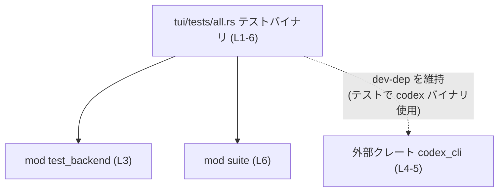

tui/tests/all.rs のコード解説です。

# tui/tests/all.rs コード解説

## 0. ざっくり一言

このファイルは、TUI クレートの「単一の統合テストバイナリ（integration test binary）」を定義し、個々のテストモジュール（`test_backend` と `suite`）を束ねるエントリーポイントになっています（tui/tests/all.rs:L1-3, L6）。

---

## 1. このモジュールの役割

### 1.1 概要

- 統合テスト用のバイナリに、複数のテストモジュールをコンパイルしてまとめる役割を持ちます（コメントより、tui/tests/all.rs:L1-2）。
- `tests/suite/` 以下に置かれたテストモジュールを `mod` 宣言で取り込みます（tui/tests/all.rs:L2-3, L6）。
- テストで外部バイナリ `codex` を起動するために、`codex_cli` クレートを開発用依存として保持するよう、`use` 宣言が追加されています（tui/tests/all.rs:L4-5）。

### 1.2 アーキテクチャ内での位置づけ

このファイルは Rust の integration test 機構における「1つのテストバイナリ」です。その内部に 2 つのサブモジュールを持ち、外部クレート `codex_cli` に依存しています。



- `test_backend` / `suite` の中身は、このチャンクには現れません。
- `codex_cli` の具体的な API 利用箇所も、このファイルには存在せず、「依存を保持するためのダミー import」にとどまります（tui/tests/all.rs:L4-5）。

### 1.3 設計上のポイント

コードから読み取れる設計上の特徴は次の通りです。

- **責務の分割**
  - このファイルはテストの「集約」と「依存の宣言」のみを行い、実際のテストロジックは `test_backend` と `suite` モジュールに委譲しています（tui/tests/all.rs:L3, L6）。
- **状態管理**
  - グローバルな状態や構造体・関数は定義されておらず、このファイル自身は状態を持ちません。
- **エラーハンドリング**
  - 実行ロジックを持たないため、このファイル内でのエラーハンドリングはありません。
- **依存管理**
  - `#[allow(unused_imports)]` と `use codex_cli as _;` を組み合わせることで、「コンパイラからは未使用だが、Cargo 依存関係としては残したいクレート」を明示的に保持しています（tui/tests/all.rs:L4-5）。
  - コメントにより、これは `cargo-shear`（未使用依存を削るツール）から dev-dependency を保護する目的であることが示されています（tui/tests/all.rs:L5）。

---

## 2. 主要な機能一覧（コンポーネントインベントリー）

このファイルは実行関数やテスト関数を直接定義していませんが、以下のコンポーネントを宣言しています。

### 2.1 モジュール・クレート一覧

| 名前           | 種別      | 定義位置                     | 役割 / 用途 |
|----------------|-----------|------------------------------|-------------|
| `test_backend` | モジュール | tui/tests/all.rs:L3          | TUI のバックエンドに関する統合テストをまとめるモジュールと推測されますが、このチャンクには実体は現れません。役割は `mod` 名とファイル配置（コメント）からの推測であり、詳細なテスト内容は不明です。 |
| `suite`        | モジュール | tui/tests/all.rs:L6          | `tests/suite/` 配下のテスト群を集約するモジュールと考えられますが、このチャンクには中身はありません（tui/tests/all.rs:L2, L6）。 |
| `codex_cli`    | 外部クレート | tui/tests/all.rs:L4-5       | 統合テストが `codex` バイナリを起動するための CLI クレート。ここでは `use codex_cli as _;` により dev-dependency を保つ目的でのみ参照されています（tui/tests/all.rs:L5）。 |

> 補足（事実と推測の分離）  
>
> - `test_backend` / `suite` の「テスト内容・公開 API・データ構造」は、このチャンクには定義がないため不明です。  
> - 表中の役割説明はモジュール名とコメント（tui/tests/all.rs:L1-2）からの推測であり、厳密な仕様は各モジュールの実装を参照する必要があります。

---

## 3. 公開 API と詳細解説

このファイル自体には、公開関数・構造体・列挙体は定義されていません。ここでは「公開 API が存在しない」ことを明示し、代わりにモジュールと import の挙動を整理します。

### 3.1 型一覧（構造体・列挙体など）

このファイルには型定義（`struct`, `enum`, `type`, `trait` など）は存在しません。

| 名前 | 種別 | 役割 / 用途 | 定義位置 |
|------|------|-------------|----------|
| なし | -    | -           | -        |

### 3.2 関数詳細（最大 7 件）

このファイルには関数・メソッド（`fn`）定義がありません。そのため、関数詳細テンプレートに沿って解説すべき対象はありません。

- `main` 関数も明示的には定義されていません。Rust の integration test では、テスト関数をもとにテストランナーが自動生成したエントリーポイントが利用されるためです。この自動生成部分は、このファイルのコードには現れません。

### 3.3 その他の要素（モジュール宣言と import）

関数の代わりに、このファイルに存在する 3 つの要素を整理します。

| 要素                          | 役割（1 行） | 根拠 |
|-------------------------------|--------------|------|
| `mod test_backend;`           | `tests` 用バイナリに `test_backend` モジュールを組み込む宣言 | tui/tests/all.rs:L3 |
| `#[allow(unused_imports)]`    | 未使用 import に対するコンパイラ警告を抑制する属性 | tui/tests/all.rs:L4 |
| `use codex_cli as _;`         | `codex_cli` をシンボル名 `_` で import しつつ、実際のコードでは参照しないことを表現する。dev-dep を維持する目的（コメントより）。 | tui/tests/all.rs:L4-5 |
| `mod suite;`                  | `suite` モジュールをこのテストバイナリに含める宣言 | tui/tests/all.rs:L6 |

---

## 4. データフロー

### 4.1 全体のフロー

このファイル単体には「データを受け取り処理して返す」ようなフローは存在しません。ここでは、「テスト実行時にどのようにコードが読み込まれるか」という観点でのフローを整理します。

1. `cargo test` 実行時、`tui/tests/all.rs` が 1 つの integration test バイナリとしてコンパイル対象になります。
2. コンパイル時に `mod test_backend;` と `mod suite;` により、それぞれ対応するモジュールファイルが解決・コンパイルされ、このバイナリの一部になります（tui/tests/all.rs:L3, L6）。
3. `use codex_cli as _;` により、`codex_cli` クレートもこのテストバイナリの依存としてリンクされます（tui/tests/all.rs:L4-5）。
4. 実行時には、テストランナーが `test_backend` / `suite` 内のテスト関数を検出して実行し、その中で `codex_cli` を利用して `codex` バイナリを起動する可能性があります（コメントより、起動ロジック自体は別ファイル）。

### 4.2 シーケンス図（コンパイル〜実行の概念図）

```mermaid
sequenceDiagram
    participant Cargo as "cargo test"
    participant All as "all.rs テストバイナリ (L1-6)"
    participant TB as "mod test_backend (L3)"
    participant Suite as "mod suite (L6)"
    participant CodexCli as "crate codex_cli (L4-5)"
    participant CodexBin as "codex バイナリ\n(別プロセス, このチャンク外)"

    Cargo->>All: all.rs をコンパイル対象として読み込む
    All->>TB: test_backend モジュールをコンパイルに含める
    All->>Suite: suite モジュールをコンパイルに含める
    All->>CodexCli: use codex_cli as _; により依存をリンク
    Cargo->>All: テストバイナリを実行
    All->>TB: TB 内のテスト関数を順次実行
    TB->>CodexBin: codex バイナリを起動（詳細はこのチャンク外）
    All->>Suite: Suite 内のテスト関数を順次実行
```

> 注意: `test_backend` および `suite` のテスト関数や `codex` バイナリ起動ロジックは、このチャンク（tui/tests/all.rs）には現れません。上記はコメント（tui/tests/all.rs:L1-2, L5）から読み取れる範囲での概念図です。

### 4.3 Bugs / Security 観点

- このファイル自体には実行ロジックがないため、**直接的なバグやセキュリティホール** は読み取れません。
- `use codex_cli as _;` は **実行時には未使用** であり、副作用のあるコードを呼び出してはいません（tui/tests/all.rs:L4-5）。
  - そのため、「未使用 import による予期せぬ初期化」などは発生しない構造です。
- テスト内から `codex` バイナリを起動することによるセキュリティ上の注意点（例: 実行環境のコマンドインジェクション）などは、`test_backend` 等の実装側を確認する必要があります。このチャンクからは不明です。

---

## 5. 使い方（How to Use）

このファイルは開発者が直接呼び出す API ではなく、「テストモジュールを追加・統合するためのエントリーポイント」として使われます。

### 5.1 基本的な使用方法

典型的な利用は「テストモジュールを追加する」ことです。

#### 例: 新しいテストモジュール `mod new_feature;` を追加する

```rust
// 既存コメント: 単一の統合テストバイナリで全テストモジュールを集約する      // tui/tests/all.rs:L1-2 に相当するコメント
// Single integration test binary that aggregates all test modules.
// The submodules live in `tests/suite/`.

mod test_backend;                                         // 既存のテストモジュール宣言（L3 相当）

#[allow(unused_imports)]                                  // 未使用 import 警告を抑制（L4）
use codex_cli as _; // Keep dev-dep for cargo-shear;      // dev-dep を維持するためのダミー import（L5）

mod suite;                                                // 既存のテストモジュール宣言（L6 相当）

mod new_feature;                                          // 新たに追加したテストモジュール
```

- これにより、`tests/new_feature.rs` または `tests/new_feature/mod.rs` に定義されたテストが、このバイナリに含まれます。
- 実際のファイルパス・モジュール構成はプロジェクトのレイアウトに依存するため、このチャンクからは詳細は分かりません。

### 5.2 よくある使用パターン

1. **テストモジュールを増やす**
   - 新しい統合テストを追加する場合、`mod your_new_test;` をこのファイルに追加して対応するファイルを作成します。
2. **外部依存をテスト専用で保持する**
   - テストでのみ利用する外部クレートを `dev-dependencies` として `Cargo.toml` に追加し、このファイルで `use crate_name as _;` としておくことで、`cargo-shear` 等により削除されるのを防ぎます（tui/tests/all.rs:L4-5 のパターン）。

### 5.3 よくある間違い

このファイルの構造から、起こりそうな誤用例と正しい例を対比して示します。

```rust
// 間違い例: dev-dep を保持したいが、allow を付け忘れる
use codex_cli as _;                  // unused import 警告が出る可能性がある

// 正しい例: unused_imports を許可して明示的に「未使用だが必要」と示す
#[allow(unused_imports)]
use codex_cli as _; // Keep dev-dep for cargo-shear; tests spawn the codex binary.
```

- `#[allow(unused_imports)]` を付けないと、コンパイル時に警告が出続けるため、意図が不明確になります（tui/tests/all.rs:L4）。

```rust
// 間違い例: モジュールファイルを作ったが all.rs に mod を追加していない
// tests/new_feature.rs を追加したが、ここに mod new_feature; がない

// 正しい例: 新しいテストファイルを追加したら、all.rs にも mod を追加する
mod new_feature;
```

- `mod` 宣言を忘れると、そのモジュール内のテストがコンパイルも実行もされません。

### 5.4 使用上の注意点（まとめ）

- **前提条件**
  - 新しいテストモジュールを追加する場合は、対応するファイルと `mod` 宣言の両方を用意する必要があります。
- **禁止事項 / 注意**
  - このファイルには実ロジックを置かず、「テストモジュールの集約」と「依存の import」に限定する方が構造が明確になります。
  - `use codex_cli as _;` のような「未使用 import」を追加する場合は、目的（依存維持など）をコメントで明示すると、後から見た人にも意図が分かりやすくなります（tui/tests/all.rs:L5 のように）。

---

## 6. 変更の仕方（How to Modify）

### 6.1 新しい機能（テスト）を追加する場合

1. **テストモジュールファイルを作成**
   - 例: `tests/new_feature.rs` または `tests/suite/new_feature.rs` など。
   - 具体的なディレクトリ構成はこのチャンクには現れないため、プロジェクトの既存パターンに合わせる必要があります（tui/tests/all.rs:L2 が `tests/suite/` を示唆）。

2. **`tui/tests/all.rs` に `mod` 宣言を追加**
   - 例: `mod new_feature;` を追加（tui/tests/all.rs:L3, L6 と同様の形式）。

3. **必要な dev-dependency を追加**
   - テストで新たな外部クレートを使う場合、`Cargo.toml` の `[dev-dependencies]` に追加します。
   - もしそのクレートがテストコードのどこからも直接参照されないが、バイナリ起動等の目的で依存を維持したい場合は、`use foo as _;` + `#[allow(unused_imports)]` をこのファイルに追加するパターンを踏襲できます（tui/tests/all.rs:L4-5）。

### 6.2 既存の機能（集約方法）を変更する場合

- **影響範囲の確認**
  - `mod test_backend;` や `mod suite;` を削除・リネームする場合、それに対応するファイル内のテストが全て影響を受けます（コンパイルされなくなる、名前が変わるなど）。
  - プロジェクト全体でそのテストモジュールがどのように想定されているかを確認する必要があります。

- **契約（前提条件）の把握**
  - このファイルには API 契約はありませんが、「ここに宣言されたモジュールはすべて統合テストに含まれる」という前提があります。
  - `codex_cli` のような dev-dep を削除する場合は、テストコードおよび CI 設定などで `codex` の利用がないかを確認する必要があります（コメント tuil/tests/all.rs:L5 参照）。

- **テスト確認**
  - このファイルを変更した後は、`cargo test` を実行して、統合テスト全体が問題なく動作することを確認する必要があります。

---

## 7. 関連ファイル

このファイルから直接参照されている、密接に関係するファイル・モジュールの一覧です。実際のファイルパスは、このチャンクには明示されていないため、Rust の標準的なモジュール規約に基づく推測を含みます。

| パス（推定を含む）              | 役割 / 関係 |
|--------------------------------|------------|
| `tui/tests/test_backend.rs` または `tui/tests/test_backend/mod.rs` | `mod test_backend;` に対応するテストモジュール。バックエンドに関する統合テストが含まれていると考えられます（tui/tests/all.rs:L3）。 |
| `tui/tests/suite/mod.rs` または `tui/tests/suite.rs` | コメントにある「The submodules live in `tests/suite/`」に対応するモジュール。複数のサブモジュールを束ねている可能性があります（tui/tests/all.rs:L2, L6）。 |
| `codex_cli` クレート（`Cargo.toml` の dev-dependencies） | 統合テストから `codex` バイナリを起動するために利用される CLI クレート。`use codex_cli as _;` により dev-dep として保持されています（tui/tests/all.rs:L4-5）。 |
| CI 設定ファイル（例: `.github/workflows/*.yml`） | テスト実行時に `codex` バイナリをどのように用意するか（ビルド・配置など）を定義している可能性がありますが、このチャンクには現れません。 |

> 不明点の明示  
>
> - `test_backend` や `suite` 内でどのようなテストが実行されるか、どのような公開 API を持つかは、このチャンクには定義がないため分かりません。  
> - `codex` バイナリの具体的な起動方法（コマンドライン引数・並行実行など）も、このファイルからは把握できません。

以上が、tui/tests/all.rs に基づいて確認できる範囲での客観的な解説です。
