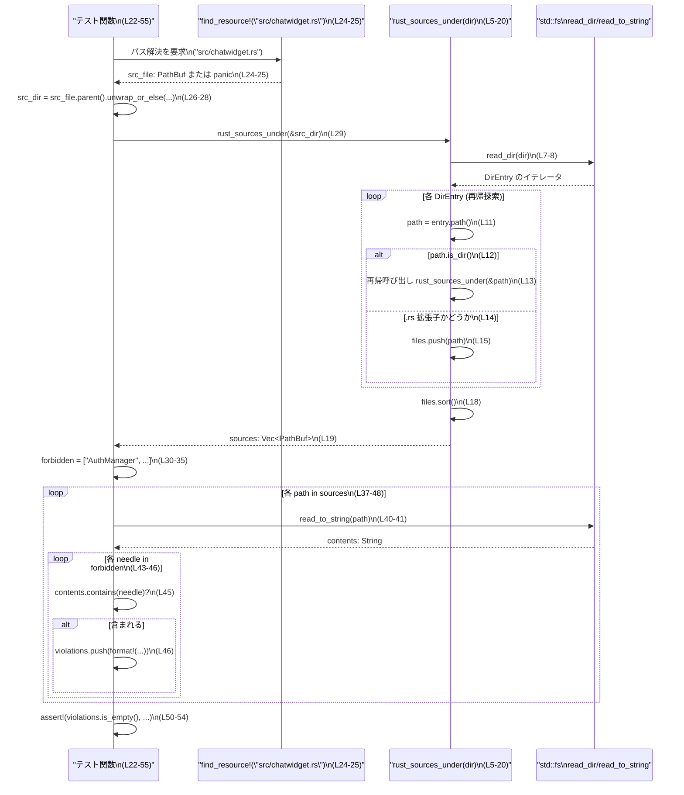

# tui/tests/manager_dependency_regression.rs コード解説

## 0. ざっくり一言

TUI ランタイムのソースコード群が `AuthManager` や `ThreadManager` などの「マネージャ層」に依存していないことを、ソースファイルを再帰的に走査して文字列検索で検証するテストモジュールです。

---

## 1. このモジュールの役割

### 1.1 概要

- このモジュールは **TUI ランタイム層からマネージャ層への依存が紛れ込んでいないこと** を検出するために存在します。
- 具体的には、`src/chatwidget.rs` とそのディレクトリ配下の `.rs` ファイルから、`AuthManager` / `ThreadManager` などの識別子が出現しないことをテストします（`manager_dependency_regression.rs:L22-35`）。
- テスト失敗時には、どのファイルにどの禁止文字列が含まれていたかをメッセージとして出力します（`manager_dependency_regression.rs:L37-48, L50-54`）。

### 1.2 アーキテクチャ内での位置づけ

このモジュールは、TUI 層とマネージャ層のレイヤリング制約を **文字列ベースの検査** で担保するテストです。

```mermaid
graph TD
    Test["tui/tests/manager_dependency_regression.rs\nテスト関数 (L22-55)"]
    ChatWidget["\"src/chatwidget.rs\" 起点ファイル\n(find_resource! の引数, L24)"]
    TuiDir["TUI ソースディレクトリ\n(src_file.parent(), L26-29)"]
    Scanner["rust_sources_under(dir)\n再帰的ファイル収集 (L5-20)"]
    FS["std::fs\nread_dir / read_to_string (L7-8, L40-41)"]
    Managers["AuthManager / ThreadManager など\n※このチャンクには定義なし\n(L31-34)"]

    Test --> ChatWidget
    Test --> TuiDir
    TuiDir --> Scanner
    Scanner --> FS
    Test --> FS
    Test -.禁止パターン文字列検索.-> Managers
```

- マネージャ層 (`AuthManager`, `ThreadManager`) 自体の実装はこのファイルには現れませんが、それらへの **依存の有無** を検査対象としています（`manager_dependency_regression.rs:L31-34`）。

### 1.3 設計上のポイント

- **責務の分割**  
  - ファイルシステム走査は `rust_sources_under` に分離し（`manager_dependency_regression.rs:L5-20`）、テスト本体は「起点ディレクトリの決定」と「禁止文字列検査」に集中しています（`manager_dependency_regression.rs:L22-48`）。
- **状態を持たない構造**  
  - グローバル状態や構造体はなく、すべてローカル変数と関数呼び出しのみです。
- **エラーハンドリング方針**  
  - `fs::read_dir` や `fs::read_to_string`、`find_resource!` など I/O 系の失敗はすべて `panic!` を通じて即座にテストを失敗させる方針です（`manager_dependency_regression.rs:L7-8, L10, L24-25, L28, L40-41`）。
- **並行性**  
  - 並行処理や非同期処理は使われておらず、標準の同期 I/O のみを利用しています。

---

## 2. 主要な機能一覧（コンポーネントインベントリー）

このモジュールに定義されている主要な関数・テストは次の 2 つです。

| 名前 | 種別 | 役割 / 用途 | 定義位置 |
|------|------|-------------|----------|
| `rust_sources_under` | 関数 | 指定ディレクトリ配下の `.rs` ファイルを再帰的に収集し、ソートされた `Vec<PathBuf>` として返します。 | `manager_dependency_regression.rs:L5-20` |
| `tui_runtime_source_does_not_depend_on_manager_escape_hatches` | テスト関数 | `src/chatwidget.rs` 周辺の TUI ソースから、`AuthManager` / `ThreadManager` などの禁止文字列への依存がないことを検証します。 | `manager_dependency_regression.rs:L22-55` |

---

## 3. 公開 API と詳細解説

### 3.1 型一覧（構造体・列挙体など）

このファイル内で新しく定義されている構造体・列挙体・型エイリアスはありません。  
標準ライブラリの型のみを利用しています。

| 名前 | 種別 | 役割 / 用途 | 出典 |
|------|------|-------------|------|
| `Path` | 構造体 | ファイルシステム上のパスを表す型。`rust_sources_under` の引数に使われます。 | `std::path::Path`（`manager_dependency_regression.rs:L2, L5`） |
| `PathBuf` | 構造体 | 可変なパスバッファ。収集したファイルパスのコンテナとして使用されます。 | `std::path::PathBuf`（`manager_dependency_regression.rs:L3, L5`） |

### 3.2 関数詳細

#### `rust_sources_under(dir: &Path) -> Vec<PathBuf>`

**概要**

- 指定されたディレクトリ `dir` の配下を再帰的にたどり、拡張子が `.rs` のファイルのみを抽出してパスのリストとして返します（`manager_dependency_regression.rs:L5-20`）。

**引数**

| 引数名 | 型 | 説明 | 根拠 |
|--------|----|------|------|
| `dir` | `&Path` | 走査の起点となるディレクトリパスへの参照です。 | `manager_dependency_regression.rs:L5` |

**戻り値**

- 型: `Vec<PathBuf>`  
- 意味: `dir` 配下（サブディレクトリを含む）のすべての `.rs` ファイルのパスを格納したベクタ。`sort()` 済みで、パスの順序は一定です（`manager_dependency_regression.rs:L18-19`）。

**内部処理の流れ**

1. 空の `Vec<PathBuf>` を作成します（`manager_dependency_regression.rs:L6`）。
2. `fs::read_dir(dir)` で `dir` の内容を列挙し、失敗した場合は `panic!` します（`manager_dependency_regression.rs:L7-8`）。
3. 各 `DirEntry` について:
   - `entry.path()` でパスを取得します（`manager_dependency_regression.rs:L11`）。
   - `path.is_dir()` が真なら再帰的に `rust_sources_under(&path)` を呼び、その結果を `files` に `extend` します（`manager_dependency_regression.rs:L12-13`）。
   - そうでなく、`path.extension().is_some_and(|ext| ext == "rs")` が真なら、`.rs` ファイルとして `files.push(path)` します（`manager_dependency_regression.rs:L14-15`）。
4. ループ終了後、`files.sort()` で `PathBuf` のリストをソートします（`manager_dependency_regression.rs:L18`）。
5. ソート済みの `files` を返します（`manager_dependency_regression.rs:L19`）。

**Examples（使用例）**

テスト以外の文脈で、この関数を利用して `src` 以下の `.rs` ファイル一覧を取得する例です。

```rust
use std::path::Path;                          // Path 型をインポートする
// 同一モジュール内に rust_sources_under が定義されている前提

fn list_src_rs_files() {                      // 単純に一覧を表示する関数
    let src_dir = Path::new("src");          // "src" ディレクトリを指す Path を作る
    let files = rust_sources_under(src_dir); // 再帰的に .rs ファイルを収集する
    for path in files {                      // 取得したパスを順に処理する
        println!("{}", path.display());      // 各パスを表示する
    }
}
```

**Errors / Panics**

- `fs::read_dir(dir)` が失敗した場合（ディレクトリが存在しない、権限がない等）、`panic!("failed to read {}: {err}", dir.display())` によりパニックします（`manager_dependency_regression.rs:L7-8`）。
- `entries` の各要素取り出しで `entry` がエラーになった場合も `panic!("failed to read dir entry: {err}")` によりパニックします（`manager_dependency_regression.rs:L9-10`）。
- I/O エラーが `Result` として呼び出し元に返されることはなく、テストを即座に失敗させる方針です。

**Edge cases（エッジケース）**

- 対象ディレクトリに `.rs` ファイルが一つもない場合  
  → 空の `Vec` を返します（特別な分岐はなく、そのまま `files` が空で `sort()` されます）。
- 非ディレクトリ（ファイル）を指す `dir` を渡した場合  
  → `read_dir(dir)` がエラーになりパニックする可能性が高いです（`manager_dependency_regression.rs:L7-8`）。
- シンボリックリンクの扱い  
  → `path.is_dir()` が真を返すリンクは再帰対象になります（`manager_dependency_regression.rs:L12-13`）。循環するリンク構造がある場合、再帰が深くなりうる点に注意が必要です。
- 非 UTF-8 ファイル名  
  → `PathBuf` をそのまま扱っているため、ファイル名が非 UTF-8 でも動作します（表示時に `display()` を使うかどうかは呼び出し側次第です）。

**使用上の注意点**

- **前提条件**: `dir` は実在するディレクトリである必要があります。そうでない場合、`read_dir` 失敗によりパニックします。
- **パフォーマンス**: ディレクトリ階層が深くファイル数が多い場合、再帰と全ファイル列挙によりテスト実行時間が増加します。ただしテスト用として許容されている実装です。
- **安全性**: ファイルパスは呼び出し元から供給されるため、ユーザ入力由来のパスをそのまま渡すと意図しないディレクトリを走査する可能性があります。テストでは `src_file.parent()` を起点にしており、外部入力は使っていません（`manager_dependency_regression.rs:L26-29`）。

---

#### `tui_runtime_source_does_not_depend_on_manager_escape_hatches()`

**概要**

- TUI ランタイムの起点とされる `src/chatwidget.rs` のディレクトリ以下の `.rs` ファイルを全て読み込み、`AuthManager` や `ThreadManager` など特定のシンボル名がソース内に含まれていないことを確認するテストです（`manager_dependency_regression.rs:L22-35, L37-54`）。

**引数**

- 引数なし。`#[test]` 属性によりテストランナーから直接呼ばれます（`manager_dependency_regression.rs:L22-23`）。

**戻り値**

- 戻り値なし（`()`）。  
- `assert!` が失敗した場合または内部で `panic!` が発生した場合、テストは失敗します。

**内部処理の流れ（アルゴリズム）**

1. `codex_utils_cargo_bin::find_resource!("src/chatwidget.rs")` を使って、TUI ランタイムの起点となるソースファイルのパスを取得します。エラー時には `panic!` します（`manager_dependency_regression.rs:L24-25`）。
2. `src_file.parent()` でディレクトリ部分（親ディレクトリ）を取り出し、`None` の場合は `panic!` します（`manager_dependency_regression.rs:L26-28`）。
3. `rust_sources_under(src_dir)` を呼び出し、当該ディレクトリ配下の `.rs` ファイル一覧を取得します（`manager_dependency_regression.rs:L29`）。
4. 禁止文字列の配列 `forbidden` を定義します（`"AuthManager"`, `"ThreadManager"`, `"auth_manager("`, `"thread_manager("`）（`manager_dependency_regression.rs:L30-35`）。
5. 各ソースファイルに対して:
   - `fs::read_to_string(path)` で内容を読み込み、失敗時には `panic!` します（`manager_dependency_regression.rs:L37-41`）。
   - 各禁止文字列 `needle` について、`contents.contains(*needle)` で出現の有無を調べます（`manager_dependency_regression.rs:L43-45`）。
   - 出現した場合は `"path/to/file.rs contains`needle`"` という文字列を生成し、`violations` ベクタに蓄積します（`manager_dependency_regression.rs:L45-47`）。
6. 最後に `violations.is_empty()` を `assert!` し、空でない場合はテスト失敗とし、違反内容を改行区切りでメッセージに含めます（`manager_dependency_regression.rs:L50-54`）。

**Examples（使用例）**

このテストは `cargo test` で自動的に実行されますが、特定のテストだけを実行する例を示します。

```bash
# クレートルートで、このテストだけを実行する例
cargo test tui_runtime_source_does_not_depend_on_manager_escape_hatches
```

テストに失敗した場合の典型的な出力例（形式）は次のようになります（文字列フォーマットから推測される形式、根拠: `manager_dependency_regression.rs:L37-48, L50-54`）。

```text
thread 'tui_runtime_source_does_not_depend_on_manager_escape_hatches' panicked at 'unexpected manager dependency regression(s):
src/ui/some_widget.rs contains `AuthManager`
src/ui/another_widget.rs contains `thread_manager(`', ...
```

**Errors / Panics**

- `find_resource!("src/chatwidget.rs")` がエラーを返した場合、`panic!("failed to resolve src runfile: {err}")` が呼ばれます（`manager_dependency_regression.rs:L24-25`）。
- `src_file.parent()` が `None` を返した場合（トップレベルにファイルがあるなど）、`panic!("source file has no parent: {}", src_file.display())` します（`manager_dependency_regression.rs:L26-28`）。
- 各 `.rs` ファイルの読み込み中に `fs::read_to_string` が失敗すると、`panic!("failed to read {}: {err}", path.display())` によりテストは失敗します（`manager_dependency_regression.rs:L40-41`）。
- 設計上、I/O エラーはすべてパニックにマッピングされ、`Result` として扱われません。

**Edge cases（エッジケース）**

- `src/chatwidget.rs` が存在しない場合  
  → `find_resource!` 内部でのエラーが `Err` として返され、それを `unwrap_or_else` で `panic!` に変換しています（`manager_dependency_regression.rs:L24-25`）。
- `src/chatwidget.rs` がファイルシステムのルートなどで親ディレクトリを持たない場合  
  → `src_file.parent()` が `None` を返し、`panic!` します（`manager_dependency_regression.rs:L26-28`）。
- TUI ソース内に「コメント」や「文字列リテラル」として禁止文字列が含まれる場合  
  → このテストは単純な `contents.contains()` に基づくため、コードかコメントかは区別されず、それらも違反としてカウントされます（`manager_dependency_regression.rs:L43-46`）。
- 依存の表現が禁止文字列と一致しない場合（例: 別名インポートやモジュールパスのみ）  
  → 文字列が含まれない限り、このテストでは検出されません。これは実装（単純な文字列検索）の直接の結果です。

**使用上の注意点**

- **前提条件（契約）**  
  - `src/chatwidget.rs` が TUI ランタイムの起点として存在し、その親ディレクトリ配下に TUI 関連の `.rs` が置かれていることが前提です（`manager_dependency_regression.rs:L24-29`）。
  - マネージャ層への依存は、ここで列挙されている禁止文字列だけではない可能性がありますが、テストの検査対象はこの配列の内容に限定されます（`manager_dependency_regression.rs:L30-35`）。
- **誤検出の可能性**  
  - コメントやテストコード内で名前を言及しただけでも、禁止文字列として検出されます。テストの意図が「一切名称を出さないこと」であるか、「コードとして依存しないこと」なのかを設計として把握しておく必要があります。
- **パフォーマンス**  
  - 全 `.rs` ファイルを読み込んで全文検索するため、ファイル数・サイズによってはテスト実行時間に影響します。ただし、I/O は同期的に一度ずつ行うだけであり、一般的な規模のプロジェクトでは許容範囲と考えられます。
- **並行性**  
  - 並列化は行っていません。テストでは一つずつファイルを読み、禁止文字列をチェックします。テストの determinism（決定性）が優先されています。

### 3.3 その他の関数

このモジュールには、上記 2 つ以外の関数・メソッドは定義されていません。

---

## 4. データフロー

このテストが実行されるときの典型的なデータフローを、シーケンス図で表します。



- 要点として、**ファイルの列挙** は `rust_sources_under` が担当し、**中身の読み込みと禁止文字列チェック** はテスト関数内で行われています。
- どのファイルにどの禁止文字列が含まれていたかは、`violations` に `"path contains`needle`"` の形式で蓄積され、テスト失敗時のメッセージに含まれます（`manager_dependency_regression.rs:L37-48, L50-54`）。

---

## 5. 使い方（How to Use）

### 5.1 基本的な使用方法

このモジュールはテスト専用であり、通常は次のようにクレートルートまたはワークスペースルートで `cargo test` を実行することで利用します。

```bash
# クレート全体のテストを実行
cargo test

# このテストだけを実行したい場合（名前一致を利用）
cargo test tui_runtime_source_does_not_depend_on_manager_escape_hatches
```

テストは自動的に次の処理を行います。

1. `src/chatwidget.rs` の実際のファイルパスを解決（`manager_dependency_regression.rs:L24-25`）。
2. その親ディレクトリ配下の `.rs` ファイルを列挙（`manager_dependency_regression.rs:L26-29`）。
3. 各ファイルに対し、禁止文字列の出現有無をチェック（`manager_dependency_regression.rs:L30-48`）。

### 5.2 よくある使用パターン

このテストのパターンを応用して、他の「依存禁止」テストを作ることもできます。例として、別のディレクトリから別の禁止文字列を探す場合のイメージを示します（新規コードのイメージであり、このファイルには含まれていません）。

```rust
#[test]
fn server_layer_does_not_depend_on_ui() {
    use std::path::Path;
    let src_dir = Path::new("src/server");                  // サーバ層のディレクトリ
    let sources = rust_sources_under(src_dir);              // .rs ファイルを再帰的に取得
    let forbidden = ["egui::", "iced::"];                   // UI ライブラリへの依存を禁止する例

    let violations: Vec<String> = sources
        .iter()
        .flat_map(|path| {
            let contents = std::fs::read_to_string(path)    // ファイル内容を読み込み
                .unwrap();                                  // テストなので単純に unwrap
            let path_display = path.display().to_string();
            forbidden
                .iter()
                .filter(move |needle| contents.contains(**needle))
                .map(move |needle| format!("{path_display} contains `{needle}`"))
        })
        .collect();

    assert!(violations.is_empty(), "UI dependency found:\n{}", violations.join("\n"));
}
```

### 5.3 よくある間違い

この関数群を応用する場合に起こりやすい誤用と、その対策の例です。

```rust
use std::path::Path;

// 誤り例: 存在しないディレクトリを指定してしまう
#[test]
fn wrong_usage_example() {
    let dir = Path::new("nonexistent");     // このディレクトリが存在しない
    let _files = rust_sources_under(dir);   // read_dir が失敗し panic する
}

// 正しい例: プロジェクト内で存在が保証されているディレクトリを使う
#[test]
fn correct_usage_example() {
    let dir = Path::new("src");             // 一般的には存在するディレクトリ
    let files = rust_sources_under(dir);    // .rs ファイルの一覧が取得される
    assert!(!files.is_empty());             // 必要なら追加の検証を行う
}
```

- このように、テスト対象のディレクトリが実在することを事前に保証しておくことが重要です（`manager_dependency_regression.rs:L7-8` での `panic!` から分かる通り、存在しないとテストが即失敗します）。

### 5.4 使用上の注意点（まとめ）

- **I/O 失敗はすべてパニック** になる設計であり、I/O エラーを個別に扱うユニットテストではありません。
- **文字列検索ベース** のため、コメントや文字列リテラル内の出現も違反として扱われます。
- **レイヤリング制約の自動検査** を目的としているため、新たにマネージャ層への依存を導入する場合は、このテストの禁止リストを更新する必要がある可能性があります（ただし、更新前に設計全体を確認することが望まれます）。

---

## 6. 変更の仕方（How to Modify）

### 6.1 新しい機能を追加する場合

マネージャ層以外の依存も同様に禁止したい場合、次のような流れで機能追加するのが自然です。

1. **禁止パターンの追加**  
   - 現在は `forbidden` 配列に 4 つの文字列が定義されています（`manager_dependency_regression.rs:L30-35`）。  
   - 新しい禁止対象を追加する場合は、この配列に文字列を追加する形が最も簡単です。
2. **別レイヤー用のテスト関数追加**  
   - 別のレイヤー（例: コアロジック層 → インフラ層への依存禁止）を検査したい場合は、本テスト関数を参考に、新しい `#[test]` 関数を定義し、起点ディレクトリと禁止文字列配列を変更します。
3. **再利用すべき関数**  
   - ディレクトリ走査部分は `rust_sources_under` を再利用すると、実装の重複を避けられます（`manager_dependency_regression.rs:L5-20`）。

### 6.2 既存の機能を変更する場合

既存処理を変更する際は、次の点に注意する必要があります。

- **テストの契約（前提）を把握する**  
  - このテストは「TUI ランタイム層がマネージャ層に依存しない」という設計上の契約を表現しています。禁止文字列を削除・緩和すると、その契約自体を変更することになります。
- **影響範囲の確認**  
  - `forbidden` の中身を変更すると、TUI ソースに既に存在する依存があれば、テスト結果が変わります。変更前後で `cargo test` を実行し、どのファイルが影響を受けるか（`violations` の内容）を確認する必要があります。
- **I/O エラーの扱いを柔軟にしたい場合**  
  - 現状はすべて `panic!` ですが、より柔軟にエラーを扱いたい場合は、`rust_sources_under` の戻り値を `Result<Vec<PathBuf>, io::Error>` に変更するなどの API 変更が必要になります。この場合、呼び出し側（テスト関数）のエラーハンドリングも合わせて変更する必要があります。

---

## 7. 関連ファイル

このモジュールと密接に関係するファイル・コンポーネントを以下に整理します。

| パス / コンポーネント | 役割 / 関係 | 根拠 |
|-----------------------|------------|------|
| `"src/chatwidget.rs"` | TUI ランタイムの起点と見なされるソースファイル。`find_resource!` の引数として指定され、その親ディレクトリ配下が検査対象となります。 | `manager_dependency_regression.rs:L24-29` |
| `codex_utils_cargo_bin::find_resource!` | `"src/chatwidget.rs"` の実際のファイルパスを解決するマクロ／関数。エラー時には `Err` を返し、それを `unwrap_or_else` で `panic!` に変換しています。実装はこのチャンクには現れません。 | `manager_dependency_regression.rs:L24-25` |
| `AuthManager` / `ThreadManager` | マネージャ層のコンポーネントを表すと推測される識別子。TUI ランタイムからの依存が禁止されており、その名前や関数呼び出しを文字列として検査しています。定義ファイルはこのチャンクには現れません。 | `manager_dependency_regression.rs:L30-35` |
| `std::fs` | ディレクトリ列挙（`read_dir`）とファイル読み込み（`read_to_string`）のために使用されます。 | `manager_dependency_regression.rs:L1, L7-8, L40-41` |
| `std::path::{Path, PathBuf}` | ファイルパスの表現と操作に使用され、ディレクトリ走査関数のインターフェースに現れます。 | `manager_dependency_regression.rs:L2-3, L5-6, L24-29` |

このように、本モジュールは主に **テスト環境のファイルシステム** と **TUI ランタイムのソースコード構造** に依存しており、アプリケーションの実行時ロジックには直接関与しないテスト専用コードとなっています。
