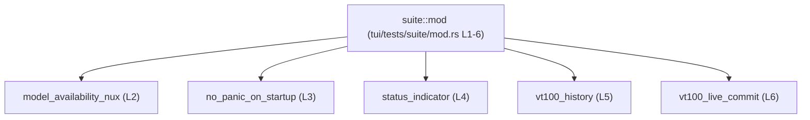
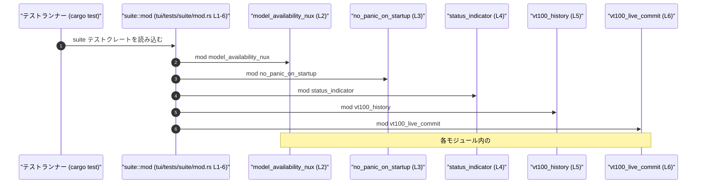

# tui/tests/suite/mod.rs

## 0. ざっくり一言

`tui/tests/suite/mod.rs` は、複数の統合テスト（integration tests）を 1 つのテストスイートとしてまとめる **テスト用モジュール集約ファイル**です（`tui/tests/suite/mod.rs:L1-6`）。

---

## 1. このモジュールの役割

### 1.1 概要

- コメントにある通り、**もともと個別ファイルだった統合テストをモジュールとして集約する役割**を持つファイルです（`tui/tests/suite/mod.rs:L1`）。
- 自身ではテスト関数や型を定義せず、`mod` 宣言によって他のテストモジュールを読み込むだけの構成になっています（`tui/tests/suite/mod.rs:L2-6`）。

### 1.2 アーキテクチャ内での位置づけ

このファイルは、テスト階層の中で「suite モジュール」のエントリポイントとして機能し、その配下に複数のテストモジュールをぶら下げています。

- 上位: テストクレート／テストランナー（`cargo test`など）  
- 本ファイル: `suite` モジュールのルート (`mod.rs`)  
- 下位: 個別のテストモジュール  
  - `model_availability_nux`（`tui/tests/suite/mod.rs:L2`）  
  - `no_panic_on_startup`（`tui/tests/suite/mod.rs:L3`）  
  - `status_indicator`（`tui/tests/suite/mod.rs:L4`）  
  - `vt100_history`（`tui/tests/suite/mod.rs:L5`）  
  - `vt100_live_commit`（`tui/tests/suite/mod.rs:L6`）

Mermaid による依存関係図は次の通りです（すべてこのチャンクのコード範囲 `L1-6` に基づきます）。



### 1.3 設計上のポイント

コードから読み取れる範囲での特徴は次の通りです。

- **集約専用モジュール**  
  - コメントで「Aggregates all former standalone integration tests as modules.」と明記されており、**統合テストを 1 箇所に集約する設計**になっています（`tui/tests/suite/mod.rs:L1`）。
- **状態やロジックを持たない**  
  - 関数・型・定数などの定義は一切なく、`mod` 宣言のみを行う「薄い」モジュールです（`tui/tests/suite/mod.rs:L2-6`）。
- **テストのモジュール分割**  
  - 各テストは別モジュールとして分離されており、関心ごとごとにファイルが分かれている構成と解釈できます（モジュール名は `tui/tests/suite/mod.rs:L2-6` より）。
- **エラーハンドリング・並行性は本ファイルには登場しない**  
  - このファイルには関数呼び出しがなく、エラー処理やスレッド・非同期処理に関わるコードは存在しません（`tui/tests/suite/mod.rs:L1-6`）。

---

## 2. 主要な機能一覧（コンポーネントインベントリー）

このファイル自体が提供する「機能」は、**テストモジュールをまとめて公開すること**のみです。  
モジュール（コンポーネント）の一覧と、それぞれの役割（分かる範囲）をまとめます。

| コンポーネント名 | 種別 | 役割 / 用途 | 定義位置（根拠） |
|------------------|------|-------------|------------------|
| `suite`          | モジュール（ルート） | 統合テストスイートの集約モジュール。配下の各テストモジュールを `mod` として取り込む。 | `tui/tests/suite/mod.rs:L1-6` |
| `model_availability_nux` | サブモジュール | 統合テストの 1 サブセットを表すモジュール。具体的な内容はこのチャンクには現れません。 | `tui/tests/suite/mod.rs:L2` |
| `no_panic_on_startup`    | サブモジュール | 起動時に panic しないことを確認するようなテストを含む名称ですが、詳細な実装はこのチャンクには現れません。 | `tui/tests/suite/mod.rs:L3` |
| `status_indicator`       | サブモジュール | ステータス表示に関するテストを含みそうな名称ですが、実装はこのチャンクには現れません。 | `tui/tests/suite/mod.rs:L4` |
| `vt100_history`          | サブモジュール | VT100 の履歴に関するテストを含みそうな名称ですが、実装はこのチャンクには現れません。 | `tui/tests/suite/mod.rs:L5` |
| `vt100_live_commit`      | サブモジュール | VT100 のライブコミットに関するテストを含みそうな名称ですが、実装はこのチャンクには現れません。 | `tui/tests/suite/mod.rs:L6` |

> モジュール名から用途はある程度推測できますが、**実際のテスト内容・ロジックはこのファイルには書かれていない**ため、「〜そうな名称」として表現しています。

---

## 3. 公開 API と詳細解説

### 3.1 型一覧（構造体・列挙体など）

このファイルには、構造体・列挙体・型エイリアスなどの **型定義は一切存在しません**。

- 根拠: 行 1〜6 にはコメント 1 行と `mod` 宣言 5 行のみが並んでおり、`struct`・`enum`・`type`・`union` キーワードは登場しません（`tui/tests/suite/mod.rs:L1-6`）。

#### 型インベントリー

| 名前 | 種別 | 役割 / 用途 | 定義位置（根拠） |
|------|------|-------------|------------------|
| （なし） | - | 本ファイルには型定義が存在しません。 | `tui/tests/suite/mod.rs:L1-6` |

### 3.1 補足: 関数・メソッドのインベントリー

同様に、このファイルには関数定義も存在しません。

| 名前 | 種別 | 役割 / 用途 | 定義位置（根拠） |
|------|------|-------------|------------------|
| （なし） | - | 本ファイルには `fn` による関数・メソッド定義が存在しません。 | `tui/tests/suite/mod.rs:L1-6` |

### 3.2 関数詳細

- 本ファイルには関数が定義されていないため、**関数詳細の対象はありません**（`tui/tests/suite/mod.rs:L1-6`）。

### 3.3 その他の関数

- 同上、この節に該当する補助関数・ラッパー関数も存在しません。

---

## 4. データフロー / 呼び出しフロー

このファイル単体には実行時ロジックがありませんが、**テスト実行時の「発見〜実行」フロー**を、Rust のテストランナーの一般的な挙動と、このファイルのコメントから読み取れる範囲で整理します。

### 4.1 概要

- テストランナーが `suite` テストクレート（あるいはモジュール）を読み込む際に、この `mod.rs` がコンパイルされます。
- その際、`mod model_availability_nux;` などの宣言にしたがって、各テストモジュールのコードもコンパイル・リンクされます（`tui/tests/suite/mod.rs:L2-6`）。
- 各サブモジュール内に定義された `#[test]` 関数や `#[tokio::test]` などのテストがテストランナーにより列挙・実行されます（テスト関数自体はこのチャンクには現れません）。

### 4.2 シーケンス図（テスト実行時の流れ）

以下は、テスト実行時の高レベルなフローを表すイメージ図です。本チャンクのコード範囲（L1-6）で特に関与するのは「suite::mod」によるモジュール集約部分です。



### 4.3 安全性・エラー・並行性の観点

- **メモリ安全性**  
  - このファイル自体は実行時のコードを一切持たず、**所有権・借用・ポインタ操作を行いません**（`tui/tests/suite/mod.rs:L1-6`）。
- **エラーハンドリング**  
  - `Result`・`Option`・`panic!` などのエラーに関わる要素はこのファイルには登場しません。
- **並行性（スレッド / async）**  
  - `async` キーワード、スレッド生成、非同期ランタイムに関するコードも存在しません。
  - 並行テストが行われる場合も、そのロジックは各サブモジュール内に存在すると考えられますが、このチャンクには現れていません。

---

## 5. 使い方（How to Use）

### 5.1 基本的な使用方法

このモジュールの「使い方」は、**新しい統合テストをサブモジュールとして追加する**ことに集約されます。

1. テストスイートに新しいテストグループを追加したい場合、`suite` ディレクトリに新しい `.rs` ファイル（例: `new_feature.rs`）を作成し、その中に `#[test]` 関数を定義する（この部分は別ファイルで行うため本チャンクには現れません）。
2. `tui/tests/suite/mod.rs` に `mod new_feature;` を 1 行追加する。

例（追加のイメージ）:

```rust
// tui/tests/suite/mod.rs

// 既存のサブモジュール
mod model_availability_nux;      // L2
mod no_panic_on_startup;         // L3
mod status_indicator;            // L4
mod vt100_history;               // L5
mod vt100_live_commit;           // L6

// 新しい統合テストモジュール（追加する行の例）
mod new_feature_tests;           // 新しいテストグループ
```

このように `mod` 宣言を追加することで、`new_feature_tests` 内のテストもスイートに含まれるようになります（Rust のモジュール規則に基づく一般的な利用方法）。

### 5.2 よくある使用パターン

- **パターン 1: テストの論理的グルーピング**
  - 関心ごとごとにファイルを分け、ここで `mod ...;` を追加するだけでテストスイートに組み込む。
- **パターン 2: 既存のスタンドアロンテストを移植**
  - コメントにある通り「former standalone integration tests」をモジュールとしてここに列挙することで、以前は別々のテストクレートだったものを 1 つのスイートに集約した形になっています（`tui/tests/suite/mod.rs:L1`）。

### 5.3 よくある間違い

このファイルに関する典型的な誤用パターンと、その修正例を示します。

```rust
// 間違い例: mod 宣言を追加したが、対応するファイルを作成していない
mod new_feature_tests; // コンパイル時に「ファイルが見つからない」エラーになる可能性が高い

// 正しい例（一般的な形）:
// 1. `tui/tests/suite/new_feature_tests.rs` を作成し、その中に #[test] 関数を書く
// 2. 本ファイルに mod 宣言を追加する
mod new_feature_tests;
```

> ファイルパスやファイル名は Rust のモジュール規則（`mod name;` は通常 `name.rs` または `name/mod.rs` を参照）に基づく一般的な前提であり、このチャンクには実際のファイルは現れていません。

### 5.4 使用上の注意点（まとめ）

- **このファイルにはロジックを書かない前提**  
  - テストコード（`#[test]` 関数）はすべてサブモジュール側に置く設計になっているため、`mod.rs` にロジックを追加すると構造が分かりにくくなります。
- **モジュール名とファイル名の整合性**  
  - `mod foo;` に対応するファイル（`foo.rs` など）がないとコンパイルエラーになります。
- **名前の衝突に注意**  
  - 同じ名前のモジュールを複数回 `mod` 宣言することはできません。既存の名前を再利用する場合はリファクタリングが必要です。
- **安全性・エラー・並行性**  
  - このファイル自体はそれらに関する処理を持たないため、**安全性・エラー処理・並行性の設計上の注意点は各サブモジュール側で確認する必要があります**。

---

## 6. 変更の仕方（How to Modify）

### 6.1 新しい機能（テストグループ）を追加する場合

1. **テストコードを書くファイルを作成**  
   - `tui/tests/suite/` 配下に新しい `.rs` ファイル（例: `feature_x.rs`）を作る（このファイルは本チャンクには現れません）。
2. **本ファイルに `mod` 宣言を追加**  
   - `tui/tests/suite/mod.rs` に `mod feature_x;` を追加する（`model_availability_nux` などと同じ形式、`tui/tests/suite/mod.rs:L2-6` を参照）。
3. **コンパイル・テスト実行で確認**  
   - `cargo test` などで、新しいテストが検出されることを確認する。

### 6.2 既存の機能（テストグループ）を変更する場合

- **サブモジュール名を変更したい場合**
  - `mod foo;` の `foo` を変更するときは、対応するファイル名も合わせて変更する必要があります（一般的な Rust のルール）。
  - 例: `mod vt100_history;` を `mod vt100_history_tests;` に変更する際には、`vt100_history.rs` -> `vt100_history_tests.rs` へのリネームが必要です（ファイルパスはこのチャンクには現れませんが、`tui/tests/suite/mod.rs:L5` に対応）。
- **テストを削除したい場合**
  - 不要になったモジュールは
    1. 対応するファイルの削除
    2. 本ファイルからの `mod` 行の削除
    の両方を行う必要があります。

変更時に注意すべき契約（前提条件）:

- `mod` 宣言とファイル構成が一致していることが前提です。
- 同名モジュールは一度だけ `mod` 宣言する必要があります。

---

## 7. 関連ファイル

このファイルと直接関係しているのは、`mod` 宣言で参照されているテストモジュールです。  
具体的なパスはこのチャンクには書かれていませんが、Rust の一般的なモジュール規則にしたがうと、次のようなファイルが想定されます（※「想定」であり、実在するかどうかはこのチャンクからは確認できません）。

| 推定パス | 役割 / 関係 | 根拠 |
|---------|------------|------|
| `tui/tests/suite/model_availability_nux.rs` または `tui/tests/suite/model_availability_nux/mod.rs` | `mod model_availability_nux;` で読み込まれる統合テストモジュール。 | `tui/tests/suite/mod.rs:L2` および Rust のモジュール規則 |
| `tui/tests/suite/no_panic_on_startup.rs` または `no_panic_on_startup/mod.rs` | `mod no_panic_on_startup;` 用のテストモジュール。 | `tui/tests/suite/mod.rs:L3` |
| `tui/tests/suite/status_indicator.rs` または `status_indicator/mod.rs` | `mod status_indicator;` 用のテストモジュール。 | `tui/tests/suite/mod.rs:L4` |
| `tui/tests/suite/vt100_history.rs` または `vt100_history/mod.rs` | `mod vt100_history;` 用のテストモジュール。 | `tui/tests/suite/mod.rs:L5` |
| `tui/tests/suite/vt100_live_commit.rs` または `vt100_live_commit/mod.rs` | `mod vt100_live_commit;` 用のテストモジュール。 | `tui/tests/suite/mod.rs:L6` |

> これらのファイルの中身（テストの詳細・エラー処理・並行性など）は **このチャンクには現れない** ため、本レポートでは解説できません。

---

### Bugs / Security / Edge Cases（このファイルに関して）

- **Bugs**  
  - 本ファイルにロジックがないため、典型的なランタイムバグ（オーバーフロー、ヌル参照など）は発生しません。
  - 一方で、`mod` 宣言とファイル構成が不一致な場合はコンパイルエラーになります（これは「設計時のミス」として扱うべき点です）。
- **Security**  
  - テストモジュールの集約のみを行っており、外部入力の処理やリソースアクセスを直接行っていないため、本ファイル単体からセキュリティ上の懸念は読み取れません。
- **Edge Cases**  
  - サブモジュールが 0 個であっても構文的には問題ありませんが、コメントからは「複数の former standalone integration tests を集約する」前提があるため、モジュールが空になるケースは想定外に近い構成と考えられます（`tui/tests/suite/mod.rs:L1` が根拠）。

このファイルは「テストスイートの配線（ワイヤリング）」のみを担う、ごく薄いモジュールであり、テストの実体・エラー・並行性の検討は各サブモジュールのコードに委ねられていることが分かります。
