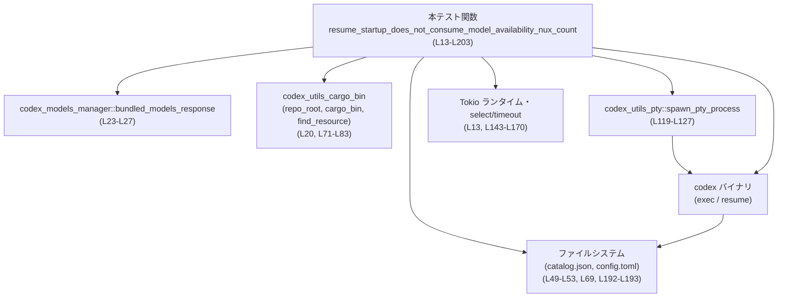

# tui/tests/suite/model_availability_nux.rs コード解説

## 0. ざっくり一言

TUI の「モデル利用開始案内 (model availability NUX)」カウンタが、`codex resume` の起動直後に中断しただけでは減らないことを、実際の `codex` バイナリを疑似端末 (PTY) 上で動かして検証する非同期統合テストです  
（`resume_startup_does_not_consume_model_availability_nux_count` テスト、`tui/tests/suite/model_availability_nux.rs:L13-L203`）。

※ 行番号は、このチャンク先頭行を 1 として数えた概算です。

---

## 1. このモジュールの役割

### 1.1 概要

- このテストモジュールは、「TUI の `model_availability_nux` カウンタが、TUI 起動中の `resume` 操作を割り込みで中断しただけでは消費されないこと」を検証するために存在します。
- 具体的には、一時的な `CODEX_HOME` ディレクトリとカスタムモデルカタログ・設定ファイルを用意し、`codex exec` でレジューム用セッションを作成した後、`codex resume --last` を PTY 上で起動し、起動直後に `Ctrl-C` を送り中断させた後でも、`tui.model_availability_nux.<model_slug>` が `1` のままであることを確認します（`tui/tests/suite/model_availability_nux.rs:L20-L21, L57-L69, L85-L101, L192-L201`）。

### 1.2 アーキテクチャ内での位置づけ

このテストは、以下のコンポーネントと連携して動作します。

- `codex_models_manager::bundled_models_response`  
  → 同梱モデルカタログの JSON を取得し、テスト用に `availability_nux` フィールドを書き換える（`L23-L47`）。
- `codex_utils_cargo_bin`  
  → リポジトリルートや `codex` バイナリのパス、SSE フィクスチャのパスを解決する（`L20, L71-L83`）。
- `codex_utils_pty::spawn_pty_process`  
  → `codex resume` を PTY 上で起動し、標準出力・エラー・終了コードを非同期に扱う（`L119-L127, L129-L138`）。
- Tokio ランタイム (`#[tokio::test]`, `tokio::select!`, `timeout`, `sleep`)  
  → 非同期テスト・複数チャネルの監視・タイムアウト制御に使用（`L13, L143-L170`）。
- ファイルシステム (`std::fs`)  
  → テスト用カタログ (`catalog.json`) と設定 (`config.toml`) の読み書きに使用（`L49-L53, L69, L192-L193`）。
- 実際の `codex` バイナリ  
  → CLI/TUI の実装をブラックボックスとして起動し、設定書き換えや TUI の起動挙動を実際に行わせる（`L73-L83, L85-L101, L119-L127`）。

依存関係を簡略化すると次のようになります。



この図は、本ファイル `tui/tests/suite/model_availability_nux.rs` の行 `L13-L203` に対応する依存関係を表しています。

### 1.3 設計上のポイント

- **実バイナリを使う統合テスト**  
  - `std::process::Command` で `codex exec` を実行し（`L85-L95`）、さらに `codex_utils_pty::spawn_pty_process` で `codex resume` を PTY 上で起動しています（`L119-L127`）。  
  - 実装詳細ではなく、実際の CLI/TUI の振る舞いをブラックボックスとして検証している点が特徴です。
- **一時ディレクトリと環境変数で外部状態を分離**  
  - `tempdir()` で一時的な `CODEX_HOME` を作成し（`L21`）、`CODEX_HOME` 環境変数を設定してテスト専用の設定とキャッシュのみが影響するようにしています（`L91, L103-L106`）。
- **非同期 & 並行処理**  
  - `tokio::select!` を使い、`stdout/stderr` の受信とプロセス終了通知 (`exit_rx`) を同時に待ち合わせています（`L145-L166`）。  
  - さらに `tokio::time::timeout` で全体を 15 秒に制限し、テストが無限にブロックしないようにしています（`L143, L168-L169`）。
- **TTY 対話の自動化**  
  - TUI から送られてくるカーソル位置問い合わせ (`ESC [ 6 n`) を検出し（`L148`）、疑似的な応答 (`ESC [ 1 ; 1 R`) を返しています（`L150`）。  
  - その後、起動完了とみなしたタイミングで `Ctrl-C` (ASCII 3) を複数回送信し、ユーザーによる中断を模倣します（`L154-L159`）。
- **OS やバイナリ有無への配慮**  
  - Windows では PTY が使えないため、即座に `Ok(())` を返してテストをスキップします（`L15-L18`）。  
  - `codex` バイナリが見つからない場合も、エラーメッセージを表示しつつ `Ok(())` でスキップ扱いにしています（`L73-L83`）。

---

## 2. 主要な機能一覧

このファイルが提供する主要な機能（＝テストシナリオ）は 1 つです。

- `resume_startup_does_not_consume_model_availability_nux_count`:  
  - 一時的なモデルカタログと設定ファイルを作成し、特定のモデルの `tui.model_availability_nux` カウンタを `1` に設定する（`L23-L47, L57-L69`）。
  - `codex exec` で「レジューム対象のセッション」を作成する（`L85-L101`）。
  - PTY 上で `codex resume --last` を起動し、カーソル位置問い合わせに応答した直後に `Ctrl-C` を複数回送って起動を中断する（`L119-L127, L143-L161`）。
  - プロセスの終了コードと出力を検証しつつ（`L171-L190`）、`config.toml` 内の `tui.model_availability_nux.<model_slug>` が `1` のままであることを確認する（`L192-L201`）。

---

## 3. 公開 API と詳細解説

### 3.1 型一覧（構造体・列挙体など）

このファイル内で **新たに定義される構造体・列挙体・型エイリアスはありません**。  
ここでは、テストで重要な役割を持つ外部型のみを整理します。

| 名前 | 種別 | 定義元（推測を含む） | 役割 / 用途 | 根拠 |
|------|------|----------------------|-------------|------|
| `JsonValue` | 型エイリアス (`serde_json::Value`) | `serde_json` クレート | モデルカタログ JSON 全体を可変な値として扱うために使用されます（`source_catalog` 変数）。 | `tui/tests/suite/model_availability_nux.rs:L23-L27` |
| `HashMap<String, String>` | 標準ライブラリのコレクション | `std::collections::HashMap` | `spawn_pty_process` に渡す環境変数マップとして使用されます。 | `tui/tests/suite/model_availability_nux.rs:L102-L107, L119-L125` |
| `codex_utils_pty::SpawnedProcess` | 構造体（外部） | `codex_utils_pty` クレート | PTY 上で起動した `codex` プロセスに対するハンドルであり、セッション (`session`) と `stdout_rx` / `stderr_rx` / `exit_rx` の各チャネルを保持します。 | 構造体パターンによる分解 `SpawnedProcess { session, stdout_rx, stderr_rx, exit_rx }` から（`L129-L135`） |
| `tokio::sync::broadcast::Receiver<_>` 系 | 受信チャネル型（外部） | `tokio` クレート | `stdout_rx`, `stderr_rx`, `exit_rx` の具体的な型はこのチャンクでは定義されていませんが、`tokio::sync::broadcast::error::RecvError` でエラーを処理していることから、ブロードキャストチャネルの受信側であると推測されます（推測である旨を明示）。 | `tui/tests/suite/model_availability_nux.rs:L145-L147, L162-L163` |

> 注: `SpawnedProcess` およびチャネルの正確な定義はこのファイルには現れず、ここでの説明にはフィールド名と利用方法に基づく推測が含まれています。

### 関数インベントリー

このファイルで定義される関数は 1 つです。

| 名前 | 種別 | 戻り値 | 説明 | 根拠 |
|------|------|--------|------|------|
| `resume_startup_does_not_consume_model_availability_nux_count` | 非同期テスト関数 (`#[tokio::test]`) | `anyhow::Result<()>` | `codex resume` の起動直後に中断しても、`tui.model_availability_nux.<model_slug>` カウンタが 1 のまま維持されることを検証する統合テストです。 | `tui/tests/suite/model_availability_nux.rs:L13-L203` |

### 3.2 関数詳細

#### `resume_startup_does_not_consume_model_availability_nux_count() -> Result<()>`

**概要**

- Tokio の非同期テストとして実行される関数です（`#[tokio::test]`、`L13`）。
- 独自のモデルカタログと設定ファイルを用意し、`codex exec` と `codex resume` を使って実際の TUI の挙動をドライブし、`model_availability_nux` カウンタの値が変化しないことを検証します（`L20-L21, L23-L47, L57-L69, L85-L101, L192-L201`）。

**引数**

- 引数はありません。テストランナーから直接呼び出されます（`L13-L14`）。

**戻り値**

- 戻り値型は `anyhow::Result<()>` です（`L14`）。
  - `Ok(())` を返す場合: テストが成功または「条件未満 (Windows / バイナリ無し) によるスキップ扱い」で終了します（`L17, L81-L82, L201-L203`）。
  - `Err(anyhow::Error)` を返す場合: テストランナーはテスト失敗として扱います。  
    エラーは `?` や `anyhow::ensure!` / `anyhow::bail!` / `context` によって生成されます（`L20-L21, L23-L27, L33-L41, L49-L53, L85-L101, L143-L177, L187-L190, L192-L199`）。

**内部処理の流れ（アルゴリズム）**

1. **環境依存のスキップ判定**  
   - Windows では PTY ベースの CLI 実行が困難なため、`cfg!(windows)` で判定し、`Ok(())` を返して早期終了します（`L15-L18`）。

2. **一時ディレクトリとモデルカタログの準備**  
   - リポジトリルート (`repo_root`) と一時 `CODEX_HOME` (`codex_home`) を取得します（`L20-L21`）。
   - `bundled_models_response()` を JSON に変換し（`L23`）、`"models"` 配列を取得します。存在しない場合はエラーにします（`L24-L27`）。
   - すべてのモデルから既存の `"availability_nux"` フィールドを削除し（`L28-L31`）、1 つ目のモデルの `slug` を取り出して `model_slug` として保存します（`L33-L41`）。
   - そのモデルに `"availability_nux": { "message": "Model now available" }` を挿入します（`L42-L47`）。
   - 生成したカタログを `catalog.json` として `CODEX_HOME` 直下に書き出します（`L49-L53`）。

3. **config.toml の生成**  
   - `model`, `model_provider`, `model_catalog_json`、および `[projects."<repo_root>"]` セクションを含む設定文字列を `format!` で構築します（`L55-L67`）。
   - `[tui.model_availability_nux]` テーブルに `"{model_slug}" = 1` を設定し、このテストの初期状態として NUX カウンタが 1 であることを保証します（`L65-L66`）。
   - 生成した文字列を `config.toml` として `CODEX_HOME` に書き出します（`L69`）。

4. **`codex` バイナリの特定とレジューム用セッションの作成**  
   - SSE フィクスチャファイル (`../core/tests/cli_responses_fixture.sse`) のパスを取得します（`L71-L72`）。
   - `codex_utils_cargo_bin::cargo_bin("codex")` でバイナリパスを探し、失敗した場合はワークスペース内の `codex-rs/target/debug/codex` をフォールバックとして確認します（`L73-L78`）。
   - いずれのパスも存在しない場合は `stderr` にメッセージを出力し、テストを `Ok(())` でスキップします（`L80-L81`）。
   - 見つかった `codex` に対して `exec --skip-git-repo-check -C <repo_root> "seed session for resume"` を実行し、`CODEX_HOME`, `OPENAI_API_KEY=dummy`, `CODEX_RS_SSE_FIXTURE` を環境変数として渡します（`L85-L93`）。
   - `exec_output.status.success()` をチェックし、失敗時は `stderr` を含めて `Err` を返します（`L96-L100`）。

5. **PTY 上での `codex resume` 起動と対話**  
   - `HashMap<String, String>` に `CODEX_HOME` とダミーの `OPENAI_API_KEY` を設定し、`spawn_pty_process` に渡す環境を構築します（`L102-L107, L119-L125`）。
   - 引数 `["resume", "--last", "--no-alt-screen", "-C", <repo_root>, "-c", "analytics.enabled=false"]` を準備します（`L109-L117`）。
   - `codex_utils_pty::spawn_pty_process` で PTY 上に `codex resume` プロセスを起動し、セッションハンドルと出力/終了コードチャネルを受け取ります（`L119-L127, L129-L135`）。
   - 出力を蓄積する `output: Vec<u8>` を用意し（`L129`）、`stdout` と `stderr` の両チャネルを `combine_output_receivers` でまとめます（`L136`）。
   - `writer_tx`（プロセスへの入力チャネル）とそのクローン `interrupt_writer` を取得し（`L138-L139`）、`startup_ready` と `answered_cursor_query` のフラグを初期化します（`L140-L141`）。

6. **非同期ループによる起動完了待ちと割り込み送信**  
   - `tokio::time::timeout(Duration::from_secs(15), async { ... })` で 15 秒間のタイムアウト付きループを開始します（`L143-L144, L168-L169`）。
   - `tokio::select!` で以下を同時に待ち受けます（`L145-L166`）。
     - `output_rx.recv()` で出力チャンクを受信した場合（`L146-L147`）:
       - `chunk.windows(4).any(|window| window == b"\x1b[6n")` により、カーソル位置問い合わせ (`ESC [ 6 n`) を検出します（`L148`）。
       - 問い合わせがあれば `writer_tx` 経由で `b"\x1b[1;1R"` を送り、カーソル位置応答を模倣し、`answered_cursor_query = true` にします（`L149-L151`）。
       - 受信チャンクを `output` に追加します（`L153`）。
       - `startup_ready` がまだ `false` で、かつカーソルクエリに既に応答済み (`answered_cursor_query == true`) で、今回のチャンクにクエリが含まれていない場合（＝クエリ応答後の最初の通常出力とみなせる）には（`L154-L155`）:
         - `startup_ready = true` とし（`L155`）、ループで 4 回 `interrupt_writer.send(vec![3])` を行い、その都度 500ms スリープします（`L156-L159`）。  
           これはユーザーが `Ctrl-C` を連打して TUI を中断した状況を模倣します。
     - `output_rx` から `RecvError::Closed` を受け取った場合:
       - すべての出力チャネルが閉じたと判断し、`exit_rx.await` で終了コードを待ってからループを抜けます（`L162`）。
     - `RecvError::Lagged(_)` の場合:
       - バッファあふれ等により一部出力を読み損ねたケースですが、テストでは特に処理せず無視します（`L163`）。
     - `exit_rx` から結果を受信した場合:
       - その結果（おそらく `Result<i32, _>` 型）を返してループを抜けます（`L165`）。

7. **終了コードと出力の検証 & `config.toml` 読み出し**  
   - タイムアウト付き実行の結果 `exit_code_result` を `match` で分岐し（`L171-L178`）:
     - `Ok(Ok(code))` の場合: 正常に終了コード `code` を受け取ったとみなし、`exit_code` として扱います（`L171-L172`）。
     - `Ok(Err(err))` の場合: `exit_rx` 経由で何らかのエラーが発生したので、そのまま `Err(err.into())` を返してテスト失敗とします（`L173`）。
     - `Err(_)` の場合: 15 秒以内に完了しなかったため、`session.terminate()` でプロセスを終了させた上で `anyhow::bail!("timed out waiting for codex resume to exit")` によってエラーを返します（`L174-L177`）。
   - 蓄積した `output` を UTF-8 として解釈し (`String::from_utf8_lossy`)、`output_text` とします（`L179`）。
   - `interrupt_only_output` フラグを計算します（`L180-L186`）。
     - `output_text.trim()` が空でなく（`L181-182`）、全ての文字が `'^'` または `'C'` または空白 (`is_whitespace`) の場合に `true` となります（`L183-L185`）。  
       これは TUI が `Ctrl-C` に応答して `^C` のみを出力したケースを表現しています。
   - 許容される終了コードは以下のいずれかとし、それ以外では `anyhow::ensure!` でエラーにします（`L187-L190`）。
     - `exit_code == 0`: 正常終了。
     - `exit_code == 130`: 一般的に `SIGINT` に対応する終了コード。
     - `exit_code == 1 && interrupt_only_output == true`: 出力が `^C` だけである場合には、コード `1` も許容。
   - 最後に `config.toml` を読み出して `toml::Value` としてパースし（`L192-L193`）、`config["tui"]["model_availability_nux"][model_slug].as_integer()` で NUX カウンタを取り出します（`L194-L199`）。
     - 対象パスが見つからない場合は `context("missing tui.model_availability_nux count")` によってエラーを返します。
   - `assert_eq!(shown_count, 1)` によって、NUX カウンタが 1 のままであることを検証します（`L201`）。  
     これが満たされない場合、テストはパニックして失敗します。

**Examples（使用例）**

この関数自体はテスト関数であり、外部から直接呼び出すことはありませんが、同様のパターンで TUI/CLI を統合テストするための簡略例を示します。

```rust
// 簡略化した PTY 統合テストの例（擬似コード。実際の型やモジュールはこのリポジトリとは異なる可能性があります）
#[tokio::test]
async fn simple_tui_integration_test() -> anyhow::Result<()> {
    // 一時ディレクトリや環境変数を準備する                   // グローバル設定に影響しないように isolate
    let home = tempfile::tempdir()?;
    let mut env = std::collections::HashMap::new();
    env.insert("APP_HOME".into(), home.path().display().to_string());

    // TUI アプリを PTY 上で起動する                           // spawn_pty_process に相当するユーティリティを想定
    let spawned = my_pty_utils::spawn_pty_process(
        "my_app",
        &["tui"],
        std::env::current_dir()?,
        &env,
    ).await?;

    let my_pty_utils::SpawnedProcess { session, mut stdout_rx, mut exit_rx } = spawned;

    // 出力を読みつつ、必要なタイミングでキー入力を送る       // 本ファイルの select ループに対応
    let writer = session.writer_sender();
    let exit_code = tokio::time::timeout(std::time::Duration::from_secs(5), async move {
        loop {
            tokio::select! {
                Ok(chunk) = stdout_rx.recv() => {
                    // ここで出力を解析し、適宜 writer.send(...) でキーを送る
                    println!("TUI output: {:?}", String::from_utf8_lossy(&chunk));
                }
                result = &mut exit_rx => break result, // 終了コードを取得して抜ける
            }
        }
    }).await??;

    assert_eq!(exit_code, 0);
    Ok(())
}
```

この例は、本テストの `spawn_pty_process` + `select!` + `timeout` のパターンを簡略化したものです。

**Errors / Panics**

このテスト関数が `Err` またはパニックで失敗する代表的な条件は次の通りです。

- **即時スキップ以外の前段階での失敗**  
  - `repo_root` 取得失敗（`L20`）。  
  - 一時ディレクトリ作成失敗（`L21`）。  
  - `bundled_models_response()` の失敗、JSON 変換失敗、`models` 配列欠如・空配列・`first_model` がオブジェクトでない・`slug` が存在しない等（`L23-L41`）。
  - `catalog.json` や `config.toml` の書き込み失敗（`L49-L53, L69`）。
- **codex 実行関連の失敗**  
  - `find_resource!` マクロによる SSE フィクスチャの解決失敗（`L71-L72`）。  
  - `codex exec` の起動失敗や異常終了 (`status.success() == false`)（`L85-L101`）。
  - `spawn_pty_process` の失敗（`L119-L127`）。
- **非同期ループ内での失敗**  
  - `exit_rx` がエラー (`Err(err)`) を返した場合（`L173`）。  
  - 15 秒以内に `codex resume` が終了せず、`timeout` が発火した場合（`L174-L177`）。
- **終了コード・出力検証の失敗**  
  - `exit_code` が `0` でも `130` でもなく、かつ `exit_code == 1 && interrupt_only_output` を満たさない場合（`L187-L190`）。
- **config.toml 検証の失敗**  
  - `tui.model_availability_nux.<model_slug>` エントリが存在しない、または整数としてパースできない場合（`L194-L199`）。  
  - `shown_count != 1` の場合、`assert_eq!` によりパニックします（`L201`）。

**Edge cases（エッジケース）**

- **Windows 環境**  
  - `cfg!(windows)` が真の場合、テストは即座に `Ok(())` を返し、何も検証しません（`L15-L18`）。  
    → Windows ではこのテストが「カバーしない」領域が存在します。
- **`codex` バイナリが見つからない**  
  - `cargo_bin("codex")` が失敗し、フォールバックパス (`codex-rs/target/debug/codex`) にもファイルがない場合、メッセージを出力して `Ok(())` を返します（`L73-L83`）。  
    → テストはスキップ扱いとなり、NUX カウンタの検証は行われません。
- **出力チャネルの `Lagged` エラー**  
  - `tokio::sync::broadcast::error::RecvError::Lagged(_)` は明示的に無視されています（`L163`）。  
    → 出力の一部を読み損ねても、テストは継続します。起動＋割り込みという観点では、一定のロバスト性がある一方で、出力に依存した精密な検証には向いていません。
- **終了コード 1 の扱い**  
  - 終了コードが 1 であっても、出力が `^C` だけの場合は許容されます（`L180-L186, L187-L190`）。  
    → TUI が「ユーザーによる中断」として非ゼロコード 1 を返す実装を許容するための条件分岐と考えられます（コードからの推測であり、実装詳細はこのチャンクには現れません）。
- **カーソルクエリが来ない場合**  
  - `chunk` に `b"\x1b[6n"` が含まれないままプロセスが終了した場合、`startup_ready` は `false` のままです（`L148-L155`）。  
    - この場合でも、タイムアウトしなければ終了コードの検証および `config.toml` 検証に進みます。  
    - `Ctrl-C` を送る部分は実行されないため、「NUX カウンタを消費しないまま正常終了する」というパスもテストがカバーしている形になります。

**使用上の注意点**

- **テストハング防止**  
  - `timeout(Duration::from_secs(15), ...)` を必ず通している点から、外部プロセスとの対話ではタイムアウトを設定することが重要であることが読み取れます（`L143, L168-L169`）。
- **TTY プロトコルへの依存**  
  - カーソル位置問い合わせ `ESC [ 6 n` と応答 `ESC [ 1 ; 1 R` は ANSI エスケープシーケンスに基づいています（`L148-L151`）。  
    これに依存したテストであるため、TUI 実装が異なるシーケンスを使うように変わった場合にはテストも更新が必要です。
- **実環境への影響**  
  - `CODEX_HOME` を一時ディレクトリに固定しているため、ユーザーの実際の設定ディレクトリに影響しない設計になっています（`L21, L90-L91, L103-L106`）。  
  - `OPENAI_API_KEY` に `"dummy"` を指定し、`CODEX_RS_SSE_FIXTURE` によって SSE 応答をモックしているため、実際の外部 API へのリクエストは行われない設計になっています（`L91-L93`）。

### 3.3 その他の関数

- このファイル内で定義されている関数は、上記のテスト関数のみです。  
  補助関数やラッパー関数は定義されていません。

---

## 4. データフロー

このテスト全体の代表的なデータフロー（設定生成 → codex 実行 → config 検証）を、時系列で示します。

```mermaid
sequenceDiagram
    participant Test as テスト関数<br/>resume_startup_... (L13-L203)
    participant Models as bundled_models_response (L23)
    participant FS as ファイルシステム<br/>catalog.json, config.toml (L49-L53, L69, L192-L193)
    participant CodexExec as codex exec<br/>"seed session for resume" (L85-L101)
    participant Pty as spawn_pty_process<br/>(L119-L127)
    participant CodexResume as codex resume --last (外部バイナリ)
    
    Test->>Models: モデルカタログ JSON を取得 (L23-L27)
    Models-->>Test: JSON Value (models 配列)
    Test->>Test: models 配列を書き換え<br/>availability_nux を再設定 (L28-L47)
    Test->>FS: catalog.json を書き出し (L49-L53)
    Test->>FS: config.toml を書き出し (L57-L69)

    Test->>CodexExec: codex exec ... "seed session for resume"<br/>環境変数: CODEX_HOME, OPENAI_API_KEY, FIXTURE (L85-L93)
    CodexExec-->>FS: セッション情報を保存（詳細は外部実装、推測） 

    Test->>Pty: spawn_pty_process(codex, ["resume", "--last", ...], env) (L119-L127)
    Pty->>CodexResume: codex resume --last を PTY 上で起動
    CodexResume-->>Pty: stdout/stderr 出力 (カーソルクエリ含む) (L145-L147)
    Pty-->>Test: 出力チャンクを output_rx 経由で送信 (L145-L147)
    Test->>Pty: カーソル位置応答 ESC[1;1R を送信 (L148-L151)
    Test->>Pty: Ctrl-C (0x03) を複数回送信 (L154-L159)
    CodexResume-->>Pty: 終了コードを exit_rx に送信 (L162-L166)
    Pty-->>Test: exit_rx 経由で終了コードを返す (L171-L172)

    Test->>FS: config.toml を読み出し (L192-L193)
    Test->>Test: tui.model_availability_nux.<slug> を取得して検証 (L194-L201)
```

このシーケンス図は、`tui/tests/suite/model_availability_nux.rs:L13-L201` の処理の流れに対応しています。

要点:

- テストは一切の既存ユーザーデータに触れず、FS 上の一時領域 (`tempdir`) のみを使用します（`L21, L49-L53, L69, L192-L193`）。
- `codex exec` と `codex resume` の間でセッション状態がどのように受け渡されるかは、このファイルには現れませんが、ファイルシステム経由のやり取りが行われる前提でテストが組まれています（セッション名 `"seed session for resume"`、`L90` からの推測）。
- `codex resume` の挙動は TUI 本体の実装に依存しますが、テストは「起動直後に Ctrl-C による中断を行った場合の設定ファイルの変化」にフォーカスしています。

---

## 5. 使い方（How to Use）

このファイルはテスト専用ですが、「CLI/TUI を外部プロセスとして起動し、PTY を通じて対話しながら設定ファイルの変化を検証する」パターンの参考になります。

### 5.1 基本的な使用方法

- Rust の通常のテストと同様、このファイルは `tests/` ディレクトリ配下に置かれているため、`cargo test` によって他のテストとともに実行される想定です（パスからの一般的な推測。具体的なテストターゲット名はこのチャンクには現れません）。
- 外部から関数を呼び出すのではなく、テストランナーが `#[tokio::test]` 付き関数を直接実行します（`L13-L14`）。

### 5.2 よくある使用パターン

このテストパターンを応用して、他の CLI/TUI 機能を検証する際に利用できる要素を整理します。

1. **一時的なホームディレクトリと設定ファイルの構築**

    - `tempdir()` で一時的なホームディレクトリを作成し（`L21`）、その配下に設定ファイルを書き込む（`L49-L53, L69`）。
    - 対象アプリには環境変数 (`CODEX_HOME` 相当) でそのパスを伝える（`L87-L92, L102-L106`）。

2. **実バイナリの起動前に初期状態を整える**

    - 必要な初期状態（セッションファイルなど）を別のサブコマンドで準備する。  
      → 本テストでは `codex exec ... "seed session for resume"` がそれに当たります（`L85-L101`）。

3. **PTY を利用した対話的 CLI/TUI の自動制御**

    - `spawn_pty_process` のようなユーティリティで PTY 上にプロセスを起動し、標準入出力と終了コードを非同期チャネル経由で扱います（`L119-L127, L129-L137`）。
    - `tokio::select!` で「出力の読み取り」と「終了コードの受信」を同時に待つパターンは、外部プロセスの統合テストでは一般的です（`L145-L166`）。

4. **タイムアウトと複数の許容終了コード**

    - `timeout` でテストの最大実行時間を制御し（`L143, L168-L169`）、プロセスがハングした場合にもテスト全体が止まらないようにしています。
    - 正常終了 (`0`) だけでなく、ユーザー中断 (`130` や `1` with `^C` only) も許容するロジックは、インタラクティブなアプリケーションのテストにおいて有用なパターンです（`L187-L190`）。

### 5.3 よくある間違い

このテストの実装から想定される「誤用パターン」と、その修正版を示します。

```rust
// 誤り例: PTY 上のプロセスを起動したが、タイムアウトを設けていない
async fn wrong_no_timeout() -> anyhow::Result<()> {
    let spawned = codex_utils_pty::spawn_pty_process(
        "codex",
        &["resume", "--last"],
        &std::env::current_dir()?,
        &std::collections::HashMap::new(),
        &None,
        codex_utils_pty::TerminalSize::default(),
    ).await?;

    let codex_utils_pty::SpawnedProcess { mut stdout_rx, mut exit_rx, .. } = spawned;

    // どちらかが来るまで待つが、タイムアウト無しなのでハングし得る
    tokio::select! {
        _ = stdout_rx.recv() => { /* ... */ }
        result = &mut exit_rx => { println!("exit: {:?}", result); }
    }

    Ok(())
}

// 正しい例: 本テストと同様、timeout で全体の実行時間を制限する
async fn correct_with_timeout() -> anyhow::Result<()> {
    let spawned = codex_utils_pty::spawn_pty_process(
        "codex",
        &["resume", "--last"],
        &std::env::current_dir()?,
        &std::collections::HashMap::new(),
        &None,
        codex_utils_pty::TerminalSize::default(),
    ).await?;

    let codex_utils_pty::SpawnedProcess { mut stdout_rx, mut exit_rx, .. } = spawned;

    let exit_code_result = tokio::time::timeout(std::time::Duration::from_secs(15), async move {
        loop {
            tokio::select! {
                result = stdout_rx.recv() => {
                    if let Ok(chunk) = result {
                        println!("output: {:?}", String::from_utf8_lossy(&chunk));
                    }
                }
                result = &mut exit_rx => break result,
            }
        }
    }).await;

    // timeout の結果を評価してエラーにするかどうかを決める
    match exit_code_result {
        Ok(Ok(code)) => println!("exit code: {}", code),
        Ok(Err(e)) => return Err(e.into()),
        Err(_) => anyhow::bail!("timed out waiting for process to exit"),
    }

    Ok(())
}
```

### 5.4 使用上の注意点（まとめ）

- **OS 依存性**  
  - Windows ではテストがスキップされるため、Windows 固有の挙動はこのテストでは保証されません（`L15-L18`）。
- **外部バイナリへの依存**  
  - `codex` バイナリが見つからない場合もスキップとなるため、CI やローカル環境でこのテストを有効にするには、`cargo_bin("codex")` または `codex-rs/target/debug/codex` のどちらかが存在するようにビルドされている必要があります（`L73-L83`）。
- **テストの再現性**  
  - 外部 API ではなく SSE フィクスチャ (`CODEX_RS_SSE_FIXTURE`) を使っているため、ネットワーク環境に左右されない再現性の高いテストになっています（`L71-L72, L93`）。
- **設定パスの固定**  
  - `tui.model_availability_nux.<model_slug>` という設定パスに依存しているため、実装側でこのパスや意味が変わった場合、テストも更新が必要です（`L194-L199`）。

---

## 6. 変更の仕方（How to Modify）

### 6.1 新しい機能を追加する場合

ここでは、「別の NUX カウンタや TUI 動作を追加でテストしたい」場合を想定した変更の入口を整理します。

1. **モデルカタログの準備ロジックを拡張する**  
   - 新しい NUX 対象が特定のモデルにのみ適用される場合、本ファイルの `source_catalog` 編集部分（`L23-L47`）を参考に、対象モデルを選び追加のフィールドを挿入できます。
   - 別の `availability_nux` フィールドやフラグをテストしたい場合は、この部分に新しいキーを書き加えるのが自然です。

2. **`config.toml` の初期状態を調整する**  
   - 新しい設定キーの初期値をテストしたい場合は、`config_contents` のフォーマット文字列（`L57-L67`）に新しい `[tui.<section>]` やキーを追加します。
   - 追加した設定キーに対する検証コードは、末尾の `config` パース部分（`L192-L201`）をコピー・変更する形で追記すると分かりやすくなります。

3. **TUI の別の操作フローをテストする**  
   - `args` ベクタ（`L109-L117`）に別のサブコマンドやフラグを渡すことで、他の TUI サブコマンド (`run`, `new` など) の起動をテストできます。  
     （どのサブコマンドが存在するかはこのチャンクには現れないため、具体的な名前はここでは述べません。）
   - カーソルクエリの代わりに別の出力やプロンプトを待ち受けるロジックへ変更する場合は、`chunk` のパターンマッチ部分（`L148-L155`）を書き換えることになります。

### 6.2 既存の機能を変更する場合

変更前に確認すべき契約や影響範囲を整理します。

- **設定パスや意味の変更**  
  - 実装側で `tui.model_availability_nux.<slug>` の意味が変わる、または別の場所に移動する場合は、末尾の TOML アクセス部分（`L194-L199`）が前提としている構造を更新する必要があります。
  - このテストは「起動中断でカウンタが減らない」ことを前提としているため、仕様変更によりこの前提が変わる場合には、`assert_eq!(shown_count, 1)` のロジックや期待値を見直す必要があります（`L201`）。

- **TUI の起動シーケンス変更**  
  - カーソル位置問い合わせ (`ESC [ 6 n`) の有無やタイミングが変わると、`startup_ready` が `true` になる条件（`L148-L155`）が満たされなくなる可能性があります。
  - もし TUI がカーソル問い合わせを行わないように変わった場合には、起動完了を検知する別のシグナル（特定の文言の出力など）を `chunk` 解析に追加する必要があります。

- **終了コードポリシーの変更**  
  - TUI が `Ctrl-C` に対して常に `130` を返すように変わった・あるいは常に `1` を返すようになった場合など、終了コードポリシーの変更に応じて `anyhow::ensure!` の条件（`L187-L190`）を更新する必要があります。
  - 新しい終了コードを許容する場合も、この箇所に条件を追加するのが自然です。

- **外部ユーティリティの API 変更**  
  - `codex_utils_pty::spawn_pty_process` や `combine_output_receivers` のシグネチャが変更された場合は、呼び出し部分（`L119-L127, L129-L137`）を対応させる必要があります。  
    具体的なシグネチャはこのチャンクには現れないため、実装側の定義を確認する必要があります。

---

## 7. 関連ファイル

このモジュールと密接に関係するファイル・ライブラリを一覧にします（パスが文字列リテラルで現れているもの、および明示的に `use` されているクレートのみ記載します）。

| パス / クレート | 役割 / 関係 | 根拠 |
|-----------------|------------|------|
| `../core/tests/cli_responses_fixture.sse` | `codex exec` / `codex resume` が受け取る SSE 応答をモックするためのフィクスチャファイル。`CODEX_RS_SSE_FIXTURE` 環境変数として渡されます。 | `tui/tests/suite/model_availability_nux.rs:L71-L72, L93` |
| `codex_models_manager` クレート | `bundled_models_response()` により、同梱モデル一覧を取得し、テスト用に `availability_nux` フィールドを加工する役割を担います。 | `tui/tests/suite/model_availability_nux.rs:L6, L23-L27` |
| `codex_utils_cargo_bin` クレート | リポジトリルート `repo_root()`、`codex` バイナリパス `cargo_bin("codex")`、フィクスチャパス `find_resource!` など、テストからビルド成果物・リソースにアクセスするためのユーティリティを提供します。 | `tui/tests/suite/model_availability_nux.rs:L20, L71-L83` |
| `codex_utils_pty` クレート | `spawn_pty_process` や `combine_output_receivers`、`TerminalSize`、`SpawnedProcess` など、PTY 上で外部プロセスを起動し非同期に制御するためのユーティリティを提供します。 | `tui/tests/suite/model_availability_nux.rs:L119-L127, L129-L137` |
| `anyhow` クレート | テスト全体でのエラー伝播 (`Result<()>`) と文脈付きエラーメッセージ (`context`, `ensure!`, `bail!`) を担います。 | `tui/tests/suite/model_availability_nux.rs:L4-L5, L27, L33-L41, L49-L53, L85-L101, L143-L177, L187-L190, L192-L199` |
| `serde_json` クレート | モデルカタログ構造体を JSON (`JsonValue`) にシリアライズし、部分的に書き換えるために使用されます。`json!` マクロも含みます。 | `tui/tests/suite/model_availability_nux.rs:L7, L23-L27, L42-L47` |
| `toml` クレート | `config.toml` を `toml::Value` としてパースし、`tui.model_availability_nux.<model_slug>` を読み取るために使用されます。 | `tui/tests/suite/model_availability_nux.rs:L193-L199` |

これらの関連ファイル・クレートの実装詳細はこのチャンクには含まれていませんが、本テストの振る舞いを理解するうえで前提となるコンポーネントです。
