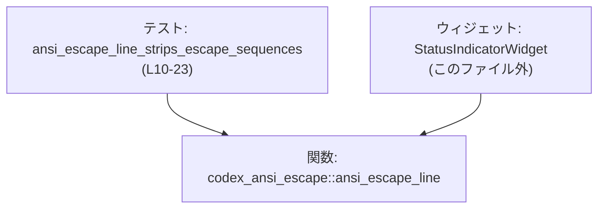

# tui/tests/suite/status_indicator.rs コード解説

## 0. ざっくり一言

このファイルは、`codex_ansi_escape::ansi_escape_line` が ANSI エスケープシーケンスを取り除き、バックバッファに生の `\x1b` バイトが書き込まれないことを確認する回帰テストです。  
その結果として、この関数に依存している `StatusIndicatorWidget` が安全な文字列を扱えることを保証しています（コメントより）  
（根拠: `//! Regression test ...` コメント  
`tui/tests/suite/status_indicator.rs:L1-5`）

---

## 1. このモジュールの役割

### 1.1 概要

- このテストモジュールは、TUI ウィジェット `StatusIndicatorWidget` が内部的に利用している `ansi_escape_line()` の「公開契約（public contract）」を検証するために存在します。  
  （根拠: 「we verify the *public* contract of `ansi_escape_line()` which the widget now relies on.」  
  `tui/tests/suite/status_indicator.rs:L3-5`）
- 具体的には、ANSI エスケープ付き文字列 `"\x1b[31mRED\x1b[0m"` を与えたときに、戻り値の `line.spans` を結合すると `"RED"` だけが残り、`'\x1b'` を含まないことを確認します。  
  （根拠: テスト本体  
  `tui/tests/suite/status_indicator.rs:L11-21, L23`）

### 1.2 アーキテクチャ内での位置づけ

このファイルは **テスト層** に属し、アプリケーション本体ではなく、以下の依存関係を持つ構造になっています。

- 直接依存:
  - 外部クレート関数 `codex_ansi_escape::ansi_escape_line`（インポートと呼び出し）  
    （根拠: `use codex_ansi_escape::ansi_escape_line;` と関数呼び出し  
    `tui/tests/suite/status_indicator.rs:L7, L15`）
- 間接対象:
  - コメントで `StatusIndicatorWidget` が `ansi_escape_line()` に依存していると明示されており、このテストはウィジェットのレンダリングロジックを間接的に守る役割を持ちます。  
    （根拠: 「StatusIndicatorWidget ... which the widget now relies on.」  
    `tui/tests/suite/status_indicator.rs:L1-5`）

#### 依存関係図（概略）



- テスト関数は `ansi_escape_line` を直接呼び出します。
- `StatusIndicatorWidget` も `ansi_escape_line` に依存するとコメントで述べられており、このテストはウィジェットのレンダリング仕様の一部（「生の ESC バイトを書かない」）を保証する間接テストになっています。

### 1.3 設計上のポイント

- **公開契約の検証に限定**  
  ウィジェットのレンダリング処理そのものを直接テストせず、それが依存するユーティリティ関数 `ansi_escape_line()` の契約を検証する構造になっています。  
  （根拠: 「Rendering logic is tricky ... therefore we verify the *public* contract of `ansi_escape_line()`」  
  `tui/tests/suite/status_indicator.rs:L3-4`）

- **副作用のない純粋なテスト**  
  入力は文字列リテラル、出力はメモリ内のオブジェクトと文字列で完結しており、ファイルやネットワークなどの外部 I/O は存在しません。  
  （根拠: 関数本体に外部 I/O 呼び出しがない  
  `tui/tests/suite/status_indicator.rs:L10-23`）

- **安全性とバッファ汚染防止への配慮**  
  コメントで「バックバッファに生の `\x1b` バイトが書き込まれないこと」を明示しており、ターミナル制御文字がレンダリングバッファに混入しないことを意図したテストであることが分かります。  
  （根拠: 「so that no raw `\x1b` bytes are written into the backing buffer.」  
  `tui/tests/suite/status_indicator.rs:L2-3`）

- **エラーハンドリング方法**  
  Rust のテストとして `assert_eq!` マクロを用いており、期待値と異なる場合は panic し、テスト失敗として扱われます。  
  （根拠: `assert_eq!(combined, "RED");`  
  `tui/tests/suite/status_indicator.rs:L23`）

---

## 2. 主要な機能一覧

- `ansi_escape_line` の挙動検証: ANSI エスケープ文字列 `"\x1b[31mRED\x1b[0m"` を処理した結果として得られる `line.spans` の内容を結合し、プレーンテキスト `"RED"` のみが残ることを確認するテスト。  
  （根拠: テスト関数本体  
  `tui/tests/suite/status_indicator.rs:L11-21, L23`）

### 2.1 コンポーネント一覧（このチャンク内で定義されるもの）

| 名前 | 種別 | 役割 / 用途 | 定義位置 |
|------|------|-------------|----------|
| `ansi_escape_line_strips_escape_sequences` | テスト関数 | `ansi_escape_line` が ANSI エスケープシーケンスを除去し、結合したテキストが `"RED"` になることを確認する回帰テスト | `tui/tests/suite/status_indicator.rs:L9-23` |

### 2.2 外部依存コンポーネント（このチャンクから参照されるもの）

| 名前 | 種別 | 役割 / 用途 | 使用位置 |
|------|------|-------------|----------|
| `codex_ansi_escape::ansi_escape_line` | 外部関数（別クレート） | ANSI エスケープを含む 1 行分のテキストを解析し、`spans` フィールドを持つ行オブジェクトを返す関数であることが、このファイルから分かります（正確な型名は不明）。 | インポートと呼び出し: `tui/tests/suite/status_indicator.rs:L7, L15` |

---

## 3. 公開 API と詳細解説

### 3.1 型一覧（構造体・列挙体など）

このファイル内では、新たな構造体・列挙体・型エイリアスなどは定義されていません。  
（根拠: コード全体がコメント、`use`、テスト関数のみで構成されている  
`tui/tests/suite/status_indicator.rs:L1-24`）

### 3.2 関数詳細

#### `ansi_escape_line_strips_escape_sequences()`

**概要**

- Rust のテスト関数であり、`codex_ansi_escape::ansi_escape_line` に ANSI カラー付き文字列 `"\x1b[31mRED\x1b[0m"` を渡したとき、戻り値の `line.spans` から取り出した文字列を連結すると `"RED"` だけが残ることを確認します。  
  （根拠: 文字列定義〜assert  
  `tui/tests/suite/status_indicator.rs:L11-21, L23`）

**引数**

このテスト関数は引数を取りません。

| 引数名 | 型 | 説明 |
|--------|----|------|
| なし | - | テスト関数であり、引数はありません。 |

**戻り値**

- 戻り値の型はデフォルトのテスト関数と同じく `()` です。
- 関数内で `assert_eq!` を使っており、期待値と異なる場合は panic し、テスト失敗として報告されます。  
  （根拠: `#[test]` アトリビュートと `assert_eq!` の使用  
  `tui/tests/suite/status_indicator.rs:L9, L23`）

**内部処理の流れ（アルゴリズム）**

1. ANSI カラー付きの文字列を定義します。  
   `let text_in_ansi_red = "\x1b[31mRED\x1b[0m";`  
   （根拠: `tui/tests/suite/status_indicator.rs:L11`）

2. コメントで「戻り値は 3 つの印字可能グリフ（`R`, `E`, `D`）だけを含み、生のエスケープバイトを含まない」ことを期待値として説明します。  
   （根拠: コメント  
   `tui/tests/suite/status_indicator.rs:L13-14`）

3. `ansi_escape_line(text_in_ansi_red)` を呼び出し、`line` というオブジェクトを受け取ります。  
   このオブジェクトは `spans` フィールドを持っていることがコードから分かります。  
   （根拠: 関数呼び出しと `line.spans` アクセス  
   `tui/tests/suite/status_indicator.rs:L15, L17-18`）

4. `line.spans` をイテレートし、各 `span.content` を `to_string()` で `String` に変換し、それらを `collect()` で 1 つの `String` に結合します。  
   （根拠: `spans.iter().map(...).collect()`  
   `tui/tests/suite/status_indicator.rs:L17-21`）

5. 最後に、結合結果 `combined` が `"RED"` と等しいことを `assert_eq!` で検証します。  
   もし ANSI エスケープが残っていれば `"RED"` 以外の文字が混入するため、この比較は失敗します。  
   （根拠: `assert_eq!(combined, "RED");`  
   `tui/tests/suite/status_indicator.rs:L23`）

**処理フロー図**

```mermaid
sequenceDiagram
    participant T as テスト関数<br/>ansi_escape_line_strips_escape_sequences<br/>(L10-23)
    participant F as codex_ansi_escape::ansi_escape_line
    participant L as 戻り値 line（spans フィールド）
    participant S as Span 要素（content フィールド）

    T->>T: text_in_ansi_red = "\\x1b[31mRED\\x1b[0m" を定義 (L11)
    T->>F: ansi_escape_line(text_in_ansi_red) を呼び出し (L15)
    F-->>T: line（spans: Vec&lt;Span&gt; を含むオブジェクト）を返す
    T->>L: line.spans.iter() で Span を反復 (L17-19)
    T->>S: map(|span| span.content.to_string()) (L20)
    T->>T: collect() で combined:String を生成 (L21)
    T->>T: assert_eq!(combined, "RED") で検証 (L23)
```

**Examples（使用例）**

この関数はテストランナー（`cargo test`）から自動的に呼び出されることを想定しています。  
同様のテストを追加する例を示します。

```rust
// 外部クレートから関数をインポートする                         // codex_ansi_escape クレートの関数を使う
use codex_ansi_escape::ansi_escape_line;                         // ansi_escape_line 関数をスコープに持ち込む

#[test]                                                           // テスト関数であることをコンパイラに知らせる
fn ansi_escape_line_strips_escape_sequences() {                   // テスト関数の定義開始
    let text_in_ansi_red = "\x1b[31mRED\x1b[0m";                  // ANSI カラー付きの文字列を定義（赤色で "RED"）

    let line = ansi_escape_line(text_in_ansi_red);                // 関数を呼び出して行オブジェクトを取得

    let combined: String = line                                   // line からテキストだけを取り出して結合する
        .spans                                                    // スパン（部分文字列）配列にアクセス
        .iter()                                                   // 各スパンを順にたどるイテレータを取得
        .map(|span| span.content.to_string())                     // 各スパンの content を String に変換
        .collect();                                               // すべてのスパンを連結して 1 つの String にする

    assert_eq!(combined, "RED");                                  // 期待どおり "RED" だけが残っていることを検証
}
```

このテスト関数は、`cargo test ansi_escape_line_strips_escape_sequences` などで個別実行が可能です。

**Errors / Panics**

- `ansi_escape_line_strips_escape_sequences` 自身は `Result` を返しません。
- 期待値と実際の値が異なる場合、`assert_eq!` によって panic が発生し、テストが失敗します。  
  （根拠: `assert_eq!(combined, "RED");`  
  `tui/tests/suite/status_indicator.rs:L23`）
- `ansi_escape_line` が panic する可能性については、このファイルだけでは判断できません（内部実装が不明なため）。

**Edge cases（エッジケース）**

このテスト関数がカバーしている・していないケースは以下の通りです。

- カバーしているケース:
  - 前後を ANSI エスケープシーケンスで囲まれた単純なテキスト `"RED"`。  
    （根拠: 入力文字列の内容  
    `tui/tests/suite/status_indicator.rs:L11`）
- カバーしていないケース（このテストからは動作不明）:
  - 空文字列や、ANSI エスケープを含まない純粋なテキスト。
  - 複数色・複数属性が混在する長い文字列。
  - 部分的に壊れた（不完全な）エスケープシーケンス。
  - 行中に `\x1b` がデータとして含まれる（意図的な ESC 文字）場合の扱い。

これらの入力に対する `ansi_escape_line` の挙動は、このファイルには現れていません。

**使用上の注意点**

- この関数はテスト専用であり、アプリケーションから直接呼び出すことは想定されていません。
- `ansi_escape_line` の仕様が変わり、例えば「一部のエスケープシーケンスを残す」ようになった場合、このテストは失敗するようになります。その場合は、仕様変更が妥当かを確認した上でテストを更新する必要があります。
- テストは単一の入力パターンしかチェックしていないため、`ansi_escape_line` の完全な仕様を網羅しているわけではありません。追加のテストで補完することが前提になります。

### 3.3 その他の関数

このファイル内で直接定義されていないが、依存している関数をまとめます。

| 関数名 | 役割（1 行） | 備考 / 使用位置 |
|--------|--------------|-----------------|
| `codex_ansi_escape::ansi_escape_line` | ANSI エスケープを含む 1 行の文字列を解析し、`spans` フィールドを持つ行オブジェクトを返す関数であることが、`line.spans` というアクセスから分かります。 | インポートと呼び出しのみで、シグネチャや戻り値の型名はこのファイルには現れません。使用位置: `tui/tests/suite/status_indicator.rs:L7, L15, L17-18` |

---

## 4. データフロー

このセクションでは、テスト関数内でのデータの流れを整理します。

1. 入力として ANSI カラー付き文字列 `"\x1b[31mRED\x1b[0m"` を用意します。  
   （根拠: `tui/tests/suite/status_indicator.rs:L11`）
2. `ansi_escape_line` にその文字列を渡し、`line` オブジェクトを受け取ります。  
   （根拠: `tui/tests/suite/status_indicator.rs:L15`）
3. `line.spans` を反復し、各 `span.content` を `String` に変換して連結し、`combined` 文字列を生成します。  
   （根拠: `tui/tests/suite/status_indicator.rs:L17-21`）
4. 最後に `combined` が `"RED"` であることを検証します。  
   （根拠: `tui/tests/suite/status_indicator.rs:L23`）

### データフローのシーケンス図

```mermaid
sequenceDiagram
    participant T as テスト関数<br/>ansi_escape_line_strips_escape_sequences<br/>(L10-23)
    participant F as codex_ansi_escape::ansi_escape_line
    participant L as line（spans フィールドを持つ戻り値）
    participant S as Span（content フィールド）

    T->>T: text_in_ansi_red = "\\x1b[31mRED\\x1b[0m" を定義 (L11)
    T->>F: ansi_escape_line(text_in_ansi_red) を呼び出し (L15)
    F-->>T: line オブジェクトを返す（spans: Vec&lt;Span&gt;） (L15)
    T->>L: line.spans.iter() で反復処理を開始 (L17-19)
    T->>S: map(|span| span.content.to_string()) でテキスト抽出 (L20)
    T->>T: collect() で combined:String を生成 (L21)
    T->>T: assert_eq!(combined, "RED") で検証 (L23)
```

このフローは、**ANSI エスケープ付き文字列 → パース済み行オブジェクト → スパン列 → 結合済みプレーンテキスト** という変換パイプラインを示しています。

---

## 5. 使い方（How to Use）

このファイル自体はテスト用ですが、`ansi_escape_line` の典型的な利用パターンを理解するのに有用です。

### 5.1 基本的な使用方法

`ansi_escape_line` を用いて、ANSI エスケープ付き文字列からプレーンテキストを取り出す基本的なコード例です。

```rust
// Cargo.toml に codex_ansi_escape クレートを依存として追加していることを前提とする  // クレート依存はこのファイルからは詳細不明

use codex_ansi_escape::ansi_escape_line;                               // ansi_escape_line 関数をインポートする

fn main() {                                                            // エントリポイント
    let text = "\x1b[31mRED\x1b[0m";                                   // ANSI カラー付きのテキスト（赤で "RED"）を定義

    let line = ansi_escape_line(text);                                 // テキストをパースして行オブジェクトを取得する

    let combined: String = line                                        // 行オブジェクトから純粋なテキストを取り出す
        .spans                                                         // スパン（部分文字列）のコレクションにアクセス
        .iter()                                                        // スパンを順に走査するイテレータを取得
        .map(|span| span.content.to_string())                          // 各スパンの content を String に変換
        .collect();                                                    // すべてを連結して 1 つの String にまとめる

    println!("{combined}");                                            // "RED" と表示されることが期待される
}
```

- 所有権・借用の観点では、`ansi_escape_line` に `&str`（文字列スライス）を渡し、戻り値の `line` は所有権を持つローカル変数として扱われています。
- 非同期処理や並行処理は関与しておらず、この利用パターンは同期的・単一スレッドの文脈で完結しています。

### 5.2 よくある使用パターン

このテストから推測できる、`ansi_escape_line` の一般的な使い方は次の通りです（コードから読み取れる範囲に限定します）。

- **表示用テキストのサニタイズ**  
  ANSI カラーコード付きのテキストを、表示バッファに格納する前に `ansi_escape_line` に通し、`spans` を経由してプレーンテキスト（または整形されたテキスト）として扱う。  
  （根拠: 「sanitises ANSI escape sequences so that no raw `\x1b` bytes are written into the backing buffer.」  
  `tui/tests/suite/status_indicator.rs:L1-3`）

- **ウィジェット内部での利用**  
  `StatusIndicatorWidget` がこの関数に依存しているとコメントされているため、このパターンは TUI 内部でも採用されていると分かります。  
  （根拠: 「which the widget now relies on」  
  `tui/tests/suite/status_indicator.rs:L4-5`）

### 5.3 よくある間違い（起こりうる誤用）

コードから推測できる範囲で、起こりうる誤用例と、その対比としての正しい例を示します。

```rust
// 誤りになりうる例: ANSI エスケープ付き文字列をそのままバッファに書き込む
let raw_text = "\x1b[31mRED\x1b[0m";            // エスケープ付き文字列
backing_buffer.push_str(raw_text);              // そのまま書き込むと、制御文字 \x1b がバッファに残る可能性がある

// 正しい方向性の例: ansi_escape_line を通してから書き込む
let line = ansi_escape_line(raw_text);          // エスケープを処理した行オブジェクトを取得
let plain: String = line
    .spans
    .iter()
    .map(|span| span.content.to_string())
    .collect();                                 // プレーンテキストを抽出
backing_buffer.push_str(&plain);                // バッファには制御文字を含まないテキストだけが入る
```

- 上記の「誤り例」は、このテストのコメントが意図的に避けたいとしている「raw `\x1b` bytes are written into the backing buffer」（`tui/tests/suite/status_indicator.rs:L2-3`）をそのまま行ってしまうケースに対応しています。

### 5.4 使用上の注意点（まとめ）

- **サニタイズ前の文字列を直接レンダリングしない**  
  コメントにあるように、バックバッファに生の `\x1b` バイトを残さないことが重要な前提になっています。レンダリング時には、このようなサニタイズ関数を通した結果を利用する必要があります。  
  （根拠: `tui/tests/suite/status_indicator.rs:L1-3`）

- **`spans` を経由して内容を取り出す**  
  このテストは `line.spans.iter().map(|span| span.content.to_string())` というパターンを用いており、戻り値を直接文字列とみなすのではなく、スパン構造を持つオブジェクトとして扱うことが前提になっています。  
  （根拠: `tui/tests/suite/status_indicator.rs:L17-21`）

- **テスト失敗は仕様変更のサイン**  
  将来的に `ansi_escape_line` の仕様を変更した場合、このテストが失敗することがあります。その場合は、仕様が本当に変わるべきなのか、あるいはバグなのかを慎重に切り分ける必要があります。

- **並行性に関する注意**  
  このテストは単一スレッド・同期実行であり、`ansi_escape_line` のスレッド安全性についてはコードから判断できません。マルチスレッド環境で利用する場合は、`codex_ansi_escape` クレートのドキュメントを確認する必要があります（このチャンクには情報がありません）。

---

## 6. 変更の仕方（How to Modify）

### 6.1 新しい機能（テストケース）を追加する場合

このファイルに新しいテストを追加して、`ansi_escape_line` の別のケースを検証したい場合の一般的なステップです。

1. **新しいテスト関数の追加**  
   - `#[test]` アトリビュートを付けた関数を追加します。  
     （根拠: 既存テストのパターン  
     `tui/tests/suite/status_indicator.rs:L9-10`）

2. **入力文字列の定義**  
   - 検証したい ANSI エスケープパターン（例: 複数色、太字など）を含む文字列リテラルを定義します。

3. **`ansi_escape_line` の呼び出しと検証**  
   - 既存テストと同じように `ansi_escape_line` を呼び出し、`line.spans` を反復してテキストを抽出してから期待値と比較します。  
     （根拠: `combined` の作り方  
     `tui/tests/suite/status_indicator.rs:L17-21, L23`）

4. **エッジケースへの対応**  
   - 空文字列や、エスケープを含まない文字列、壊れたエスケープシーケンスなどを別のテストとして追加することで、契約のカバレッジを拡げることができます（ただし、`ansi_escape_line` の仕様はこのファイルだけでは完全には分からないため、クレートのドキュメント確認が前提です）。

### 6.2 既存の機能を変更する場合

`ansi_escape_line_strips_escape_sequences` および関連コードを変更する際に注意すべき点です。

- **契約の維持**  
  - コメントが明示する契約は「バックバッファに生の `\x1b` バイトを書かない」ことです。  
    テストを修正する際、この契約を破るような変更がないか確認する必要があります。  
    （根拠: コメント  
    `tui/tests/suite/status_indicator.rs:L1-3`）

- **影響範囲の確認**  
  - `ansi_escape_line` の仕様変更は、このテストだけでなく `StatusIndicatorWidget` を含む他のコードにも影響する可能性があります。  
  - レポジトリ全体で `ansi_escape_line` の利用箇所を検索し、影響範囲を把握する必要があります（このファイルからは利用箇所の全体像は分かりません）。

- **テストの失敗メッセージの確認性**  
  - `assert_eq!(combined, "RED")` は差分を表示してくれるため、デバッグしやすい形になっています。別の検証方法に変える場合も、失敗時に何が違うのか分かりやすい形を保つと実務上扱いやすくなります。  
    （根拠: `assert_eq!` 使用  
    `tui/tests/suite/status_indicator.rs:L23`）

- **観測可能性（Observability）**  
  - このテストはログやメトリクスを出力しません。問題が起きた際には、テストの失敗メッセージが唯一の情報源になります。より詳細な情報が必要であれば、一時的に `dbg!` や追加の `assert!` などを導入して調査することが考えられます（テスト完了後に不要な出力は削除するのが一般的です）。

---

## 7. 関連ファイル

このファイルと密接に関係すると思われるファイル・コンポーネントを一覧します（コードとコメントから判明する範囲に限定します）。

| パス / コンポーネント | 役割 / 関係 |
|-----------------------|------------|
| `tui/tests/suite/status_indicator.rs` | 本レポートの対象ファイル。`ansi_escape_line` の回帰テストを提供します。 |
| 外部クレート `codex_ansi_escape`（ファイルパス不明） | `ansi_escape_line` 関数の実装を提供するクレートです。本テストはその公開 API を利用して契約を検証しています。パスやバージョンはこのチャンクには現れません。 （根拠: `use codex_ansi_escape::ansi_escape_line;` `tui/tests/suite/status_indicator.rs:L7`） |
| `StatusIndicatorWidget`（ファイルパス不明） | コメント中で言及されている TUI ウィジェットであり、現在は `ansi_escape_line()` に依存しているとされています。実装ファイルのパスや詳細はこのチャンクには現れませんが、このテストはそのレンダリングロジックの安全性を間接的に担保する役割を持ちます。 （根拠: コメント中の言及 `tui/tests/suite/status_indicator.rs:L1-5`） |

このチャンクには、その他のテストスイート構成（`mod.rs` など）やウィジェット本体のパス情報は現れていないため、それ以上の依存関係は「不明」となります。
