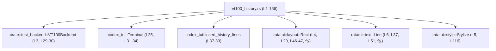
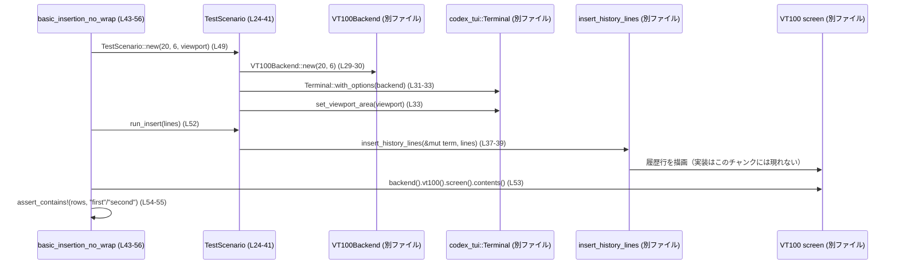

# tui/tests/suite/vt100_history.rs コード解説

## 0. ざっくり一言

VT100 互換バックエンド上で、`codex_tui::insert_history_lines` がテキスト履歴（長い単語・絵文字・CJK・ANSI スタイルを含む）を正しく挿入・折り返しすることを検証するテスト群です（`vt100_history.rs:L1-L166`）。

---

## 1. このモジュールの役割

### 1.1 概要

- このモジュールは **VT100 ベースのテスト用ターミナル上に履歴テキストを描画する処理** を対象としたテストスイートです。
- 主に `codex_tui::insert_history_lines` の振る舞いを検証し、以下を確認しています（`vt100_history.rs:L37-L40` ほか）。
  - 長いトークンの行折り返しで文字が失われないこと（`long_token_wraps`、`vt100_history.rs:L58-L88`）
  - 絵文字・CJK 文字が欠落しないこと（`emoji_and_cjk`、`vt100_history.rs:L90-L107`）
  - ANSI スタイル付きテキストが連結されて表示されること（`mixed_ansi_spans`、`vt100_history.rs:L109-L120`）
  - 単語が不適切な位置で分割されないこと（`word_wrap_no_mid_word_split`、`em_dash_and_space_word_wrap`）
  - カーソル位置が処理後に復元されること（`cursor_restoration`、`vt100_history.rs:L122-L132`）

### 1.2 アーキテクチャ内での位置づけ

このテストモジュールは、テスト用 VT100 バックエンドと実際の `codex_tui` のターミナル API に依存し、それらを通じて描画結果を検査します。



- `VT100Backend` はテスト用のバックエンドとして `TestScenario::new` で生成されます（`vt100_history.rs:L29-L30`）。
- `Terminal` は `codex_tui` のターミナル型で、`TestScenario` が保持し、`insert_history_lines` に渡されます（`vt100_history.rs:L25, L31-L39`）。
- `Rect` と `Line` は `ratatui` の型で、ビューポート領域と履歴行の表現に使われています（`vt100_history.rs:L4, L29, L37, L46-L47, L51` など）。

### 1.3 設計上のポイント

- **共通フィクスチャ構造体**  
  - `TestScenario` が `codex_tui::Terminal<VT100Backend>` を保持し、複数テスト間で初期化ロジックを共通化しています（`vt100_history.rs:L24-L41`）。
- **ヘルパーマクロによる可読性の高いアサート**  
  - `assert_contains!` マクロで「コレクションに要素が含まれていること」をわかりやすいメッセージ付きで検証しています（`vt100_history.rs:L10-L22`）。
- **エラーハンドリング方針**  
  - ターミナル構築や履歴挿入の失敗は `expect` により即座にパニックさせます（`vt100_history.rs:L31-L33, L37-L39`）。テストコードであり、失敗時に詳細メッセージとともに落ちる設計です。
  - 検証には `assert!`, `assert_eq!` を用いており、テスト失敗時にパニックする標準的な Rust テストスタイルです（例: `vt100_history.rs:L54-L55, L83-L87`）。
- **安全性と並行性**  
  - このファイル内に `unsafe` ブロックやスレッド生成・`async`/`await` はなく、すべて安全な同期コードで構成されています。
  - `Terminal` や `VT100Backend` のスレッドセーフ性（`Send`/`Sync` かどうか）は、このチャンクからは分かりません。

---

## 2. 主要な機能・コンポーネント一覧

### 2.1 コンポーネントインベントリー

このモジュール内の主要な構造体・マクロ・関数を一覧にします。

| 名前 | 種別 | 定義位置 | 役割 / 用途 |
|------|------|----------|-------------|
| `assert_contains!` | マクロ | `vt100_history.rs:L10-L22` | コレクションに特定要素が含まれることを、分かりやすい失敗メッセージ付きで検証する。 |
| `TestScenario` | 構造体 | `vt100_history.rs:L24-L26` | テストごとに VT100 バックエンド付き `Terminal` を保持するフィクスチャ。 |
| `TestScenario::new` | メソッド | `vt100_history.rs:L29-L35` | 指定サイズの `VT100Backend` と `Terminal` を構築し、ビューポートを設定する。 |
| `TestScenario::run_insert` | メソッド | `vt100_history.rs:L37-L40` | `codex_tui::insert_history_lines` を呼び出して履歴行を挿入する。 |
| `basic_insertion_no_wrap` | テスト関数 | `vt100_history.rs:L43-L56` | 短い 2 行の履歴が画面にそのまま現れることを検証する。 |
| `long_token_wraps` | テスト関数 | `vt100_history.rs:L58-L88` | 幅 20 の画面で長さ 45 の `A` 列が折り返されても、文字数が失われないことを検証する。 |
| `emoji_and_cjk` | テスト関数 | `vt100_history.rs:L90-L107` | 絵文字と CJK 文字を含む文字列の全ての非空白文字が画面に存在することを確認する。 |
| `mixed_ansi_spans` | テスト関数 | `vt100_history.rs:L109-L120` | ANSI スタイル付きテキストとプレーンテキストの連結が正しく表示されることを確認する。 |
| `cursor_restoration` | テスト関数 | `vt100_history.rs:L122-L132` | 履歴挿入後も `last_known_cursor_pos` が `(0, 0)` に戻ることを確認する。 |
| `word_wrap_no_mid_word_split` | テスト関数 | `vt100_history.rs:L134-L149` | 長文中の単語 `both` が改行位置で分断されない（`"bo\nth"` を含まない）ことを検証する。 |
| `em_dash_and_space_word_wrap` | テスト関数 | `vt100_history.rs:L151-L166` | エムダッシュと空白を含む文で、`inside` が `"insi\nde"` のように分割されないことを検証する。 |

### 2.2 主要な機能（テスト観点）

- 履歴行の基本挿入: `basic_insertion_no_wrap` で、単純な 2 行の履歴がそのまま画面に現れることを確認（`vt100_history.rs:L43-L56`）。
- 行折り返し時の完全性: `long_token_wraps` で、折り返し後も文字数が変わらないことを確認（`vt100_history.rs:L65-L87`）。
- 多バイト文字の扱い: `emoji_and_cjk` で、絵文字・CJK 文字が欠落しないことを確認（`vt100_history.rs:L97-L106`）。
- スタイル付きテキストの結合: `mixed_ansi_spans` で、色付き文字列とプレーン文字列が `"red+plain"` として表示されることを確認（`vt100_history.rs:L116-L119`）。
- カーソル位置の保持: `cursor_restoration` で、履歴挿入後にカーソルが `(0, 0)` に戻ることを確認（`vt100_history.rs:L129-L131`）。
- 単語区切りに配慮した折り返し:  
  - `word_wrap_no_mid_word_split` で `"both"` が `"bo\nth"` とならないことを確認（`vt100_history.rs:L142-L147`）。  
  - `em_dash_and_space_word_wrap` で `"inside"` が `"insi\nde"` とならないことを確認（`vt100_history.rs:L159-L164`）。

---

## 3. 公開 API と詳細解説

このファイルはテスト専用モジュールであり、外部クレート向けに公開される API はありません（`exports=0`）。ここでは **テスト内で再利用される構成要素** と **代表的なテスト関数** を詳しく説明します。

### 3.1 型一覧（構造体・マクロなど）

| 名前 | 種別 | フィールド / 引数 | 役割 / 用途 |
|------|------|------------------|-------------|
| `TestScenario` | 構造体 | `term: codex_tui::Terminal<VT100Backend>`（`vt100_history.rs:L25`） | テストで使用するターミナルインスタンスを保持するフィクスチャ。 |
| `assert_contains!` | マクロ | `($collection:expr, $item:expr $(,)?)` など（`vt100_history.rs:L10-L21`） | コレクションに所定の要素が含まれているかを `assert!` で検証するヘルパー。 |

---

### 3.2 関数詳細（7 件）

#### `TestScenario::new(width: u16, height: u16, viewport: Rect) -> Self`（L29-L35）

**概要**

- 指定したサイズの `VT100Backend` と `codex_tui::Terminal` を構築し、ビューポート領域を設定したうえで `TestScenario` を生成します（`vt100_history.rs:L29-L35`）。

**引数**

| 引数名 | 型 | 説明 |
|--------|----|------|
| `width` | `u16` | 端末の幅（セル数）（`vt100_history.rs:L29-L30`）。 |
| `height` | `u16` | 端末の高さ（行数）（`vt100_history.rs:L29-L30`）。 |
| `viewport` | `Rect` | `ratatui::layout::Rect`。履歴描画に使うビューポート領域（`vt100_history.rs:L29, L33`）。 |

**戻り値**

- `Self`（`TestScenario`）: `VT100Backend` をバックエンドとする `codex_tui::Terminal` を内部に保持したシナリオオブジェクト（`vt100_history.rs:L24-L26, L34`）。

**内部処理の流れ**

1. `VT100Backend::new(width, height)` でバックエンドを生成（`vt100_history.rs:L29-L30`）。
2. `codex_tui::Terminal::with_options(backend)` でターミナルを構築し、失敗した場合は `"failed to construct terminal"` というメッセージ付きでパニック（`vt100_history.rs:L31-L33`）。
3. `term.set_viewport_area(viewport)` でターミナルのビューポートを設定（`vt100_history.rs:L33`）。
4. `Self { term }` で `TestScenario` を返却（`vt100_history.rs:L34`）。

**Examples（使用例）**

テスト内での利用例（`basic_insertion_no_wrap`）:

```rust
// ビューポートを画面下端 1 行に設定する（vt100_history.rs:L45-L48）
let area = Rect::new(0, 5, 20, 1);
// 20x6 のスクリーンを持つ TestScenario を生成（vt100_history.rs:L49）
let mut scenario = TestScenario::new(20, 6, area);
```

**Errors / Panics**

- `Terminal::with_options(backend)` が `Err` を返した場合、`expect("failed to construct terminal")` によりパニックします（`vt100_history.rs:L31-L33`）。

**Edge cases（エッジケース）**

- `width` や `height` が 0 の場合の振る舞いは、このチャンク内には登場せず不明です。
- `viewport` が `width`/`height` を超える矩形を指定した場合の挙動も、このテストコードだけからは分かりません。

**使用上の注意点**

- テストコード用のコンストラクタであり、`expect` により失敗時は即座にパニックする前提になっています。
- ビューポートはテスト内容に直接影響するため、テストの意図に合った `Rect` を指定する必要があります（例: 下端 1 行か、全画面か）。

---

#### `TestScenario::run_insert(&mut self, lines: Vec<Line<'static>>)`（L37-L40）

**概要**

- 内部の `Terminal` に対して `codex_tui::insert_history_lines` を呼び出し、履歴行を挿入します（`vt100_history.rs:L37-L40`）。

**引数**

| 引数名 | 型 | 説明 |
|--------|----|------|
| `&mut self` | `&mut TestScenario` | 内部のターミナルを変更するための可変参照（`vt100_history.rs:L37`）。 |
| `lines` | `Vec<Line<'static>>` | `ratatui::text::Line` のベクタ。挿入する履歴テキスト（`vt100_history.rs:L37`）。 |

**戻り値**

- なし（ユニット型）。失敗時はパニックします（`vt100_history.rs:L38-L39`）。

**内部処理の流れ**

1. `codex_tui::insert_history_lines(&mut self.term, lines)` を呼び出す（`vt100_history.rs:L37-L39`）。
2. 返り値の `Result` に対して `.expect("Failed to insert history lines in test")` を呼び、`Err` の場合はパニック（`vt100_history.rs:L38-L39`）。

**Examples（使用例）**

`basic_insertion_no_wrap` からの例:

```rust
// 挿入する履歴行を文字列から生成（vt100_history.rs:L51）
let lines = vec!["first".into(), "second".into()];
// ターミナルに履歴行を挿入（vt100_history.rs:L52）
scenario.run_insert(lines);
```

**Errors / Panics**

- `codex_tui::insert_history_lines` が `Err` を返した場合、`expect("Failed to insert history lines in test")` によりパニックします（`vt100_history.rs:L38-L39`）。
- `insert_history_lines` 自体がどの条件で `Err` を返すかは、このチャンクには現れません。

**Edge cases（エッジケース）**

- `lines` が空ベクタの場合の挙動（何も描画しないかどうか）は、このテストコードからは分かりません。
- 極端に長い `lines`（大量行）や、非常に長い各 `Line` を渡したときのパフォーマンス・描画結果も、このファイルでは検証されていません。

**使用上の注意点**

- テスト内では `lines` を `'static` ライフタイムの `Line<'static>` として構築しています（`vt100_history.rs:L37, L51, L66, L98` など）。実際のコードではライフタイムが異なる可能性があります。
- この関数は **テスト専用ヘルパー** であり、失敗時にテストが即座に落ちる設計です。

---

#### `basic_insertion_no_wrap()`（L43-L56）

**概要**

- 短い文字列 `"first"`, `"second"` を履歴として挿入し、画面上のどこかにそれらの行が含まれていることを検証します（`vt100_history.rs:L51-L55`）。

**引数 / 戻り値**

- 引数なし、戻り値なしのテスト関数（`#[test]`、`vt100_history.rs:L43-L56`）。

**内部処理の流れ**

1. `Rect::new(0, 5, 20, 1)` で画面下端 1 行のビューポートを作成（`vt100_history.rs:L45-L48`）。
2. `TestScenario::new(20, 6, area)` で 20x6 のターミナルを初期化（`vt100_history.rs:L49`）。
3. `"first"`, `"second"` を `Line` に変換してベクタに格納（`.into()` により暗黙に `Line` へ変換されると推測されるが、変換の詳細はこのチャンクには現れません）（`vt100_history.rs:L51`）。
4. `scenario.run_insert(lines)` で履歴行を挿入（`vt100_history.rs:L52`）。
5. `scenario.term.backend().vt100().screen().contents()` で VT100 画面全体の内容を文字列として取得（`vt100_history.rs:L53`）。
6. `assert_contains!` を使って `rows` に `"first"`, `"second"` の文字列が含まれることを検証（`vt100_history.rs:L54-L55`）。

**Examples**

この関数自体が使用例となっています。実際のテストでのパターンは次のように要約できます。

```rust
let mut scenario = TestScenario::new(20, 6, Rect::new(0, 5, 20, 1)); // L45-L49
let lines = vec!["first".into(), "second".into()];                    // L51
scenario.run_insert(lines);                                           // L52
let rows = scenario.term.backend().vt100().screen().contents();       // L53
assert_contains!(rows, String::from("first"));                        // L54
assert_contains!(rows, String::from("second"));                       // L55
```

**Errors / Panics**

- `TestScenario::new` 内部の `expect`、`run_insert` 内部の `expect`、および `assert_contains!` の失敗によりパニックする可能性があります（`vt100_history.rs:L31-L33, L37-L39, L54-L55`）。

**Edge cases**

- `"first"` および `"second"` は幅 20 に対して十分短いため、折り返しは発生しません。
- 複数行にまたがるテキストやスタイル付きテキストのケースは、このテストでは扱っていません。

**使用上の注意点**

- 画面内容の取得に `contents()` を利用しており、これは **画面全体を 1 つの文字列として復元する** インターフェースであると解釈できますが、改行文字や空白の扱いについては、このチャンクからは断定できません（`vt100_history.rs:L53`）。

---

#### `long_token_wraps()`（L58-L88）

**概要**

- 幅 20 の画面に対し、長さ 45 の `'A'` からなる単一行を挿入し、折り返し後の画面全体に含まれる `'A'` の数が 45 と等しいことを検証します（`vt100_history.rs:L65-L87`）。

**引数 / 戻り値**

- 引数なし、戻り値なしのテスト関数（`vt100_history.rs:L58-L88`）。

**内部処理の流れ**

1. 幅 20、高さ 6、下端 1 行のビューポートを持つ `TestScenario` を生成（`vt100_history.rs:L60-L63`）。
2. `"A".repeat(45)` で長さ 45 の文字列を作成し、`Line` に変換してベクタに格納（`vt100_history.rs:L65-L66`）。
3. `run_insert` で履歴行を挿入（`vt100_history.rs:L67`）。
4. `scenario.term.backend().vt100().screen()` で画面オブジェクトを取得（`vt100_history.rs:L68`）。
5. 二重ループで `row: 0..6`, `col: 0..20` の全セルを走査し、`screen.cell(row, col)` から `cell.contents().chars().next()` を取り出して `'A'` かどうかを確認。 `'A'` なら `count_a` をインクリメント（`vt100_history.rs:L71-L79`）。
6. 最終的な `count_a` と `long.len()` を比較し、一致しなければ `"wrapped content did not preserve all characters"` というメッセージとともに `assert_eq!` が失敗（`vt100_history.rs:L83-L87`）。

**Examples**

テスト本体がそのまま典型的な使用パターンです。ポイントは **セル単位で文字数をカウントしている** 点です。

**Errors / Panics**

- `TestScenario::new`・`run_insert` の `expect` によるパニック可能性（`vt100_history.rs:L31-L33, L37-L39`）。
- 画面からのセル取得 `screen.cell(row, col)` が `None` を返しても、その場合単にカウントしないだけでパニックはしません（`if let Some(cell) = …`、`vt100_history.rs:L74-L79`）。
- 最後の `assert_eq!(count_a, long.len(), ...)` が不一致の場合にパニックします（`vt100_history.rs:L83-L87`）。

**Edge cases**

- **折り返し位置**: 折り返し位置そのもの（どの列で改行されるか）は検証しておらず、**文字数の保存** のみを対象としています（`vt100_history.rs:L71-L87`）。
- **多バイト文字**: `cell.contents().chars().next()` で先頭 1 文字のみを見ていますが、このテストでは `'A'` のみを扱うため、多バイト文字に関する問題は発生しません。

**使用上の注意点**

- このテストは「文字が失われない」ことに特化しており、「余分な文字が増えていないか」までは検証していません（`count_a` が `long.len()` と一致するのみ）。
- VT100 画面のインターフェース (`cell`, `contents`) の詳細な仕様は、このチャンクには現れません。

---

#### `emoji_and_cjk()`（L90-L107）

**概要**

- 絵文字と CJK 文字を含む `"😀😀😀😀😀 你好世界"` を挿入し、画面全体の文字列に各非空白文字がすべて含まれていることを検証します（`vt100_history.rs:L97-L106`）。

**内部処理の流れ**

1. `TestScenario::new(20, 6, area)` でシナリオを初期化（`vt100_history.rs:L92-L95`）。
2. `text` として `"😀😀😀😀😀 你好世界"` を `String::from` で生成（`vt100_history.rs:L97`）。
3. `lines = vec![text.clone().into()]` として 1 行を挿入（`vt100_history.rs:L98`）。
4. `run_insert` で履歴挿入（`vt100_history.rs:L99`）。
5. `rows = scenario.term.backend().vt100().screen().contents()` で画面全体を `String` として取得（`vt100_history.rs:L100`）。
6. `for ch in text.chars().filter(|c| !c.is_whitespace())` で元文字列中の全ての非空白文字を列挙し、それぞれについて `rows.contains(ch)` が真であることを `assert!` で検証（`vt100_history.rs:L101-L106`）。

**Errors / Panics**

- `rows.contains(ch)` が偽の場合、`"missing character {ch:?} in reconstructed screen"` というメッセージで `assert!` がパニックします（`vt100_history.rs:L102-L105`）。

**Edge cases**

- **順序やレイアウト**: このテストは各文字の「存在」のみを確認しており、「順序」や「改行位置」は検証していません（`vt100_history.rs:L101-L106`）。
- **結合文字・グラフェムクラスター**: `text` に含まれる絵文字や CJK 文字はいずれも 1 コードポイントの `char` として扱えるものですが、結合文字列や複雑なグラフェムに関する挙動は、このテストではカバーされていません。

**使用上の注意点**

- 多バイト文字を扱う際も、`screen().contents()` が UTF-8 文字列を返す前提で `String::contains(char)` を利用しています（`vt100_history.rs:L100-L103`）。
- 画面復元処理が **文字単位で欠落しないか** を確認するテストであり、表示幅（全角2桁分かどうか）等のレイアウトまでは検証していません。

---

#### `cursor_restoration()`（L122-L132）

**概要**

- 履歴挿入後にターミナルの `last_known_cursor_pos` が `(0, 0)` に戻っていることを確認し、カーソル復元ロジックを検証します（`vt100_history.rs:L129-L131`）。

**内部処理の流れ**

1. `TestScenario::new(20, 6, area)` でシナリオを用意（`vt100_history.rs:L124-L127`）。
2. `"x".into()` から 1 行だけ挿入（`vt100_history.rs:L129`）。
3. 挿入後に `assert_eq!(scenario.term.last_known_cursor_pos, (0, 0).into())` を実行し、ターミナルが保持するカーソル位置が `(0, 0)` であることを確認（`vt100_history.rs:L131`）。

**Errors / Panics**

- `assert_eq!` が失敗した場合、テストはパニックします（`vt100_history.rs:L131`）。
- `last_known_cursor_pos` の型は `.into()` によって `(0, 0)` から変換可能な何らかの型ですが、具体的な定義はこのチャンクには現れません。

**Edge cases**

- ここでは 1 行だけを挿入しており、複数行挿入や長い行でのカーソル復元は検証されていません。
- `last_known_cursor_pos` が「論理カーソル位置」なのか「物理カーソル位置」なのかは、このファイルからは判断できません。

**使用上の注意点**

- カーソル位置を利用するコードでは、`insert_history_lines` が内部でカーソルを移動しても、終わった時点で元に戻ることを前提にできますが、正確な契約は `codex_tui` 本体の実装を参照する必要があります。

---

#### `word_wrap_no_mid_word_split()`（L134-L149）

**概要**

- 幅 40 の画面に長文を挿入した際、単語 `"both"` が `"bo\nth"` のように改行位置で分断されていないことを検証し、単語単位のワードラップを確認します（`vt100_history.rs:L142-L147`）。

**内部処理の流れ**

1. 幅 40、高さ 10、下端 1 行のビューポートを持つシナリオを生成（`vt100_history.rs:L136-L140`）。
2. `sample` として長文を 1 行の文字列で用意（`vt100_history.rs:L142`）。
3. `scenario.run_insert(vec![sample.into()])` で挿入（`vt100_history.rs:L143`）。
4. `joined = scenario.term.backend().vt100().screen().contents()` で画面全体を 1 つの文字列として取得（`vt100_history.rs:L144`）。
5. `assert!(!joined.contains("bo\nth"), ...)` により、画面復元文字列に `"bo\nth"` という断片が現れないことを確認（`vt100_history.rs:L145-L147`）。

**Errors / Panics**

- `"bo\nth"` が `joined` に含まれている場合、`assert!` がパニックし、メッセージとして `joined` の内容を表示します（`vt100_history.rs:L145-L147`）。

**Edge cases**

- `"both"` 以外の単語、また句読点・エムダッシュなどを含む他のケースはこのテスト単体では扱っていません（エムダッシュは `em_dash_and_space_word_wrap` で扱われます）。
- 行折り返しのアルゴリズムが **単語境界を必ず守る** のか、それとも特定の条件下のみ守るのかは、このテストだけでは判断できません。

**使用上の注意点**

- ワードラップの正確なルール（例えば、ハイフン付き単語の分割可否）については、このテストだけでは網羅されていません。
- テストメッセージには `joined` の内容が埋め込まれるため、失敗時に画面の状態を人間が詳細に確認できます（`vt100_history.rs:L145-L147`）。

---

### 3.3 その他の関数

| 関数名 | 役割（1 行） | 定義位置 |
|--------|--------------|----------|
| `mixed_ansi_spans` | `"red".red()` と `"+plain".into()` を連結した行を挿入し、`"red+plain"` が画面内容に含まれることを確認するテストです。 | `vt100_history.rs:L109-L120` |
| `em_dash_and_space_word_wrap` | エムダッシュと空白を含む文で、単語 `"inside"` が `"insi\nde"` のように分割されないことを検証するテストです。 | `vt100_history.rs:L151-L166` |

---

## 4. データフロー

ここでは、代表的なシナリオとして `basic_insertion_no_wrap` におけるデータの流れを説明します。

1. `basic_insertion_no_wrap` がビューポート矩形と `TestScenario` を生成し、挿入する文字列から `Line` ベクタを作成します（`vt100_history.rs:L45-L52`）。
2. `TestScenario::run_insert` が内部の `Terminal` と `lines` を `codex_tui::insert_history_lines` に渡します（`vt100_history.rs:L37-L40`）。
3. `insert_history_lines` が VT100 バックエンドを通じて画面に描画を行います（実装はこのチャンクには現れません）。
4. テストは `vt100` 画面オブジェクトから `contents()` を取得し、`assert_contains!` で内容を検証します（`vt100_history.rs:L53-L55`）。



この図から分かるように、テストは **外部インターフェース (`insert_history_lines` と VT100 画面 API)** のみを利用しており、内部の描画ロジックには直接アクセスしていません。

---

## 5. 使い方（How to Use）

### 5.1 基本的な使用方法

このファイルはテストコードですが、`VT100Backend` と `codex_tui::Terminal` を組み合わせて履歴行を挿入・検証する基本パターンを示しています。

```rust
use crate::test_backend::VT100Backend;     // テスト用 VT100 バックエンド（vt100_history.rs:L3）
use ratatui::layout::Rect;                 // ビューポート矩形（vt100_history.rs:L4）
use ratatui::text::Line;                   // 履歴行の表現（vt100_history.rs:L6）

// テスト用シナリオを準備
let area = Rect::new(0, 5, 20, 1);         // 画面下端 1 行をビューポートに（L45-L48）
let backend = VT100Backend::new(20, 6);    // 幅 20, 高さ 6 のバックエンド（L29-L30）
let mut term =
    codex_tui::Terminal::with_options(backend)
        .expect("failed to construct terminal"); // 失敗時はパニック（L31-L33）
term.set_viewport_area(area);               // ビューポート設定（L33）

// 挿入する履歴行を用意
let lines: Vec<Line<'static>> = vec!["hello history".into()]; // .into() で Line に変換（L51 と同様）

// 履歴行を挿入
codex_tui::insert_history_lines(&mut term, lines)
    .expect("Failed to insert history lines");  // L37-L39 と同様に Result を検証

// 画面内容を確認（VT100Backend の API は別ファイル）
let contents = term.backend().vt100().screen().contents();
println!("{contents}");
```

### 5.2 よくある使用パターン（テスト観点）

- **単純挿入の確認**: `basic_insertion_no_wrap` のように、短い行を挿入して `contents()` で存在を検証（`vt100_history.rs:L43-L56`）。
- **折り返しロジックの確認**: `long_token_wraps` のように、幅を意識した入力長を用意し、セル単位で文字数を検証（`vt100_history.rs:L65-L87`）。
- **多バイト文字の確認**: `emoji_and_cjk` のように、`String::contains(char)` を用いて絵文字や CJK の欠落を検証（`vt100_history.rs:L97-L106`）。
- **スタイル付きテキストの確認**: `mixed_ansi_spans` のように `Stylize` を用いて色付きテキストを作り、プレーン文字との連結結果を検証（`vt100_history.rs:L116-L119`）。

### 5.3 よくある間違い（推測される点）

コードから推測できる範囲で、注意が必要な点を挙げます。

```rust
// （誤りになりうるパターンの例 — このチャンクには現れません）
let backend = VT100Backend::new(20, 6);
// let mut term = codex_tui::Terminal::new(backend); // 仮の API: 実際のコードには現れない

// viewport を設定しないまま履歴を挿入
codex_tui::insert_history_lines(&mut term, lines)?; // ビューポートの影響が分からない
```

- このテストでは **必ず `set_viewport_area` を呼んで** ビューポートを明示的に設定しています（`vt100_history.rs:L33, L45-L48, L60-L62, L92-L94` など）。ビューポートを設定しない場合の挙動は、このチャンクからは分かりません。
- `Line<'static>` ではなく、別ライフタイムの `Line` を渡した場合の扱いも、このファイルでは扱っていません。

### 5.4 使用上の注意点（まとめ）

- **安全性**: このファイル内には `unsafe` コードはなく、標準ライブラリと外部クレートの安全な API のみを使用しています。
- **エラーハンドリング**: すべての失敗は `expect` または `assert!` 系マクロで即座にパニックさせるスタイルです。これはテストコードとして一般的ですが、プロダクションコードでは `Result` を返す設計が望まれます。
- **並行性**: テストは単一スレッド・同期的に実行されており、`Terminal` や `VT100Backend` を複数スレッドで共有するケースは、このチャンクには現れません。
- **画面観測**: 画面内容は `screen().contents()` や `screen().cell(row, col)` などの API で観測していますが（`vt100_history.rs:L53, L68, L74-L75, L100, L144, L161`）、これらの API の実装詳細は別ファイルにあります。

---

## 6. 変更の仕方（How to Modify）

### 6.1 新しい機能（テストケース）を追加する場合

`insert_history_lines` の新しい仕様やバグ修正を検証したい場合のパターンです。

1. **シナリオの用意**  
   - 既存と同様に `TestScenario::new(width, height, viewport)` を使ってターミナルを構築します（`vt100_history.rs:L29-L35, L45-L49` を参照）。
2. **入力データの準備**  
   - `Vec<Line<'static>>` を作成します。  
     例: ハイフン付き単語、タブ文字、非常に長い単語など、検証したいケースを `String` にして `into()` する（`vt100_history.rs:L51, L66, L98, L116, L129, L142, L159` を参照）。
3. **履歴挿入の実行**  
   - `scenario.run_insert(lines)` を呼び出します（`vt100_history.rs:L52, L67, L99, L117, L130, L143, L160`）。
4. **画面状態の検証**  
   - `contents()` や `cell()` を使い、必要な条件（文字の存在、改行位置、カーソル位置など）を `assert!` / `assert_eq!` で検証します。

### 6.2 既存の機能を変更する場合（テスト観点）

- **影響範囲の確認**
  - `VT100Backend` や `Terminal` の API を変更した場合、`TestScenario` のコンストラクタ（`vt100_history.rs:L29-L35`）および各テスト内の `backend().vt100().screen()` 呼び出し（`vt100_history.rs:L53, L68, L100, L118, L144, L161`）が影響を受けます。
  - `insert_history_lines` のシグネチャや挙動を変更した場合、`run_insert`（`vt100_history.rs:L37-L40`）と、折り返し・カーソル・ワードラップを検証する各テストの期待値を見直す必要があります。
- **契約（前提条件・返り値の意味）の確認**
  - 例えば「単語を途中で分割しない」という仕様を変える場合、`word_wrap_no_mid_word_split` や `em_dash_and_space_word_wrap` のテスト内容とメッセージを更新する必要があります（`vt100_history.rs:L142-L147, L159-L164`）。
- **関連テストの再確認**
  - 多バイト文字や ANSI スタイルの扱いを変更した場合は、`emoji_and_cjk`（`vt100_history.rs:L90-L107`）や `mixed_ansi_spans`（`vt100_history.rs:L109-L120`）のテストが引き続き仕様を正しく表しているかを確認する必要があります。

---

## 7. 関連ファイル

このモジュールと密接に関係する型・モジュールをまとめます。実際のファイルパスはこのチャンクからは分からないため、モジュールパスのみ記載します。

| モジュール / パス | 役割 / 関係 |
|-------------------|------------|
| `crate::test_backend::VT100Backend` | テスト用 VT100 バックエンド。`TestScenario::new` で生成され、`Terminal` のバックエンドとして利用されます（`vt100_history.rs:L3, L29-L30`）。 |
| `codex_tui::Terminal` | テスト対象のターミナル実装。`TestScenario` のフィールドとして保持され、描画やカーソル位置管理を行います（`vt100_history.rs:L25, L31-L34`）。 |
| `codex_tui::insert_history_lines` | 本テストスイートが検証する中心的な関数。履歴行をターミナルに挿入する処理を担当します（`vt100_history.rs:L37-L39`）。 |
| `ratatui::layout::Rect` | ビューポート領域を表す矩形。各テストで描画位置・高さを指定するために使用されます（`vt100_history.rs:L4, L29, L45-L48, L60-L62, L92-L94, L111-L113, L124-L126, L137-L139, L154-L156`）。 |
| `ratatui::text::Line` | 1 行分のテキスト（およびスタイル）の表現。履歴として挿入するテキストを保持します（`vt100_history.rs:L6, L37, L51, L66, L98, L116, L129, L142, L159`）。 |
| `ratatui::style::Stylize` | `"red".red()` のように、文字列リテラルからスタイル付きテキストを構築するためのトレイトとして利用されています（`vt100_history.rs:L5, L116`）。 |

このチャンクには `VT100Backend`・`Terminal`・`insert_history_lines` の実装本体は現れておらず、詳細な動作はそれぞれの定義側のコードを参照する必要があります。
