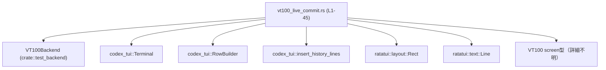
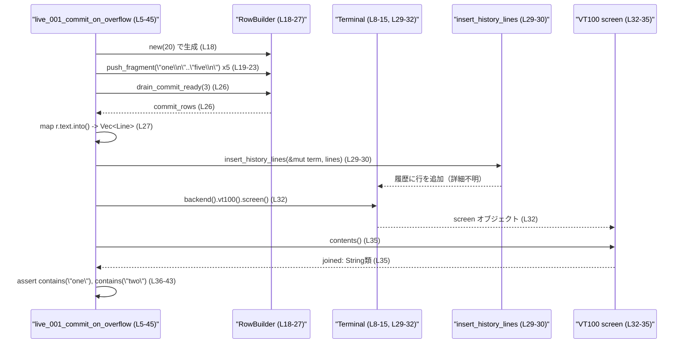

# tui/tests/suite/vt100_live_commit.rs コード解説

## 0. ざっくり一言

VT100 互換バックエンド上で、「ライブリング内に保持される行」と「コミットされ履歴に入る行」が正しく分離されることを検証する単体テストです（`live_001_commit_on_overflow` 関数、tui/tests/suite/vt100_live_commit.rs:L5-45）。

---

## 1. このモジュールの役割

### 1.1 概要

- このテストモジュールは、`codex_tui` クレートのターミナル表示ロジックにおいて、
  - 行ビルダー（`RowBuilder`）から生成される行のうち一部が「コミット（履歴として表示領域の外側に保持）」され、
  - 残りが「ライブリング（スクロール中の行バッファ）」に留まる、
 という挙動を検証します（tui/tests/suite/vt100_live_commit.rs:L17-27, L34-44）。
- 特に、`drain_commit_ready(/*max_keep*/ 3)` を用いたとき、先頭 2 行が履歴にコミットされ、最後 3 行がライブリングに残る前提でテストしています（L25-27, L34-44）。

### 1.2 アーキテクチャ内での位置づけ

このファイルはテストコードであり、実装側の以下のコンポーネントに依存しています。

- `VT100Backend`（`crate::test_backend`）: テスト用の VT100 バックエンド（L1, L7）
- `codex_tui::Terminal`: TUI のターミナル本体（L8）
- `codex_tui::RowBuilder`: 行を組み立てるビルダー（L18-23, L26-27）
- `codex_tui::insert_history_lines`: 履歴に行を挿入する関数（L29-30）
- `ratatui::layout::Rect`: ビューポート領域指定に用いる矩形型（L2, L12-15）
- `ratatui::text::Line`: 1 行分のテキスト表現（L3, L27）
- `screen` オブジェクト（型名不明）の `contents` メソッド: 画面全体のテキスト取得（L32, L35）

依存関係の概略を Mermaid 図で示します。



> 上記のうち、定義がこのチャンクに現れるのはテスト関数のみであり、その他の型・関数の内部実装は、このファイルからは分かりません。

### 1.3 設計上のポイント

コードから読み取れる特徴を列挙します。

- **テスト用バックエンドの利用**  
  - 実際の端末ではなく `VT100Backend::new(width, height)` によるテストバックエンドを使用し、画面内容を文字列として検査しています（L1, L7, L32, L35）。
- **ビュー領域の明示的設定**  
  - `Rect::new` でビュー領域（viewport）を指定し、履歴部分（ビューの上部）にコミットされた行が表示される前提でテストしています（L12-15, L34）。
- **行ビルダーとコミットの分離**  
  - `RowBuilder` に対して 5 行分のフラグメント（末尾に改行を含む文字列）を追加し（L18-23）、
  - `drain_commit_ready(max_keep=3)` によって「コミットすべき行」と「ライブリングに残す行」を分ける前提です（L25-27）。
- **エラーハンドリング**  
  - `Terminal::with_options` の失敗時は `panic!`（テストなので許容）にしています（L8-11）。
  - `insert_history_lines` は `Result` を返し、`expect` によりエラー時にはテスト失敗として panic します（L29-30）。
- **並行性**  
  - 並行処理・スレッド・非同期処理は登場せず、このテストは単一スレッド上で完結する構造です（このチャンクには並行コードが現れません）。

---

## 2. 主要な機能一覧

このモジュールが提供する（＝定義している）機能は 1 つだけです。

- `live_001_commit_on_overflow`: ライブリングがオーバーフローする状況で、古い行が履歴にコミットされ、ビューの外周（上部）に現れることを検証する単体テスト（L5-45）。

### 2.1 コンポーネントインベントリー

#### 関数・メソッド（このファイル内で定義）

| 名前 | 種別 | 役割 / 用途 | 定義位置 |
|------|------|-------------|----------|
| `live_001_commit_on_overflow` | 関数（テスト） | 行ビルダーと履歴挿入ロジックが、保持行数を超えた際に古い行を履歴にコミットすることを確認する | tui/tests/suite/vt100_live_commit.rs:L5-45 |

#### 外部コンポーネント（このファイルから呼び出しているもの）

> 種別はコードから推測できる範囲で記述し、推測である場合は明示します。

| 名前 | 種別（推定を含む） | このファイルでの役割 | 使用位置 / 根拠 |
|------|--------------------|----------------------|-----------------|
| `VT100Backend` | 構造体または型（`::new` を持つ） | テスト用 VT100 端末バックエンド | `use crate::test_backend::VT100Backend;`（L1）、`VT100Backend::new(20, 6)`（L7） |
| `ratatui::layout::Rect` | 構造体（矩形）と推測 | ビューポート領域を表す矩形 | `use ratatui::layout::Rect;`（L2）、`Rect::new(...)`（L12-14） |
| `ratatui::text::Line<'static>` | テキスト 1 行を表す型と推測 | `RowBuilder` から得た行を `insert_history_lines` に渡す形式に変換 | `use ratatui::text::Line;`（L3）、`Vec<Line<'static>>`（L27） |
| `codex_tui::Terminal` | 構造体と推測 | バックエンドをラップするターミナル表現 | `codex_tui::Terminal::with_options(backend)`（L8） |
| `codex_tui::RowBuilder` | 構造体と推測 | テキスト行を段階的に組み立てる | `RowBuilder::new(20)`（L18）、`rb.push_fragment(...)`（L19-23）、`rb.drain_commit_ready(3)`（L26） |
| `codex_tui::insert_history_lines` | 関数 | ターミナルに履歴行を挿入する | `codex_tui::insert_history_lines(&mut term, lines)`（L29-30） |
| `screen`（型名不明） | VT100 画面表現と推測 | 画面内容を取得してテキスト検索する | `term.backend().vt100().screen()`（L32）、`screen.contents()`（L35） |

---

## 3. 公開 API と詳細解説

このファイル自体はライブラリの公開 API を定義していませんが、テストとして重要な関数 `live_001_commit_on_overflow` を詳細に説明します。

### 3.1 型一覧（外部型のみ）

このファイルに新しい型定義はありません。理解に影響する外部型を整理します。

| 名前 | 種別 | 役割 / 用途 | 根拠 |
|------|------|-------------|------|
| `VT100Backend` | 外部構造体（推定） | テスト用の VT100 バックエンド。幅・高さを引数に `new` で初期化される | `VT100Backend::new(20, 6)`（L7） |
| `Rect` | 外部構造体（推定） | ビューポート矩形。`Rect::new(x, y, width, height)` として使用 | L12-14 |
| `Line<'static>` | 外部構造体（推定） | テキスト 1 行を表す。`r.text.into()` で変換される | `Vec<Line<'static>>`（L27） |

> これらの型の具体的なフィールドやメソッドの仕様は、このチャンクには現れません。

### 3.2 関数詳細

#### `live_001_commit_on_overflow()`

**概要**

- 行バッファが「最後の 3 行をライブリングに保持し、それ以前の行を履歴にコミットする」という振る舞いをすることを、VT100 バックエンド上で検証する単体テストです（L17-27, L34-44）。

**引数**

- 引数はありません（テスト関数として `#[test] fn live_001_commit_on_overflow()`、L5-6）。

**戻り値**

- 戻り値はありません（ユニットテストのため）。`Result` を返さない通常のテスト関数です（L5-6）。

**内部処理の流れ（アルゴリズム）**

処理のステップを簡潔に分解すると次のようになります。

1. **VT100 バックエンドとターミナルの構築**  
   - `VT100Backend::new(20, 6)` で幅 20・高さ 6 のバックエンドを作成します（L7）。  
   - それを `codex_tui::Terminal::with_options(backend)` に渡し、`Result` を `match` で処理してターミナルを得ます（L8-11）。  
     - `Ok(t)` の場合は `t` を `term` に格納（L9）。
     - `Err(e)` の場合は `panic!("failed to construct terminal: {e}")` で即座にテスト失敗とします（L10）。
2. **ビュー領域（viewport）の設定**  
   - `Rect::new(0, 5, 20, 1)` で、x=0, y=5, 幅=20, 高さ=1 の矩形を生成し（L12-14）、
   - `term.set_viewport_area(area)` でターミナルのビューポートに設定します（L15）。
3. **行ビルダーの生成と 5 行分の追加**  
   - `RowBuilder::new(20)` で、幅 20 をターゲットとする行ビルダー `rb` を作成します（L18）。
   - `"one\n"` から `"five\n"` まで、改行付き文字列を 5 回 `push_fragment` で追加します（L19-23）。  
     コメントに「Build 5 explicit rows at width 20.」とあるため、これらが 5 行として扱われる前提です（L17）。
4. **コミット対象行の抽出（drain_commit_ready）**  
   - コメント `// Keep the last 3 in the live ring; commit the first 2.` に従うと、  
     `rb.drain_commit_ready(/*max_keep*/ 3)` により、最後 3 行をライブリングに残し、最初の 2 行を「コミット対象」として取り出す前提です（L25-26）。  
   - 戻り値 `commit_rows` から `into_iter()` でイテレータを得て、`r.text.into()` で `Line<'static>` に変換し、`Vec<Line<'static>>` に収集しています（L27）。  
     ここで `r` がどのような型か（少なくとも `text` フィールドを持つ構造体である）以外は、このチャンクからは分かりません。
5. **履歴への行の挿入**  
   - `codex_tui::insert_history_lines(&mut term, lines)` を呼び出して、コミット対象行をターミナルの履歴に挿入します（L29）。  
   - この関数は `Result` を返し、`expect("Failed to insert history lines in test")` によって、エラー時には panic させます（L29-30）。
6. **画面内容の取得と検証**  
   - `let screen = term.backend().vt100().screen();` により、VT100 バックエンドの画面オブジェクトを取得します（L32）。  
     - `backend()`, `vt100()`, `screen()` それぞれの型や責務の詳細は、このファイルからは分かりません。
   - `let joined = screen.contents();` で、画面全体のテキスト内容を 1 つの文字列として取得します（L35）。  
   - `assert!(joined.contains("one"), ...)` および `assert!(joined.contains("two"), ...)` で、  
     コミットされたはずの `"one"` と `"two"` が現在の画面内容のどこかに現れることを検証します（L36-43）。  
     これは「ビューの上（履歴部分）にコミット済み行が表示されている」という前提の確認です。

Mermaid のフローチャートで表すと、テスト全体の制御フローは次のようになります。

```mermaid
flowchart TD
    A["start test<br/>live_001_commit_on_overflow (L5-6)"]
    B["VT100Backend::new(20, 6) (L7)"]
    C["Terminal::with_options(backend) (L8-11)"]
    D["Rect::new(0,5,20,1) (L12-14)"]
    E["term.set_viewport_area(area) (L15)"]
    F["RowBuilder::new(20) & push_fragment x5 (L18-23)"]
    G["rb.drain_commit_ready(3) (L26)"]
    H["map r.text.into() -> Vec<Line> (L27)"]
    I["insert_history_lines(&mut term, lines) (L29-30)"]
    J["screen = term.backend().vt100().screen() (L32)"]
    K["joined = screen.contents() (L35)"]
    L["assert contains(\"one\") (L36-39)"]
    M["assert contains(\"two\") (L40-43)"]
    N["end test (L45)"]

    A --> B --> C --> D --> E --> F --> G --> H --> I --> J --> K --> L --> M --> N
```

**Examples（使用例）**

この関数自体がテストとしての使用例です。`RowBuilder`・`insert_history_lines`・`VT100Backend` を組み合わせて、「履歴への行挿入＋画面検証」という典型的なフローを示しています。

同様のテストを追加する場合のパターン例を、簡略版コードで示します。

```rust
#[test] // テスト関数であることを示す属性
fn example_history_insertion_test() {
    // 1. バックエンドとターミナルを構築
    let backend = VT100Backend::new(80, 25); // 幅80, 高さ25のテスト端末を作る
    let mut term = codex_tui::Terminal::with_options(backend).expect("terminal init");

    // 2. ビューポートを設定
    let area = Rect::new(0, 20, 80, 5); // 下部5行をビューポートとする
    term.set_viewport_area(area);

    // 3. 行ビルダーで行を構築
    let mut rb = codex_tui::RowBuilder::new(80);
    rb.push_fragment("hello\n");
    rb.push_fragment("world\n");

    // 4. コミット対象行を取得し、Line に変換
    let commit_rows = rb.drain_commit_ready(/*max_keep*/ 0); // 全てコミットする想定
    let lines: Vec<Line<'static>> =
        commit_rows.into_iter().map(|r| r.text.into()).collect();

    // 5. 履歴に挿入
    codex_tui::insert_history_lines(&mut term, lines).expect("insert history");

    // 6. 画面内容から検証
    let screen = term.backend().vt100().screen();
    let joined = screen.contents();
    assert!(joined.contains("hello"));
    assert!(joined.contains("world"));
}
```

> 上記の挙動は、このテストファイルで使われている API パターンを模倣したものであり、`RowBuilder` や `insert_history_lines` の詳細仕様そのものは、このチャンクからは分かりません。

**Errors / Panics**

このテスト関数内で起こりうる panic 条件は次の通りです。

- `Terminal::with_options(backend)` が `Err(e)` を返した場合  
  - `match` の `Err(e)` アームで `panic!("failed to construct terminal: {e}")` が実行されます（L8-11）。
- `codex_tui::insert_history_lines(&mut term, lines)` が `Err(_)` を返した場合  
  - `expect("Failed to insert history lines in test")` により panic します（L29-30）。
- `assert!(joined.contains("one"), ...)` が失敗する場合  
  - `"one"` が画面内容中に見つからなければアサーション失敗で panic（L36-39）。
- `assert!(joined.contains("two"), ...)` が失敗する場合  
  - `"two"` が画面内容中に見つからなければアサーション失敗で panic（L40-43）。

セキュリティ上の影響について:

- このコードはテスト環境での実行を前提としており、外部入力やユーザデータを扱っていません。
- したがって、このチャンクから読み取れる範囲では、セキュリティ上の直接的なリスクは見えません。

**Edge cases（エッジケース）**

このテストが前提としている条件・エッジケースは次のようになります。

- **`RowBuilder` に 5 行追加したケースのみを検証**（L18-23）  
  - 5 行未満・5 行より多い場合の挙動は、このテストからは分かりません。
- **`max_keep = 3` のケースのみを想定**（L26）  
  - `max_keep` の値による挙動の違い（例: 0 や 1、非常に大きい値）は検証されていません。
- **ビューポート位置 `y = 5` のケースだけ**（L12-15）  
  - 端末高さ 6 のうち、最下行（`y = 5`）をビューポートとする位置関係です。  
    これにより、「コミットされた行はビューポートの外（上）に表示される」という前提になりますが、他の位置での挙動は不明です。
- **画面内容の検索は単純な `contains` のみ**（L36-43）  
  - `"one"` や `"two"` がどこに表示されているか（座標）までは検証していません。  
    他の箇所に意図せず同じ文字列が表示されていても、このテスト単体では区別できません。

**使用上の注意点**

- このテストは `VT100Backend` を前提としています（L7, L32）。  
  別のバックエンドを使用する場合、`screen().contents()` の挙動が変わる可能性があり、このテストをそのまま流用することはできません。
- `RowBuilder` の内部仕様（フラグメントの扱い方、`max_keep` の意味）に依存しています（L18-27）。  
  これらの API の仕様が変わった場合、テストは通っていても期待している意味とは異なる挙動を許容してしまう可能性があります。
- `assert!(joined.contains("one"))` などは、画面内に同じ文字列が複数箇所出る状況を考慮していません（L36-43）。  
  より精密な検証が必要な場合は、テキストの位置や行単位での比較が必要になりますが、このチャンクにはそのようなロジックは現れません。
- 並行性や非同期処理は関与しないため、スレッド安全性や `Send`/`Sync` については、このテストからは読み取れません。

### 3.3 その他の関数

- このファイルには、補助的な関数や単純なラッパー関数の定義はありません（tui/tests/suite/vt100_live_commit.rs には `live_001_commit_on_overflow` のみが定義されています）。

---

## 4. データフロー

このテストにおける代表的なデータフローは、「文字列フラグメント → RowBuilder → commit_rows → Line ベクタ → ターミナル履歴 → 画面文字列」という流れです。

文章による要約:

1. `"one\n"`〜`"five\n"` の文字列フラグメントが `RowBuilder` に追加される（L18-23）。
2. `drain_commit_ready(3)` により、コミット対象の行（先頭 2 行とコメントで明示）だけが `commit_rows` として取り出される（L25-26）。
3. 各 `r.text` が `Line<'static>` に変換され、`Vec<Line<'static>>` にまとめられる（L27）。
4. `insert_history_lines` によってターミナルの履歴に挿入される（L29-30）。
5. VT100 画面の `contents` により、履歴を含む画面全体の文字列が取得される（L32, L35）。
6. この文字列中に `"one"` と `"two"` が含まれていることを `assert!` で検証する（L36-43）。

Mermaid のシーケンス図で表すと、次のようになります。



> `insert_history_lines` や `screen.contents()` の内部データフローは、このチャンクには現れないため「詳細不明」としています。

---

## 5. 使い方（How to Use）

このファイルはテスト用ですが、`VT100Backend`・`Terminal`・`RowBuilder`・`insert_history_lines` を組み合わせた基本的な使用パターンを示しています。

### 5.1 基本的な使用方法

このモジュールで示されている典型的なフローは次の通りです。

```rust
// 1. テスト用バックエンドとターミナルを用意する
let backend = VT100Backend::new(20, 6); // L7
let mut term = codex_tui::Terminal::with_options(backend) // L8
    .expect("terminal init");

// 2. ビューポート領域を設定する
let area = Rect::new(0, 5, 20, 1); // L12-14
term.set_viewport_area(area);      // L15

// 3. RowBuilder で行を構築する
let mut rb = codex_tui::RowBuilder::new(20); // L18
rb.push_fragment("one\n");   // L19
rb.push_fragment("two\n");   // L20
rb.push_fragment("three\n"); // L21
rb.push_fragment("four\n");  // L22
rb.push_fragment("five\n");  // L23

// 4. コミット対象行を取得して Line に変換する
let commit_rows = rb.drain_commit_ready(3); // L26
let lines: Vec<Line<'static>> =
    commit_rows.into_iter().map(|r| r.text.into()).collect(); // L27

// 5. 履歴に挿入する
codex_tui::insert_history_lines(&mut term, lines) // L29
    .expect("Failed to insert history lines in test"); // L30

// 6. 画面内容を取得し検証する
let screen = term.backend().vt100().screen(); // L32
let joined = screen.contents();               // L35
assert!(joined.contains("one"));              // L36-39
assert!(joined.contains("two"));              // L40-43
```

### 5.2 よくある使用パターン

このテストから推測できる使用パターンは次のとおりです（コードから読み取れる範囲で記述します）。

- **履歴にだけ挿入する行と、ライブリングに残す行を分けたい場合**  
  - `RowBuilder` に行を追加し、`drain_commit_ready(max_keep)` で「コミット対象」のみを取り出す（L18-27）。
  - コミット対象行は `insert_history_lines` で履歴に挿入し、ライブリング側は `RowBuilder` 側・または別のメカニズムで扱う形になります（L29-30）。
- **画面全体のテキストをまとめて検査したい場合**  
  - テストバックエンドから `screen().contents()` を取得し、`String::contains` で部分文字列を検査する（L32, L35-43）。  
  - 個々のセルや座標ではなく、「画面全体のどこかに現れるか」という粒度で検証するパターンです。

### 5.3 よくある間違い

このテストコードから推測される誤用パターンと、それを避ける方法を示します。

```rust
// 誤り例: RowBuilder から直接 Line を作ろうとしている（仮の誤用例）
let mut rb = codex_tui::RowBuilder::new(20);
rb.push_fragment("one\n");
// 直接 Line::from(...) などで変換しようとする（このチャンクにはそのAPIは現れない）
// let line = Line::from("one"); // 仕様不明・テストの意図から外れる可能性

// 正しい例: commit_ready な行を RowBuilder から取り出してから、text フィールドを Line に変換する
let commit_rows = rb.drain_commit_ready(0); // この例では全行コミットすると仮定
let lines: Vec<Line<'static>> =
    commit_rows.into_iter().map(|r| r.text.into()).collect();
codex_tui::insert_history_lines(&mut term, lines)?;
```

```rust
// 誤り例: ビューポートを設定せずに履歴の可視性をテストしようとする
let backend = VT100Backend::new(20, 6);
let mut term = codex_tui::Terminal::with_options(backend)?;
// term.set_viewport_area(area); // 呼んでいないため、履歴の可視性前提が崩れる可能性

// 正しい例: テストの前提として、ビューポートを明示的に設定する（L12-15）
let area = Rect::new(0, 5, 20, 1);
term.set_viewport_area(area);
// この状態で履歴へのコミットと画面内容を検証する
```

### 5.4 使用上の注意点（まとめ）

- `Terminal::with_options` や `insert_history_lines` は `Result` を返すため、テスト以外のコードでは `expect` ではなく適切なエラーハンドリングが求められます（L8-11, L29-30）。
- ライブリングと履歴の分離ロジックは `RowBuilder` と `drain_commit_ready` の仕様に依存します（L18-27）。  
  仕様が変わった場合、このテストを見直す必要があります。
- ビューポートの設定は、履歴の可視性に大きく影響します（L12-15）。  
  別のレイアウトや高さを持つ場合は、同じアサーションが通らない可能性があります。
- 並行実行や非同期処理は行っていないため、複数スレッドから `Terminal` を操作するケースはこのテストではカバーされていません。

---

## 6. 変更の仕方（How to Modify）

### 6.1 新しい機能を追加する場合（テストケースの追加）

このモジュールに新たなテストを追加する場合の基本的な考え方です。

1. **何を検証したいかを明確化する**  
   - 例: `max_keep` の別値（0, 1, 大きな値）での動作検証、ビューポート位置の違い、端末サイズの違いなど。
2. **`live_001_commit_on_overflow` を参考に、同様の構造でテストを書く**  
   - バックエンド・ターミナル構築（L7-11）
   - ビューポート設定（L12-15）
   - `RowBuilder` による行構築（L18-23）
   - `drain_commit_ready` と `insert_history_lines` によるコミット処理（L25-30）
   - `screen.contents()` による検証（L32-43）
3. **新しい条件に応じてアサーションを設計する**  
   - 文字列の有無だけでなく、「行数」や「順序」などが必要な場合は、別の API が必要になるかもしれませんが、このチャンクには現れません。

### 6.2 既存の機能を変更する場合（このテストの修正）

このテストを変更する際の注意点です。

- **影響範囲の確認**  
  - このファイル内には `live_001_commit_on_overflow` しかないため、直接の影響はこのテストのみです（L5-45）。
  - ただし、他のテストやドキュメントがこのテストの振る舞いを前提としている可能性は、このチャンクからは分かりません。
- **契約（前提条件）の維持**  
  - コメント `// Keep the last 3 in the live ring; commit the first 2.`（L25） は、  
    「5 行投入＋max_keep=3 → 2 行コミット」という前提を表しています。  
    RowBuilder 側の仕様変更に合わせて、このコメントとアサーションを更新する必要があります。
- **テストの安定性**  
  - `contains("one")` / `contains("two")` というアサーションは、画面内容に余計な文字列が追加されても基本的には壊れにくいですが、  
    逆に「意図しない場所に表示されている」ケースを検出しない可能性があります（L36-43）。  
    仕様に応じて、より厳密な検証が必要か検討する余地があります。

---

## 7. 関連ファイル

このモジュールと密接に関連すると考えられるファイル・ディレクトリを挙げます（ファイル名はコードから推測したものであり、このチャンクには現れません）。

| パス（推定を含む） | 役割 / 関係 |
|--------------------|------------|
| `crate::test_backend` 内のファイル | `VT100Backend` の実装を含み、VT100 画面の `screen()`・`contents()` が定義されていると推測されます（L1, L7, L32, L35）。 |
| `codex_tui` クレートのターミナル実装（例: `codex_tui::terminal`） | `Terminal::with_options` や `set_viewport_area` の定義が存在すると考えられます（L8, L15）。 |
| `codex_tui` クレートの行ビルダー関連（例: `row_builder.rs`） | `RowBuilder`, `push_fragment`, `drain_commit_ready`、および `commit_rows` の要素型が定義されていると推測されます（L18-27）。 |
| `codex_tui` クレートの履歴挿入ロジック（例: `history.rs`） | `insert_history_lines` の実装が存在すると考えられます（L29-30）。 |

> これらのファイル名や場所は、このチャンク単体からは特定できないため、「推測」として記載しています。実際の構成はプロジェクト全体のディレクトリを確認する必要があります。
