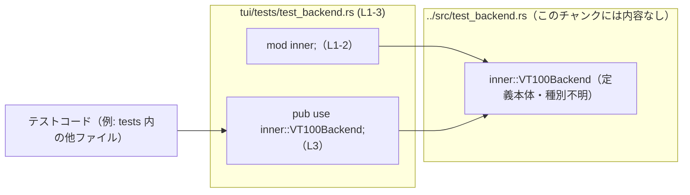

# tui/tests/test_backend.rs コード解説

## 0. ざっくり一言

`tui/tests/test_backend.rs` は、`../src/test_backend.rs` にある実装をテスト側から再利用するためにモジュールを読み込み、`VT100Backend` という名前で再公開（re-export）するための薄いラッパーファイルです（tui/tests/test_backend.rs:L1-3）。

---

## 1. このモジュールの役割

### 1.1 概要

- このファイルは、`#[path = "../src/test_backend.rs"]` 属性を使って `inner` モジュールを `../src/test_backend.rs` から読み込み（tui/tests/test_backend.rs:L1-2）、  
  その中の `VT100Backend` というアイテムを `pub use` で再公開します（tui/tests/test_backend.rs:L3）。
- これにより、テストコードから `crate::test_backend::VT100Backend` のような形で、`src` 側の実装を直接利用できる構造になっています（`test_backend` というモジュール名は、このファイル名から推測されますが、モジュールのインポート位置はこのチャンクには現れません）。

### 1.2 アーキテクチャ内での位置づけ

このファイルを中心に、テストコードと実装ファイルとの関係を示す依存関係図です。



- `inner` モジュールは `#[path = "../src/test_backend.rs"]` によって通常とは異なるパスから読み込まれます（tui/tests/test_backend.rs:L1-2）。
- テストコードは、このファイルが再公開する `VT100Backend` に依存することで、`../src/test_backend.rs` の実装に間接的に依存します。

### 1.3 設計上のポイント

コードから読み取れる設計上の特徴は次のとおりです。

- **再利用のための再公開**  
  実装ファイル `../src/test_backend.rs` 内の `VT100Backend` を、テスト専用のエントリポイントを通じて再公開する構造になっています（tui/tests/test_backend.rs:L1-3）。
- **モジュールパスの明示的な指定**  
  `#[path = "../src/test_backend.rs"]` により、通常のモジュール探索規則とは別に、明示的にファイルパスを指定しています（tui/tests/test_backend.rs:L1）。
- **状態・ロジックを持たない**  
  このファイル自体には関数、構造体、列挙体などのロジックや状態は定義されておらず、あくまでモジュールの読み込みと再公開のみを行います（tui/tests/test_backend.rs:L1-3）。
- **エラーハンドリングや並行性ロジックは無し**  
  例外処理・`Result`・スレッド／非同期処理の記述はこのチャンクには一切なく、コンパイル時に解決されるモジュール構成のみが記述されています（tui/tests/test_backend.rs:L1-3）。

---

## 2. 主要な機能一覧

このファイルが提供する「機能」はすべてコンパイル時のモジュール構成に関するものです。

- `inner` モジュールの読み込み: `../src/test_backend.rs` にあるモジュールを `inner` として定義する（tui/tests/test_backend.rs:L1-2）。
- `VT100Backend` の再公開: `inner` 内で定義されている `VT100Backend` をテスト側モジュール階層に公開する（tui/tests/test_backend.rs:L3）。

実行時の処理や関数呼び出しはこのファイル内には存在しません。

---

## 3. 公開 API と詳細解説

### 3.1 型・モジュール一覧（コンポーネントインベントリー）

このチャンクで識別できるコンポーネントを一覧にします。種別が判別できないものは「不明」としています。

| 名前 | 種別 | 役割 / 用途 | 定義位置（根拠） |
|------|------|-------------|------------------|
| `inner` | モジュール | `../src/test_backend.rs` をソースとする内部モジュール。`VT100Backend` を含むことが `pub use` から分かるが、内容はこのチャンクには現れない。 | `tui/tests/test_backend.rs:L1-2` |
| `VT100Backend` | 不明（構造体/列挙体/関数/トレイト等かは不明） | `inner` モジュール内に定義された何らかの公開アイテム。テストコードから利用できるよう再公開されている。 | `tui/tests/test_backend.rs:L3` |

> `VT100Backend` の具体的な型（構造体、列挙体、トレイト、関数など）は、`pub use inner::VT100Backend;` から存在が分かるのみで、`../src/test_backend.rs` の定義はこのチャンクには含まれていないため不明です。

### 3.2 関数詳細（最大 7 件）

- このファイルには関数定義が存在しません（tui/tests/test_backend.rs:L1-3）。
- そのため、詳細テンプレートを適用できる関数はありません。

### 3.3 その他の関数

- 補助関数やラッパー関数も定義されていません（tui/tests/test_backend.rs:L1-3）。

---

## 4. データフロー

このファイル自体には実行時のデータ処理はありませんが、「テストコードから `VT100Backend` を利用する」という観点での呼び出し関係をシーケンス図で示します。

```mermaid
sequenceDiagram
    participant T as テストコード<br/>（別ファイル）
    participant B as test_backend モジュール<br/>tui/tests/test_backend.rs (L1-3)
    participant I as inner::VT100Backend<br/>../src/test_backend.rs（本体）

    Note over B: #[path = \"../src/test_backend.rs\"]<br/>mod inner;（L1-2）
    Note over B: pub use inner::VT100Backend;（L3）

    T->>B: use crate::test_backend::VT100Backend;（このチャンクには現れない）
    B->>I: 再公開された VT100Backend を解決（コンパイル時）
    T->>I: VT100Backend のコンストラクタやメソッドを呼び出し（詳細不明）
```

要点:

- `tui/tests/test_backend.rs` で行っているのは、テストコードから `VT100Backend` へ直接アクセスできるようにするための「名前解決の橋渡し」であり（tui/tests/test_backend.rs:L3）、実行時のメソッド呼び出しやデータ変換は `../src/test_backend.rs` 側で行われます（このチャンクには現れません）。
- エラー処理・スレッド間通信など、実行時のデータフローに関する情報は、このファイルからは分かりません。

---

## 5. 使い方（How to Use）

### 5.1 基本的な使用方法

このファイルを通じて `VT100Backend` をテストコードから利用する典型的なパターンを示します。  
`VT100Backend` の具体的な API は不明なので、擬似的な例として表現します（定義は `../src/test_backend.rs` 側にある想定ですが、このチャンクには現れません）。

```rust
// テストコード側（例: tui/tests/some_test.rs）

// test_backend モジュールから VT100Backend をインポートする
use crate::test_backend::VT100Backend; // 再公開された名前を利用（tui/tests/test_backend.rs:L3 を経由）

#[test]
fn it_works_with_vt100_backend() {
    // ここで VT100Backend の具体的な初期化方法やメソッドは
    // ../src/test_backend.rs の定義に依存します（このチャンクには現れません）
    let backend = VT100Backend::new(/* ... */); // 仮の例

    // backend を使った処理をテストする
    // ...
}
```

- 上記のように、テストコードは `crate::test_backend::VT100Backend` というパスで型（または関数）を利用します。
- 実際にどのようなメソッドやフィールドが存在するかは、`../src/test_backend.rs` の内容を確認する必要があります。

### 5.2 よくある使用パターン

このファイルの用途から推測できる使用パターンは次のとおりですが、詳細な API は不明です。

- **統一されたテストバックエンドの利用**  
  - テスト全体で共通のバックエンド実装（ここでは `VT100Backend`）を使いたい場合、`use crate::test_backend::VT100Backend;` を各テストファイルで書くパターンが想定されます（再公開による利便性、tui/tests/test_backend.rs:L3）。
- **モック／スタブとしての利用**  
  - ファイル名や名前からは端末バックエンドのテスト用実装である可能性もありますが、コードからは断定できません。
  - 実際にモックかどうかは、`../src/test_backend.rs` の中身を確認する必要があります。

### 5.3 よくある間違い（想定されるもの）

コードから直接読み取れる誤用はありませんが、構造上起こり得る間違いとして、次のようなものがあります。

```rust
// 想定される誤り例: 直接 inner を使おうとする
// use crate::test_backend::inner::VT100Backend;
// ↑ inner モジュールは test_backend.rs で pub になっていないため、
//   こうしたパスは利用できない可能性が高い（tui/tests/test_backend.rs:L2）。

// 正しい例: 再公開された名前を使う
use crate::test_backend::VT100Backend;
```

- `inner` モジュール自体は `mod inner;` で宣言されているだけであり（tui/tests/test_backend.rs:L2）、`pub mod inner;` とは記述されていないため、テストコードからは `VT100Backend` のみが見える構造になっている可能性があります。
- 実際に `crate::test_backend` というモジュールがどう公開されているかは、このチャンクの外側（テストクレートのルート）に依存するため、最終的なパスはプロジェクト全体を確認する必要があります。

### 5.4 使用上の注意点（まとめ）

- **前提条件**
  - `../src/test_backend.rs` に `VT100Backend` という公開アイテムが存在している必要があります。存在しない場合、コンパイル時に名前解決エラーとなります（tui/tests/test_backend.rs:L3）。
- **ファイルパスの維持**
  - `#[path = "../src/test_backend.rs"]` に依存しているため、ファイル構成を変更するときはこのパスが実際の位置と一致していることを確認する必要があります（tui/tests/test_backend.rs:L1）。
- **型の詳細は別ファイル依存**
  - `VT100Backend` のメソッドやエラー処理、並行性の特性などは `../src/test_backend.rs` の内容に完全に依存しており、このファイルだけでは判断できません。

---

## 6. 変更の仕方（How to Modify）

### 6.1 新しい機能を追加する場合

このファイルの役割は再公開のみなので、「新しい機能」を追加する場合は、主に `../src/test_backend.rs` 側に実装を追加し、それを必要に応じて再公開する形になると考えられます。

一般的な手順の一例（このチャンクから推測できる範囲）:

1. `../src/test_backend.rs` に新しい型や関数を追加する（このチャンクには定義がないため、実際の場所は不明）。
2. そのアイテムをテスト側から利用したい場合、`tui/tests/test_backend.rs` に `pub use inner::NewItem;` のような行を追加して再公開する。
3. テストコードから `crate::test_backend::NewItem` をインポートして利用する。

このファイルに新しくロジック（関数本体など）を追加することは、現在の役割（単なる窓口）とは性質が異なるため、構造上の一貫性を考えると、実装は `../src/test_backend.rs` に置き、このファイルは再公開に徹するのが自然です。

### 6.2 既存の機能を変更する場合

`VT100Backend` の挙動や API を変更したい場合の観点です。

- **影響範囲の確認**
  - `../src/test_backend.rs` で `VT100Backend` の定義を変更すると、このファイルを経由して `VT100Backend` を使っているすべてのテストコードに影響します（tui/tests/test_backend.rs:L3）。
- **名前の変更**
  - `VT100Backend` の名前を変更した場合、`tui/tests/test_backend.rs` の `pub use inner::VT100Backend;` も合わせて変更する必要があります（tui/tests/test_backend.rs:L3）。
- **再公開の削除**
  - `pub use inner::VT100Backend;` を削除すると、テストコードからは `VT100Backend` にアクセスできなくなり、コンパイルエラーが発生します（tui/tests/test_backend.rs:L3）。
- **テストの再実行**
  - モジュールパスや公開 API の変更はテストのコンパイル／実行結果に直接影響するため、変更後は関連するすべてのテストを再実行する必要があります。

---

## 7. 関連ファイル

このファイルと密接に関係するファイル・ディレクトリは次のとおりです。

| パス | 役割 / 関係 |
|------|------------|
| `../src/test_backend.rs` | `#[path = "../src/test_backend.rs"]` で指定されている実装ファイル。`inner` モジュールの実体であり、その中に `VT100Backend` が定義されていることが `pub use inner::VT100Backend;` から分かります（tui/tests/test_backend.rs:L1-3）。 |
| `tui/tests/` 内の他のテストファイル | `use crate::test_backend::VT100Backend;` のように、このファイルが再公開する `VT100Backend` を利用している可能性があります（実際の使用箇所はこのチャンクには現れません）。 |

---

### Bugs / Security / エッジケースに関する補足

- **Bugs**  
  - このファイルに限って言えば、実行時バグの原因となるロジックは存在せず、主要なリスクは「パスがずれてコンパイルできなくなる」「`VT100Backend` が定義されていない」といったコンパイルエラーの形で表面化します（tui/tests/test_backend.rs:L1-3）。
- **Security**  
  - テスト用モジュールの再公開であり、外部からの入力処理や I/O、スレッド等の記述はないため、このファイル単体からセキュリティ上の懸念を読み取ることはできません。
- **エッジケース**  
  - `../src/test_backend.rs` の場所を変更したが `#[path]` を更新しなかった場合、モジュールが見つからずコンパイルエラーになる可能性があります（tui/tests/test_backend.rs:L1）。
  - `../src/test_backend.rs` から `VT100Backend` が削除された場合も、`pub use inner::VT100Backend;` によりコンパイルエラーが発生します（tui/tests/test_backend.rs:L3）。

このファイルは非常に薄いラッパーであり、公開 API とコアロジックはすべて `../src/test_backend.rs` 側に存在しているため、詳細なエラー処理・並行性・性能といった観点は、そちらのファイルを参照する必要があります。
