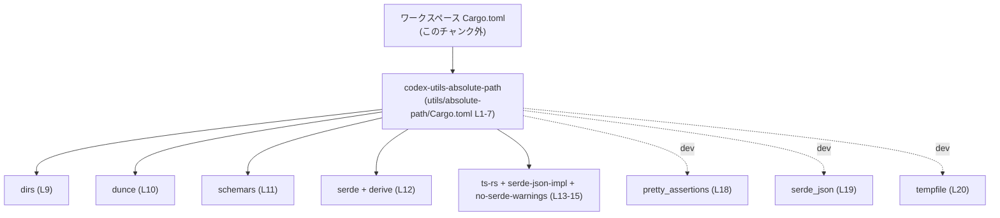
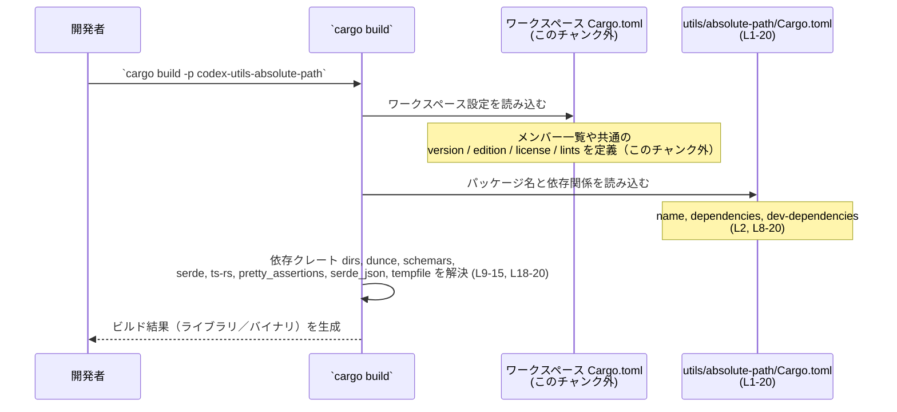

# utils/absolute-path/Cargo.toml コード解説

## 0. ざっくり一言

`utils/absolute-path/Cargo.toml` は、クレート `codex-utils-absolute-path` の **Cargo マニフェスト**であり、パッケージ名やワークスペース設定、依存クレート・開発用依存クレートを定義しています（根拠: `utils/absolute-path/Cargo.toml:L1-5, L8-20`）。

---

## 1. このモジュールの役割

### 1.1 概要

- このファイルは、Rust のビルドツール Cargo に対して、  
  `codex-utils-absolute-path` クレートの **パッケージ情報** と **依存関係** を伝えるために存在します（根拠: `[package]` セクションと `name` 行 `L1-2`、`[dependencies]` セクション `L8-16`）。
- バージョン・エディション・ライセンス・リント設定は、すべて上位の **ワークスペース設定に委譲**されています（根拠: `version.workspace`, `edition.workspace`, `license.workspace`, `lints.workspace` `L3-5, L6-7`）。

このファイル自体は **Rust コード（関数・型）を含まない**ため、公開 API やコアロジックの詳細は **このチャンクからは分かりません**。

### 1.2 アーキテクチャ内での位置づけ

このクレートはワークスペースの一員であり、ワークスペース共通の設定と依存解決に従います（根拠: `version.workspace = true` など `L3-5, L7, L9-19`）。

依存関係の概要は次のとおりです（一般的な用途は各クレートの公式ドキュメントに基づく一般知識であり、このファイル内での具体的な使われ方は不明です）:

- `dirs`: OS ごとのユーザディレクトリなどを取得するユーティリティ（根拠: `L9`）
- `dunce`: Windows のパス正規化（UNC パス等）に関するユーティリティ（根拠: `L10`）
- `schemars`: Rust 型から JSON Schema を生成するためのクレート（根拠: `L11`）
- `serde`（`derive` 機能付き）: シリアライズ／デシリアライズフレームワーク（根拠: `L12`）
- `ts-rs`（`serde-json-impl`, `no-serde-warnings` 機能付き）: Rust 型から TypeScript 型定義を生成するクレート（根拠: `L13-15`）
- 開発用:
  - `pretty_assertions`: テスト失敗時の差分を見やすく表示（根拠: `L18`）
  - `serde_json`: JSON のシリアライズ／デシリアライズ（根拠: `L19`）
  - `tempfile`: 一時ファイル／一時ディレクトリ作成（根拠: `L20`）

これを依存関係図として表現すると、次のようになります。



- 実際の **関数呼び出し関係やデータフロー** は `src/` 以下の Rust コードに依存しますが、そのコードはこのチャンクには現れないため、ここでは **依存レベルの関係のみ**を示しています。

### 1.3 設計上のポイント

この Cargo.toml から読み取れる設計上の特徴は次のとおりです。

- **ワークスペース一元管理**
  - バージョン・エディション・ライセンスは `*.workspace = true` でワークスペースに委譲されています（根拠: `L3-5`）。
  - リント設定も `[lints] workspace = true` で共通化されています（根拠: `L6-7`）。
- **依存バージョンの共通化**
  - すべての依存と開発用依存が `{ workspace = true }` として宣言されており、依存クレートのバージョンはワークスペース側で一括管理されます（根拠: `L9-12, L13-15, L18-20`）。
- **シリアライズ／スキーマ／TypeScript 連携を前提とした設計の可能性**
  - `serde`, `schemars`, `ts-rs` が併用されているため、「Rust 型 → JSON Schema → TypeScript 型」という連携を行う構成に適していると考えられますが、実際にそうなっているかはコードがないため断定できません（根拠: 依存クレート列挙 `L11-15`）。
- **テスト・開発支援クレートの導入**
  - 差分の見やすい assertion や JSON, 一時ファイル操作を使ったテストが書きやすい構成になっていますが、具体的なテスト内容はこのチャンクには現れません（根拠: `L18-20`）。

---

## 2. 主要な機能一覧

このファイルは設定ファイルであり、実行時の「関数機能」ではなく、**プロジェクト構成上の機能**を提供します。

### 2.1 コンポーネント一覧（インベントリー）

Cargo.toml 内の主要コンポーネントを一覧化します。

| コンポーネント | 種別 | 内容 / 役割 | 行範囲 |
|----------------|------|-------------|--------|
| `[package]` | セクション | クレート名と、version・edition・license のワークスペース委譲を定義 | `utils/absolute-path/Cargo.toml:L1-5` |
| `name = "codex-utils-absolute-path"` | 設定項目 | このクレートの Cargo 上のパッケージ名 | `L2` |
| `version.workspace = true` | 設定項目 | バージョンをワークスペースの共通設定から取得 | `L3` |
| `edition.workspace = true` | 設定項目 | Rust エディションをワークスペースから取得 | `L4` |
| `license.workspace = true` | 設定項目 | ライセンス表記をワークスペースから取得 | `L5` |
| `[lints]` | セクション | リント設定のセクション | `L6` |
| `workspace = true`（lints セクション） | 設定項目 | リント設定をワークスペースから継承 | `L7` |
| `[dependencies]` | セクション | 実行時依存クレートの宣言 | `L8-16` |
| `dirs` | 依存 | ワークスペース管理の `dirs` クレート | `L9` |
| `dunce` | 依存 | ワークスペース管理の `dunce` クレート | `L10` |
| `schemars` | 依存 | ワークスペース管理の `schemars` クレート | `L11` |
| `serde` | 依存 | `derive` 機能付きの `serde` クレート | `L12` |
| `ts-rs` | 依存 | `serde-json-impl`, `no-serde-warnings` 機能付きの `ts-rs` クレート | `L13-15` |
| `[dev-dependencies]` | セクション | テスト・開発用依存クレートの宣言 | `L17-20` |
| `pretty_assertions` | dev 依存 | 差分表示を改善したアサーションライブラリ | `L18` |
| `serde_json` | dev 依存 | JSON のシリアライズ／デシリアライズライブラリ | `L19` |
| `tempfile` | dev 依存 | 一時ファイル・ディレクトリ作成ライブラリ | `L20` |

### 2.2 このファイルが提供する主な「機能」

- **パッケージメタデータの宣言**  
  - クレート名の定義と、バージョン・エディション・ライセンスをワークスペースに委譲します（根拠: `L2-5`）。
- **ワークスペース共通リント設定の適用**  
  - コード品質チェック（lint）のルールをワークスペースと共有します（根拠: `L6-7`）。
- **実行時依存クレートの定義**  
  - `dirs`, `dunce`, `schemars`, `serde`, `ts-rs` など、このクレートの機能を実装するために必要な外部クレートを宣言します（根拠: `L8-15`）。
- **開発／テスト用依存クレートの定義**  
  - テストや開発支援のために使用するクレートを宣言します（根拠: `L17-20`）。

---

## 3. 公開 API と詳細解説

このファイルは **TOML 形式の設定ファイル**であり、Rust の **関数・構造体・列挙体の定義は一切含まれていません**。  
したがって、公開 API やコアロジックそのものは **このチャンクからは特定できません**。

ここでは、テンプレートに従い「型一覧」や「関数詳細」の項目を示しますが、内容は「該当なし」であることを明示します。

### 3.1 型一覧（構造体・列挙体など）

| 名前 | 種別 | 役割 / 用途 |
|------|------|-------------|
| なし | - | `utils/absolute-path/Cargo.toml` には Rust の型定義は含まれていません |

- 実際の型（構造体・列挙体・型エイリアスなど）は、通常 `src/` 配下の Rust ファイル（例: `src/lib.rs` や `src/main.rs`）に定義されますが、それらはこのチャンクには現れません。

### 3.2 関数詳細（最大 7 件）

- このファイルには Rust の関数定義が一切含まれていません。  
  よって、関数ごとの引数・戻り値・エラーハンドリング・エッジケースなどの詳細は **このチャンクだけでは分析できません**。

> このクレートが実際に提供する公開関数やメソッドは、  
> 別ファイル（例: `src/lib.rs` 等、パスはこのチャンクでは不明）を参照する必要があります。

### 3.3 その他の関数

- 補助的な関数やラッパー関数に関する情報も、この Cargo.toml には含まれていません。  
  したがって、このセクションも **該当なし**です。

---

## 4. データフロー

このファイル自体には実行時のデータ処理は存在しないため、  
ここでは **ビルド時に Cargo がこのファイルをどのように利用するか** という観点で「フロー」を示します。

### 4.1 Cargo によるビルド時のフロー



- この図は **ビルド時の設定読み込みフロー**に限定しており、  
  実際の関数呼び出しや並行処理のフローは、このチャンクに現れない `src/` 以下のコードに依存します。
- Rust 言語固有の安全性（所有権・借用・ライフタイム）やエラーハンドリング（`Result` など）、並行性（スレッド・`async`）についても、**Cargo.toml からは判断できません**。

---

## 5. 使い方（How to Use）

ここでは、「この Cargo.toml が存在するクレートをどのように利用・拡張するか」という観点で説明します。

### 5.1 基本的な使用方法

1. **ワークスペースメンバーとして利用する**

   このクレートは `version.workspace = true` などを使っているため、  
   上位のワークスペース Cargo.toml に「メンバー」として登録されていることが前提です（根拠: `L3-5, L7, L9-19`）。

   ルート Cargo.toml（このチャンク外）では、一般的には次のようなメンバー指定が存在します（例であり、このリポジトリにそう書かれているかは不明です）。

   ```toml
   # 例: ルートの Cargo.toml（このチャンク外）でのメンバー定義
   [workspace]
   members = [
       "utils/absolute-path", # このパスはファイルパスから推定した例
   ]
   ```

2. **他クレートから依存として使う**

   同じワークスペース内の別クレートから、このクレートに依存したい場合の一般的な記述例です  
   （実際のパスやバージョン指定はプロジェクトごとに異なります）。

   ```toml
   # 例: 別クレートの Cargo.toml から依存する場合
   [dependencies]
   codex-utils-absolute-path = { path = "../utils/absolute-path" }
   ```

   - 上記はあくまで「典型例」であり、**このチャンクにこう書かれているわけではありません**。

### 5.2 よくある使用パターン

- **依存クレートの追加**
  - 新しい機能を実装する際に外部クレートが必要になった場合、`[dependencies]` に依存を追加します。
  - このワークスペースでは `{ workspace = true }` を使う方針なので、通常はまず **ワークスペース側**で依存を追加し、このファイル側でも `foo = { workspace = true }` のように書きます（根拠: 既存依存がすべて `workspace = true` を使っていること `L9-15, L18-20`）。
- **機能フラグ（features）の調整**
  - `serde` や `ts-rs` のように `features = [...]` が指定されている依存について、機能を追加／削除することで生成されるコードや挙動を変えることができます（根拠: `L12-15`）。

### 5.3 よくある間違い

このファイルの構造から起こりやすい誤用例と、その対策を示します。

```toml
# 誤りの例: ワークスペース方針に反して version を直接書いてしまう

[dependencies]
serde = "1.0"  # ← 他のクレートでは workspace 管理になっているのに、ここだけ固定バージョン

# 正しい例（このプロジェクトの方針に合わせる場合）

[dependencies]
serde = { workspace = true, features = ["derive"] }
```

- このプロジェクトでは、既存の依存すべてが `{ workspace = true }` を使っているため（根拠: `L9-15, L18-20`）、  
  ここだけ直接バージョンを指定すると、**ワークスペース全体のバージョン整合性が崩れる**おそれがあります。

### 5.4 使用上の注意点（まとめ）

- **ワークスペースとの整合性**
  - `*.workspace = true` の項目は、すべてワークスペース側の設定が存在していることが前提です。  
    ワークスペース側で該当項目を削除すると、このクレートのビルド時にエラーになる可能性があります。
- **依存クレートの機能（features）を変更する際の影響**
  - `serde` の `derive` を外す、`ts-rs` の features を変えるなどを行うと、実際のコード（このチャンク外）で  
    `#[derive(Serialize, Deserialize)]` や `#[ts(export)]` のようなマクロ利用部分がコンパイルエラーになる可能性があります。
- **言語固有の安全性・エラー・並行性**
  - このファイルは設定ファイルであり、Rust の所有権/借用、`Result`/`Option` によるエラーハンドリング、  
    スレッドや `async` による並行性といった **言語レベルの安全性機構とは直接関係しません**。  
    それらの扱いは、実際の Rust コード側（このチャンク外）を確認する必要があります。

---

## 6. 変更の仕方（How to Modify）

### 6.1 新しい機能を追加する場合

新しい機能をクレートに追加する際、Cargo.toml での作業は主に **依存クレートの追加**です。

1. **必要な外部クレートを決める**
   - 例: 新たにファイル監視機能を入れたい場合など（具体例は一般論であり、このプロジェクト特有ではありません）。

2. **ワークスペースの Cargo.toml に依存を追加**
   - このプロジェクトは `{ workspace = true }` を使っているため、通常はルートの `[workspace.dependencies]` 等に追加します（根拠: 既存依存がすべて `workspace = true` を用いている `L9-15, L18-20`）。
   - ルート側の定義はこのチャンクには現れないため、実際の書き方はルート Cargo.toml を確認する必要があります。

3. **このファイルの `[dependencies]` にもエントリを追加**

   ```toml
   [dependencies]
   # 既存
   dirs = { workspace = true }
   # ...
   # 新規追加
   notify = { workspace = true } # 例: ファイル監視クレートをワークスペース側で定義している場合
   ```

4. **Rust コード側でそのクレートを利用する**
   - 実際の API 呼び出しやエラーハンドリングは `src/` 以下のコードで行います（このチャンクには現れません）。

### 6.2 既存の機能を変更する場合

既存機能の変更に関連して Cargo.toml を触るのは、主に次のパターンです。

- **依存クレートの削除**
  - ある外部クレートを完全に使わなくなった場合:
    - まず Rust コードからそのクレートの利用箇所をすべて削除する（このチャンク外）。
    - その上で `[dependencies]` または `[dev-dependencies]` から該当行を削除します（根拠: 依存宣言 `L8-15, L18-20`）。
- **依存クレートの機能（features）の変更**
  - 例: `ts-rs` で `no-serde-warnings` を外したい場合、`features` 配列からその文字列を削除します（根拠: `L13-15`）。
  - この際、ビルドログに出る警告内容や生成される TypeScript 定義の変化を確認する必要がありますが、それはこのチャンク外の話です。

いずれの場合も、**Cargo.toml の変更だけで完結することは少なく**、  
実際の Rust コードとの整合性を常に確認する必要があります。

---

## 7. 関連ファイル

この Cargo.toml と密接に関係すると考えられるファイルをまとめます。

| パス | 役割 / 関係 |
|------|------------|
| ルートの `Cargo.toml`（正確なパスはこのチャンクには現れない） | ワークスペース定義と共通の `version`, `edition`, `license`, `lints`, および `workspace = true` な依存の実体を定義しているはずです（根拠: 本ファイル内の `*.workspace = true` 設定 `L3-5, L7, L9-19`）。 |
| `utils/absolute-path/Cargo.toml` | 本ドキュメントの対象ファイル。`codex-utils-absolute-path` クレートのマニフェスト。 |
| このクレートの `src/` 以下の Rust ファイル（具体的なパス名はこのチャンクには現れない） | 実際の公開 API（関数・構造体・列挙体）とコアロジックが定義されている場所です。Cargo.toml からはそれらの内容は分かりません。 |
| テストコード（例: `tests/` や `src/` 内の `mod tests` 等。正確なパスはこのチャンクには現れない） | `pretty_assertions`, `serde_json`, `tempfile` といった dev-dependencies を利用するテストが書かれていると推測されますが、実際のテスト内容はこのチャンクには現れません（根拠: dev-dependencies `L17-20`）。 |

---

### Bugs / Security / Edge Cases / Tests についての補足

- **バグ・セキュリティ**
  - この Cargo.toml からは、依存クレートのバージョン番号や既知の脆弱性の有無は読み取れません（`workspace = true` のため）。  
    セキュリティ上の問題がないかを判断するには、ワークスペース全体の依存解決結果に対して `cargo audit` 等を実行する必要があります。
- **契約（Contracts）・エッジケース**
  - このファイルは設定のみを記述しており、「入力が空」「境界値」などのランタイムのエッジケースはここからは分かりません。
  - 一方で、「ワークスペース側で該当設定が定義されていること」が暗黙の前提条件になっています（`*.workspace = true` の項目）。
- **テスト**
  - `pretty_assertions`, `serde_json`, `tempfile` から、テストで差分比較・JSON・一時ファイルを扱う可能性はありますが、  
    具体的なテストケースやカバレッジはこのチャンクには現れません。
- **パフォーマンス・スケーラビリティ / 並行性**
  - 依存クレートに起因するパフォーマンス特性や並行性の扱いは、実際の Rust コード側に依存します。  
    Cargo.toml 単体からは、それらを評価することはできません。

以上が、`utils/absolute-path/Cargo.toml` から **確認できる範囲だけ** に基づく解説です。
