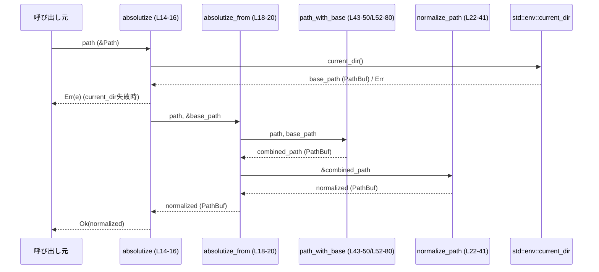

# utils/absolute-path/src/absolutize.rs コード解説

## 0. ざっくり一言

`Path` を基準ディレクトリに対して結合し、`.` や `..` を正規化して「絶対パス風」の `PathBuf` を生成するユーティリティです（Windows/非Windowsで処理を分岐）。  
カレントディレクトリを使う `absolutize` だけが I/O 由来の失敗しうる API で、それ以外はパス操作のみで完結します（根拠: absolutize.rs:L5-8, L14-20）。

---

## 1. このモジュールの役割

### 1.1 概要

- このモジュールは、**相対パスと基準パスから安全に絶対パス風のパスを構築し、パス区切り要素を正規化する**ために存在します。  
- `AbsolutePathBuf::resolve_path_against_base` や `AbsolutePathBuf::join` から利用されることを意図しており（コメントより）、**明示的な基準パスを与えた場合は決して失敗しない正規化**を提供します（根拠: absolutize.rs:L5-8, L18-20）。
- カレントディレクトリを基準にする `absolutize` のみ、`std::env::current_dir` に依存するため `std::io::Result` を返します（根拠: absolutize.rs:L14-16）。

### 1.2 アーキテクチャ内での位置づけ

このファイル単体で見える依存関係は次の通りです。

- 呼び出し元（例: `AbsolutePathBuf` メソッド群） → `absolutize` / `absolutize_from`
- `absolutize` → `std::env::current_dir`
- `absolutize_from` → `path_with_base` → `normalize_path`
- `path_with_base` は `cfg(not(windows))` と `cfg(windows)` で別実装（根拠: absolutize.rs:L43-80）

```mermaid
flowchart TD
    Caller["呼び出し元（例: AbsolutePathBuf）<br/>（このチャンクには定義なし）"]
    A["absolutize(path) (L14-16)"]
    B["absolutize_from(path, base_path) (L18-20)"]
    C["path_with_base(...) (L43-50 非Windows / L52-80 Windows)"]
    D["normalize_path(path) (L22-41)"]
    E["std::env::current_dir() (標準ライブラリ)"]

    Caller -->|相対/絶対Path| A
    Caller -->|明示的なbase付き| B
    A -->|基準: current_dir()| E
    A --> B
    B --> C
    C --> D
```

> `Caller`（呼び出し元）はコメントに現れる `AbsolutePathBuf` などであり、このチャンクには実装が存在しません（根拠: absolutize.rs:L5-7）。

### 1.3 設計上のポイント

- **明示的な基準パスのときは必ず成功する設計**  
  - `absolutize_from`・`normalize_path`・`path_with_base` は `Result` を返さず、パス操作のみで完結します（根拠: absolutize.rs:L18-20, L22-41, L43-80）。
- **プラットフォーム依存のパス解釈をラップ**  
  - `path_with_base` は `cfg(not(windows))` と `cfg(windows)` で別実装になっており、Windows のプレフィックスやルート相対パスを考慮しています（根拠: absolutize.rs:L43, L52）。
- **`.` / `..` の正規化を自前で実装**  
  - `normalize_path` が `Component` の列挙（`CurDir`, `ParentDir`, `RootDir`, `Prefix`, `Normal`）に対して手続き的に処理することで、ファイルシステムへの問い合わせなしにパスを正規化します（根拠: absolutize.rs:L22-41）。
- **ルートより上には行かない「サチュレート（飽和）型」の `..` 処理**  
  - ルートからの相対パスで `..` がルートより上を指す場合でも、結果はルートからの絶対パスにとどまることがテストで確認できます（根拠: absolutize.rs:L134-138）。

---

## 2. 主要な機能一覧（コンポーネントインベントリー）

このファイルに現れる関数・モジュールの一覧です。

### 2.1 関数・モジュール一覧

| 名前 | 種別 | 役割 / 用途 | 可視性 | 行範囲 |
|------|------|-------------|--------|--------|
| `absolutize` | 関数 | カレントディレクトリを基準に `Path` を絶対パス風に変換する | `pub(super)` | absolutize.rs:L14-16 |
| `absolutize_from` | 関数 | 明示的な基準パス (`base_path`) を使って絶対パス風に変換する | `pub(super)` | absolutize.rs:L18-20 |
| `normalize_path` | 関数 | `.` / `..` / ルートなどを処理してパスを正規化する中核ロジック | `fn`（モジュール内限定） | absolutize.rs:L22-41 |
| `path_with_base` (非Windows) | 関数 | 非Windowsで、相対パスに基準パスを結合する | `fn`（モジュール内限定） | absolutize.rs:L43-50 |
| `path_with_base` (Windows) | 関数 | Windowsで、プレフィックスやルート相対パスを考慮しつつ基準パスと結合する | `fn`（モジュール内限定） | absolutize.rs:L52-80 |
| `tests` モジュール | テストモジュール | Unix/Windows別に、本モジュールの期待される振る舞いを検証する | `#[cfg(test)] mod` | absolutize.rs:L82-167 |

※ 他モジュール（例: `AbsolutePathBuf`）からの呼び出しはコメントにのみ登場し、このチャンクには実際の定義がありません（根拠: absolutize.rs:L5-7）。

---

## 3. 公開 API と詳細解説

### 3.1 型一覧（構造体・列挙体など）

このファイル自身は新しい構造体や列挙体を定義していません。  
標準ライブラリの以下の型を主に扱います。

| 名前 | 種別 | 役割 / 用途 | 根拠 |
|------|------|-------------|------|
| `Path` | 構造体（標準ライブラリ） | 参照型のパス表現。引数として利用 | absolutize.rs:L14, L18, L22, L44, L53 |
| `PathBuf` | 構造体（標準ライブラリ） | 所有型のパス表現。結果として返却・中間値として利用 | absolutize.rs:L12, L14, L18, L22-23 |
| `Component` | 列挙体（標準ライブラリ） | パスを要素ごとに分解した列挙体。`.` や `..` などの識別に利用 | absolutize.rs:L10, L24-31, L59, L71 |

### 3.2 関数詳細

#### `absolutize(path: &Path) -> std::io::Result<PathBuf>`

**概要**

- 呼び出し時点のカレントディレクトリ（プロセスの作業ディレクトリ）を基準に、`path` を絶対パス風の `PathBuf` に変換します（根拠: absolutize.rs:L14-16）。

**引数**

| 引数名 | 型 | 説明 |
|--------|----|------|
| `path` | `&Path` | 絶対化したいパス。絶対パス・相対パス・空文字列いずれも許容 |

**戻り値**

- `std::io::Result<PathBuf>`  
  - `Ok(PathBuf)`: 正常にカレントディレクトリを取得し、`absolutize_from` による変換が完了した場合の結果パス（根拠: absolutize.rs:L14-15）。  
  - `Err(e)`: `std::env::current_dir()` の呼び出しが失敗した場合の I/O エラー（根拠: absolutize.rs:L14-15）。

**内部処理の流れ**

1. `std::env::current_dir()` で現在の作業ディレクトリを取得する（根拠: absolutize.rs:L14-15）。
2. 取得に成功した場合、そのパスへの参照を `absolutize_from(path, &current_dir)` に渡す（根拠: absolutize.rs:L14-15）。
3. `absolutize_from` からの `PathBuf` を `Ok` で包んで返す（根拠: absolutize.rs:L14-16）。

**Examples（使用例）**

```rust
use std::path::{Path, PathBuf};

// 相対パス "src/lib.rs" をカレントディレクトリ基準で絶対化する例
fn example() -> std::io::Result<PathBuf> {
    let relative = Path::new("src/lib.rs");            // 絶対化したい相対パス
    let absolute = utils::absolute_path::absolutize(relative)?; 
    // ↑ カレントディレクトリと結合し、"." や ".." を正規化した PathBuf が返る
    Ok(absolute)
}
```

※ 上記のモジュールパス `utils::absolute_path` は仮の例です。このチャンクからは実際のクレート構成は分かりません。

**Errors / Panics**

- `Errors`  
  - `std::env::current_dir()` が失敗した場合に `Err(std::io::Error)` を返します（例: カレントディレクトリへのアクセス権がない場合など）（根拠: absolutize.rs:L14-15）。
- `Panics`  
  - この関数自体には明示的な `panic!` や `unwrap` はなく、標準ライブラリ呼び出しも通常はパニックを起こさないため、通常利用においてパニック要因はありません（根拠: absolutize.rs:L14-16）。

**Edge cases（エッジケース）**

- `path` が空 (`Path::new("")`) の場合  
  - `absolutize_from` 内の `path_with_base` が基準パスのみを返し、結果はカレントディレクトリの正規化結果になります（テストの `empty_path_uses_base` と同様の挙動を想定）（根拠: absolutize.rs:L43-50, L143-147）。
- `path` が既に絶対パスの場合  
  - カレントディレクトリには依存せず、そのパスが `normalize_path` に渡され、`.` / `..` の除去だけが行われます（根拠: absolutize.rs:L18-20, L43-50）。

**使用上の注意点**

- 並行性  
  - `std::env::current_dir()` はプロセス全体の状態を読むため、別スレッドがカレントディレクトリを変更している場合、結果が変化する可能性があります。ただし、この関数内では値を取得した時点で固定され、その後は共有状態を参照しません。
- セキュリティ  
  - この関数はファイルシステムの存在確認やシンボリックリンクの解決を行いません。パスの正規化は **文字列レベル** でのみ行われるため、「実際にどのファイルを指すか」は OS の解釈に依存します。

---

#### `absolutize_from(path: &Path, base_path: &Path) -> PathBuf`

**概要**

- 与えられた基準パス `base_path` を使って `path` を絶対パス風の `PathBuf` に変換し、`.` や `..` を取り除いて正規化します（根拠: absolutize.rs:L18-20, L22-41, L43-80）。

**引数**

| 引数名 | 型 | 説明 |
|--------|----|------|
| `path` | `&Path` | 絶対化・正規化したいパス |
| `base_path` | `&Path` | `path` が相対パスだったときに使用する基準パス |

**戻り値**

- `PathBuf`  
  - `path` が絶対パスの場合は、それを正規化したパス。  
  - `path` が相対パスの場合は、`base_path` と結合したものを正規化したパス。  
  - この関数は I/O を行わず、**常に成功します**（根拠: absolutize.rs:L18-20）。

**内部処理の流れ**

1. `path_with_base(path, base_path)` を呼び出し、パスと基準パスから結合結果を作成（プラットフォームごとに挙動が異なる）（根拠: absolutize.rs:L18-19, L43-80）。
2. その結果への参照を `normalize_path` に渡し、`.` / `..` を処理して正規化した `PathBuf` を得る（根拠: absolutize.rs:L18-20, L22-41）。
3. 正規化された `PathBuf` を返す。

**Examples（使用例）**

Unix を前提とした例です。

```rust
use std::path::{Path, PathBuf};

fn example_unix() {
    let base = Path::new("/base/cwd");                 // 基準パス（絶対パス）
    let rel  = Path::new("../path/./to/../file");      // 相対パス with "." と ".."
    let abs  = absolutize_from(rel, base);             // "/base/path/file" になることが期待される

    assert!(abs.is_absolute());                        // 絶対パスであることの確認（Unixでは先頭が"/"）
}
```

**Errors / Panics**

- `Errors`  
  - 返り値は `PathBuf` のみであり、エラー型を返しません。
- `Panics`  
  - 実装中に `unwrap` や `expect` はなく、全ての標準ライブラリ呼び出しは通常の入力に対してパニックを発生させません（根拠: absolutize.rs:L18-20）。

**Edge cases（エッジケース）**

- `path` が空 (`Path::new("")`) の場合  
  - 非Windows: `base_path.join(path)` が `base_path` をそのまま返し、`normalize_path` によって（必要なら）`.` / `..` が処理されます（根拠: absolutize.rs:L43-50, L143-147）。  
  - Windows: `path.components().next()` が `None` となり、`base_path.join(path)` が返ります（根拠: absolutize.rs:L58-60）。
- `path` が絶対パスの場合  
  - 非Windows: `path.is_absolute()` が `true` となり、`base_path` は無視されます（根拠: absolutize.rs:L43-46）。  
  - Windows: `path.is_absolute()` または `path.has_root()` が `true` の場合、`base_path.join(path)` による Windows 固有の結合規則が適用されます（根拠: absolutize.rs:L53-56, L152-156）。
- `..` によってルートより上に出るケース（Unix）  
  - `"/"` を基準に `"../../path/to/123/456"` を正規化した結果が `"/path/to/123/456"` になることがテストで保証されています（根拠: absolutize.rs:L134-138）。  
    - これは `normalize_path` 内で `Component::ParentDir` 時に `PathBuf::pop()` を用いることで、ルートからさらに上には進まないような挙動になっているためです（根拠: absolutize.rs:L27-28）。

**使用上の注意点**

- この関数は **ファイルシステムにアクセスしません**。  
  - シンボリックリンクの解決や実在するかどうかのチェックは行われません。  
  - セキュリティ用途で使用する場合、「パスを文字列レベルで正規化する」機能に限定される点に注意が必要です。
- `base_path` は通常、絶対パスであることが期待されます。相対パスを渡すことも技術的には可能ですが、結果の解釈は呼び出し側に委ねられます（この点はコードからは制約が読み取れません）。

---

#### `normalize_path(path: &Path) -> PathBuf`

**概要**

- `Path::components()` で分解したパス要素を走査し、`.` を削除し `..` を「一つ前の要素を消す」ことで処理し、ルートやプレフィックスを維持しつつ正規化された `PathBuf` を返す関数です（根拠: absolutize.rs:L22-41）。

**引数**

| 引数名 | 型 | 説明 |
|--------|----|------|
| `path` | `&Path` | 正規化対象のパス |

**戻り値**

- `PathBuf`  
  - 全ての `.` 要素が削除され、`..` が可能な限り前の要素を削除した結果。  
  - 全ての要素が削除されて空になった場合は `"."` を表す `PathBuf` が返ります（根拠: absolutize.rs:L36-40）。

**内部処理の流れ**

1. 空の `PathBuf` を `normalized` として作成する（根拠: absolutize.rs:L22-23）。
2. `for component in path.components()` でパスの各 `Component` を順に処理する（根拠: absolutize.rs:L24-25）。
3. `Component::CurDir` (`"."`) の場合は何もしない（スキップ）（根拠: absolutize.rs:L26）。
4. `Component::ParentDir` (`".."`) の場合は `normalized.pop()` を呼び、直前に追加されたコンポーネントを削除する（根拠: absolutize.rs:L27-28）。  
   - ルートにいる状態で `pop()` しても、結果がルートより上に行かないことがテストから分かります（根拠: absolutize.rs:L134-138）。
5. `Component::Prefix(_) | Component::RootDir | Component::Normal(_)` の場合は、そのまま `normalized.push(component.as_os_str())` で追加する（根拠: absolutize.rs:L30-31）。
6. ループ終了後、`normalized` が空なら `"."` を意味する `PathBuf::from(".")` を返し、それ以外の場合は `normalized` をそのまま返す（根拠: absolutize.rs:L36-40）。

**Examples（使用例）**

```rust
use std::path::{Path, PathBuf};

fn normalized_example() -> PathBuf {
    let raw = Path::new("/path/to/./../dir/../file");  // "." と ".." を含むパス
    let normalized = normalize_path(raw);              // "/path/file" になることが期待される
    normalized
}
```

**Errors / Panics**

- エラー型は返さず、`panic!` も使用していません（根拠: absolutize.rs:L22-41）。
- `PathBuf::pop()` や `push()` も通常の使用ではパニックを起こさないため、入力パスがどのようなものであってもパニックしない設計になっています。

**Edge cases（エッジケース）**

- すべてが `.` の場合  
  - 例えば `"././."` のようなパスは、すべて `CurDir` として無視されるため、`normalized` は空のままになり、結果は `"."` になります（根拠: absolutize.rs:L26, L36-40）。
- 先頭から `".."` が続く相対パス  
  - `"../../path"` のような相対パスの場合、最初は `normalized` が空なので `pop()` は何も削除せず、最終的には `"path"` のような相対パスとして残る挙動になります（コード構造からの推論: absolutize.rs:L23-28, L36-40）。
- 絶対パスでルートから上への `".."`  
  - `"/"` を基準に `"../../path/to/..."` を正規化しても、結果が `"/path/to/..."` に留まることがテストで確認されており、ルートより上へは行きません（根拠: absolutize.rs:L134-138）。

**使用上の注意点**

- シンボリックリンクやハードリンクは考慮されません。  
  - `"dir/../file"` のようなパスは、単純に `"file"` として扱われますが、実際のファイルシステム上ではリンク構造によって異なるファイルを指している可能性があります。
- Windows では `Prefix`（ドライブレターや UNC など）と `RootDir` がそのまま保持されるため、OS のパス解釈に依存した結果を返します（根拠: absolutize.rs:L30-31）。

---

#### `path_with_base(path: &Path, base_path: &Path) -> PathBuf`（非Windows版）

**概要**

- 非Windows環境で、`path` が絶対パスかどうかを確認し、相対パスなら `base_path` と結合したパスを返します（根拠: absolutize.rs:L43-50）。

**引数**

| 引数名 | 型 | 説明 |
|--------|----|------|
| `path` | `&Path` | 結合対象のパス |
| `base_path` | `&Path` | 相対パスのときに使用する基準パス |

**戻り値**

- `PathBuf`  
  - `path` が絶対パスなら `path.to_path_buf()` を返す。  
  - `path` が相対パスなら `base_path.join(path)` を返す（根拠: absolutize.rs:L44-48）。

**内部処理の流れ**

1. `path.is_absolute()` をチェック（根拠: absolutize.rs:L45）。
2. `true` の場合は `path.to_path_buf()` を返す（根拠: absolutize.rs:L45-46）。
3. `false` の場合は `base_path.join(path)` を返す（根拠: absolutize.rs:L47-48）。

**使用上の注意点**

- 空パス (`Path::new("")`) は `is_absolute()` が `false` となり、`base_path.join("")` が `base_path` を返すため、「基準パスをそのまま返す」という挙動になります（根拠: absolutize.rs:L43-50, L143-147）。
- 戻り値はそのまま `normalize_path` に渡される想定であり、この関数自身は `.` / `..` の処理を行いません（根拠: absolutize.rs:L18-20）。

---

#### `path_with_base(path: &Path, base_path: &Path) -> PathBuf`（Windows版）

**概要**

- Windows環境で、ドライブプレフィックスやルート相対パスを考慮しつつ、`path` と `base_path` を結合します（根拠: absolutize.rs:L52-80）。
- 特に以下のケースを扱います。
  - ルート相対パス（例: `\path\to\file`）  
  - ドライブ相対パス（例: `D:path\to\file`）

**引数**

| 引数名 | 型 | 説明 |
|--------|----|------|
| `path` | `&Path` | 結合対象のパス（絶対・相対・プレフィックス付きなど） |
| `base_path` | `&Path` | 基準パス（通常は絶対パス） |

**戻り値**

- `PathBuf`  
  - Windowsのパス規則に従って `base_path` と `path` を結合した結果（根拠: absolutize.rs:L52-80）。

**内部処理の流れ**

1. `if path.is_absolute() || path.has_root()`  
   - 絶対パスまたはルートを持つパス（例: `C:\path`, `\path`）の場合は `base_path.join(path)` をそのまま返す（根拠: absolutize.rs:L53-56）。  
   - Windows の `join` 規則により、`"\path"` のようなルート相対パスは `base_path` のドライブを引き継ぎ、`"C:\path"` のような結果になります（テストより）（根拠: absolutize.rs:L152-156）。
2. 上記に該当しない場合、`path.components()` から最初のコンポーネントを取得（根拠: absolutize.rs:L58-59）。
   - `let Some(Component::Prefix(prefix)) = components.next() else { return base_path.join(path); };`  
     - 最初が `Prefix`（例: `"D:"`）でない場合は、単純に `base_path.join(path)` を返す（根拠: absolutize.rs:L58-60）。
3. `Prefix` が存在する場合  
   - 新しい `PathBuf` を作成し、`prefix` をプッシュして `"D:"` 部分を構築（根拠: absolutize.rs:L63-64）。
   - `components.clone().next().is_none()` なら、残りの成分が無い、つまり `"D:"` 単体のパスなので、`MAIN_SEPARATOR`（`\`）を付けて `"D:\"` にして返す（根拠: absolutize.rs:L66-69）。
4. 残りのコンポーネントがある場合  
   - `skip_base_prefix` を計算し、`base_path` の先頭が `Prefix` なら 1 コンポーネントスキップする（根拠: absolutize.rs:L71）。
   - その後、`base_path.components().skip(...).chain(components)` で、`base_path` のルート以降＋`path` の残りコンポーネントを連結しながら `path` に順に `push` する（根拠: absolutize.rs:L71-77）。
   - 最終的な `PathBuf` を返す（根拠: absolutize.rs:L79）。

このアルゴリズムによって、例えば:

- `path = r"D:path\to\file"`, `base_path = r"C:\base\cwd"` のとき  
  → `D:\base\cwd\path\to\file` になることがテストで確認されています（根拠: absolutize.rs:L161-165）。

**Edge cases（エッジケース）**

- ルート相対パス（例: `r"\path\to\file"`）  
  - `has_root()` が `true` となり、`base_path.join(path)` でドライブレターを `base_path` から引き継いだ `C:\path\to\file` のような結果になります（根拠: absolutize.rs:L53-56, L152-156）。
- プレフィックスのみのパス（例: `"D:"`）  
  - `components.clone().next().is_none()` が `true` となり、`"D:\"` が返されます（根拠: absolutize.rs:L63-69）。

**使用上の注意点**

- Windows 固有のパス解釈に依存しているため、UNC パスやデバイスパスなどの詳細な挙動は、`std::path` の仕様に従います。  
  このファイルからは、それ以上の特別扱いは読み取れません（根拠: absolutize.rs:L52-80）。

---

### 3.3 その他の関数

このファイルには、上記以外の補助的な関数は存在しません。  
テストモジュール内のテスト関数は 1 回限りの検証用途であり、公開 API ではありません（根拠: absolutize.rs:L82-167）。

---

## 4. データフロー

ここでは、カレントディレクトリを基準に相対パスを絶対パス風に変換する典型的なフローを示します。

### 4.1 処理の要点

1. 呼び出し元は任意の `Path`（相対/絶対）を `absolutize` に渡す。
2. `absolutize` は `std::env::current_dir()` で基準パスを取得し、それを `absolutize_from` に渡す。
3. `absolutize_from` は、OS ごとの `path_with_base` で `path` と基準パスを結合する。
4. 結合結果は `normalize_path` に渡され、`.` / `..` が処理された最終パスが返る。

### 4.2 シーケンス図



- `C` は OS により実装が切り替わります（`cfg(not(windows))` / `cfg(windows)`）。

---

## 5. 使い方（How to Use）

### 5.1 基本的な使用方法

`absolutize_from` を用いて、任意の基準パスに対して相対パスを絶対パス風に変換する例です（Unix 想定）。

```rust
use std::path::{Path, PathBuf};
// use crate::utils::absolute_path::absolutize_from; // 実際のパスはクレート構成に依存

fn main() {
    let base = Path::new("/project/root");             // プロジェクトのルートディレクトリ
    let rel  = Path::new("src/lib.rs");               // ルートからの相対パス

    let abs: PathBuf = absolutize_from(rel, base);     // "/project/root/src/lib.rs" に正規化される

    println!("{}", abs.display());                     // 絶対パス風のパスを出力
}
```

### 5.2 よくある使用パターン

1. **カレントディレクトリを基準にした絶対化**

```rust
use std::path::{Path, PathBuf};

fn resolve_relative_from_cwd() -> std::io::Result<PathBuf> {
    let rel = Path::new("config/../config/app.toml");  // ".." を含む相対パス
    let abs = absolutize(rel)?;                        // カレントディレクトリに対して正規化
    Ok(abs)
}
```

1. **別の基準ディレクトリを指定して正規化**

```rust
use std::path::Path;

fn resolve_relative_from_base() {
    let base = Path::new("/opt/app");                  // 任意の基準ディレクトリ
    let rel  = Path::new("../shared/data");            // 相対パス
    let abs  = absolutize_from(rel, base);             // "/opt/shared/data" になることが期待される
    // ...
}
```

### 5.3 よくある間違い

```rust
use std::path::Path;

// 間違い例: シンボリックリンクの解決を期待している
fn incorrect_assumption() {
    let base = Path::new("/link");                     // /link -> /real/path のシンボリックリンクと仮定
    let rel  = Path::new("../other");                  // ".." による移動を期待
    let abs  = absolutize_from(rel, base);             // 文字列レベルで "/other" などになる可能性
    // 実際のファイルシステム上のパス解決結果とは異なる場合がある
}

// 正しい理解: 文字列レベルのパス正規化として扱う
fn correct_usage() {
    let base = Path::new("/real/path");
    let rel  = Path::new("../other");
    let abs  = absolutize_from(rel, base);             // "/real/other"
    // 「どの実ファイルを指すか」は別途ファイルシステム側で確認する
}
```

### 5.4 使用上の注意点（まとめ）

- **ファイルシステム非依存**  
  - シンボリックリンクや実際の存在有無を考慮しない、純粋な文字列レベルの正規化です。
- **エラー発生可能箇所**  
  - `absolutize` → `std::env::current_dir()` でのみ `std::io::Error` が発生し得ます。  
  - `absolutize_from` 以下の処理はパニックもエラーも返さない設計になっています。
- **並行性**  
  - グローバルな状態として参照するのは `current_dir()` のみで、関数自体は状態を持たないため、複数スレッドから同時に呼び出してもデータ競合は発生しません。  
  - カレントディレクトリが別スレッドから変更されると、取得される基準パスはその時点のディレクトリに依存します。
- **セキュリティ**  
  - パス「トラバーサル」対策として利用する場合、`..` の正規化により明示的な `..` は除去されますが、シンボリックリンク等を介した間接的な抜け道は別途考慮する必要があります。

---

## 6. 変更の仕方（How to Modify）

### 6.1 新しい機能を追加する場合

- **別の正規化ポリシーを追加したい場合**
  1. `normalize_path` に新たな条件分岐を追加するか、別関数（例: `normalize_path_strict`）を定義する。
  2. `absolutize_from` から呼び出す関数を切り替えるエントリポイントを用意する（例: フラグや別 API）。
  3. 既存のテストケース（`mod tests`）を参考に、新ポリシー用のテストを追加する（根拠: absolutize.rs:L82-167）。

- **プラットフォーム固有の挙動を拡張したい場合**
  1. `cfg(windows)` ブロック内の `path_with_base` を修正・拡張する（根拠: absolutize.rs:L52-80）。
  2. 追加した挙動に対応する Windows 専用テストを `#[cfg(windows)]` ブロック内に追加する（根拠: absolutize.rs:L150-166）。

### 6.2 既存の機能を変更する場合

- **影響範囲の確認**
  - `absolutize` / `absolutize_from` はモジュール外からも呼ばれている可能性があります（`pub(super)` で同一クレート内の上位モジュールから利用される想定）（根拠: absolutize.rs:L14, L18）。  
  - これらのシグネチャ（引数・戻り値の型）を変更すると、同一クレート内の呼び出し箇所すべてに影響が出ます。
- **契約（前提条件・返り値の意味）**
  - `absolutize_from` が **決して失敗しない** という性質は、コメントにも明示されている重要な前提です（根拠: absolutize.rs:L5-8）。  
    - ここに I/O を追加して `Result` を返すような変更は、設計意図とズレる可能性があります。
- **テストの再確認**
  - 特に `normalize_path` や `path_with_base` を変更する場合、Unix/Windows 両方のテストを見直し、必要に応じてケースを追加する必要があります（根拠: absolutize.rs:L87-147, L150-166）。

---

## 7. 関連ファイル

このチャンクから直接参照できるのは標準ライブラリとテストのみで、同一クレート内の他ファイルは明示されていません。コメントから推測できる範囲と、テストの関係は以下の通りです。

| パス / コンポーネント | 役割 / 関係 |
|------------------------|------------|
| `AbsolutePathBuf`（型名） | コメントにのみ登場し、本モジュールの関数を内部で利用する高レベル API として設計されていることが示唆されています（根拠: absolutize.rs:L5-7）。実際の定義はこのチャンクには現れません。 |
| `pretty_assertions::assert_eq` | テストで `PathBuf` の比較に使用されるマクロ（根拠: absolutize.rs:L84-85）。 |
| `mod tests` | 本モジュールの振る舞いを Unix/Windows 別に検証するユニットテスト群。`absolutize_from` の挙動を具体例で確認できます（根拠: absolutize.rs:L82-167）。 |

> 他のディレクトリ構成やクレート全体のアーキテクチャは、このチャンクには現れないため「不明」です。
