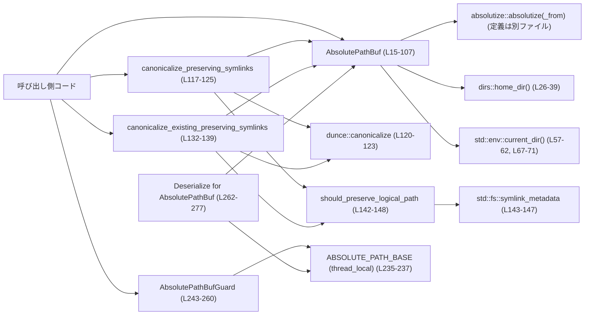
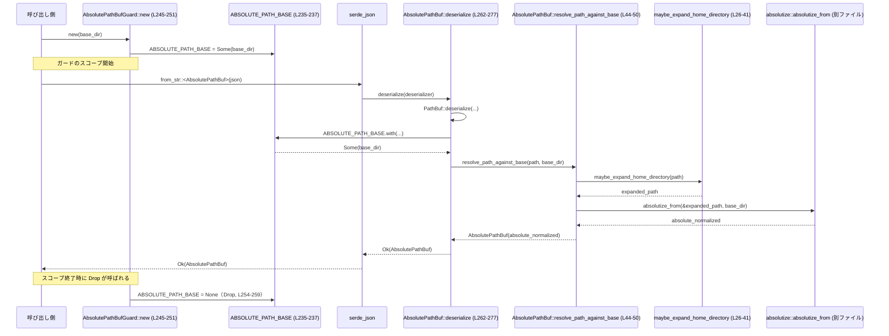

# utils/absolute-path/src/lib.rs コード解説

## 0. ざっくり一言

絶対パスのみを扱う `AbsolutePathBuf` 型と、その生成・正規化・シリアライズ／デシリアライズ、およびシンボリックリンクを考慮したパスの canonicalize を提供するユーティリティです。

---

## 1. このモジュールの役割

### 1.1 概要

- このモジュールは **「常に絶対で正規化されたパス表現」** を提供し、相対パスや `"~"` を解決して `AbsolutePathBuf` に変換します（`AbsolutePathBuf` のドキュメントコメントより: `utils/absolute-path/src/lib.rs:L15-23`）。
- さらに、シンボリックリンクを可能な限り温存しつつ canonicalize する API を提供し、ネストした symlink 経由でパスが書き換わることを防ぎます（`canonicalize_preserving_symlinks`, `canonicalize_existing_preserving_symlinks`: `L117-139`）。
- Serde デシリアライズ時には、スレッドローカルな「ベースパス」を使って相対パスを解決します（`ABSOLUTE_PATH_BASE`, `AbsolutePathBufGuard`, `Deserialize` 実装: `L235-277`）。

### 1.2 アーキテクチャ内での位置づけ

主なコンポーネントと依存関係を簡略化して示します。



- `absolutize` モジュール（`mod absolutize; L13`）の詳細はこのチャンクには現れませんが、`AbsolutePathBuf` の生成に使われ、絶対・正規化された `PathBuf` を返す前提で設計されています。
- Serde からのデシリアライズは `Deserialize for AbsolutePathBuf` 実装（`L262-277`）を通じて行われ、`ABSOLUTE_PATH_BASE` に設定されたベースパスに依存します。

### 1.3 設計上のポイント

- **絶対パス不変条件**  
  - `AbsolutePathBuf` は「絶対かつ正規化されたパス」を表す newtype です（`L15-23`）。  
  - 生成 API（`from_absolute_path`, `resolve_path_against_base`, `current_dir`, `relative_to_current_dir` など）を通じてこの不変条件を維持します（`L44-76`, `L52-62`, `L67-72`）。
- **ホームディレクトリ展開 (`~`) 対応**  
  - 内部関数 `maybe_expand_home_directory` が `"~"`, `"~/..."`, Windows では `"~\..."` をホームディレクトリに展開します（`L26-41`）。
- **シンボリックリンクの扱い**  
  - `canonicalize_*_preserving_symlinks` は、ネストした symlink を経由するとパスが書き換わるケースで「論理パス（logical path）」を優先して返します（`L117-125`, `L132-139`, `L142-148`）。
- **スレッドローカルなベースパスとガード**  
  - デシリアライズ時の相対パス解決は `thread_local!` な `ABSOLUTE_PATH_BASE` に依存し、`AbsolutePathBufGuard` の RAII でスコープ制御します（`L235-260`）。
  - ドキュメントコメントにある通り、デシリアライズは同一スレッド・単一スレッド前提で設計されています（`L239-242`）。
- **エラーハンドリング方針**  
  - ファイルシステム／環境依存処理は `std::io::Result` を返して呼び出し元に委譲します（例: `from_absolute_path`, `canonicalize_*`: `L52-55`, `L117-125`, `L132-139`）。
  - デシリアライズ時の失敗は Serde のカスタムエラーとして報告します（`SerdeError::custom`, `L271-275`）。

---

## 2. 主要な機能一覧

このモジュールが提供する主な機能を列挙します。

- `AbsolutePathBuf`:
  - 絶対かつ正規化されたパスの newtype ラッパー（`L15-23`）
  - ベースパスに対する相対パス解決、ホームディレクトリ展開、結合 (`join`)、親ディレクトリ取得 (`parent`) など（`L44-106`）
- パス解決ユーティリティ:
  - `AbsolutePathBuf::resolve_path_against_base`: 任意のベースパスに対する相対パス解決（`L44-50`）
  - `AbsolutePathBuf::relative_to_current_dir`: カレントディレクトリに対する解決（`L65-72`）
  - `AbsolutePathBuf::current_dir`: カレントディレクトリ自身を `AbsolutePathBuf` として取得（`L57-62`）
- canonicalize 関連:
  - `canonicalize_preserving_symlinks`: ネストした symlink を経由する場合は論理パスを保持しつつ canonicalize（`L117-125`）
  - `canonicalize_existing_preserving_symlinks`: 「存在する」パスを前提とし、エラーをそのまま返す版（`L132-139`）
- Serde 連携:
  - `impl Deserialize for AbsolutePathBuf`: JSON などからのデシリアライズ時にベースパスを用いて相対パスを解決（`L262-277`）
  - `AbsolutePathBufGuard`: デシリアライズ期間中のベースパスをスレッドローカルに設定するガード（`L239-260`）
- テスト用拡張トレイト:
  - `test_support::PathExt`, `PathBufExt`: 既に絶対な `Path` / `PathBuf` を `AbsolutePathBuf` に変換する拡張メソッド（`L171-201`）
- 変換・トレイト実装:
  - `TryFrom<&Path/PathBuf/&str/String>` による変換（`L203-233`）
  - `AsRef<Path>`, `Deref<Target=Path>`, `From<AbsolutePathBuf> for PathBuf`（`L151-169`）

---

## 3. 公開 API と詳細解説

### 3.1 型・コンポーネント一覧

主要な型・モジュール・静的変数の一覧です。

| 名前 | 種別 | 公開 | 行範囲 | 役割 / 用途 |
|------|------|------|--------|-------------|
| `AbsolutePathBuf` | 構造体 (newtype) | `pub` | `lib.rs:L15-23` | 絶対かつ正規化されたパスを表すラッパー。 |
| `AbsolutePathBuf` impl | impl ブロック | - | `L25-107` | パス解決・変換用のメソッド群。 |
| `canonicalize_preserving_symlinks` | 関数 | `pub` | `L117-125` | ネストした symlink を考慮しつつ canonicalize し、必要に応じて論理パスを保持。 |
| `canonicalize_existing_preserving_symlinks` | 関数 | `pub` | `L132-139` | パスが存在することを前提に canonicalize。エラーを呼び出し元へ返す。 |
| `should_preserve_logical_path` | 関数 | private | `L142-148` | 論理パスを保持すべきか（ネストした symlink を含むか）を判定。 |
| `impl AsRef<Path> for AbsolutePathBuf` | トレイト実装 | 公開利用可 | `L151-155` | `&AbsolutePathBuf` から `&Path` を取り出すため。 |
| `impl Deref<Target=Path> for AbsolutePathBuf` | トレイト実装 | 公開利用可 | `L157-163` | `*abs_path` で `&Path` として扱えるようにする。 |
| `impl From<AbsolutePathBuf> for PathBuf` | トレイト実装 | 公開利用可 | `L165-169` | `AbsolutePathBuf` から所有権付き `PathBuf` へ変換。 |
| `test_support` | モジュール | `pub` | `L171-201` | テスト時に `AbsolutePathBuf` を扱いやすくする拡張トレイト。 |
| `PathExt` | トレイト | `pub` | `L178-181` | `Path` に `.abs()` を追加。 |
| `PathBufExt` | トレイト | `pub` | `L191-194` | `PathBuf` に `.abs()` を追加。 |
| `ABSOLUTE_PATH_BASE` | thread-local 静的変数 | private | `L235-237` | デシリアライズ時に使うベースディレクトリを格納。 |
| `AbsolutePathBufGuard` | 構造体 | `pub` | `L239-243` | RAII で `ABSOLUTE_PATH_BASE` を設定／解除するガード。 |
| `impl AbsolutePathBufGuard` | impl | - | `L245-251` | ベースパスを設定する `new` メソッド。 |
| `impl Drop for AbsolutePathBufGuard` | Drop 実装 | - | `L254-259` | ガード破棄時にベースパスを `None` に戻す。 |
| `impl Deserialize for AbsolutePathBuf` | トレイト実装 | 公開利用可 | `L262-277` | Serde 経由のデシリアライズ用ロジック。 |
| テストモジュール `tests` | `#[cfg(test)]` mod | private | `L280-469` | 各種ユースケース・エッジケースの検証。 |

### 3.2 関数詳細（主要 7 件）

#### `AbsolutePathBuf::resolve_path_against_base<P, B>(path: P, base_path: B) -> Self`  

`utils/absolute-path/src/lib.rs:L44-50`

**概要**

- 任意の `base_path` に対して `path` を解決し、絶対かつ正規化された `AbsolutePathBuf` を返します。
- `path` に `"~"` が含まれる場合はホームディレクトリに展開されます（`maybe_expand_home_directory` 経由: `L26-41`）。
- すでに絶対パスであれば `base_path` は無視され、そのままのパスが採用されることがテストで確認されています（`create_with_absolute_path_ignores_base_path`, `L287-295`）。

**引数**

| 引数名 | 型 | 説明 |
|--------|----|------|
| `path` | `P: AsRef<Path>` | 解決したいパス。相対／絶対どちらも可。`"~"` を含む文字列パスも受け付け。 |
| `base_path` | `B: AsRef<Path>` | 相対パスを解決するベースディレクトリ。 |

**戻り値**

- `Self`（`AbsolutePathBuf`）  
  `path` を `base_path` に対して解決し、絶対かつ正規化されたパスを保持する値。

**内部処理の流れ**

1. `path.as_ref()` で `&Path` に変換（`L48`）。
2. `maybe_expand_home_directory` で `"~"` をホームディレクトリに展開し、`expanded` を得る（`L26-41`, `L48`）。
3. `absolutize::absolutize_from(&expanded, base_path.as_ref())` によって絶対パスかつ正規化された `PathBuf` を取得（`L49`）。
4. その結果を `AbsolutePathBuf` の内部フィールドとして包んで返す（`L49-50`）。

**Examples（使用例）**

```rust
use std::path::Path;
use utils_absolute_path::AbsolutePathBuf; // 仮のクレート名

// ベースディレクトリに対して相対パスを解決する例
let base = Path::new("/project");                  // ベースディレクトリ
let abs = AbsolutePathBuf::resolve_path_against_base("src/main.rs", base);
// abs は "/project/src/main.rs" に相当する絶対パスを表す
println!("{}", abs.display());                     // "/project/src/main.rs" など

// 絶対パスを渡した場合、ベースパスは無視される
let absolute_input = Path::new("/tmp/file.txt");
let resolved = AbsolutePathBuf::resolve_path_against_base(
    &absolute_input,
    "/some/base",
);
// resolved.as_path() == absolute_input がテストで確認されている
```

**Errors / Panics**

- このメソッド自体は `Result` を返さず、パニックも発生させません。
- 内部で利用している `absolutize::absolutize_from` の失敗条件は、このチャンクには定義がないため不明です。

**Edge cases（エッジケース）**

- `path` が絶対パスの場合: ベースパスは無視され、入力パス自体が利用されます（`L287-295` で検証）。
- `path` が `"./nested/../file.txt"` のように `"."` や `".."` を含む場合: 正規化され、`"nested/.."` が折りたたまれる（`relative_path_dots_are_normalized_against_base_path`, `L305-312`）。
- `path` に `"~"`, `"~/..."` が含まれる場合: ホームディレクトリに展開されます（`maybe_expand_home_directory`, `L26-41`）。

**使用上の注意点**

- `absolutize_from` の実装に依存するため、「ベースパスに対してどのようにパスが解決されるか」の詳細は `absolutize` モジュール側の仕様を確認する必要があります（このチャンクには現れません）。
- セキュリティ上、「どのディレクトリの下にあるか」を厳密に制御したい場合には、解決後のパスが期待するプレフィックスを持つかを別途検証する必要があります。

---

#### `AbsolutePathBuf::from_absolute_path<P>(path: P) -> std::io::Result<Self>`  

`utils/absolute-path/src/lib.rs:L52-55`

**概要**

- 与えられた `path` を絶対かつ正規化されたパスに変換し、`AbsolutePathBuf` を返します。
- `path` に `"~"` が含まれる場合はホームディレクトリに展開されます（`maybe_expand_home_directory`, `L26-41`）。

**引数**

| 引数名 | 型 | 説明 |
|--------|----|------|
| `path` | `P: AsRef<Path>` | 絶対パスであることを期待するパス。相対パスを渡した場合の挙動は `absolutize::absolutize` の仕様に依存。 |

**戻り値**

- `Ok(AbsolutePathBuf)`  
  絶対かつ正規化されたパス。
- `Err(std::io::Error)`  
  `absolutize::absolutize` が失敗した場合のエラー。

**内部処理の流れ**

1. `path` を `&Path` に変換し `maybe_expand_home_directory` に渡して `"~"` 展開を行う（`L53`）。
2. 展開後のパスに対して `absolutize::absolutize(&expanded)?` を呼び出し、`std::io::Result<PathBuf>` を得る（`L54`）。
3. 成功時はそれを `AbsolutePathBuf` に包み、`Ok(Self(...))` として返す（`L54-55`）。

**Examples（使用例）**

```rust
use utils_absolute_path::AbsolutePathBuf;

// すでに絶対パスであるケース
let abs = AbsolutePathBuf::from_absolute_path("/var/log/app.log")?;
// abs は "/var/log/app.log"（正規化済み）を表す

// "~" を含むケース
let home_path = AbsolutePathBuf::from_absolute_path("~/config/app.toml")?;
// OS のホームディレクトリ配下にある "config/app.toml" に展開される
```

**Errors / Panics**

- `absolutize::absolutize` が `Err` を返した場合、そのまま `std::io::Error` として呼び出し元に伝播します（`L54`）。
- パニックは発生させません。

**Edge cases（エッジケース）**

- `dirs::home_dir()` が `None` を返す場合: `"~"` 展開は行われず、そのままのパスで `absolutize` に渡されます（`L26-41`）。
- パス文字列が UTF-8 でない場合: `path.to_str()` が `None` になるため `"~"` 展開は行われません（`L26-27`）。

**使用上の注意点**

- 関数名は「絶対パスから生成」を示唆していますが、相対パスが渡された場合の挙動は `absolutize` の実装に依存します。このチャンクからは、相対パスを渡すことが意図されているかどうかは断定できません。
- エラーが発生する条件（例: 存在しないパス、権限エラーなど）は `absolutize` の内部制御に依存し、このチャンクからは不明です。

---

#### `AbsolutePathBuf::current_dir() -> std::io::Result<Self>`  

`utils/absolute-path/src/lib.rs:L57-62`

**概要**

- プロセスのカレントディレクトリを絶対・正規化した `AbsolutePathBuf` として取得します。

**引数**

- なし。

**戻り値**

- `Ok(AbsolutePathBuf)`  
  カレントディレクトリの絶対パス。
- `Err(std::io::Error)`  
  `std::env::current_dir()` または `absolutize::absolutize_from` が失敗した場合のエラー。

**内部処理の流れ**

1. `std::env::current_dir()?` でカレントディレクトリの `PathBuf` を取得（`L58`）。
2. そのパスに対して `absolutize::absolutize_from(&current_dir, &current_dir)` を呼び、絶対・正規化パスを得る（`L59-62`）。
3. 得られたパスを `AbsolutePathBuf` に包んで返す。

**Examples（使用例）**

```rust
use utils_absolute_path::AbsolutePathBuf;

// カレントディレクトリを AbsolutePathBuf として取得
let cwd = AbsolutePathBuf::current_dir()?;
println!("current dir: {}", cwd.display());
```

**Errors / Panics**

- `std::env::current_dir()` が失敗した場合（例えばカレントディレクトリが削除されているなど）、その `std::io::Error` をそのまま返します（`L57-58`）。
- `absolutize::absolutize_from` が失敗した場合も `std::io::Error` として伝播します。

**Edge cases（エッジケース）**

- OS によっては、プロセスのカレントディレクトリが存在しない、またはアクセスできない場合エラーとなります。この挙動は標準ライブラリ `std::env::current_dir` に依存します。
- `relative_to_current_dir` と組み合わせることで、カレントディレクトリを基準とした任意の相対パス解決が可能です（`L65-72`, `L314-323` のテスト）。

**使用上の注意点**

- 長時間動作するプロセスや、カレントディレクトリが変わりうる環境では、`current_dir()` の結果をキャッシュするか、毎回取得するかを用途に応じて検討する必要があります。

---

#### `canonicalize_preserving_symlinks(path: &Path) -> std::io::Result<PathBuf>`  

`utils/absolute-path/src/lib.rs:L117-125`

**概要**

- パスを canonicalize しますが、ネストしたシンボリックリンクを経由する場合は **論理的な絶対パス** を優先して返します（ドキュメントコメントと実装より: `L109-116`, `L117-125`）。
- `dunce::canonicalize` が失敗した場合でも、論理パス（`AbsolutePathBuf` による絶対・正規化パス）を返します（`L123-124`）。

**引数**

| 引数名 | 型 | 説明 |
|--------|----|------|
| `path` | `&Path` | canonicalize したいパス。相対／絶対どちらも可。 |

**戻り値**

- `Ok(PathBuf)`  
  - 原則として、`dunce::canonicalize(path)` の結果。  
  - ただし、`should_preserve_logical_path` が `true` を返し、かつ `canonical != logical` の場合は、論理パス `logical` を返す（`L121`）。
  - `dunce::canonicalize` が失敗した場合も `logical` を返す（`L123-124`）。
- `Err(std::io::Error)`  
  - `AbsolutePathBuf::from_absolute_path(path)` が失敗した場合のみ（`L118`）。

**内部処理の流れ**

1. `AbsolutePathBuf::from_absolute_path(path)?` を呼び出し、「論理絶対パス」である `logical` を得る（`L118`）。
2. `should_preserve_logical_path(&logical)` で symlink の状況を確認し、`preserve_logical_path` フラグを得る（`L119`）。
3. `dunce::canonicalize(path)` を呼び、結果に応じて分岐（`L120-124`）:
   - 成功かつ `preserve_logical_path == true` かつ `canonical != logical` → `Ok(logical)`。
   - 成功かつそれ以外 → `Ok(canonical)`。
   - 失敗 → `Ok(logical)`。

**Examples（使用例）**

```rust
use std::path::Path;
use utils_absolute_path::canonicalize_preserving_symlinks;

// 既存ディレクトリを canonicalize
let path = Path::new("/tmp");
let canonical = canonicalize_preserving_symlinks(path)?;
// 通常は std::fs::canonicalize(path) と同様の結果

// ネストした symlink 経由のパス
let logical = Path::new("/mnt/links/project");
let canonical = canonicalize_preserving_symlinks(logical)?;
// ネストした symlink を含む場合、logical と同じパスが返される可能性がある
```

**Errors / Panics**

- `AbsolutePathBuf::from_absolute_path(path)` がエラーを返した場合、その `std::io::Error` をそのまま返します（`L118`）。
- `dunce::canonicalize(path)` のエラーは **無視され**、論理パス `logical` を返します（`L123-124`）。
- パニックは発生させません。

**Edge cases（エッジケース）**

- `path` が存在しない場合:
  - `AbsolutePathBuf::from_absolute_path` が成功し、`dunce::canonicalize` が `Err` を返しても、`logical` を返します（`L123-124`）。
  - unix 向けテスト `canonicalize_preserving_symlinks_keeps_logical_missing_child_under_symlink`（`L395-409`）で、symlink 配下の存在しない子パスに対し論理パスを返すことが確認されています。
- symlink を含まないパス:
  - 通常は `dunce::canonicalize(path)` の結果がそのまま返ります（`L121-122`）。
- ネストした symlink を含むパス:
  - `should_preserve_logical_path` が `true` になり、`canonical != logical` の場合は `logical` が返されます（`L121`）。

**使用上の注意点**

- **存在しないパスでも `Ok` を返す** 点に注意が必要です（`dunce::canonicalize` のエラーを握り潰し、論理パスを返すため: `L123-124`）。「パスの存在を保証したい」用途では `canonicalize_existing_preserving_symlinks` を使うべきです。
- セキュリティ的に「実際にどのファイル／ディレクトリを指しているか」を厳密に確認したい場合、symlink を温存するこの関数は前提に適さない可能性があります。その場合、元の `std::fs::canonicalize` か、symlink を含めた追加検証を検討する必要があります。

---

#### `canonicalize_existing_preserving_symlinks(path: &Path) -> std::io::Result<PathBuf>`  

`utils/absolute-path/src/lib.rs:L132-139`

**概要**

- `canonicalize_preserving_symlinks` と同様に、ネストした symlink を経由する場合は論理パスを保持しつつ canonicalize します。
- **異なる点**は、「パスが存在しない場合は `Err` を返す」ことです（`dunce::canonicalize` のエラーをそのまま返す: `L134`）。

**引数 / 戻り値**

- 引数・戻り値は `canonicalize_preserving_symlinks` と同じですが、`dunce::canonicalize` のエラーが `Err` として返されます。

**内部処理の流れ**

1. `logical = AbsolutePathBuf::from_absolute_path(path)?`（`L133`）。
2. `canonical = dunce::canonicalize(path)?`（`L134`）  
   → ここで失敗すると `std::io::Error` がそのまま呼び出し元へ返る。
3. `should_preserve_logical_path(&logical)` の結果と `canonical != logical` に基づき、`logical` または `canonical` を返す（`L135-139`）。

**Examples（使用例）**

```rust
use std::path::Path;
use utils_absolute_path::canonicalize_existing_preserving_symlinks;

// パスの存在を保証したい場合
let existing = canonicalize_existing_preserving_symlinks(Path::new("/etc/hosts"))?;

// 存在しないパスはエラーになる
let missing = Path::new("/path/does/not/exist");
let err = canonicalize_existing_preserving_symlinks(missing)
    .expect_err("missing path should error");
assert_eq!(err.kind(), std::io::ErrorKind::NotFound);
```

**Errors / Panics**

- `AbsolutePathBuf::from_absolute_path(path)` が失敗した場合は `std::io::Error` を返します（`L133`）。
- `dunce::canonicalize(path)` のエラーもそのまま `Err` として返します（`L134`）。
- テスト `canonicalize_existing_preserving_symlinks_errors_for_missing_path` で、存在しないパスに対して `ErrorKind::NotFound` が返ることが確認されています（`L411-419`）。
- パニックは発生させません。

**Edge cases**

- symlink を含むが実体が存在するパス:
  - `canonical` と `logical` の比較によって、論理パスを優先するかどうかが決まります（`L135-139`）。
  - unix テスト `canonicalize_existing_preserving_symlinks_keeps_logical_symlink_path` （`L422-435`）で、symlink 自体のパスが保持されることが確認されています。
- 存在しないパス:
  - `dunce::canonicalize(path)` でエラーとなり、そのエラーがそのまま返ります（`L134`）。

**使用上の注意点**

- 「パスが存在することを保証したい」ケースで利用する関数です。存在しないパスも許容して論理パスを返したい場合は、`canonicalize_preserving_symlinks` を利用する必要があります。
- symlink を温存するロジックは `canonicalize_preserving_symlinks` と同一なので、セキュリティ上の前提は同様です。

---

#### `AbsolutePathBufGuard::new(base_path: &Path) -> Self`  

`utils/absolute-path/src/lib.rs:L245-251`

**概要**

- Serde デシリアライズ時に `AbsolutePathBuf` の相対パス解決に用いるベースディレクトリを、スレッドローカル変数 `ABSOLUTE_PATH_BASE` に設定します。
- RAII により、ガードがドロップされるとベースパスは `None` に戻ります（`Drop` 実装: `L254-259`）。

**引数**

| 引数名 | 型 | 説明 |
|--------|----|------|
| `base_path` | `&Path` | 相対パスを解決するベースディレクトリ。通常は設定ファイルの置かれているディレクトリなど。 |

**戻り値**

- `AbsolutePathBufGuard`  
  スコープから外れると自動的にベースパスをクリアするガード。

**内部処理の流れ**

1. `ABSOLUTE_PATH_BASE.with(|cell| { *cell.borrow_mut() = Some(base_path.to_path_buf()); })` により、現在のスレッドの TLS に `base_path` を格納（`L247-249`）。
2. `AbsolutePathBufGuard` の値を返す（`L250-251`）。
3. 後にガードがドロップされると、`Drop` 実装が `ABSOLUTE_PATH_BASE` を `None` に戻す（`L254-259`）。

**Examples（使用例）**

```rust
use std::path::Path;
use utils_absolute_path::{AbsolutePathBuf, AbsolutePathBufGuard};

// 設定ファイルのディレクトリをベースにして AbsolutePathBuf をデシリアライズ
let base_dir = Path::new("/etc/myapp");
let json = r#""logs/app.log""#;                          // 相対パスのみ

let abs_path = {
    let _guard = AbsolutePathBufGuard::new(base_dir);    // このスコープ内でのみ有効
    serde_json::from_str::<AbsolutePathBuf>(json)?       // "/etc/myapp/logs/app.log" 相当になる
};
// ここではベースパスはクリアされている
```

**Errors / Panics**

- `new` 自体は `Result` を返さず、パニックも発生させません。
- 内部で `RefCell::borrow_mut` を使用していますが、このコードパスではネストした同時ミューテーションは行っておらず、`borrow_mut` パニックの可能性はありません（`L247-249`）。

**Edge cases**

- 同じスレッドで複数の `AbsolutePathBufGuard` をネストして生成した場合:
  - 内側の `new` が `ABSOLUTE_PATH_BASE` を上書きし、内側のガードの `Drop` が呼ばれると `ABSOLUTE_PATH_BASE` は `None` に戻ります（`L254-259`）。
  - その結果、外側のガードがまだスコープ内にあっても、ベースパスがクリアされる可能性があります。
  - この挙動はコードから読み取れますが、意図された使用法かどうかはドキュメントからは明示されていません。

**使用上の注意点**

- ドキュメントコメントにある通り「デシリアライズはシングルスレッドで、ガードを作ったのと同じスレッドで行う必要がある」とされています（`L239-242`）。
  - 別スレッドでデシリアライズを行っても、そのスレッドの `ABSOLUTE_PATH_BASE` は未設定のままなので、相対パスのデシリアライズはエラーになります（`Deserialize` 実装参照: `L262-277`）。
- 同一スレッドでガードをネストして使用すると、外側のガードの意図したスコープより早くベースパスがクリアされる可能性があるため、通常はネストさせずに使う前提で設計されていると考えられます。

---

#### `impl<'de> Deserialize<'de> for AbsolutePathBuf::deserialize<D>(deserializer: D) -> Result<Self, D::Error>`  

`utils/absolute-path/src/lib.rs:L262-277`

**概要**

- Serde による `AbsolutePathBuf` のデシリアライズロジックです。
- 文字列（`PathBuf` としてデシリアライズされた値）を受け取り、スレッドローカルなベースパス `ABSOLUTE_PATH_BASE` に応じて相対パスを解決します。
- ベースパスが未設定の場合、絶対パスのみが受け付けられ、相対パスはエラーになります（`L268-276`）。

**引数**

| 引数名 | 型 | 説明 |
|--------|----|------|
| `deserializer` | `D: Deserializer<'de>` | Serde のデシリアライザ。通常は `serde_json` 等が供給。 |

**戻り値**

- `Ok(AbsolutePathBuf)`  
  デシリアライズとパス解決に成功した場合。
- `Err(D::Error)`  
  入力が不正な場合や、ベースパスなしで相対パスをデシリアライズしようとした場合。

**内部処理の流れ**

1. まず `PathBuf::deserialize(deserializer)?` でパス文字列を `PathBuf` にデシリアライズ（`L267`）。
2. `ABSOLUTE_PATH_BASE.with(|cell| match cell.borrow().as_deref() { ... })` で現在のスレッドのベースパスを参照（`L268`）。
3. 分岐:
   - `Some(base)` が設定されている場合 → `Self::resolve_path_against_base(path, base)` でベースパスに対して解決（`L269`）。
   - ベースパスが `None` かつ `path.is_absolute()` が `true` の場合 → `Self::from_absolute_path(path)` で絶対パスとして扱う（`L270-272`）。
   - ベースパスが `None` かつ `path` が相対パスの場合 → `"AbsolutePathBuf deserialized without a base path"` というメッセージでエラーを返す（`L273-275`）。

**Examples（使用例）**

```rust
use std::path::Path;
use utils_absolute_path::{AbsolutePathBuf, AbsolutePathBufGuard};

// ベースパスありで相対パスをデシリアライズ
let base_dir = Path::new("/project");
let json = r#""src/main.rs""#;                    // 相対パス
let abs = {
    let _guard = AbsolutePathBufGuard::new(base_dir);
    serde_json::from_str::<AbsolutePathBuf>(json)? // "/project/src/main.rs" 相当
};

// ベースパスなしで絶対パスをデシリアライズ
let abs2: AbsolutePathBuf = serde_json::from_str(r#""/var/log/app.log""#)?;

// ベースパスなしで相対パスをデシリアライズするとエラー
let err = serde_json::from_str::<AbsolutePathBuf>(r#""logs/app.log""#)
    .expect_err("base path is required for relative paths");
println!("{}", err);
```

**Errors / Panics**

- Serde 経由のエラーは `D::Error` として返されます。
  - `PathBuf::deserialize` の失敗（形式不正など）。
  - `Self::from_absolute_path(path)` の `std::io::Error` は `SerdeError::custom` でラップされて `D::Error` になります（`L270-272`）。
  - ベースパスなしで相対パスをデシリアライズした場合は、固定メッセージ `"AbsolutePathBuf deserialized without a base path"` を返します（`L273-275`）。
- パニックは発生させません。

**Edge cases**

- `"~"` や `"~/..."` を含むパス:
  - ベースパスが設定されている場合でも、`resolve_path_against_base` 内で `"~"` がホームディレクトリに展開され、ベースパスは無視される挙動がテストで確認されています（`home_directory_*_deserialization` テスト群: `L341-378`）。
- ベースパス設定なしで絶対パスをデシリアライズ:
  - `path.is_absolute()` が `true` の場合は `from_absolute_path` を使って受け付けられます（`L270-272`）。
- 非 UTF-8 パス:
  - デシリアライズ自体は `PathBuf` として行われるため、非 UTF-8 でも値を受け取れます。
  - `"~"` 展開は `maybe_expand_home_directory` が `to_str()` ベースで行うため、非 UTF-8 の場合は `"~"` は展開されません（`L26-27`）。

**使用上の注意点**

- 相対パスをデシリアライズする場合は、必ず同じスレッド上で `AbsolutePathBufGuard::new` を使いベースパスを設定してからデシリアライズを行う必要があります（`L239-242`, `L326-339`）。
- ベースパスを設定せずに相対パスをデシリアライズすると、固定メッセージのエラーとなるため、ユーザーにとってわかりやすいエラーメッセージが必要であれば、呼び出し側で捕捉して変換する必要があります。

---

#### `should_preserve_logical_path(logical: &Path) -> bool`  

`utils/absolute-path/src/lib.rs:L142-148`

**概要**

- 論理絶対パス `logical` の祖先ディレクトリに、ネストした symlink が含まれるかどうかを判定します。
- `canonicalize_*_preserving_symlinks` が論理パスを保持すべきかどうかの判定に利用されます（`L119`, `L135`）。

**引数**

| 引数名 | 型 | 説明 |
|--------|----|------|
| `logical` | `&Path` | すでに絶対かつ正規化された「論理パス」。 |

**戻り値**

- `true`  
  祖先のどこかに「ルート直下以外に置かれた symlink」が存在するとき。
- `false`  
  symlink が無いか、トップレベルの system alias（親がルートなど）のみ存在するとき、あるいは `symlink_metadata` の取得に失敗したとき。

**内部処理の流れ**

1. `logical.ancestors()` で `logical` からルートまでの祖先パスを列挙（`L143`）。
2. 各祖先に対して:
   - `std::fs::symlink_metadata(ancestor)` を呼び出し、`Ok(metadata)` でない場合は `false` を返して次の祖先へ（`L144-146`）。
   - `metadata.file_type().is_symlink()` が `true` かつ  
     `ancestor.parent().and_then(Path::parent).is_some()`（= 親の親が存在 → ルート直下ではない）なら `true`（`L147`）。
3. どの祖先でも条件を満たさなければ `false` を返す（`L143-148`）。

**使用上の注意点**

- `symlink_metadata` がエラーになるケース（存在しない祖先、権限不足など）は「symlink がない」と見なされます（`L144-146`）。
- ルート直下の symlink（例: macOS の `/var -> /private/var`）は `ancestor.parent().and_then(Path::parent).is_some()` が `false` となるため、`true` にはなりません。
  - この仕様により、トップレベルの system alias は canonicalize される一方、ネストした symlink 経由のパスは論理パスを維持する設計になっています（モジュールコメント `L109-116` とテスト `L380-409`, `L422-435` より）。

---

### 3.3 その他の関数・メソッド一覧（本体コード）

本体コードにおけるその他のメソッド・トレイト実装です。

| 名前 | 種別 | 公開 | 行範囲 | 役割（1 行） |
|------|------|------|--------|--------------|
| `AbsolutePathBuf::maybe_expand_home_directory` | 関数（private） | - | `L26-41` | `"~"`, `"~/..."`, Windows では `"~\..."` をホームディレクトリに展開する。 |
| `AbsolutePathBuf::relative_to_current_dir` | メソッド | `pub` | `L65-72` | カレントディレクトリをベースに `path` を解決して `AbsolutePathBuf` を返す。 |
| `AbsolutePathBuf::join` | メソッド | `pub` | `L74-76` | 自身のパスをベースとして `path` を解決した新しい `AbsolutePathBuf` を返す。 |
| `AbsolutePathBuf::parent` | メソッド | `pub` | `L78-86` | 親ディレクトリを `AbsolutePathBuf` として返す。親がない場合は `None`。 |
| `AbsolutePathBuf::as_path` | メソッド | `pub` | `L88-90` | 内部の `&Path` への参照を返す。 |
| `AbsolutePathBuf::into_path_buf` | メソッド | `pub` | `L92-94` | 内部の `PathBuf` の所有権を返す。 |
| `AbsolutePathBuf::to_path_buf` | メソッド | `pub` | `L96-98` | 内部の `PathBuf` をクローンして返す。 |
| `AbsolutePathBuf::to_string_lossy` | メソッド | `pub` | `L100-102` | `PathBuf::to_string_lossy` のラッパー。 |
| `AbsolutePathBuf::display` | メソッド | `pub` | `L104-106` | `PathBuf::display` のラッパー。 |
| `impl PathExt for Path::abs` | メソッド | `pub` | `L183-187` | 既に絶対な `Path` を `AbsolutePathBuf` に変換（`try_from` 使用）。 |
| `impl PathBufExt for PathBuf::abs` | メソッド | `pub` | `L196-199` | 既に絶対な `PathBuf` を `AbsolutePathBuf` に変換。 |
| `impl TryFrom<&Path> for AbsolutePathBuf::try_from` | 関数 | 公開利用可 | `L203-208` | `&Path` から `AbsolutePathBuf` を作る。`from_absolute_path` を利用。 |
| `impl TryFrom<PathBuf> for AbsolutePathBuf::try_from` | 関数 | 公開利用可 | `L211-216` | `PathBuf` から `AbsolutePathBuf` を作る。 |
| `impl TryFrom<&str> for AbsolutePathBuf::try_from` | 関数 | 公開利用可 | `L219-224` | `&str` から `AbsolutePathBuf` を作る。 |
| `impl TryFrom<String> for AbsolutePathBuf::try_from` | 関数 | 公開利用可 | `L227-232` | `String` から `AbsolutePathBuf` を作る。 |

テスト関数は `#[cfg(test)] mod tests` 内（`L280-469`）に多数定義されていますが、ここでは「挙動の検証内容」として後述のセクションでまとめます。

---

## 4. データフロー

### 4.1 デシリアライズ時のデータフロー

代表的なシナリオとして、「ベースディレクトリを指定して JSON から `AbsolutePathBuf` をデシリアライズする」場合のデータフローを示します。



このフローから読み取れる要点:

- ベースパスは `thread_local!` な `ABSOLUTE_PATH_BASE` に一時的に格納され、デシリアライズ中に参照されます（`L235-237`, `L247-249`, `L268-269`）。
- 相対パスの解決は、ホームディレクトリ展開 → ベースパスに対する絶対化・正規化の順で行われます（`L26-41`, `L44-50`）。
- ガードのスコープを抜けるとベースパスは `None` に戻り、以降のデシリアライズでは相対パスが拒否されます（`L254-259`, `L273-275`）。

---

## 5. 使い方（How to Use）

### 5.1 基本的な使用方法

**設定ファイルパスの扱いの例**

```rust
use std::path::Path;
use utils_absolute_path::{
    AbsolutePathBuf,
    AbsolutePathBufGuard,
    canonicalize_existing_preserving_symlinks,
};

// 例: 設定ファイルが "/etc/myapp/config.json" にあり、その中で相対パスを使うケース
fn load_config_and_paths() -> Result<(), Box<dyn std::error::Error>> {
    let config_path = Path::new("/etc/myapp/config.json");          // 設定ファイルの絶対パス
    let config_dir = config_path.parent().unwrap();                 // "/etc/myapp"

    // 設定ファイル内に "log_dir": "logs" のような相対パスがあるとする
    let json = r#"{ "log_dir": "logs" }"#;

    // ベースディレクトリをガードで設定
    let _guard = AbsolutePathBufGuard::new(config_dir);             // L245-251

    #[derive(serde::Deserialize)]
    struct Config {
        log_dir: AbsolutePathBuf,                                   // L15-23, L262-277
    }

    let cfg: Config = serde_json::from_str(json)?;                  // 相対パスが解決される
    let log_dir_abs = cfg.log_dir;                                  // "/etc/myapp/logs" 相当

    // 必要なら実在するか確認しつつ canonicalize
    let canonical = canonicalize_existing_preserving_symlinks(
        log_dir_abs.as_path(),                                      // L88-90, L132-139
    )?;

    println!("logs at: {}", canonical.display());
    Ok(())
}
```

### 5.2 よくある使用パターン

1. **カレントディレクトリに対するパス解決**

```rust
use utils_absolute_path::AbsolutePathBuf;

// カレントディレクトリ配下のファイルを AbsolutePathBuf として取得
let file = AbsolutePathBuf::relative_to_current_dir("data/input.csv")?; // L65-72
println!("input: {}", file.display());
```

1. **すでに絶対なパスからの変換**

```rust
use std::path::Path;
use utils_absolute_path::AbsolutePathBuf;

// 既に絶対パスとわかっている場合
let p = Path::new("/var/log/app.log");
let abs = AbsolutePathBuf::try_from(p)?;                       // L203-208
// または from_absolute_path を直接呼んでも良い
let abs2 = AbsolutePathBuf::from_absolute_path(p)?;            // L52-55
```

1. **テストでの `.abs()` 拡張メソッド利用**

```rust
use std::path::Path;
use utils_absolute_path::test_support::PathExt;                // L171-181

fn some_test_helper(path: &Path) {
    let abs = path.abs();                                      // 既に絶対パスである前提
    // abs は AbsolutePathBuf
}
```

### 5.3 よくある間違いと正しい使い方

```rust
use utils_absolute_path::{AbsolutePathBuf, AbsolutePathBufGuard};

// 間違い例: ベースパスなしで相対パスをデシリアライズしてしまう
let json = r#""relative/path.txt""#;
// これは "AbsolutePathBuf deserialized without a base path" というエラーになる
let err = serde_json::from_str::<AbsolutePathBuf>(json).unwrap_err();

// 正しい例: ガードを使ってベースパスを設定する
let base_dir = std::path::Path::new("/project");
let abs = {
    let _guard = AbsolutePathBufGuard::new(base_dir);          // L245-251
    serde_json::from_str::<AbsolutePathBuf>(json)?             // L262-277
};
```

```rust
use utils_absolute_path::{
    canonicalize_preserving_symlinks,
    canonicalize_existing_preserving_symlinks,
};

// 間違い例: 「必ず存在するパス」として扱いたいのに canonicalize_preserving_symlinks を使う
let missing = std::path::Path::new("/path/does/not/exist");
let ok_but_missing = canonicalize_preserving_symlinks(missing)?;
// エラーにはならず論理パスが返る可能性がある（L117-125）

// 正しい例: 存在チェックも欲しい場合は canonicalize_existing_preserving_symlinks を使う
let err = canonicalize_existing_preserving_symlinks(missing)
    .expect_err("should be an error for missing path");        // L132-139, L411-419
```

### 5.4 使用上の注意点（まとめ）

- **AbsolutePathBuf の不変条件**
  - 生成メソッドを通じて作成された `AbsolutePathBuf` は「絶対かつ正規化されたパス」である前提で利用されます（ドキュメントコメント: `L15-23`）。
  - この不変条件を壊すような直接のフィールド操作は存在しませんが、`absolutize` モジュール側の仕様変更には注意が必要です。

- **ベースパスとデシリアライズ**
  - 相対パスのデシリアライズには `AbsolutePathBufGuard` が必須です（`L239-242`, `L262-277`）。
  - ガードは同一スレッド内でのみ有効であり、別スレッドでのデシリアライズには利用されません（`thread_local!`, `L235-237`）。

- **symlink の扱いとセキュリティ**
  - `canonicalize_*_preserving_symlinks` は symlink を温存する設計のため、「実体パスに完全に解決したい」用途や、権限チェックなどセキュリティクリティカルな用途では前提の違いに注意が必要です（`L109-116`, `L142-148`）。
  - パスが必ず存在することを前提とした処理では `canonicalize_existing_preserving_symlinks` を使う必要があります（`L132-139`）。

- **並行性**
  - `ABSOLUTE_PATH_BASE` はスレッドローカルなので、スレッド間でベースパスは共有されません（`L235-237`）。
  - 同一スレッド内で `AbsolutePathBufGuard` をネストすると、内側の `Drop` によって外側の意図しないタイミングでベースパスが `None` に戻る可能性があります（`L254-259`）。通常はネストしない前提で設計されていると読み取れます。

---

## 6. 変更の仕方（How to Modify）

### 6.1 新しい機能を追加する場合

- **別のベースに対する解決メソッドを追加する**
  1. `AbsolutePathBuf` の `impl` ブロック（`L25-107`）に新メソッドを追加する。
  2. 必要に応じて `maybe_expand_home_directory`（`L26-41`）や `resolve_path_against_base`（`L44-50`）を再利用し、不変条件（絶対かつ正規化）を保つ。
  3. テストモジュール `tests`（`L280-469`）に新ユースケース用のテストを追加し、相対／絶対パス、`"~"` を含むケースなどをカバーする。

- **追加の canonicalize 方針を提供する**
  1. `canonicalize_preserving_symlinks`（`L117-125`）と `canonicalize_existing_preserving_symlinks`（`L132-139`）を参考に、新しい方針（例: symlink を必ず解決する版）を追加する。
  2. symlink の扱いを変えたい場合は `should_preserve_logical_path`（`L142-148`）のロジックを共有・拡張するか、新たな判定関数を追加する。

### 6.2 既存の機能を変更する場合

- **影響範囲の確認**
  - `AbsolutePathBuf` に関する変更は、変換系トレイト（`TryFrom<...>`: `L203-233`）、デシリアライズ（`L262-277`）、テストサポート（`L171-201`）に波及する可能性があります。
  - `canonicalize_*` の挙動変更は、対応するテスト（`L380-409`, `L411-435`, `L455-469`）の期待値を必ず確認する必要があります。

- **契約（前提条件・返り値）の維持**
  - `canonicalize_preserving_symlinks` が「存在しないパスでも `Ok(logical)` を返す」現在の契約を変更する場合、これに依存している呼び出し側があるかどうかを確認します（`L117-125`）。
  - `Deserialize` 実装が「ベースパスなしの相対パスを拒否する」契約（`L273-275`）を変更する場合は、すべてのデシリアライズサイトを確認し、エラー処理や期待挙動を見直す必要があります。

- **テストの更新**
  - 仕様変更に合わせて `#[cfg(test)] mod tests` 内のテスト（`L286-469`）を更新・追加し、新しい挙動がカバーされるようにすることが推奨されます。

---

## 7. 関連ファイル

| パス | 役割 / 関係 |
|------|------------|
| `utils/absolute-path/src/absolutize.rs`（推定） | `mod absolutize;`（`L13`）で参照されるモジュール。`absolutize` と `absolutize_from` を提供し、相対パスの絶対化と正規化ロジックを担っていると解釈できます。 |
| （本ファイル自身）`utils/absolute-path/src/lib.rs` | `AbsolutePathBuf` 型と canonicalize／デシリアライズ周りの外部 API を定義するメインモジュール。 |

> 注: `absolutize` モジュールの具体的な実装はこのチャンクには現れないため、その詳細な挙動（相対パスの扱いやエラー条件など）は、このファイルからは分かりません。
