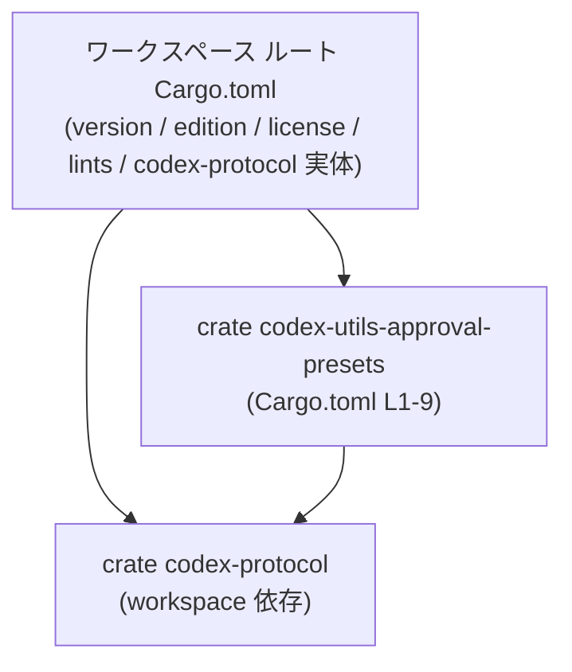
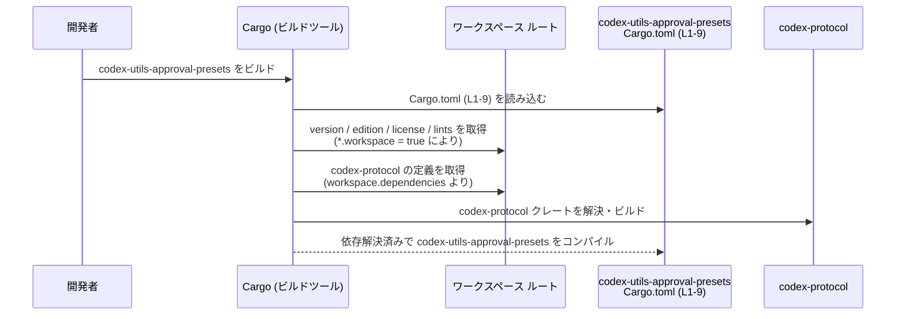

# utils/approval-presets/Cargo.toml

## 0. ざっくり一言

`utils/approval-presets/Cargo.toml` は、Rust クレート `codex-utils-approval-presets` のパッケージ情報と依存関係を定義し、バージョンや edition、ライセンス、lint 設定、依存クレート `codex-protocol` をワークスペース共通設定から参照するためのマニフェストファイルです（`[package]`, `[lints]`, `[dependencies]` セクションより、utils/approval-presets/Cargo.toml:L1-9）。

---

## 1. このモジュールの役割

### 1.1 概要

- このファイルは、Rust のビルドツール Cargo が読み取るマニフェスト（設定）であり、クレート `codex-utils-approval-presets` の基本情報（名前・バージョン・edition・ライセンス）を定義します（`[package]` セクション, L1-5）。
- ただし version / edition / license はワークスペース側の値を参照する設定になっており、実際の値はルートの `Cargo.toml` 側にあります（`version.workspace = true`, `edition.workspace = true`, `license.workspace = true`, L3-5）。
- lint 設定もワークスペース共通設定に委譲しています（`[lints]` セクションの `workspace = true`, L6-7）。
- 依存関係として、ワークスペースで定義された `codex-protocol` クレートを利用することを宣言しています（`[dependencies]` セクションの `codex-protocol = { workspace = true }`, L8-9）。

このチャンクには Rust コード（関数・構造体など）の定義は含まれていません。

### 1.2 アーキテクチャ内での位置づけ

Cargo ワークスペース内での、このクレートと依存関係の関係を図示します。



- `Approval` ノードが、このファイルで定義されるクレート `codex-utils-approval-presets` に対応します（L1-2）。
- `Workspace` ノードは、`version.workspace = true`, `edition.workspace = true`, `license.workspace = true`, `lints.workspace = true`, `codex-protocol = { workspace = true }` で参照されるワークスペース側の設定を表します（L3-5, L7, L9）。
- `Approval` から `CodexProtocol` への矢印は、このクレートが `codex-protocol` に依存することを表します（L8-9）。

### 1.3 設計上のポイント

コード（TOML）から読み取れる設計上の特徴は次のとおりです。

- **ワークスペース集中管理**
  - バージョン、edition、ライセンスはすべて `*.workspace = true` としてワークスペース側に委譲しています（L3-5）。
  - lint 設定も `[lints]` セクションで `workspace = true` とし、ルート設定に一元化しています（L6-7）。
- **依存関係もワークスペース管理**
  - `codex-protocol` 依存を `workspace = true` 経由で指定しているため、バージョンやオプションもワークスペース側に集約されます（L8-9）。
- **状態を持たない設定ファイル**
  - このファイル自体は実行時状態やロジックを持たず、ビルド時に Cargo に解釈される静的な設定のみを記述しています。

---

## 2. 主要な機能一覧

このファイルは「機能」を直接提供するというより、「クレートのメタ情報と依存関係」を定義します。その観点での主要な要素は次のとおりです。

### 2.1 コンポーネント一覧（このファイルに現れる要素）

| コンポーネント | 種別 | 説明 | 根拠 |
|----------------|------|------|------|
| `codex-utils-approval-presets` | クレート（パッケージ） | 本マニフェストで定義されるクレート名 | `[package].name`（utils/approval-presets/Cargo.toml:L1-2） |
| ワークスペース版の version / edition / license | パッケージメタデータ | バージョン・edition・ライセンスをワークスペース側から継承 | `version.workspace = true`, `edition.workspace = true`, `license.workspace = true`（L3-5） |
| ワークスペース lint 設定 | lint 設定 | lint（コンパイラ警告ポリシー）をワークスペース共通設定に委譲 | `[lints]` と `workspace = true`（L6-7） |
| `codex-protocol` | 依存クレート | 本クレートが利用する依存クレート。実体はワークスペース側で定義 | `[dependencies]` の `codex-protocol = { workspace = true }`（L8-9） |

### 2.2 このマニフェストが提供する役割（箇条書き）

- クレート名の定義: `name = "codex-utils-approval-presets"`（L2）。
- バージョン / edition / ライセンスのワークスペース委譲: `version.workspace / edition.workspace / license.workspace`（L3-5）。
- lint 設定のワークスペース委譲: `[lints]` セクションの `workspace = true`（L6-7）。
- 依存 `codex-protocol` の利用宣言とワークスペース委譲: `[dependencies]` セクションの `codex-protocol = { workspace = true }`（L8-9）。

---

## 3. 公開 API と詳細解説

このチャンクには Rust ソースコードが含まれていないため、型や関数などの公開 API はわかりません。以下は「このファイルには存在しない」という事実の整理になります。

### 3.1 型一覧（構造体・列挙体など）

この `Cargo.toml` 自体には Rust の型定義は存在しません。

- Rust の構造体・列挙体・トレイトなどは通常 `src/` 配下の `.rs` ファイルに定義されますが、その内容はこのチャンクには現れていません。
- したがって、`codex-utils-approval-presets` クレートがどのような公開型や API を持つかは、このファイルだけからは判断できません。

### 3.2 関数詳細

TOML マニフェスト内には Rust の関数定義は存在しないため、このセクションに説明すべき関数はありません。

- 公開 API の詳細（関数名・引数・戻り値・エラー条件など）は、Rust ソースコードを参照する必要があります。
- このチャンクからわかるのは、「その API が `codex-protocol` クレートに依存している可能性がある」という構造だけです（依存関係として `codex-protocol` が指定されているため, L8-9）。

### 3.3 その他の関数

- 補助関数やラッパー関数なども、このファイルからは一切読み取れません。
- 関数・メソッドのインベントリーは、このチャンクでは「該当なし」となります。

---

## 4. データフロー

このファイルは実行時処理ではなく、**ビルド時に Cargo によって解釈される設定**です。代表的なシナリオとして、「開発者が `codex-utils-approval-presets` をビルドするときの情報の流れ」を示します。



要点:

- Cargo はまずこの `Cargo.toml` を読み込み、クレート名や依存関係を把握します（L1-2, L8-9）。
- `*.workspace = true` と書かれた項目については、ルートの `Cargo.toml` の該当セクションから実際の値を取得します（L3-5, L7, L9）。
- `codex-protocol` 依存が解決されることで、このクレートの Rust ソースコード内から `codex_protocol`（推定されるクレート名）を use/import できるようになります（依存として宣言されている事実のみがこのチャンクから読み取れます）。

---

## 5. 使い方（How to Use）

### 5.1 基本的な使用方法（ワークスペース側から見た構成例）

このクレートはワークスペースに属し、共通設定を参照する前提になっています（L3-5, L7, L9）。以下は一般的なワークスペースの `Cargo.toml` 構成例です（実際のプロジェクトと完全に一致するとは限りません）。

```toml
[workspace]                             # Cargo ワークスペースの宣言
members = [                             # 参加クレート（メンバー）の一覧
    "utils/approval-presets",          # 本ファイルを含むクレートへのパス
]

[workspace.package]                     # ワークスペース共通のパッケージメタデータ
version = "0.1.0"                      # すべてのメンバーで共有するバージョン
edition = "2021"                       # すべてのメンバーで共有する Rust edition
license = "MIT"                        # すべてのメンバーで共有するライセンス

[workspace.lints]                      # 共通の lint 設定（Rust 1.75 以降）
workspace = true                       # 各クレートの [lints] から参照されることを示す

[workspace.dependencies]               # 共通の依存クレート定義
codex-protocol = "1.2.3"              # codex-protocol のバージョンなどをここで固定
```

この例のようにワークスペース側で `version / edition / license / lints / codex-protocol` を定義しておくことで、本 `Cargo.toml` の `*.workspace = true` 設定が有効に機能します（utils/approval-presets/Cargo.toml:L3-5, L7, L9）。

### 5.2 よくある使用パターン

- **共通版数管理パターン**
  - 多数のユーティリティクレートがある場合、本ファイルのように `version.workspace = true` などで共通管理すると、バージョンの上げ下げが容易になります（L3-5）。
- **共通依存クレート管理パターン**
  - 依存 `codex-protocol` のバージョンや feature をワークスペースで一元管理したい場合、`workspace = true` 指定のみを各クレート側に書き、実体はワークスペースルートで定義します（L8-9）。

### 5.3 よくある間違いと注意点（マニフェストレベル）

```toml
# 間違い例: workspace 側に codex-protocol の定義がないのに workspace = true としている
[dependencies]
codex-protocol = { workspace = true }  # utils/approval-presets/Cargo.toml:L8-9 に相当

# -> ワークスペースの Cargo.toml に [workspace.dependencies.codex-protocol] がないと
#    ビルド時に「未定義の workspace 依存」としてエラーになります。
```

- このファイルでは `codex-protocol` を `workspace = true` で参照していますが（L8-9）、ワークスペース側に実体がない場合、Cargo が依存を解決できずビルドエラーになります。
- 同様に、`version.workspace = true` などの項目（L3-5）に対応する `workspace.package` 側の設定がない場合にもビルドエラーになります。

### 5.4 使用上の注意点（まとめ）

- **前提条件**
  - この `Cargo.toml` はワークスペース内にあること、そしてワークスペースの `Cargo.toml` に `workspace.package`, `workspace.lints`, `workspace.dependencies.codex-protocol` 等が定義されていることを前提としています（L3-5, L7, L9）。
- **エラー条件**
  - 対応するワークスペース設定が欠けている場合、ビルド時に Cargo がエラーを出します（TOML レベルの構文エラーや未定義依存）。
- **セキュリティ・依存管理**
  - `codex-protocol` のバージョンはワークスペース側で固定されるため、依存クレートの更新やセキュリティフィックスの反映はルート `Cargo.toml` で行うことになります（L8-9）。

---

## 6. 変更の仕方（How to Modify）

### 6.1 新しい機能を追加する場合（依存追加など）

新しい機能を実装するために別のクレートに依存する必要が出た場合、マニフェストレベルでは次のような変更が入口になります。

1. **ワークスペース全体で共有したい依存の場合**
   - ルート `Cargo.toml` の `[workspace.dependencies]` に依存クレートを追加する（このチャンクにはルートファイルは含まれていませんが、`workspace = true` 設定からその存在が前提とされます, L8-9）。
   - 本ファイルには `foo = { workspace = true }` のようなエントリを `[dependencies]` に追加する。
2. **このクレートだけが使う依存の場合**
   - ルートではなく、本 `Cargo.toml` の `[dependencies]` に直接 `crate-name = "x.y"` のように記述する（このパターンは現状の L8-9 からは読み取れませんが、一般的な Cargo の使い方です）。

### 6.2 既存の機能を変更する場合（設定変更）

- **クレート名の変更**
  - `name = "codex-utils-approval-presets"` を変更する場合（L2）、このクレートを参照している他クレートの `Cargo.toml` やドキュメントも合わせて更新する必要があります。
- **バージョン / edition / ライセンスの変更**
  - これらは `*.workspace = true` となっているため（L3-5）、実際の変更はワークスペースルートの `Cargo.toml` 側で行うことになります。
  - その際、すべてのメンバークレートに影響する点に注意が必要です。
- **lint ポリシーの変更**
  - lint 設定も `workspace = true` であるため（L6-7）、ルート側の変更がすべてのクレートに影響します。厳しい lint を有効にすると既存コードが警告・エラーになる可能性があります。
- **`codex-protocol` の変更**
  - バージョンや feature の追加・削除などはワークスペースの `Cargo.toml` で行う前提になっていると考えられます（L8-9）。
  - 変更後は `codex-utils-approval-presets` のソースコードでコンパイルエラーが出ないか確認が必要です（このチャンクにはソースコードは含まれていません）。

---

## 7. 関連ファイル

このマニフェストと密接に関係するファイル・ディレクトリは、次のように整理できます。

| パス / ファイル | 役割 / 関係 |
|-----------------|------------|
| ワークスペースルートの `Cargo.toml` | `version.workspace`, `edition.workspace`, `license.workspace`, `lints.workspace`, `codex-protocol = { workspace = true }` で参照される実体設定を持つファイルです（utils/approval-presets/Cargo.toml:L3-5, L7, L9）。 |
| `codex-protocol` クレートの `Cargo.toml` | `[dependencies]` セクションで参照されている依存クレート（L8-9）のマニフェストです。実際のパスや内容はこのチャンクには現れません。 |
| `utils/approval-presets/src/...` | `codex-utils-approval-presets` クレートの Rust ソースコードが置かれると推定されるディレクトリ階層です。実際のファイル構成・API 内容は、このチャンクには含まれていません。 |

このチャンクではマニフェストのみが与えられており、公開 API やコアロジックの詳細は、関連する Rust ソースコードを併せて確認する必要があります。
