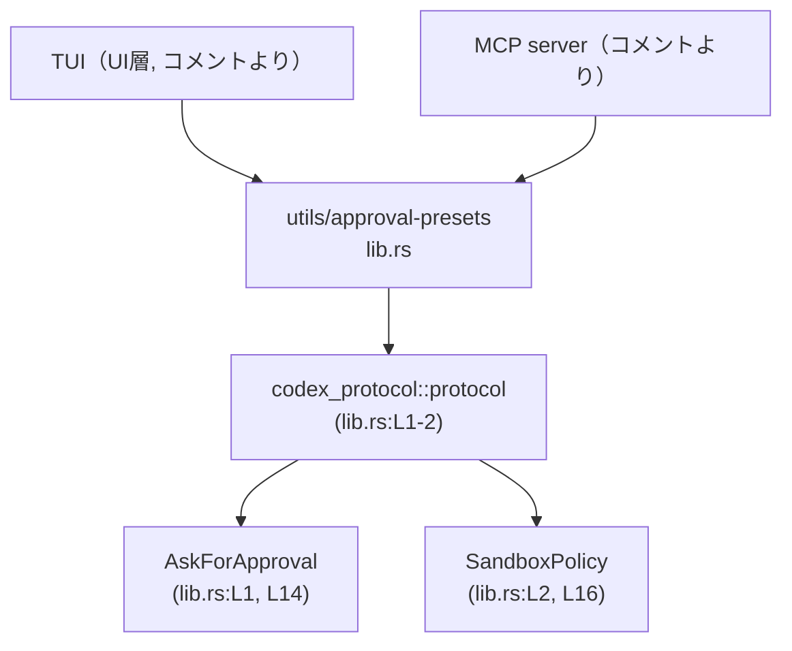
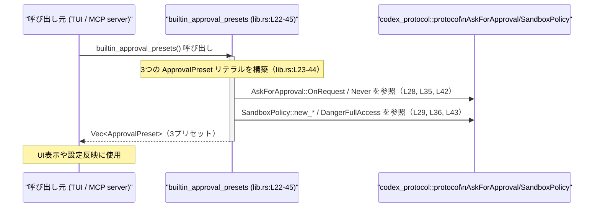

# utils/approval-presets/src/lib.rs

## 0. ざっくり一言

`ApprovalPreset` 構造体と、そのプリセット一覧を返す `builtin_approval_presets` 関数を提供し、**承認ポリシーとサンドボックスポリシーの組み合わせを定義するモジュール**です（`lib.rs:L4-16`, `L19-45`）。

---

## 1. このモジュールの役割

### 1.1 概要

- このモジュールは、Codex の動作に関する  
  **「どの程度ユーザー承認を求めるか（AskForApproval）」** と  
  **「どの範囲／権限で動作するか（SandboxPolicy）」**  
  を組み合わせたプリセットを定義します（`lib.rs:L4-16`, `L23-44`）。
- UI 側からは、このプリセット一覧を使うことで、いくつかの代表的な安全度合いの設定を選択肢として提示できます（コメントより、`lib.rs:L19-21`）。

### 1.2 アーキテクチャ内での位置づけ

- `ApprovalPreset` 自体は Codex の UI には依存せず、**TUI と MCP server の両方から共通利用される UI 非依存コンポーネント**として設計されています（コメント、`lib.rs:L19-21`）。
- 外部クレート `codex_protocol::protocol` が提供する `AskForApproval` と `SandboxPolicy` 型に依存します（`lib.rs:L1-2`, `L14-16`）。



### 1.3 設計上のポイント

- **UI 非依存**  
  - コメントで「Keep this UI-agnostic」と明記されており（`lib.rs:L19-21`）、見た目に依存しないラベル／説明と ID のみを持つシンプルな構造です（`lib.rs:L7-12`）。
- **不変なメタデータ**  
  - `id`, `label`, `description` はすべて `&'static str` で、文字列リテラルとしてビルド時に固定された値を参照します（`lib.rs:L8-12`）。
- **データ構造のみで状態を持たない**  
  - フィールドはすべて値型で、内部に可変状態や I/O は含みません（`lib.rs:L6-16`）。
- **エラーハンドリング不要な単純生成**  
  - `builtin_approval_presets` は固定内容の `Vec<ApprovalPreset>` を構築して返すだけであり、エラーを返しません（`lib.rs:L22-45`）。
- **デバッグと複製のサポート**  
  - `ApprovalPreset` は `Debug`, `Clone` を自動 derive しており（`lib.rs:L5`）、ログ出力や複製が容易です。

---

## 2. 主要な機能一覧

- `ApprovalPreset` 構造体: 承認ポリシーとサンドボックスポリシー、および UI 用メタ情報をまとめたプリセット定義（`lib.rs:L4-16`）。
- `builtin_approval_presets`: 代表的な 3 種類のプリセット（read-only / default / full-access）を `Vec<ApprovalPreset>` で返す関数（`lib.rs:L22-45`）。

---

## 3. 公開 API と詳細解説

### 3.1 型一覧（構造体・列挙体など）

このチャンクに現れる公開型は 1 つです。

| 名前 | 種別 | 公開か | 定義位置 | 役割 / 用途 |
|------|------|--------|----------|-------------|
| `ApprovalPreset` | 構造体 | `pub` | `lib.rs:L5-16` | 承認ポリシーとサンドボックスポリシー、および UI 表示用の ID/ラベル/説明をひとまとめにしたプリセット。 |

`ApprovalPreset` のフィールド詳細:

| フィールド名 | 型 | 定義位置 | 説明 |
|-------------|----|----------|------|
| `id` | `&'static str` | `lib.rs:L8` | プリセットの安定した識別子。コメントから、内部的なキー用途を想定（`"Stable identifier"`）。 |
| `label` | `&'static str` | `lib.rs:L10` | UI 上で表示されるラベル。ユーザー向けの短い名称。 |
| `description` | `&'static str` | `lib.rs:L12` | ラベルの横などに表示する短い説明文。ユーザー向けの説明。 |
| `approval` | `AskForApproval` | `lib.rs:L14` | 承認ポリシー。外部型 `codex_protocol::protocol::AskForApproval`。このチャンクには定義は現れません。 |
| `sandbox` | `SandboxPolicy` | `lib.rs:L16` | サンドボックスポリシー。外部型 `codex_protocol::protocol::SandboxPolicy`。このチャンクには定義は現れません。 |

### 3.2 関数詳細

このファイルの公開関数は 1 つです。

#### `builtin_approval_presets() -> Vec<ApprovalPreset>`

**概要**

- 組み込みの承認・サンドボックス設定を 3 種類まとめて返す関数です（`lib.rs:L22-45`）。
- コメントから、TUI と MCP server の双方で再利用されることを意図した、UI 非依存の一覧です（`lib.rs:L19-21`）。

**シグネチャ**

```rust
pub fn builtin_approval_presets() -> Vec<ApprovalPreset>   // lib.rs:L22
```

**引数**

- なし。

**戻り値**

- `Vec<ApprovalPreset>`（`lib.rs:L22`）  
  - 要素 3 つを持つベクタで、各要素は以下のプリセットです（`lib.rs:L23-44`）。
    1. `"read-only"` プリセット
    2. `"auto"`（ラベル `"Default"`）プリセット
    3. `"full-access"` プリセット  

  要素数や順序はコードに固定されています（`lib.rs:L23-44`）。

**内部処理の流れ**

コードから読み取れる処理は次の通りです（`lib.rs:L22-45`）:

1. `vec![ ... ]` で 3 つの `ApprovalPreset` リテラルから `Vec<ApprovalPreset>` を生成する（`lib.rs:L23-45`）。
2. 1 件目 `"read-only"`:  
   - `id`: `"read-only"`（`lib.rs:L25`）  
   - `label`: `"Read Only"`（`lib.rs:L26`）  
   - `description`: 現在のワークスペース内のファイル読み取りのみ許可し、編集やインターネットアクセスには承認が必要という説明（`lib.rs:L27`）。  
   - `approval`: `AskForApproval::OnRequest`（`lib.rs:L28`）。  
   - `sandbox`: `SandboxPolicy::new_read_only_policy()`（`lib.rs:L29`）。関数の挙動はこのチャンクには現れません。
3. 2 件目 `"auto"`（ラベル `"Default"`）:  
   - `id`: `"auto"`（`lib.rs:L32`）  
   - `label`: `"Default"`（`lib.rs:L33`）  
   - `description`: ワークスペース内の読み書き・コマンド実行は許可、インターネットやその他ファイル編集は承認が必要という説明（`lib.rs:L34`）。  
   - `approval`: `AskForApproval::OnRequest`（`lib.rs:L35`）。  
   - `sandbox`: `SandboxPolicy::new_workspace_write_policy()`（`lib.rs:L36`）。
4. 3 件目 `"full-access"`:  
   - `id`: `"full-access"`（`lib.rs:L39`）  
   - `label`: `"Full Access"`（`lib.rs:L40`）  
   - `description`: ワークスペース外のファイル編集とインターネットアクセスを承認なしで許可すると説明（`lib.rs:L41`）。  
   - `approval`: `AskForApproval::Never`（`lib.rs:L42`）。  
   - `sandbox`: `SandboxPolicy::DangerFullAccess`（`lib.rs:L43`）。
5. ベクタをそのまま返却する（`lib.rs:L22-23, L45`）。

**Examples（使用例）**

基本的に「一覧を取得して UI に並べる」用途が想定されます（コメント、`lib.rs:L19-21`）。

```rust
use utils::approval_presets::builtin_approval_presets;       // ApprovalPreset一覧を取得する関数をインポートする（モジュールパスは例示）

fn main() {
    let presets = builtin_approval_presets();                // 組み込みプリセット一覧を取得する

    for preset in &presets {                                 // 各プリセットを参照しながらループする
        println!("{}: {}", preset.label, preset.description);// ラベルと説明を表示する
    }

    // 例えば ID で "full-access" を探す
    if let Some(full) = presets.iter().find(|p| p.id == "full-access") {
        println!("Selected preset: {}", full.label);         // 見つかったプリセットのラベルを表示する
    }
}
```

> モジュールパス `utils::approval_presets` はプロジェクト構成に依存します。このチャンクからは正確なパスは分かりません。

**Errors / Panics**

- この関数自身は `Result` を返さず、内部で明示的なエラー処理も行っていません（`lib.rs:L22-45`）。
- ランタイムエラーになりうる要素は、主にメモリアロケーション（`Vec` の生成）程度で、通常の使用では意識する必要は小さいと考えられます。
- `SandboxPolicy::new_read_only_policy` などの内部でパニックが発生しうるかは、このチャンクには現れません。

**Edge cases（エッジケース）**

- **空リスト**  
  - 常に 3 要素を持つベクタを返すため、空になることはありません（`lib.rs:L23-44`）。
- **ID の一意性**  
  - 各プリセットの `id` は `"read-only"`, `"auto"`, `"full-access"` で全て異なります（`lib.rs:L25, L32, L39`）。  
    一意性の検証ロジックはありませんが、コード上は一意に定義されています。
- **フィールドの欠落**  
  - 各 `ApprovalPreset` リテラルはすべてのフィールドを明示的に指定しているため、省略による未初期化はありません（`lib.rs:L24-30`, `L31-37`, `L38-44`）。

**使用上の注意点**

- `id` はコメントで「Stable identifier」とされているため（`lib.rs:L7-8`）、**永続化や設定ファイルのキーなどには `label` ではなく `id` を使う**のが前提と考えられます。
- `description` はユーザー向け文言であり、制御ロジックの根拠にするのではなく、あくまで表示用途にとどめるのが安全です（`lib.rs:L11-12, L27, L34, L41`）。
- `"full-access"` プリセットは `AskForApproval::Never` と `SandboxPolicy::DangerFullAccess` を組み合わせており（`lib.rs:L42-43`）、コメント上も「Exercise caution」と注意書きがあります（`lib.rs:L41`）。  
  セキュリティ／安全性の高いデフォルト設定としては不適切であり、明示的な選択が必要です。

### 3.3 その他の関数

このファイルには、上記以外の関数は存在しません（`lib.rs` 全体が `use` + `struct` + `pub fn` のみ）。

---

## 4. データフロー

ここでは、「呼び出し元がプリセット一覧を取得して 1 つ選択する」という典型的シナリオのデータフローを示します。

1. 呼び出し元コンポーネント（TUI や MCP server）が `builtin_approval_presets()` を呼び出す（`lib.rs:L22`）。
2. 関数内で 3 つの `ApprovalPreset` インスタンスが構築される（`lib.rs:L23-44`）。
3. それらを格納した `Vec<ApprovalPreset>` が呼び出し元に返る（`lib.rs:L22-23, L45`）。
4. 呼び出し元は `id`・`label`・`description` を UI に表示し、ユーザー選択結果に応じて `approval` と `sandbox` を設定として利用する。



`AskForApproval` や `SandboxPolicy` が内部でどのようにデータを扱うかは、このチャンクには現れません。

---

## 5. 使い方（How to Use）

### 5.1 基本的な使用方法

典型的には、プリセット一覧を取得して UI で選択させ、その結果を設定として適用します。

```rust
use utils::approval_presets::builtin_approval_presets;               // プリセット一覧を取得する関数をインポート（パスは例示）

fn configure_from_preset(selected_id: &str) {
    let presets = builtin_approval_presets();                        // 組み込みプリセットを取得

    // ID でプリセットを検索
    if let Some(preset) = presets.into_iter().find(|p| p.id == selected_id) {
        // ここで preset.approval と preset.sandbox をアプリケーション設定に適用する
        println!("Using preset: {} ({})", preset.label, preset.id);  // ラベルとIDを表示
    } else {
        eprintln!("Unknown preset id: {}", selected_id);             // 不明なIDの場合のエラーメッセージ
    }
}
```

> `selected_id` に `"read-only"`, `"auto"`, `"full-access"` のいずれかを渡す前提です（`lib.rs:L25, L32, L39`）。

### 5.2 よくある使用パターン

1. **プリセット一覧を UI に並べて選択させる**

```rust
fn list_presets_for_ui() {
    let presets = builtin_approval_presets();                    // 一覧取得

    for preset in &presets {
        // UI コンポーネントへ渡す情報
        println!(
            "ID: {}, Label: {}, Description: {}",
            preset.id, preset.label, preset.description
        );
    }
}
```

1. **安全側のデフォルトプリセットを 1 つ選ぶ**

コメントから `"read-only"` はより制限的なモードとして説明されています（`lib.rs:L27`）。  
安全寄りのデフォルトとして利用する例です。

```rust
fn default_safe_preset() -> ApprovalPreset {
    let presets = builtin_approval_presets();                // 一覧取得
    presets.into_iter()
        .find(|p| p.id == "read-only")                       // ID で "read-only" を探す
        .expect("read-only preset must exist")               // このモジュールの実装に依存した前提
}
```

### 5.3 よくある間違い

```rust
// 間違い例: label を安定識別子として永続化してしまう
// （label は UI 表示向けであり、コメントでは id が "Stable identifier" とされている）
let stored_key = preset.label;          // 将来ラベル変更で不整合の可能性

// 正しい例: コメントが示す通り id を安定識別子として使う
let stored_key = preset.id;             // "read-only" / "auto" / "full-access" などを保存する
```

根拠: `id` フィールドに対するコメント「Stable identifier for the preset.」（`lib.rs:L7-8`）、`label` へのコメント「Display label shown in UIs.」（`lib.rs:L9-10`）。

### 5.4 使用上の注意点（まとめ）

- **ID をキーに使う**  
  - 設定ファイルや DB に保存するキーとしては `label` ではなく `id` を使う前提になっています（`lib.rs:L7-10`）。
- **プリセット内容の意味**  
  - 実際の権限挙動は `SandboxPolicy` と `AskForApproval` の実装に依存し、このチャンクからは詳細は分かりません（`lib.rs:L1-2, L14-16, L28-29, L35-36, L42-43`）。
- **フルアクセスプリセットのリスク**  
  - `"full-access"` は承認を要求しない `AskForApproval::Never` と `SandboxPolicy::DangerFullAccess` の組み合わせであり（`lib.rs:L42-43`）、説明文にも注意喚起があります（`lib.rs:L41`）。  
    セキュリティポリシー上、デフォルトや自動選択には使わないことが一般的に望ましいです。

---

## 6. 変更の仕方（How to Modify）

### 6.1 新しい機能を追加する場合

**新しいプリセットを追加したい場合**

1. `builtin_approval_presets` の `vec![ ... ]` 内に `ApprovalPreset { ... }` を 1 件追加します（`lib.rs:L23-44`）。
2. 新たな `id`, `label`, `description` を文字列リテラルとして定義します（`lib.rs:L8-12` の既存定義に倣う）。
3. 適切な `AskForApproval` と `SandboxPolicy` の組み合わせを選び、フィールドに設定します（`lib.rs:L14-16`）。
4. 既存の呼び出し元が ID リストを前提にしている場合、新しい ID が許容されるか確認する必要があります（このチャンクから呼び出しコードは分かりません）。

### 6.2 既存の機能を変更する場合

**既存プリセットのポリシーを変更する場合**

- 影響範囲:
  - 同じ `id` の挙動が変わるため、その ID を前提に挙動を期待しているすべての呼び出し元に影響します。  
    呼び出し元コードはこのチャンクには現れないため、別途プロジェクト全体で検索する必要があります。
- 注意点:
  - `id` を変更すると、永続化された設定との互換性が失われる可能性があります（`lib.rs:L7-8`）。
  - `description` だけを変更する場合でも、実際の挙動と説明が乖離しないよう注意が必要です（`lib.rs:L11-12, L27, L34, L41`）。

---

## 7. 関連ファイル

このモジュールから直接参照している型は `codex_protocol::protocol` に属しますが、正確なファイルパスはこのチャンクには現れません。

| パス / 名前 | 役割 / 関係 |
|------------|-------------|
| `codex_protocol::protocol::AskForApproval` | 承認の要求ポリシーを表す列挙体（または同等の型）と推測されますが、定義はこのチャンクには現れません（`lib.rs:L1, L14, L28, L35, L42`）。 |
| `codex_protocol::protocol::SandboxPolicy` | サンドボックスの権限構成を表す型。`new_read_only_policy`, `new_workspace_write_policy`, `DangerFullAccess` などのコンストラクタ／定数を提供しますが、実装はこのチャンクには現れません（`lib.rs:L2, L16, L29, L36, L43`）。 |

テストコードや他のユーティリティファイルは、このチャンクには示されていません。
