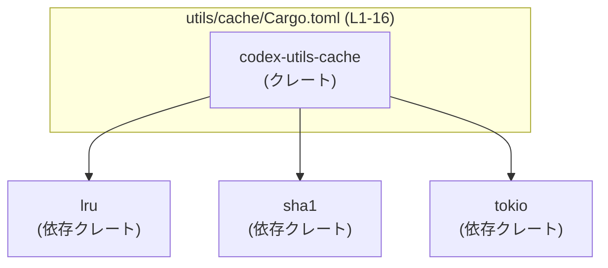
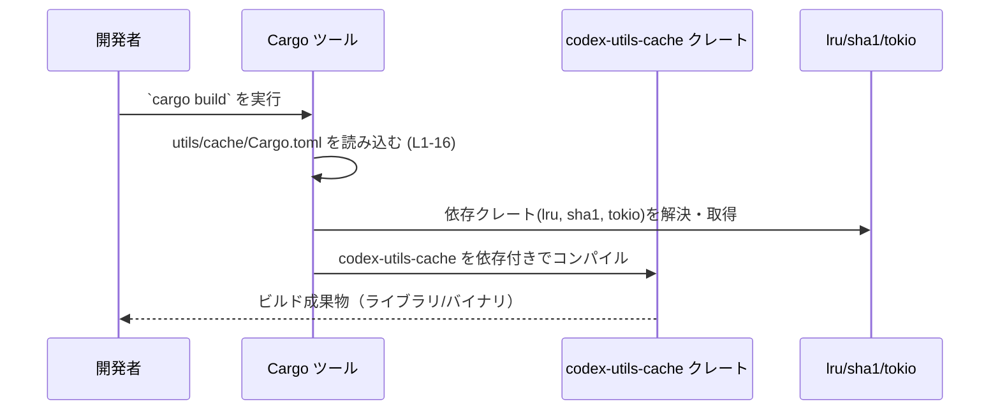

# utils/cache/Cargo.toml

## 0. ざっくり一言

`codex-utils-cache` クレートの Cargo マニフェストであり、ワークスペース共通のメタデータ・リント設定・依存クレート（`lru`, `sha1`, `tokio`）を宣言しているファイルです（実装コード自体はこのチャンクには含まれません）【utils/cache/Cargo.toml:L1-16】。

---

## 1. このモジュールの役割

### 1.1 概要

- このファイルは Rust クレート `codex-utils-cache` の **パッケージ情報と依存関係を定義する設定ファイル（Cargo.toml）** です【L1-2】。
- `version`, `edition`, `license`, `lints` はワークスペース側の設定を継承するようになっています【L3-5, L7-8】。
- 実行時依存として `lru`, `sha1`, `tokio` をワークスペース共通バージョンで利用し【L10-13】、テストや開発用依存として `tokio`（`macros` などの機能付き）を指定しています【L15-16】。

### 1.2 アーキテクチャ内での位置づけ

このファイルから分かるのは、`codex-utils-cache` クレートがワークスペース内で次のような依存関係を持つという点です。



- `codex-utils-cache` 自身のコードや、どのクレートから呼び出されるかといった情報は、このファイルには現れません（不明）。

### 1.3 設計上のポイント（このファイルから読み取れる範囲）

- **ワークスペース集中管理**  
  - `version.workspace = true` / `edition.workspace = true` / `license.workspace = true` により、バージョン・エディション・ライセンスをワークスペース側で一元管理しています【L3-5】。
  - リント設定も `lints.workspace = true` でワークスペース共通化しています【L7-8】。
- **依存バージョンの共有**  
  - `lru`, `sha1`, `tokio` について `workspace = true` を指定し、バージョンや詳細設定をワークスペースで統一しています【L11-13, L16】。
- **非同期実行基盤の前提**  
  - 実行時依存の `tokio` では `sync`, `rt`, `rt-multi-thread` 機能を有効化しており【L13】、非同期・マルチスレッド実行を前提とするコードが存在する可能性があります（実際のコードはこのチャンクには現れません）。
- **開発用機能の切り分け**  
  - `dev-dependencies` でのみ `tokio` の `macros` 機能を有効にしており【L15-16】、テストやベンチマークで `#[tokio::test]` などのマクロを使っている構成が想定されます（ただし、実コードは未提示のため断定はできません）。

---

## 2. 主要な機能一覧 / コンポーネントインベントリー

### 2.1 関数・構造体インベントリー（このファイル）

Cargo.toml は設定ファイルであり、**Rust の関数や構造体定義は一切含まれていません**。

| 種別 | 名前 | 定義箇所 | 備考 |
|------|------|----------|------|
| - | - | - | このファイルには関数・構造体の定義は現れません【L1-16】 |

### 2.2 マニフェストに現れるコンポーネント一覧

このファイルに現れる「コンポーネント」（クレートや設定）を列挙します。

| コンポーネント | 種別 | 役割 / 用途 | 根拠 |
|----------------|------|------------|------|
| `codex-utils-cache` | クレート（パッケージ） | キャッシュ関連のユーティリティクレートと推測されるが、用途は名前以外からは不明。ここではメタデータと依存を定義している。 | `[package]` セクション【L1-2】 |
| `version.workspace` | パッケージ設定 | クレートのバージョン番号をワークスペース定義に委譲する。 | `version.workspace = true`【L3】 |
| `edition.workspace` | パッケージ設定 | 使用する Rust edition をワークスペースで一元管理する。 | `edition.workspace = true`【L4】 |
| `license.workspace` | パッケージ設定 | ライセンス表記をワークスペース定義に委譲する。 | `license.workspace = true`【L5】 |
| `lints.workspace` | リント設定 | clippy などのリント設定をワークスペース共通設定に従わせる。 | `[lints]` + `workspace = true`【L7-8】 |
| `lru` | 依存クレート | LRU キャッシュアルゴリズムの提供で知られるクレート。バージョンはワークスペース依存。 | `[dependencies]` 内 `lru = { workspace = true }`【L10-11】 |
| `sha1` | 依存クレート | SHA-1 ハッシュ計算機能を提供するクレート（一般知識）。用途はこのチャンクからは不明。 | `sha1 = { workspace = true }`【L12】 |
| `tokio`（実行時） | 依存クレート | 非同期ランタイム。`sync`, `rt`, `rt-multi-thread` 機能を有効化している。 | `tokio = { workspace = true, features = ["sync", "rt", "rt-multi-thread"] }`【L13】 |
| `tokio`（開発時） | dev 依存クレート | テストなど開発時に使用する tokio。`macros`, `rt`, `rt-multi-thread` 機能を有効化している。 | `[dev-dependencies]` 内 `tokio = { workspace = true, features = ["macros", "rt", "rt-multi-thread"] }`【L15-16】 |

### 2.3 主要な「機能」（このファイルが提供する役割）

- パッケージメタデータの定義とワークスペースからの継承【L1-5】  
- リント設定のワークスペース共通化【L7-8】  
- 実行時依存クレート (`lru`, `sha1`, `tokio`) の宣言【L10-13】  
- 開発時依存クレート (`tokio` with `macros`) の宣言【L15-16】  

---

## 3. 公開 API と詳細解説

このファイルは **設定ファイル** であり、Rust の公開 API（関数・メソッド・型など）は定義していません。

### 3.1 型一覧（構造体・列挙体など）

- 該当なし（このファイルには型定義は現れません）【L1-16】。

### 3.2 関数詳細

- 該当なし（Cargo.toml には関数定義は存在しません）【L1-16】。  
  したがって、関数詳細テンプレートを適用できる対象はこのチャンクにはありません。

### 3.3 その他の関数

- 該当なし。

実際のキャッシュロジックや公開 API は、おそらく `src/lib.rs` 等の Rust ソースファイル側に存在しますが、このチャンクには現れません（不明）。

---

## 4. データフロー

### 4.1 ビルド時のデータフロー（Cargo とマニフェスト）

このファイルに実行時の処理フローは書かれていないため、**ビルド時に Cargo がどのようにこのマニフェストを利用するか** の観点でデータフローを示します。



- この図は **ビルド過程** を表し、実行時に `codex-utils-cache` がどのような関数をどの順に呼び出すかは、このチャンクからは分かりません。

---

## 5. 使い方（How to Use）

このセクションでは、「Cargo.toml としてこのファイルをどう扱うか」という観点で説明します。  
`codex-utils-cache` クレートが提供する Rust API の使い方は、このチャンクには現れないため説明できません。

### 5.1 基本的な使用方法（同一ワークスペース内の別クレートから利用する）

同じワークスペース内の別クレートから `codex-utils-cache` を利用する場合の、**依存関係の追加例**です（パス等はプロジェクト構成に応じて変更が必要です）。

```toml
# 例: 他クレートの Cargo.toml （同一ワークスペース内）

[dependencies]
codex-utils-cache = { path = "utils/cache" }  # パスは実際のレイアウトに合わせて変更する
```

- 実際の `path` や `version` の指定方法は、ワークスペースのルート `Cargo.toml` の構成に依存します。このチャンクにはそれが現れないため、具体的な値は不明です。

### 5.2 よくある使用パターン（設定ファイルとして）

このファイル自体に対して行う典型的な操作は次のようなものです。

1. **新しい依存クレートの追加**

```toml
[dependencies]
lru = { workspace = true }
sha1 = { workspace = true }
tokio = { workspace = true, features = ["sync", "rt", "rt-multi-thread"] }
serde = { workspace = true }  # 例: 新たに serde を追加
```

- 追加するクレートをワークスペース全体で共有したい場合、ワークスペースの `Cargo.toml` で `serde` のバージョンなどを定義してから `workspace = true` とする、という構成が想定されます。

1. **tokio の機能フラグの調整**

```toml
[dependencies]
tokio = { workspace = true, features = ["sync", "rt-multi-thread", "time"] }  # 例: time 機能を追加
```

- 実際にどの機能が必要かは `codex-utils-cache` の実装コードに依存しますが、このチャンクからは不明です。

### 5.3 よくある間違い（想定される注意点）

コードは見えていませんが、**この Cargo 設定から起こり得る誤用**として代表的なものを挙げます。

```toml
# 間違い例（仮想例）: 本番コードで tokio のマクロを使うのに
[dependencies]
tokio = { workspace = true, features = ["rt", "rt-multi-thread"] }

[dev-dependencies]
tokio = { workspace = true, features = ["macros", "rt", "rt-multi-thread"] }
```

- 本番コードで `#[tokio::main]` / `#[tokio::test]` などマクロを使用する場合、**`macros` 機能が本番ビルドでも有効になっている必要**があります。
- このファイルでは実行時 `tokio` では `macros` を有効にせず、dev-dependencies 側でのみ有効化しています【L13, L16】。
  - これは「テストコードだけで tokio マクロを使う」構成として整合的な可能性があります。
  - 逆に「ライブラリ本体でマクロを使う」場合にはビルド設定を見直す必要があります。

```toml
# 正しい例の一つ（実際に必要なら）
[dependencies]
tokio = { workspace = true, features = ["macros", "rt", "rt-multi-thread", "sync"] }

[dev-dependencies]
tokio = { workspace = true, features = ["macros", "rt", "rt-multi-thread"] }
```

※あくまで一般的な例であり、`codex-utils-cache` が tokio マクロを使っているかどうかは、このチャンクからは分かりません。

### 5.4 使用上の注意点（まとめ）

- **ワークスペース依存**  
  - `version.workspace` などを利用しているため【L3-5】、このクレート単体だけを別プロジェクトにコピーするとビルドできない可能性があります。ワークスペース構成を前提として設計されています。
- **tokio ランタイム前提の可能性**  
  - `rt-multi-thread` を有効にしているため【L13, L16】、実装コードが tokio のマルチスレッドランタイムを前提にしている可能性があります。利用側も tokio ランタイム上でコードを動かす必要があるケースが多いですが、実際の API はこのチャンクからは不明です。
- **セキュリティ関連の注意（sha1）**  
  - `sha1` クレートは SHA-1 ハッシュ計算に用いられることが一般的ですが【L12】、SHA-1 は暗号学的には衝突耐性に問題があることが知られています。  
  - このクレートが `sha1` を何に使っているかは不明ですが、**セキュアな識別・署名用途**に使うのは一般に推奨されません（ハッシュによる単純なキー分散などであれば問題にならないこともあります）。

---

## 6. 変更の仕方（How to Modify）

### 6.1 新しい機能を追加する場合（設定ファイル視点）

ここでは「キャッシュクレートに新しい機能を追加するために必要な Cargo.toml 側の変更」という観点で述べます。実際の Rust コードの変更箇所は、このチャンクからは特定できません。

1. **必要な外部クレートを決める**
   - 例: シリアライズ機能が必要なら `serde` など。
2. **ワークスペース側に依存を追加（必要なら）**
   - ワークスペースの `Cargo.toml` に `serde = "…"`, あるいは `[workspace.dependencies]` を設定する（構成は不明なので一般論）。
3. **このファイルの `[dependencies]` に追加**

```toml
[dependencies]
lru = { workspace = true }
sha1 = { workspace = true }
tokio = { workspace = true, features = ["sync", "rt", "rt-multi-thread"] }
serde = { workspace = true }  # 新しい依存（例）
```

1. **tokio 機能が必要なら feature を追加**
   - 例: タイマー機能が必要 → `features = ["sync", "rt", "rt-multi-thread", "time"]` など。

### 6.2 既存の機能を変更する場合（このファイルで注意すべき点）

- **tokio の機能フラグ変更**
  - 実装コード側で `tokio::sync` を使わなくなった場合、`sync` を features から外すことでビルド時間や依存サイズを抑えられる可能性があります【L13】。
  - 逆に新しく `tokio::fs` などを使う場合は、その機能が必要とする feature を公式ドキュメントで確認し、このファイルに追加する必要があります。
- **ワークスペース共通設定の変更影響**
  - `version.workspace` / `edition.workspace` / `license.workspace` / `lints.workspace` を利用しているため【L3-5, L7-8】、ワークスペース側でこれらを変更するとこのクレートにも影響します。
  - 特に edition 変更（例: 2021 → 2024）は、ビルドや挙動に影響を与えることがあるため、実装コード側の確認が必要です。
- **契約（Contract）的な前提**
  - このファイルの設定に依存している前提条件として、「このクレートが tokio の非同期ランタイムを利用している」「LRU キャッシュ実装として `lru` クレートが利用される」などが想定されますが、具体的な API の契約は実装コードを見ないと分かりません。
  - 設定を変える（例: `lru` を別のキャッシュクレートに置き換える）場合、実装側で `lru` 特有の API を使っていないか確認する必要があります。

---

## 7. 関連ファイル

この Cargo.toml から、関係が強いと思われるファイルや設定を挙げます（内容はこのチャンクには現れません）。

| パス / ファイル | 役割 / 関係 |
|-----------------|------------|
| ワークスペースルートの `Cargo.toml` | `version.workspace` / `edition.workspace` / `license.workspace` / `lints.workspace` および `lru` / `sha1` / `tokio` のバージョンを定義している前提のファイルです【L3-5, L7-8, L11-13, L16】。 |
| `utils/cache/src/...`（想定） | `codex-utils-cache` クレートの実装コードが置かれていると推測されるディレクトリですが、このチャンクには実際のパス・内容は現れません（不明）。 |
| `.cargo/config.toml`（存在すれば） | ビルド対象やプロファイル、フラグなどを追加定義している可能性のある設定ファイルですが、このチャンクからは存在の有無は分かりません。 |

---

### まとめ

- このファイルは **`codex-utils-cache` クレートの Cargo マニフェスト** であり、ワークスペース共通設定と `lru` / `sha1` / `tokio` への依存を宣言していることが分かります【L1-5, L7-8, L10-13, L15-16】。
- Rust の公開 API やコアロジックは別ファイル（ソースコード）にあり、このチャンクからはその詳細やエッジケース、エラー挙動を特定することはできません。
- tokio の非同期・マルチスレッド実行基盤や `sha1` の利用が前提になりうるため、実装側・利用側ともに並行性・セキュリティの観点での確認が必要になりますが、具体的な判断にはソースコードの確認が不可欠です。
