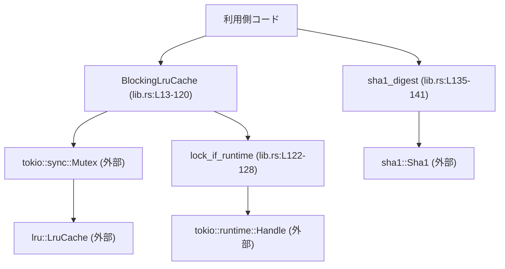
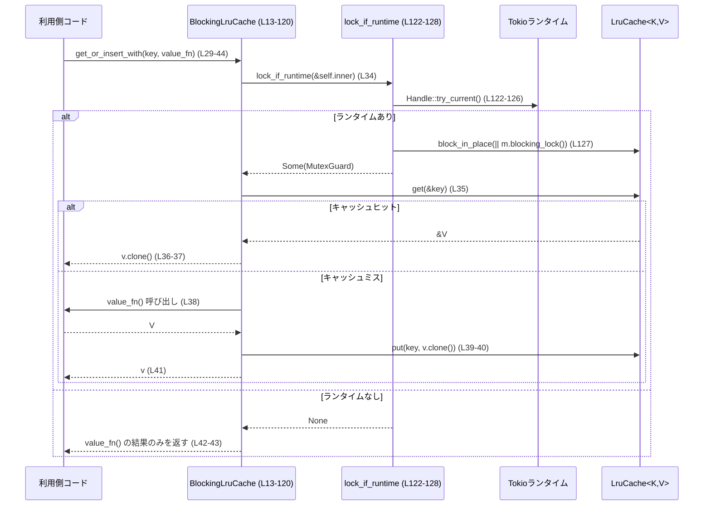

# utils/cache/src/lib.rs

## 0. ざっくり一言

Tokio ランタイムが動作している場合だけ有効になる、同期 API の LRU キャッシュ `BlockingLruCache` と、キャッシュキー向けの SHA‑1 ダイジェスト関数 `sha1_digest` を提供するモジュールです（`lib.rs:L13-120`, `lib.rs:L130-141`）。  
Tokio ランタイム外でのキャッシュ操作は、状態を持たない「無効モード」として振る舞います（`lib.rs:L11-12`, `lib.rs:L34-44`, `lib.rs:L79-81`）。

---

## 1. このモジュールの役割

### 1.1 概要

- このモジュールは **「Tokio ランタイム下で安全に使える同期 LRU キャッシュ」** を提供するために存在し、`BlockingLruCache<K, V>` 構造体とそのメソッド群を定義しています（`lib.rs:L13-120`）。
- キャッシュの内部実装には外部クレート `lru::LruCache` を使用し、並行アクセス制御には `tokio::sync::Mutex` を利用します（`lib.rs:L5`, `lib.rs:L8-9`, `lib.rs:L14`）。
- 付随機能として、バイト列から SHA‑1 ダイジェスト（20 バイト固定長）を計算するユーティリティ関数 `sha1_digest` を提供します（`lib.rs:L130-141`）。

### 1.2 アーキテクチャ内での位置づけ

このモジュール内部と外部依存の関係を簡略化して表すと、次のようになります。



- 利用側コードは `BlockingLruCache` の各メソッドを通じて `lru::LruCache` を操作します。
- すべてのキャッシュ操作は `tokio::sync::Mutex` により排他制御され、実際のロック獲得処理は `lock_if_runtime` 経由で行われます（`lib.rs:L34`, `lib.rs:L79`, `lib.rs:L85`, `lib.rs:L95`, `lib.rs:L101`, `lib.rs:L108`, `lib.rs:L118`, `lib.rs:L122-128`）。
- `lock_if_runtime` は現在スレッドに Tokio ランタイムが存在するかを `tokio::runtime::Handle::try_current()` で確認し、存在しない場合は `None` を返してキャッシュを事実上無効化します（`lib.rs:L122-127`）。
- `sha1_digest` はキャッシュとは独立した純粋関数で、 `sha1::Sha1` にのみ依存します（`lib.rs:L135-140`）。

このチャンクには、同一クレート内の他モジュール（例: `config.rs` など）との直接の依存関係は現れていません。

### 1.3 設計上のポイント

- **責務の分割**
  - `BlockingLruCache` は「同期 API とキャッシュポリシー（LRU）」に責務を持ち（`lib.rs:L13-120`）、実際のロック取得やランタイムの有無判定は `lock_if_runtime` に切り出されています（`lib.rs:L122-128`）。
  - SHA‑1 計算はキャッシュとは別の純粋ユーティリティ関数 `sha1_digest` に分離されています（`lib.rs:L130-141`）。

- **状態管理**
  - キャッシュ内容は `inner: Mutex<LruCache<K, V>>` に保持されます（`lib.rs:L14`）。
  - Tokio ランタイム外では、この `inner` は一切読まれず書き込まれない設計になっており（`lib.rs:L34-44`, `lib.rs:L79-81`, `lib.rs:L85-87`, `lib.rs:L95-96`, `lib.rs:L101-103`, `lib.rs:L108-113`, `lib.rs:L117-119`）、事実上「キャッシュが無効化された状態」として振る舞います。

- **エラーハンドリング方針**
  - キャッシュ操作の失敗は、Tokio ランタイム非存在時を含めて **panic ではなく `Option` / `Result` を通じて表現** されます。
    - 通常の `get` / `insert` / `remove` / `blocking_lock` などは `Option` を返し、`None` は「ヒットしなかった」または「ランタイムがない」ケースを含みます（`lib.rs:L72-81`, `lib.rs:L83-87`, `lib.rs:L89-96`, `lib.rs:L116-119`）。
    - 値生成が失敗しうるケースには `get_or_try_insert_with`（`Result<V, E>`）が用意されています（`lib.rs:L46-64`）。
  - モジュール内部に `unwrap` や `expect` はなく、テストコード内に限定されています（`lib.rs:L151`, `lib.rs:L160`, `lib.rs:L174`）。

- **並行性とブロッキング**
  - `tokio::sync::Mutex` のロック獲得は `tokio::task::block_in_place` を介して同期的に行われます（`lib.rs:L127`）。これにより、非 async なメソッドからでも安全に Mutex を利用できますが、呼び出し元スレッドはロック解放までブロックされます。
  - `Handle::try_current()` により「現在スレッドに紐付く Tokio ランタイムがある場合のみ `block_in_place` を呼ぶ」というガードが設けられています（`lib.rs:L122-127`）。

- **Tokio ランタイム外での挙動**
  - ドキュメントコメントどおり、「Tokio ランタイム外での呼び出しは no-op」となるようにすべてのメソッドが実装されています（`lib.rs:L11-12`, `lib.rs:L34-44`, `lib.rs:L79-81`, `lib.rs:L85-87`, `lib.rs:L95-96`, `lib.rs:L101-103`, `lib.rs:L108-113`, `lib.rs:L117-119`）。
  - テスト `disabled_without_runtime` でこの挙動が検証されています（`lib.rs:L172-192`）。

---

## 2. 主要な機能一覧

### 2.1 機能の概要

- **LRU キャッシュの生成**: 非ゼロ容量を持つ `BlockingLruCache<K, V>` を生成する（`new`, `try_with_capacity`）（`lib.rs:L21-27`, `lib.rs:L66-70`）。
- **計算付き取得（キャッシュミス時に計算）**:
  - `get_or_insert_with`: 値生成クロージャが成功する前提の同期計算付き取得（`lib.rs:L29-44`）。
  - `get_or_try_insert_with`: 値生成が `Result` を返す場合の計算付き取得（`lib.rs:L46-64`）。
- **通常の get/insert/remove/clear 操作**: LRU キャッシュに対する基本操作（`lib.rs:L72-81`, `lib.rs:L83-87`, `lib.rs:L89-96`, `lib.rs:L99-103`）。
- **内部キャッシュへの直接アクセス**:
  - `with_mut`: コールバックを通じて `&mut LruCache<K, V>` を操作（`lib.rs:L106-113`）。
  - `blocking_lock`: `MutexGuard` を返し、手動でキャッシュを操作（`lib.rs:L116-119`）。
- **SHA‑1 ダイジェスト計算**: `sha1_digest` により任意のバイト列から 20 バイトの SHA‑1 ダイジェストを計算（`lib.rs:L130-141`）。

### 2.2 コンポーネント一覧（関数・構造体インベントリー）

| 名称 | 種別 | 公開 | 役割 / 用途 | 定義位置 |
|------|------|------|------------|---------|
| `BlockingLruCache<K, V>` | 構造体 | 公開 | Tokio Mutex 付き LRU キャッシュコンテナ | `lib.rs:L13-15` |
| `impl BlockingLruCache` | impl ブロック | - | 上記構造体のコンストラクタ・操作メソッドを定義 | `lib.rs:L17-120` |
| `new` | メソッド | 公開 | 非ゼロ容量でキャッシュを生成 | `lib.rs:L21-27` |
| `get_or_insert_with` | メソッド | 公開 | キャッシュヒットならクローンを返し、ミスなら値を生成・挿入 | `lib.rs:L29-44` |
| `get_or_try_insert_with` | メソッド | 公開 | `Result` ベースの計算付き取得 | `lib.rs:L46-64` |
| `try_with_capacity` | メソッド | 公開 | 容量が 0 のときは `None` を返すコンストラクタ | `lib.rs:L66-70` |
| `get` | メソッド | 公開 | キーに対応する値のクローンを `Option` で返す | `lib.rs:L72-81` |
| `insert` | メソッド | 公開 | 値を挿入し、古い値を `Option` で返す | `lib.rs:L83-87` |
| `remove` | メソッド | 公開 | キーに対応する値を削除して返す | `lib.rs:L89-96` |
| `clear` | メソッド | 公開 | キャッシュの全エントリを削除 | `lib.rs:L99-103` |
| `with_mut` | メソッド | 公開 | コールバックに `&mut LruCache` を引き渡して任意操作を行う | `lib.rs:L106-113` |
| `blocking_lock` | メソッド | 公開 | `MutexGuard` を返し、明示的にロックを取得 | `lib.rs:L116-119` |
| `lock_if_runtime` | 関数 | 非公開 | Tokio ランタイム存在時にだけ `Mutex` をロックするユーティリティ | `lib.rs:L122-128` |
| `sha1_digest` | 関数 | 公開 | バイト列から SHA‑1 ダイジェストを計算し `[u8; 20]` を返す | `lib.rs:L130-141` |
| `mod tests` | モジュール | 非公開（`cfg(test)`） | `BlockingLruCache` の基本挙動と無効モードをテスト | `lib.rs:L144-192` |
| `stores_and_retrieves_values` | テスト関数 | テストのみ | 基本的な get/insert の動作を検証 | `lib.rs:L149-156` |
| `evicts_least_recently_used` | テスト関数 | テストのみ | LRU ポリシーによる追い出しを検証 | `lib.rs:L158-169` |
| `disabled_without_runtime` | テスト関数 | テストのみ | Tokio ランタイムが無いときに操作が no-op になることを検証 | `lib.rs:L172-192` |

---

## 3. 公開 API と詳細解説

### 3.1 型一覧（構造体）

| 名前 | 種別 | 役割 / 用途 | 主なフィールド | 定義位置 |
|------|------|-------------|----------------|---------|
| `BlockingLruCache<K, V>` | 構造体 | Tokio ランタイム上で同期的に利用できる LRU キャッシュ。ランタイム外では無効モードとして振る舞う。 | `inner: Mutex<LruCache<K, V>>` | `lib.rs:L13-15` |

- 型パラメータ制約: `impl` において `K: Eq + Hash` という制約が付きます（`lib.rs:L17-20`）。値 `V` はキャッシュ操作に応じて `Clone` が要求されるメソッドがあります（`lib.rs:L31-32`, `lib.rs:L52-53`, `lib.rs:L77`）。

### 3.2 関数詳細（重要な API）

#### `BlockingLruCache::new(capacity: NonZeroUsize) -> Self`

**概要**

- 非ゼロの容量を持つ新しい `BlockingLruCache` を生成します（`lib.rs:L21-27`）。
- 内部的には `LruCache::new(capacity)` を `tokio::sync::Mutex` で包んだ構造体を返します（`lib.rs:L24-26`）。

**引数**

| 引数名 | 型 | 説明 |
|--------|----|------|
| `capacity` | `NonZeroUsize` | キャッシュに保持できる最大エントリ数。0 は型レベルで禁止されます。 |

**戻り値**

- `BlockingLruCache<K, V>`: 指定した容量を持つ空のキャッシュインスタンス。

**内部処理の流れ**

1. `LruCache::new(capacity)` を呼んで指定容量の LRU キャッシュを生成します（`lib.rs:L25`）。
2. それを `Mutex::new(...)` で包み、`inner` フィールドに格納します（`lib.rs:L24-26`）。
3. 構築した `BlockingLruCache` を返します（`lib.rs:L24-27`）。

**Examples（使用例）**

```rust
use std::num::NonZeroUsize;
// 実際のパスはこのファイルの配置に依存しますが、ここでは同一クレート直下と仮定します。
// use crate::BlockingLruCache;

fn create_cache<K, V>() -> BlockingLruCache<K, V>
where
    K: Eq + std::hash::Hash, // BlockingLruCache の制約に合わせる
{
    // 0 以外の容量を指定して NonZeroUsize を作成
    let capacity = NonZeroUsize::new(128).expect("capacity must be > 0"); // 0 を渡すと None になる

    // 指定容量のキャッシュを作成
    BlockingLruCache::new(capacity)
}
```

**Errors / Panics**

- この関数自体は `Result` を返さず、内部でも `unwrap` などを使っていないため、通常は panic しません（`lib.rs:L23-27`）。
- ただし、呼び出し側が `NonZeroUsize::new(0).unwrap()` のように 0 から `NonZeroUsize` を生成しようとすると、その時点で panic します。これはこのモジュール外のコードに起因します。

**Edge cases（エッジケース）**

- **容量 1**: 問題なく作成されます。常に最新の 1 エントリのみが保持されます（`LruCache` の仕様による）。
- **非常に大きい容量**: `usize` の範囲内であれば作成可能ですが、その分メモリ消費が増えます。

**使用上の注意点**

- 容量 0 のキャッシュを作りたい場合は、`NonZeroUsize` の制約上 `new` では作れないため、`try_with_capacity` の利用が意図されています（`lib.rs:L66-70`）。
- キャッシュ自体は Tokio ランタイム外でも生成できますが、その場合の操作は後述の通り無効モードになります。

---

#### `BlockingLruCache::get_or_insert_with(&self, key: K, value: impl FnOnce() -> V) -> V`

**概要**

- 指定したキーに対応する値がキャッシュにあればそのクローンを返し、なければ `value` クロージャで値を計算してキャッシュに保存し、その値を返します（`lib.rs:L29-44`）。
- Tokio ランタイム外ではキャッシュを使わず、常に `value` クロージャを実行して値を返します（`lib.rs:L34-44`）。

**引数**

| 引数名 | 型 | 説明 |
|--------|----|------|
| `&self` | `&BlockingLruCache<K, V>` | 対象キャッシュ。内部で排他ロックを取得します。 |
| `key` | `K` | キャッシュキー。`K: Eq + Hash` 制約があります（`lib.rs:L17-20`）。 |
| `value` | `impl FnOnce() -> V` | キャッシュミス時に値を生成するクロージャ。1 回だけ実行されます。 |

**戻り値**

- `V`: キャッシュから取得した値、または `value` クロージャで生成した値。

**内部処理の流れ**

1. `lock_if_runtime(&self.inner)` を呼び出して、Tokio ランタイムが存在し、かつ `Mutex` ロックが取得できるかを確認します（`lib.rs:L34`）。
2. ロック取得成功時（`Some(mut guard)` の場合）:
   1. `guard.get(&key)` でキャッシュを検索します（`lib.rs:L35`）。
   2. ヒットした場合は `v.clone()` を返して終了（`lib.rs:L35-37`）。
   3. ミスした場合は `value()` を実行して値を生成します（`lib.rs:L38`）。
   4. `guard.put(key, v.clone())` でキャッシュにクローンを保存します（`lib.rs:L39-40`）。
   5. 元の `v` を返します（`lib.rs:L41`）。
3. ロック取得失敗時（Tokio ランタイムがないなどで `None` の場合）は、`value()` を実行してそのまま返します（キャッシュには保存されません）（`lib.rs:L42-43`）。

**Examples（使用例）**

Tokio ランタイム上で、重い計算結果をキャッシュする例です。

```rust
use std::num::NonZeroUsize;
// use crate::BlockingLruCache;

#[tokio::main(flavor = "multi_thread")] // block_in_place が利用できるマルチスレッドランタイム
async fn main() {
    let capacity = NonZeroUsize::new(64).expect("capacity > 0");
    let cache = BlockingLruCache::new(capacity);

    let key = "expensive".to_string();

    // 初回はクロージャが実行される
    let v1 = cache.get_or_insert_with(key.clone(), || {
        // 重い計算（ここではダミー）
        42
    });
    // 2 回目以降はキャッシュから値が取得される
    let v2 = cache.get_or_insert_with(key.clone(), || {
        panic!("このクロージャは呼ばれない想定");
    });

    assert_eq!(v1, v2);
}
```

Tokio ランタイム外ではキャッシュが無効であることを示す例（`disabled_without_runtime` テストと同様）。

```rust
use std::num::NonZeroUsize;
// use crate::BlockingLruCache;

fn main() {
    let capacity = NonZeroUsize::new(2).expect("capacity");
    let cache = BlockingLruCache::new(capacity);

    // ランタイムがないため、キャッシュには保存されず毎回クロージャが実行される
    let v1 = cache.get_or_insert_with("key", || 1);
    let v2 = cache.get_or_insert_with("key", || 2);

    assert_eq!(v1, 1);
    assert_eq!(v2, 2); // 1 ではなく 2 になる
}
```

**Errors / Panics**

- このメソッドは `Result` を返さず、内部でも `unwrap` を使わないため、ライブラリ側からの panic はありません（`lib.rs:L29-44`）。
- 値生成クロージャ `value` が panic した場合は、その panic がそのまま伝播します。

**Edge cases（エッジケース）**

- **Tokio ランタイムが存在しない**: `lock_if_runtime` は `None` を返し、クロージャは毎回実行されます（`lib.rs:L34-44`, `lib.rs:L122-127`, `lib.rs:L172-192`）。
- **複数スレッドから同時に同じキーで呼び出し**:
  - ランタイム内では `Mutex` による排他制御で順番に処理されるため、データ競合は発生しません（`lib.rs:L14`, `lib.rs:L34-41`）。
  - ただし、同時に複数スレッドがミスした場合でも、設計上「最初の呼び出しだけが計算する」ことは保証されていません（理論上、二重計算が起こりうるかどうかは `LruCache` の仕様にも依存します）。コードからはそのような最適化は読み取れません。

**使用上の注意点**

- キャッシュを有効に使いたい場合は、**Tokio ランタイム内（かつ `block_in_place` が利用可能なマルチスレッドランタイム）で呼び出す必要があります**（`lib.rs:L122-127`）。
- クロージャ内で時間のかかる処理やブロッキング I/O を行う場合、ロックを長時間保持するため、他のタスクからのキャッシュアクセスが待たされます。

---

#### `BlockingLruCache::get_or_try_insert_with<E>(&self, key: K, value: impl FnOnce() -> Result<V, E>) -> Result<V, E>`

**概要**

- `get_or_insert_with` に似ていますが、値生成クロージャが `Result<V, E>` を返す場合に利用します（`lib.rs:L46-64`）。
- キャッシュミス時にクロージャが `Err` を返した場合、値はキャッシュに保存されず、そのエラーが呼び出し元にそのまま返ります（`lib.rs:L59-61`）。

**引数**

| 引数名 | 型 | 説明 |
|--------|----|------|
| `key` | `K` | キャッシュキー。 |
| `value` | `impl FnOnce() -> Result<V, E>` | ミス時に値またはエラーを返すクロージャ。 |

**戻り値**

- `Result<V, E>`: 成功時は値、失敗時はエラー。

**内部処理の流れ**

1. `lock_if_runtime` でロック取得を試みます（`lib.rs:L55`）。
2. ロック取得成功時:
   - キャッシュヒット時は `Ok(v.clone())` を返します（`lib.rs:L56-57`）。
   - ミス時は `let v = value()?;` で値生成を試み、`Err` が返ればそのまま返します（`lib.rs:L59`）。
   - 成功時のみ `guard.put(key, v.clone())` でキャッシュに保存し、`Ok(v)` を返します（`lib.rs:L60-61`）。
3. ロック取得失敗時（ランタイムがない場合）は `value()` の結果をそのまま返します（`lib.rs:L63`）。

**Examples（使用例）**

```rust
use std::num::NonZeroUsize;
use std::fs;
use std::io;
// use crate::BlockingLruCache;

#[tokio::main(flavor = "multi_thread")]
async fn main() -> io::Result<()> {
    let capacity = NonZeroUsize::new(16).unwrap();
    let cache = BlockingLruCache::new(capacity);

    let path = "data.txt".to_string();

    let contents = cache.get_or_try_insert_with(path.clone(), || {
        // ファイルを読み込む。失敗しうるので Result を返す
        fs::read_to_string(&path)
    })?;

    println!("data: {}", contents);
    Ok(())
}
```

**Errors / Panics**

- 値生成クロージャが `Err(e)` を返した場合、そのまま `Err(e)` が呼び出し元に返ります（`lib.rs:L59-61`）。
- キャッシュへの保存は成功時 (`Ok`) のみ行われるため、失敗した計算結果がキャッシュに残ることはありません（`lib.rs:L59-61`）。
- ライブラリ側で panic を起こすコードは含まれていません。

**Edge cases（エッジケース）**

- **Tokio ランタイムがない場合**: `lock_if_runtime` が `None` を返し、`value()` の結果をそのまま返します（`lib.rs:L63`, `lib.rs:L122-127`）。成功時も失敗時もキャッシュには何も保存されません。
- **クロージャが panic する場合**: panic はそのまま伝播し、キャッシュは変更されません。

**使用上の注意点**

- エラー時に再試行したい場合、呼び出し側で `Err` を受け取ってから再度 `get_or_try_insert_with` を呼ぶ必要があります。
- `E` の型は自由ですが、ログ出力などと組み合わせる場合はユーザー定義エラー型や `anyhow::Error` などを使う設計も考えられます（このモジュールからは詳細は分かりません）。

---

#### `BlockingLruCache::get<Q>(&self, key: &Q) -> Option<V>`

**概要**

- 指定されたキーに対応する値のクローンを `Option<V>` として返します（`lib.rs:L72-81`）。
- キーは `K` とは別の型 `Q` を借用して検索できます（`K: Borrow<Q>`）（`lib.rs:L73-77`）。
- Tokio ランタイム外では必ず `None` を返します（`lib.rs:L79-81`, `lib.rs:L122-127`, `lib.rs:L172-192`）。

**引数**

| 引数名 | 型 | 説明 |
|--------|----|------|
| `key` | `&Q` | 借用キー。`K: Borrow<Q>` かつ `Q: Eq + Hash + ?Sized`（`lib.rs:L73-77`）。 |

**戻り値**

- `Option<V>`: ヒット時は `Some(V)`（値のクローン）、ミスまたはランタイム非存在時は `None`。

**内部処理の流れ**

1. `let mut guard = lock_if_runtime(&self.inner)?;` によりロック取得と early return を一度に処理します（`lib.rs:L79`）。
   - ランタイム非存在時はここで `None` が返り、関数全体も `None` を返します。
2. `guard.get(key).cloned()` により、ヒット時はクローンされた値が `Some` として返ります（`lib.rs:L80-81`）。

**Examples（使用例）**

```rust
use std::num::NonZeroUsize;
// use crate::BlockingLruCache;

#[tokio::main(flavor = "multi_thread")]
async fn main() {
    let capacity = NonZeroUsize::new(2).unwrap();
    let cache = BlockingLruCache::new(capacity);

    cache.insert("a".to_string(), 10);

    // &str から String キーへの検索（Borrow を利用）
    assert_eq!(cache.get("a"), Some(10));
}
```

**Errors / Panics**

- エラーは `Option` を通じて表現され、panic を起こすコードはありません（`lib.rs:L79-81`）。

**Edge cases（エッジケース）**

- **Tokio ランタイムがない場合**: `disabled_without_runtime` テストが示す通り、`insert` の後でも `get` は常に `None` を返します（`lib.rs:L175-177`, `lib.rs:L172-192`）。
- **存在しないキー**: 通常の LRU キャッシュと同様に `None` を返します（`lib.rs:L80-81`, `lib.rs:L149-156` のテストで確認）。

**使用上の注意点**

- 「キャッシュミス」なのか「ランタイムがないためにそもそもキャッシュされていない」のかは `get` の戻り値だけでは区別できません。
  - 必ずキャッシュを効かせたい場合は、呼び出し側が Tokio ランタイム内で動作していることを前提にする必要があります。

---

#### `BlockingLruCache::with_mut<R>(&self, callback: impl FnOnce(&mut LruCache<K, V>) -> R) -> R`

**概要**

- 内部の `LruCache<K, V>` へのミュータブル参照を、コールバックを通じて利用できるメソッドです（`lib.rs:L106-113`）。
- Tokio ランタイム内では実際のキャッシュをロックしてコールバックに渡します。ランタイム外では、一時的な `LruCache::unbounded()` を生成し、それをコールバックに渡します（`lib.rs:L108-113`）。

**引数**

| 引数名 | 型 | 説明 |
|--------|----|------|
| `callback` | `impl FnOnce(&mut LruCache<K, V>) -> R` | `LruCache` を直接操作するためのコールバック。1 回だけ実行され、戻り値 `R` はそのまま `with_mut` の戻り値になります。 |

**戻り値**

- `R`: コールバックの戻り値。

**内部処理の流れ**

1. `lock_if_runtime(&self.inner)` でロック取得を試みます（`lib.rs:L108`）。
2. ロック取得成功時:
   - `callback(&mut guard)` を実行し、その戻り値を返します（`lib.rs:L108-110`）。
3. ロック取得失敗時（ランタイムなし）:
   - `LruCache::unbounded()` で容量無制限の一時キャッシュを作成し（`lib.rs:L111`）、そのミュータブル参照をコールバックに渡します（`lib.rs:L111-112`）。
   - コールバックの戻り値を返しますが、一時キャッシュはスコープを抜けると破棄され、`BlockingLruCache` の内部状態には一切反映されません（`lib.rs:L111-113`）。
   - この挙動は `disabled_without_runtime` テストで確認できます（`lib.rs:L184-189`）。

**Examples（使用例）**

キャッシュのサイズを取得する例（Tokio ランタイム内）。

```rust
use std::num::NonZeroUsize;
// use crate::BlockingLruCache;

#[tokio::main(flavor = "multi_thread")]
async fn main() {
    let cache = BlockingLruCache::new(NonZeroUsize::new(4).unwrap());
    cache.insert("a", 1);
    cache.insert("b", 2);

    // with_mut を使って内部 LruCache に直接アクセス
    let len = cache.with_mut(|inner| {
        inner.len() // lru::LruCache の len メソッドを想定
    });

    assert_eq!(len, 2);
}
```

Tokio ランタイム外での挙動は、`disabled_without_runtime` テストと同じです（`lib.rs:L184-189`）。

**Errors / Panics**

- ライブラリ側で `Result` を返したり panic を発生させるコードはありません。
- コールバック内で panic が発生した場合、`MutexGuard` はスタックアンワインドによりドロップされ、ロックは解放されます（Rust の通常のスコープ規則による）。

**Edge cases（エッジケース）**

- **Tokio ランタイムがない場合**: コールバックが操作するのは一時的な `LruCache::unbounded()` であり、`BlockingLruCache` 本体には何も反映されません（`lib.rs:L111-113`, `lib.rs:L184-189`）。
- **重い処理をコールバック内で行う**: 実際のキャッシュをロックした状態で長時間の処理を行うと、他のスレッド/タスクがキャッシュを利用できなくなります。

**使用上の注意点**

- `with_mut` を使うと `LruCache` の全 API にアクセスできますが、ロック保持時間が長くならないようにコールバック内の処理時間には注意が必要です。
- ランタイム外での利用時には、キャッシュ状態が保持されないことを前提に使う必要があります。

---

#### `BlockingLruCache::blocking_lock(&self) -> Option<MutexGuard<'_, LruCache<K, V>>>`

**概要**

- 内部 `Mutex<LruCache<K, V>>` のロックを同期的に取得し、`MutexGuard` として返します（`lib.rs:L116-119`）。
- Tokio ランタイム外では `None` を返し、ロックは取得されません（`lib.rs:L118`, `lib.rs:L122-127`）。

**引数**

| 引数名 | 型 | 説明 |
|--------|----|------|
| `&self` | `&BlockingLruCache<K, V>` | 対象キャッシュ。 |

**戻り値**

- `Option<MutexGuard<'_, LruCache<K, V>>>`: ロック取得成功時は `Some(guard)`、Tokio ランタイムがないなどでロック取得を行わない場合は `None`。

**内部処理の流れ**

1. 単に `lock_if_runtime(&self.inner)` を呼び、その戻り値を返します（`lib.rs:L118`）。
2. `lock_if_runtime` 内では、`Handle::try_current()` で現在スレッドに紐づく Tokio ランタイムの有無を判定します（`lib.rs:L122-126`）。
3. ランタイムがある場合は `block_in_place(|| m.blocking_lock())` を実行し、`Mutex` を同期的にロックします（`lib.rs:L127`）。

**Examples（使用例）**

```rust
use std::num::NonZeroUsize;
// use crate::BlockingLruCache;

#[tokio::main(flavor = "multi_thread")]
async fn main() {
    let cache = BlockingLruCache::new(NonZeroUsize::new(4).unwrap());
    cache.insert("key", 1);

    if let Some(mut guard) = cache.blocking_lock() {
        // guard 経由で LruCache<K, V> に直接アクセス
        assert_eq!(guard.get(&"key"), Some(&1));
        guard.clear(); // 全削除
    } else {
        // ランタイム外などでロックが取れないケース
    }
}
```

**Errors / Panics**

- ランタイム外（`Handle::try_current()` が失敗する場合）にはロック取得を試みずに `None` を返します（`lib.rs:L122-127`）。
- Tokio のドキュメントによると、`block_in_place` はマルチスレッドランタイム向けの API であり、current_thread ランタイムで使用すると panic する仕様があります。コード上ではランタイムの有無は確認していますが、ランタイムの「種類」までは判別していません（`lib.rs:L122-127`）。したがって **current_thread ランタイム上でこのメソッドを呼ぶと panic する可能性があります**（Tokio の外部仕様に基づく注意点）。

**Edge cases（エッジケース）**

- **Tokio ランタイムがない場合**: `None` を返します（`lib.rs:L118`, `lib.rs:L122-127`, `lib.rs:L191-192`）。
- **ガードを長時間保持**: ロック中に重い処理を行うと他スレッドのキャッシュ利用をブロックします。

**使用上の注意点**

- `blocking_lock` は低レベルな API であり、一般的には `with_mut` の使用が簡便です。
- current_thread ランタイム上での使用は Tokio 仕様上の制約に注意が必要です（このモジュールでは明示的なガードはありません）。

---

#### `pub fn sha1_digest(bytes: &[u8]) -> [u8; 20]`

**概要**

- 与えられたバイト列 `bytes` の SHA‑1 ダイジェストを計算し、20 バイト固定長の配列として返すユーティリティ関数です（`lib.rs:L130-141`）。
- コメントにあるように、ファイルパスなどの単純なキーによるキャッシュの「古さ」を回避するため、**コンテンツハッシュベースのキャッシュキー**を作成する用途が想定されています（`lib.rs:L132-133`）。

**引数**

| 引数名 | 型 | 説明 |
|--------|----|------|
| `bytes` | `&[u8]` | SHA‑1 ダイジェストを計算する対象のバイト列。長さは任意です。 |

**戻り値**

- `[u8; 20]`: SHA‑1 ダイジェスト（160 ビット = 20 バイト）の値。

**内部処理の流れ**

1. `Sha1::new()` でハッシュコンテキストを生成（`lib.rs:L136`）。
2. `hasher.update(bytes);` で入力バイト列をハッシュに供給（`lib.rs:L137`）。
3. `let result = hasher.finalize();` で計算完了し、`result` にダイジェストが格納されます（`lib.rs:L138`）。`sha1::Digest` トレイトに依存します（`lib.rs:L6`）。
4. `[u8; 20]` の配列 `out` を 0 で初期化し（`lib.rs:L139`）、`out.copy_from_slice(&result);` でダイジェスト内容をコピー（`lib.rs:L140`）。
5. `out` を返します（`lib.rs:L141`）。

**Examples（使用例）**

```rust
// use crate::sha1_digest;

fn main() {
    let data = b"hello world";
    let digest = sha1_digest(data);

    // キャッシュキーとして 16 進文字列に変換する例
    let hex_key: String = digest.iter().map(|b| format!("{:02x}", b)).collect();
    println!("sha1: {}", hex_key);
}
```

**Errors / Panics**

- `Sha1::finalize()` および `copy_from_slice` は、`sha1` クレートの設計上、正しい長さの配列間コピーになるため、通常は panic しません（`result` は 20 バイト固定長のダイジェストであり、`out` も 20 バイトです）。

**Edge cases（エッジケース）**

- **空入力 (`bytes.is_empty() == true`)**: SHA‑1 の定義に従った空文字列のハッシュが計算されます（`lib.rs:L135-141`）。
- **非常に大きな入力**: 計算時間・メモリ使用量は `sha1` クレートの実装に依存しますが、この関数はストリーム処理的に `update` を呼んでいるため、入力全体をコピーすることはありません。

**使用上の注意点**

- SHA‑1 は暗号学的には強度が低いとされており、セキュリティ目的の完全性保証には一般に推奨されていません。ただし、このモジュールのコメントにある通り、「キャッシュキー」として使う用途では依然として実用性があります（`lib.rs:L132-133`）。
- 汎用的なハッシュ関数として他の部分でも使いたくなるかもしれませんが、この関数はこのモジュール内では「キャッシュキー生成の補助」が主目的です。

---

### 3.3 その他の関数・メソッド

主要 API 以外のメソッド・内部関数の役割を一覧にまとめます。

| 関数名 / メソッド名 | 役割（1 行） | 定義位置 | 補足 |
|---------------------|-------------|----------|------|
| `BlockingLruCache::try_with_capacity(capacity: usize) -> Option<Self>` | `capacity > 0` のときだけ `Some(BlockingLruCache)` を返すコンストラクタヘルパー | `lib.rs:L66-70` | `NonZeroUsize::new` を内部で呼び出し（`lib.rs:L69`）、0 のケースを `None` で表現します。 |
| `BlockingLruCache::insert(&self, key: K, value: V) -> Option<V>` | 新しい値を挿入し、既存の値があればそれを返す | `lib.rs:L83-87` | ランタイムが無い場合は `None` を返し、挿入は行われません（`lib.rs:L85`, `lib.rs:L122-127`）。 |
| `BlockingLruCache::remove<Q>(&self, key: &Q) -> Option<V>` | キーに対応する値を削除して返す | `lib.rs:L89-96` | ランタイム外では `None` を返し、内部状態は変化しません。 |
| `BlockingLruCache::clear(&self)` | キャッシュの全エントリを削除する | `lib.rs:L99-103` | ランタイム外では何も行いません（`lib.rs:L100-103`）。 |
| `lock_if_runtime<K, V>(m: &Mutex<LruCache<K, V>>) -> Option<MutexGuard<'_, LruCache<K, V>>>` | 現在スレッドに Tokio ランタイムがある場合のみ `Mutex` を同期ロックし、`MutexGuard` を返す | `lib.rs:L122-128` | `Handle::try_current()` 成功時にだけ `block_in_place` で `blocking_lock()` を実行します。 |

---

## 4. データフロー

ここでは、典型的なシナリオとして `get_or_insert_with` の呼び出し時のデータ・制御フローを示します。

### 4.1 `get_or_insert_with` 呼び出しフロー

Tokio ランタイムあり / なしの両ケースを含むシーケンス図です。



- ランタイム存在時には、`tokio::sync::Mutex` のガードを取得した上で LRU キャッシュを読み書きします（`lib.rs:L34-41`）。
- ランタイム非存在時には、ロック取得・キャッシュアクセスは一切行われず、値生成クロージャが直接実行されます（`lib.rs:L42-43`, `lib.rs:L122-127`, `lib.rs:L172-192`）。

### 4.2 テストによる挙動確認

- `stores_and_retrieves_values` テストは、Tokio ランタイム上で `insert` → `get` が正常に動作することを検証しています（`lib.rs:L149-156`）。
- `evicts_least_recently_used` テストは、2 要素容量のキャッシュに対し、アクセスパターンに基づいて LRU が正しく追い出されることを確認しています（`lib.rs:L158-169`）。
- `disabled_without_runtime` テストは、Tokio ランタイム外で `insert` / `get` 等を呼んでも実際にはキャッシュされない（常に `None` になる）こと、および `with_mut` が一時キャッシュで動作することを確認しています（`lib.rs:L172-192`）。

---

## 5. 使い方（How to Use）

### 5.1 基本的な使用方法

Tokio マルチスレッドランタイム上で `BlockingLruCache` を使い、重い計算結果をキャッシュする基本例です。

```rust
use std::num::NonZeroUsize;
// 実際のパスはクレート構成に依存します。ここでは同一クレート直下と仮定して `crate::BlockingLruCache` を使います。
use crate::BlockingLruCache;

#[tokio::main(flavor = "multi_thread")] // block_in_place が利用できるランタイム
async fn main() {
    // 容量 128 のキャッシュを作成する（0 は許されないので NonZeroUsize::new でガード）
    let capacity = NonZeroUsize::new(128).expect("capacity > 0");
    let cache: BlockingLruCache<String, String> = BlockingLruCache::new(capacity);

    let path = "data.bin".to_string();

    // キャッシュミス時にのみファイルから読み込む
    let contents = cache.get_or_insert_with(path.clone(), || {
        // ここに重い計算や I/O を書く
        std::fs::read_to_string(&path).unwrap_or_default()
    });

    println!("{}", contents);
}
```

ポイント:

- `BlockingLruCache` は **同期メソッド** しか提供しませんが、内部で `block_in_place` を使うことで Tokio ランタイム内から利用可能になっています（`lib.rs:L122-128`）。
- 容量 0 を避けるために `NonZeroUsize` を利用します（`lib.rs:L21-27`）。

### 5.2 よくある使用パターン

#### 5.2.1 失敗しうる計算のキャッシュ（`get_or_try_insert_with`）

```rust
use std::num::NonZeroUsize;
use std::io;
// use crate::BlockingLruCache;

#[tokio::main(flavor = "multi_thread")]
async fn main() -> io::Result<()> {
    let cache = BlockingLruCache::new(NonZeroUsize::new(8).unwrap());

    let path = "config.toml".to_string();

    let config_text = cache.get_or_try_insert_with(path.clone(), || {
        std::fs::read_to_string(&path) // io::Result<String> を返す
    })?; // エラーならここで早期リターン

    println!("{}", config_text);
    Ok(())
}
```

- 成功した結果のみがキャッシュされるため、失敗した I/O をキャッシュしてしまうことはありません（`lib.rs:L59-61`）。

#### 5.2.2 `with_mut` で詳細な制御を行う

```rust
use std::num::NonZeroUsize;
// use crate::BlockingLruCache;

#[tokio::main(flavor = "multi_thread")]
async fn main() {
    let cache = BlockingLruCache::new(NonZeroUsize::new(4).unwrap());
    cache.insert("a", 1);
    cache.insert("b", 2);

    // with_mut で内部 LruCache を直接操作して、キャッシュサイズとキー一覧を得る
    let (len, keys) = cache.with_mut(|inner| {
        let len = inner.len();                         // 要素数
        let keys: Vec<_> = inner.iter().map(|(k, _)| k.clone()).collect(); // キー一覧（Clone 必要）

        (len, keys)
    });

    println!("len = {}, keys = {:?}", len, keys);
}
```

### 5.3 よくある間違い

#### 間違い例 1: Tokio ランタイム外でキャッシュを期待する

```rust
use std::num::NonZeroUsize;
// use crate::BlockingLruCache;

// 間違い例: 通常の同期テストでキャッシュを期待しているが、ランタイムがない
#[test]
fn cache_does_not_work_here() {
    let cache = BlockingLruCache::new(NonZeroUsize::new(2).unwrap());
    cache.insert("key", 1);

    // ランタイムがないため、常に None になる
    assert_eq!(cache.get(&"key"), None);
}
```

正しい例（Tokio テストを使う）:

```rust
use std::num::NonZeroUsize;
// use crate::BlockingLruCache;

#[tokio::test(flavor = "multi_thread")]
async fn cache_works_with_runtime() {
    let cache = BlockingLruCache::new(NonZeroUsize::new(2).unwrap());
    cache.insert("key", 1);

    // ランタイム内ではキャッシュが有効
    assert_eq!(cache.get(&"key"), Some(1));
}
```

この挙動は `disabled_without_runtime` テストで確認されています（`lib.rs:L172-192`）。

#### 間違い例 2: `blocking_lock` を current_thread ランタイムで使う

Tokio の仕様では `block_in_place` はマルチスレッドランタイム専用です。`blocking_lock` は内部で `block_in_place` を呼び出すため（`lib.rs:L118`, `lib.rs:L122-128`）、current_thread ランタイムでは panic する可能性があります。

- 回避策としては、マルチスレッドランタイムを使うか（`#[tokio::main(flavor = "multi_thread")]`）、`blocking_lock` の代わりに `with_mut` を利用して API 越しに操作する方法が考えられます。

### 5.4 使用上の注意点（まとめ）

- **Tokio ランタイム依存**:
  - `BlockingLruCache` のキャッシュ機能は「現在スレッドに Tokio ランタイムが存在する場合」のみに有効です（`lib.rs:L122-127`）。
  - ランタイム外では各操作は no-op になり、実際にはキャッシュされません（`lib.rs:L11-12`, `lib.rs:L172-192`）。

- **ランタイムの種類（マルチスレッド vs current_thread）**:
  - `blocking_lock` / それを内部で利用するメソッドは `tokio::task::block_in_place` に依存しており、Tokio の仕様上 current_thread ランタイムでは利用できません。

- **スレッド安全性**:
  - すべてのキャッシュ操作は `tokio::sync::Mutex` を通じて直列化されるため、Rust の型システムと合わせてデータ競合は防がれています（`lib.rs:L14`, `lib.rs:L34`, `lib.rs:L79`, `lib.rs:L85`, `lib.rs:L95`, `lib.rs:L101`, `lib.rs:L108`, `lib.rs:L118`）。
  - ただし、ロック時間が長くなるような重い処理は避けるのが望ましいです。

- **エラー伝播**:
  - 値生成が失敗しうる場合は `get_or_try_insert_with` を使い、`Err` を呼び出し元で適切に処理する必要があります（`lib.rs:L46-64`）。

- **SHA‑1 の利用目的**:
  - `sha1_digest` はキャッシュキー用のコンテンツハッシュとして設計されており（`lib.rs:L132-133`）、暗号学的な強度が要求される用途には適しません。

---

## 6. 変更の仕方（How to Modify）

### 6.1 新しい機能を追加する場合

このファイルに新しい機能を追加する際の一般的な入口を整理します。

1. **新しいキャッシュ操作メソッドを追加したい場合**
   - 追加先: `impl<K, V> BlockingLruCache<K, V>` ブロック内（`lib.rs:L17-120`）。
   - 既存のメソッドのパターンに従い、Tokio ランタイム依存の挙動を `lock_if_runtime` 経由で統一すると、現在の設計と整合的です（`lib.rs:L34`, `lib.rs:L79`, `lib.rs:L85`, `lib.rs:L95`, `lib.rs:L101`, `lib.rs:L108`, `lib.rs:L118`）。
   - 例: 現在キャッシュされている要素数を返す `len()` メソッドを追加する場合、`with_mut` を内部で利用して `inner.len()` を取得する実装が考えられます。

2. **キャッシュポリシー変更や設定項目を追加したい場合**
   - `BlockingLruCache` 構造体にフィールドを追加する場合は、構造体定義（`lib.rs:L13-15`）と `new` / `try_with_capacity` の実装（`lib.rs:L23-27`, `lib.rs:L66-70`）を合わせて拡張する必要があります。
   - `lru::LruCache` に依存しない別ポリシーを導入する場合は、型パラメータや内部フィールドの差し替えなど、設計全体の見直しが必要になります（このチャンクからは具体的な要件は分かりません）。

3. **SHA‑1 以外のハッシュ関数を追加したい場合**
   - `sha1_digest` と同様の形式で新しい関数を追加するのが自然です（`lib.rs:L130-141`）。
   - 例: `blake3_digest` などを別関数として定義し、コメントで用途を明示します。

### 6.2 既存の機能を変更する場合

既存メソッド・関数を変更する際に注意すべき点を整理します。

- **Tokio ランタイム外での no-op 契約**
  - ドキュメントコメントで「Calls outside a Tokio runtime are no-ops.」と明記されており（`lib.rs:L11-12`）、`disabled_without_runtime` テストでこの挙動が依存されています（`lib.rs:L172-192`）。
  - `lock_if_runtime` の戻り値 `None` に対して、各メソッドがどのように反応するか（`get` が `None` を返す、`insert` が何もしない、`with_mut` が一時キャッシュを使うなど）は、その契約の一部になっています（`lib.rs:L34-44`, `lib.rs:L79-81`, `lib.rs:L85-87`, `lib.rs:L95-96`, `lib.rs:L101-103`, `lib.rs:L108-113`, `lib.rs:L117-119`）。
  - この挙動を変更する場合、テストの更新と、利用コードへの影響検討が必要です。

- **ロック取得方法 (`lock_if_runtime`) の変更**
  - `lock_if_runtime` によって、Tokio ランタイムの有無判定と `block_in_place` による同期ロック取得が行われています（`lib.rs:L122-128`）。
  - ここを変更すると、全メソッドの並行性・ブロッキング挙動に影響します。
  - current_thread ランタイム対応のためにロック方法を変える場合でも、`Handle::try_current()` によるランタイム存在確認と「ランタイム外では no-op」という契約を維持するかどうかを明確にする必要があります。

- **SHA‑1 実装の差し替え**
  - `sha1` クレートに依存しているため（`lib.rs:L6-7`, `lib.rs:L135-138`）、別のハッシュ実装に差し替える場合は、`Digest` トレイトのインポートや `finalize()` の戻り値型に応じた修正が必要です。
  - 戻り値 `[u8; 20]` は SHA‑1 特有の長さなので、他アルゴリズムに変更する際には戻り値型も合わせて検討します。

- **テストの影響範囲**
  - 基本的な get/insert/evict 挙動は `stores_and_retrieves_values` と `evicts_least_recently_used` がカバーしています（`lib.rs:L149-169`）。
  - ランタイム外挙動は `disabled_without_runtime` がカバーしています（`lib.rs:L172-192`）。
  - これらのテストに影響する変更は、契約の変更を意味する可能性があります。

---

## 7. 関連ファイル・外部依存

このチャンクに現れる関連モジュール・外部クレートをまとめます。

| パス / シンボル | 役割 / 関係 | 根拠 |
|----------------|------------|------|
| `lru::LruCache` | 実際の LRU キャッシュロジックを提供する外部クレート。`BlockingLruCache` の内部ストレージとして使用されます。 | `lib.rs:L5`, `lib.rs:L14`, `lib.rs:L107`, `lib.rs:L111` |
| `tokio::sync::Mutex` / `MutexGuard` | LRU キャッシュへの並行アクセスを直列化する非同期 Mutex。`BlockingLruCache` の `inner` フィールドに使われます。 | `lib.rs:L8-9`, `lib.rs:L14`, `lib.rs:L122-128` |
| `tokio::runtime::Handle` | 現在スレッドの Tokio ランタイム存在判定に利用されます。 | `lib.rs:L122-126` |
| `tokio::task::block_in_place` | Mutex ロック取得を同期的に行うために使用されます。 | `lib.rs:L127` |
| `sha1::Sha1` / `sha1::Digest` | SHA‑1 ダイジェスト計算のための外部クレート。`sha1_digest` で利用されます。 | `lib.rs:L6-7`, `lib.rs:L135-138` |
| `mod tests` | `BlockingLruCache` の基本機能とランタイム外挙動を確認するテストモジュール。 | `lib.rs:L144-192` |

このチャンクには、同一クレート内の他ファイル（例: 設定モジュール、HTTP クライアントなど）との直接の関係は現れていません。そのため、それらとの連携方法についてはこのファイルからは判断できません。
