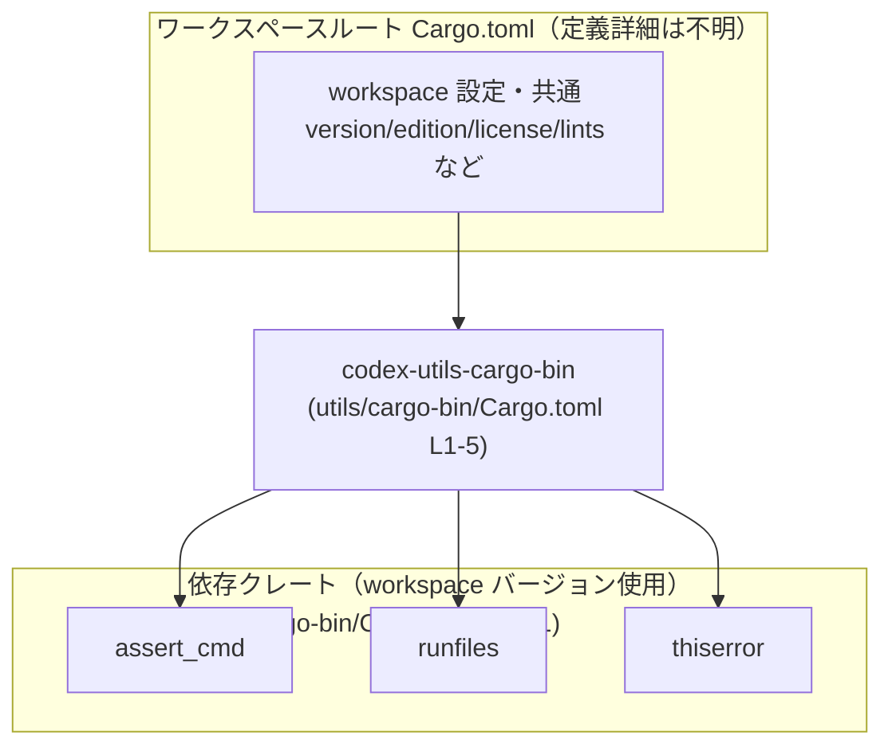
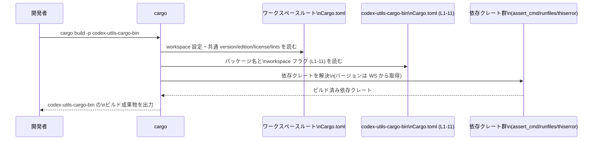

# utils/cargo-bin/Cargo.toml コード解説

## 0. ざっくり一言

`codex-utils-cargo-bin` というパッケージを、ワークスペース共通の設定と依存関係で定義するための Cargo マニフェスト（設定ファイル）です（`utils/cargo-bin/Cargo.toml:L1-11`）。

---

## 1. このモジュールの役割

### 1.1 概要

- このファイルは Rust パッケージ `codex-utils-cargo-bin` の **メタデータと依存関係** を定義します（`[package]` セクション, `utils/cargo-bin/Cargo.toml:L1-5`）。
- バージョン・エディション・ライセンス・lints（警告設定）・依存クレートは、すべて `workspace = true` により **ワークスペースルート側で一元管理** されています（`utils/cargo-bin/Cargo.toml:L3-5,L7,L9-11`）。

### 1.2 アーキテクチャ内での位置づけ

このパッケージは Cargo ワークスペースの一員として、ワークスペース共通の設定・依存バージョンを利用します。



- パッケージ名と基本情報は `[package]` セクションで定義されています（`utils/cargo-bin/Cargo.toml:L1-5`）。
- lints 設定は `[lints]` セクションでワークスペース共有になっています（`utils/cargo-bin/Cargo.toml:L6-7`）。
- 依存クレート `assert_cmd`, `runfiles`, `thiserror` は `[dependencies]` セクションで、バージョンをワークスペースに委譲しています（`utils/cargo-bin/Cargo.toml:L8-11`）。

### 1.3 設計上のポイント

コードから読み取れる設計上の特徴は次のとおりです。

- **設定の一元管理**  
  - `version.workspace = true`, `edition.workspace = true`, `license.workspace = true` により、パッケージごとに値を分散させず、ワークスペースの設定をそのまま利用しています（`utils/cargo-bin/Cargo.toml:L3-5`）。
- **lints 設定の共有**  
  - `[lints]` セクションで `workspace = true` を指定し、警告やコンパイラ lints の方針をワークスペースで共通化しています（`utils/cargo-bin/Cargo.toml:L6-7`）。
- **依存バージョンの共通化**  
  - `assert_cmd`, `runfiles`, `thiserror` についても `{ workspace = true }` を指定し、依存バージョンをワークスペースルートで統一管理する方針になっています（`utils/cargo-bin/Cargo.toml:L9-11`）。
- **このファイル自体にはロジックなし**  
  - Rust の関数や構造体は一切定義されておらず、このファイルはビルド設定と依存定義のみを持つマニフェストです（全行を確認, `utils/cargo-bin/Cargo.toml:L1-11`）。

---

## 2. 主要な機能一覧

この `Cargo.toml` が提供する「機能」は、実行時ロジックではなく設定レベルの機能です。

- パッケージ定義: パッケージ名を `codex-utils-cargo-bin` に設定し、バージョン・エディション・ライセンスをワークスペースから継承する（`utils/cargo-bin/Cargo.toml:L1-5`）。
- lints 設定の継承: コンパイラの警告／lints ポリシーをワークスペースと共有する（`utils/cargo-bin/Cargo.toml:L6-7`）。
- 依存クレートの宣言: `assert_cmd`, `runfiles`, `thiserror` への依存を宣言し、そのバージョンをワークスペースで一元管理する（`utils/cargo-bin/Cargo.toml:L8-11`）。

### 2.1 コンポーネント一覧（設定要素インベントリー）

| コンポーネント | 種別 | 説明 | 根拠 |
|----------------|------|------|------|
| `codex-utils-cargo-bin` | パッケージ名 | このパッケージの名前 | `utils/cargo-bin/Cargo.toml:L2` |
| `version.workspace` | パッケージメタデータ | バージョン番号をワークスペースから継承 | `utils/cargo-bin/Cargo.toml:L3` |
| `edition.workspace` | パッケージメタデータ | Rust edition をワークスペースから継承 | `utils/cargo-bin/Cargo.toml:L4` |
| `license.workspace` | パッケージメタデータ | ライセンス表記をワークスペースから継承 | `utils/cargo-bin/Cargo.toml:L5` |
| `[lints]` + `workspace = true` | lints 設定 | lints ポリシーをワークスペースで共有 | `utils/cargo-bin/Cargo.toml:L6-7` |
| `assert_cmd` | 依存クレート | ワークスペース管理の依存として宣言 | `utils/cargo-bin/Cargo.toml:L9` |
| `runfiles` | 依存クレート | ワークスペース管理の依存として宣言 | `utils/cargo-bin/Cargo.toml:L10` |
| `thiserror` | 依存クレート | ワークスペース管理の依存として宣言 | `utils/cargo-bin/Cargo.toml:L11` |

---

## 3. 公開 API と詳細解説

このファイルは Rust コードではないため、**型や関数の定義は一切現れません**。  
以下は「コードが存在しないこと」を明示するための整理です。

### 3.1 型一覧（構造体・列挙体など）

このファイルには、Rust の構造体・列挙体・型エイリアスなどの定義はありません（`utils/cargo-bin/Cargo.toml:L1-11` にそのような記述はなし）。

| 名前 | 種別 | 役割 / 用途 |
|------|------|-------------|
| なし | - | - |

### 3.2 関数詳細（最大 7 件）

- このチャンクには、関数やメソッドの定義が一切現れていません（`utils/cargo-bin/Cargo.toml:L1-11`）。
- したがって、関数単位の API 解説・エラー条件・エッジケースは、このファイルからは記述できません。

> このパッケージの実際の公開 API（関数・型など）は、通常は `src/` 以下の Rust ソースファイルに定義されますが、その内容はこのチャンクには現れないため「不明」です。

### 3.3 その他の関数

- 補助関数やラッパー関数も含め、**関数に関する情報はこのチャンクには現れません**。

---

## 4. データフロー

ここでは、「ビルド時に Cargo がこの `Cargo.toml` をどのように利用するか」という観点で、標準的なデータフローを示します。  
これは Cargo の一般的な挙動であり、このファイルの記述（特に `workspace = true` の指定）に基づくものです（`utils/cargo-bin/Cargo.toml:L3-5,L7,L9-11`）。



要点:

- `workspace = true` の項目については、Cargo がワークスペースルートの `Cargo.toml` を参照して実際の値を取得します（`utils/cargo-bin/Cargo.toml:L3-5,L7,L9-11`）。
- 依存クレートの解決・ビルドは Cargo の標準機能であり、このファイルでは「依存の名前」と「workspace 管理であること」だけが記述されています（`utils/cargo-bin/Cargo.toml:L8-11`）。

---

## 5. 使い方（How to Use）

### 5.1 基本的な使用方法

このパッケージをビルド／テストする典型的な流れは、ワークスペースルートでの Cargo コマンド実行です。  
`codex-utils-cargo-bin` というパッケージ名は `name` フィールドから読み取れます（`utils/cargo-bin/Cargo.toml:L2`）。

```bash
# ワークスペースのルートディレクトリで実行する想定

# パッケージをビルドする
cargo build -p codex-utils-cargo-bin

# テストが定義されている場合、そのテストを実行する
cargo test -p codex-utils-cargo-bin
```

- バージョン・edition・license はワークスペースルートの `Cargo.toml` に従って決まるため、本ファイルを直接編集して値を変えることはできません（`workspace = true`, `utils/cargo-bin/Cargo.toml:L3-5`）。
- lints の挙動もワークスペース側の設定で決まります（`utils/cargo-bin/Cargo.toml:L6-7`）。

### 5.2 よくある使用パターン

1. **パッケージ単位でのビルド／テスト**

   - 他のワークスペースメンバーに影響を与えず、このパッケージだけをビルド／テストしたい場合に `-p codex-utils-cargo-bin` を付けて実行する使い方です。

   ```bash
   # このパッケージだけを対象にする
   cargo build -p codex-utils-cargo-bin
   cargo test  -p codex-utils-cargo-bin
   ```

2. **ワークスペース全体の一括ビルド**

   - 特定のパッケージに限定せず、ワークスペース全体をビルドした場合にも、この `Cargo.toml` に基づいて `codex-utils-cargo-bin` がビルド対象になります。

   ```bash
   # ワークスペース内の全パッケージをビルド
   cargo build
   ```

### 5.3 よくある間違い

コードから推測できる「崩すと一貫性を失いそうな変更例」を示します。

```toml
[package]
name = "codex-utils-cargo-bin"
# NG 例: version を個別に指定してしまう
# version = "0.1.0"  # ← workspace = true を外すと、ワークスペース全体との整合性が崩れる

# 正しい例（このファイルの方針）
version.workspace = true
edition.workspace = true
license.workspace = true
```

- このファイルは、バージョンや edition をワークスペース側で一元管理する方針です（`utils/cargo-bin/Cargo.toml:L3-5`）。  
  個別に数値を書き始めると、ワークスペース内の他パッケージと設定がずれて、保守性が下がる可能性があります。

依存クレートについても同様です。

```toml
[dependencies]
# NG 例: バージョンを個別指定
# assert_cmd = "2.0"
# 正しい例（このファイルの方針）
assert_cmd = { workspace = true }
```

- `assert_cmd`, `runfiles`, `thiserror` はすべて `workspace = true` となっており（`utils/cargo-bin/Cargo.toml:L9-11`）、ワークスペースで統一管理する方針です。

### 5.4 使用上の注意点（まとめ）

- **ワークスペース前提**  
  - `workspace = true` が複数箇所に使われているため（`utils/cargo-bin/Cargo.toml:L3-5,L7,L9-11`）、このパッケージは **単独のプロジェクトとしてではなく、ワークスペースの一部として動作する前提** です。
- **設定変更の入口**  
  - バージョン・edition・license・lints・依存バージョンを変えたい場合、変更の主な入口はワークスペースルート `Cargo.toml` になります。このファイル側では `workspace = true` を外さない限り値は変えられません。
- **セキュリティ・エラー・並行性**  
  - 実際の実行コードがこのファイルには存在しないため、ランタイムのエラー処理・セキュリティ・並行性に関する挙動は、このチャンクからは分かりません（`utils/cargo-bin/Cargo.toml:L1-11`）。

---

## 6. 変更の仕方（How to Modify）

### 6.1 新しい機能を追加する場合（依存追加など）

このファイルで行える「機能追加」は、主に **新しい依存クレートの追加** です。

1. **ワークスペース側に共通依存を追加する（方針に従う場合）**
   - 既存の依存がすべて `{ workspace = true }` になっていることから（`utils/cargo-bin/Cargo.toml:L9-11`）、新しい依存もワークスペースルート `Cargo.toml` の `[dependencies]` や `[workspace.dependencies]` に追加する設計になっていると解釈できます。
2. **このファイルの `[dependencies]` に項目を追加する**

   ```toml
   [dependencies]
   assert_cmd = { workspace = true }
   runfiles   = { workspace = true }
   thiserror  = { workspace = true }

   # 例: 新たな依存をワークスペース経由で追加
   # new_crate = { workspace = true }
   ```

   - 実際に `new_crate` がどのように使われるかは、`src/` 以下のコード側で定義されます。このチャンクには現れません。

### 6.2 既存の機能を変更する場合

1. **パッケージ名の変更**

   - `name = "codex-utils-cargo-bin"` を変更すると（`utils/cargo-bin/Cargo.toml:L2`）、`cargo build -p ...` などで指定するパッケージ名も変わるため、CI 設定や他のスクリプトがその前提で書かれていれば影響があります。

2. **バージョン・edition・license の変更**

   - 現状はすべて `workspace = true` であり（`utils/cargo-bin/Cargo.toml:L3-5`）、実際の値はワークスペースルートで管理されています。  
     これらを個別値に変える場合は、ワークスペース内の他パッケージとの整合性を確認する必要があります。

3. **lints の方針変更**

   - `[lints]` セクションの `workspace = true` を外し、このパッケージ専用の lints を定義することも技術的には可能ですが、そのような変更はワークスペース全体の lint 方針と異なる挙動を生むため、影響範囲を確認する必要があります（`utils/cargo-bin/Cargo.toml:L6-7`）。

4. **依存クレートの変更**

   - 依存を削除または追加する場合、`src/` 以下のコードで実際にそのクレートが使われているかどうかを確認し、ビルドやテストが通ることを確認する必要があります。  
   - `assert_cmd` は通常テスト用途で使われることが多いクレートですが、このファイルからはその使われ方は分かりません（`utils/cargo-bin/Cargo.toml:L9`）。用途を判断するには実際のソースコード・テストコードを見る必要があります。

---

## 7. 関連ファイル

この `Cargo.toml` は、ワークスペースの一部として機能するため、関連する設定ファイル・コードファイルが存在することが前提になります。

| パス | 役割 / 関係 |
|------|------------|
| `<workspace>/Cargo.toml` | ワークスペースルートの `Cargo.toml`。`version.workspace = true` や `dependencies = { workspace = true }` の実際の値を提供するファイルですが、このチャンクには中身は現れません。 |
| `utils/cargo-bin/` 以下の Rust ソースファイル | `codex-utils-cargo-bin` パッケージの本体コード（`src/main.rs` や `src/lib.rs` など）があると考えられますが、具体的な構成・内容はこのチャンクには現れません。 |

> 上記のうち、ワークスペースルート `Cargo.toml` の存在は `workspace = true` の指定から必然的に推定されますが（`utils/cargo-bin/Cargo.toml:L3-5,L7,L9-11`）、その具体的な設定内容やディレクトリ構成は、このチャンクからは「不明」です。
