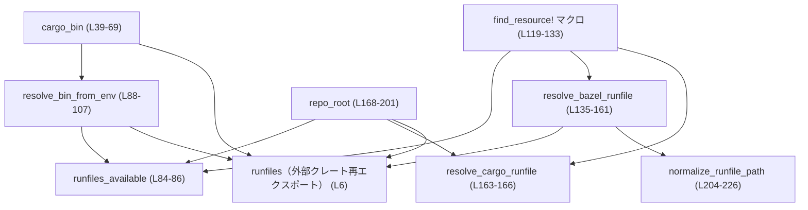
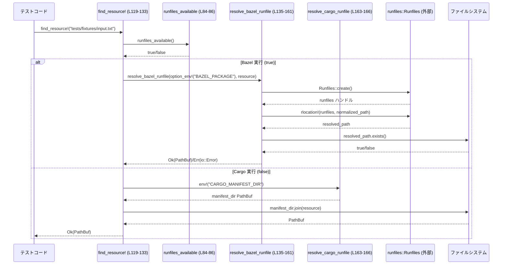

# utils/cargo-bin/src/lib.rs コード解説

## 0. ざっくり一言

Cargo でのテスト実行と Bazel でのテスト実行の違いを吸収し、**バイナリやテストリソース、リポジトリルートのパスを一貫した方法で取得するためのユーティリティ**を提供するモジュールです（根拠: `lib.rs:L33-37, L109-117, L168-201`）。

---

## 1. このモジュールの役割

### 1.1 概要

- Cargo / Bazel それぞれの実行環境で、**ビルドされたバイナリのパス**を取得します（`cargo_bin`）（`lib.rs:L33-39`）。
- Bazel の runfiles と Cargo の `CARGO_MANIFEST_DIR` の差異を吸収し、**テストリソースファイルのパス**を取得します（`find_resource!`, `resolve_bazel_runfile`, `resolve_cargo_runfile`）（`lib.rs:L109-117, L135-166`）。
- `repo_root.marker` ファイルを手掛かりにして、**リポジトリのルートディレクトリを求める**機能を提供します（`repo_root`）（`lib.rs:L168-201`）。
- これらは主にテストコードや開発用ユーティリティから利用されることが想定されます（`find_resource!` のドキュメントより, `lib.rs:L109-117`）。

### 1.2 アーキテクチャ内での位置づけ

このモジュール内部の主なコンポーネントと依存関係を簡略化して示します。



- Bazel 依存部分は `runfiles` クレート経由でカプセル化されており（`pub use runfiles`, `lib.rs:L6`）、呼び出し側は `runfiles` を直接意識せずに済みます。
- 「Cargo / Bazel どちらで実行しているか」の判定は `runfiles_available` に集約されており（`lib.rs:L84-86`）、上位 API はこのフラグに基づいて分岐します（`resolve_bin_from_env`, `find_resource!`, `repo_root`）。

### 1.3 設計上のポイント

- **エラー型の明示化**  
  - バイナリ解決では専用の `CargoBinError` 列挙体で失敗理由を表現します（`lib.rs:L11-31`）。
  - runfiles 関連処理やリポジトリルート解決では `std::io::Error` を利用し、`ErrorKind::NotFound` などで条件を区別しています（`lib.rs:L139-147, L157-160, L175-179, L181-185`）。

- **Bazel / Cargo 抽象化の一元化**  
  - `runfiles_available` が Bazel かどうかの判定ポイントになっており、`RUNFILES_MANIFEST_ONLY_ENV` 環境変数の有無で決まります（`lib.rs:L8-9, L84-86`）。
  - 上位 API (`cargo_bin`, `find_resource!`, `repo_root`) はこの判定に従い内部で適切な関数を呼び分けます（`lib.rs:L40-45, L122-131, L168-188`）。

- **状態を持たないユーティリティ**  
  - すべての関数・マクロはグローバルな可変状態を持たず、**環境変数とファイルシステムに対する同期的な処理**のみを行います（`std::env`, `std::fs`, `runfiles::Runfiles::create` の使用, `lib.rs:L42, L50, L85, L91, L139-140, L170-171`）。
  - そのため、並行実行（複数スレッドからの呼び出し）に伴う共有状態の競合はこのコード上には存在しません。

- **パスの正規化処理の分離**  
  - runfile パスの正規化（`.` や `..` の扱い）は `normalize_runfile_path` に切り出されており（`lib.rs:L204-226`）、Bazel 特有のパス表現に対する処理が局所化されています。

---

## 2. 主要な機能一覧

このモジュールが提供する主要機能を箇条書きでまとめます（根拠行はカッコ内）。

- **テスト用バイナリの絶対パス取得**  
  - `cargo_bin(name: &str)` で、環境変数 `CARGO_BIN_EXE_*` または `assert_cmd::Command::cargo_bin` を利用して現在のテストラン用のバイナリパスを解決します（`lib.rs:L33-39, L40-68, L71-81`）。

- **Bazel / Cargo 両対応のテストリソースパス解決**  
  - `find_resource!` マクロが、Bazel 実行時は runfiles 経由で、Cargo 実行時は `CARGO_MANIFEST_DIR` からの相対パスでリソースファイルを探します（`lib.rs:L109-117, L118-133, L135-166`）。

- **Bazel runfile の直接解決**  
  - `resolve_bazel_runfile(bazel_package, resource)` が `_main/<bazel_package>/<resource>` 形式の runfile パスを構築し、`runfiles::rlocation!` で実際のファイルパスへ解決します（`lib.rs:L135-161`）。

- **Cargo 実行時のリソースパス解決**  
  - `resolve_cargo_runfile(resource)` が `CARGO_MANIFEST_DIR` に対する相対パスからローカルファイルパスを生成します（`lib.rs:L163-166`）。

- **リポジトリルートパスの解決**  
  - `repo_root()` が `repo_root.marker` ファイル（またはその runfile）から 4 階層上のディレクトリをリポジトリルートとみなして返します（`lib.rs:L168-201`）。

- **Bazel runfile パスの正規化**  
  - `normalize_runfile_path(path)` が `.` や一部の `..` を解消した新しい `PathBuf` を作ります（`lib.rs:L204-226`）。

---

## 3. 公開 API と詳細解説

### 3.1 型一覧（構造体・列挙体など）＋コンポーネントインベントリー

#### 型一覧

| 名前 | 種別 | 公開 | 役割 / 用途 | 定義位置 |
|------|------|------|-------------|----------|
| `CargoBinError` | 列挙体 (`enum`) | 公開 (`pub`) | `cargo_bin` / `resolve_bin_from_env` でのバイナリ解決失敗理由を区別して返すためのエラー型です。`CurrentDir` や `ResolvedPathDoesNotExist` などのバリアントを持ちます。 | `lib.rs:L11-31` |

#### 関数・マクロ・定数のインベントリー

| 名前 | 種別 | 公開 | 役割 / 用途 | 定義位置 |
|------|------|------|-------------|----------|
| `runfiles` | クレート再エクスポート | 公開 (`pub`) | 外部クレート `runfiles` をこのモジュールから再エクスポートします。Bazel runfiles 操作のために利用されます。 | `lib.rs:L6` |
| `RUNFILES_MANIFEST_ONLY_ENV` | 定数 (`&'static str`) | 非公開 | Bazel が runfiles ディレクトリを無効化したときに設定する環境変数名 `"RUNFILES_MANIFEST_ONLY"` を保持します。`runfiles_available` で使用します。 | `lib.rs:L8-9` |
| `cargo_bin` | 関数 | 公開 | テスト用バイナリターゲットの絶対パスを返します。環境変数と `assert_cmd` を組み合わせて解決します。 | `lib.rs:L39-69` |
| `cargo_bin_env_keys` | 関数 | 非公開 | 指定したバイナリ名に対する `CARGO_BIN_EXE_*` 系環境変数の候補名を生成します。ハイフンをアンダースコアに置き換えた名前も考慮します。 | `lib.rs:L71-81` |
| `runfiles_available` | 関数 | 公開 | Bazel runfiles 関連の実行環境かどうかを `RUNFILES_MANIFEST_ONLY_ENV` の有無で判定します。 | `lib.rs:L84-86` |
| `resolve_bin_from_env` | 関数 | 非公開 | `CARGO_BIN_EXE_*` 環境変数の値からバイナリパスを解決します。Bazel 実行時には runfiles 経由、Cargo 実行時には絶対パスとして扱います。 | `lib.rs:L88-107` |
| `find_resource!` | マクロ | 公開 (`#[macro_export]`) | テストリソースファイルのパスを Cargo / Bazel 両対応で取得します。戻り値は `std::io::Result<PathBuf>` です。 | `lib.rs:L109-117, L118-133` |
| `resolve_bazel_runfile` | 関数 | 公開 | Bazel の runfiles から `bazel_package` と `resource` の組み合わせでリソースファイルを解決します。 | `lib.rs:L135-161` |
| `resolve_cargo_runfile` | 関数 | 公開 | Cargo 実行時に `CARGO_MANIFEST_DIR` からの相対パスでリソースファイルを指す `PathBuf` を構成します。 | `lib.rs:L163-166` |
| `repo_root` | 関数 | 公開 | `repo_root.marker` ファイル位置から 4 つ上のディレクトリをリポジトリルートとして返します。Bazel/Cargo 両対応です。 | `lib.rs:L168-201` |
| `normalize_runfile_path` | 関数 | 非公開 | runfile パス中の `.` と一部の `..` を解消し、正規化された `PathBuf` を生成します。 | `lib.rs:L204-226` |

---

### 3.2 関数・マクロ詳細（主要 5 件）

#### `cargo_bin(name: &str) -> Result<PathBuf, CargoBinError>`

**概要（根拠: `lib.rs:L33-39, L40-68`）**

- 現在のテストランでビルドされた **バイナリターゲットの絶対パス**を取得します。
- まず `CARGO_BIN_EXE_*` 系の環境変数から探し、見つからなければ `assert_cmd::Command::cargo_bin` にフォールバックします。

**引数**

| 引数名 | 型 | 説明 |
|--------|----|------|
| `name` | `&str` | Cargo のバイナリターゲット名（`[[bin]]` や `[[test]]` の name）。 |

**戻り値**

- `Ok(PathBuf)` : 解決に成功した場合の、**絶対パス**のバイナリパスです（相対で得られた場合は `current_dir` で補完されます, `lib.rs:L47-53`）。
- `Err(CargoBinError)` : 環境変数が見つからず、`assert_cmd` にも失敗した場合や、存在しないパスだった場合などです（`lib.rs:L57-60, L63-67`）。

**内部処理の流れ**

1. `cargo_bin_env_keys(name)` で `CARGO_BIN_EXE_<name>` と、必要なら `CARGO_BIN_EXE_<name_with_underscore>` を生成します（`lib.rs:L40, L71-79`）。
2. 生成したキーの順に `std::env::var_os` で値を取得し、最初に見つかったものを `resolve_bin_from_env` に渡します（`lib.rs:L41-44`）。
3. どの環境変数も無かった場合、`assert_cmd::Command::cargo_bin(name)` を呼びます（`lib.rs:L46`）。
   - 成功時: `Command::get_program()` から得られるパスを `PathBuf` に変換し、絶対パスでなければ `std::env::current_dir` と結合します（`lib.rs:L47-53`）。
   - その後 `path.exists()` を確認し、存在すれば `Ok(path)`、存在しなければ `CargoBinError::ResolvedPathDoesNotExist` を返します（`lib.rs:L54-61`）。
4. `assert_cmd::Command::cargo_bin` 自体が失敗した場合は、`CargoBinError::NotFound` としてラップして返します（`lib.rs:L63-67`）。

**Examples（使用例）**

```rust
use std::process::Command;
use utils::cargo_bin::cargo_bin; // このファイルが属するクレート名に応じて修正する

#[test]
fn runs_binary_with_cargo_bin() -> Result<(), Box<dyn std::error::Error>> {
    // "my_tool" というバイナリターゲットのパスを解決する          // Cargo の [[bin]] name に対応
    let bin_path = cargo_bin("my_tool")?;                               // Bazel/Cargo どちらでも動く

    // 解決されたバイナリをコマンドとして起動する                  // 絶対パスが返るのでそのまま Command に渡せる
    let status = Command::new(bin_path)
        .arg("--help")
        .status()?;                                                     // 実行時エラーはここで Result 経由で返る

    assert!(status.success());
    Ok(())
}
```

**Errors / Panics**

- `Err(CargoBinError::ResolvedPathDoesNotExist)`  
  - `assert_cmd::Command::cargo_bin` が返したパスが存在しなかった場合（`lib.rs:L54-61`）。
- `Err(CargoBinError::NotFound)`  
  - `CARGO_BIN_EXE_*` 系の環境変数が存在せず、`assert_cmd::Command::cargo_bin` も失敗した場合（`lib.rs:L40-45, L46, L63-67`）。
- `Err(CargoBinError::CurrentDir)`  
  - `assert_cmd` から取得したパスが相対パスで、`std::env::current_dir()` の取得自体が失敗した場合（`lib.rs:L49-52`）。
- この関数自体は `panic!` を呼びません。`assert_cmd` 内部の実装についてはこのファイルからは分かりません。

**Edge cases（エッジケース）**

- `name` がハイフンを含む場合  
  - `CARGO_BIN_EXE_name-with-dash` だけでなく `CARGO_BIN_EXE_name_with_dash` も探索します（`lib.rs:L75-79`）。
- バイナリパスが相対パスのまま返されることはありません  
  - 相対パスだった場合は `current_dir().join(path)` に変換されます（`lib.rs:L49-53`）。
- 環境変数 `CARGO_BIN_EXE_*` が存在しても、その値が不正（存在しないパスなど）の場合は `CargoBinError::ResolvedPathDoesNotExist` になります（`lib.rs:L88-107` 経由）。

**使用上の注意点**

- 結果は `Result` なので、**必ずエラーをハンドル**する必要があります（`?` 演算子か `match`）。
- バイナリの存在確認は行われますが、「実行可能かどうか」までは確認していません（`path.exists()` のみ, `lib.rs:L54`）。
- 並行に呼び出しても内部に共有状態は無くスレッド安全ですが、環境変数がテスト中に変更されると結果が揺らぐ可能性があります（`std::env::var_os` を使用, `lib.rs:L42`）。

---

#### `resolve_bin_from_env(key: &str, value: OsString) -> Result<PathBuf, CargoBinError>`

**概要（根拠: `lib.rs:L88-107`）**

- `CARGO_BIN_EXE_*` 環境変数の値をもとに、バイナリパスを解決します。
- Bazel 実行時（runfiles 使用時）は runfiles の rlocation 経由、Cargo 実行時は絶対パスとして扱います。

**引数**

| 引数名 | 型 | 説明 |
|--------|----|------|
| `key` | `&str` | 参照している環境変数名（エラーメッセージ用）。 |
| `value` | `OsString` | 環境変数の値。Bazel では runfile パス、Cargo では絶対パスを想定。 |

**戻り値**

- `Ok(PathBuf)` : 解決されたバイナリのパス。
- `Err(CargoBinError::ResolvedPathDoesNotExist)` : runfiles / ファイルシステム上に実在しなかった場合。
- `Err(CargoBinError::CurrentExe)` : runfiles コンテキストの作成に失敗した場合（`runfiles::Runfiles::create` の失敗, `lib.rs:L90-93`）。

**内部処理の流れ**

1. `value` を `PathBuf::from(&value)` に変換し、`raw` として扱います（`lib.rs:L89`）。
2. `runfiles_available()` が `true` の場合（Bazel 実行時）:
   - `runfiles::Runfiles::create()` を呼び出し、失敗時には `CargoBinError::CurrentExe` にラップします（`lib.rs:L90-93`）。
   - `runfiles::rlocation!(runfiles, &raw)` で実パスを取得し、さらに `resolved.exists()` をチェックします（`lib.rs:L94-96`）。
3. Bazel でない場合:
   - `raw.is_absolute()` かつ `raw.exists()` であれば、そのまま `Ok(raw)` を返します（`lib.rs:L99-100`）。
4. 上記いずれにもマッチしない場合は `CargoBinError::ResolvedPathDoesNotExist { key, path: raw }` を返します（`lib.rs:L103-106`）。

**Examples（使用例）**

通常は `cargo_bin` から内部的に利用されるため、直接呼び出すことは少ない想定です。挙動をテストするための例：

```rust
use std::ffi::OsString;
use std::path::PathBuf;
use utils::cargo_bin::CargoBinError;

// resolve_bin_from_env は非公開関数なので、擬似的な例としてパターンのみ示します。
// 実際には cargo_bin(name) を経由して利用します。
fn _example(raw: &str) {
    let key = "CARGO_BIN_EXE_my_tool";
    let value = OsString::from(raw);

    // ここではコンパイルのために型だけを示しています。                   // 非公開関数のため実際には呼び出せません
    let _ignored: Result<PathBuf, CargoBinError> = {
        // 実コードでは resolve_bin_from_env(key, value) を呼ぶ
        unimplemented!()
    };
}
```

**Errors / Panics**

- `CargoBinError::CurrentExe`  
  - `runfiles::Runfiles::create()` がエラーを返した場合に、`std::io::Error::other(err)` としてラップされます（`lib.rs:L90-93`）。
- `CargoBinError::ResolvedPathDoesNotExist`  
  - runfiles で rlocation しても `Some` が得られない、または `exists()` が `false` の場合（`lib.rs:L94-97, L103-106`）。
  - Bazel でなく、`raw` が絶対パスでも `exists()` が `false` の場合（`lib.rs:L99-101, L103-106`）。
- `panic!` を直接呼んでいる箇所はありません。

**Edge cases**

- `runfiles_available()` が `true` の場合、`raw` が絶対パスでも runfiles 分岐のみが実行され、`raw.is_absolute()` のチェックは行われません（`lib.rs:L89-101`）。
- `value` が空文字列の場合でも `PathBuf::from` は生成されますが、その後の `exists()` チェックで失敗する可能性が高いです（`lib.rs:L89-101`）。

**使用上の注意点**

- 直接利用するよりも `cargo_bin` 経由で使うことが想定されています。
- Bazel と Cargo の両方をサポートするため、**実行環境に依存して解決ロジックが変わる**点に注意が必要です。

---

#### マクロ `find_resource!($resource: expr) -> std::io::Result<PathBuf>`

**概要（根拠: `lib.rs:L109-117, L118-133`）**

- テストリソースのパスを、Cargo / Bazel どちらのビルド・実行環境でも同じコードで取得するためのマクロです。
- Bazel 実行時は runfiles を使った `resolve_bazel_runfile` を、Cargo 実行時は `CARGO_MANIFEST_DIR` からの相対パスを返します。

**引数**

| 引数名 | 型 | 説明 |
|--------|----|------|
| `$resource` | 任意の式 (`expr`) | `Path::new` に渡せる型（通常は `&str` や `String`）。リソースファイルの相対パスを表します。 |

**戻り値**

- `Ok(PathBuf)` : リソースファイルのパス。相対パスまたは絶対パスになり得るとドキュメントに記載されています（`lib.rs:L111-113`）。
- `Err(std::io::Error)` : Bazel 実行時に runfile が見つからなかった場合など（`resolve_bazel_runfile` のエラーをそのまま返します）。

**内部処理の流れ**

1. `let resource = Path::new(&$resource);` で渡された式から `&Path` を生成します（`lib.rs:L121`）。
2. `runfiles_available()` を呼び出し、Bazel 実行環境かどうかを判定します（`lib.rs:L122`）。
3. Bazel 実行時 (`true`) の場合:
   - `option_env!("BAZEL_PACKAGE")` でコンパイル時環境変数 `BAZEL_PACKAGE` を取得し（`lib.rs:L123-126`）、`resolve_bazel_runfile` に渡します（`lib.rs:L127`）。
4. Bazel でない場合:
   - `env!("CARGO_MANIFEST_DIR")` のディレクトリに `resource` を連結して `Ok(...)` で返します（`lib.rs:L129-131`）。

**Examples（使用例）**

```rust
use std::fs::File;
use std::io::Read;
use utils::cargo_bin::find_resource; // マクロなので use パスはクレート名に合わせて変更する

#[test]
fn load_test_fixture() -> std::io::Result<()> {
    // テストリソースの論理パスを指定する                          // Bazel では runfiles、Cargo では manifest dir 基準
    let path = find_resource!("tests/fixtures/input.txt")?;           // Result を ? で伝播

    let mut content = String::new();
    File::open(&path)?.read_to_string(&mut content)?;
    assert!(!content.is_empty());
    Ok(())
}
```

**Errors / Panics**

- Bazel 実行時:
  - `resolve_bazel_runfile` 内で `BAZEL_PACKAGE` が設定されていない場合、`ErrorKind::NotFound` とメッセージ `"BAZEL_PACKAGE was not set at compile time"` の `io::Error` が返されます（`lib.rs:L141-147`）。
  - runfile が存在しない場合も `ErrorKind::NotFound` で `"runfile does not exist at: ..."` というメッセージが返ります（`lib.rs:L151-159`）。
- Cargo 実行時:
  - `env!("CARGO_MANIFEST_DIR")` はコンパイル時マクロなので、**設定されていない場合はコンパイル時エラーになります**（Rust 標準の挙動）。
- `find_resource!` 自体は `panic!` を直接呼びませんが、マクロ内の `env!` はコンパイル時に未定義だとコンパイルエラーになります。

**Edge cases**

- 戻り値のパスは「相対または絶対」とコメントに書かれています（`lib.rs:L111-113`）。  
  - Bazel 実行時は runfiles の rlocation により通常は絶対パスになります（`lib.rs:L151-155`）。  
  - Cargo 実行時は `CARGO_MANIFEST_DIR` を先頭に持つ絶対パスです（`lib.rs:L129-131`）。
- `BAZEL_PACKAGE` が未設定の状態で Bazel 実行する構成はサポートされておらず、その場合は明示的に `NotFound` エラーになります（`lib.rs:L141-147`）。

**使用上の注意点**

- 戻り値は `Result` なので、`?` などで適切にエラーを処理する必要があります。
- リソースは **テストコードからの利用が想定**されており、本体バイナリにはパッケージされない前提です（`lib.rs:L116-117`）。
- `$resource` はコンパイル時に展開されるため、マクロ展開時のスコープに `BAZEL_PACKAGE` / `CARGO_MANIFEST_DIR` が存在することが必要です。

---

#### `resolve_bazel_runfile(bazel_package: Option<&str>, resource: &Path) -> std::io::Result<PathBuf>`

**概要（根拠: `lib.rs:L135-161`）**

- Bazel の runfiles から、`bazel_package` と `resource` を組み合わせたパスを解決し、実際のファイルパスを返します。
- `find_resource!` の Bazel 分岐や、他の Bazel 専用ユーティリティから利用される想定です。

**引数**

| 引数名 | 型 | 説明 |
|--------|----|------|
| `bazel_package` | `Option<&str>` | Bazel の `native.package_name()` に相当するパッケージ名。`None` の場合はエラーになります。 |
| `resource` | `&Path` | パッケージ内からの相対パス（例: `"tests/fixtures/input.txt"`）。 |

**戻り値**

- `Ok(PathBuf)` : runfiles 上で見つかったリソースファイルの実パス。
- `Err(io::Error)` : runfiles コンテキストや runfile 自体が見つからない場合のエラー。

**内部処理の流れ**

1. `runfiles::Runfiles::create()` を呼び出し、失敗した場合は `"failed to create runfiles: {err}"` というメッセージで `io::Error::other` に包みます（`lib.rs:L139-140`）。
2. `bazel_package` が `Some` の場合は、`"_main" / bazel_package / resource` を順に `PathBuf::from("_main").join(bazel_package).join(resource)` で構築します（`lib.rs:L141-143`）。
   - `None` の場合は `ErrorKind::NotFound` と `"BAZEL_PACKAGE was not set at compile time"` のメッセージでエラーを返します（`lib.rs:L144-147`）。
3. `normalize_runfile_path` で `runfile_path` を正規化します（`lib.rs:L150, L204-226`）。
4. `runfiles::rlocation!(runfiles, &runfile_path)` で実パスを取得し、かつ `resolved.exists()` を確認します（`lib.rs:L151-153`）。
5. 見つからなかった場合は `"runfile does not exist at: {runfile_path_display}"` メッセージを持つ `ErrorKind::NotFound` エラーを返します（`lib.rs:L156-160`）。

**Examples（使用例）**

```rust
use std::path::Path;
use utils::cargo_bin::resolve_bazel_runfile;

fn load_bazel_resource() -> std::io::Result<()> {
    // Bazel の BUILD で設定されたパッケージ名を指定する                 // 実際は option_env!("BAZEL_PACKAGE") などから取得
    let bazel_package = Some("my/package");

    // パッケージ内のリソース相対パス                                 // runfiles では _main/my/package 以下に展開される想定
    let resource = Path::new("tests/fixtures/input.txt");

    let path = resolve_bazel_runfile(bazel_package, resource)?;        // runfiles 経由で実パスを取得
    // ここで path を使ってファイルを開くなどの処理を行う
    Ok(())
}
```

**Errors / Panics**

- `io::ErrorKind::Other`  
  - `Runfiles::create()` が失敗した場合（`lib.rs:L139-140`）。
- `io::ErrorKind::NotFound`  
  - `bazel_package` が `None` の場合（`lib.rs:L144-147`）。
  - runfiles の中に指定したパスが存在しない場合（`lib.rs:L151-160`）。
- `panic!` を明示的に呼び出す箇所はありません。

**Edge cases**

- `resource` に `.` や `..` が含まれている場合  
  - `normalize_runfile_path` により、`./file` は `file` に、`dir/..` は削除されますが、先頭からの `..` は残る可能性があります（`lib.rs:L204-216`）。
- `bazel_package` にスラッシュを含む場合も、そのまま `PathBuf::join` に渡されるため、パス構造にそのまま反映されます（`lib.rs:L142-143`）。

**使用上の注意点**

- `BAZEL_PACKAGE` をコンパイル時に設定していない構成では、この関数は失敗します（`lib.rs:L141-147`）。
- `Runfiles::create()` を毎回呼ぶ実装であるため、そのコストが高い場合は呼び出し頻度に注意が必要です（実際のコストは `runfiles` クレート実装に依存します）。

---

#### `repo_root() -> io::Result<PathBuf>`

**概要（根拠: `lib.rs:L168-201`）**

- `repo_root.marker` というファイル（またはその Bazel runfile）を起点にして、リポジトリのルートディレクトリを求める関数です。
- Bazel 実行時は runfiles から marker を解決し、Cargo 実行時は `CARGO_MANIFEST_DIR` をもとに marker ファイルを探します。

**引数**

- 引数はありません。

**戻り値**

- `Ok(PathBuf)` : リポジトリのルートディレクトリのパス。
- `Err(io::Error)` : marker が見つからない、または親ディレクトリ階層が不足している場合など。

**内部処理の流れ**

1. `runfiles_available()` の結果で分岐します（`lib.rs:L169`）。
2. Bazel 実行時 (`true` の場合):
   - `runfiles::Runfiles::create()` を呼び出し、失敗時には `"failed to create runfiles: {err}"` で `io::Error::other` を返します（`lib.rs:L170-171`）。
   - `option_env!("CODEX_REPO_ROOT_MARKER")` でコンパイル時環境変数を取得し、`PathBuf::from` に渡します。未設定 (`None`) の場合は `ErrorKind::NotFound` と `"CODEX_REPO_ROOT_MARKER was not set at compile time"` を返します（`lib.rs:L172-179`）。
   - `runfiles::rlocation!(runfiles, &marker_path)` で runfile を解決し、`None` の場合は `"repo_root.marker not available in runfiles"` を `NotFound` で返します（`lib.rs:L180-185`）。
3. Bazel でない場合:
   - `resolve_cargo_runfile(Path::new("repo_root.marker"))?` を呼び出し、`CARGO_MANIFEST_DIR/repo_root.marker` を求めます（`lib.rs:L186-188`）。
4. いずれかの経路で得た `marker: PathBuf` を起点に、`for _ in 0..4` で 4 回親ディレクトリをたどります（`lib.rs:L189-199`）。
   - 親が存在しない場合は `"repo_root.marker did not have expected parent depth"` という `NotFound` エラーになります。
5. 4 階層上まで遡った `root` を `Ok(root)` で返します（`lib.rs:L201`）。

**Examples（使用例）**

```rust
use std::path::PathBuf;
use utils::cargo_bin::repo_root;

fn path_relative_to_repo_root() -> std::io::Result<PathBuf> {
    // コンフィグファイルなど、リポジトリルート基準のパスが欲しい場合に利用する      // Bazel/Cargo 双方で動作
    let root = repo_root()?;                                           // repo_root.marker から 4 階層上を起点にする

    // 例: "config/default.toml" をリポジトリルートからの相対パスで指す
    Ok(root.join("config").join("default.toml"))
}
```

**Errors / Panics**

- `io::ErrorKind::Other`  
  - Bazel 実行時に `Runfiles::create()` が失敗した場合（`lib.rs:L170-171`）。
- `io::ErrorKind::NotFound`  
  - `CODEX_REPO_ROOT_MARKER` がコンパイル時に設定されていない場合（`lib.rs:L172-179`）。
  - runfiles に `repo_root.marker` が存在しない場合（`lib.rs:L180-185`）。
  - `repo_root.marker` の親階層を 4 回たどる過程で親が見つからない場合（`lib.rs:L191-199`）。
- `panic!` を呼び出す箇所はありません。

**Edge cases**

- `repo_root.marker` の位置がリポジトリルートから 4 階層下であることを前提としており、階層が変化した場合はエラーになります（`lib.rs:L189-199`）。
- Cargo 実行時は `CARGO_MANIFEST_DIR/repo_root.marker` を探すため、マニフェストディレクトリがサブディレクトリにあるモノレポ構成などでは、その位置関係に注意が必要です（`lib.rs:L163-166, L186-188`）。

**使用上の注意点**

- `repo_root.marker` の配置と `CODEX_REPO_ROOT_MARKER` の設定はビルドシステム側の責務であり、この関数はそれを前提としています。
- 実行環境によってエラーメッセージが変わる可能性があるため、テストではメッセージ文字列よりも `ErrorKind` を用いた検証が適切です。

---

### 3.3 その他の関数

詳細なテンプレート説明を省略した補助関数の一覧です。

| 関数名 | 公開 | 役割（1 行） | 定義位置 |
|--------|------|--------------|----------|
| `cargo_bin_env_keys(name: &str) -> Vec<String>` | 非公開 | `name` と、ハイフンをアンダースコアに置き換えた名前から `CARGO_BIN_EXE_*` 環境変数名の候補を最大 2 つ生成します（`lib.rs:L71-81`）。 | `lib.rs:L71-81` |
| `runfiles_available() -> bool` | 公開 | 環境変数 `"RUNFILES_MANIFEST_ONLY"`（`RUNFILES_MANIFEST_ONLY_ENV`）の有無で Bazel runfiles 環境かどうかを判定します（`lib.rs:L84-86`）。 | `lib.rs:L84-86` |
| `resolve_cargo_runfile(resource: &Path) -> std::io::Result<PathBuf>` | 公開 | `env!("CARGO_MANIFEST_DIR")` を起点に `resource` を連結し、Cargo 実行時のリソースパスを構成します（`lib.rs:L163-166`）。 | `lib.rs:L163-166` |
| `normalize_runfile_path(path: &Path) -> PathBuf` | 非公開 | `path.components()` を走査し、`.` を削除し、直前が通常のディレクトリ名である `..` を打ち消すことでパスを簡易正規化します（`lib.rs:L204-226`）。 | `lib.rs:L204-226` |

---

## 4. データフロー

### 4.1 テストリソース解決のデータフロー（`find_resource!` 系）

Bazel / Cargo どちらの実行環境でも `find_resource!` マクロから同じコードでリソースパスを得る流れを示します。



- `runfiles_available` による判定で、Bazel か Cargo かの分岐が一か所に集中している点が特徴です（`lib.rs:L84-86, L122-131`）。
- Bazel 経路では runfiles の manifest に登録されたパスのみが解決対象となり、存在しない場合は `NotFound` エラーになります（`lib.rs:L151-160`）。
- Cargo 経路では、ファイルの存在確認はこのモジュールでは行わず、呼び出し側が行う前提になっています（`lib.rs:L163-166`）。

---

## 5. 使い方（How to Use）

### 5.1 基本的な使用方法

#### 1. テスト用バイナリへのパスを取得して実行する

```rust
use std::process::Command;
use utils::cargo_bin::cargo_bin; // クレートパスは実際のプロジェクトに合わせる

#[test]
fn integration_with_binary() -> Result<(), Box<dyn std::error::Error>> {
    // "my_cli" というバイナリターゲットのパスを取得する                       // Cargo / Bazel いずれでも解決される
    let bin = cargo_bin("my_cli")?;                                                 // Result を ? で伝播

    let status = Command::new(&bin)
        .arg("--version")
        .status()?;                                                                 // 実行

    assert!(status.success());
    Ok(())
}
```

#### 2. テストリソースファイルへのパスを取得する

```rust
use std::fs::File;
use std::io::Read;
use utils::cargo_bin::find_resource; // マクロなので use 時に ! は不要

#[test]
fn reads_fixture_through_find_resource() -> std::io::Result<()> {
    // Cargo では CARGO_MANIFEST_DIR/tests/fixtures/input.txt を指し、          // Bazel では runfiles 経由で解決される
    // Bazel では _main/<pkg>/tests/fixtures/input.txt の runfile を指す
    let path = find_resource!("tests/fixtures/input.txt")?;                         // Result を忘れずに処理する

    let mut content = String::new();
    File::open(&path)?.read_to_string(&mut content)?;
    assert!(!content.is_empty());
    Ok(())
}
```

#### 3. リポジトリルート基準のパスを構成する

```rust
use std::path::PathBuf;
use utils::cargo_bin::repo_root;

fn config_path() -> std::io::Result<PathBuf> {
    // repo_root.marker を元に 4 階層上のリポジトリルートを取得する               // Bazel/Cargo 両対応
    let root = repo_root()?;

    Ok(root.join("config").join("default.toml"))                                     // ルート基準のパスを構築
}
```

### 5.2 よくある使用パターン

- **integration test でのバイナリ起動**  
  - `cargo_bin` で得たパスを `Command::new` に渡し、CLI バイナリの振る舞いを E2E でテストする（`lib.rs:L39-69`）。
- **テストデータのロード**  
  - `find_resource!` で得たパスから `File::open` でファイルを開き、テキストやバイナリデータを読み込む（`lib.rs:L109-133`）。
- **リポジトリルート基準のヘルパー関数を自前で定義**  
  - `repo_root()` を内部で呼ぶユーティリティ関数を作り、アプリケーション内の設定ファイルやテンプレートへのパスを一元管理する（`lib.rs:L168-201`）。

### 5.3 よくある間違い

```rust
use utils::cargo_bin::find_resource;

// 間違い例: Result を無視している
fn wrong_usage() {
    let path = find_resource!("tests/fixtures/input.txt"); // 戻り値は Result<PathBuf>
    // path は Result 型のままなので、そのままでは Path として使えない
}

// 正しい例: エラーをハンドリングする
fn correct_usage() -> std::io::Result<()> {
    let path = find_resource!("tests/fixtures/input.txt")?; // ? で io::Error を呼び出し元へ伝播
    // PathBuf として利用できる
    println!("fixture path = {}", path.display());
    Ok(())
}
```

```rust
use utils::cargo_bin::repo_root;

// 間違い例: repo_root() を前提条件なしに unwrap している
fn wrong_repo_root() {
    let root = repo_root().unwrap(); // CODEX_REPO_ROOT_MARKER が未設定だと panic する可能性
    println!("{root:?}");
}

// 正しい例: エラー内容を扱う
fn correct_repo_root() {
    match repo_root() {
        Ok(root) => println!("repo root = {}", root.display()),
        Err(e) if e.kind() == std::io::ErrorKind::NotFound => {
            eprintln!("repo root marker not found: {e}");
        }
        Err(e) => {
            eprintln!("failed to resolve repo root: {e}");
        }
    }
}
```

### 5.4 使用上の注意点（まとめ）

- **エラー扱い**
  - すべての公開関数 / マクロは `Result` を返すため、**必ずエラー処理が必要**です（`cargo_bin` は `CargoBinError`, それ以外は `io::Error`, `lib.rs:L39-69, L135-201`）。
- **環境依存**
  - Bazel 関連: `RUNFILES_MANIFEST_ONLY_ENV`, `BAZEL_PACKAGE`, `CODEX_REPO_ROOT_MARKER` が適切に設定されていることが前提です（`lib.rs:L8-9, L141-147, L172-179`）。
  - Cargo 関連: `CARGO_MANIFEST_DIR` は `env!` で参照されるため、未設定の場合はコンパイルエラーになります（`lib.rs:L129, L163`）。
- **並行性**
  - 内部で共有可変状態を持たないため、複数スレッドから同時に呼び出してもデータ競合は発生しません。ただし環境変数やファイルシステムはプロセス全体の共有資源であり、外部要因（他スレッドによる環境変数変更など）の影響を受ける可能性があります。
- **パフォーマンス**
  - `resolve_bazel_runfile` や `repo_root` は毎回 `Runfiles::create()` を呼び出す実装になっています（`lib.rs:L139-140, L170-171`）。頻繁に呼ぶ箇所では、呼び出し側で結果をキャッシュする設計も検討の余地があります（コストの実際の大きさはこのファイルからは分かりません）。

---

## 6. 変更の仕方（How to Modify）

### 6.1 新しい機能を追加する場合

新しい「パス解決」系機能を追加する場合の典型的な流れです。

1. **Bazel/Cargo 分岐の利用**
   - 新機能が Bazel 実行と Cargo 実行の両方に対応する必要がある場合、既存の `runfiles_available()` を使って分岐するのが一貫した方針です（`lib.rs:L84-86`）。
2. **Bazel 用処理**
   - Bazel 向け処理では、`runfiles::Runfiles::create()` と `runfiles::rlocation!` を利用する既存のパターン（`resolve_bazel_runfile`, `repo_root`）を参考にするとモジュール内のスタイルと揃います（`lib.rs:L139-140, L151-153, L170-171, L180-185`）。
3. **Cargo 用処理**
   - Cargo 向け処理では `env!("CARGO_MANIFEST_DIR")` や既存の `resolve_cargo_runfile` を再利用し、ファイルパスを構成すると一貫性が保たれます（`lib.rs:L163-166`）。
4. **エラー型の選択**
   - バイナリ解決に関係する場合は `CargoBinError` にバリアントを追加するか、既存のバリアントを再利用します（`lib.rs:L11-31`）。
   - それ以外のリソース解決では `io::Error` を使う現状の方針に合わせると分かりやすくなります（`lib.rs:L139-147, L157-160`）。

### 6.2 既存の機能を変更する場合

- **影響範囲の確認**
  - `cargo_bin` や `find_resource!`, `repo_root` はテストコードから広く利用される可能性があるため、シグネチャや返却パスの形式を変更する際は、呼び出し元全体を検索して影響を確認する必要があります。
- **契約（前提条件・返り値の意味）の維持**
  - 例: `cargo_bin` は **絶対パスを返す** という性質を持っています（`lib.rs:L49-55`）。この性質を変えると、呼び出し側の前提が崩れる可能性があります。
  - `repo_root` は「repo_root.marker から 4 階層上」を返す契約になっているため（`lib.rs:L189-199`）、階層数を変えると既存コードの期待とずれる可能性があります。
- **エラー処理の一貫性**
  - `resolve_bazel_runfile` や `repo_root` は `ErrorKind::NotFound` と分かりやすいメッセージ文字列を付与するスタイルになっているため、新しいエラーケースを追加する場合も同様のパターンを維持するとよいです（`lib.rs:L144-147, L157-160, L175-179, L181-185, L193-199`）。
- **テスト**
  - このファイル内にはテストコードは存在しません（`lib.rs` 全体）。既存機能の振る舞いを変える場合は、別ファイルにあるであろうテストコードを更新・追加する必要があります（テストファイル自体はこのチャンクには現れません）。

---

## 7. 関連ファイル・外部依存

このモジュールと密接に関係するファイル・外部コンポーネントです。

| パス / コンポーネント | 種別 | 役割 / 関係 | 根拠 |
|-----------------------|------|-------------|------|
| `repo_root.marker` | ファイル（リポジトリ内） | `repo_root()` がこのファイルの位置を基準にリポジトリルートを算出します。Cargo 実行時は `CARGO_MANIFEST_DIR/repo_root.marker`、Bazel 実行時は runfiles 経由のパスが使われます。 | `lib.rs:L186-188, L189-199` |
| `runfiles` クレート | 外部依存 | Bazel runfiles の manifest から実ファイルパスを解決するためのクレートで、このモジュールで再エクスポートされています。`Runfiles::create` や `rlocation!` を通じて利用されます。 | `lib.rs:L6, L88-96, L139-140, L151-153, L170-171, L180-181` |
| `assert_cmd` クレート | 外部依存 | `cargo_bin` 内で `Command::cargo_bin(name)` を呼び出すために利用されます。環境変数が存在しない場合のフォールバックとして機能します。 | `lib.rs:L46-67` |
| 環境変数 `RUNFILES_MANIFEST_ONLY` | 環境設定 | Bazel が runfiles ディレクトリを無効化したときに設定されるフラグで、これが存在するかどうかで Bazel 実行環境かを判定します。 | `lib.rs:L8-9, L84-86` |
| 環境変数 `CARGO_BIN_EXE_*` | 環境設定 | `cargo test` 実行時に Cargo が設定するバイナリのパスを表す環境変数群で、`cargo_bin` がこれを解決に利用します。 | `lib.rs:L33-37, L40-45, L71-79` |
| コンパイル時環境変数 `BAZEL_PACKAGE` | 環境設定 | Bazel のパッケージ名を表し、`find_resource!` → `resolve_bazel_runfile` で runfile の論理パスを構築する際に使われます。 | `lib.rs:L123-127, L141-147` |
| コンパイル時環境変数 `CODEX_REPO_ROOT_MARKER` | 環境設定 | Bazel 実行時に `repo_root.marker` の runfile ロケーションを指定するために使用されます。 | `lib.rs:L172-179` |
| コンパイル時環境変数 `CARGO_MANIFEST_DIR` | 環境設定 | Cargo のクレートマニフェスト (`Cargo.toml`) のディレクトリを指し、Cargo 実行時のリソースパス解決に使用されます。 | `lib.rs:L129, L163-165` |

このチャンクには、このモジュールと同一クレート内の他ファイル（例えばテストコードや build スクリプト）の情報は現れていません。そのため、具体的なテストファイルや BUILD ファイルのパスは不明です。
