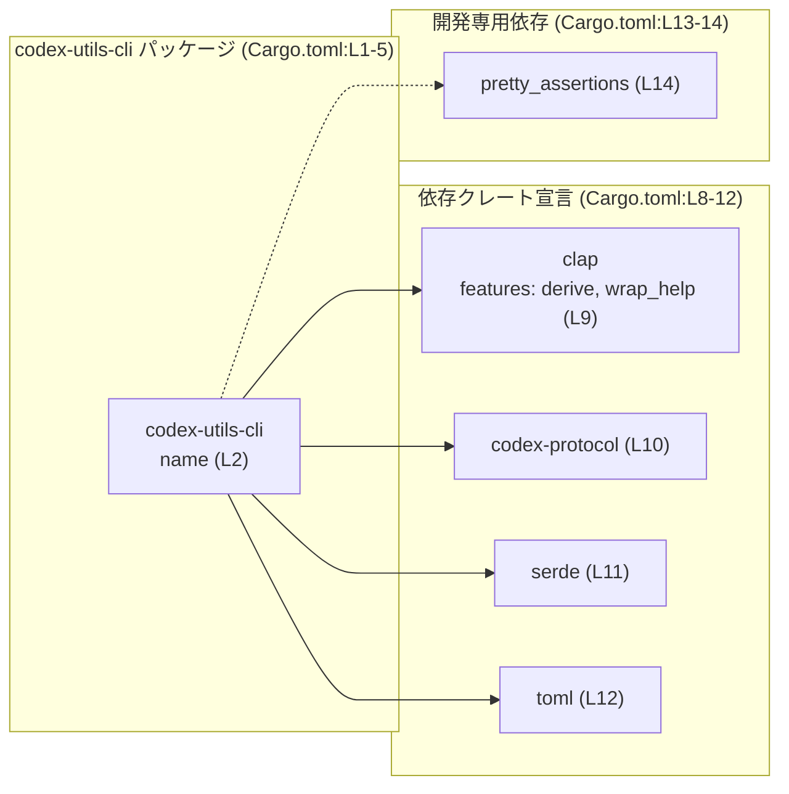
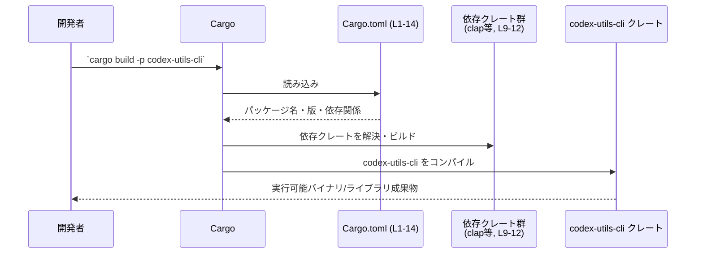

# utils/cli/Cargo.toml 解説

## 0. ざっくり一言

`codex-utils-cli` クレートの Cargo マニフェストであり、パッケージ情報と依存クレート（`clap` / `codex-protocol` / `serde` / `toml` など）をワークスペース経由で定義しています（Cargo.toml:L1-14）。

---

## 1. このモジュールの役割

### 1.1 概要

- このファイルは Rust クレート `codex-utils-cli` の **パッケージメタデータと依存関係** を記述する Cargo マニフェストです（Cargo.toml:L1-2）。
- バージョン・edition・ライセンス・lints・依存クレートは、すべてワークスペース共通設定から継承する構成になっています（Cargo.toml:L3-5,L7-12）。
- 開発時・ビルド時に Cargo がこのファイルを読み取り、依存解決とコンパイル設定を行います。

### 1.2 アーキテクチャ内での位置づけ

このクレートと依存クレートとの関係を示します。



- `codex-utils-cli` は CLI 用ユーティリティクレートと推測されますが、ソースコードはこのチャンクには現れません。
- 依存クレートはいずれも `workspace = true` で定義され、具体的なバージョンはワークスペースルートの `Cargo.toml` に委ねられています（Cargo.toml:L9-12,14）。

### 1.3 設計上のポイント（コードから読み取れる範囲）

- **ワークスペース継承の徹底**  
  - `version.workspace = true` / `edition.workspace = true` / `license.workspace = true` により、バージョン・言語版・ライセンスをワークスペース共通設定で一元管理しています（Cargo.toml:L3-5）。
  - `lints.workspace = true` で lint 設定も共通化しています（Cargo.toml:L6-7）。
- **依存バージョンの集中管理**  
  - すべての依存クレートが `workspace = true` 指定になっており、バージョンや features の多くをルート側に集約する方針になっています（Cargo.toml:L9-12,14）。
- **CLI 向けの依存セット**  
  - コマンドライン引数パーサの `clap` を features `derive` / `wrap_help` 付きで利用する前提です（Cargo.toml:L9）。
  - 設定やデータのシリアライズ／デシリアライズ用に `serde` と `toml` を利用する前提です（Cargo.toml:L11-12）。
- **本チャンクから分からない点**  
  - 実際の CLI のコマンド構造・エラーハンドリング・並行性の扱いなど、Rust コード側の詳細はこのファイルからは分かりません。このチャンクには現れません。

---

## 2. 主要な機能一覧（このファイルが担う役割）

このファイル自体はコードを含みませんが、Cargo 設定として以下の「機能」を提供しています。

- パッケージ定義: `codex-utils-cli` の名前とワークスペース共通のバージョン/edition/ライセンスを定義（Cargo.toml:L1-5）。
- Lint 設定の共有: ワークスペース共通の lint ルールを適用（Cargo.toml:L6-7）。
- 実行時依存クレートの宣言:  
  - `clap`（derive, wrap_help feature 付き）による CLI 定義（Cargo.toml:L9）。  
  - `codex-protocol` によるドメインプロトコル機能への依存（Cargo.toml:L10）。  
  - `serde` / `toml` によるシリアライズ／設定ファイル処理（Cargo.toml:L11-12）。
- 開発時依存クレートの宣言: `pretty_assertions` によるテスト時の差分表示改善（Cargo.toml:L13-14）。

---

## 3. 公開 API と詳細解説

このファイルは **Cargo マニフェスト** であり、Rust の関数・型・モジュールは定義されていません。  
ここでは「コンポーネントインベントリー」として、パッケージおよび依存関係をまとめます。

### 3.1 型一覧（構造体・列挙体など）

このファイルには Rust の型定義は含まれていません（このチャンクには現れません）。

| 名前 | 種別 | 役割 / 用途 | 定義位置 |
|------|------|-------------|----------|
| （なし） | - | 型定義は Cargo.toml には存在しません | - |

### 3.2 関数詳細（最大 7 件）

このファイルには Rust の関数定義が存在しないため、関数レベルの公開 API やコアロジックは読み取れません（このチャンクには現れません）。

### 3.2 補足: コンポーネントインベントリー（パッケージ／依存）

関数・型の代わりに、このマニフェストで登場するコンポーネントを一覧にします。

| コンポーネント名 | 種別 | 説明 | 根拠 |
|------------------|------|------|------|
| `codex-utils-cli` | パッケージ | 本ファイルで定義されるクレート名 | Cargo.toml:L1-2 |
| `version` (workspace) | メタデータ | クレートのバージョンをワークスペースから継承 | Cargo.toml:L3 |
| `edition` (workspace) | メタデータ | Rust edition をワークスペースから継承 | Cargo.toml:L4 |
| `license` (workspace) | メタデータ | ライセンス表記をワークスペースから継承 | Cargo.toml:L5 |
| `lints` (workspace) | 設定 | コンパイル時の lint 設定をワークスペースから継承 | Cargo.toml:L6-7 |
| `clap` | 依存クレート | CLI 向けの引数パーサ。features: `derive`, `wrap_help` | Cargo.toml:L9 |
| `codex-protocol` | 依存クレート | codex プロジェクト内のプロトコル関連機能への依存 | Cargo.toml:L10 |
| `serde` | 依存クレート | シリアライズ／デシリアライズ用 | Cargo.toml:L11 |
| `toml` | 依存クレート | TOML 形式の設定ファイル等を扱うためのクレート | Cargo.toml:L12 |
| `pretty_assertions` | dev-dependency | テスト時に見やすい差分を表示するためのクレート | Cargo.toml:L13-14 |

### 3.3 その他の関数

- 関数・メソッド・モジュール構造など、実際の Rust コードに関する情報はこのファイルからは分かりません。このチャンクには現れません。

---

## 4. データフロー

### 4.1 ビルド時の情報フロー

このファイルを介して、Cargo がどのように情報をやり取りするかを示します。



- Cargo は `Cargo.toml`（L1-14）からパッケージ情報と依存リストを取得し、依存クレート（L9-12）を解決します。
- 具体的にどの関数が `clap` / `serde` / `toml` などを呼び出すかは、このチャンクには現れません。

---

## 5. 使い方（How to Use）

### 5.1 基本的な使用方法（開発者視点）

このクレートをビルド・実行する典型的なフローの例です。  
（`codex-utils-cli` がバイナリクレートかライブラリクレートかは、このファイルからは判別できません。）

```bash
# ワークスペース全体をビルド
cargo build

# codex-utils-cli クレートだけをビルド
cargo build -p codex-utils-cli

# codex-utils-cli がバイナリクレートである場合の実行例
cargo run -p codex-utils-cli -- --help
```

`-p codex-utils-cli` のパッケージ指定は、マニフェストの `name = "codex-utils-cli"` に基づきます（Cargo.toml:L2）。

### 5.2 よくある使用パターン

#### 1) ワークスペース内の別クレートから依存する例（一般的なパターン）

このクレートをワークスペース内の別クレートから利用したい場合の、典型的な Cargo.toml 設定例です（参考例。実際のパス構成はワークスペースに依存します）。

```toml
# 別クレートの Cargo.toml の例

[dependencies]
# utils/cli/Cargo.toml のあるディレクトリを path で指定する例
codex-utils-cli = { path = "utils/cli" }
```

- 実際にこのように依存させているかどうかは、このチャンクからは分かりません。

#### 2) clap の features を活用する前提（コード側の一般的な利用イメージ）

`clap` に `derive` / `wrap_help` features が指定されているため（Cargo.toml:L9）、コード側では以下のような使い方が想定されます（一般的な例であり、実際のコードはこのチャンクには現れません）。

```rust
use clap::Parser; // derive feature を前提とした利用

/// 一般的な CLI 引数定義の例
#[derive(Parser, Debug)]
struct CliArgs {
    /// 設定ファイルのパス
    #[arg(long)]
    config: Option<String>,
}

fn main() {
    // コマンドライン引数のパース
    let args = CliArgs::parse();          // clap の Parser トレイトを利用

    // ここで codex-utils-cli の本来のロジックが動く想定
    println!("{:?}", args);
}
```

このコードはあくまで `clap` features の使い方の例であり、`codex-utils-cli` の実コードではありません。

### 5.3 よくある間違い（Cargo 設定の観点）

```toml
# 間違い例: ワークスペース管理の方針に反して、個別にバージョンを指定してしまう
[dependencies]
clap = "4.0"  # ✗ workspace = true を使わず直接バージョンを指定

# 正しい例: このファイルと同様に、バージョン管理はワークスペースに任せる
[dependencies]
clap = { workspace = true, features = ["derive", "wrap_help"] }
```

- このファイルでは、すべての依存が `workspace = true` で定義されているため（Cargo.toml:L9-12,14）、同じ方針を崩すと、ワークスペース内でバージョンがばらつきやすくなります。

### 5.4 使用上の注意点（まとめ）

- **ワークスペース依存**  
  - `version.workspace` / `edition.workspace` / `license.workspace` / `lints.workspace` などは、ワークスペースルートの設定が存在することを前提としています（Cargo.toml:L3-7）。  
  - ルート側でこれらが未定義の場合、ビルド時にエラーになります。
- **依存クレートのバージョン・安全性**  
  - 具体的なバージョンや既知の脆弱性有無は、このファイルだけでは分かりません。ルートの `Cargo.toml` または `Cargo.lock` を確認する必要があります。
- **言語固有の安全性／エラー／並行性**  
  - Rust コードがこのファイルには含まれないため、panic の有無やスレッド安全性などの詳細は、このチャンクからは評価できません。

---

## 6. 変更の仕方（How to Modify）

### 6.1 新しい機能を追加する場合（依存クレートの追加）

1. **依存クレートの追加場所**  
   - 新しいライブラリが必要になった場合は、`[dependencies]` セクションにエントリを追加します（Cargo.toml:L8-12 が既存例）。
2. **ワークスペース管理との整合**  
   - 既存の方針に合わせるなら、まずワークスペースルートの `Cargo.toml` に依存クレートとバージョンを定義し、ここでは `workspace = true` を指定します。
3. **機能フラグ（features）の指定**  
   - `clap` のように特定の features が必要な場合は、`features = ["..."]` をここで指定します（Cargo.toml:L9 を参考）。

### 6.2 既存の機能を変更する場合（依存・メタデータの変更）

- **clap の features を変える場合**  
  - `derive` を外すと、コード側の `#[derive(Parser)]` などに影響するため、ソースコードも合わせて確認する必要があります（Cargo.toml:L9）。
- **`codex-protocol` への依存を変更・削除する場合**  
  - このクレートがどれだけ `codex-protocol` に依存しているかはコード側を確認する必要があります（Cargo.toml:L10）。  
  - 依存削除前には `cargo build` / テストを実行して影響範囲を確認する必要があります。
- **ワークスペース設定の変更**  
  - `version.workspace = true` などをローカル値に変えると、ワークスペース全体の一貫性に影響します（Cargo.toml:L3-5）。  
  - ルート `Cargo.toml` との整合性を確認してから変更する必要があります。

---

## 7. 関連ファイル

このマニフェストと密接に関係するファイル・クレートを整理します。

| パス / クレート名 | 役割 / 関係 |
|-------------------|------------|
| （ワークスペースルート）/Cargo.toml | `version.workspace` / `edition.workspace` / `license.workspace` / `lints.workspace` / 依存クレートの実バージョンなどの定義元（Cargo.toml:L3-7,9-12,14）。このチャンクでは具体的な内容は分かりません。 |
| `codex-utils-cli` のソースコード（例: `utils/cli/src/*`） | 実際の CLI ロジックや公開 API を定義する Rust コード。パスと中身はこのチャンクには現れません。 |
| `codex-protocol` クレート | `codex-utils-cli` が依存するプロトコル関連クレート（Cargo.toml:L10）。具体的な API は別クレート側のソース参照が必要です。 |
| `clap` クレート | CLI 向け引数パーサ。`derive` / `wrap_help` features 付きで利用される前提（Cargo.toml:L9）。 |
| `serde` クレート | シリアライズ／デシリアライズ用の定番クレート（Cargo.toml:L11）。 |
| `toml` クレート | TOML 形式の設定ファイル等を扱うクレート（Cargo.toml:L12）。 |
| `pretty_assertions` クレート | テスト時のアサーション差分を見やすくする dev-dependency（Cargo.toml:L13-14）。 |

---

### このチャンクで分からないことの整理

- `codex-utils-cli` がバイナリ（`[[bin]]`）かライブラリ（`[lib]`）かは、このファイルからは判別できません。
- どの関数・型が公開 API か、どのようなエラーハンドリングや並行性の設計になっているか、といった Rust コードレベルの情報は、このチャンクには現れません。
- セキュリティ上の具体的な懸念（入力検証・権限管理など）は、依存クレート名以外の情報がないため評価できません。
