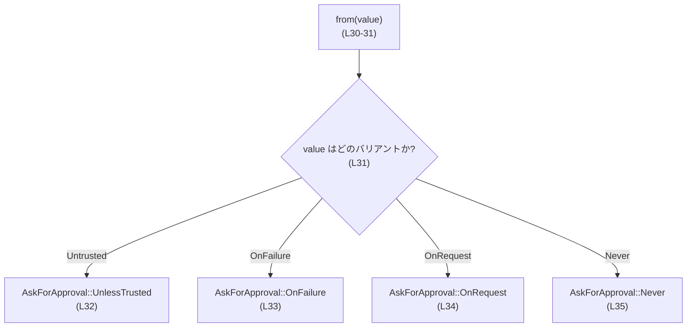
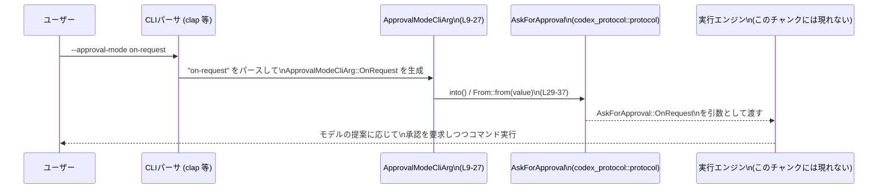

# utils/cli/src/approval_mode_cli_arg.rs コード解説

## 0. ざっくり一言

`--approval-mode` という CLI オプションの値を表現する列挙型と、それを内部プロトコル用の `AskForApproval` 型に変換するための `From` 実装を提供するモジュールです（approval_mode_cli_arg.rs:L1-5, L9-27, L29-37）。

---

## 1. このモジュールの役割

### 1.1 概要

- このモジュールは、CLI から指定される `--approval-mode` オプションの値を型安全に扱うための **列挙型 `ApprovalModeCliArg`** を定義します（approval_mode_cli_arg.rs:L1, L9-27）。
- さらに、この CLI 用の列挙型から、別クレート `codex_protocol` が定義する **プロトコル型 `AskForApproval`** に変換するための `From<ApprovalModeCliArg>` 実装を提供します（approval_mode_cli_arg.rs:L5, L29-37）。

### 1.2 アーキテクチャ内での位置づけ

このモジュールは、以下のような位置づけになっています。

- 外部依存:
  - `clap::ValueEnum`: CLI 引数パーサー（clap）で列挙型をオプション値として扱うためのトレイト（approval_mode_cli_arg.rs:L3, L7-8）。
  - `codex_protocol::protocol::AskForApproval`: 内部プロトコルで使用される承認モードを表す型（approval_mode_cli_arg.rs:L5, L32-35）。
- 提供する役割:
  - `ApprovalModeCliArg`: CLI から見える承認モードの値（approval_mode_cli_arg.rs:L9-27）。
  - `From<ApprovalModeCliArg> for AskForApproval`: CLI レベルのモードをプロトコルレベルのモードに **1:1 でマッピングする変換層**（approval_mode_cli_arg.rs:L29-37）。

依存関係を簡略化した図です。

```mermaid
graph TD
    CLI["CLI オプション\n--approval-mode"] -->|パース| ApprovalModeCliArg["ApprovalModeCliArg enum\n(L9-27)"]
    ApprovalModeCliArg -->|From 実装\n(L29-37)| AskForApproval["AskForApproval 型\n(codex_protocol::protocol)"]
    ApprovalModeCliArg -. derive .-> ValueEnum["clap::ValueEnum\n(L3, L7-8)"]
```

- `CLI` は clap などのパーサー側の概念で、このファイルには直接現れません（このチャンクには現れません）。
- `ApprovalModeCliArg` と `AskForApproval` の間の変換のみが、このファイルの責務です。

### 1.3 設計上のポイント

コードから読み取れる設計上の特徴は次のとおりです。

- **責務の分離**  
  - CLI 専用の列挙型 `ApprovalModeCliArg` を定義し、それを内部プロトコル型 `AskForApproval` に変換する形になっています（approval_mode_cli_arg.rs:L9-27, L29-37）。
- **型によるバリデーション**  
  - `ApprovalModeCliArg` は `#[derive(ValueEnum)]` で `clap::ValueEnum` を実装しており、CLI オプション値をこの列挙型に直接マッピングできるようになっています（approval_mode_cli_arg.rs:L3, L7-8）。
- **値の表記揺れ対策**  
  - `#[value(rename_all = "kebab-case")]` によって、CLI ではケバブケース（例: `on-request`）で指定できるようになっています（approval_mode_cli_arg.rs:L8）。
- **ステートレスで安全な変換**  
  - `impl From<ApprovalModeCliArg> for AskForApproval` は単純な `match` による 1:1 マッピングであり、副作用やエラーのない純粋な変換です（approval_mode_cli_arg.rs:L29-37）。
- **コピー可能な軽量値**  
  - `ApprovalModeCliArg` は `Clone + Copy + Debug` を derive しており、所有権移動を意識せずに値渡しできる軽量な列挙型として設計されています（approval_mode_cli_arg.rs:L7）。
- **利用上の注意（コメントベースの非推奨）**  
  - バリアント `OnFailure` にはドキュメントコメント内で「DEPRECATED」と明示されていますが、コンパイラレベルの `#[deprecated]` 属性は付与されていません（approval_mode_cli_arg.rs:L15-18）。

---

## 2. 主要な機能一覧

このモジュールが提供する主なコンポーネントと機能です。

- `ApprovalModeCliArg` 列挙体: `--approval-mode` CLI オプションの値（`untrusted`, `on-failure`, `on-request`, `never`）を表現する型（approval_mode_cli_arg.rs:L1, L9-27）。
- `From<ApprovalModeCliArg> for AskForApproval` 実装: CLI 用の承認モードをプロトコル用の `AskForApproval` に変換する機能（approval_mode_cli_arg.rs:L5, L29-37）。

---

## 3. 公開 API と詳細解説

### 3.1 型一覧（構造体・列挙体など）

#### 主な型

| 名前 | 種別 | 公開性 | 役割 / 用途 | 定義位置 |
|------|------|--------|-------------|----------|
| `ApprovalModeCliArg` | 列挙体 | `pub` | `--approval-mode` CLI オプションで指定可能な承認モードを表す。`clap::ValueEnum` を実装しており CLI から直接パースされることを想定している。 | approval_mode_cli_arg.rs:L1, L7-9, L13, L19, L22, L26 |
| `AskForApproval` | 列挙体 / その他の型（詳細不明） | 不明（外部クレート） | 内部プロトコルにおける承認モードを表す型。`ApprovalModeCliArg` から `From` 変換で生成される。 | インポートのみ: approval_mode_cli_arg.rs:L5, 使用: L32-35 |

> `AskForApproval` は `codex_protocol::protocol` モジュールからインポートされているだけで、このチャンクには定義が現れません（approval_mode_cli_arg.rs:L5）。

#### `ApprovalModeCliArg` のバリアント一覧

| バリアント名 | CLI 上の文字列表現（推定） | 説明（ドキュメントコメント要約） | 定義位置 |
|--------------|--------------------------|----------------------------------|----------|
| `Untrusted` | `untrusted` | 「信頼された（trusted）」コマンドだけをユーザー承認なしで実行し、それ以外のコマンドはユーザーにエスカレーションするモード（approval_mode_cli_arg.rs:L10-13）。 | approval_mode_cli_arg.rs:L10-13 |
| `OnFailure` | `on-failure` | **コメント上で DEPRECATED**。すべてのコマンドを承認なしで実行し、失敗時のみ非サンドボックス実行の承認を求めるモードと説明されている（approval_mode_cli_arg.rs:L15-19）。 | approval_mode_cli_arg.rs:L15-19 |
| `OnRequest` | `on-request` | モデル側が承認を求めるタイミングを決定するモード（approval_mode_cli_arg.rs:L21-22）。 | approval_mode_cli_arg.rs:L21-22 |
| `Never` | `never` | ユーザー承認を一切求めず、実行失敗はただちにモデルに返すモード（approval_mode_cli_arg.rs:L24-26）。 | approval_mode_cli_arg.rs:L24-26 |

- CLI 上の文字列表現は `#[value(rename_all = "kebab-case")]`（approval_mode_cli_arg.rs:L8）とバリアント名からの一般的な変換規則に基づく推定です。実際の CLI 表示は clap の仕様に依存し、このチャンクだけからは厳密には確定できません。

### 3.2 関数詳細（重要なもの）

このファイルには 1 つの明示的な関数（メソッド）相当として、`From<ApprovalModeCliArg> for AskForApproval` の `from` 関数が定義されています（approval_mode_cli_arg.rs:L29-37）。

#### `impl From<ApprovalModeCliArg> for AskForApproval { fn from(value: ApprovalModeCliArg) -> Self }`

**概要**

- `ApprovalModeCliArg`（CLI 用の承認モード列挙体）を、プロトコル用の `AskForApproval` 型に変換します（approval_mode_cli_arg.rs:L29-37）。
- 変換は `match` による **1:1 対応の全列挙** で行われ、副作用・エラーのない純粋なマッピングです（approval_mode_cli_arg.rs:L31-35）。

**引数**

| 引数名 | 型 | 説明 |
|--------|----|------|
| `value` | `ApprovalModeCliArg` | CLI から得た承認モードの値。`Copy` を実装しているので所有権の移動を意識せず値渡しできる（approval_mode_cli_arg.rs:L7, L29-31）。 |

**戻り値**

- 型: `AskForApproval`（外部クレート `codex_protocol::protocol` の型）（approval_mode_cli_arg.rs:L5, L29）。
- 意味: `value` で指定された CLI 承認モードに対応する、内部プロトコル用の承認モード値。`Self` として返されているため、`From` トレイトの実装先である `AskForApproval` のインスタンスになります（approval_mode_cli_arg.rs:L29-32）。

**内部処理の流れ（アルゴリズム）**

1. 引数 `value` を `match` 式でパターンマッチします（approval_mode_cli_arg.rs:L31）。
2. 各バリアントごとに対応する `AskForApproval` のバリアントを返します（approval_mode_cli_arg.rs:L32-35）。
   - `ApprovalModeCliArg::Untrusted` → `AskForApproval::UnlessTrusted`（approval_mode_cli_arg.rs:L32）。
   - `ApprovalModeCliArg::OnFailure` → `AskForApproval::OnFailure`（approval_mode_cli_arg.rs:L33）。
   - `ApprovalModeCliArg::OnRequest` → `AskForApproval::OnRequest`（approval_mode_cli_arg.rs:L34）。
   - `ApprovalModeCliArg::Never` → `AskForApproval::Never`（approval_mode_cli_arg.rs:L35）。
3. `match` は列挙体の全バリアントを網羅しているため、コンパイル時にパターン網羅性が保証されます（approval_mode_cli_arg.rs:L10-26, L31-35）。

シンプルなフロー図です。



**Examples（使用例）**

> 注意: ここでのコード例は、このファイルの型をどのように使うかの概念的な例です。  
> 実際のクレート構成・モジュールパスは、このチャンクからは分からないため、`crate::approval_mode_cli_arg` というパスは一例です。

1. 基本的な変換の例（同一モジュール内の利用）

```rust
// approval_mode_cli_arg.rs と同じモジュール内にいると仮定した例

fn choose_policy(mode: ApprovalModeCliArg) -> AskForApproval {
    // From<ApprovalModeCliArg> for AskForApproval が実装されているので、
    // 直接 into() を呼び出して変換できる
    mode.into()
}

fn example() {
    let mode = ApprovalModeCliArg::Untrusted; // CLI からパースされたと想定
    let ask: AskForApproval = choose_policy(mode);

    // ここで ask を実行エンジンに渡す、などの利用が想定されます
}
```

1. Clap と組み合わせる典型的な利用例（概念的な例）

```rust
use clap::{Parser, ValueEnum};
use codex_protocol::protocol::AskForApproval;
// ApprovalModeCliArg はこのファイルの型。crate の構成に応じてパスを調整する
use crate::approval_mode_cli_arg::ApprovalModeCliArg;

#[derive(Parser)]
struct Args {
    /// モデルがコマンドを実行するときの承認ポリシー
    #[arg(long, value_enum)]
    approval_mode: ApprovalModeCliArg,
}

fn main() {
    let args = Args::parse();

    // CLI で指定されたモードを内部プロトコル用の型に変換
    let approval_policy: AskForApproval = args.approval_mode.into();

    // approval_policy を以降の処理（エージェントや実行エンジン）に渡す
}
```

- この例は clap の一般的な利用パターンを示したものであり、このレポートの対象コードに明示的には現れない部分（`Args` 構造体など）を含みます。

**Errors / Panics**

- `From::from` 実装内では、パニックを起こすコード（`panic!`、`unwrap` など）は使われていません（approval_mode_cli_arg.rs:L29-37）。
- `match` 式は全バリアントを網羅しているため、**実行時エラーやパニックの発生可能性はありません**（Rust の列挙体とパターンマッチの性質による）。
- 無効な CLI 入力値が渡される場合は、通常は `ApprovalModeCliArg` を構築する段階（clap によるパース）でエラーになると考えられ、この関数に到達しません。この挙動自体はこのチャンクには現れません。

**Edge cases（エッジケース）**

この関数に関する典型的なエッジケースは次のとおりです。

- **未知のモード**  
  - `ApprovalModeCliArg` は列挙体なので、未知のモード値を表すバリアントは存在しません（approval_mode_cli_arg.rs:L9-27）。
  - そのため `from` に渡される値は常に 4 つのいずれかであり、`match` の網羅性によりエッジケースはありません（approval_mode_cli_arg.rs:L31-35）。
- **`OnFailure` の扱い**  
  - コメントとして「DEPRECATED」と書かれているものの、`From` 実装では `AskForApproval::OnFailure` に通常どおりマッピングされています（approval_mode_cli_arg.rs:L15-19, L33）。
  - 実行時に特別な警告やパニックは発生しません。

**使用上の注意点**

- **セキュリティ上の重要性**  
  - コメントによると、各モードは「ユーザーにいつ承認を求めるか」「どこまで自動実行を許すか」を制御しており（approval_mode_cli_arg.rs:L10-12, L15-18, L21-22, L24-25）、コマンド実行の安全性に直接影響します。
  - このマッピングを変更する場合は、`AskForApproval` 側の意味と完全に一致していることを慎重に確認する必要があります。
- **`OnFailure` の非推奨扱い**  
  - コメント上でのみ非推奨とされており、コンパイラによる警告は出ません（approval_mode_cli_arg.rs:L15-18）。
  - CLI インターフェースやドキュメント上で `OnFailure` をどう扱うかは、別途検討が必要です（このチャンクには現れません）。
- **並行性・スレッド安全性**  
  - 関数は純粋な値変換であり、共有可変状態や I/O を扱っていないため、どのスレッドから呼んでも結果は同じです。
  - `ApprovalModeCliArg` は `Copy` を実装しているため、スレッド間でコピーして渡しても所有権に関する問題は発生しません（approval_mode_cli_arg.rs:L7）。

### 3.3 その他の関数

- このファイルには、上記の `From::from` 以外の関数・メソッドは定義されていません（approval_mode_cli_arg.rs:L1-38）。

---

## 4. データフロー

### 代表的な処理シナリオ

代表的なシナリオは、「ユーザーが CLI で `--approval-mode` を指定し、その値が内部プロトコルの設定に反映される」という流れです。

1. ユーザーが CLI で `--approval-mode` に文字列（例: `on-request`）を指定する。
2. CLI パーサー（clap など）がその文字列を `ApprovalModeCliArg` にパースする（`ValueEnum` 派生による機能、approval_mode_cli_arg.rs:L3, L7-8）。
3. アプリケーションコードが `ApprovalModeCliArg` を `AskForApproval` に変換するために `into()` または `From::from` を呼び出す（approval_mode_cli_arg.rs:L29-37）。
4. 変換された `AskForApproval` が、実際にコマンドを実行するコンポーネントに渡され、承認ポリシーとして使用される（このチャンクには現れません）。

シーケンス図で表すと次のようになります。



- このファイル自身は CLI パースや実行エンジンを直接扱っておらず、**`ApprovalModeCliArg` ↔ `AskForApproval` 間の変換点**としてデータフローに組み込まれます。

---

## 5. 使い方（How to Use）

### 5.1 基本的な使用方法

典型的には、以下の 3 ステップで使用されます。

1. clap などの CLI パーサーで、`--approval-mode` の値を `ApprovalModeCliArg` として受け取る（`ValueEnum` 派生を利用、approval_mode_cli_arg.rs:L3, L7-8）。
2. `ApprovalModeCliArg` を `into()` で `AskForApproval` に変換する（approval_mode_cli_arg.rs:L29-37）。
3. `AskForApproval` をアプリケーションやエージェントの設定として渡す。

概念的なコード例です。

```rust
use clap::{Parser, ValueEnum};
use codex_protocol::protocol::AskForApproval;
use crate::approval_mode_cli_arg::ApprovalModeCliArg; // このファイルの型

#[derive(Parser)]
struct Args {
    /// コマンド実行時にユーザーの承認をどのように求めるか
    #[arg(long, value_enum)]
    approval_mode: ApprovalModeCliArg,
}

fn main() {
    let args = Args::parse();

    // CLI から得たモードを内部プロトコル用の型に変換
    let approval_policy: AskForApproval = args.approval_mode.into();

    // 以降、approval_policy を使って実行エンジンの挙動を制御する
}
```

### 5.2 よくある使用パターン

- **デフォルト値との組み合わせ**  
  - CLI 引数で `--approval-mode` が指定されない場合に、アプリケーション側でデフォルトの `AskForApproval` を設定し、指定された場合は `ApprovalModeCliArg` → `AskForApproval` による変換結果を上書きする、という構成が考えられます（このロジック自体はこのチャンクには現れません）。
- **非インタラクティブ / バッチ処理**  
  - コメント上では、非インタラクティブ実行には `never` を推奨している旨が書かれています（approval_mode_cli_arg.rs:L15-18）。  
    これを利用し、バッチモードでは `ApprovalModeCliArg::Never` を強制的に選ぶようなフローも設計できます。

### 5.3 よくある間違い

このファイルの構造から推測される、起こりうる誤用パターンです。

```rust
// 間違い例: ApprovalModeCliArg を直接ロジックで解釈してしまう
fn run(mode: ApprovalModeCliArg) {
    // CLI 用のモードと内部プロトコルの意味が乖離し始めると、
    // ここでの解釈と AskForApproval を使う部分で矛盾が生じる可能性がある
    match mode {
        ApprovalModeCliArg::Untrusted => { /* 何かする */ }
        // ...
    }
}

// 正しい例: まず AskForApproval に変換してから、プロトコルレイヤーで解釈する
fn run(mode: ApprovalModeCliArg) {
    let approval: AskForApproval = mode.into();
    // 以降は AskForApproval だけを扱うようにしてレイヤー間の分離を保つ
    execute_with_policy(approval);
}
```

- 変換ロジックを一箇所（この `From` 実装）に集約しておくことで、CLI のモードと内部プロトコルの意味を一貫性のある形で管理しやすくなります。

### 5.4 使用上の注意点（まとめ）

- **`OnFailure` のコメント上の非推奨**  
  - バリアント `OnFailure` はドキュメントコメントで「DEPRECATED」と明示されていますが（approval_mode_cli_arg.rs:L15-18）、コンパイラによる警告は出ません。
  - ユーザーに対する表示やドキュメントで、このモードの扱いをどのように説明するかを別途検討する必要があります。
- **セキュリティ上の影響**  
  - コメントから、このモジュールが制御するのは「どのコマンドを自動実行し、どのタイミングでユーザーに承認を求めるか」であり（approval_mode_cli_arg.rs:L10-12, L15-18, L21-22, L24-25）、誤った設定は意図しないコマンド実行や過剰な権限昇格につながる可能性があります。
  - 新しいモード追加やマッピング変更時には、仕様とコードの整合性を厳密に確認することが重要です。
- **エラー処理**  
  - このモジュール内ではエラーやパニックは発生しませんが（approval_mode_cli_arg.rs:L29-37）、無効な CLI 入力はパース段階で扱われます。この挙動は clap 側の設定に依存し、このチャンクには現れません。
- **テスト**  
  - このファイル内にはテストコード（`#[test]` 等）は含まれていません（approval_mode_cli_arg.rs:L1-38）。  
    実際のプロジェクトでは、`ApprovalModeCliArg` と `AskForApproval` の対応関係を確認するユニットテストを別ファイルで用意するのが一般的です（このチャンクには現れません）。
- **観測性（ログ等）の欠如**  
  - このモジュールはログ出力やメトリクス計測を行っていません（approval_mode_cli_arg.rs:L1-38）。  
    承認モードの決定経路を追跡したい場合は、呼び出し側でログ出力を追加する必要があります。

---

## 6. 変更の仕方（How to Modify）

### 6.1 新しい機能を追加する場合

#### 新しい承認モードを追加する

新しい承認モードを CLI から指定可能にし、内部プロトコルにも反映させたい場合の典型的な手順です。

1. **`ApprovalModeCliArg` にバリアントを追加**（approval_mode_cli_arg.rs:L9-27）
   - 例: `Auto` などのバリアント名を追加し、ドキュメントコメントで動作を説明します。
   - `#[value(rename_all = "kebab-case")]` が付いているため、CLI では自動的にケバブケースの名前で利用されることが期待されます（approval_mode_cli_arg.rs:L8）。
2. **`AskForApproval` 側に対応する値を追加**  
   - `AskForApproval` の定義はこのチャンクには現れませんが、`codex_protocol::protocol` 内にあることがインポートから分かります（approval_mode_cli_arg.rs:L5）。
   - 新しいモードに対応するバリアントや状態を、`AskForApproval` に追加する必要があると考えられます（推測を含みます）。
3. **`From<ApprovalModeCliArg> for AskForApproval` の `match` を更新**（approval_mode_cli_arg.rs:L31-35）
   - 新しい `ApprovalModeCliArg` バリアントを `match` に追加し、対応する `AskForApproval` のバリアントを返すようにします。
   - Rust のパターンマッチは列挙体の全バリアントを網羅する必要があるため、新バリアント追加後に `match` を更新し忘れるとコンパイルエラーで検知できます（安全性の一因です）。
4. **CLI ヘルプ・ドキュメントの更新**  
   - 新しいモードの意味と推奨される利用シーンを、ユーザードキュメントに反映させます（このチャンクには現れません）。
5. **テストの追加・更新**  
   - `ApprovalModeCliArg` ↔ `AskForApproval` の対応関係を検証するユニットテストを追加・更新します（テストコードはこのチャンクには現れません）。

### 6.2 既存の機能を変更する場合

#### モードの意味を変更する

- `ApprovalModeCliArg` の各バリアントの意味はドキュメントコメントに記述されています（approval_mode_cli_arg.rs:L10-12, L15-18, L21-22, L24-25）。
- 意味を変更する場合は:
  - ドキュメントコメントの更新（approval_mode_cli_arg.rs:L10-12, L15-18, L21-22, L24-25）。
  - `AskForApproval` 側の仕様・実装の確認と必要な変更（このチャンクには現れません）。
  - エージェントや実行エンジン側で `AskForApproval` を参照している箇所の挙動確認（このチャンクには現れません）。
- セキュリティやユーザー体験に直接影響するため、仕様変更は慎重に行う必要があります。

#### バリアントの削除・非推奨化

- `OnFailure` はコメント上ですでに「DEPRECATED」とされていますが（approval_mode_cli_arg.rs:L15-18）、本当に使用をやめたい場合は次の点に注意します。
  - 即時削除すると、`AskForApproval::OnFailure` を期待している既存コードとの互換性が失われる可能性があります。
  - 段階的に:
    1. ドキュメントや CLI ヘルプで非推奨を明示。
    2. 将来的には `#[deprecated]` 属性を付与し、コンパイル警告として通知する。
    3. 最終的に列挙体から削除する。
  - 削除時には `From` の `match` も更新し、パターン網羅性エラーを解消する必要があります（approval_mode_cli_arg.rs:L31-35）。

---

## 7. 関連ファイル

このモジュールと密接に関係する型・モジュールは、コードから次のように読み取れます。

| パス / モジュール名 | 役割 / 関係 |
|---------------------|------------|
| `codex_protocol::protocol::AskForApproval` | `ApprovalModeCliArg` から `From` 実装で変換される内部プロトコル用の承認モード型。CLI レイヤーとプロトコルレイヤーの橋渡し先となる（approval_mode_cli_arg.rs:L5, L32-35）。 |
| `clap::ValueEnum` | `ApprovalModeCliArg` が derive するトレイト。CLI オプション値として列挙体を扱うために利用されている（approval_mode_cli_arg.rs:L3, L7-8）。 |

- 実際に `ApprovalModeCliArg` がどのファイルから参照されているか（例: `src/main.rs` や他の CLI 用モジュール）は、このチャンクには現れません。
- テストコードを含む関連ファイルも、このチャンクからは特定できません（「不明」となります）。
