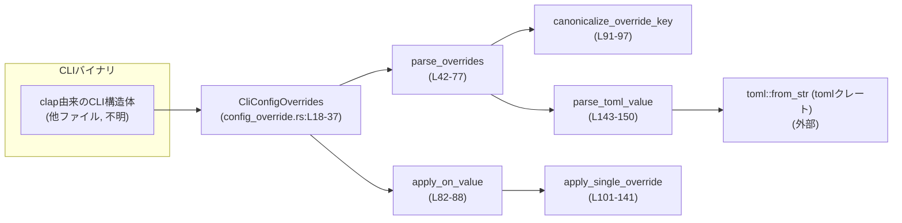
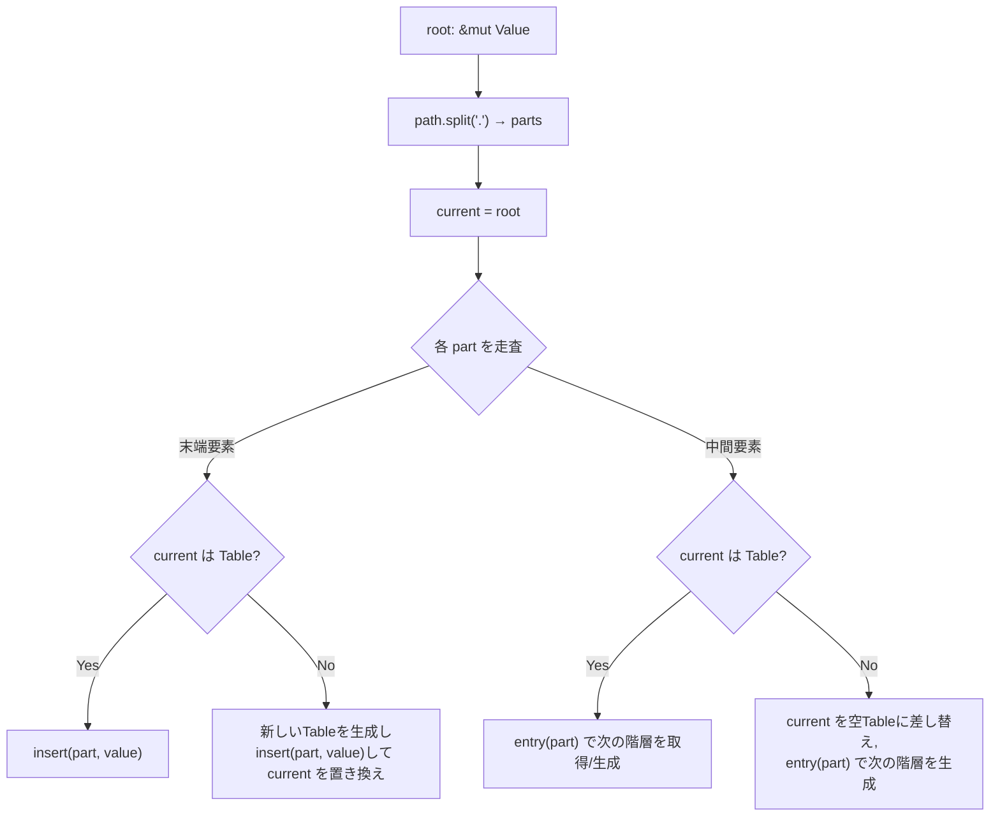
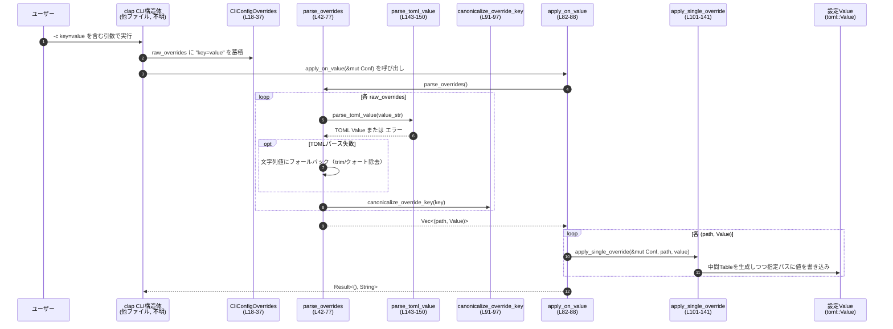

## utils/cli/src/config_override.rs

---

## 0. ざっくり一言

`-c key=value` / `--config key=value` 形式で渡された CLI 引数を受け取り、それを TOML の値としてパースし、設定ツリー（`toml::Value`）に対してパス指定で上書き適用するためのユーティリティです（`CliConfigOverrides` 構造体とその補助関数群）（config_override.rs:L1-8, L18-37, L42-88, L101-141）。

---

## 1. このモジュールの役割

### 1.1 概要

- このモジュールは、Codex CLI ツール群で共通利用される「`-c key=value` による設定上書き機能」を提供します（config_override.rs:L1-7, L15-28）。
- `clap` で定義した CLI 構造体に `CliConfigOverrides` を `#[clap(flatten)]` で埋め込むことで、すべての `-c/--config` オプションを文字列として収集します（config_override.rs:L3-7, L18-37）。
- 収集した文字列を `(パス文字列, toml::Value)` のペアに変換し、既存の設定ツリー（`toml::Value`）に対してドット区切りパスで上書き適用する処理を提供します（config_override.rs:L39-88, L99-141）。

### 1.2 アーキテクチャ内での位置づけ

外部からは主に 2 ステップで利用される構造になっています。

1. `clap` が CLI 引数から `CliConfigOverrides.raw_overrides` を構築する（config_override.rs:L18-37）。
2. アプリケーションコードが `parse_overrides` / `apply_on_value` を呼び出し、`toml::Value` の設定ツリーに反映する（config_override.rs:L39-88）。

依存関係の概要を Mermaid 図で示します（この図は config_override.rs:L18-150 の関係を表します）。



- 外部依存: `clap`（CLI パーサ）、`toml`（値表現とパーサ）、`serde` のエラー型（config_override.rs:L10-13）。
- 設定ファイルの読み込み自体（例: `~/.codex/config.toml`）はこのモジュールの外で行われる想定です（config_override.rs:L20-23）。

### 1.3 設計上のポイント

- **CLI からの入力は文字列のまま保持**  
  `raw_overrides: Vec<String>` として「`key=value`」形式をそのまま保持し、解釈は後段の関数に任せる設計です（config_override.rs:L18-37）。
- **値部分は TOML として解釈し、失敗時は文字列リテラルにフォールバック**  
  `parse_toml_value` で TOML パースを試み、失敗した場合は（両端のクォートを取り除いた）文字列として扱います（config_override.rs:L62-72, L143-150）。
- **ドット区切りパスでネストされた設定を書き換え**  
  `apply_single_override` が `"foo.bar.baz"` のようなパスを分解し、必要に応じて中間テーブルを作成しながら `toml::Value` ツリーを更新します（config_override.rs:L99-141）。
- **特定キーのエイリアス対応**  
  `"use_legacy_landlock"` というキーを `"features.use_legacy_landlock"` に正規化するエイリアスを持ちます（config_override.rs:L91-97, L184-191）。
- **エラーは文字列メッセージで返却**  
  公開メソッドは `Result<..., String>` を返し、キーやフォーマットの不備を呼び出し側が扱えるようにしています（config_override.rs:L42-52, L58-60, L82-88）。

---

## 2. 主要な機能一覧とコンポーネントインベントリー

### 2.1 主要な機能（機能レベル）

- `CliConfigOverrides` による `-c key=value` CLI オプションの受け取り（config_override.rs:L15-37）
- `parse_overrides` による `raw_overrides` から `(パス, toml::Value)` への変換（config_override.rs:L39-77）
- `apply_on_value` による変換結果の設定ツリーへの一括適用（config_override.rs:L79-88）
- `apply_single_override` による 1 件のパス指定上書き（config_override.rs:L99-141）
- `parse_toml_value` による値部分の TOML パース（config_override.rs:L143-150）
- `"use_legacy_landlock"` キーの正規化（エイリアス）処理（config_override.rs:L91-97）

### 2.2 コンポーネントインベントリー（関数・構造体一覧）

| 名前 | 種別 | 公開 | 行範囲 | 役割 / 用途 |
|------|------|------|--------|-------------|
| `CliConfigOverrides` | 構造体（`derive(Parser, Debug, Default, Clone)`） | `pub` | config_override.rs:L18-37 | `clap` オプション `-c/--config` を `raw_overrides: Vec<String>` として受け取るコンテナ。 |
| `CliConfigOverrides::parse_overrides(&self)` | メソッド | `pub` | config_override.rs:L39-77 | `raw_overrides` の各要素 `"key=value"` を分解し、キー正規化と TOML パースを行い `Vec<(String, Value)>` に変換。 |
| `CliConfigOverrides::apply_on_value(&self, target: &mut Value)` | メソッド | `pub` | config_override.rs:L79-88 | `parse_overrides` の結果を使って、指定された `toml::Value` ツリーに上書きを適用。 |
| `canonicalize_override_key(key: &str)` | 関数 | `fn`（モジュール内 private） | config_override.rs:L91-97 | `"use_legacy_landlock"` を `"features.use_legacy_landlock"` にマッピングし、それ以外はそのまま返す。 |
| `apply_single_override(root: &mut Value, path: &str, value: Value)` | 関数 | `fn`（private） | config_override.rs:L99-141 | ドット区切りパスで指定された位置に `value` を書き込み、中間階層を `Table` として必要に応じて生成。 |
| `parse_toml_value(raw: &str)` | 関数 | `fn`（private） | config_override.rs:L143-150 | `"raw"` を TOML 値として解釈するため、`_x_ = raw` という TOML テーブルに包んでパースし、その値を取り出して返す。 |
| `tests::parses_basic_scalar()` | テスト関数 | `#[test]` | config_override.rs:L157-160 | `parse_toml_value("42")` が整数 `42` を返すことを検証。 |
| `tests::parses_bool()` | テスト関数 | `#[test]` | config_override.rs:L162-169 | `true` / `false` リテラルが正しく bool としてパースされることを検証。 |
| `tests::fails_on_unquoted_string()` | テスト関数 | `#[test]` | config_override.rs:L171-173 | `parse_toml_value("hello")` がエラーになること（非 TOML な未引用文字列）を検証。 |
| `tests::parses_array()` | テスト関数 | `#[test]` | config_override.rs:L176-180 | 配列リテラル `"[1, 2, 3]"` が正しく配列としてパースされることを検証。 |
| `tests::canonicalizes_use_legacy_landlock_alias()` | テスト関数 | `#[test]` | config_override.rs:L183-191 | `use_legacy_landlock=true` という CLI 入力が `features.use_legacy_landlock = true` に正規化されることを検証。 |
| `tests::parses_inline_table()` | テスト関数 | `#[test]` | config_override.rs:L193-198 | インラインテーブル `{a = 1, b = 2}` が `Table` としてパースされることを検証。 |

---

## 3. 公開 API と詳細解説

### 3.1 型一覧

| 名前 | 種別 | フィールド | 役割 / 用途 |
|------|------|-----------|-------------|
| `CliConfigOverrides` | 構造体（`Parser, Debug, Default, Clone` 派生） | `pub raw_overrides: Vec<String>` | CLI から `-c/--config` オプションで指定された `"key=value"` 文字列のリストを保持する。`clap` によって自動的に構築される想定（config_override.rs:L15-37）。 |

> 注: モジュール先頭コメントでは「`serde_json::Value`」という記述がありますが（config_override.rs:L3-8）、実際のコードは `toml::Value` を使用しています（config_override.rs:L13, L42, L82, L101, L143）。

---

### 3.2 関数詳細

#### `CliConfigOverrides::parse_overrides(&self) -> Result<Vec<(String, Value)>, String>`

**概要**

`raw_overrides` に格納された `"key=value"` 形式の文字列を、ドット区切りのキーと TOML 値 (`toml::Value`) のペアへ変換します（config_override.rs:L39-77）。

**引数**

| 引数名 | 型 | 説明 |
|--------|----|------|
| `&self` | `&CliConfigOverrides` | `clap` によって構築された `raw_overrides` を保持するインスタンス。 |

**戻り値**

- `Ok(Vec<(String, Value)>)`  
  各要素は `(パス文字列, toml::Value)`。パス文字列は `"use_legacy_landlock"` の場合に `"features.use_legacy_landlock"` に置き換えられます（config_override.rs:L74-75, L91-97）。
- `Err(String)`  
  入力が `"key=value"` 形式でない場合、あるいはキーが空文字列だった場合にエラーメッセージを返します（config_override.rs:L49-52, L53-56, L58-60）。

**内部処理の流れ**

1. `self.raw_overrides.iter()` で各 `"key=value"` 文字列を順に処理（config_override.rs:L43-45）。
2. `splitn(2, '=')` により、最初の `=` でキーと値に分割（2 分割）します（config_override.rs:L46-48）。
   - `parts.next()` でキー部分（前半）を取得し `trim()` で前後の空白を除去（config_override.rs:L49-50）。
   - キーが存在しない場合は `"Override missing key"` エラー（config_override.rs:L49-52）。
3. `parts.next()` で値部分（後半）を取得し、存在しない場合は `"Invalid override (missing '=')"` エラー（config_override.rs:L53-56）。
4. キーが空文字列なら `"Empty key in override: ..."` エラー（config_override.rs:L58-60）。
5. 値文字列 `value_str` を `parse_toml_value(value_str)` に渡し、TOML パースを試行（config_override.rs:L62-66）。
   - 成功時: そのまま TOML 値を採用。
   - 失敗時: 値文字列を `trim()` し、さらに先頭・末尾のシングル/ダブルクォートを除去して `Value::String(...)` として扱う（config_override.rs:L67-71）。
6. 最終的なキーは `canonicalize_override_key(key)` で正規化されます（config_override.rs:L74-75）。
7. `Result` のイテレータを `.collect()` し、最初のエラーで停止して `Err(String)` を返します（config_override.rs:L43-52, L76-77）。

**Examples（使用例）**

CLI 引数から取得した `raw_overrides` を手動で作成し、パース結果を確認する簡単な例です。

```rust
use toml::Value;                                  // TOML 値型

// 通常は clap によって構築されるが、ここでは手動で用意する
let overrides = CliConfigOverrides {
    raw_overrides: vec![
        "model=\"o3\"".to_string(),               // TOML 文字列リテラル
        "temperature=0.7".to_string(),            // TOML 浮動小数点
        "use_legacy_landlock=true".to_string(),   // 特殊キー（エイリアス）
        "note=hello".to_string(),                 // TOML としては不正 → 文字列として扱われる
    ],
};

let parsed = overrides.parse_overrides()?;        // Result<Vec<(String, Value)>, String>

for (path, value) in parsed {
    println!("path = {path}, value = {value:?}");
}

// 期待される挙動（概略）:
// - "model" → Value::String("o3")
// - "temperature" → Value::Float(0.7)
// - "use_legacy_landlock" → パス "features.use_legacy_landlock" に正規化され、Value::Boolean(true)
// - "note" → Value::String("hello")（TOML パース失敗のため）
```

**Errors / Panics**

- `Err(String)` となる条件（config_override.rs:L49-52, L53-56, L58-60）:
  - `"key=value"` 形式でない（`=` が含まれない）場合。
  - `"=value"` のようにキーが欠落している場合（`parts.next()` が `None`）。
  - `"   = value"` のように空白を除いたキーが空文字列になる場合。
- TOML パースの失敗（例: `"hello"` のような未引用文字列）はエラーにはならず、文字列として扱われます（config_override.rs:L62-72）。  
  これはテスト `fails_on_unquoted_string` で `parse_toml_value("hello")` のエラーを確認しつつ、`parse_overrides` 側ではそれを握りつぶしてフォールバックしていることから読み取れます（config_override.rs:L171-173, L65-71）。
- パニックを引き起こすようなコード（`unwrap` や配列の範囲外アクセス）はこの関数にはありません。

**Edge cases（エッジケース）**

- `self.raw_overrides` が空の場合  
  `.iter().map(...)` の結果は空のイテレータとなり、`Ok(Vec::new())` が返ります（config_override.rs:L43-45, L76-77）。
- 値部分に `=` を含む場合（例: `"query=a=1&b=2"`）  
  `splitn(2, '=')` で最初の `=` だけを分割に用いるため、値部分は `"a=1&b=2"` としてそのまま扱われます（config_override.rs:L46-48）。
- 両端にクォートがある場合（例: `"\"hello\""` や `'world'`）  
  TOML パースに失敗した場合のみ `trim_matches(|c| c == '"' || c == '\'')` により両端のクォートが除去され、文字列として扱われます（config_override.rs:L67-71）。

**使用上の注意点**

- エラーは `String` メッセージとして返されるため、呼び出し側でログ出力やユーザー向けメッセージへの変換を行う必要があります。
- 値部分が TOML としてパースできない場合でも「エラーにはならない」点に注意が必要です。ユーザーが意図せず文字列として扱われるケースがあり得ます（例: `note=hello`）。
- この関数自体は `&self` しか取らず外部のグローバル状態を変更しないため、スレッドセーフに呼び出せる構造です（`CliConfigOverrides` のフィールドは `Vec<String>` のみ）（config_override.rs:L18-37, L42）。

---

#### `CliConfigOverrides::apply_on_value(&self, target: &mut Value) -> Result<(), String>`

**概要**

`parse_overrides` で得た `(パス, toml::Value)` のリストを、与えられた設定ツリー `target: &mut Value` に対して順に適用します（config_override.rs:L79-88）。

**引数**

| 引数名 | 型 | 説明 |
|--------|----|------|
| `&self` | `&CliConfigOverrides` | CLI から取得した上書き情報を保持する構造体。 |
| `target` | `&mut Value` | 上書き対象となる TOML 設定ツリー。`apply_single_override` によってミュータブルに書き換えられます。 |

**戻り値**

- `Ok(())`  
  すべての上書きが正常に適用された場合。
- `Err(String)`  
  上書きのパース (`parse_overrides`) に失敗した場合。その時点で処理は中断され、`target` には部分的に変更が加わっている可能性があります（config_override.rs:L82-84）。

**内部処理の流れ**

1. `self.parse_overrides()?` で上書きリストを取得。ここで `?` によってエラーはそのまま `Err(String)` として上位に伝播します（config_override.rs:L82-83）。
2. `for (path, value) in overrides` で各上書きを列挙し、`apply_single_override(target, &path, value)` を呼び出して `target` に適用（config_override.rs:L84-86）。
3. すべての上書き適用が完了したら `Ok(())` を返します（config_override.rs:L87-88）。

**Examples（使用例）**

```rust
use toml::Value;

// 既存の設定ツリー（通常はファイルから読み込む）
let mut config: Value = toml::from_str(r#"
    model = "gpt-4"
    [features]
    use_legacy_landlock = false
"#)?;

// CLI からの上書き（例として手動で指定）
let overrides = CliConfigOverrides {
    raw_overrides: vec![
        "model=\"o3\"".to_string(),
        "features.use_legacy_landlock=true".to_string(),
    ],
};

// 設定ツリーに上書きを適用
overrides.apply_on_value(&mut config)?;

// config["model"] が "o3" に、config["features"]["use_legacy_landlock"] が true になっていることが期待されます。
```

**Errors / Panics**

- `parse_overrides` からの `Err(String)` がそのまま返されます（config_override.rs:L82-83）。
  - 具体的な条件は前述の `parse_overrides` の項を参照してください。
- この関数自体にはパニックを起こすコードは含まれていません。  
  ただし、呼び出し側が返り値の `Result` を無視した場合、エラー発生時に設定が部分的に適用された状態になる可能性があります。

**Edge cases（エッジケース）**

- `raw_overrides` が空、もしくはすべて無効な形式で `parse_overrides` が `Err` を返す場合:
  - 前者: `parse_overrides` は `Ok(Vec::new())` を返し、`apply_single_override` は一度も呼ばれません（config_override.rs:L43-45, L76-77, L84-86）。
  - 後者: `parse_overrides` がエラーを返した時点で `target` は変更されません。
- `target` が最初 `Value::Table` でない場合（例えば `Value::String` など）でも、`apply_single_override` によってテーブルへ置き換えられます（config_override.rs:L115-120, L131-138）。

**使用上の注意点**

- 途中でエラーが発生した場合、どこまで適用されたかは追跡されません。  
  一貫性を保ちたい場合は、`parse_overrides` を先に呼び出して成功を確認してから `apply_on_value` に進む、といった二段階処理も検討できます。
- `target` はミュータブル参照で渡されるため、複数スレッドから同時に呼び出す場合は外側で同期（Mutex など）を取る必要があります。

---

#### `canonicalize_override_key(key: &str) -> String`

**概要**

オーバーライドキーの正規化を行う補助関数です。現在は `"use_legacy_landlock"` を `"features.use_legacy_landlock"` に変換し、それ以外はキーをそのまま返します（config_override.rs:L91-97）。

**引数**

| 引数名 | 型 | 説明 |
|--------|----|------|
| `key` | `&str` | CLI から取得したキー文字列。 |

**戻り値**

- `String`  
  正規化済みのキー。特定のエイリアスが適用済み。

**内部処理の流れ**

1. `if key == "use_legacy_landlock"` の条件判定（config_override.rs:L91-93）。
2. 該当する場合は `"features.use_legacy_landlock".to_string()` を返す（config_override.rs:L92-93）。
3. それ以外の場合は `key.to_string()` を返す（config_override.rs:L94-96）。

**Examples（使用例）**

```rust
let k1 = canonicalize_override_key("use_legacy_landlock");
assert_eq!(k1, "features.use_legacy_landlock");

let k2 = canonicalize_override_key("model");
assert_eq!(k2, "model");
```

**Errors / Panics**

- エラーやパニックは発生しません。単純な文字列比較・変換のみです。

**Edge cases**

- 空文字列 `""` が渡された場合も、そのまま `""` が返ります。  
  ただし実運用では `parse_overrides` 側で空キーはエラーにしているため（config_override.rs:L58-60）、この関数に空文字列が渡ることは通常想定されません。

**使用上の注意点**

- 新しいエイリアスを追加する場合は、この関数に条件分岐を追加するのが自然です。
- 既存キーの意味を変えると既存の CLI 挙動が変わるため、後方互換性に注意が必要です。

---

#### `apply_single_override(root: &mut Value, path: &str, value: Value)`

**概要**

1 件の `(パス, toml::Value)` を `root` の指定された位置に適用します。パスの途中に存在しない階層がある場合は `Table`（連想配列）として生成し、既存の非テーブル値がある場合はテーブルで置き換えます（config_override.rs:L99-141）。

**引数**

| 引数名 | 型 | 説明 |
|--------|----|------|
| `root` | `&mut Value` | 更新対象の設定ツリー。 |
| `path` | `&str` | `"foo.bar.baz"` のようなドット区切りパス。 |
| `value` | `Value` | パス末端に設定する TOML 値。所有権はこの関数内で消費されます。 |

**戻り値**

- `()`（戻り値なし）  
  `root` が直接ミュータブルに更新されます。

**内部処理の流れ**

1. `let parts: Vec<&str> = path.split('.').collect();` でパスを分割（config_override.rs:L104）。
2. `let mut current = root;` で現在位置のポインタをルートに設定（config_override.rs:L105）。
3. `for (i, part) in parts.iter().enumerate()` で各パス要素を走査（config_override.rs:L107-108）。
   - `is_last = i == parts.len() - 1` で末端かどうか判定（config_override.rs:L108）。
4. 末端要素の場合（config_override.rs:L110-121）:
   - `current` が `Value::Table(tbl)` であれば `tbl.insert(part.to_string(), value)` で値を挿入 / 上書き（config_override.rs:L111-114）。
   - それ以外の場合は新しい `Table` を生成し、その中にキーと値を挿入して `*current = Value::Table(tbl)` で置き換え（config_override.rs:L115-119）。
   - 挿入後 `return`。
5. 途中要素の場合（config_override.rs:L124-139）:
   - `current` が `Value::Table(tbl)` なら `tbl.entry(part.to_string()).or_insert_with(|| Value::Table(Table::new()))` で次の階層を取得または生成し、`current` をその参照に更新（config_override.rs:L125-130）。
   - それ以外の場合は新しい `Table` に置き換えた上で、同様に次の階層を生成して `current` を更新（config_override.rs:L131-138）。
6. ループ終了時には指定パスに値が設定されています。

**簡易フロー図**



（根拠: config_override.rs:L99-141）

**Examples（使用例）**

```rust
use toml::Value;
use toml::value::Table;

// 空の設定ツリー
let mut root = Value::Table(Table::new());

// "features.logging.level" に "debug" を設定
apply_single_override(
    &mut root,
    "features.logging.level",
    Value::String("debug".to_string()),
);

// 結果として root は以下のような構造になるイメージです:
// [features]
//   [features.logging]
//     level = "debug"
```

**Errors / Panics**

- エラーやパニックを返すコードはありません。  
  ループ内でインデックスアクセスは行っていないため、範囲外アクセスの可能性もありません（config_override.rs:L107-140）。

**Edge cases**

- `path` が空文字列 `""` の場合  
  `parts` は `[""]` となり、末端要素として扱われます。このとき、テーブルのキーとして空文字列 `""` が使われます。  
  このケースはコード上禁止されていませんが、実際に発生させるには `parse_overrides` の入力検証をすり抜ける必要があります（通常は `parse_overrides` が空キーをエラーにするため発生しません）（config_override.rs:L58-60, L104-108）。
- `root` が `Value::Table` 以外から始まる場合でも、必要に応じてテーブルに差し替えられるため、パスの途中での型不一致により失敗することはありません（config_override.rs:L115-120, L131-138）。

**使用上の注意点**

- `value` の所有権はこの関数内で消費されるため、同じ値を複数箇所に設定したい場合は呼び出し側で `clone()` する必要があります。
- `path` に空文字や不正な文字列を渡すと意図しないキーが生成される可能性があるため、通常は `parse_overrides` などの検証済み入力を用いることが推奨されます。

---

#### `parse_toml_value(raw: &str) -> Result<Value, toml::de::Error>`

**概要**

値文字列 `raw` を TOML の値としてパースするための補助関数です。内部で `_x_ = {raw}` という 1 行の TOML テーブルにラップしてから `toml::from_str` に渡し、キー `_x_` の値を取り出して返します（config_override.rs:L143-150）。

**引数**

| 引数名 | 型 | 説明 |
|--------|----|------|
| `raw` | `&str` | TOML の値リテラルを表す文字列。例: `42`, `"hello"`, `[1, 2, 3]`, `{a = 1}` など。 |

**戻り値**

- `Ok(Value)`  
  TOML として正しく解釈できた場合の値。
- `Err(toml::de::Error)`  
  TOML の文法として不正な場合。例えば `hello` のような未引用文字列に対してはエラーになります（config_override.rs:L171-173）。

**内部処理の流れ**

1. `let wrapped = format!("_x_ = {raw}");` で `_x_ = ...` という 1 行の TOML コンテンツを作成（config_override.rs:L143-144）。
2. `let table: toml::Table = toml::from_str(&wrapped)?;` で TOML テーブルとしてパース（config_override.rs:L145）。
   - ここでパースに失敗すれば `Err(toml::de::Error)` を返して早期終了。
3. `table.get("_x_").cloned().ok_or_else(|| SerdeError::custom("missing sentinel key"))` で `_x_` キーの値を取得（config_override.rs:L146-149）。
   - `_x_` が存在しない場合はカスタムエラー `"missing sentinel key"` を返す。

**Examples（使用例）**

```rust
let scalar = parse_toml_value("42")?;
assert_eq!(scalar.as_integer(), Some(42));

let boolean = parse_toml_value("true")?;
assert_eq!(boolean.as_bool(), Some(true));

let array = parse_toml_value("[1, 2, 3]")?;
assert_eq!(array.as_array().unwrap().len(), 3);

let inline_table = parse_toml_value("{a = 1, b = 2}")?;
let tbl = inline_table.as_table().unwrap();
assert_eq!(tbl.get("a").unwrap().as_integer(), Some(1));
assert_eq!(tbl.get("b").unwrap().as_integer(), Some(2));
```

（上記の挙動は tests モジュールのテストケースから読み取れます: config_override.rs:L157-160, L162-169, L176-180, L193-198）

**Errors / Panics**

- TOML 構文エラー: `toml::from_str(&wrapped)` が `Err(...)` を返し、そのまま呼び出し元に伝播されます（config_override.rs:L145）。
- `_x_` キーが存在しない場合: `SerdeError::custom("missing sentinel key")` によりエラーになります（config_override.rs:L146-149）。
- パニックは想定されていません。

**Edge cases**

- 未引用の英字列 `"hello"` は TOML の値としては不正であり、テスト `fails_on_unquoted_string` が `is_err()` を期待しています（config_override.rs:L171-173）。
- 空文字列 `""` を渡した場合の挙動は、このファイル内にはテストがなく明示されていませんが、`wrapped = "_x_ = "` となるため TOML パーサ側の挙動に依存します。

**使用上の注意点**

- この関数はエラーを返し得ますが、`parse_overrides` では `Err(_)` を握りつぶして文字列フォールバックに利用しています（config_override.rs:L65-71）。  
  直接利用する場合は、`Result` を適切にハンドリングする必要があります。

---

### 3.3 その他の関数（テスト専用）

| 関数名 | 役割（1 行） | 行範囲 |
|--------|--------------|--------|
| `tests::parses_basic_scalar` | `parse_toml_value("42")` が整数 `42` を返すことを検証（config_override.rs:L157-160）。 | config_override.rs:L157-160 |
| `tests::parses_bool` | `parse_toml_value("true"/"false")` が bool としてパースされることを検証。 | config_override.rs:L162-169 |
| `tests::fails_on_unquoted_string` | 未引用文字列 `"hello"` のパースがエラーになることを検証。 | config_override.rs:L171-173 |
| `tests::parses_array` | 配列リテラルのパースと長さを検証。 | config_override.rs:L176-180 |
| `tests::canonicalizes_use_legacy_landlock_alias` | エイリアス `"use_legacy_landlock"` が正しく正規化されることを検証。 | config_override.rs:L183-191 |
| `tests::parses_inline_table` | インラインテーブル `{a = 1, b = 2}` のパースを検証。 | config_override.rs:L193-198 |

---

## 4. データフロー

典型的な利用シナリオとして、「ユーザーが CLI で `-c` オプションを指定し、設定ファイルから読み込んだ `toml::Value` に上書きが適用される」流れを示します。

### 4.1 シーケンス図



（根拠: config_override.rs:L18-37, L39-88, L91-97, L99-141, L143-150）

この流れにより、設定ファイルに読み込まれた `Conf: toml::Value` が、ユーザー指定の CLI オプションで最終的な実行時設定に調整されます。

---

## 5. 使い方（How to Use）

### 5.1 基本的な使用方法

`clap` で定義した CLI 構造体に `CliConfigOverrides` をフラットに埋め込み、読み込んだ設定に上書きを適用する例です。

```rust
use clap::Parser;
use toml::Value;

// CLI 全体の定義。
// 実際のモジュールパスはプロジェクト構成に応じて `use` してください。
#[derive(Parser, Debug)]
struct Cli {
    /// 設定上書き用のオプション (-c/--config) を取り込む
    #[clap(flatten)]                      // config_override.rs:L3-7 のドキュメントに基づく
    config_overrides: CliConfigOverrides, // config_override.rs:L18-37
}

fn main() -> Result<(), Box<dyn std::error::Error>> {
    // CLI 引数のパース
    let cli = Cli::parse();

    // 例: 設定ファイルから TOML を読み込む（ファイルパスは実際のコードに依存）
    let mut config: Value = toml::from_str(r#"
        model = "gpt-4"
        [features]
        use_legacy_landlock = false
    "#)?;

    // CLI からの上書きを適用
    cli.config_overrides.apply_on_value(&mut config)?; // config_override.rs:L82-88

    println!("{config:?}");
    Ok(())
}
```

- CLI で `-c model="o3" -c use_legacy_landlock=true` と指定した場合、`config` の対応する値が上書きされます（config_override.rs:L20-28, L91-97, L184-191）。

### 5.2 よくある使用パターン

1. **単純なスカラー値の上書き**

   ```bash
   my-cli -c model="o3" -c temperature=0.7
   ```

   - `"o3"` は TOML 文字列として、`0.7` は浮動小数点としてパースされます（config_override.rs:L62-66, L157-160）。

2. **配列やインラインテーブルの指定**

   ```bash
   my-cli -c 'sandbox_permissions=["disk-full-read-access"]' \
          -c 'limits={max_tokens=4096,timeout_ms=30000}'
   ```

   - `parse_toml_value` が配列・インラインテーブルをサポートしていることはテストから確認できます（config_override.rs:L176-180, L193-198）。

3. **エイリアスキーの利用**

   ```bash
   my-cli -c use_legacy_landlock=true
   ```

   - 内部的には `"features.use_legacy_landlock"` へ正規化されます（config_override.rs:L91-97, L184-191）。

### 5.3 よくある間違い

```rust
// 誤り例: '=' を書き忘れている
let overrides = CliConfigOverrides {
    raw_overrides: vec!["model".to_string()], // "model=value" ではない
};

let result = overrides.parse_overrides();
// result は Err("Invalid override (missing '='): model") になる（config_override.rs:L53-56）。

// 正しい例: "key=value" 形式で指定する
let overrides_ok = CliConfigOverrides {
    raw_overrides: vec!["model=\"o3\"".to_string()],
};
let parsed = overrides_ok.parse_overrides()?; // Ok(...)
```

```bash
# 誤り例: 未引用文字列を TOML として渡しているつもり
my-cli -c note=hello

# 挙動:
# - parse_toml_value("hello") はエラー（config_override.rs:L171-173）
# - そのため parse_overrides は "hello" を「クォートを除去した文字列」として扱う（config_override.rs:L67-71）
# → 結果的には文字列としては期待通りだが、ユーザーは TOML として解釈されなかったことに気づかない場合がある。
```

### 5.4 使用上の注意点（まとめ）

- **入力形式の前提**  
  `raw_overrides` は常に `"key=value"` 形式である必要があります。CLI レベルで制約できない場合、`parse_overrides` のエラーを必ずチェックする必要があります（config_override.rs:L49-56）。
- **TOML パースの挙動**  
  値部分が TOML として不正な場合でも `parse_overrides` はエラーにせず文字列として扱います。このため、「本来配列として扱いたかったが、実は文字列になっていた」といったロジックバグに注意が必要です（config_override.rs:L62-72, L171-173）。
- **並行性**  
  このモジュールには `unsafe` コードやグローバル可変状態は存在しません。  
  ただし `apply_on_value` / `apply_single_override` は `&mut Value` を受け取るため、同一の `Value` を複数スレッドから扱う場合は外部で同期を取る必要があります（config_override.rs:L82, L101）。
- **バリデーションの責任分界**  
  キー文字列の妥当性（空文字でないこと以外の制約）やパスの存在確認などは行っていません。  
  ドメイン固有の検証は、このモジュールの外で行う設計になっています（config_override.rs:L58-60, L99-141）。

---

## 6. 変更の仕方（How to Modify）

### 6.1 新しい機能を追加する場合

1. **新しいキーエイリアスを追加したい場合**

   - `canonicalize_override_key` に条件分岐を追加します（config_override.rs:L91-97）。

   ```rust
   fn canonicalize_override_key(key: &str) -> String {
       if key == "use_legacy_landlock" {
           "features.use_legacy_landlock".to_string()
       } else if key == "short_model" {
           "model.name".to_string()
       } else {
           key.to_string()
       }
   }
   ```

   - 追加したエイリアスについては、`tests` モジュールに対応するテストケースを追加すると挙動が明確になります（config_override.rs:L183-191 参照）。

2. **値パースのポリシーを変えたい場合**

   - 例えば「TOML パースに失敗したらエラーにしたい」場合、`parse_overrides` 内の `Err(_) => { ... }` 分岐（config_override.rs:L67-71）を変更し、`Err(String)` として返すようにする実装が考えられます。
   - その際、既存の呼び出し元が新しいエラーパスをハンドリングできるか確認が必要です。

3. **`toml::Value` 以外の設定表現に対応したい場合**

   - 現在は `toml::Value` に依存しているため（config_override.rs:L13, L42, L82, L101, L143）、別の表現（例: `serde_json::Value`）に対応するには、型パラメータ化や別モジュールの導入が必要になります。
   - 先頭コメントの「`serde_json::Value`」という記述との不整合に注意が必要です（config_override.rs:L3-8）。

### 6.2 既存の機能を変更する場合

- **影響範囲の確認**

  - `parse_overrides` の挙動変更は、そのまま `apply_on_value` に波及します（config_override.rs:L82-83）。
  - `apply_single_override` のロジック変更は、パス解釈や既存設定の上書き方法に直接影響します（config_override.rs:L99-141）。

- **契約・前提条件の維持**

  - キー `"use_legacy_landlock"` のエイリアスはテストで明示されているため（config_override.rs:L184-191）、削除・変更するとテストが失敗します。
  - `"key=value"` 形式および空でないキーという前提は `parse_overrides` の契約に含まれているため（config_override.rs:L49-52, L58-60）、変更する場合は呼び出し側への影響を検討する必要があります。

- **テストの更新**

  - `parse_toml_value` の挙動を変える場合、関連テスト（数値・bool・配列・インラインテーブル・未引用文字列）の更新が必要です（config_override.rs:L157-160, L162-169, L171-173, L176-180, L193-198）。

---

## 7. 関連ファイル

このチャンクには他ファイルのパスは登場しませんが、文脈上関連すると考えられる要素を整理します。

| パス / コンポーネント | 役割 / 関係 |
|-----------------------|------------|
| `clap` クレート | `CliConfigOverrides` を CLI 構造体に統合し、`raw_overrides` を構築する（config_override.rs:L10-11, L18-37）。 |
| `toml` クレート | 値の表現 (`toml::Value`) とパース (`toml::from_str`) を提供する（config_override.rs:L13, L42, L82, L101, L143-145）。 |
| `serde::de::Error` | `parse_toml_value` 内でカスタムエラーを生成するために使用される（config_override.rs:L12, L146-149）。 |
| `#[cfg(test)] mod tests` | このモジュールのユニットテストを含み、`parse_toml_value` とキー正規化の代表的な挙動を検証する（config_override.rs:L152-199）。 |

---

## バグの可能性とセキュリティ上の注意（要点）

- **文書と実装の不整合**  
  先頭コメントは `serde_json::Value` を前提に書かれていますが、実装は `toml::Value` を用いています（config_override.rs:L3-8, L13）。利用者は実際の型が TOML ベースである点に留意する必要があります。
- **値パース失敗のフォールバック**  
  TOML パース失敗時にエラーではなく文字列として処理する設計は、ユーザーの意図しない設定解釈を生む可能性があります（ロジックバグの温床）。セキュリティ的には直接の危険は少ないものの、想定外の設定状態を招く点には注意が必要です（config_override.rs:L62-72）。
- **入力サイズと DoS 耐性**  
  非常に大きな `raw_overrides` や `value_str` を与えられた場合、`toml::from_str` によるパースや `String` / `Vec` の確保によりメモリ・CPU を消費します。これは CLI の一般的な性質ですが、大量の `-c` を許可する場合は念頭に置く必要があります。
- **メモリ安全性と並行性**  
  このモジュールには `unsafe` コードがなく、可変操作はすべてローカルな `&mut Value` に対して行われているため、Rust の型システムによりメモリ安全性は保証されています（config_override.rs 全体）。並行アクセス時の整合性は呼び出し側の同期に依存します。
