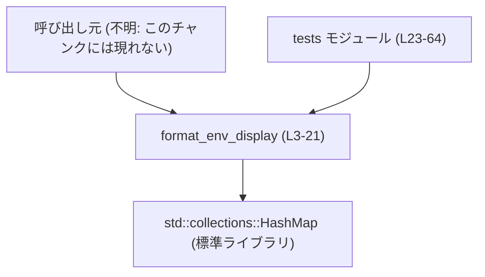
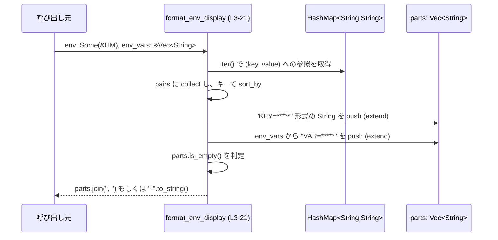

# utils/cli/src/format_env_display.rs コード解説

## 0. ざっくり一言

このファイルは、環境変数のマップと環境変数名のリストから、**値を「*****」でマスクしたログ表示用文字列**を生成するユーティリティ関数と、そのテストを提供しています（`utils/cli/src/format_env_display.rs:L3-21,23-64`）。

---

## 1. このモジュールの役割

### 1.1 概要

- このモジュールは、ログなどに環境変数情報を出力する際に **値を隠した形で整形表示**するための機能を提供します（`format_env_display` 関数）。
- 入力として
  - `Option<&HashMap<String, String>>` 型の環境変数マップ
  - `&[String]` 型の環境変数名リスト  
  を受け取り、 `"KEY=*****"` をカンマ区切りで連結した 1 本の `String` を返します（`utils/cli/src/format_env_display.rs:L3-20`）。

### 1.2 アーキテクチャ内での位置づけ

このファイル単体で確認できる依存関係は以下のとおりです。

- `format_env_display` は標準ライブラリの `std::collections::HashMap` に依存しています（`utils/cli/src/format_env_display.rs:L1,3,6-9`）。
- 外部から誰が呼び出すかは、このチャンクには現れていません（不明）。
- 同一ファイル内のテストモジュール `tests` からは直接呼び出されています（`utils/cli/src/format_env_display.rs:L23-64`）。

これを Mermaid の依存関係図で表すと次のようになります。



### 1.3 設計上のポイント

コードから読み取れる設計上の特徴は次のとおりです。

- **純粋関数**  
  - グローバル状態や I/O には一切アクセスせず、引数の値から戻り値を計算するだけの関数です（`utils/cli/src/format_env_display.rs:L3-20`）。
- **参照とスライスを利用した安全なインターフェース**  
  - 環境マップには `Option<&HashMap<..>>`、環境変数名リストには `&[String]` を取り、所有権を奪わずに読み取り専用で利用します（`utils/cli/src/format_env_display.rs:L3`）。
- **ソートによる安定した出力順序**  
  - `HashMap` のキーはソートしてから出力するため、ハッシュマップの内部順序に依存しない安定した文字列になります（`pairs.sort_by(..)`、`utils/cli/src/format_env_display.rs:L7-9`）。
- **値の完全マスクによる情報漏えい対策**  
  - 実際の値には触れず、キー名や変数名の後ろに常に `"=*****"` を付与して出力しています（`utils/cli/src/format_env_display.rs:L9,13`）。
- **エラーを返さないシンプルな API**  
  - `Result` や `Option` を返さず、常に `String` を返します。コード上、`unwrap` などのパニックを起こしうる呼び出しも含まれていません（`utils/cli/src/format_env_display.rs:L3-20`）。

---

## 2. 主要な機能一覧

このファイルが提供する主要な機能は次の 1 つです。

- `format_env_display`: 環境変数マップと環境変数名リストから、**値をマスクした `"KEY=*****"` 形式の文字列**を生成する（`utils/cli/src/format_env_display.rs:L3-21`）。

---

## 3. 公開 API と詳細解説

### 3.1 型一覧（構造体・列挙体など）

このファイル内で新しく定義される構造体や列挙体はありません。

| 名前 | 種別 | 役割 / 用途 | 定義位置 |
|------|------|-------------|----------|
| （なし） | - | - | - |

#### 関数・モジュールのインベントリー

| 名前 | 種別 | 可視性 | 役割 / 用途 | 定義位置 |
|------|------|--------|-------------|----------|
| `format_env_display` | 関数 | `pub` | 環境マップと変数名リストをマスク付き文字列に整形 | `utils/cli/src/format_env_display.rs:L3-21` |
| `tests` | モジュール | `#[cfg(test)]` | `format_env_display` のユニットテスト群を定義 | `utils/cli/src/format_env_display.rs:L23-64` |
| `returns_dash_when_empty` | テスト関数 | `#[test]` | 空入力時に `"-"` を返すことを検証 | `utils/cli/src/format_env_display.rs:L27-33` |
| `formats_sorted_env_pairs` | テスト関数 | `#[test]` | 環境マップのキーがソートされて表示されることを検証 | `utils/cli/src/format_env_display.rs:L35-42` |
| `formats_env_vars_with_dollar_prefix` | テスト関数 | `#[test]` | 環境変数名リストのみを渡した場合の表示形式を検証 | `utils/cli/src/format_env_display.rs:L44-52` |
| `combines_env_pairs_and_vars` | テスト関数 | `#[test]` | マップと変数名リストを併用した場合の連結順序を検証 | `utils/cli/src/format_env_display.rs:L54-64` |

### 3.2 関数詳細: `format_env_display`

#### `format_env_display(env: Option<&HashMap<String, String>>, env_vars: &[String]) -> String`

**概要**

- 環境変数を表すハッシュマップ `env` と、環境変数名のリスト `env_vars` を受け取り、
  - マップ内のキー
  - リスト内の文字列  
  それぞれを `"名前=*****"` という形に変換し、カンマ区切りで連結した `String` を返します（`utils/cli/src/format_env_display.rs:L3-20`）。
- どちらの入力も空の場合は、代わりに `"-"` を返します（`utils/cli/src/format_env_display.rs:L16-18`）。

**引数**

| 引数名 | 型 | 説明 |
|--------|----|------|
| `env` | `Option<&HashMap<String, String>>` | 環境変数名と値のマップへの参照。`None` の場合はマップ入力なしとして扱う（`utils/cli/src/format_env_display.rs:L3,6-10`）。 |
| `env_vars` | `&[String]` | 追加で表示したい環境変数の「名前」の一覧。要素はそのままキー名として `"=*****"` を付加して使用する（`utils/cli/src/format_env_display.rs:L3,12-14`）。 |

**戻り値**

- 型: `String`（`utils/cli/src/format_env_display.rs:L3`）
- 内容:
  - 入力されたキー名・変数名を `"KEY=*****"` 形式に変換し、`", "` 区切りで連結した文字列（`utils/cli/src/format_env_display.rs:L9,13,19`）。
  - どの入力も存在しない場合は `"-"`（`utils/cli/src/format_env_display.rs:L16-18`）。

**内部処理の流れ（アルゴリズム）**

1. 返却用のベクタ `parts` を空で作成する（`let mut parts: Vec<String> = Vec::new();`、`utils/cli/src/format_env_display.rs:L4`）。
2. `env` が `Some(map)` の場合:
   - `map.iter().collect()` で `(key, value)` への参照をベクタ `pairs` に収集する（`utils/cli/src/format_env_display.rs:L6-7`）。
   - `pairs.sort_by(|(a, _), (b, _)| a.cmp(b));` でキー文字列 `a` と `b` を比較し、キー順にソートする（`utils/cli/src/format_env_display.rs:L7-8`）。
   - `pairs.into_iter().map(|(key, _)| format!("{key}=*****"))` により、各ペアからキーのみを取り出して `"KEY=*****"` に変換し、`parts` に追加する（`utils/cli/src/format_env_display.rs:L9`）。
3. `env_vars` が空でない場合:
   - `env_vars.iter().map(|var| format!("{var}=*****"))` で各要素に `"=*****"` を付けて `parts` に追加する（`utils/cli/src/format_env_display.rs:L12-14`）。
4. 最後に:
   - `parts` が空なら `"-".to_string()` を返す（`utils/cli/src/format_env_display.rs:L16-18`）。
   - そうでなければ `parts.join(", ")` を返す（`utils/cli/src/format_env_display.rs:L19-20`）。

**Examples（使用例）**

1. 環境マップのみを指定する例（マップのキーはソートされます）。

```rust
use std::collections::HashMap;
use utils::cli::format_env_display::format_env_display; // モジュールパスは実際のクレート構成に依存（ここでは例示）

fn main() {
    // 環境変数マップを作成する
    let mut env = HashMap::new();
    env.insert("B".to_string(), "two".to_string());
    env.insert("A".to_string(), "one".to_string());

    // env_vars は空スライスを渡す
    let display = format_env_display(Some(&env), &[]);

    // キーがアルファベット順に並んだ "A=*****, B=*****" が得られる
    println!("{display}");
}
```

1. 変数名リストのみを指定する例。

```rust
use utils::cli::format_env_display::format_env_display;

fn main() {
    // ログに表示したい環境変数の名前だけを列挙する
    let vars = vec!["TOKEN".to_string(), "PATH".to_string()];

    // env は None、vars はスライス参照で渡す
    let display = format_env_display(None, &vars);

    // "TOKEN=*****, PATH=*****" という文字列になる
    println!("{display}");
}
```

上記 2 つの挙動は、テスト `formats_sorted_env_pairs` および `formats_env_vars_with_dollar_prefix` でも確認されています（`utils/cli/src/format_env_display.rs:L35-42,44-52`）。

**Errors / Panics**

- この関数は `Result` ではなく `String` を返し、内部で `unwrap` や `expect` などのパニックを起こす呼び出しを行っていません（`utils/cli/src/format_env_display.rs:L3-20`）。
- そのため、通常の入力に対してはエラーやパニックは発生しません。
- Rust の観点では、所有権・借用は次のように安全に扱われています。
  - `env` は共有参照 `&HashMap<..>` で、`iter()` による読み取りのみを行います（`utils/cli/src/format_env_display.rs:L6-7`）。
  - `env_vars` も共有参照 `&[String]` から `iter()` を通じて読み取るだけです（`utils/cli/src/format_env_display.rs:L12-14`）。
  - どちらもミュータブル参照を取らないため、データ競合は発生しません。

**Edge cases（エッジケース）**

コードおよびテストから分かる代表的なエッジケースは次のとおりです。

- `env = None` かつ `env_vars` が空スライス `&[]` の場合:
  - 戻り値は `"-"` になります（`utils/cli/src/format_env_display.rs:L16-18`、テスト `returns_dash_when_empty` 前半 `L28-29`）。
- `env = Some(&empty_map)` かつ `env_vars` が空の場合:
  - やはり `parts` は空のままで、`"-"` が返されます（`utils/cli/src/format_env_display.rs:L6-10,16-18`、テスト `returns_dash_when_empty` 後半 `L31-32`）。
- `env` のみ指定されている場合:
  - マップのキーはソートされて `"A=*****, B=*****"` のようにアルファベット順で出力されます（`utils/cli/src/format_env_display.rs:L7-9`、テスト `formats_sorted_env_pairs` `L35-42`）。
- `env_vars` のみ指定されている場合:
  - `env_vars` の順序がそのまま出力順になります（`utils/cli/src/format_env_display.rs:L12-14`、テスト `formats_env_vars_with_dollar_prefix` `L44-52`）。
- `env` と `env_vars` の両方を指定した場合:
  - 出力順序は「ソート済みの `env` のキー」→「`env_vars` の要素」の順で連結されます（`utils/cli/src/format_env_display.rs:L6-14`、テスト `combines_env_pairs_and_vars` `L54-63`）。
- `env_vars` の要素に `FOO=BAR` のような `"="` を含む文字列を渡した場合:
  - コードは単に `"=*****"` を後ろに付けるだけなので、`"FOO=BAR=*****"` という形になります（`format!("{var}=*****")`、`utils/cli/src/format_env_display.rs:L13`）。
  - この挙動はテストされていませんが、コードから読み取れる事実です。

**使用上の注意点**

- **前提条件・契約**（Contracts）
  - `env` に渡される `HashMap` のキーと `env_vars` の各要素は、「環境変数の名前」として扱われます。コードはその文字列を加工せずに `"=*****"` を付けます（`utils/cli/src/format_env_display.rs:L9,13`）。
  - `env` が `Some` の場合でも、マップが空であれば `"-"` が返る点に注意が必要です（`utils/cli/src/format_env_display.rs:L6-10,16-18`）。
- **セキュリティ面**
  - 値は必ず `"*****"` にマスクされ、実際の値文字列にはアクセスすらしていません（format でキー/var だけ使っている、`utils/cli/src/format_env_display.rs:L9,13`）。  
    そのため、この関数の出力から環境変数の値が直接漏洩することはありません。
  - 一方で、変数名自体（たとえば `"AWS_SECRET_ACCESS_KEY"` など）はそのまま表示されるため、「名前の存在」が情報になりうるかどうかは利用側で判断する必要があります。
- **並行性**
  - 引数はすべて共有参照か値のコピーであり、関数内部でミュータブルな共有状態を扱っていないため、同じ `HashMap` 参照を複数スレッドからこの関数に渡しても、データ競合は起きない構造になっています（`utils/cli/src/format_env_display.rs:L3-10`）。
- **パフォーマンス**
  - `HashMap` 部分は `map.len()` を `n` とすると、ソートにより `O(n log n)` の計算量になります（`pairs.sort_by(..)`、`utils/cli/src/format_env_display.rs:L7-8`）。
  - `env_vars` 部分は単純な反復と `String` 生成で `O(m)` です（`utils/cli/src/format_env_display.rs:L12-14`）。
  - 通常の CLI 用ログ出力としては十分軽量な処理と考えられますが、非常に多くの環境変数を扱う場合にはソートコストが発生する点を理解しておくとよいです。

### 3.3 その他の関数（テスト）

テスト関数は公開 API ではありませんが、挙動理解の助けとなるため一覧にします。

| 関数名 | 役割（1 行） | 根拠 |
|--------|--------------|------|
| `returns_dash_when_empty` | `env`・`env_vars` ともに空の場合に `"-"` が返ることを検証する | `utils/cli/src/format_env_display.rs:L27-33` |
| `formats_sorted_env_pairs` | `HashMap` のキーがソートされて `"A=*****, B=*****"` と出力されることを検証する | `utils/cli/src/format_env_display.rs:L35-42` |
| `formats_env_vars_with_dollar_prefix` | `env_vars` のみを指定した場合に `"TOKEN=*****, PATH=*****"` となることを検証する | `utils/cli/src/format_env_display.rs:L44-52` |
| `combines_env_pairs_and_vars` | マップと変数名リストを併用した場合に `"HOME=*****, TOKEN=*****"` となることを検証する | `utils/cli/src/format_env_display.rs:L54-63` |

---

## 4. データフロー

ここでは、`env` と `env_vars` の両方が指定されたときの典型的なデータフローを示します。

1. 呼び出し元が `HashMap<String, String>` と `Vec<String>` を用意し、`format_env_display` に渡します。
2. 関数内部で `HashMap` のキーがソートされ、`"KEY=*****"` へ変換されて `parts` ベクタに追加されます。
3. 次に `env_vars` が `"VAR=*****"` に変換され、同じく `parts` に追加されます。
4. 最後に `parts` を `", "` で連結し、1 本の `String` として呼び出し元に戻します。

これをシーケンス図で表現します。



---

## 5. 使い方（How to Use）

### 5.1 基本的な使用方法

典型的には、CLI ツールなどで「どの環境変数（名）が利用されているか」をログに出力したい場合に使用されると考えられます（呼び出し元はこのチャンクには現れないため、ここでは使用例として示します）。

```rust
use std::collections::HashMap;
// 実際のパスはクレート構成に依存します。
// ここでは仮に utils::cli::format_env_display とします。
use utils::cli::format_env_display::format_env_display;

fn main() {
    // 1. 環境マップを構築する（例として固定値を使用）
    let mut env = HashMap::new();
    env.insert("HOME".to_string(), "/home/example".to_string());
    env.insert("PATH".to_string(), "/usr/bin".to_string());

    // 2. 追加でログに出したい環境変数名を列挙する
    let extra_vars = vec!["TOKEN".to_string()];

    // 3. マスク付き表示文字列を得る
    let masked = format_env_display(Some(&env), &extra_vars);

    // 4. ログ出力などに利用する
    println!("Env for debug: {masked}");
}
```

この例では、`HOME` と `PATH` がキーソートされた上で `"KEY=*****"` に変換され、その後ろに `"TOKEN=*****"` が続く形の文字列が得られます（`utils/cli/src/format_env_display.rs:L6-14`）。

### 5.2 よくある使用パターン

1. **環境マップだけをマスクして表示する**

```rust
use std::collections::HashMap;
use utils::cli::format_env_display::format_env_display;

fn log_env_map(env: &HashMap<String, String>) {
    // env_vars は空
    let msg = format_env_display(Some(env), &[]);
    println!("env: {msg}");
}
```

- マップのキーのみがソートされて表示されます（`utils/cli/src/format_env_display.rs:L6-10`）。

1. **環境変数名リストだけをマスクして表示する**

```rust
use utils::cli::format_env_display::format_env_display;

fn log_selected_env_vars(var_names: &[String]) {
    // env は None
    let msg = format_env_display(None, var_names);
    println!("selected env: {msg}");
}
```

- `var_names` の順序どおりに `"VAR=*****"` が連結されます（`utils/cli/src/format_env_display.rs:L12-14`）。

1. **「何も無い場合は `"-"`」という特別値を活用する**

```rust
use std::collections::HashMap;
use utils::cli::format_env_display::format_env_display;

fn log_if_any(env: Option<&HashMap<String, String>>, var_names: &[String]) {
    let msg = format_env_display(env, var_names);
    if msg != "-" {
        println!("env info: {msg}");
    }
}
```

- 両方とも空の場合は `"-"` を返す仕様を利用し、ログをスキップすることができます（`utils/cli/src/format_env_display.rs:L16-18`）。

### 5.3 よくある間違いとその影響

コード上の仕様に基づき、起こりうる誤用例と挙動を示します。

```rust
use utils::cli::format_env_display::format_env_display;

fn example() {
    // 誤用例: env_vars に「NAME=VALUE」形式の文字列を渡している
    let vars = vec!["TOKEN=secret".to_string()];

    let masked = format_env_display(None, &vars);

    // 実際の出力: "TOKEN=secret=*****"
    println!("{masked}");
}
```

- 関数は `env_vars` の文字列をそのまま「名前」とみなし、後ろに `"=*****"` を付けるだけです（`utils/cli/src/format_env_display.rs:L12-14`）。
- そのため、`"NAME=VALUE"` の形を渡すと `"NAME=VALUE=*****"` になり、意図と異なる表示となる可能性があります。
- 仕様としては「文字列をそのまま使う」ことが明確なので、挙動としては正しいものの、呼び出し側の前提とずれる可能性があります。

### 5.4 使用上の注意点（まとめ）

- `env` と `env_vars` のいずれも空の場合は常に `"-"` が返ります。空文字列ではない点に注意が必要です（`utils/cli/src/format_env_display.rs:L16-18`）。
- `HashMap` 側のキーはソートされますが、`env_vars` の順序は維持されます。このため、出力順は「マップ由来のキー（ソート済み）→リスト由来のキー（元の順）」となります（`utils/cli/src/format_env_display.rs:L7-9,12-14`）。
- 値は常にマスクされます。実際の値をログに出したい場合には、この関数の仕様とは異なる処理が必要になります（`utils/cli/src/format_env_display.rs:L9,13`）。
- 関数はスレッドセーフです（共有参照とローカル変数のみを扱うため、`utils/cli/src/format_env_display.rs:L3-14`）。

---

## 6. 変更の仕方（How to Modify）

### 6.1 新しい機能を追加する場合

例として、「一部の環境変数だけは値をそのまま表示する」機能を追加したい場合の観点を挙げます。

1. **変更箇所**
   - 主な処理は `format_env_display` 関数内に集中しているため、変更はこの関数（`utils/cli/src/format_env_display.rs:L3-20`）への追加が自然です。
2. **既存ロジックとの整合性**
   - 現状はキー名のみを見て `"=*****"` を付けているため、値を使用したい場合には `map.iter()` から値も取り出す必要があります（`(key, value)` を map クロージャ内で利用、`utils/cli/src/format_env_display.rs:L7-9`）。
3. **契約・エッジケースの再検討**
   - 「常に値はマスクされる」という現在の契約（セキュリティ前提）が変わるため、どのキーを例外扱いとするか、呼び出し側との合意が必要になります。
4. **テストの追加**
   - 挙動追加に合わせて、新たなパターンをテストモジュール `tests` に追加するのが自然です（`utils/cli/src/format_env_display.rs:L23-64`）。

### 6.2 既存の機能を変更する場合

たとえば、「区切り文字を `", "` から別の文字列に変更する」ような変更を行う場合の留意点です。

- **影響範囲の確認**
  - 区切り文字は `parts.join(", ")` の 1 箇所にハードコードされています（`utils/cli/src/format_env_display.rs:L19`）。
  - ここを変更すると、既存テストの期待値文字列（`"A=*****, B=*****"` など）も変更が必要です（`utils/cli/src/format_env_display.rs:L41,50,62`）。
- **契約の再確認**
  - ログを機械処理している場合（例えば `", "` で `split` しているコードが別のファイルにある場合）、その部分にも影響します。  
    このチャンクにはそうしたコードは現れていないため、他ファイルを検索する必要があります。
- **テストの更新**
  - 既存の 4 つのテストすべてが出力文字列の全体比較を行っているため（`assert_eq!(.., "A=*****, B=*****")` 等、`utils/cli/src/format_env_display.rs:L29,32,41,50,62`）、期待値の更新が必要です。

---

## 7. 関連ファイル

このファイルから直接参照されるのは標準ライブラリのみで、自作モジュール間の依存関係はこのチャンクには現れていません。

| パス / ライブラリ | 役割 / 関係 |
|-------------------|------------|
| `std::collections::HashMap` | 環境変数マップのコンテナとして利用される（`utils/cli/src/format_env_display.rs:L1,3,6-8,31,37-39,56-57`）。 |
| （自作モジュール） | `format_env_display` を呼び出す側のコードは、このチャンクには現れていません（不明）。 |

---

## Bugs / Security / Contracts / Tests / 性能に関する補足

- **潜在的なバグらしき点**
  - テスト名 `formats_env_vars_with_dollar_prefix` は「ドル記号プレフィックス」を示唆しますが、テストデータ `"TOKEN"` `"PATH"` には `$` が含まれておらず、実装も `$` に特別な扱いをしていません（`utils/cli/src/format_env_display.rs:L44-52`）。
  - これは命名と実装の間にギャップがあるように見えますが、コードから意図までは断定できません。
- **セキュリティ**
  - 値を出力せず `"*****"` で隠している点は、ログに秘密情報を出さないという観点で有用です（`utils/cli/src/format_env_display.rs:L9,13`）。
  - 一方で環境変数名はそのまま露出するため、「名前」がセンシティブかどうかは利用側で検討する必要があります。
- **コントラクト / エッジケース**
  - 「何もないときに `"-"` を返す」「`HashMap` のキーはソートするが、`env_vars` はソートしない」という仕様は、テストを通じて暗黙の契約になっています（`utils/cli/src/format_env_display.rs:L16-18,27-33,35-42,54-63`）。
- **テスト**
  - 4 つのテストにより、主なパターン（空入力、マップのみ、リストのみ、両方）のすべてがカバーされています（`utils/cli/src/format_env_display.rs:L27-64`）。
- **性能・並行性**
  - 処理は CPU 計算とメモリアロケーションのみで、I/O やロックは登場しません（`utils/cli/src/format_env_display.rs:L3-20`）。
  - 引数は共有参照のみを受け取るため、並行呼び出し時にもデータ競合は生じない構造です。
