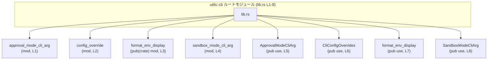

# utils\cli\src\lib.rs コード解説

## 0. ざっくり一言

`utils::cli` クレートのルートモジュールとして、CLI 関連のサブモジュールを宣言し、その中の代表的な要素を再エクスポートする「入り口」となっているファイルです（`lib.rs:L1-8`）。

---

## 1. このモジュールの役割

### 1.1 概要

- このモジュールは、CLI（コマンドラインインターフェイス）に関する機能をまとめるために存在し、4 つのサブモジュールを宣言しています（`lib.rs:L1-4`）。
- それぞれのサブモジュールから選択された要素を `pub use` で再エクスポートし、クレート利用者が `utils::cli::...` から直接使えるようにしています（`lib.rs:L5-8`）。
- 自身では関数や構造体の実装ロジックを持たず、モジュール構成と公開範囲の定義のみを行います。

### 1.2 アーキテクチャ内での位置づけ

このファイルは `utils::cli` クレートのルート（`src/lib.rs`）であり、CLI 関連コンポーネントの「集約点」として機能していると解釈できます。

以下は、本チャンクに現れるモジュール依存関係を示した図です。



※ 実際の型・関数の定義内容は、各サブモジュール側（`approval_mode_cli_arg` など）にあり、このチャンクには含まれていません。

### 1.3 設計上のポイント

コードから読み取れる設計上の特徴は次のとおりです。

- **責務の分割**
  - CLI 関連の機能を 4 つのモジュールに分割しています（`lib.rs:L1-4`）。
  - モジュール名から、承認モード、設定の上書き、環境表示のフォーマット、サンドボックスモードといった機能に分かれていると推測されますが、挙動の詳細はこのチャンクからは分かりません。
- **ファサード的な役割**
  - 具体的な実装はすべてサブモジュール側にあり、このファイルは `pub use` によって「よく使う要素」だけを表に出すファサード（窓口）のような構造になっています（`lib.rs:L5-8`）。
- **可視性の調整**
  - `format_env_display` モジュールのみ `pub(crate) mod` としてクレート内に公開されており（`lib.rs:L3`）、他はクレート内ではモジュール名を直接公開していません（`mod ...;` のまま, `lib.rs:L1-2,4`）。
  - 一方で、全ての再エクスポート対象（`ApprovalModeCliArg` など）は `pub use` によってクレート外からも利用可能です（`lib.rs:L5-8`）。
- **状態やロジックを持たない**
  - このファイル自身には関数や構造体の定義、グローバル状態、エラーハンドリング、並行処理は一切含まれていません（`lib.rs:L1-8`）。

---

## 2. 主要な機能一覧

このファイルが直接提供するのは「機能そのもの」ではなく、「機能へのアクセス経路」です。`pub use` されている要素と、それについてコードから分かる/分からない範囲を整理します。

- `ApprovalModeCliArg`（`lib.rs:L5`）
  - 承認モードに関する CLI 引数を表すものと名称からは想定されますが、型種別やフィールド構成などの詳細はこのチャンクには現れません。
- `CliConfigOverrides`（`lib.rs:L6`）
  - CLI を通じて設定値を上書きするための情報をまとめたものと名称からは想定されますが、具体的な API は不明です。
- `format_env_display`（`lib.rs:L7`）
  - 「環境（env）の表示を整形する何らかの機能」と推測される名前の要素ですが、関数か定数かなど種別とシグネチャはこのチャンクからは判別できません。
- `SandboxModeCliArg`（`lib.rs:L8`）
  - サンドボックスモードに関する CLI 引数を表すものと名称からは想定されますが、実際の定義はサブモジュール側にあります。

> 上記の用途に関する記述は**命名からの推測**であり、実際の挙動は各モジュールの実装を確認する必要があります。

---

## 3. 公開 API と詳細解説

### 3.1 コンポーネントインベントリー

#### 3.1.1 サブモジュール一覧

Rust の `mod name;` 宣言から、同ディレクトリ内に `name.rs` または `name/mod.rs` が存在すると分かります。

| モジュール名 | 可視性 | 宣言位置 | 想定される内容（※推測） |
|-------------|--------|----------|--------------------------|
| `approval_mode_cli_arg` | `mod`（親モジュール内のみ） | `lib.rs:L1` | 承認モード関連の CLI 引数・設定定義が含まれている可能性がありますが、このチャンクには中身がありません。 |
| `config_override` | `mod`（親モジュール内のみ） | `lib.rs:L2` | 設定値の上書き（オーバーライド）を扱う型やロジックが含まれている可能性がありますが、詳細不明です。 |
| `format_env_display` | `pub(crate) mod`（クレート内に公開） | `lib.rs:L3` | 環境情報の表示整形に関するロジックが含まれていると推測されますが、定義は本チャンクにはありません。 |
| `sandbox_mode_cli_arg` | `mod`（親モジュール内のみ） | `lib.rs:L4` | サンドボックスモード用 CLI 引数などが含まれている可能性がありますが、コードは未提示です。 |

※「想定される内容」はモジュール名からの推測であり、実際の定義は別ファイルに依存します。

#### 3.1.2 再エクスポートされる要素一覧

`pub use` により、クレート外部からも利用可能な名前として公開されている要素です。

| 名前 | 種別 | 元モジュール | 公開範囲 | 宣言位置（このファイル側） | 備考 |
|------|------|-------------|----------|---------------------------|------|
| `ApprovalModeCliArg` | 不明（型かどうかはこのチャンクでは判別不能） | `approval_mode_cli_arg` | `pub`（クレート外から利用可） | `lib.rs:L5` | 実体定義は `approval_mode_cli_arg` モジュール側にあります。 |
| `CliConfigOverrides` | 不明 | `config_override` | `pub` | `lib.rs:L6` | 実体定義は `config_override` モジュール側にあります。 |
| `format_env_display` | 不明（関数名のように見えますが未確定） | `format_env_display` | `pub` | `lib.rs:L7` | モジュール自体は `pub(crate) mod`（`lib.rs:L3`）ですが、この名前は `pub use` で外部公開されています。 |
| `SandboxModeCliArg` | 不明 | `sandbox_mode_cli_arg` | `pub` | `lib.rs:L8` | 実体定義は `sandbox_mode_cli_arg` モジュール側にあります。 |

### 3.2 関数詳細（format_env_display）

このファイルには `format_env_display` の**定義**や**シグネチャ**が含まれていないため、詳細は不明です（`lib.rs:L3, L7`）。

#### `format_env_display`（シグネチャ不明）

**概要**

- `format_env_display` という名前の要素が `format_env_display` モジュールから `pub use` されています（`lib.rs:L7`）。
- 関数である可能性が高い命名ですが、このチャンクには型情報・引数・戻り値が一切現れないため、関数か定数かトレイトか等は断定できません。

**引数**

- このファイルにはシグネチャが記載されていないため、不明です。

**戻り値**

- 不明です。

**内部処理の流れ**

- 定義がサブモジュール側（`format_env_display`）にあり、このチャンクに現れていないため不明です。

**Examples（使用例）**

- シグネチャが不明なため、具体的な呼び出し方法（どの型を渡し、何が返るか）をこのチャンクだけから示すことはできません。

**Errors / Panics**

- どのような条件でエラーや panic が発生しうるか、このファイルには情報がありません。

**Edge cases（エッジケース）**

- エッジケースに関する挙動も、定義コードがないため不明です。

**使用上の注意点**

- 利用者は `format_env_display` がどういう API を持つかを知るために、`format_env_display` モジュールの定義ファイルを確認する必要があります（`pub(crate) mod format_env_display;` が参照するファイル）。
- このファイルから分かるのは、「`utils::cli::format_env_display` という名前がクレート外から利用できる」という事実のみです（`lib.rs:L3,7`）。

### 3.3 その他の関数

- この `lib.rs` 内で**新たに定義されている**関数はありません。すべての機能はサブモジュール側に委譲されています（`lib.rs:L1-8`）。

---

## 4. データフロー（および呼び出し経路）

このファイル自身には実行時ロジック（if 文、ループ、関数本体など）は存在しないため、厳密な「データフロー」はありません。  
ただし、**名前解決の経路**として、外部コードからサブモジュール内の実装へアクセスする流れを図示できます。

```mermaid
sequenceDiagram
    participant App as "アプリケーションコード\n（他クレート）"
    participant Cli as "utils::cli\n(lib.rs L1-8)"
    participant FmtMod as "format_env_display\nモジュール"

    App->>Cli: format_env_display(...)\nを呼び出し（名前解決）
    Note right of Cli: `pub use format_env_display::format_env_display;`\nにより `utils::cli::format_env_display` が公開されている（L7）

    Cli->>FmtMod: format_env_display(...)\nの実体を解決
    FmtMod-->>App: 結果を返す\n（具体的な型・挙動は本チャンクでは不明）
```

この図は「名前がどこからどこへ再エクスポートされているか」を表すものであり、実際の処理内容・エラーハンドリング・並行処理の有無などはサブモジュール側の実装に依存します。

---

## 5. 使い方（How to Use）

### 5.1 基本的な使用方法

このファイルの役割は「CLI 関連コンポーネントをルートから使いやすく公開する」ことです。  
他クレートからの基本的なインポート例は次のようになります。

```rust
// 他クレートから utils::cli を利用する例
use utils::cli::{
    ApprovalModeCliArg,
    CliConfigOverrides,
    SandboxModeCliArg,
    format_env_display,
};

// 実際にどう構築・呼び出すか（コンストラクタやメソッドなど）は
// 各モジュールの定義内容に依存するため、このファイルだけからは分かりません。
```

ここで重要なのは、**サブモジュールではなくルートモジュールからインポートできる**ことです（`pub use` による再エクスポート、`lib.rs:L5-8`）。

### 5.2 よくある使用パターン（想定）

このチャンクから具体的なメソッド呼び出しまでは分かりませんが、パターンとしては次のような使い方が想定されます（※使い方の細部は実装確認が必要です）。

- バイナリクレートの `main` 関数や CLI パーサーの設定部分で、`ApprovalModeCliArg` / `SandboxModeCliArg` / `CliConfigOverrides` を使用して CLI 引数や設定を表現する。
- 取得した設定や環境情報を `format_env_display`（関数であれば）に渡し、ユーザ向けの表示文字列を生成する。

上記は「このファイルから推測される典型的な役割」であり、**正確な API は必ず定義元モジュールを参照する必要があります**。

### 5.3 よくある間違い（インポートパス）

このファイルの構造から考えられる誤用例と、その修正版を示します。

```rust
// 誤り例: サブモジュール経由でインポートしようとしている
// use utils::cli::approval_mode_cli_arg::ApprovalModeCliArg;
// ↑ approval_mode_cli_arg モジュールは lib.rs では単なる `mod` 宣言（L1）であり、
//   外部クレートからは可視ではないためコンパイルエラーになります。

// 正しい例: ルートモジュールから再エクスポートされた名前を使う
use utils::cli::ApprovalModeCliArg; // OK: `pub use` により公開されている（lib.rs:L5）
```

同様に、`CliConfigOverrides` や `SandboxModeCliArg`、`format_env_display` も **サブモジュール名を経由せず** `utils::cli::名前` で利用するのが正しいパスです（`lib.rs:L6-8`）。

### 5.4 使用上の注意点（まとめ）

- **インポートはルートから**
  - サブモジュール（`approval_mode_cli_arg` など）はクレート外からは見えないため、必ず `utils::cli::ApprovalModeCliArg` のようにルートからインポートします（`lib.rs:L1-2,4,5-8`）。
- **API の詳細はサブモジュールを参照**
  - このファイルだけでは、各要素の型・メソッド・エラー挙動・並行性の扱いなどは分かりません。利用・変更時には、対応する `*.rs` ファイルの実装を確認する必要があります。
- **言語固有の安全性・エラー・並行性**
  - この `lib.rs` 自体はコンパイル時のモジュール宣言と再エクスポートのみであり、実行時のエラーや並行処理に関するコードは含まれていません（`lib.rs:L1-8`）。
  - メモリ安全性やエラー伝播、スレッドセーフ性はサブモジュールの実装側に委ねられています。

---

## 6. 変更の仕方（How to Modify）

### 6.1 新しい機能を追加する場合

CLI 関連の新しい機能をこのクレートに追加する場合、`lib.rs` の構造から次のような手順になると考えられます。

1. **サブモジュールファイルを作成する**
   - 例: `utils/cli/src/new_feature.rs` または `utils/cli/src/new_feature/mod.rs` を作成する。
2. **`lib.rs` にモジュールを追加する**
   - `mod new_feature;` を `lib.rs` に追加する（このファイルと同じパターン、`lib.rs:L1-4` を参照）。
3. **必要な要素を再エクスポートする**
   - 新モジュール内で定義した型や関数のうち、クレート外から利用させたいものを `pub use new_feature::SomeItem;` のように `lib.rs` に追加する（`lib.rs:L5-8` に倣う）。
4. **クレート全体のビルドとテスト**
   - 変更後にコンパイル・テストを実行し、新しい公開 API を利用するコードが正しく動作するか確認します。

### 6.2 既存の機能を変更する場合

`lib.rs` 自体を変更する際のポイントです。

- **再エクスポートの削除・名前変更**
  - `pub use` の削除や名前変更（例: `ApprovalModeCliArg` を公開しないようにする）は、クレート外部の利用コードに直接影響します。
  - 影響範囲を把握するために、クレート全体を検索し、`utils::cli::ApprovalModeCliArg` 等を参照している箇所を確認する必要があります。
- **可視性の変更**
  - `mod` を `pub(crate) mod` に変更すると、クレート内部の他モジュールから直接そのモジュールが参照できるようになります（`format_env_display` がこの形です、`lib.rs:L3`）。
  - 逆に `pub(crate) mod` を `mod` にすると、クレート内部でそのモジュールに直接依存しているコードがコンパイルエラーになる可能性があります。
- **契約・エッジケース**
  - この `lib.rs` は API の「入り口」であり、型や関数の契約（前提条件・戻り値の意味）を変えると、クライアントコードの期待とずれが生じます。
  - 実際の契約内容はサブモジュールの実装側に書かれているため、そちらも合わせて確認・変更する必要があります。
- **テストとの関係**
  - このチャンクにはテストコードは現れませんが、クレートには `tests/` あるいは `src` 内のモジュールテストが存在する可能性があります。
  - 再エクスポートの変更はテストコードのインポートパスにも影響しうるため、変更後はテスト一式を再実行することが重要です。

---

## 7. 関連ファイル

Rust のモジュール規則と `mod` 宣言から推測される関連ファイルをまとめます。  
※ 実際にどのファイル構成が取られているか（`foo.rs` か `foo/mod.rs` か）は、このチャンクだけでは分からないため両方を記載します。

| パス（候補） | 役割 / 関係 |
|-------------|------------|
| `utils/cli/src/approval_mode_cli_arg.rs` または `utils/cli/src/approval_mode_cli_arg/mod.rs` | `mod approval_mode_cli_arg;`（`lib.rs:L1`）で参照されるサブモジュール。`ApprovalModeCliArg` の実体定義が含まれていると考えられますが、このチャンクには現れません。 |
| `utils/cli/src/config_override.rs` または `utils/cli/src/config_override/mod.rs` | `mod config_override;`（`lib.rs:L2`）で参照されるサブモジュール。`CliConfigOverrides` の定義が存在するはずです。 |
| `utils/cli/src/format_env_display.rs` または `utils/cli/src/format_env_display/mod.rs` | `pub(crate) mod format_env_display;`（`lib.rs:L3`）で参照されるサブモジュール。`format_env_display` という名前の要素の実体定義が含まれます。 |
| `utils/cli/src/sandbox_mode_cli_arg.rs` または `utils/cli/src/sandbox_mode_cli_arg/mod.rs` | `mod sandbox_mode_cli_arg;`（`lib.rs:L4`）で参照されるサブモジュール。`SandboxModeCliArg` の定義が含まれると考えられます。 |

---

### このファイルに関するバグ・セキュリティ・パフォーマンス面のコメント（このチャンクから分かる範囲）

- **バグ・セキュリティ**
  - `lib.rs` は単にモジュールを宣言し名前を再エクスポートしているだけで、実行時に動くロジックや外部入力の処理を持たないため、このファイル単体から明白なバグやセキュリティ脆弱性は読み取れません（`lib.rs:L1-8`）。
  - 潜在的な問題は、主に「誤った要素を再エクスポートしてしまう」「本来非公開にしたいものを公開してしまう」といった**API の公開範囲**に関するものになります。
- **契約・エッジケース**
  - `pub use` によって公開された名前が「このクレートが外部に提供する契約（API）」になります。契約の中身（前提条件・戻り値・エラー挙動）はサブモジュール実装側で定義されており、このチャンクだけでは判断できません。
- **テスト**
  - このチャンクにはテストに関する記述はありません。API 変更時には、クレートに付属するテストコード（別ファイル）を確認する必要があります。
- **パフォーマンス / スケーラビリティ**
  - この `lib.rs` の処理はコンパイル時のシンボル解決にのみ関係し、ランタイムのパフォーマンスやスケーラビリティに直接的な影響はほぼありません。
- **観測性（ログなど）**
  - ログ出力やメトリクスの収集は行っておらず、観測性に関するコードもこのファイルには存在しません。

このように、`utils/cli/src/lib.rs` は「CLI 関連機能への入口と公開範囲を定義する」ことに特化したファイルであり、実行時のコアロジックはすべてサブモジュール側に委ねられています。
