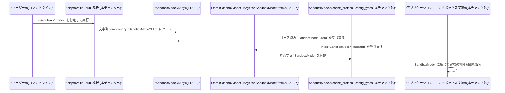

# utils/cli/src/sandbox_mode_cli_arg.rs コード解説

## 0. ざっくり一言

`--sandbox` / `-s` CLI オプションで指定するサンドボックスモードを表現するための列挙体 `SandboxModeCliArg` と、内部設定用の `SandboxMode` への変換を提供する薄いアダプタモジュールです。  
（根拠: ドキュメントコメントと定義 `utils/cli/src/sandbox_mode_cli_arg.rs:L1-7, L12-18, L20-27`）

---

## 1. このモジュールの役割

### 1.1 概要

- `clap::ValueEnum` を derive した列挙体 `SandboxModeCliArg` を定義し、CLI から `--sandbox` (`-s`) フラグで受け取る値を表現します。  
  （根拠: `ValueEnum` の use と derive `L9, L12-13`, ドキュメントコメント `L1-7`）
- 列挙体の各バリアントを、`codex_protocol::config_types::SandboxMode` に 1:1 で変換する `From<SandboxModeCliArg> for SandboxMode` を実装します。  
  （根拠: `SandboxMode` の use `L10`, `impl From` と `match` `L20-27`）
- ドキュメントコメント上、この列挙体は [`codex_protocol::protocol::SandboxPolicy`] のバリアントを「関連データなし」でミラーしており、CLI ではシンプルなフラグとして扱い、詳細設定は `-c` や `config.toml` に委ねる方針です。  
  （根拠: コメント `L1-7`）

### 1.2 アーキテクチャ内での位置づけ

このモジュールは、CLI レイヤで受け取った `--sandbox` の文字列を、アプリケーション内部で利用する `SandboxMode` に橋渡しします。


- このファイル内で定義されるのは `SandboxModeCliArg` と、それを `SandboxMode` へ変換する `From` 実装のみです。  
  （根拠: 列挙体定義と impl `L12-18, L20-27`）
- `SandboxMode` や実際のサンドボックス実装は、別モジュール（`codex_protocol` 側）に存在し、このチャンクには現れません。  
  （根拠: `use codex_protocol::config_types::SandboxMode; L10`）

### 1.3 設計上のポイント

- **CLI 専用の薄い型**  
  - `SandboxModeCliArg` は CLI で扱いやすいよう、関連データのない単純な列挙体になっています。  
    （根拠: コメントの「without any of the associated data」`L3-4`, バリアント定義 `L14-17`）
- **内部設定型との明示的変換**  
  - `impl From<SandboxModeCliArg> for SandboxMode` により、CLI 層と内部設定層を明確に分離しつつ、変換を型システムで保証しています。  
    （根拠: `impl From` `L20-27`）
- **エラーハンドリング方針**  
  - 変換は `match` による全バリアント網羅なので失敗しません（`Result` ではなく `Self` を直接返す）。  
    （根拠: `fn from(...) -> Self { match value { ... } } L21-27`）
  - CLI の文字列 → `SandboxModeCliArg` の変換中のエラーは `clap::ValueEnum` 側で扱われ、このモジュールのコードには現れません。  
    （根拠: `ValueEnum` derive `L12`, `use clap::ValueEnum L9`）
- **状態を持たない & 並行性**  
  - 列挙体はフィールドを持たない単純な値型であり、`Clone`/`Copy`/`Debug` を derive しているため、所有権・借用やスレッド間共有で特別な注意はほぼ不要です。  
    （根拠: `#[derive(Clone, Copy, Debug, ValueEnum)] L12`）

---

## 2. 主要な機能一覧

- `SandboxModeCliArg` 列挙体: `--sandbox` / `-s` CLI オプション用の値型を提供する。  
  （根拠: コメント `L1-7`, 列挙体 `L12-18`）
- `From<SandboxModeCliArg> for SandboxMode` 実装: CLI の値を内部設定型 `SandboxMode` に変換する。  
  （根拠: `impl From` `L20-27`）
- マッピングテスト: 列挙体の各バリアントが期待通りの `SandboxMode` に変換されることを検証するユニットテスト。  
  （根拠: テストモジュール `L30-46`）

---

## 3. 公開 API と詳細解説

### 3.1 型一覧（構造体・列挙体など）

| 名前 | 種別 | 役割 / 用途 | 定義箇所 |
|------|------|-------------|----------|
| `SandboxModeCliArg` | 列挙体 | `--sandbox` (`-s`) CLI オプションの値を表す。`clap::ValueEnum` を通じて CLI からパースされ、`SandboxMode` へ変換される。 | `utils/cli/src/sandbox_mode_cli_arg.rs:L12-18` |

`SandboxMode` 型はこのファイルでは定義されておらず、`codex_protocol::config_types` からインポートされる外部型です。  
（根拠: `use codex_protocol::config_types::SandboxMode; L10`）

### 3.2 関数詳細

#### `impl From<SandboxModeCliArg> for SandboxMode::from(value: SandboxModeCliArg) -> SandboxMode`

**概要**

`SandboxModeCliArg` の各バリアントを、対応する `SandboxMode` のバリアントに変換します。変換は常に成功し、エラーを返しません。  
（根拠: `impl From<SandboxModeCliArg> for SandboxMode { fn from(...) -> Self { match value { ... } } } L20-27`）

**引数**

| 引数名 | 型 | 説明 |
|--------|----|------|
| `value` | `SandboxModeCliArg` | CLI からパースされたサンドボックスモード指定。`ReadOnly` / `WorkspaceWrite` / `DangerFullAccess` のいずれかです。`L14-17, L21` |

**戻り値**

- 型: `SandboxMode` (`codex_protocol::config_types::SandboxMode`)  
- 意味: 引数 `value` と同じ意味を持つ内部設定用のサンドボックスモード。  
  （根拠: 戻り値型 `-> Self` かつ `impl ... for SandboxMode` `L20-21`, `match` の各アーム `L23-25`）

**内部処理の流れ（アルゴリズム）**

1. 引数 `value` のバリアントに応じて `match` 式を評価します。  
   （根拠: `match value { ... } L22-26`）
2. `SandboxModeCliArg::ReadOnly` の場合、`SandboxMode::ReadOnly` を返します。  
   （根拠: `SandboxModeCliArg::ReadOnly => SandboxMode::ReadOnly, L23`）
3. `SandboxModeCliArg::WorkspaceWrite` の場合、`SandboxMode::WorkspaceWrite` を返します。  
   （根拠: `WorkspaceWrite => SandboxMode::WorkspaceWrite, L24`）
4. `SandboxModeCliArg::DangerFullAccess` の場合、`SandboxMode::DangerFullAccess` を返します。  
   （根拠: `DangerFullAccess => SandboxMode::DangerFullAccess, L25`）
5. すべてのバリアントを網羅しているため、`match` は常にどれかの分岐に入り、関数は必ず `SandboxMode` を返します。  
   （根拠: 列挙体のバリアント数 `L14-17` と `match` のアーム数 `L23-25` が一致）

**使用例（基本）**

CLI から取得した `SandboxModeCliArg` を、内部処理で使う `SandboxMode` に変換する例です。

```rust
use codex_protocol::config_types::SandboxMode;                   // SandboxMode 型をインポートする
use crate::sandbox_mode_cli_arg::SandboxModeCliArg;              // 本モジュールの列挙体（実際のパスに応じて調整する）

fn configure_sandbox(mode_arg: SandboxModeCliArg) {              // CLI から受け取った SandboxModeCliArg を引数に取る
    let mode: SandboxMode = mode_arg.into();                     // From<SandboxModeCliArg> for SandboxMode に基づき、into() で変換する
    // ここで mode に応じてサンドボックスの設定を行う                       // mode を使って実際の権限制御を行うのは別モジュール
}
```

このコードでは、`into()` 呼び出しが `From<SandboxModeCliArg> for SandboxMode` の `from` を内部的に呼び出します。  
（根拠: From/Into トレイトの一般仕様 + 本ファイルの `impl From` `L20-27`）

**Errors / Panics**

- この関数自体は **エラーを返さず**, `panic!` も使用していません。  
  （根拠: 戻り値型が `Self` (`SandboxMode`) であり `Result` ではない `L20-21`、本体に `panic!` や `unwrap` 等がない `L21-27`）
- 不正な文字列入力など CLI レベルのエラーは `clap` によるパース段階で処理され、この関数には到達しません。  
  （根拠: `ValueEnum` derive による CLI パース責務の分離 `L9, L12-13`）

**Edge cases（エッジケース）**

- **未知のモード指定**  
  - CLI 上で定義されていない文字列が渡された場合、この関数が呼ばれる前に `clap` でエラーになります。`SandboxModeCliArg` の値としては到達しません。  
    （根拠: `SandboxModeCliArg` に定義されているバリアントは 3 つのみ `L14-17`）
- **新しいバリアント追加時**  
  - `SandboxModeCliArg` に新しいバリアントを追加すると、この `match` はコンパイル時に非網羅的と判断され、コンパイルエラーになります。マッピング漏れが実行時バグにならず、コンパイル時に検出される設計です。  
    （根拠: 現在全バリアントを `match` で明示的に列挙している `L22-25`）

**使用上の注意点**

- この変換は **意味的に 1:1** のマッピングを想定しており、`SandboxModeCliArg` と `SandboxMode` のバリアント名も一致しています。`SandboxMode` 側の意味が変わると、この変換の意味も変わるため、両者を同時に確認する必要があります。  
  （根拠: `ReadOnly` 等のバリアント名の一致 `L14-17, L23-25`）
- CLI で `DangerFullAccess` を選ぶと、内部でも `SandboxMode::DangerFullAccess` になります。これはサンドボックスをほぼ無効化するような動作を示唆する名称であり、デフォルト値に用いる際は権限設定上のリスクを考慮する必要があります。  
  （根拠: バリアント名 `DangerFullAccess` `L16, L25`）
- 並行性に関して、この関数は純粋関数であり、共有状態や I/O を扱っていません。複数スレッドから同時に呼び出しても問題ありません。  
  （根拠: 関数本体が単なる `match` と値の返却のみ `L21-27`）

### 3.3 その他の関数（補助・テスト）

| 関数名 | 役割（1 行） | 定義箇所 |
|--------|--------------|----------|
| `maps_cli_args_to_protocol_modes()` | 各 `SandboxModeCliArg` バリアントが期待通りの `SandboxMode` に変換されることを検証するテスト。 | `utils/cli/src/sandbox_mode_cli_arg.rs:L35-45` |

- このテストでは `ReadOnly` / `WorkspaceWrite` / `DangerFullAccess` の 3 つ全てについて `SandboxModeCliArg::<Variant>.into()` の結果が対応する `SandboxMode::<Variant>` と一致することを `assert_eq!` で確認しています。  
  （根拠: テスト本体 `L36-45`）

---

## 4. データフロー

ここでは、ユーザーが CLI で `--sandbox` を指定して実際のサンドボックス設定に反映されるまでの典型的なフローを示します。



- このファイルの責務は、`SandboxModeCliArg` と `SandboxMode` の間の変換（`Conv` 部分）に限定されます。  
  （根拠: `impl From` `L20-27`）
- CLI からの文字列パースや、`SandboxMode` に基づく実際のサンドボックス適用処理は、このチャンクには現れません。  
  （根拠: それらに相当するコードが本ファイルに存在しないこと）

---

## 5. 使い方（How to Use）

### 5.1 基本的な使用方法

`clap` の `Parser` と組み合わせて `--sandbox` オプションを扱う場合の典型例です。

```rust
use clap::Parser;                                                       // CLI 引数パーサーを derive するためのトレイト
use codex_protocol::config_types::SandboxMode;                          // 内部設定用の SandboxMode 型
use crate::sandbox_mode_cli_arg::SandboxModeCliArg;                     // 本ファイルの SandboxModeCliArg（実際のモジュールパスに合わせて修正する）

#[derive(Parser)]                                                       // CLI 引数構造体として derive
struct Args {
    /// サンドボックスモード (--sandbox / -s)                             // ヘルプに表示される説明
    #[arg(short = 's', long = "sandbox",                                // -s / --sandbox で指定可能
          default_value_t = SandboxModeCliArg::ReadOnly)]               // 指定がなければ ReadOnly をデフォルトにする
    sandbox: SandboxModeCliArg,                                         // clap が SandboxModeCliArg としてパースする
}

fn main() {
    let args = Args::parse();                                           // CLI から Args をパース
    let sandbox_mode: SandboxMode = args.sandbox.into();                // SandboxModeCliArg -> SandboxMode に変換
    // ここで sandbox_mode に応じてサンドボックス設定を適用する                  // 本ファイル外のロジックで権限制御を行う
}
```

この例では:

- `SandboxModeCliArg` が `ValueEnum` を derive しているため、`clap` は `ReadOnly` / `workspace-write` / `danger-full-access`（`kebab-case` 指定に基づく）等の文字列から適切なバリアントに変換できます。  
  （根拠: `#[value(rename_all = "kebab-case")] L13`, バリアント名 `L14-17`）
- アプリケーション内部では `SandboxMode` を使うため、`into()` による変換が必須です。  

### 5.2 よくある使用パターン

1. **CLI のみでモード切り替えを行う場合**

   - 単純に `ReadOnly` / `WorkspaceWrite` / `DangerFullAccess` の 3 種類から選んで挙動を切り替える。
   - 詳細なパラメータ調整は必要なく、スイッチ的に sandbox の強さだけ変えたい場合。  
     （根拠: ドキュメントコメントの「simple flag」「Users that need to tweak the advanced options ... via -c overrides or their config.toml」`L4-7`）

2. **高度な `workspace-write` 設定と併用**

   - CLI の `--sandbox workspace-write` で基本モードを指定しつつ、`-c` オプションや `config.toml` で fine-grained な書き込み制限を調整する。  
     （根拠: 同コメント `L5-7`）

### 5.3 よくある間違い（想定されるもの）

実装から推測される、起こりうる誤用例です。

```rust
// 想定される誤り例: 文字列を自前でパースしようとしている
fn from_str_to_mode(s: &str) -> SandboxMode {                      // &str から直接 SandboxMode に変換しようとしている
    match s {
        "read-only" => SandboxMode::ReadOnly,                      // CLI 側の表記ゆれや rename 規則を自前で再現する必要が出る
        _ => SandboxMode::DangerFullAccess,                        // 無効な値を危険なモードにフォールバックしてしまうなどのリスク
    }
}

// 推奨される例: clap + SandboxModeCliArg + From 実装を活用する
fn from_cli_arg(arg: SandboxModeCliArg) -> SandboxMode {           // CLI からは SandboxModeCliArg として受け取る
    arg.into()                                                     // 本ファイルの From 実装を通じて安全に変換
}
```

- CLI の文字列処理は `clap` に任せ、本ファイルが提供する変換を使うことで、表記ゆれや将来の変更に対する耐性が高まります。  

### 5.4 使用上の注意点（まとめ）

- `SandboxModeCliArg` は **詳細な設定値を持たない** ため、`workspace-write` の細かなチューニングは `-c` や `config.toml` のような別経路を併用する前提になっています。  
  （根拠: コメントの「without any of the associated data」「Users that need to tweak the advanced options ...」`L3-7`）
- `DangerFullAccess` は名前からして強い権限を意味し、サンドボックスの安全性を低下させる可能性があります。デフォルト値として採用しないなど、セキュリティポリシーに応じた運用上の制限が望まれます。  
  （根拠: バリアント名 `DangerFullAccess L16, L25`）
- このモジュール自体には I/O や共有状態がなく、関数も純粋関数であるため、性能・並行性の面で特別な配慮は不要です（大量に呼び出しても事実上コストは無視できます）。  
  （根拠: 本体が `match` のみ `L21-27`）

---

## 6. 変更の仕方（How to Modify）

### 6.1 新しい機能を追加する場合（例: 新しいサンドボックスモード）

1. **列挙体にバリアントを追加**

   - `SandboxModeCliArg` に新しいバリアントを追加します。  
     例: `StrictReadOnly` など。  
     （根拠: 現行バリアント定義 `L14-17`）

2. **`From` 実装の `match` を更新**

   - 追加したバリアントに対応する `SandboxMode` のバリアントを `match` に追加します。  
     （根拠: `match value { ... } L22-25`）

3. **テストの追加・更新**

   - `maps_cli_args_to_protocol_modes` テストに、新しいバリアントの `assert_eq!` を追加します。  
     （根拠: 既存テストが各バリアントを検証している `L36-45`）

4. **関連する外部型の確認**

   - `SandboxMode`（およびコメントで言及されている `SandboxPolicy`）にも対応するバリアントが存在するか、本チャンク外のコードを確認する必要があります。  
     （根拠: コメントの「mirrors the variants of SandboxPolicy」`L3-4`）

### 6.2 既存の機能を変更する場合

- **バリアント名の変更**

  - `SandboxModeCliArg` のバリアント名を変更した場合、`#[value(rename_all = "kebab-case")]` により CLI 表現も変わります（例: `ReadOnly` → `read-only`）。CLI 互換性への影響に注意が必要です。  
    （根拠: `#[value(rename_all = "kebab-case")] L13`, バリアント名 `L14-17`）
  - 同時に `SandboxMode` 側のバリアント名も変更しないと、`From` 実装の整合性が取れなくなります。  

- **マッピングの変更**

  - もし CLI のあるバリアントを内部的に別のモードにマップしたい場合（例: `DangerFullAccess` を内部的には `WorkspaceWrite` と同じ扱いにするなど）、`From` 実装の `match` を変更するだけで実現できますが、テストと実際のサンドボックス実装側の意図を必ず確認する必要があります。  
    （根拠: `match` アーム `L23-25`, テスト `L36-45`）

- **影響範囲の確認**

  - `SandboxModeCliArg` 自体を直接参照しているコード（このチャンクには現れませんが、他モジュールに存在する可能性があります）と、`SandboxMode` を使っているコードの両方を検索し、挙動の変化が意図通りか確認する必要があります。

---

## 7. 関連ファイル・関連型

| パス / シンボル | 役割 / 関係 |
|----------------|-------------|
| `codex_protocol::config_types::SandboxMode` | このファイルで `From<SandboxModeCliArg>` を実装している内部設定用のサンドボックスモード型。インポートのみで定義は本チャンク外。<br>（根拠: `use codex_protocol::config_types::SandboxMode; L10`, `impl From<...> for SandboxMode L20`） |
| `codex_protocol::protocol::SandboxPolicy` | ドキュメントコメントで参照される、より詳細なサンドボックスポリシー型。`SandboxModeCliArg` はそのバリアントを「関連データなし」でミラーする、と説明されています。定義はこのチャンクには現れません。<br>（根拠: コメント `L3-4`） |
| `clap::ValueEnum` | `SandboxModeCliArg` を CLI の値として扱うために derive されているトレイト。これにより、列挙体バリアントが CLI の文字列から自動でパースされます（実際のパース実装は本チャンク外）。<br>（根拠: `use clap::ValueEnum; L9`, `#[derive(..., ValueEnum)] L12`, `#[value(rename_all = "kebab-case")] L13`） |
| `pretty_assertions::assert_eq` | テストで `SandboxModeCliArg` → `SandboxMode` のマッピングを検証するために使用されるアサーションマクロ。<br>（根拠: `use pretty_assertions::assert_eq; L33`, テスト本体 `L36-45`） |

このファイル自体は非常に小さく、CLI 層と設定層の間の変換に特化したモジュールとなっています。
