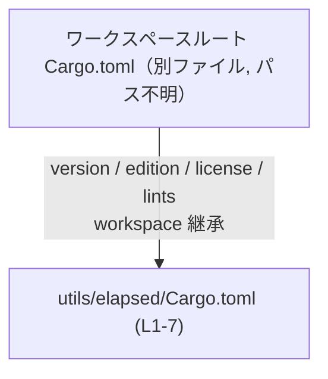
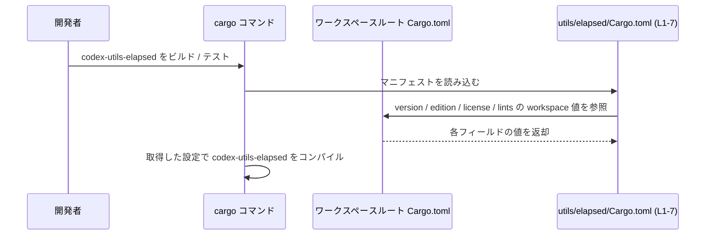

# utils/elapsed/Cargo.toml コード解説

## 0. ざっくり一言

`utils/elapsed/Cargo.toml` は、Rust クレート `codex-utils-elapsed` の Cargo マニフェストであり、クレート名のみをローカルに定義し、バージョン・エディション・ライセンスおよび lint 設定をすべてワークスペース共通設定から継承する構成になっています（utils/elapsed/Cargo.toml:L1-7）。

---

## 1. このモジュールの役割

### 1.1 概要

- Rust のビルドツール Cargo が読むマニフェストファイルです（L1-7）。
- パッケージ名（＝クレート名）を `codex-utils-elapsed` として定義しています（L2）。
- `version`, `edition`, `license` はワークスペース側の値を利用する指定になっています（L3-L5）。
- lint 設定も `[lints]` セクションでワークスペース共通設定に委譲しています（L6-L7）。

### 1.2 アーキテクチャ内での位置づけ

- このファイルは Cargo ワークスペース内の 1 クレートを表すマニフェストです。
- `*.workspace = true` という指定から、ワークスペースルートの `Cargo.toml` に共通の `version`, `edition`, `license`, `lints` 設定が存在する前提になっています（L3-L5, L7）。
- 実際の公開 API やコアロジック（Rust コード）は、別ファイル（例: `utils/elapsed/src/lib.rs` など）に存在すると考えられますが、このチャンクには現れていません。

この関係を簡単な依存関係図として表すと、次のようになります。



- 上記図の `EL` ノードが本チャンク（L1-7）のコード範囲に対応します。

### 1.3 設計上のポイント

- **メタデータの一元管理**  
  - `version.workspace = true`（L3）、`edition.workspace = true`（L4）、`license.workspace = true`（L5）により、これらの値をワークスペースルートに集約する設計になっています。
- **lint 設定の一元管理**  
  - `[lints]` セクションで `workspace = true` としており（L6-L7）、コンパイラ警告・エラーに関するポリシーもワークスペース全体で統一する構成です。
- **このファイルは状態やロジックを持たない**  
  - 関数・構造体・並行処理などの実装は含まれておらず、ビルド時メタデータの宣言のみを担当します。

---

## 2. 主要な機能一覧

### 2.1 コンポーネント一覧（インベントリー）

このファイルに現れる「コンポーネント」（クレート・セクション・設定項目）の一覧です。  
Rust の関数・構造体といったプログラム要素は定義されていません。

| コンポーネント | 種別 | 役割 / 説明 | 定義位置 |
|----------------|------|-------------|----------|
| `codex-utils-elapsed` | パッケージ（クレート）名 | このワークスペースメンバークレートの名前を表します。Cargo コマンドで `-p codex-utils-elapsed` と指定する際の識別子になります。 | utils/elapsed/Cargo.toml:L2 |
| `[package]` | Cargo セクション | パッケージ全体のメタデータ（name, version, edition, license など）をまとめるセクションです。 | utils/elapsed/Cargo.toml:L1-5 |
| `name = "codex-utils-elapsed"` | 設定項目 | このパッケージの `name` フィールドを `codex-utils-elapsed` に設定しています。 | utils/elapsed/Cargo.toml:L2 |
| `version.workspace = true` | 設定項目 | バージョン番号をワークスペースルートの対応する設定から継承する指定です。 | utils/elapsed/Cargo.toml:L3 |
| `edition.workspace = true` | 設定項目 | Rust エディション（例: 2021 など）をワークスペースルートから継承する指定です。 | utils/elapsed/Cargo.toml:L4 |
| `license.workspace = true` | 設定項目 | ライセンス表記をワークスペースルートで一元管理するための継承指定です。 | utils/elapsed/Cargo.toml:L5 |
| `[lints]` | Cargo セクション | コンパイラの lint（警告・エラーの扱い）に関する設定をまとめるセクションです。 | utils/elapsed/Cargo.toml:L6 |
| `workspace = true`（[lints] 内） | 設定項目 | lint 設定をワークスペースルートの `[lints]` セクションから継承する指定です。 | utils/elapsed/Cargo.toml:L7 |

**関数 / 構造体インベントリー**

- このファイルには Rust の関数・構造体・列挙体などの定義は存在しません（utils/elapsed/Cargo.toml:L1-7）。

### 2.2 機能リスト

- クレート名（パッケージ名）の宣言  
  - `name = "codex-utils-elapsed"` による定義（L2）。
- バージョン・エディション・ライセンスのワークスペース共有  
  - `version.workspace = true` / `edition.workspace = true` / `license.workspace = true` による継承設定（L3-L5）。
- lint ポリシーのワークスペース共有  
  - `[lints]` セクションで `workspace = true` とすることで、ワークスペース共通の lint 設定を適用（L6-L7）。

---

## 3. 公開 API と詳細解説

このファイルは Cargo マニフェストであり、Rust コードそのもの（関数・型・モジュール）の定義は含まれていません。そのため、**公開 API やコアロジックは本チャンクには一切現れていません**。

### 3.1 型一覧（構造体・列挙体など）

- Rust の型定義（構造体・列挙体・トレイトなど）は、このファイルには存在しません（L1-7）。
- 型に関する解説は、このクレートのソースコードファイル（例: `utils/elapsed/src/lib.rs` など）を参照する必要がありますが、それらはこのチャンクには含まれていないため詳細は不明です。

### 3.2 関数詳細（最大 7 件）

- このファイルには関数定義がないため、関数詳細テンプレートに沿って解説できる対象はありません（L1-7）。
- `codex-utils-elapsed` クレートの公開関数・メソッドは、別ファイルに実装されていると考えられますが、このチャンクには現れず、シグネチャや挙動は不明です。

### 3.3 その他の関数

- 補助関数やラッパー関数も、このファイルには定義されていません（L1-7）。

---

## 4. データフロー

このファイル自体は実行時ロジックを持ちませんが、**ビルド時** の設定解決という意味で、次のようなデータフローが存在します。

1. 開発者が `codex-utils-elapsed` クレートをビルドまたは利用する操作を行う。
2. Cargo が `utils/elapsed/Cargo.toml`（L1-7）を読み取る。
3. `version.workspace = true` / `edition.workspace = true` / `license.workspace = true` / `[lints] workspace = true` の各指定に従い、ワークスペースルートの `Cargo.toml` から対応する値を取得する。
4. 取得した値を用いて、このクレートをコンパイルする。

このビルド時の設定解決フローを sequence diagram で表すと次の通りです。



- この図は Cargo の一般的な挙動を示したものであり、実行時のデータ処理ではなく**ビルド時のメタデータ解決**を表現しています。
- 並行処理・エラー処理・メモリ安全性などの言語固有の実行時特性は、このファイルの範囲では扱われていません。

---

## 5. 使い方（How to Use）

### 5.1 基本的な使用方法

このファイルは既に必要最小限の構成になっており、通常は Cargo が自動的に参照します。  
ワークスペースルートからこのクレートをビルドする典型的な操作は次のようになります。

```bash
# ワークスペースルートで、特定クレートをビルドする例
cargo build -p codex-utils-elapsed
```

Cargo はここで `utils/elapsed/Cargo.toml`（L1-7）を読み取り、`workspace = true` の項目についてはワークスペースルートの設定を参照します。

ワークスペースルートの `Cargo.toml` で、このクレートをメンバーとして登録する一般的な例は次のようになります（**あくまで例であり、実際のリポジトリ構成はこのチャンクからは分かりません**）。

```toml
[workspace]
members = [
    "utils/elapsed",  # 本ファイルが置かれているディレクトリへの相対パスの例
    # 他のメンバー...
]
```

### 5.2 よくある使用パターン

このファイルの役割はメタデータ宣言のみのため、使用パターンは主に「依存として参照する」「ビルド対象として指定する」の 2 つです。

1. **同一ワークスペース内の別クレートから依存として参照する例**

   ```toml
   # 別クレートの Cargo.toml の例（あくまで使用例）
   [dependencies]
   codex-utils-elapsed = { path = "utils/elapsed" }
   ```

   - これにより、別クレートは `codex-utils-elapsed` の公開 API を利用できます。
   - 実際の API（関数・型）は、このチャンクでは不明です。

2. **コマンドラインで対象クレートを指定する例**

   ```bash
   # テストを実行
   cargo test -p codex-utils-elapsed

   # ドキュメントを生成
   cargo doc -p codex-utils-elapsed
   ```

### 5.3 よくある間違い（この設定に関連しうるもの）

実装（L1-7）と Cargo の一般的な仕様から、起こりうる誤りとして次のようなものが考えられます。

```toml
[package]
name = "codex-utils-elapsed"
version.workspace = true      # L3
edition.workspace = true      # L4
license.workspace = true      # L5
```

- **ワークスペース側に対応するフィールドが存在しない**  
  - `version.workspace = true` などの指定を使う場合、ワークスペースルートの `Cargo.toml` に対応するフィールドが定義されている必要があります。
  - 定義がない場合、Cargo はビルド時にエラーを出す可能性があります（Cargo の一般仕様による）。
- **単体クレートとして使用しようとする**  
  - `*.workspace = true` を含むマニフェストは、ワークスペース外単体では成立しないため、ワークスペース外で `cargo build` する構成は適合しません。

### 5.4 使用上の注意点（まとめ）

- このファイルは **実行時のロジックを持たず、並行性・メモリ安全性・エラー処理** といった言語仕様レベルの問題には直接関与しません。
- `version.workspace = true` などの指定は、**ワークスペースルートの設定が前提条件**です。ルート側の設定変更や削除が、このクレートにも影響します（L3-L5, L7）。
- lint 設定もワークスペース共通のものがそのまま適用されます（L6-L7）。このクレートだけ別ポリシーにしたい場合は、このファイル側で個別設定を追加・上書きする必要があります（詳細な方法は Cargo の lint 機能仕様に依存します）。
- 依存関係・機能フラグ（`[dependencies]`, `[features]` など）は、このファイルには現れていません。このクレートの依存構成や機能フラグは、このチャンクからは把握できません。

---

## 6. 変更の仕方（How to Modify）

### 6.1 新しい機能を追加する場合

ここでは、「新しい機能」を **クレートのコードやメタデータを増やすこと**として説明します。

1. **実際の機能コードを追加する場合（一般的な Rust プロジェクト構成に基づく説明）**
   - 通常は `utils/elapsed/src/lib.rs` や `utils/elapsed/src/main.rs` に Rust コードを追加します。
   - この `Cargo.toml` は、クレート名やメタデータを提供するのみで、コードは別ファイルに置くのが一般的です。
   - これらのファイルはこのチャンクには現れないため、実際に存在するかどうかは不明です。

2. **依存クレートや feature を追加したい場合**
   - この `Cargo.toml` に新たなセクションを追加するのが自然です。例（あくまで追加方法の例示）:

     ```toml
     [dependencies]
     # 依存クレートの例
     anyhow = "1.0"
     ```

   - 現在のファイルには `[dependencies]` セクションは存在しないため（L1-7）、追加の場合は新規にセクションを定義することになります。

3. **メタデータ項目をクレート固有にしたい場合**
   - 例えば、このクレートだけライセンスを変えたい場合は、下記のような変更パターンが一般的です（例示）:

     ```toml
     [package]
     name = "codex-utils-elapsed"
     # license.workspace = true を削除し、個別 license を記述する例
     license = "MIT"
     ```

   - これは設計方針の変更になるため、ワークスペース全体での運用ポリシーとの整合性が必要です。

### 6.2 既存の機能を変更する場合

既存設定を変更する際に確認すべき観点です。

- **影響範囲の確認**
  - `version.workspace = true` など、`workspace = true` と書かれた項目は、ワークスペースルートの設定に依存します（L3-L5, L7）。
  - ルート側の設定を変更すると、このクレートを含む複数クレートに影響するため、他クレートとの整合性を確認する必要があります。
- **前提条件（契約）の維持**
  - このクレートが「ワークスペース共通のバージョン・ライセンスを利用する」という前提で他の設定やドキュメンテーションが書かれている可能性があります。その前提（契約）を変えるときは、関連箇所の見直しが必要です。
- **ビルドエラーの確認**
  - `*.workspace = true` を削除したり変更したりした場合、Cargo が要求する必須フィールド（例えば `version` など）が満たされているか、`cargo check` や `cargo build` で確認する必要があります。
- **lint 設定の変更**
  - `[lints] workspace = true` をやめて個別設定にする場合、このクレートと他クレートで lint ポリシーが変わることになります。ビルドやレビューのプロセス上、その影響を把握しておく必要があります。

---

## 7. 関連ファイル

このファイルと密接に関係するファイル・ディレクトリを、コードから読み取れる範囲と Cargo の一般仕様に基づいて整理します。

| パス | 役割 / 関係 |
|------|------------|
| `utils/elapsed/Cargo.toml` | 本チャンクの対象ファイルです。`codex-utils-elapsed` クレートのマニフェストとして、クレート名とワークスペース継承設定を定義します（L1-7）。 |
| （パス不明）ワークスペースルートの `Cargo.toml` | `version.workspace = true`（L3）、`edition.workspace = true`（L4）、`license.workspace = true`（L5）、`[lints] workspace = true`（L7）で参照される設定の定義元です。ワークスペースルートであることは Cargo の仕様から必須ですが、具体的なパスはこのチャンクには現れません。 |
| `utils/elapsed/src/...`（存在は不明・一般的な構成例） | `codex-utils-elapsed` クレートの公開 API やコアロジック（関数・構造体など）は通常ここに実装されます。ただし、このチャンクにはファイル構成が現れていないため、実在するかどうかは不明です。 |

---

### 安全性・エラー・並行性に関するまとめ

- このファイルは **ビルド設定のみ** を扱っており、Rust の実行時安全性（メモリ安全・スレッド安全）やエラー処理、並行性ロジックは含まれていません。
- `*.workspace = true` の指定に関連するエラーは、Cargo がビルド時に発生させる構成エラーであり、実行時のパニックや未定義動作とは性質が異なります。
- このため、**公開 API とコアロジックに関する安全性・エラー・並行性の検討は、別途ソースコードファイル（例: `src/lib.rs`）を対象として行う必要があります**。
